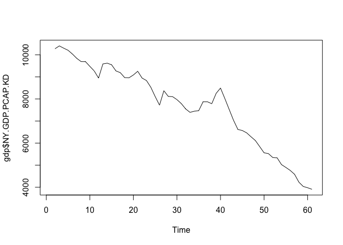

Práctica 1. Introducción
================
Ana Escoto
24/09/2020

# Primer acercamiento al uso del programa

En RStudio podemos tener varias ventanas que nos permiten tener más
control de nuestro “ambiente”, el historial, los “scripts” o códigos que
escribimos y por supuesto, tenemos nuestra consola, que también tiene el
símbolo “\>” con R. Podemos pedir operaciones básicas

``` r
2+5
```

    ## [1] 7

``` r
5*3
```

    ## [1] 15

``` r
#Para escribir comentarios y que no los lea como operaciones ponemos el símbolo de gato
# Lo podemos hacer para un comentario en una línea o la par de una instrucción
1:5               # Secuencia 1-5
```

    ## [1] 1 2 3 4 5

``` r
seq(1, 10, 0.5)   # Secuencia con incrementos diferentes a 1
```

    ##  [1]  1.0  1.5  2.0  2.5  3.0  3.5  4.0  4.5  5.0  5.5  6.0  6.5  7.0  7.5  8.0
    ## [16]  8.5  9.0  9.5 10.0

``` r
c('a','b','c')  # Vector con caracteres
```

    ## [1] "a" "b" "c"

``` r
1:7             # Entero
```

    ## [1] 1 2 3 4 5 6 7

``` r
40<80           # Valor logico
```

    ## [1] TRUE

``` r
2+2 == 5        # Valor logico
```

    ## [1] FALSE

``` r
T == TRUE       # T expresion corta de verdadero
```

    ## [1] TRUE

R es un lenguaje de programación por objetos. Por lo cual vamos a tener
objetos a los que se les asigna su contenido. Si usamos una flechita
“\<-” o “-\>” le estamos asignando algo al objeto que apunta la
felcha.

``` r
x <- 24         # Asignacion de valor 24 a la variable x para su uso posterior (OBJETO)
x/2             # Uso posterior de variable u objeto x
```

    ## [1] 12

``` r
x               # Imprime en pantalla el valor de la variable u objeto
```

    ## [1] 24

``` r
x <- TRUE       # Asigna el valor logico TRUE a la variable x OJO: x toma el ultimo valor que se le asigna
x
```

    ## [1] TRUE

## Vectores

Los vectores son uno de los objetos más usados en R.

``` r
y <- c(2,4,6)     # Vector numerico
y <- c('Primaria', 'Secundaria') # Vector caracteres
```

Dado que poseen elementos, podemos también observar y hacer operaciones
con sus elementos, usando “\[ \]” para acceder a ellos

``` r
y[2]              # Acceder al segundo valor del vector y
```

    ## [1] "Secundaria"

``` r
y[3] <- 'Preparatoria y más' # Asigna valor a la tercera componente del vector
sex <-1:2         # Asigna a la variable sex los valores 1 y 2
names(sex) <- c("Femenino", "Masculino") # Asigna nombres al vector de elementos sexo
sex[2]            # Segundo elemento del vector sex
```

    ## Masculino 
    ##         2

## Matrices

Las matrices son muy importantes, porque nos permiten hacer operaciones
y casi todas nuestras bases de datos tendran un aspecto de matriz.

``` r
m <- matrix (nrow=2, ncol=3, 1:6, byrow = TRUE) # Matrices Ejemplo 1
m
```

    ##      [,1] [,2] [,3]
    ## [1,]    1    2    3
    ## [2,]    4    5    6

``` r
m <- matrix (nrow=2, ncol=3, 1:6, byrow = FALSE) # Matrices Ejemplo 1
m
```

    ##      [,1] [,2] [,3]
    ## [1,]    1    3    5
    ## [2,]    2    4    6

``` r
dim(m)
```

    ## [1] 2 3

``` r
attributes(m)
```

    ## $dim
    ## [1] 2 3

``` r
n <- 1:6     # Matrices Ejemplo 2
dim(n) <- c(2,3)
n
```

    ##      [,1] [,2] [,3]
    ## [1,]    1    3    5
    ## [2,]    2    4    6

``` r
xx <-10:12   # Matrices Ejemplo 3
yy<-14:16
cbind(xx,yy) # Une vectores por Columnas
```

    ##      xx yy
    ## [1,] 10 14
    ## [2,] 11 15
    ## [3,] 12 16

``` r
rbind(xx,yy) # Une vectores por Renglones
```

    ##    [,1] [,2] [,3]
    ## xx   10   11   12
    ## yy   14   15   16

``` r
mi_matrix<-cbind(xx,yy) # este resultado lo puedo asignar a un objeto
```

## Funciones

Algunas funciones básicas son las siguientes. Vamos a ir viendo más
funciones, pero para entender cómo funcionan, haremos unos ejemplos y
cómo pedir ayuda sobre ellas.

``` r
sum (10,20,30)    # Función suma
```

    ## [1] 60

``` r
rep('R', times=3) # Repite la letra R el numero de veces que se indica
```

    ## [1] "R" "R" "R"

``` r
sqrt(9)           # Raiz cuadrada de 9
```

    ## [1] 3

## Ayuda

Pedir ayuda es indispensable para aprender a escribir nuestros códigos.
A prueba y error, es el mejor sistema para aprender. Podemos usar la
función help, example y ?

``` r
help(sum)         # Ayuda sobre función sum
example(sum)      # Ejemplo de función sum
```

    ## 
    ## sum> ## Pass a vector to sum, and it will add the elements together.
    ## sum> sum(1:5)
    ## [1] 15
    ## 
    ## sum> ## Pass several numbers to sum, and it also adds the elements.
    ## sum> sum(1, 2, 3, 4, 5)
    ## [1] 15
    ## 
    ## sum> ## In fact, you can pass vectors into several arguments, and everything gets added.
    ## sum> sum(1:2, 3:5)
    ## [1] 15
    ## 
    ## sum> ## If there are missing values, the sum is unknown, i.e., also missing, ....
    ## sum> sum(1:5, NA)
    ## [1] NA
    ## 
    ## sum> ## ... unless  we exclude missing values explicitly:
    ## sum> sum(1:5, NA, na.rm = TRUE)
    ## [1] 15

## Mi ambiente

Todos los objetos que hemos declarado hasta ahora son parte de nuestro
“ambiente” (environment). Para saber qué está en nuestro ambiente
usamos el comando

``` r
ls()
```

    ## [1] "m"         "mi_matrix" "n"         "sex"       "x"         "xx"       
    ## [7] "y"         "yy"

``` r
gc()           # Garbage collection, reporta memoria en uso
```

    ##          used (Mb) gc trigger (Mb) limit (Mb) max used (Mb)
    ## Ncells 442929 23.7     936388 50.1         NA   658245 35.2
    ## Vcells 845581  6.5    8388608 64.0      16384  1801704 13.8

Para borrar todos nuestros objetos, usamos el siguiente comando, que
equivale a usar la escobita de la venta de environment

``` r
rm(list=ls())  # Borrar objetos actuales
```

## Directorio de trabajo

Es muy útil saber dónde estamos trabajando y donde queremos trabajar.
Por eso podemos utilizar los siguientes comandos para saberlo

Ojo, checa, si estás desdes una PC, cómo cambian las “" por”/" o por
“\\”

``` r
getwd()           # Directorio actual
```

    ## [1] "/Users/anaescoto/Dropbox/2020/2021-1 R para Demográfos/repo/R_Demo"

``` r
#setwd()
list.files()      # Lista de archivos en ese directorio
```

    ## [1] "_config.yml"  "datos"        "LICENSE"      "P1.html"      "P1.Rmd"      
    ## [6] "programa.pdf" "R_Demo.Rproj" "README.md"

Checar que esto también se puede hacer desde el menú: Session –\> Set
Working Directory –\> Choose

## Proyectos

Pero… a veces preferimos trabajar en proyectos, sobre todo porque nos da
más control.

Hay gente que lo dice mejor que yo, como Hadley Wickham:
<https://es.r4ds.hadley.nz/flujo-de-trabajo-proyectos.html>

# Instalación de librerías

Las librerías son útiles para realizar funciones especiales. La
especialización de paquetes es más rápida en R que en otros programas
por ser un software libre.

Vamos a instalar el paquete “foreign”, como su nombre lo indica, nos
permite leer elementos “extranjeros” en R. Es sumamente útil porque nos
permite leer casi todos los formatos, sin necesidad de usar paquetes
especializados como <i>StatTransfer</i>.

Para instalar las paqueterías usamos el siguiente comando
“install.packages()” Checa que adentro del paréntesis va el nombre de
la librería, con comillas.

Con la opción “dependencies = TRUE” R nos instalará no sólo la librería
o paquete que estamos pidiendo, sino todo aquellos paquetes que necesite
la librería en cuestión. Muchas veces los diseños de los paquetes
implican el uso de algún otro anterior. Por lo que poner esta sentencia
nos puede ahorrar errores cuando estemos usando el paquete. Piensa que
esto es similar a cuando enciendes tu computadora y tu sistema operativo
te pide que mantengas las actualizaciones.

Vamos a instalar dos librerías que nos permiten importar formatos.

``` r
#install.packages("foreign", dependencies = TRUE)
#install.packages("haven", dependencies = TRUE)
```

Este proceso no hay que hacerlo siempre. Si no sólo la primera vez. Una
vez instalado un paquete de librería, la llamamos con el comando
“library”

``` r
library(foreign)
library(haven)
```

“foreing” nos permite leer archivos en formato de dBase, con extensión
“.dbf”. Si bien no es un formato muy común para los investigadores, sí
para los que generan la información, puesto que dBase es uno de los
principales programas de administración de bases de datos.

He puesto un ejemplo de una base de datos mexicana en dbf, en este
formato.

``` r
ecovid0420<-read.dbf("./datos/ecovid0420.DBF") #checa cómo nos vamos adentro de nuestro directorio
```

# Dataframes

Vamos a instalar la librería “WDI” que nos da acceso a un grupo amplio
de bases de datos que nos ayudaran a revisar y analizar algunas técnicas
sencillas.

``` r
#install.packages("WDI", dependencies = TRUE)
library(WDI)
```

“El Banco Mundial pone a disposición una gran cantidad de datos
excelentes de los Indicadores de Desarrollo Mundial a través de su API
web. El paquete WDI para R facilita la búsqueda y descarga de series de
datos desde WDI”.

``` r
WDIsearch('gender')
```

    ##        indicator                                  
    ##   [1,] "2.3_GIR.GPI"                              
    ##   [2,] "2.6_PCR.GPI"                              
    ##   [3,] "5.51.01.07.gender"                        
    ##   [4,] "BI.EMP.PWRK.PB.FE.ZS"                     
    ##   [5,] "BI.EMP.PWRK.PB.MA.ZS"                     
    ##   [6,] "BI.EMP.TOTL.PB.FE.ZS"                     
    ##   [7,] "BI.EMP.TOTL.PB.MA.ZS"                     
    ##   [8,] "BI.WAG.PREM.PB.FE"                        
    ##   [9,] "BI.WAG.PREM.PB.MA"                        
    ##  [10,] "FB.FCP.BREG.PR.DI.SC"                     
    ##  [11,] "IC.REG.PRRT.LNDADM.GEN.XD.030.DB1719.DFRN"
    ##  [12,] "IQ.CPA.GNDR.XQ"                           
    ##  [13,] "PRJ.MYS.15UP.GPI"                         
    ##  [14,] "PRJ.MYS.25UP.GPI"                         
    ##  [15,] "SE.ADT.1524.LT.FM.ZS"                     
    ##  [16,] "SE.ENR.PRIM.FM.ZS"                        
    ##  [17,] "SE.ENR.PRSC.FM.ZS"                        
    ##  [18,] "SE.ENR.SECO.FM.ZS"                        
    ##  [19,] "SE.ENR.TERT.FM.ZS"                        
    ##  [20,] "SG.LAW.CRDD.GR"                           
    ##  [21,] "SG.LAW.NODC.HR"                           
    ##  [22,] "SG.NOD.CONS"                              
    ##  [23,] "UIS.AIR.1.Glast.GPI"                      
    ##  [24,] "UIS.AIR.1.GPI"                            
    ##  [25,] "UIS.AIR.2.GPV.GLAST.GPI"                  
    ##  [26,] "UIS.AIR.2.GPV.GPI"                        
    ##  [27,] "UIS.EA.1T6.AG25T99.GPI"                   
    ##  [28,] "UIS.EA.2T6.AG25T99.GPI"                   
    ##  [29,] "UIS.EA.3T6.AG25T99.GPI"                   
    ##  [30,] "UIS.EA.4T6.AG25T99.GPI"                   
    ##  [31,] "UIS.EA.5T8.AG25T99.GPI"                   
    ##  [32,] "UIS.EA.6T8.AG25T99.GPI"                   
    ##  [33,] "UIS.EA.7T8.AG25T99.GPI"                   
    ##  [34,] "UIS.EA.8.AG25T99.GPI"                     
    ##  [35,] "UIS.ECDP.1.GPI"                           
    ##  [36,] "UIS.GER.0.GPI"                            
    ##  [37,] "UIS.GER.01.GPI"                           
    ##  [38,] "UIS.GER.02.GPI"                           
    ##  [39,] "UIS.GER.12.GPI"                           
    ##  [40,] "UIS.GER.1t6.GPI"                          
    ##  [41,] "UIS.GER.2.GPI"                            
    ##  [42,] "UIS.GER.3.GPI"                            
    ##  [43,] "UIS.GER.4.GPI"                            
    ##  [44,] "UIS.GGR.1.GPI"                            
    ##  [45,] "UIS.GGR.2.GPI"                            
    ##  [46,] "UIS.GGR.5.A.GPI"                          
    ##  [47,] "UIS.LR.AG15T99.GPI"                       
    ##  [48,] "UIS.LR.AG25T64.GPI"                       
    ##  [49,] "UIS.LR.AG65.GPI"                          
    ##  [50,] "UIS.NAR.1.GPIA"                           
    ##  [51,] "UIS.NAR.1.Q1.GPIA"                        
    ##  [52,] "UIS.NAR.1.Q2.GPIA"                        
    ##  [53,] "UIS.NAR.1.Q3.GPIA"                        
    ##  [54,] "UIS.NAR.1.Q4.GPIA"                        
    ##  [55,] "UIS.NAR.1.Q5.GPIA"                        
    ##  [56,] "UIS.NAR.1.RUR.GPIA"                       
    ##  [57,] "UIS.NAR.1.URB.GPIA"                       
    ##  [58,] "UIS.NAR.2.GPIA"                           
    ##  [59,] "UIS.NAR.2.Q1.GPIA"                        
    ##  [60,] "UIS.NAR.2.Q2.GPIA"                        
    ##  [61,] "UIS.NAR.2.Q3.GPIA"                        
    ##  [62,] "UIS.NAR.2.Q4.GPIA"                        
    ##  [63,] "UIS.NAR.2.Q5.GPIA"                        
    ##  [64,] "UIS.NAR.2.RUR.GPIA"                       
    ##  [65,] "UIS.NAR.2.URB.GPIA"                       
    ##  [66,] "UIS.NART.2.GPIA"                          
    ##  [67,] "UIS.NART.2.Q1.GPIA"                       
    ##  [68,] "UIS.NART.2.Q2.GPIA"                       
    ##  [69,] "UIS.NART.2.Q3.GPIA"                       
    ##  [70,] "UIS.NART.2.Q4.GPIA"                       
    ##  [71,] "UIS.NART.2.Q5.GPIA"                       
    ##  [72,] "UIS.NART.2.RUR.GPIA"                      
    ##  [73,] "UIS.NART.2.URB.GPIA"                      
    ##  [74,] "UIS.NER.02.GPI"                           
    ##  [75,] "UIS.NER.1.GPI"                            
    ##  [76,] "UIS.NER.23.GPI"                           
    ##  [77,] "UIS.NERA.1.GPI"                           
    ##  [78,] "UIS.NERA.2.GPI"                           
    ##  [79,] "UIS.NERA.3.GPI"                           
    ##  [80,] "UIS.NERT.1.GPI"                           
    ##  [81,] "UIS.NERT.2.GPI"                           
    ##  [82,] "UIS.NERT.3.GPI"                           
    ##  [83,] "UIS.NIR.1.AGM1.GPI"                       
    ##  [84,] "UIS.NIR.1.AGP1.GPI"                       
    ##  [85,] "UIS.NIR.1.GPI"                            
    ##  [86,] "UIS.NIRA.1.GPI"                           
    ##  [87,] "UIS.REPP.1.GPI"                           
    ##  [88,] "UIS.REPP.2.GPV.GPI"                       
    ##  [89,] "UIS.SLE.02.GPI"                           
    ##  [90,] "UIS.SLE.1.GPI"                            
    ##  [91,] "UIS.SLE.123.GPI"                          
    ##  [92,] "UIS.SLE.1t6.GPI"                          
    ##  [93,] "UIS.SLE.23.GPI"                           
    ##  [94,] "UIS.SLE.4.GPI"                            
    ##  [95,] "UIS.SLE.56.GPI"                           
    ##  [96,] "UIS.SLEN.12.GPI"                          
    ##  [97,] "UIS.SR.1.G4.GPI"                          
    ##  [98,] "UIS.SR.1.G5.GPI"                          
    ##  [99,] "UIS.SR.1.GLAST.GPI"                       
    ## [100,] "UIS.SR.2.GPV.GLAST.GPI"                   
    ## [101,] "UIS.TRANRA.23.GPV.GPI"                    
    ## [102,] "UIS.TRTP.02.GPI"                          
    ## [103,] "UIS.TRTP.1.GPI"                           
    ## [104,] "UIS.TRTP.2.GPI"                           
    ## [105,] "UIS.TRTP.23.GPI"                          
    ## [106,] "UIS.TRTP.3.GPI"                           
    ## [107,] "UIS.TRTP.4.GPI"                           
    ##        name                                                                                                                                                           
    ##   [1,] "Gender parity index for gross intake ratio in grade 1"                                                                                                        
    ##   [2,] "Gender parity index for primary completion rate "                                                                                                             
    ##   [3,] "Gender equality"                                                                                                                                              
    ##   [4,] "Public sector employment as a share of paid employment by gender (Female)"                                                                                    
    ##   [5,] "Public sector employment as a share of paid employment by gender (Male)"                                                                                      
    ##   [6,] "Public sector employment as a share of total employment by gender (Female)"                                                                                   
    ##   [7,] "Public sector employment as a share of total employment by gender (Male)"                                                                                     
    ##   [8,] "Public sector wage premiums by gender (Female) (compared to all private employees) (%)"                                                                       
    ##   [9,] "Public sector wage premiums by gender (Male) (compared to all private employees) (%)"                                                                         
    ##  [10,] "589_Do laws and regulations prohibit or restrict discriminating consumers based on gender, ethnicity, faith, political affiliation, or appearance?  _#VHGA_03"
    ##  [11,] "Registering property: Quality of land administration index with Gender (0-30) (DB17-19 methodology) - Score"                                                  
    ##  [12,] "CPIA gender equality rating (1=low to 6=high)"                                                                                                                
    ##  [13,] "Wittgenstein Projection: Mean Years of Schooling. Age 15+. Gender Gap"                                                                                        
    ##  [14,] "Wittgenstein Projection: Mean Years of Schooling. Age 25+. Gender Gap"                                                                                        
    ##  [15,] "Literacy rate, youth (ages 15-24), gender parity index (GPI)"                                                                                                 
    ##  [16,] "School enrollment, primary (gross), gender parity index (GPI)"                                                                                                
    ##  [17,] "School enrollment, primary and secondary (gross), gender parity index (GPI)"                                                                                  
    ##  [18,] "School enrollment, secondary (gross), gender parity index (GPI)"                                                                                              
    ##  [19,] "School enrollment, tertiary (gross), gender parity index (GPI)"                                                                                               
    ##  [20,] "The law prohibits discrimination in access to credit based on gender (1=yes; 0=no)"                                                                           
    ##  [21,] "Law prohibits discrimination in employment based on gender (1=yes; 0=no)"                                                                                     
    ##  [22,] "Nondiscrimination clause mentions gender in the constitution (1=yes; 0=no)"                                                                                   
    ##  [23,] "Primary completion rate, gender parity index (GPI)"                                                                                                           
    ##  [24,] "Gross intake ratio to Grade 1 of primary education, gender parity index (GPI)"                                                                                
    ##  [25,] "Lower secondary completion rate, gender parity index (GPI)"                                                                                                   
    ##  [26,] "Gross intake ratio to Grade 1 of lower secondary general education, gender parity index (GPI)"                                                                
    ##  [27,] "UIS: Percentage of population age 25+ with at least completed primary education (ISCED 1 or higher). Gender Parity Index"                                     
    ##  [28,] "UIS: Percentage of population age 25+ with at least completed lower secondary education (ISCED 2 or higher). Gender Parity Index"                             
    ##  [29,] "UIS: Percentage of population age 25+ with at least completed upper secondary education (ISCED 3 or higher). Gender Parity Index"                             
    ##  [30,] "UIS: Percentage of population age 25+ with at least completed post-secondary education (ISCED 4 or higher). Gender Parity Index"                              
    ##  [31,] "UIS: Percentage of population age 25+ with at least a completed short-cycle tertiary degree (ISCED 5 or higher). Gender Parity Index"                         
    ##  [32,] "UIS: Percentage of population age 25+ with at least a completed bachelor's or equivalent degree (ISCED 6 or higher). Gender Parity Index"                     
    ##  [33,] "UIS: Percentage of population age 25+ with at least a completed master's degree or equivalent (ISCED 7 or higher). Gender Parity Index"                       
    ##  [34,] "UIS: Percentage of population age 25+ with a doctoral degree or equivalent (ISCED 8). Gender Parity Index"                                                    
    ##  [35,] "Percentage of new entrants to Grade 1 of primary education with early childhood education experience, gender parity index (GPI)"                              
    ##  [36,] "Gross enrolment ratio, pre-primary, gender parity index (GPI)"                                                                                                
    ##  [37,] "Gross enrolment ratio, early childhood educational development programmes, gender parity index (GPI)"                                                         
    ##  [38,] "Gross enrolment ratio, pre-primary, gender parity index (GPI)"                                                                                                
    ##  [39,] "Gross enrolment ratio, primary and lower secondary, gender parity index (GPI)"                                                                                
    ##  [40,] "Gross enrolment ratio, primary to tertiary, gender parity index (GPI)"                                                                                        
    ##  [41,] "Gross enrolment ratio, lower secondary, gender parity index (GPI)"                                                                                            
    ##  [42,] "Gross enrolment ratio, upper secondary, gender parity index (GPI)"                                                                                            
    ##  [43,] "Gross enrolment ratio, post-secondary non-tertiary, gender parity index (GPI)"                                                                                
    ##  [44,] "Gross graduation ratio from primary education, gender parity index (GPI)"                                                                                     
    ##  [45,] "Gross graduation ratio from lower secondary education, gender parity index (GPI)"                                                                             
    ##  [46,] "Gross graduation ratio from first degree programmes (ISCED 6 and 7) in tertiary education, gender parity index (GPI)"                                         
    ##  [47,] "Adult literacy rate, population 15+ years, gender parity index (GPI)"                                                                                         
    ##  [48,] "Literacy rate, population 25-64 years, gender parity index (GPI)"                                                                                             
    ##  [49,] "Elderly literacy rate, population 65+ years, gender parity index (GPI)"                                                                                       
    ##  [50,] "UIS: Net attendance rate, primary, adjusted gender parity index (GPIA)"                                                                                       
    ##  [51,] "UIS: Net attendance rate, primary, poorest quintile, adjusted gender parity index (GPIA)"                                                                     
    ##  [52,] "UIS: Net attendance rate, primary, second quintile, adjusted gender parity index (GPIA)"                                                                      
    ##  [53,] "UIS: Net attendance rate, primary, middle quintile, adjusted gender parity index (GPIA)"                                                                      
    ##  [54,] "UIS: Net attendance rate, primary, fourth quintile, adjusted gender parity index (GPIA)"                                                                      
    ##  [55,] "UIS: Net attendance rate, primary, richest quintile, adjusted gender parity index (GPIA)"                                                                     
    ##  [56,] "UIS: Net attendance rate, primary, rural, adjusted gender parity index (GPIA)"                                                                                
    ##  [57,] "UIS: Net attendance rate, primary, urban, adjusted gender parity index (GPIA)"                                                                                
    ##  [58,] "UIS: Net attendance rate, lower secondary, adjusted gender parity index (GPIA)"                                                                               
    ##  [59,] "UIS: Net attendance rate, lower secondary, poorest quintile, adjusted gender parity index (GPIA)"                                                             
    ##  [60,] "UIS: Net attendance rate, lower secondary, second quintile, adjusted gender parity index (GPIA)"                                                              
    ##  [61,] "UIS: Net attendance rate, lower secondary, middle quintile, adjusted gender parity index (GPIA)"                                                              
    ##  [62,] "UIS: Net attendance rate, lower secondary, fourth quintile, adjusted gender parity index (GPIA)"                                                              
    ##  [63,] "UIS: Net attendance rate, lower secondary, richest quintile, adjusted gender parity index (GPIA)"                                                             
    ##  [64,] "UIS: Net attendance rate, lower secondary, rural, adjusted gender parity index (GPIA)"                                                                        
    ##  [65,] "UIS: Net attendance rate, lower secondary, urban, adjusted gender parity index (GPIA)"                                                                        
    ##  [66,] "UIS: Total net attendance rate, lower secondary, adjusted gender parity index (GPIA)"                                                                         
    ##  [67,] "UIS: Total net attendance rate, lower secondary, poorest quintile, adjusted gender parity index (GPIA)"                                                       
    ##  [68,] "UIS: Total net attendance rate, lower secondary, second quintile, adjusted gender parity index (GPIA)"                                                        
    ##  [69,] "UIS: Total net attendance rate, lower secondary, middle quintile, adjusted gender parity index (GPIA)"                                                        
    ##  [70,] "UIS: Total net attendance rate, lower secondary, fourth quintile, adjusted gender parity index (GPIA)"                                                        
    ##  [71,] "UIS: Total net attendance rate, lower secondary, richest quintile, adjusted gender parity index (GPIA)"                                                       
    ##  [72,] "UIS: Total net attendance rate, lower secondary, rural, adjusted gender parity index (GPIA)"                                                                  
    ##  [73,] "UIS: Total net attendance rate, lower secondary, urban, adjusted gender parity index (GPIA)"                                                                  
    ##  [74,] "Net enrolment rate, pre-primary, gender parity index (GPI)"                                                                                                   
    ##  [75,] "Net enrolment rate, primary, gender parity index (GPI)"                                                                                                       
    ##  [76,] "Net enrolment rate, secondary, gender parity index (GPI)"                                                                                                     
    ##  [77,] "Adjusted net enrolment rate, primary, gender parity index (GPI)"                                                                                              
    ##  [78,] "Adjusted net enrolment rate, lower secondary, gender parity index (GPI)"                                                                                      
    ##  [79,] "Adjusted net enrolment rate, upper secondary, gender parity index (GPI)"                                                                                      
    ##  [80,] "Total net enrolment rate, primary, gender parity index (GPI)"                                                                                                 
    ##  [81,] "Total net enrolment rate, lower secondary, gender parity index (GPI)"                                                                                         
    ##  [82,] "Total net enrolment rate, upper secondary, gender parity index (GPI)"                                                                                         
    ##  [83,] "Net intake rate to Grade 1 of primary education by under-age entrants (-1 year), gender parity index (GPI)"                                                   
    ##  [84,] "Net intake rate to Grade 1 of primary education by over-age entrants (+1 year), gender parity index (GPI)"                                                    
    ##  [85,] "Net intake rate to Grade 1 of primary education, gender parity index (GPI)"                                                                                   
    ##  [86,] "Adjusted net intake rate to Grade 1 of primary education, gender parity index (GPI)"                                                                          
    ##  [87,] "Percentage of repeaters in primary education, all grades, gender parity index (GPI)"                                                                          
    ##  [88,] "Percentage of repeaters in lower secondary general education, all grades, gender parity index (GPI)"                                                          
    ##  [89,] "School life expectancy, pre-primary, gender parity index (GPI)"                                                                                               
    ##  [90,] "School life expectancy, primary, gender parity index (GPI)"                                                                                                   
    ##  [91,] "School life expectancy, primary and secondary, gender parity index (GPI)"                                                                                     
    ##  [92,] "School life expectancy, primary to tertiary, gender parity index (GPI)"                                                                                       
    ##  [93,] "School life expectancy, secondary, gender parity index (GPI)"                                                                                                 
    ##  [94,] "School life expectancy, post-secondary non-tertiary, gender parity index (GPI)"                                                                               
    ##  [95,] "School life expectancy, tertiary, gender parity index (GPI)"                                                                                                  
    ##  [96,] "School life expectancy, primary and lower secondary (excluding repetition), gender parity index (GPI)"                                                        
    ##  [97,] "Survival rate to Grade 4 of primary education, gender parity index (GPI)"                                                                                     
    ##  [98,] "Survival rate to Grade 5 of primary education, gender parity index (GPI)"                                                                                     
    ##  [99,] "Survival rate to the last grade of primary education, gender parity index (GPI)"                                                                              
    ## [100,] "Survival rate to the last grade of lower secondary general education, gender parity index (GPI)"                                                              
    ## [101,] "Effective transition rate from primary to lower secondary general education, gender parity index (GPI)"                                                       
    ## [102,] "Percentage of teachers in pre-primary education who are trained, gender parity index (GPI)"                                                                   
    ## [103,] "Percentage of teachers in primary education who are trained, gender parity index (GPI)"                                                                       
    ## [104,] "Percentage of teachers in lower secondary education who are trained, gender parity index (GPI)"                                                               
    ## [105,] "Percentage of teachers in secondary education who are trained, gender parity index (GPI)"                                                                     
    ## [106,] "Percentage of teachers in upper secondary education who are trained, gender parity index (GPI)"                                                               
    ## [107,] "Percentage of teachers in post-secondary non-tertiary education who are trained, gender parity index (GPI)"

Para saber un poco más de esta librería
<https://cran.r-project.org/web/packages/WDI/WDI.pdf>

También acá <https://www.r-project.org/nosvn/pandoc/WDI.html>

``` r
WDI(country = "all",
    indicator = "NY.GDP.PCAP.KD",
    start = 1960,
    end = 2020,
    extra = FALSE,
    cache = NULL)
```

    ##       iso2c                                              country NY.GDP.PCAP.KD
    ## 1        1A                                           Arab World             NA
    ## 2        1A                                           Arab World      6437.1668
    ## 3        1A                                           Arab World      6465.4744
    ## 4        1A                                           Arab World      6454.4596
    ## 5        1A                                           Arab World      6506.2712
    ## 6        1A                                           Arab World      6418.0287
    ## 7        1A                                           Arab World      6350.8380
    ## 8        1A                                           Arab World      6333.0274
    ## 9        1A                                           Arab World      6274.1111
    ## 10       1A                                           Arab World      6020.4869
    ## 11       1A                                           Arab World      5934.2907
    ## 12       1A                                           Arab World      5806.1853
    ## 13       1A                                           Arab World      5922.2660
    ## 14       1A                                           Arab World      5734.4921
    ## 15       1A                                           Arab World      5618.1292
    ## 16       1A                                           Arab World      5400.5401
    ## 17       1A                                           Arab World      5224.7292
    ## 18       1A                                           Arab World      4886.3494
    ## 19       1A                                           Arab World      4740.5372
    ## 20       1A                                           Arab World      4814.8758
    ## 21       1A                                           Arab World      4842.6121
    ## 22       1A                                           Arab World      4690.7611
    ## 23       1A                                           Arab World      4707.3644
    ## 24       1A                                           Arab World      4569.0264
    ## 25       1A                                           Arab World      4481.6977
    ## 26       1A                                           Arab World      4384.5285
    ## 27       1A                                           Arab World      4400.1193
    ## 28       1A                                           Arab World      4374.3552
    ## 29       1A                                           Arab World      4350.1176
    ## 30       1A                                           Arab World      4220.2068
    ## 31       1A                                           Arab World      4270.7441
    ## 32       1A                                           Arab World      3914.5747
    ## 33       1A                                           Arab World      3931.7768
    ## 34       1A                                           Arab World      3829.5985
    ## 35       1A                                           Arab World      3960.7559
    ## 36       1A                                           Arab World      3894.8691
    ## 37       1A                                           Arab World      4106.6481
    ## 38       1A                                           Arab World      4175.8034
    ## 39       1A                                           Arab World      4621.8460
    ## 40       1A                                           Arab World      5244.0545
    ## 41       1A                                           Arab World      5259.3304
    ## 42       1A                                           Arab World      4976.4418
    ## 43       1A                                           Arab World      4609.5628
    ## 44       1A                                           Arab World      4793.9209
    ## 45       1A                                           Arab World      4573.9470
    ## 46       1A                                           Arab World      4074.1573
    ## 47       1A                                           Arab World             NA
    ## 48       1A                                           Arab World             NA
    ## 49       1A                                           Arab World             NA
    ## 50       1A                                           Arab World             NA
    ## 51       1A                                           Arab World             NA
    ## 52       1A                                           Arab World             NA
    ## 53       1A                                           Arab World             NA
    ## 54       1A                                           Arab World             NA
    ## 55       1A                                           Arab World             NA
    ## 56       1A                                           Arab World             NA
    ## 57       1A                                           Arab World             NA
    ## 58       1A                                           Arab World             NA
    ## 59       1A                                           Arab World             NA
    ## 60       1A                                           Arab World             NA
    ## 61       1A                                           Arab World             NA
    ## 62       S3                               Caribbean small states             NA
    ## 63       S3                               Caribbean small states      9012.5987
    ## 64       S3                               Caribbean small states      8985.8974
    ## 65       S3                               Caribbean small states      8921.6845
    ## 66       S3                               Caribbean small states      8987.1919
    ## 67       S3                               Caribbean small states      9192.7724
    ## 68       S3                               Caribbean small states      9150.6041
    ## 69       S3                               Caribbean small states      9168.5809
    ## 70       S3                               Caribbean small states      9165.2892
    ## 71       S3                               Caribbean small states      9118.6405
    ## 72       S3                               Caribbean small states      9086.8948
    ## 73       S3                               Caribbean small states      9032.8065
    ## 74       S3                               Caribbean small states      9442.2978
    ## 75       S3                               Caribbean small states      9384.8418
    ## 76       S3                               Caribbean small states      9150.3203
    ## 77       S3                               Caribbean small states      8625.0899
    ## 78       S3                               Caribbean small states      8374.3498
    ## 79       S3                               Caribbean small states      8110.0818
    ## 80       S3                               Caribbean small states      7722.9925
    ## 81       S3                               Caribbean small states      7503.9897
    ## 82       S3                               Caribbean small states      7408.0233
    ## 83       S3                               Caribbean small states      7185.4583
    ## 84       S3                               Caribbean small states      6951.2578
    ## 85       S3                               Caribbean small states      6796.4045
    ## 86       S3                               Caribbean small states      6644.6462
    ## 87       S3                               Caribbean small states      6479.4121
    ## 88       S3                               Caribbean small states      6353.3450
    ## 89       S3                               Caribbean small states      6244.0628
    ## 90       S3                               Caribbean small states      6122.8108
    ## 91       S3                               Caribbean small states      6050.5479
    ## 92       S3                               Caribbean small states      6020.1277
    ## 93       S3                               Caribbean small states      6003.9164
    ## 94       S3                               Caribbean small states      5792.2500
    ## 95       S3                               Caribbean small states      5696.7286
    ## 96       S3                               Caribbean small states      5627.5821
    ## 97       S3                               Caribbean small states      5597.0687
    ## 98       S3                               Caribbean small states      5654.9014
    ## 99       S3                               Caribbean small states      5663.8932
    ## 100      S3                               Caribbean small states      5870.5015
    ## 101      S3                               Caribbean small states      5866.7391
    ## 102      S3                               Caribbean small states      5878.0797
    ## 103      S3                               Caribbean small states      5807.6750
    ## 104      S3                               Caribbean small states      5583.4175
    ## 105      S3                               Caribbean small states      5331.8413
    ## 106      S3                               Caribbean small states      5186.3095
    ## 107      S3                               Caribbean small states      5187.2238
    ## 108      S3                               Caribbean small states      5320.1688
    ## 109      S3                               Caribbean small states      5572.1524
    ## 110      S3                               Caribbean small states      5683.3215
    ## 111      S3                               Caribbean small states      5335.4268
    ## 112      S3                               Caribbean small states      5287.4346
    ## 113      S3                               Caribbean small states      5112.2615
    ## 114      S3                               Caribbean small states      4905.6496
    ## 115      S3                               Caribbean small states      4686.5417
    ## 116      S3                               Caribbean small states      4552.3943
    ## 117      S3                               Caribbean small states             NA
    ## 118      S3                               Caribbean small states             NA
    ## 119      S3                               Caribbean small states             NA
    ## 120      S3                               Caribbean small states             NA
    ## 121      S3                               Caribbean small states             NA
    ## 122      S3                               Caribbean small states             NA
    ## 123      B8                       Central Europe and the Baltics             NA
    ## 124      B8                       Central Europe and the Baltics     16918.5850
    ## 125      B8                       Central Europe and the Baltics     16291.2653
    ## 126      B8                       Central Europe and the Baltics     15571.5700
    ## 127      B8                       Central Europe and the Baltics     14823.2122
    ## 128      B8                       Central Europe and the Baltics     14348.2946
    ## 129      B8                       Central Europe and the Baltics     13774.2802
    ## 130      B8                       Central Europe and the Baltics     13339.4318
    ## 131      B8                       Central Europe and the Baltics     13146.2571
    ## 132      B8                       Central Europe and the Baltics     13015.3171
    ## 133      B8                       Central Europe and the Baltics     12576.0418
    ## 134      B8                       Central Europe and the Baltics     12337.2729
    ## 135      B8                       Central Europe and the Baltics     12752.8372
    ## 136      B8                       Central Europe and the Baltics     12228.3454
    ## 137      B8                       Central Europe and the Baltics     11451.0877
    ## 138      B8                       Central Europe and the Baltics     10716.1039
    ## 139      B8                       Central Europe and the Baltics     10180.4579
    ## 140      B8                       Central Europe and the Baltics      9594.4131
    ## 141      B8                       Central Europe and the Baltics      9188.3206
    ## 142      B8                       Central Europe and the Baltics      8816.4169
    ## 143      B8                       Central Europe and the Baltics      8495.6482
    ## 144      B8                       Central Europe and the Baltics      8121.1541
    ## 145      B8                       Central Europe and the Baltics      7950.4108
    ## 146      B8                       Central Europe and the Baltics      7728.9902
    ## 147      B8                       Central Europe and the Baltics      7532.1839
    ## 148      B8                       Central Europe and the Baltics      7191.5265
    ## 149      B8                       Central Europe and the Baltics      6804.8712
    ## 150      B8                       Central Europe and the Baltics      6537.3786
    ## 151      B8                       Central Europe and the Baltics      6429.9988
    ## 152      B8                       Central Europe and the Baltics      6538.5460
    ## 153      B8                       Central Europe and the Baltics      7222.1216
    ## 154      B8                       Central Europe and the Baltics             NA
    ## 155      B8                       Central Europe and the Baltics             NA
    ## 156      B8                       Central Europe and the Baltics             NA
    ## 157      B8                       Central Europe and the Baltics             NA
    ## 158      B8                       Central Europe and the Baltics             NA
    ## 159      B8                       Central Europe and the Baltics             NA
    ## 160      B8                       Central Europe and the Baltics             NA
    ## 161      B8                       Central Europe and the Baltics             NA
    ## 162      B8                       Central Europe and the Baltics             NA
    ## 163      B8                       Central Europe and the Baltics             NA
    ## 164      B8                       Central Europe and the Baltics             NA
    ## 165      B8                       Central Europe and the Baltics             NA
    ## 166      B8                       Central Europe and the Baltics             NA
    ## 167      B8                       Central Europe and the Baltics             NA
    ## 168      B8                       Central Europe and the Baltics             NA
    ## 169      B8                       Central Europe and the Baltics             NA
    ## 170      B8                       Central Europe and the Baltics             NA
    ## 171      B8                       Central Europe and the Baltics             NA
    ## 172      B8                       Central Europe and the Baltics             NA
    ## 173      B8                       Central Europe and the Baltics             NA
    ## 174      B8                       Central Europe and the Baltics             NA
    ## 175      B8                       Central Europe and the Baltics             NA
    ## 176      B8                       Central Europe and the Baltics             NA
    ## 177      B8                       Central Europe and the Baltics             NA
    ## 178      B8                       Central Europe and the Baltics             NA
    ## 179      B8                       Central Europe and the Baltics             NA
    ## 180      B8                       Central Europe and the Baltics             NA
    ## 181      B8                       Central Europe and the Baltics             NA
    ## 182      B8                       Central Europe and the Baltics             NA
    ## 183      B8                       Central Europe and the Baltics             NA
    ## 184      V2                           Early-demographic dividend             NA
    ## 185      V2                           Early-demographic dividend      3793.1150
    ## 186      V2                           Early-demographic dividend      3736.8681
    ## 187      V2                           Early-demographic dividend      3640.0702
    ## 188      V2                           Early-demographic dividend      3523.0588
    ## 189      V2                           Early-demographic dividend      3406.4393
    ## 190      V2                           Early-demographic dividend      3300.7965
    ## 191      V2                           Early-demographic dividend      3217.9190
    ## 192      V2                           Early-demographic dividend      3129.4528
    ## 193      V2                           Early-demographic dividend      3045.7185
    ## 194      V2                           Early-demographic dividend      2944.9258
    ## 195      V2                           Early-demographic dividend      2816.2547
    ## 196      V2                           Early-demographic dividend      2841.6768
    ## 197      V2                           Early-demographic dividend      2789.6997
    ## 198      V2                           Early-demographic dividend      2677.2138
    ## 199      V2                           Early-demographic dividend      2562.6891
    ## 200      V2                           Early-demographic dividend      2454.9724
    ## 201      V2                           Early-demographic dividend      2338.6837
    ## 202      V2                           Early-demographic dividend      2268.8245
    ## 203      V2                           Early-demographic dividend      2272.1533
    ## 204      V2                           Early-demographic dividend      2288.7960
    ## 205      V2                           Early-demographic dividend      2230.8134
    ## 206      V2                           Early-demographic dividend      2237.4160
    ## 207      V2                           Early-demographic dividend      2236.2621
    ## 208      V2                           Early-demographic dividend      2176.8344
    ## 209      V2                           Early-demographic dividend      2103.9822
    ## 210      V2                           Early-demographic dividend      2087.9820
    ## 211      V2                           Early-demographic dividend      2069.3207
    ## 212      V2                           Early-demographic dividend      2045.2590
    ## 213      V2                           Early-demographic dividend      2005.9108
    ## 214      V2                           Early-demographic dividend      1953.7823
    ## 215      V2                           Early-demographic dividend      1889.0657
    ## 216      V2                           Early-demographic dividend      1897.5452
    ## 217      V2                           Early-demographic dividend      1873.2778
    ## 218      V2                           Early-demographic dividend      1863.5863
    ## 219      V2                           Early-demographic dividend      1853.3516
    ## 220      V2                           Early-demographic dividend      1881.6571
    ## 221      V2                           Early-demographic dividend      1891.1618
    ## 222      V2                           Early-demographic dividend      1937.1238
    ## 223      V2                           Early-demographic dividend      1984.8415
    ## 224      V2                           Early-demographic dividend      1962.6494
    ## 225      V2                           Early-demographic dividend      1975.2911
    ## 226      V2                           Early-demographic dividend      1957.6207
    ## 227      V2                           Early-demographic dividend      1985.3863
    ## 228      V2                           Early-demographic dividend      1959.9891
    ## 229      V2                           Early-demographic dividend      1867.7117
    ## 230      V2                           Early-demographic dividend      1871.5828
    ## 231      V2                           Early-demographic dividend      1801.8959
    ## 232      V2                           Early-demographic dividend      1716.6625
    ## 233      V2                           Early-demographic dividend      1644.4755
    ## 234      V2                           Early-demographic dividend      1590.6656
    ## 235      V2                           Early-demographic dividend      1500.5605
    ## 236      V2                           Early-demographic dividend      1446.9375
    ## 237      V2                           Early-demographic dividend      1383.9841
    ## 238      V2                           Early-demographic dividend      1344.8047
    ## 239      V2                           Early-demographic dividend      1324.1990
    ## 240      V2                           Early-demographic dividend      1287.2393
    ## 241      V2                           Early-demographic dividend      1217.6237
    ## 242      V2                           Early-demographic dividend      1183.7951
    ## 243      V2                           Early-demographic dividend      1162.7963
    ## 244      V2                           Early-demographic dividend      1140.4196
    ## 245      Z4                                  East Asia & Pacific             NA
    ## 246      Z4                                  East Asia & Pacific     10657.2794
    ## 247      Z4                                  East Asia & Pacific     10325.8559
    ## 248      Z4                                  East Asia & Pacific      9972.6468
    ## 249      Z4                                  East Asia & Pacific      9584.2029
    ## 250      Z4                                  East Asia & Pacific      9270.5294
    ## 251      Z4                                  East Asia & Pacific      8957.2035
    ## 252      Z4                                  East Asia & Pacific      8655.9239
    ## 253      Z4                                  East Asia & Pacific      8318.0940
    ## 254      Z4                                  East Asia & Pacific      7999.3032
    ## 255      Z4                                  East Asia & Pacific      7697.9928
    ## 256      Z4                                  East Asia & Pacific      7238.3144
    ## 257      Z4                                  East Asia & Pacific      7188.3240
    ## 258      Z4                                  East Asia & Pacific      6992.0448
    ## 259      Z4                                  East Asia & Pacific      6612.4905
    ## 260      Z4                                  East Asia & Pacific      6311.0993
    ## 261      Z4                                  East Asia & Pacific      6051.3201
    ## 262      Z4                                  East Asia & Pacific      5796.7452
    ## 263      Z4                                  East Asia & Pacific      5603.1273
    ## 264      Z4                                  East Asia & Pacific      5452.5402
    ## 265      Z4                                  East Asia & Pacific      5357.0035
    ## 266      Z4                                  East Asia & Pacific      5154.6281
    ## 267      Z4                                  East Asia & Pacific      5053.6644
    ## 268      Z4                                  East Asia & Pacific      5112.4603
    ## 269      Z4                                  East Asia & Pacific      4996.5393
    ## 270      Z4                                  East Asia & Pacific      4809.3642
    ## 271      Z4                                  East Asia & Pacific      4630.2856
    ## 272      Z4                                  East Asia & Pacific      4493.5509
    ## 273      Z4                                  East Asia & Pacific      4410.6579
    ## 274      Z4                                  East Asia & Pacific      4320.8889
    ## 275      Z4                                  East Asia & Pacific      4195.2104
    ## 276      Z4                                  East Asia & Pacific      4051.8340
    ## 277      Z4                                  East Asia & Pacific      3915.5721
    ## 278      Z4                                  East Asia & Pacific      3704.1087
    ## 279      Z4                                  East Asia & Pacific      3555.7426
    ## 280      Z4                                  East Asia & Pacific      3454.7650
    ## 281      Z4                                  East Asia & Pacific      3324.4051
    ## 282      Z4                                  East Asia & Pacific      3190.8539
    ## 283      Z4                                  East Asia & Pacific      3114.7633
    ## 284      Z4                                  East Asia & Pacific      3046.1668
    ## 285      Z4                                  East Asia & Pacific      2957.0611
    ## 286      Z4                                  East Asia & Pacific      2896.8773
    ## 287      Z4                                  East Asia & Pacific      2779.5130
    ## 288      Z4                                  East Asia & Pacific      2672.0184
    ## 289      Z4                                  East Asia & Pacific      2583.2465
    ## 290      Z4                                  East Asia & Pacific      2520.5662
    ## 291      Z4                                  East Asia & Pacific      2484.1455
    ## 292      Z4                                  East Asia & Pacific      2523.3029
    ## 293      Z4                                  East Asia & Pacific      2394.7583
    ## 294      Z4                                  East Asia & Pacific      2282.2767
    ## 295      Z4                                  East Asia & Pacific      2227.3538
    ## 296      Z4                                  East Asia & Pacific      2216.0642
    ## 297      Z4                                  East Asia & Pacific      2038.7005
    ## 298      Z4                                  East Asia & Pacific      1891.6303
    ## 299      Z4                                  East Asia & Pacific      1785.4259
    ## 300      Z4                                  East Asia & Pacific      1681.3130
    ## 301      Z4                                  East Asia & Pacific      1614.7676
    ## 302      Z4                                  East Asia & Pacific      1494.0009
    ## 303      Z4                                  East Asia & Pacific      1419.1647
    ## 304      Z4                                  East Asia & Pacific      1354.0998
    ## 305      Z4                                  East Asia & Pacific      1283.1966
    ## 306      4E          East Asia & Pacific (excluding high income)             NA
    ## 307      4E          East Asia & Pacific (excluding high income)      6853.4010
    ## 308      4E          East Asia & Pacific (excluding high income)      6513.2419
    ## 309      4E          East Asia & Pacific (excluding high income)      6158.4750
    ## 310      4E          East Asia & Pacific (excluding high income)      5817.7009
    ## 311      4E          East Asia & Pacific (excluding high income)      5503.8614
    ## 312      4E          East Asia & Pacific (excluding high income)      5199.3192
    ## 313      4E          East Asia & Pacific (excluding high income)      4900.3681
    ## 314      4E          East Asia & Pacific (excluding high income)      4604.4748
    ## 315      4E          East Asia & Pacific (excluding high income)      4313.7127
    ## 316      4E          East Asia & Pacific (excluding high income)      4005.4890
    ## 317      4E          East Asia & Pacific (excluding high income)      3674.9671
    ## 318      4E          East Asia & Pacific (excluding high income)      3436.6647
    ## 319      4E          East Asia & Pacific (excluding high income)      3192.5382
    ## 320      4E          East Asia & Pacific (excluding high income)      2867.7831
    ## 321      4E          East Asia & Pacific (excluding high income)      2609.2380
    ## 322      4E          East Asia & Pacific (excluding high income)      2397.4870
    ## 323      4E          East Asia & Pacific (excluding high income)      2219.1714
    ## 324      4E          East Asia & Pacific (excluding high income)      2058.2657
    ## 325      4E          East Asia & Pacific (excluding high income)      1925.2283
    ## 326      4E          East Asia & Pacific (excluding high income)      1821.0566
    ## 327      4E          East Asia & Pacific (excluding high income)      1710.7886
    ## 328      4E          East Asia & Pacific (excluding high income)      1629.4181
    ## 329      4E          East Asia & Pacific (excluding high income)      1619.7353
    ## 330      4E          East Asia & Pacific (excluding high income)      1531.5079
    ## 331      4E          East Asia & Pacific (excluding high income)      1423.1164
    ## 332      4E          East Asia & Pacific (excluding high income)      1313.4577
    ## 333      4E          East Asia & Pacific (excluding high income)      1202.7050
    ## 334      4E          East Asia & Pacific (excluding high income)      1099.2650
    ## 335      4E          East Asia & Pacific (excluding high income)      1006.6305
    ## 336      4E          East Asia & Pacific (excluding high income)       946.9853
    ## 337      4E          East Asia & Pacific (excluding high income)       912.9662
    ## 338      4E          East Asia & Pacific (excluding high income)       876.3347
    ## 339      4E          East Asia & Pacific (excluding high income)       814.1508
    ## 340      4E          East Asia & Pacific (excluding high income)       761.6620
    ## 341      4E          East Asia & Pacific (excluding high income)       724.4448
    ## 342      4E          East Asia & Pacific (excluding high income)       686.9389
    ## 343      4E          East Asia & Pacific (excluding high income)       638.0787
    ## 344      4E          East Asia & Pacific (excluding high income)       604.6026
    ## 345      4E          East Asia & Pacific (excluding high income)       580.0673
    ## 346      4E          East Asia & Pacific (excluding high income)       556.8261
    ## 347      4E          East Asia & Pacific (excluding high income)       525.3901
    ## 348      4E          East Asia & Pacific (excluding high income)       498.1861
    ## 349      4E          East Asia & Pacific (excluding high income)       464.4841
    ## 350      4E          East Asia & Pacific (excluding high income)       438.0451
    ## 351      4E          East Asia & Pacific (excluding high income)       431.0245
    ## 352      4E          East Asia & Pacific (excluding high income)       412.8312
    ## 353      4E          East Asia & Pacific (excluding high income)       404.5474
    ## 354      4E          East Asia & Pacific (excluding high income)       382.3605
    ## 355      4E          East Asia & Pacific (excluding high income)       372.9577
    ## 356      4E          East Asia & Pacific (excluding high income)       358.9008
    ## 357      4E          East Asia & Pacific (excluding high income)       327.3036
    ## 358      4E          East Asia & Pacific (excluding high income)       303.8162
    ## 359      4E          East Asia & Pacific (excluding high income)       303.7855
    ## 360      4E          East Asia & Pacific (excluding high income)       314.6692
    ## 361      4E          East Asia & Pacific (excluding high income)       300.7836
    ## 362      4E          East Asia & Pacific (excluding high income)       280.6612
    ## 363      4E          East Asia & Pacific (excluding high income)       261.8053
    ## 364      4E          East Asia & Pacific (excluding high income)       253.8744
    ## 365      4E          East Asia & Pacific (excluding high income)       257.5330
    ## 366      4E          East Asia & Pacific (excluding high income)       289.7557
    ## 367      T4           East Asia & Pacific (IDA & IBRD countries)             NA
    ## 368      T4           East Asia & Pacific (IDA & IBRD countries)      6925.2978
    ## 369      T4           East Asia & Pacific (IDA & IBRD countries)      6581.6737
    ## 370      T4           East Asia & Pacific (IDA & IBRD countries)      6223.3147
    ## 371      T4           East Asia & Pacific (IDA & IBRD countries)      5879.1207
    ## 372      T4           East Asia & Pacific (IDA & IBRD countries)      5562.1194
    ## 373      T4           East Asia & Pacific (IDA & IBRD countries)      5254.4832
    ## 374      T4           East Asia & Pacific (IDA & IBRD countries)      4952.4768
    ## 375      T4           East Asia & Pacific (IDA & IBRD countries)      4653.5357
    ## 376      T4           East Asia & Pacific (IDA & IBRD countries)      4359.7623
    ## 377      T4           East Asia & Pacific (IDA & IBRD countries)      4048.3355
    ## 378      T4           East Asia & Pacific (IDA & IBRD countries)      3714.3650
    ## 379      T4           East Asia & Pacific (IDA & IBRD countries)      3473.5898
    ## 380      T4           East Asia & Pacific (IDA & IBRD countries)      3226.9126
    ## 381      T4           East Asia & Pacific (IDA & IBRD countries)      2898.7179
    ## 382      T4           East Asia & Pacific (IDA & IBRD countries)      2637.3992
    ## 383      T4           East Asia & Pacific (IDA & IBRD countries)      2423.3628
    ## 384      T4           East Asia & Pacific (IDA & IBRD countries)      2243.1007
    ## 385      T4           East Asia & Pacific (IDA & IBRD countries)      2080.4385
    ## 386      T4           East Asia & Pacific (IDA & IBRD countries)      1945.9695
    ## 387      T4           East Asia & Pacific (IDA & IBRD countries)      1840.6860
    ## 388      T4           East Asia & Pacific (IDA & IBRD countries)      1729.2557
    ## 389      T4           East Asia & Pacific (IDA & IBRD countries)      1647.0473
    ## 390      T4           East Asia & Pacific (IDA & IBRD countries)      1637.3087
    ## 391      T4           East Asia & Pacific (IDA & IBRD countries)      1548.1619
    ## 392      T4           East Asia & Pacific (IDA & IBRD countries)      1438.6055
    ## 393      T4           East Asia & Pacific (IDA & IBRD countries)      1327.7440
    ## 394      T4           East Asia & Pacific (IDA & IBRD countries)      1215.7617
    ## 395      T4           East Asia & Pacific (IDA & IBRD countries)      1111.1657
    ## 396      T4           East Asia & Pacific (IDA & IBRD countries)      1017.5041
    ## 397      T4           East Asia & Pacific (IDA & IBRD countries)       957.2102
    ## 398      T4           East Asia & Pacific (IDA & IBRD countries)       922.8373
    ## 399      T4           East Asia & Pacific (IDA & IBRD countries)       885.8354
    ## 400      T4           East Asia & Pacific (IDA & IBRD countries)       823.0115
    ## 401      T4           East Asia & Pacific (IDA & IBRD countries)       769.9830
    ## 402      T4           East Asia & Pacific (IDA & IBRD countries)       732.3786
    ## 403      T4           East Asia & Pacific (IDA & IBRD countries)       694.4678
    ## 404      T4           East Asia & Pacific (IDA & IBRD countries)       645.0713
    ## 405      T4           East Asia & Pacific (IDA & IBRD countries)       611.2346
    ## 406      T4           East Asia & Pacific (IDA & IBRD countries)       586.4410
    ## 407      T4           East Asia & Pacific (IDA & IBRD countries)       562.9501
    ## 408      T4           East Asia & Pacific (IDA & IBRD countries)       531.1793
    ## 409      T4           East Asia & Pacific (IDA & IBRD countries)       503.6942
    ## 410      T4           East Asia & Pacific (IDA & IBRD countries)       469.6364
    ## 411      T4           East Asia & Pacific (IDA & IBRD countries)       442.9127
    ## 412      T4           East Asia & Pacific (IDA & IBRD countries)       435.8168
    ## 413      T4           East Asia & Pacific (IDA & IBRD countries)       417.4177
    ## 414      T4           East Asia & Pacific (IDA & IBRD countries)       409.0366
    ## 415      T4           East Asia & Pacific (IDA & IBRD countries)       386.5960
    ## 416      T4           East Asia & Pacific (IDA & IBRD countries)       377.0813
    ## 417      T4           East Asia & Pacific (IDA & IBRD countries)       362.8682
    ## 418      T4           East Asia & Pacific (IDA & IBRD countries)       330.9180
    ## 419      T4           East Asia & Pacific (IDA & IBRD countries)       307.1641
    ## 420      T4           East Asia & Pacific (IDA & IBRD countries)       307.1229
    ## 421      T4           East Asia & Pacific (IDA & IBRD countries)       318.1206
    ## 422      T4           East Asia & Pacific (IDA & IBRD countries)       304.0934
    ## 423      T4           East Asia & Pacific (IDA & IBRD countries)       283.7622
    ## 424      T4           East Asia & Pacific (IDA & IBRD countries)       264.7204
    ## 425      T4           East Asia & Pacific (IDA & IBRD countries)       256.7320
    ## 426      T4           East Asia & Pacific (IDA & IBRD countries)       260.4171
    ## 427      T4           East Asia & Pacific (IDA & IBRD countries)       292.9189
    ## 428      XC                                            Euro area             NA
    ## 429      XC                                            Euro area     41387.5680
    ## 430      XC                                            Euro area     40953.9972
    ## 431      XC                                            Euro area     40262.4113
    ## 432      XC                                            Euro area     39343.8559
    ## 433      XC                                            Euro area     38718.3695
    ## 434      XC                                            Euro area     38031.9281
    ## 435      XC                                            Euro area     37635.4248
    ## 436      XC                                            Euro area     37859.0613
    ## 437      XC                                            Euro area     38284.0749
    ## 438      XC                                            Euro area     37567.1306
    ## 439      XC                                            Euro area     36869.0870
    ## 440      XC                                            Euro area     38732.3388
    ## 441      XC                                            Euro area     38758.8715
    ## 442      XC                                            Euro area     37826.7327
    ## 443      XC                                            Euro area     36815.8438
    ## 444      XC                                            Euro area     36393.1676
    ## 445      XC                                            Euro area     35769.7779
    ## 446      XC                                            Euro area     35714.5269
    ## 447      XC                                            Euro area     35549.1966
    ## 448      XC                                            Euro area     34913.8117
    ## 449      XC                                            Euro area     33725.7886
    ## 450      XC                                            Euro area     32835.8173
    ## 451      XC                                            Euro area     31932.6264
    ## 452      XC                                            Euro area     31164.6791
    ## 453      XC                                            Euro area     30721.9975
    ## 454      XC                                            Euro area     30071.4519
    ## 455      XC                                            Euro area     29434.4332
    ## 456      XC                                            Euro area     29750.4082
    ## 457      XC                                            Euro area     29477.7837
    ## 458      XC                                            Euro area     28857.5186
    ## 459      XC                                            Euro area     27987.1463
    ## 460      XC                                            Euro area     26999.2523
    ## 461      XC                                            Euro area     25969.3344
    ## 462      XC                                            Euro area     25395.1839
    ## 463      XC                                            Euro area     24835.6276
    ## 464      XC                                            Euro area     24320.8880
    ## 465      XC                                            Euro area     23798.0133
    ## 466      XC                                            Euro area     23520.8651
    ## 467      XC                                            Euro area     23417.4640
    ## 468      XC                                            Euro area     23386.9117
    ## 469      XC                                            Euro area     22992.3529
    ## 470      XC                                            Euro area     22232.2759
    ## 471      XC                                            Euro area     21644.9196
    ## 472      XC                                            Euro area     21081.5731
    ## 473      XC                                            Euro area     20162.2898
    ## 474      XC                                            Euro area     20420.2282
    ## 475      XC                                            Euro area     19896.8174
    ## 476      XC                                            Euro area     18858.9285
    ## 477      XC                                            Euro area     18096.5424
    ## 478      XC                                            Euro area     17530.5851
    ## 479      XC                                            Euro area     16659.8955
    ## 480      XC                                            Euro area     15668.7736
    ## 481      XC                                            Euro area     14932.1361
    ## 482      XC                                            Euro area     14276.1556
    ## 483      XC                                            Euro area     13672.0984
    ## 484      XC                                            Euro area     13135.3696
    ## 485      XC                                            Euro area     12559.1969
    ## 486      XC                                            Euro area     11950.7076
    ## 487      XC                                            Euro area     11334.5290
    ## 488      XC                                            Euro area     10732.4481
    ## 489      Z7                                Europe & Central Asia             NA
    ## 490      Z7                                Europe & Central Asia     26631.9940
    ## 491      Z7                                Europe & Central Asia     26329.1728
    ## 492      Z7                                Europe & Central Asia     25864.5176
    ## 493      Z7                                Europe & Central Asia     25267.8870
    ## 494      Z7                                Europe & Central Asia     24906.3581
    ## 495      Z7                                Europe & Central Asia     24516.1519
    ## 496      Z7                                Europe & Central Asia     24191.4613
    ## 497      Z7                                Europe & Central Asia     24090.2241
    ## 498      Z7                                Europe & Central Asia     24111.5839
    ## 499      Z7                                Europe & Central Asia     23604.6812
    ## 500      Z7                                Europe & Central Asia     23091.3889
    ## 501      Z7                                Europe & Central Asia     24263.9260
    ## 502      Z7                                Europe & Central Asia     24113.3987
    ## 503      Z7                                Europe & Central Asia     23341.7293
    ## 504      Z7                                Europe & Central Asia     22518.5464
    ## 505      Z7                                Europe & Central Asia     21978.7315
    ## 506      Z7                                Europe & Central Asia     21350.5917
    ## 507      Z7                                Europe & Central Asia     21021.7120
    ## 508      Z7                                Europe & Central Asia     20710.0687
    ## 509      Z7                                Europe & Central Asia     20272.0909
    ## 510      Z7                                Europe & Central Asia     19462.7490
    ## 511      Z7                                Europe & Central Asia     18933.6052
    ## 512      Z7                                Europe & Central Asia     18479.1363
    ## 513      Z7                                Europe & Central Asia     17982.1343
    ## 514      Z7                                Europe & Central Asia     17698.4528
    ## 515      Z7                                Europe & Central Asia     17359.6991
    ## 516      Z7                                Europe & Central Asia     17219.1489
    ## 517      Z7                                Europe & Central Asia     17427.7782
    ## 518      Z7                                Europe & Central Asia     17608.7433
    ## 519      Z7                                Europe & Central Asia     17616.2131
    ## 520      Z7                                Europe & Central Asia     17300.9057
    ## 521      Z7                                Europe & Central Asia     16805.5235
    ## 522      Z7                                Europe & Central Asia     16228.5379
    ## 523      Z7                                Europe & Central Asia     15844.1225
    ## 524      Z7                                Europe & Central Asia     15510.8032
    ## 525      Z7                                Europe & Central Asia     15183.8398
    ## 526      Z7                                Europe & Central Asia     14877.0580
    ## 527      Z7                                Europe & Central Asia     14680.2196
    ## 528      Z7                                Europe & Central Asia     14629.7089
    ## 529      Z7                                Europe & Central Asia     14651.6612
    ## 530      Z7                                Europe & Central Asia     14525.9742
    ## 531      Z7                                Europe & Central Asia     14103.6797
    ## 532      Z7                                Europe & Central Asia     13772.0494
    ## 533      Z7                                Europe & Central Asia     13481.8924
    ## 534      Z7                                Europe & Central Asia     12990.0579
    ## 535      Z7                                Europe & Central Asia     13184.7160
    ## 536      Z7                                Europe & Central Asia     12986.4109
    ## 537      Z7                                Europe & Central Asia     12362.3395
    ## 538      Z7                                Europe & Central Asia     11903.3471
    ## 539      Z7                                Europe & Central Asia     11561.8166
    ## 540      Z7                                Europe & Central Asia             NA
    ## 541      Z7                                Europe & Central Asia             NA
    ## 542      Z7                                Europe & Central Asia             NA
    ## 543      Z7                                Europe & Central Asia             NA
    ## 544      Z7                                Europe & Central Asia             NA
    ## 545      Z7                                Europe & Central Asia             NA
    ## 546      Z7                                Europe & Central Asia             NA
    ## 547      Z7                                Europe & Central Asia             NA
    ## 548      Z7                                Europe & Central Asia             NA
    ## 549      Z7                                Europe & Central Asia             NA
    ## 550      7E        Europe & Central Asia (excluding high income)             NA
    ## 551      7E        Europe & Central Asia (excluding high income)      9630.5905
    ## 552      7E        Europe & Central Asia (excluding high income)      9517.6950
    ## 553      7E        Europe & Central Asia (excluding high income)      9297.0766
    ## 554      7E        Europe & Central Asia (excluding high income)      8998.3682
    ## 555      7E        Europe & Central Asia (excluding high income)      8922.9332
    ## 556      7E        Europe & Central Asia (excluding high income)      8908.4680
    ## 557      7E        Europe & Central Asia (excluding high income)      8775.2553
    ## 558      7E        Europe & Central Asia (excluding high income)      8491.4486
    ## 559      7E        Europe & Central Asia (excluding high income)      8218.4093
    ## 560      7E        Europe & Central Asia (excluding high income)      7780.7667
    ## 561      7E        Europe & Central Asia (excluding high income)      7409.3167
    ## 562      7E        Europe & Central Asia (excluding high income)      7918.2133
    ## 563      7E        Europe & Central Asia (excluding high income)      7632.3315
    ## 564      7E        Europe & Central Asia (excluding high income)      7105.6341
    ## 565      7E        Europe & Central Asia (excluding high income)      6581.1227
    ## 566      7E        Europe & Central Asia (excluding high income)      6139.4928
    ## 567      7E        Europe & Central Asia (excluding high income)      5677.8938
    ## 568      7E        Europe & Central Asia (excluding high income)      5315.8352
    ## 569      7E        Europe & Central Asia (excluding high income)      5042.1767
    ## 570      7E        Europe & Central Asia (excluding high income)      4920.6733
    ## 571      7E        Europe & Central Asia (excluding high income)      4543.6707
    ## 572      7E        Europe & Central Asia (excluding high income)      4443.1542
    ## 573      7E        Europe & Central Asia (excluding high income)      4521.5938
    ## 574      7E        Europe & Central Asia (excluding high income)      4398.4610
    ## 575      7E        Europe & Central Asia (excluding high income)      4409.9752
    ## 576      7E        Europe & Central Asia (excluding high income)      4493.3879
    ## 577      7E        Europe & Central Asia (excluding high income)      5071.8198
    ## 578      7E        Europe & Central Asia (excluding high income)      5406.6242
    ## 579      7E        Europe & Central Asia (excluding high income)      6074.0787
    ## 580      7E        Europe & Central Asia (excluding high income)      6420.9165
    ## 581      7E        Europe & Central Asia (excluding high income)      6554.8777
    ## 582      7E        Europe & Central Asia (excluding high income)             NA
    ## 583      7E        Europe & Central Asia (excluding high income)             NA
    ## 584      7E        Europe & Central Asia (excluding high income)             NA
    ## 585      7E        Europe & Central Asia (excluding high income)             NA
    ## 586      7E        Europe & Central Asia (excluding high income)             NA
    ## 587      7E        Europe & Central Asia (excluding high income)             NA
    ## 588      7E        Europe & Central Asia (excluding high income)             NA
    ## 589      7E        Europe & Central Asia (excluding high income)             NA
    ## 590      7E        Europe & Central Asia (excluding high income)             NA
    ## 591      7E        Europe & Central Asia (excluding high income)             NA
    ## 592      7E        Europe & Central Asia (excluding high income)             NA
    ## 593      7E        Europe & Central Asia (excluding high income)             NA
    ## 594      7E        Europe & Central Asia (excluding high income)             NA
    ## 595      7E        Europe & Central Asia (excluding high income)             NA
    ## 596      7E        Europe & Central Asia (excluding high income)             NA
    ## 597      7E        Europe & Central Asia (excluding high income)             NA
    ## 598      7E        Europe & Central Asia (excluding high income)             NA
    ## 599      7E        Europe & Central Asia (excluding high income)             NA
    ## 600      7E        Europe & Central Asia (excluding high income)             NA
    ## 601      7E        Europe & Central Asia (excluding high income)             NA
    ## 602      7E        Europe & Central Asia (excluding high income)             NA
    ## 603      7E        Europe & Central Asia (excluding high income)             NA
    ## 604      7E        Europe & Central Asia (excluding high income)             NA
    ## 605      7E        Europe & Central Asia (excluding high income)             NA
    ## 606      7E        Europe & Central Asia (excluding high income)             NA
    ## 607      7E        Europe & Central Asia (excluding high income)             NA
    ## 608      7E        Europe & Central Asia (excluding high income)             NA
    ## 609      7E        Europe & Central Asia (excluding high income)             NA
    ## 610      7E        Europe & Central Asia (excluding high income)             NA
    ## 611      T7         Europe & Central Asia (IDA & IBRD countries)             NA
    ## 612      T7         Europe & Central Asia (IDA & IBRD countries)     10435.4650
    ## 613      T7         Europe & Central Asia (IDA & IBRD countries)     10256.0256
    ## 614      T7         Europe & Central Asia (IDA & IBRD countries)      9970.1127
    ## 615      T7         Europe & Central Asia (IDA & IBRD countries)      9614.0578
    ## 616      T7         Europe & Central Asia (IDA & IBRD countries)      9486.4068
    ## 617      T7         Europe & Central Asia (IDA & IBRD countries)      9409.1923
    ## 618      T7         Europe & Central Asia (IDA & IBRD countries)      9242.8772
    ## 619      T7         Europe & Central Asia (IDA & IBRD countries)      8970.3558
    ## 620      T7         Europe & Central Asia (IDA & IBRD countries)      8713.0919
    ## 621      T7         Europe & Central Asia (IDA & IBRD countries)      8276.6437
    ## 622      T7         Europe & Central Asia (IDA & IBRD countries)      7935.7416
    ## 623      T7         Europe & Central Asia (IDA & IBRD countries)      8375.9856
    ## 624      T7         Europe & Central Asia (IDA & IBRD countries)      8046.1105
    ## 625      T7         Europe & Central Asia (IDA & IBRD countries)      7492.6948
    ## 626      T7         Europe & Central Asia (IDA & IBRD countries)      6955.8008
    ## 627      T7         Europe & Central Asia (IDA & IBRD countries)      6527.4646
    ## 628      T7         Europe & Central Asia (IDA & IBRD countries)      6055.7906
    ## 629      T7         Europe & Central Asia (IDA & IBRD countries)      5704.2554
    ## 630      T7         Europe & Central Asia (IDA & IBRD countries)      5429.5647
    ## 631      T7         Europe & Central Asia (IDA & IBRD countries)      5294.0224
    ## 632      T7         Europe & Central Asia (IDA & IBRD countries)      4926.1209
    ## 633      T7         Europe & Central Asia (IDA & IBRD countries)      4810.0869
    ## 634      T7         Europe & Central Asia (IDA & IBRD countries)      4849.2461
    ## 635      T7         Europe & Central Asia (IDA & IBRD countries)      4710.9420
    ## 636      T7         Europe & Central Asia (IDA & IBRD countries)      4669.2150
    ## 637      T7         Europe & Central Asia (IDA & IBRD countries)      4686.0698
    ## 638      T7         Europe & Central Asia (IDA & IBRD countries)      5147.4275
    ## 639      T7         Europe & Central Asia (IDA & IBRD countries)      5413.5648
    ## 640      T7         Europe & Central Asia (IDA & IBRD countries)      5994.6809
    ## 641      T7         Europe & Central Asia (IDA & IBRD countries)      6367.2535
    ## 642      T7         Europe & Central Asia (IDA & IBRD countries)      6496.8224
    ## 643      T7         Europe & Central Asia (IDA & IBRD countries)             NA
    ## 644      T7         Europe & Central Asia (IDA & IBRD countries)             NA
    ## 645      T7         Europe & Central Asia (IDA & IBRD countries)             NA
    ## 646      T7         Europe & Central Asia (IDA & IBRD countries)             NA
    ## 647      T7         Europe & Central Asia (IDA & IBRD countries)             NA
    ## 648      T7         Europe & Central Asia (IDA & IBRD countries)             NA
    ## 649      T7         Europe & Central Asia (IDA & IBRD countries)             NA
    ## 650      T7         Europe & Central Asia (IDA & IBRD countries)             NA
    ## 651      T7         Europe & Central Asia (IDA & IBRD countries)             NA
    ## 652      T7         Europe & Central Asia (IDA & IBRD countries)             NA
    ## 653      T7         Europe & Central Asia (IDA & IBRD countries)             NA
    ## 654      T7         Europe & Central Asia (IDA & IBRD countries)             NA
    ## 655      T7         Europe & Central Asia (IDA & IBRD countries)             NA
    ## 656      T7         Europe & Central Asia (IDA & IBRD countries)             NA
    ## 657      T7         Europe & Central Asia (IDA & IBRD countries)             NA
    ## 658      T7         Europe & Central Asia (IDA & IBRD countries)             NA
    ## 659      T7         Europe & Central Asia (IDA & IBRD countries)             NA
    ## 660      T7         Europe & Central Asia (IDA & IBRD countries)             NA
    ## 661      T7         Europe & Central Asia (IDA & IBRD countries)             NA
    ## 662      T7         Europe & Central Asia (IDA & IBRD countries)             NA
    ## 663      T7         Europe & Central Asia (IDA & IBRD countries)             NA
    ## 664      T7         Europe & Central Asia (IDA & IBRD countries)             NA
    ## 665      T7         Europe & Central Asia (IDA & IBRD countries)             NA
    ## 666      T7         Europe & Central Asia (IDA & IBRD countries)             NA
    ## 667      T7         Europe & Central Asia (IDA & IBRD countries)             NA
    ## 668      T7         Europe & Central Asia (IDA & IBRD countries)             NA
    ## 669      T7         Europe & Central Asia (IDA & IBRD countries)             NA
    ## 670      T7         Europe & Central Asia (IDA & IBRD countries)             NA
    ## 671      T7         Europe & Central Asia (IDA & IBRD countries)             NA
    ## 672      EU                                       European Union             NA
    ## 673      EU                                       European Union     37104.0275
    ## 674      EU                                       European Union     36607.5245
    ## 675      EU                                       European Union     35890.0802
    ## 676      EU                                       European Union     34988.0416
    ## 677      EU                                       European Union     34357.8618
    ## 678      EU                                       European Union     33640.0090
    ## 679      EU                                       European Union     33198.9128
    ## 680      EU                                       European Union     33298.8074
    ## 681      EU                                       European Union     33597.4511
    ## 682      EU                                       European Union     32931.6381
    ## 683      EU                                       European Union     32269.1125
    ## 684      EU                                       European Union     33809.3760
    ## 685      EU                                       European Union     33700.3132
    ## 686      EU                                       European Union     32779.8014
    ## 687      EU                                       European Union     31775.6772
    ## 688      EU                                       European Union     31284.6362
    ## 689      EU                                       European Union     30605.4245
    ## 690      EU                                       European Union     30432.0110
    ## 691      EU                                       European Union     30163.0759
    ## 692      EU                                       European Union     29555.9707
    ## 693      EU                                       European Union     28479.5776
    ## 694      EU                                       European Union     27706.1549
    ## 695      EU                                       European Union     26930.2168
    ## 696      EU                                       European Union     26270.9948
    ## 697      EU                                       European Union     25824.5689
    ## 698      EU                                       European Union     25202.0657
    ## 699      EU                                       European Union     24611.7806
    ## 700      EU                                       European Union     24832.4042
    ## 701      EU                                       European Union     24622.4967
    ## 702      EU                                       European Union     24256.9443
    ## 703      EU                                       European Union     23544.7495
    ## 704      EU                                       European Union     22732.7283
    ## 705      EU                                       European Union     21893.8565
    ## 706      EU                                       European Union     21417.2065
    ## 707      EU                                       European Union     20935.3681
    ## 708      EU                                       European Union     20503.7587
    ## 709      EU                                       European Union     20053.0357
    ## 710      EU                                       European Union     19820.1404
    ## 711      EU                                       European Union     19724.2355
    ## 712      EU                                       European Union     19706.3456
    ## 713      EU                                       European Union     19393.2559
    ## 714      EU                                       European Union     18757.4184
    ## 715      EU                                       European Union     18284.3745
    ## 716      EU                                       European Union     17859.6218
    ## 717      EU                                       European Union     17117.8352
    ## 718      EU                                       European Union     17332.2304
    ## 719      EU                                       European Union     16915.0928
    ## 720      EU                                       European Union     16055.7951
    ## 721      EU                                       European Union     15425.1241
    ## 722      EU                                       European Union     14960.0914
    ## 723      EU                                       European Union             NA
    ## 724      EU                                       European Union             NA
    ## 725      EU                                       European Union             NA
    ## 726      EU                                       European Union             NA
    ## 727      EU                                       European Union             NA
    ## 728      EU                                       European Union             NA
    ## 729      EU                                       European Union             NA
    ## 730      EU                                       European Union             NA
    ## 731      EU                                       European Union             NA
    ## 732      EU                                       European Union             NA
    ## 733      F1             Fragile and conflict affected situations             NA
    ## 734      F1             Fragile and conflict affected situations      2290.9022
    ## 735      F1             Fragile and conflict affected situations      2291.9544
    ## 736      F1             Fragile and conflict affected situations      2290.7341
    ## 737      F1             Fragile and conflict affected situations      2294.9679
    ## 738      F1             Fragile and conflict affected situations      2280.9479
    ## 739      F1             Fragile and conflict affected situations      2287.7963
    ## 740      F1             Fragile and conflict affected situations      2314.0924
    ## 741      F1             Fragile and conflict affected situations      2281.0469
    ## 742      F1             Fragile and conflict affected situations      2168.2218
    ## 743      F1             Fragile and conflict affected situations      2205.0986
    ## 744      F1             Fragile and conflict affected situations      2164.8283
    ## 745      F1             Fragile and conflict affected situations      2155.6540
    ## 746      F1             Fragile and conflict affected situations      2088.4222
    ## 747      F1             Fragile and conflict affected situations      2003.5028
    ## 748      F1             Fragile and conflict affected situations      1909.7506
    ## 749      F1             Fragile and conflict affected situations      1818.4951
    ## 750      F1             Fragile and conflict affected situations      1636.6932
    ## 751      F1             Fragile and conflict affected situations      1722.5442
    ## 752      F1             Fragile and conflict affected situations      1765.3502
    ## 753      F1             Fragile and conflict affected situations      1742.9582
    ## 754      F1             Fragile and conflict affected situations      1728.7028
    ## 755      F1             Fragile and conflict affected situations      1761.5759
    ## 756      F1             Fragile and conflict affected situations      1719.1287
    ## 757      F1             Fragile and conflict affected situations      1661.1154
    ## 758      F1             Fragile and conflict affected situations      1650.9614
    ## 759      F1             Fragile and conflict affected situations      1648.9537
    ## 760      F1             Fragile and conflict affected situations      1702.5024
    ## 761      F1             Fragile and conflict affected situations      1725.7294
    ## 762      F1             Fragile and conflict affected situations      1680.3517
    ## 763      F1             Fragile and conflict affected situations      1772.4759
    ## 764      F1             Fragile and conflict affected situations      1657.4849
    ## 765      F1             Fragile and conflict affected situations      1768.4083
    ## 766      F1             Fragile and conflict affected situations      1736.0618
    ## 767      F1             Fragile and conflict affected situations      1714.1001
    ## 768      F1             Fragile and conflict affected situations      1687.2068
    ## 769      F1             Fragile and conflict affected situations      1688.1558
    ## 770      F1             Fragile and conflict affected situations      1718.4520
    ## 771      F1             Fragile and conflict affected situations      1853.9793
    ## 772      F1             Fragile and conflict affected situations      1931.8327
    ## 773      F1             Fragile and conflict affected situations      2039.7792
    ## 774      F1             Fragile and conflict affected situations      2062.5089
    ## 775      F1             Fragile and conflict affected situations      2041.2478
    ## 776      F1             Fragile and conflict affected situations      2087.8963
    ## 777      F1             Fragile and conflict affected situations      2039.8157
    ## 778      F1             Fragile and conflict affected situations      1951.5089
    ## 779      F1             Fragile and conflict affected situations      1989.5424
    ## 780      F1             Fragile and conflict affected situations      1923.4085
    ## 781      F1             Fragile and conflict affected situations      1866.5591
    ## 782      F1             Fragile and conflict affected situations      1876.7288
    ## 783      F1             Fragile and conflict affected situations      1818.2026
    ## 784      F1             Fragile and conflict affected situations      1677.5688
    ## 785      F1             Fragile and conflict affected situations      1610.0020
    ## 786      F1             Fragile and conflict affected situations      1578.6038
    ## 787      F1             Fragile and conflict affected situations      1665.3210
    ## 788      F1             Fragile and conflict affected situations      1706.2815
    ## 789      F1             Fragile and conflict affected situations      1674.6980
    ## 790      F1             Fragile and conflict affected situations      1608.2621
    ## 791      F1             Fragile and conflict affected situations      1567.4477
    ## 792      F1             Fragile and conflict affected situations      1490.6761
    ## 793      F1             Fragile and conflict affected situations      1508.4599
    ## 794      XE               Heavily indebted poor countries (HIPC)             NA
    ## 795      XE               Heavily indebted poor countries (HIPC)       939.7225
    ## 796      XE               Heavily indebted poor countries (HIPC)       927.8629
    ## 797      XE               Heavily indebted poor countries (HIPC)       915.6310
    ## 798      XE               Heavily indebted poor countries (HIPC)       895.6191
    ## 799      XE               Heavily indebted poor countries (HIPC)       880.5297
    ## 800      XE               Heavily indebted poor countries (HIPC)       862.8497
    ## 801      XE               Heavily indebted poor countries (HIPC)       840.9597
    ## 802      XE               Heavily indebted poor countries (HIPC)       818.1447
    ## 803      XE               Heavily indebted poor countries (HIPC)       798.0913
    ## 804      XE               Heavily indebted poor countries (HIPC)       779.1448
    ## 805      XE               Heavily indebted poor countries (HIPC)       759.9715
    ## 806      XE               Heavily indebted poor countries (HIPC)       749.0374
    ## 807      XE               Heavily indebted poor countries (HIPC)       726.1507
    ## 808      XE               Heavily indebted poor countries (HIPC)       701.6673
    ## 809      XE               Heavily indebted poor countries (HIPC)       679.1740
    ## 810      XE               Heavily indebted poor countries (HIPC)       659.0578
    ## 811      XE               Heavily indebted poor countries (HIPC)       642.6721
    ## 812      XE               Heavily indebted poor countries (HIPC)       632.5604
    ## 813      XE               Heavily indebted poor countries (HIPC)       628.1087
    ## 814      XE               Heavily indebted poor countries (HIPC)       619.3886
    ## 815      XE               Heavily indebted poor countries (HIPC)       620.0879
    ## 816      XE               Heavily indebted poor countries (HIPC)       617.5305
    ## 817      XE               Heavily indebted poor countries (HIPC)       612.5887
    ## 818      XE               Heavily indebted poor countries (HIPC)       604.2976
    ## 819      XE               Heavily indebted poor countries (HIPC)       591.4084
    ## 820      XE               Heavily indebted poor countries (HIPC)       579.7301
    ## 821      XE               Heavily indebted poor countries (HIPC)       597.0348
    ## 822      XE               Heavily indebted poor countries (HIPC)       611.2198
    ## 823      XE               Heavily indebted poor countries (HIPC)       633.1241
    ## 824      XE               Heavily indebted poor countries (HIPC)       647.6786
    ## 825      XE               Heavily indebted poor countries (HIPC)       669.5768
    ## 826      XE               Heavily indebted poor countries (HIPC)       674.2021
    ## 827      XE               Heavily indebted poor countries (HIPC)       685.0311
    ## 828      XE               Heavily indebted poor countries (HIPC)       682.1145
    ## 829      XE               Heavily indebted poor countries (HIPC)       679.2680
    ## 830      XE               Heavily indebted poor countries (HIPC)       685.4212
    ## 831      XE               Heavily indebted poor countries (HIPC)       694.9068
    ## 832      XE               Heavily indebted poor countries (HIPC)       708.3211
    ## 833      XE               Heavily indebted poor countries (HIPC)       718.8346
    ## 834      XE               Heavily indebted poor countries (HIPC)       712.1067
    ## 835      XE               Heavily indebted poor countries (HIPC)       729.9367
    ## 836      XE               Heavily indebted poor countries (HIPC)       745.4458
    ## 837      XE               Heavily indebted poor countries (HIPC)       747.8618
    ## 838      XE               Heavily indebted poor countries (HIPC)       740.3749
    ## 839      XE               Heavily indebted poor countries (HIPC)       730.6002
    ## 840      XE               Heavily indebted poor countries (HIPC)       734.8357
    ## 841      XE               Heavily indebted poor countries (HIPC)       713.8242
    ## 842      XE               Heavily indebted poor countries (HIPC)       712.8433
    ## 843      XE               Heavily indebted poor countries (HIPC)       719.9707
    ## 844      XE               Heavily indebted poor countries (HIPC)       709.5101
    ## 845      XE               Heavily indebted poor countries (HIPC)       696.7377
    ## 846      XE               Heavily indebted poor countries (HIPC)       684.9149
    ## 847      XE               Heavily indebted poor countries (HIPC)       673.7097
    ## 848      XE               Heavily indebted poor countries (HIPC)       678.3648
    ## 849      XE               Heavily indebted poor countries (HIPC)       678.9591
    ## 850      XE               Heavily indebted poor countries (HIPC)       668.5040
    ## 851      XE               Heavily indebted poor countries (HIPC)       662.9291
    ## 852      XE               Heavily indebted poor countries (HIPC)       659.1160
    ## 853      XE               Heavily indebted poor countries (HIPC)       631.1096
    ## 854      XE               Heavily indebted poor countries (HIPC)       646.1047
    ## 855      XD                                          High income             NA
    ## 856      XD                                          High income     43623.5902
    ## 857      XD                                          High income     43088.7656
    ## 858      XD                                          High income     42350.4593
    ## 859      XD                                          High income     41568.9110
    ## 860      XD                                          High income     41098.3247
    ## 861      XD                                          High income     40387.4146
    ## 862      XD                                          High income     39816.9127
    ## 863      XD                                          High income     39470.8084
    ## 864      XD                                          High income     39191.5220
    ## 865      XD                                          High income     38650.1450
    ## 866      XD                                          High income     37785.4130
    ## 867      XD                                          High income     39363.9206
    ## 868      XD                                          High income     39510.6243
    ## 869      XD                                          High income     38718.0166
    ## 870      XD                                          High income     37810.6362
    ## 871      XD                                          High income     37003.6768
    ## 872      XD                                          High income     36044.6279
    ## 873      XD                                          High income     35493.2767
    ## 874      XD                                          High income     35172.9066
    ## 875      XD                                          High income     34858.4929
    ## 876      XD                                          High income     33712.1113
    ## 877      XD                                          High income     32851.9235
    ## 878      XD                                          High income     32185.1110
    ## 879      XD                                          High income     31350.9619
    ## 880      XD                                          High income     30650.2162
    ## 881      XD                                          High income     30043.7249
    ## 882      XD                                          High income     29326.3510
    ## 883      XD                                          High income     29199.7202
    ## 884      XD                                          High income     28784.6281
    ## 885      XD                                          High income     28596.4736
    ## 886      XD                                          High income     27935.6148
    ## 887      XD                                          High income     27085.0064
    ## 888      XD                                          High income     26019.5894
    ## 889      XD                                          High income     25311.4810
    ## 890      XD                                          High income     24687.1424
    ## 891      XD                                          High income     23993.0699
    ## 892      XD                                          High income     23103.6347
    ## 893      XD                                          High income     22655.1203
    ## 894      XD                                          High income     22841.4013
    ## 895      XD                                          High income     22582.0822
    ## 896      XD                                          High income     22433.2910
    ## 897      XD                                          High income     21725.8281
    ## 898      XD                                          High income     21039.7401
    ## 899      XD                                          High income     20422.4442
    ## 900      XD                                          High income     19613.6586
    ## 901      XD                                          High income     19822.3918
    ## 902      XD                                          High income     19787.2992
    ## 903      XD                                          High income     18777.8428
    ## 904      XD                                          High income     17963.5084
    ## 905      XD                                          High income     17463.5635
    ## 906      XD                                          High income     17177.0471
    ## 907      XD                                          High income     16411.7666
    ## 908      XD                                          High income     15578.6329
    ## 909      XD                                          High income     15030.1176
    ## 910      XD                                          High income     14331.3214
    ## 911      XD                                          High income     13746.3538
    ## 912      XD                                          High income     13062.3281
    ## 913      XD                                          High income     12540.5692
    ## 914      XD                                          High income     12003.3467
    ## 915      XD                                          High income     11624.5811
    ## 916      XF                                            IBRD only             NA
    ## 917      XF                                            IBRD only      6271.0591
    ## 918      XF                                            IBRD only      6083.1942
    ## 919      XF                                            IBRD only      5863.1900
    ## 920      XF                                            IBRD only      5637.8252
    ## 921      XF                                            IBRD only      5455.1622
    ## 922      XF                                            IBRD only      5300.0803
    ## 923      XF                                            IBRD only      5130.3230
    ## 924      XF                                            IBRD only      4935.6497
    ## 925      XF                                            IBRD only      4744.6210
    ## 926      XF                                            IBRD only      4520.5867
    ## 927      XF                                            IBRD only      4254.3995
    ## 928      XF                                            IBRD only      4212.0881
    ## 929      XF                                            IBRD only      4030.5266
    ## 930      XF                                            IBRD only      3753.0579
    ## 931      XF                                            IBRD only      3513.6736
    ## 932      XF                                            IBRD only      3321.6303
    ## 933      XF                                            IBRD only      3117.2134
    ## 934      XF                                            IBRD only      2991.6327
    ## 935      XF                                            IBRD only      2905.3663
    ## 936      XF                                            IBRD only      2845.3053
    ## 937      XF                                            IBRD only      2725.8548
    ## 938      XF                                            IBRD only      2675.1869
    ## 939      XF                                            IBRD only      2656.3545
    ## 940      XF                                            IBRD only      2564.0487
    ## 941      XF                                            IBRD only      2477.4430
    ## 942      XF                                            IBRD only      2421.7238
    ## 943      XF                                            IBRD only      2393.7019
    ## 944      XF                                            IBRD only      2358.9187
    ## 945      XF                                            IBRD only      2374.2404
    ## 946      XF                                            IBRD only      2389.4183
    ## 947      XF                                            IBRD only      2382.0251
    ## 948      XF                                            IBRD only      2356.9767
    ## 949      XF                                            IBRD only      2314.0552
    ## 950      XF                                            IBRD only      2249.7537
    ## 951      XF                                            IBRD only      2197.8749
    ## 952      XF                                            IBRD only      2145.7300
    ## 953      XF                                            IBRD only      2091.3187
    ## 954      XF                                            IBRD only      2105.9653
    ## 955      XF                                            IBRD only      2091.1267
    ## 956      XF                                            IBRD only      2089.0507
    ## 957      XF                                            IBRD only      2044.2511
    ## 958      XF                                            IBRD only      1998.2065
    ## 959      XF                                            IBRD only      1971.9795
    ## 960      XF                                            IBRD only      1927.3062
    ## 961      XF                                            IBRD only      1840.3530
    ## 962      XF                                            IBRD only      1799.7315
    ## 963      XF                                            IBRD only      1736.7581
    ## 964      XF                                            IBRD only      1650.9052
    ## 965      XF                                            IBRD only      1581.1242
    ## 966      XF                                            IBRD only      1521.8974
    ## 967      XF                                            IBRD only      1449.5512
    ## 968      XF                                            IBRD only      1381.4063
    ## 969      XF                                            IBRD only      1322.4770
    ## 970      XF                                            IBRD only      1293.7007
    ## 971      XF                                            IBRD only      1261.4728
    ## 972      XF                                            IBRD only      1222.1514
    ## 973      XF                                            IBRD only      1159.1190
    ## 974      XF                                            IBRD only      1132.5180
    ## 975      XF                                            IBRD only      1111.0526
    ## 976      XF                                            IBRD only      1095.2841
    ## 977      ZT                                     IDA & IBRD total             NA
    ## 978      ZT                                     IDA & IBRD total      4991.2447
    ## 979      ZT                                     IDA & IBRD total      4860.3861
    ## 980      ZT                                     IDA & IBRD total      4701.8171
    ## 981      ZT                                     IDA & IBRD total      4538.1699
    ## 982      ZT                                     IDA & IBRD total      4408.3935
    ## 983      ZT                                     IDA & IBRD total      4296.3036
    ## 984      ZT                                     IDA & IBRD total      4167.7238
    ## 985      ZT                                     IDA & IBRD total      4019.2419
    ## 986      ZT                                     IDA & IBRD total      3876.3395
    ## 987      ZT                                     IDA & IBRD total      3707.5091
    ## 988      ZT                                     IDA & IBRD total      3502.7608
    ## 989      ZT                                     IDA & IBRD total      3471.2157
    ## 990      ZT                                     IDA & IBRD total      3332.2757
    ## 991      ZT                                     IDA & IBRD total      3116.1910
    ## 992      ZT                                     IDA & IBRD total      2929.1417
    ## 993      ZT                                     IDA & IBRD total      2778.2597
    ## 994      ZT                                     IDA & IBRD total      2616.3704
    ## 995      ZT                                     IDA & IBRD total      2518.2975
    ## 996      ZT                                     IDA & IBRD total      2449.9523
    ## 997      ZT                                     IDA & IBRD total      2403.7130
    ## 998      ZT                                     IDA & IBRD total      2311.4538
    ## 999      ZT                                     IDA & IBRD total      2274.4030
    ## 1000     ZT                                     IDA & IBRD total      2262.1160
    ## 1001     ZT                                     IDA & IBRD total      2191.3242
    ## 1002     ZT                                     IDA & IBRD total      2122.7089
    ## 1003     ZT                                     IDA & IBRD total      2080.6308
    ## 1004     ZT                                     IDA & IBRD total      2064.3830
    ## 1005     ZT                                     IDA & IBRD total      2042.5380
    ## 1006     ZT                                     IDA & IBRD total      2059.2095
    ## 1007     ZT                                     IDA & IBRD total      2076.0328
    ## 1008     ZT                                     IDA & IBRD total      2070.9486
    ## 1009     ZT                                     IDA & IBRD total      2053.3075
    ## 1010     ZT                                     IDA & IBRD total      2018.3987
    ## 1011     ZT                                     IDA & IBRD total      1967.6437
    ## 1012     ZT                                     IDA & IBRD total      1927.4516
    ## 1013     ZT                                     IDA & IBRD total      1885.2617
    ## 1014     ZT                                     IDA & IBRD total      1844.8974
    ## 1015     ZT                                     IDA & IBRD total      1864.9862
    ## 1016     ZT                                     IDA & IBRD total      1859.5083
    ## 1017     ZT                                     IDA & IBRD total      1866.0870
    ## 1018     ZT                                     IDA & IBRD total      1830.4196
    ## 1019     ZT                                     IDA & IBRD total      1792.6285
    ## 1020     ZT                                     IDA & IBRD total      1776.2633
    ## 1021     ZT                                     IDA & IBRD total      1738.1875
    ## 1022     ZT                                     IDA & IBRD total      1663.1865
    ## 1023     ZT                                     IDA & IBRD total      1636.5139
    ## 1024     ZT                                     IDA & IBRD total      1577.6286
    ## 1025     ZT                                     IDA & IBRD total      1505.0194
    ## 1026     ZT                                     IDA & IBRD total      1449.4541
    ## 1027     ZT                                     IDA & IBRD total      1395.0731
    ## 1028     ZT                                     IDA & IBRD total      1324.3215
    ## 1029     ZT                                     IDA & IBRD total      1260.1579
    ## 1030     ZT                                     IDA & IBRD total      1210.8280
    ## 1031     ZT                                     IDA & IBRD total      1195.4315
    ## 1032     ZT                                     IDA & IBRD total      1171.5924
    ## 1033     ZT                                     IDA & IBRD total      1136.7675
    ## 1034     ZT                                     IDA & IBRD total      1082.2101
    ## 1035     ZT                                     IDA & IBRD total      1057.1512
    ## 1036     ZT                                     IDA & IBRD total      1036.2259
    ## 1037     ZT                                     IDA & IBRD total      1025.4399
    ## 1038     XH                                            IDA blend             NA
    ## 1039     XH                                            IDA blend      1760.0066
    ## 1040     XH                                            IDA blend      1760.1088
    ## 1041     XH                                            IDA blend      1738.1973
    ## 1042     XH                                            IDA blend      1730.5926
    ## 1043     XH                                            IDA blend      1743.5347
    ## 1044     XH                                            IDA blend      1717.2647
    ## 1045     XH                                            IDA blend      1659.0825
    ## 1046     XH                                            IDA blend      1604.9111
    ## 1047     XH                                            IDA blend      1572.2968
    ## 1048     XH                                            IDA blend      1536.6889
    ## 1049     XH                                            IDA blend      1481.7149
    ## 1050     XH                                            IDA blend      1431.6581
    ## 1051     XH                                            IDA blend      1405.7077
    ## 1052     XH                                            IDA blend      1359.8818
    ## 1053     XH                                            IDA blend      1316.5328
    ## 1054     XH                                            IDA blend      1272.0043
    ## 1055     XH                                            IDA blend      1209.9566
    ## 1056     XH                                            IDA blend      1177.3756
    ## 1057     XH                                            IDA blend      1120.0488
    ## 1058     XH                                            IDA blend      1098.1232
    ## 1059     XH                                            IDA blend      1084.1935
    ## 1060     XH                                            IDA blend      1089.6437
    ## 1061     XH                                            IDA blend      1088.1938
    ## 1062     XH                                            IDA blend      1093.4296
    ## 1063     XH                                            IDA blend      1072.3149
    ## 1064     XH                                            IDA blend      1080.6567
    ## 1065     XH                                            IDA blend      1101.6986
    ## 1066     XH                                            IDA blend      1135.9340
    ## 1067     XH                                            IDA blend      1132.4094
    ## 1068     XH                                            IDA blend      1143.1458
    ## 1069     XH                                            IDA blend      1102.4278
    ## 1070     XH                                            IDA blend      1102.5456
    ## 1071     XH                                            IDA blend      1068.9856
    ## 1072     XH                                            IDA blend      1063.0173
    ## 1073     XH                                            IDA blend      1067.4600
    ## 1074     XH                                            IDA blend      1036.8935
    ## 1075     XH                                            IDA blend      1052.5596
    ## 1076     XH                                            IDA blend      1125.0028
    ## 1077     XH                                            IDA blend      1176.4543
    ## 1078     XH                                            IDA blend      1275.1661
    ## 1079     XH                                            IDA blend      1248.2677
    ## 1080     XH                                            IDA blend      1213.8914
    ## 1081     XH                                            IDA blend      1264.0657
    ## 1082     XH                                            IDA blend      1237.7917
    ## 1083     XH                                            IDA blend      1197.1992
    ## 1084     XH                                            IDA blend      1261.3394
    ## 1085     XH                                            IDA blend      1190.6411
    ## 1086     XH                                            IDA blend      1157.8370
    ## 1087     XH                                            IDA blend      1143.2631
    ## 1088     XH                                            IDA blend      1057.5682
    ## 1089     XH                                            IDA blend       914.9033
    ## 1090     XH                                            IDA blend       805.5907
    ## 1091     XH                                            IDA blend       811.1051
    ## 1092     XH                                            IDA blend       912.9270
    ## 1093     XH                                            IDA blend       943.4806
    ## 1094     XH                                            IDA blend       916.8357
    ## 1095     XH                                            IDA blend       894.3805
    ## 1096     XH                                            IDA blend       849.7710
    ## 1097     XH                                            IDA blend       834.7455
    ## 1098     XH                                            IDA blend       843.9580
    ## 1099     XI                                             IDA only             NA
    ## 1100     XI                                             IDA only      1073.2961
    ## 1101     XI                                             IDA only      1045.1370
    ## 1102     XI                                             IDA only      1016.1983
    ## 1103     XI                                             IDA only       983.0496
    ## 1104     XI                                             IDA only       957.7259
    ## 1105     XI                                             IDA only       940.2308
    ## 1106     XI                                             IDA only       910.3929
    ## 1107     XI                                             IDA only       877.3282
    ## 1108     XI                                             IDA only       856.4840
    ## 1109     XI                                             IDA only       836.6673
    ## 1110     XI                                             IDA only       808.3346
    ## 1111     XI                                             IDA only       789.4310
    ## 1112     XI                                             IDA only       759.5437
    ## 1113     XI                                             IDA only       726.5659
    ## 1114     XI                                             IDA only       696.8454
    ## 1115     XI                                             IDA only       669.5271
    ## 1116     XI                                             IDA only       647.8391
    ## 1117     XI                                             IDA only       630.5021
    ## 1118     XI                                             IDA only       621.4060
    ## 1119     XI                                             IDA only       606.2249
    ## 1120     XI                                             IDA only       597.8042
    ## 1121     XI                                             IDA only       588.3053
    ## 1122     XI                                             IDA only       579.9411
    ## 1123     XI                                             IDA only       569.4203
    ## 1124     XI                                             IDA only       556.6399
    ## 1125     XI                                             IDA only       544.1424
    ## 1126     XI                                             IDA only       556.8207
    ## 1127     XI                                             IDA only       562.3791
    ## 1128     XI                                             IDA only       575.0126
    ## 1129     XI                                             IDA only       583.4580
    ## 1130     XI                                             IDA only       592.8360
    ## 1131     XI                                             IDA only       594.4382
    ## 1132     XI                                             IDA only       596.8359
    ## 1133     XI                                             IDA only       592.8079
    ## 1134     XI                                             IDA only       588.2644
    ## 1135     XI                                             IDA only       592.4020
    ## 1136     XI                                             IDA only       598.4809
    ## 1137     XI                                             IDA only       608.8660
    ## 1138     XI                                             IDA only       620.0024
    ## 1139     XI                                             IDA only       615.3601
    ## 1140     XI                                             IDA only       629.3201
    ## 1141     XI                                             IDA only       639.5979
    ## 1142     XI                                             IDA only       641.6783
    ## 1143     XI                                             IDA only       636.2949
    ## 1144     XI                                             IDA only       621.5703
    ## 1145     XI                                             IDA only       634.8390
    ## 1146     XI                                             IDA only       611.9647
    ## 1147     XI                                             IDA only       611.8813
    ## 1148     XI                                             IDA only       635.9061
    ## 1149     XI                                             IDA only       637.8716
    ## 1150     XI                                             IDA only       624.7723
    ## 1151     XI                                             IDA only       618.3585
    ## 1152     XI                                             IDA only       604.1277
    ## 1153     XI                                             IDA only       612.3633
    ## 1154     XI                                             IDA only       615.7414
    ## 1155     XI                                             IDA only       608.6349
    ## 1156     XI                                             IDA only       597.2200
    ## 1157     XI                                             IDA only       596.3750
    ## 1158     XI                                             IDA only       572.5531
    ## 1159     XI                                             IDA only             NA
    ## 1160     XG                                            IDA total             NA
    ## 1161     XG                                            IDA total      1305.3267
    ## 1162     XG                                            IDA total      1287.6912
    ## 1163     XG                                            IDA total      1261.5132
    ## 1164     XG                                            IDA total      1237.6704
    ## 1165     XG                                            IDA total      1225.9958
    ## 1166     XG                                            IDA total      1205.3228
    ## 1167     XG                                            IDA total      1165.4836
    ## 1168     XG                                            IDA total      1124.9944
    ## 1169     XG                                            IDA total      1099.9156
    ## 1170     XG                                            IDA total      1074.3401
    ## 1171     XG                                            IDA total      1036.5686
    ## 1172     XG                                            IDA total      1006.7448
    ## 1173     XG                                            IDA total       978.4634
    ## 1174     XG                                            IDA total       941.2802
    ## 1175     XG                                            IDA total       907.1239
    ## 1176     XG                                            IDA total       874.1522
    ## 1177     XG                                            IDA total       838.6280
    ## 1178     XG                                            IDA total       816.2937
    ## 1179     XG                                            IDA total       790.2763
    ## 1180     XG                                            IDA total       773.0066
    ## 1181     XG                                            IDA total       762.7479
    ## 1182     XG                                            IDA total       758.7136
    ## 1183     XG                                            IDA total       752.8405
    ## 1184     XG                                            IDA total       748.0441
    ## 1185     XG                                            IDA total       732.4522
    ## 1186     XG                                            IDA total       727.7260
    ## 1187     XG                                            IDA total       743.3190
    ## 1188     XG                                            IDA total       759.2980
    ## 1189     XG                                            IDA total       765.8950
    ## 1190     XG                                            IDA total       775.0142
    ## 1191     XG                                            IDA total       765.3348
    ## 1192     XG                                            IDA total       766.0690
    ## 1193     XG                                            IDA total       754.3941
    ## 1194     XG                                            IDA total       749.3351
    ## 1195     XG                                            IDA total       747.7271
    ## 1196     XG                                            IDA total       738.2936
    ## 1197     XG                                            IDA total       747.1494
    ## 1198     XG                                            IDA total       779.5271
    ## 1199     XG                                            IDA total       804.5314
    ## 1200     XG                                            IDA total       838.4848
    ## 1201     XG                                            IDA total       835.0046
    ## 1202     XG                                            IDA total       826.6306
    ## 1203     XG                                            IDA total       845.7760
    ## 1204     XG                                            IDA total       831.6743
    ## 1205     XG                                            IDA total       806.9669
    ## 1206     XG                                            IDA total       837.7889
    ## 1207     XG                                            IDA total       797.3840
    ## 1208     XG                                            IDA total       784.4606
    ## 1209     XG                                            IDA total       792.3942
    ## 1210     XG                                            IDA total       761.3006
    ## 1211     XG                                            IDA total       700.4567
    ## 1212     XG                                            IDA total       656.0280
    ## 1213     XG                                            IDA total       649.8923
    ## 1214     XG                                            IDA total       692.8631
    ## 1215     XG                                            IDA total       706.3200
    ## 1216     XG                                            IDA total       692.2644
    ## 1217     XG                                            IDA total       677.3098
    ## 1218     XG                                            IDA total       660.0544
    ## 1219     XG                                            IDA total       640.8203
    ## 1220     XG                                            IDA total       649.2097
    ## 1221     V3                            Late-demographic dividend             NA
    ## 1222     V3                            Late-demographic dividend      9023.9044
    ## 1223     V3                            Late-demographic dividend      8687.8427
    ## 1224     V3                            Late-demographic dividend      8321.5945
    ## 1225     V3                            Late-demographic dividend      7982.6968
    ## 1226     V3                            Late-demographic dividend      7736.5313
    ## 1227     V3                            Late-demographic dividend      7485.9038
    ## 1228     V3                            Late-demographic dividend      7197.0186
    ## 1229     V3                            Late-demographic dividend      6882.0324
    ## 1230     V3                            Late-demographic dividend      6567.6256
    ## 1231     V3                            Late-demographic dividend      6192.3892
    ## 1232     V3                            Late-demographic dividend      5787.9973
    ## 1233     V3                            Late-demographic dividend      5674.6759
    ## 1234     V3                            Late-demographic dividend      5360.8854
    ## 1235     V3                            Late-demographic dividend      4921.0027
    ## 1236     V3                            Late-demographic dividend      4554.6410
    ## 1237     V3                            Late-demographic dividend      4276.9681
    ## 1238     V3                            Late-demographic dividend      3989.8233
    ## 1239     V3                            Late-demographic dividend      3778.4326
    ## 1240     V3                            Late-demographic dividend      3604.4949
    ## 1241     V3                            Late-demographic dividend      3467.4332
    ## 1242     V3                            Late-demographic dividend      3272.2868
    ## 1243     V3                            Late-demographic dividend      3168.7425
    ## 1244     V3                            Late-demographic dividend      3132.3793
    ## 1245     V3                            Late-demographic dividend      3011.5236
    ## 1246     V3                            Late-demographic dividend      2914.5126
    ## 1247     V3                            Late-demographic dividend      2806.5887
    ## 1248     V3                            Late-demographic dividend      2744.7560
    ## 1249     V3                            Late-demographic dividend      2685.5835
    ## 1250     V3                            Late-demographic dividend      2734.4735
    ## 1251     V3                            Late-demographic dividend      2758.2964
    ## 1252     V3                            Late-demographic dividend      2790.5755
    ## 1253     V3                            Late-demographic dividend      2712.0766
    ## 1254     V3                            Late-demographic dividend      2635.7339
    ## 1255     V3                            Late-demographic dividend      2527.5586
    ## 1256     V3                            Late-demographic dividend      2421.6109
    ## 1257     V3                            Late-demographic dividend      2290.4392
    ## 1258     V3                            Late-demographic dividend      2167.3211
    ## 1259     V3                            Late-demographic dividend      2187.3589
    ## 1260     V3                            Late-demographic dividend      2183.6385
    ## 1261     V3                            Late-demographic dividend      2217.1773
    ## 1262     V3                            Late-demographic dividend      2074.8263
    ## 1263     V3                            Late-demographic dividend      1958.5885
    ## 1264     V3                            Late-demographic dividend      1885.8028
    ## 1265     V3                            Late-demographic dividend      1798.8477
    ## 1266     V3                            Late-demographic dividend      1706.4933
    ## 1267     V3                            Late-demographic dividend      1657.3554
    ## 1268     V3                            Late-demographic dividend      1587.3872
    ## 1269     V3                            Late-demographic dividend      1477.1078
    ## 1270     V3                            Late-demographic dividend      1394.5491
    ## 1271     V3                            Late-demographic dividend      1315.0737
    ## 1272     V3                            Late-demographic dividend      1224.7372
    ## 1273     V3                            Late-demographic dividend      1140.8645
    ## 1274     V3                            Late-demographic dividend      1092.7001
    ## 1275     V3                            Late-demographic dividend      1088.9694
    ## 1276     V3                            Late-demographic dividend      1047.3011
    ## 1277     V3                            Late-demographic dividend      1008.3594
    ## 1278     V3                            Late-demographic dividend       967.2512
    ## 1279     V3                            Late-demographic dividend       954.6590
    ## 1280     V3                            Late-demographic dividend       937.6252
    ## 1281     V3                            Late-demographic dividend       943.9393
    ## 1282     ZJ                            Latin America & Caribbean             NA
    ## 1283     ZJ                            Latin America & Caribbean      9578.6642
    ## 1284     ZJ                            Latin America & Caribbean      9588.2968
    ## 1285     ZJ                            Latin America & Caribbean      9527.9056
    ## 1286     ZJ                            Latin America & Caribbean      9452.2543
    ## 1287     ZJ                            Latin America & Caribbean      9578.4318
    ## 1288     ZJ                            Latin America & Caribbean      9667.6585
    ## 1289     ZJ                            Latin America & Caribbean      9673.3655
    ## 1290     ZJ                            Latin America & Caribbean      9512.7475
    ## 1291     ZJ                            Latin America & Caribbean      9356.8239
    ## 1292     ZJ                            Latin America & Caribbean      9065.8075
    ## 1293     ZJ                            Latin America & Caribbean      8660.2124
    ## 1294     ZJ                            Latin America & Caribbean      8928.3719
    ## 1295     ZJ                            Latin America & Caribbean      8692.4751
    ## 1296     ZJ                            Latin America & Caribbean      8337.2718
    ## 1297     ZJ                            Latin America & Caribbean      8017.4985
    ## 1298     ZJ                            Latin America & Caribbean      7786.9665
    ## 1299     ZJ                            Latin America & Caribbean      7416.9924
    ## 1300     ZJ                            Latin America & Caribbean      7399.8776
    ## 1301     ZJ                            Latin America & Caribbean      7479.4144
    ## 1302     ZJ                            Latin America & Caribbean      7519.0750
    ## 1303     ZJ                            Latin America & Caribbean      7350.7312
    ## 1304     ZJ                            Latin America & Caribbean      7452.5170
    ## 1305     ZJ                            Latin America & Caribbean      7404.5816
    ## 1306     ZJ                            Latin America & Caribbean      7156.5114
    ## 1307     ZJ                            Latin America & Caribbean      7027.1567
    ## 1308     ZJ                            Latin America & Caribbean      7038.4311
    ## 1309     ZJ                            Latin America & Caribbean      6845.6938
    ## 1310     ZJ                            Latin America & Caribbean      6714.3258
    ## 1311     ZJ                            Latin America & Caribbean      6666.2252
    ## 1312     ZJ                            Latin America & Caribbean      6560.8994
    ## 1313     ZJ                            Latin America & Caribbean      6660.9940
    ## 1314     ZJ                            Latin America & Caribbean      6697.6431
    ## 1315     ZJ                            Latin America & Caribbean      6758.9811
    ## 1316     ZJ                            Latin America & Caribbean      6669.9966
    ## 1317     ZJ                            Latin America & Caribbean      6513.8168
    ## 1318     ZJ                            Latin America & Caribbean      6416.1786
    ## 1319     ZJ                            Latin America & Caribbean      6312.7027
    ## 1320     ZJ                            Latin America & Caribbean      6616.8236
    ## 1321     ZJ                            Latin America & Caribbean      6792.4267
    ## 1322     ZJ                            Latin America & Caribbean      6917.0404
    ## 1323     ZJ                            Latin America & Caribbean      6667.6909
    ## 1324     ZJ                            Latin America & Caribbean      6394.7990
    ## 1325     ZJ                            Latin America & Caribbean      6293.4444
    ## 1326     ZJ                            Latin America & Caribbean      6140.7255
    ## 1327     ZJ                            Latin America & Caribbean      5918.0811
    ## 1328     ZJ                            Latin America & Caribbean      5839.2181
    ## 1329     ZJ                            Latin America & Caribbean      5620.1001
    ## 1330     ZJ                            Latin America & Caribbean      5299.3655
    ## 1331     ZJ                            Latin America & Caribbean      5065.8591
    ## 1332     ZJ                            Latin America & Caribbean      4866.9811
    ## 1333     ZJ                            Latin America & Caribbean      4679.9385
    ## 1334     ZJ                            Latin America & Caribbean      4516.1487
    ## 1335     ZJ                            Latin America & Caribbean      4292.4315
    ## 1336     ZJ                            Latin America & Caribbean      4218.8916
    ## 1337     ZJ                            Latin America & Caribbean      4159.9197
    ## 1338     ZJ                            Latin America & Caribbean      4060.9119
    ## 1339     ZJ                            Latin America & Caribbean      3884.5613
    ## 1340     ZJ                            Latin America & Caribbean      3891.4718
    ## 1341     ZJ                            Latin America & Caribbean      3816.5744
    ## 1342     ZJ                            Latin America & Caribbean      3681.3571
    ## 1343     XJ    Latin America & Caribbean (excluding high income)             NA
    ## 1344     XJ    Latin America & Caribbean (excluding high income)      9217.3549
    ## 1345     XJ    Latin America & Caribbean (excluding high income)      9229.3808
    ## 1346     XJ    Latin America & Caribbean (excluding high income)      9175.0238
    ## 1347     XJ    Latin America & Caribbean (excluding high income)      9093.6313
    ## 1348     XJ    Latin America & Caribbean (excluding high income)      9228.4632
    ## 1349     XJ    Latin America & Caribbean (excluding high income)      9330.2405
    ## 1350     XJ    Latin America & Caribbean (excluding high income)      9340.7902
    ## 1351     XJ    Latin America & Caribbean (excluding high income)      9189.2532
    ## 1352     XJ    Latin America & Caribbean (excluding high income)      9048.1561
    ## 1353     XJ    Latin America & Caribbean (excluding high income)      8767.0589
    ## 1354     XJ    Latin America & Caribbean (excluding high income)      8362.6982
    ## 1355     XJ    Latin America & Caribbean (excluding high income)      8626.5571
    ## 1356     XJ    Latin America & Caribbean (excluding high income)      8390.2852
    ## 1357     XJ    Latin America & Caribbean (excluding high income)      8036.0292
    ## 1358     XJ    Latin America & Caribbean (excluding high income)      7722.7768
    ## 1359     XJ    Latin America & Caribbean (excluding high income)      7497.7590
    ## 1360     XJ    Latin America & Caribbean (excluding high income)      7148.7118
    ## 1361     XJ    Latin America & Caribbean (excluding high income)      7142.0428
    ## 1362     XJ    Latin America & Caribbean (excluding high income)      7228.6903
    ## 1363     XJ    Latin America & Caribbean (excluding high income)      7283.7539
    ## 1364     XJ    Latin America & Caribbean (excluding high income)      7123.2296
    ## 1365     XJ    Latin America & Caribbean (excluding high income)      7234.5381
    ## 1366     XJ    Latin America & Caribbean (excluding high income)      7205.3201
    ## 1367     XJ    Latin America & Caribbean (excluding high income)      6973.1506
    ## 1368     XJ    Latin America & Caribbean (excluding high income)      6856.6101
    ## 1369     XJ    Latin America & Caribbean (excluding high income)      6890.2333
    ## 1370     XJ    Latin America & Caribbean (excluding high income)      6703.8359
    ## 1371     XJ    Latin America & Caribbean (excluding high income)      6582.3487
    ## 1372     XJ    Latin America & Caribbean (excluding high income)      6560.3530
    ## 1373     XJ    Latin America & Caribbean (excluding high income)      6464.1128
    ## 1374     XJ    Latin America & Caribbean (excluding high income)      6566.6126
    ## 1375     XJ    Latin America & Caribbean (excluding high income)      6624.9536
    ## 1376     XJ    Latin America & Caribbean (excluding high income)      6701.7180
    ## 1377     XJ    Latin America & Caribbean (excluding high income)      6623.5000
    ## 1378     XJ    Latin America & Caribbean (excluding high income)      6472.8272
    ## 1379     XJ    Latin America & Caribbean (excluding high income)      6376.1988
    ## 1380     XJ    Latin America & Caribbean (excluding high income)      6276.3023
    ## 1381     XJ    Latin America & Caribbean (excluding high income)      6572.4633
    ## 1382     XJ    Latin America & Caribbean (excluding high income)      6727.1448
    ## 1383     XJ    Latin America & Caribbean (excluding high income)      6868.3991
    ## 1384     XJ    Latin America & Caribbean (excluding high income)      6627.2808
    ## 1385     XJ    Latin America & Caribbean (excluding high income)      6364.8479
    ## 1386     XJ    Latin America & Caribbean (excluding high income)      6280.9911
    ## 1387     XJ    Latin America & Caribbean (excluding high income)      6139.2229
    ## 1388     XJ    Latin America & Caribbean (excluding high income)      5914.6843
    ## 1389     XJ    Latin America & Caribbean (excluding high income)      5806.0094
    ## 1390     XJ    Latin America & Caribbean (excluding high income)      5574.8334
    ## 1391     XJ    Latin America & Caribbean (excluding high income)      5229.2964
    ## 1392     XJ    Latin America & Caribbean (excluding high income)      4981.4462
    ## 1393     XJ    Latin America & Caribbean (excluding high income)      4787.8415
    ## 1394     XJ    Latin America & Caribbean (excluding high income)      4596.2337
    ## 1395     XJ    Latin America & Caribbean (excluding high income)      4437.8155
    ## 1396     XJ    Latin America & Caribbean (excluding high income)      4208.2705
    ## 1397     XJ    Latin America & Caribbean (excluding high income)      4135.8093
    ## 1398     XJ    Latin America & Caribbean (excluding high income)      4094.9318
    ## 1399     XJ    Latin America & Caribbean (excluding high income)      3994.7810
    ## 1400     XJ    Latin America & Caribbean (excluding high income)      3813.3088
    ## 1401     XJ    Latin America & Caribbean (excluding high income)      3832.3452
    ## 1402     XJ    Latin America & Caribbean (excluding high income)      3758.5003
    ## 1403     XJ    Latin America & Caribbean (excluding high income)      3625.4572
    ## 1404     T2 Latin America & the Caribbean (IDA & IBRD countries)             NA
    ## 1405     T2 Latin America & the Caribbean (IDA & IBRD countries)      9501.0079
    ## 1406     T2 Latin America & the Caribbean (IDA & IBRD countries)      9513.4161
    ## 1407     T2 Latin America & the Caribbean (IDA & IBRD countries)      9448.6995
    ## 1408     T2 Latin America & the Caribbean (IDA & IBRD countries)      9369.0169
    ## 1409     T2 Latin America & the Caribbean (IDA & IBRD countries)      9497.6609
    ## 1410     T2 Latin America & the Caribbean (IDA & IBRD countries)      9593.5897
    ## 1411     T2 Latin America & the Caribbean (IDA & IBRD countries)      9598.7359
    ## 1412     T2 Latin America & the Caribbean (IDA & IBRD countries)      9435.3099
    ## 1413     T2 Latin America & the Caribbean (IDA & IBRD countries)      9277.7522
    ## 1414     T2 Latin America & the Caribbean (IDA & IBRD countries)      8980.7192
    ## 1415     T2 Latin America & the Caribbean (IDA & IBRD countries)      8565.1241
    ## 1416     T2 Latin America & the Caribbean (IDA & IBRD countries)      8835.1703
    ## 1417     T2 Latin America & the Caribbean (IDA & IBRD countries)      8592.7246
    ## 1418     T2 Latin America & the Caribbean (IDA & IBRD countries)      8232.9361
    ## 1419     T2 Latin America & the Caribbean (IDA & IBRD countries)      7912.8297
    ## 1420     T2 Latin America & the Caribbean (IDA & IBRD countries)      7681.0055
    ## 1421     T2 Latin America & the Caribbean (IDA & IBRD countries)      7320.7124
    ## 1422     T2 Latin America & the Caribbean (IDA & IBRD countries)      7304.3965
    ## 1423     T2 Latin America & the Caribbean (IDA & IBRD countries)      7387.6710
    ## 1424     T2 Latin America & the Caribbean (IDA & IBRD countries)      7440.7793
    ## 1425     T2 Latin America & the Caribbean (IDA & IBRD countries)      7277.6312
    ## 1426     T2 Latin America & the Caribbean (IDA & IBRD countries)      7395.5345
    ## 1427     T2 Latin America & the Caribbean (IDA & IBRD countries)      7354.4783
    ## 1428     T2 Latin America & the Caribbean (IDA & IBRD countries)      7107.9958
    ## 1429     T2 Latin America & the Caribbean (IDA & IBRD countries)      6982.7071
    ## 1430     T2 Latin America & the Caribbean (IDA & IBRD countries)      7002.1684
    ## 1431     T2 Latin America & the Caribbean (IDA & IBRD countries)      6809.6410
    ## 1432     T2 Latin America & the Caribbean (IDA & IBRD countries)      6667.8769
    ## 1433     T2 Latin America & the Caribbean (IDA & IBRD countries)      6611.3596
    ## 1434     T2 Latin America & the Caribbean (IDA & IBRD countries)      6491.5975
    ## 1435     T2 Latin America & the Caribbean (IDA & IBRD countries)      6583.8734
    ## 1436     T2 Latin America & the Caribbean (IDA & IBRD countries)      6627.2916
    ## 1437     T2 Latin America & the Caribbean (IDA & IBRD countries)      6700.8049
    ## 1438     T2 Latin America & the Caribbean (IDA & IBRD countries)      6611.9265
    ## 1439     T2 Latin America & the Caribbean (IDA & IBRD countries)      6455.0951
    ## 1440     T2 Latin America & the Caribbean (IDA & IBRD countries)      6358.3924
    ## 1441     T2 Latin America & the Caribbean (IDA & IBRD countries)      6267.8117
    ## 1442     T2 Latin America & the Caribbean (IDA & IBRD countries)      6583.9445
    ## 1443     T2 Latin America & the Caribbean (IDA & IBRD countries)      6771.3987
    ## 1444     T2 Latin America & the Caribbean (IDA & IBRD countries)      6915.7371
    ## 1445     T2 Latin America & the Caribbean (IDA & IBRD countries)      6658.2834
    ## 1446     T2 Latin America & the Caribbean (IDA & IBRD countries)      6388.5769
    ## 1447     T2 Latin America & the Caribbean (IDA & IBRD countries)      6297.8828
    ## 1448     T2 Latin America & the Caribbean (IDA & IBRD countries)      6152.9752
    ## 1449     T2 Latin America & the Caribbean (IDA & IBRD countries)      5931.7784
    ## 1450     T2 Latin America & the Caribbean (IDA & IBRD countries)      5851.4058
    ## 1451     T2 Latin America & the Caribbean (IDA & IBRD countries)      5622.3143
    ## 1452     T2 Latin America & the Caribbean (IDA & IBRD countries)      5296.5627
    ## 1453     T2 Latin America & the Caribbean (IDA & IBRD countries)      5061.3431
    ## 1454     T2 Latin America & the Caribbean (IDA & IBRD countries)      4864.3479
    ## 1455     T2 Latin America & the Caribbean (IDA & IBRD countries)      4678.8678
    ## 1456     T2 Latin America & the Caribbean (IDA & IBRD countries)      4520.1976
    ## 1457     T2 Latin America & the Caribbean (IDA & IBRD countries)      4295.9818
    ## 1458     T2 Latin America & the Caribbean (IDA & IBRD countries)      4226.5224
    ## 1459     T2 Latin America & the Caribbean (IDA & IBRD countries)      4172.4768
    ## 1460     T2 Latin America & the Caribbean (IDA & IBRD countries)      4078.1821
    ## 1461     T2 Latin America & the Caribbean (IDA & IBRD countries)      3902.2299
    ## 1462     T2 Latin America & the Caribbean (IDA & IBRD countries)      3915.2135
    ## 1463     T2 Latin America & the Caribbean (IDA & IBRD countries)      3843.8029
    ## 1464     T2 Latin America & the Caribbean (IDA & IBRD countries)      3709.6064
    ## 1465     XL         Least developed countries: UN classification             NA
    ## 1466     XL         Least developed countries: UN classification       991.2024
    ## 1467     XL         Least developed countries: UN classification       971.6250
    ## 1468     XL         Least developed countries: UN classification       952.5112
    ## 1469     XL         Least developed countries: UN classification       929.8955
    ## 1470     XL         Least developed countries: UN classification       915.2005
    ## 1471     XL         Least developed countries: UN classification       904.1446
    ## 1472     XL         Least developed countries: UN classification       876.6788
    ## 1473     XL         Least developed countries: UN classification       848.2828
    ## 1474     XL         Least developed countries: UN classification       828.9793
    ## 1475     XL         Least developed countries: UN classification       813.2670
    ## 1476     XL         Least developed countries: UN classification       785.8816
    ## 1477     XL         Least developed countries: UN classification       768.1761
    ## 1478     XL         Least developed countries: UN classification       734.1131
    ## 1479     XL         Least developed countries: UN classification       694.1785
    ## 1480     XL         Least developed countries: UN classification       660.6501
    ## 1481     XL         Least developed countries: UN classification       626.5254
    ## 1482     XL         Least developed countries: UN classification       602.0629
    ## 1483     XL         Least developed countries: UN classification       585.7452
    ## 1484     XL         Least developed countries: UN classification       570.1166
    ## 1485     XL         Least developed countries: UN classification       555.3094
    ## 1486     XL         Least developed countries: UN classification       546.8183
    ## 1487     XL         Least developed countries: UN classification       538.1677
    ## 1488     XL         Least developed countries: UN classification       530.6651
    ## 1489     XL         Least developed countries: UN classification       519.5116
    ## 1490     XL         Least developed countries: UN classification       503.6171
    ## 1491     XL         Least developed countries: UN classification       487.6299
    ## 1492     XL         Least developed countries: UN classification       497.3105
    ## 1493     XL         Least developed countries: UN classification       515.8081
    ## 1494     XL         Least developed countries: UN classification       528.2094
    ## 1495     XL         Least developed countries: UN classification       533.8784
    ## 1496     XL         Least developed countries: UN classification       545.7800
    ## 1497     XL         Least developed countries: UN classification       547.8363
    ## 1498     XL         Least developed countries: UN classification       547.9889
    ## 1499     XL         Least developed countries: UN classification       541.5194
    ## 1500     XL         Least developed countries: UN classification       537.5967
    ## 1501     XL         Least developed countries: UN classification       541.6158
    ## 1502     XL         Least developed countries: UN classification       543.2972
    ## 1503     XL         Least developed countries: UN classification       546.5351
    ## 1504     XL         Least developed countries: UN classification       552.8952
    ## 1505     XL         Least developed countries: UN classification       552.5074
    ## 1506     XL         Least developed countries: UN classification             NA
    ## 1507     XL         Least developed countries: UN classification             NA
    ## 1508     XL         Least developed countries: UN classification             NA
    ## 1509     XL         Least developed countries: UN classification             NA
    ## 1510     XL         Least developed countries: UN classification             NA
    ## 1511     XL         Least developed countries: UN classification             NA
    ## 1512     XL         Least developed countries: UN classification             NA
    ## 1513     XL         Least developed countries: UN classification             NA
    ## 1514     XL         Least developed countries: UN classification             NA
    ## 1515     XL         Least developed countries: UN classification             NA
    ## 1516     XL         Least developed countries: UN classification             NA
    ## 1517     XL         Least developed countries: UN classification             NA
    ## 1518     XL         Least developed countries: UN classification             NA
    ## 1519     XL         Least developed countries: UN classification             NA
    ## 1520     XL         Least developed countries: UN classification             NA
    ## 1521     XL         Least developed countries: UN classification             NA
    ## 1522     XL         Least developed countries: UN classification             NA
    ## 1523     XL         Least developed countries: UN classification             NA
    ## 1524     XL         Least developed countries: UN classification             NA
    ## 1525     XL         Least developed countries: UN classification             NA
    ## 1526     XO                                  Low & middle income             NA
    ## 1527     XO                                  Low & middle income      4832.1522
    ## 1528     XO                                  Low & middle income      4704.3416
    ## 1529     XO                                  Low & middle income      4551.3132
    ## 1530     XO                                  Low & middle income      4392.3213
    ## 1531     XO                                  Low & middle income      4265.0474
    ## 1532     XO                                  Low & middle income      4155.9057
    ## 1533     XO                                  Low & middle income      4029.5213
    ## 1534     XO                                  Low & middle income      3882.3256
    ## 1535     XO                                  Low & middle income      3740.6819
    ## 1536     XO                                  Low & middle income      3576.0529
    ## 1537     XO                                  Low & middle income      3372.0113
    ## 1538     XO                                  Low & middle income      3337.3422
    ## 1539     XO                                  Low & middle income      3203.6259
    ## 1540     XO                                  Low & middle income      2993.7532
    ## 1541     XO                                  Low & middle income      2812.4598
    ## 1542     XO                                  Low & middle income      2664.2741
    ## 1543     XO                                  Low & middle income      2507.9969
    ## 1544     XO                                  Low & middle income      2412.3310
    ## 1545     XO                                  Low & middle income      2345.8596
    ## 1546     XO                                  Low & middle income      2300.8584
    ## 1547     XO                                  Low & middle income      2211.3762
    ## 1548     XO                                  Low & middle income      2174.6252
    ## 1549     XO                                  Low & middle income      2164.9011
    ## 1550     XO                                  Low & middle income      2097.3404
    ## 1551     XO                                  Low & middle income      2032.9572
    ## 1552     XO                                  Low & middle income      1996.1963
    ## 1553     XO                                  Low & middle income      1983.7192
    ## 1554     XO                                  Low & middle income      1965.5527
    ## 1555     XO                                  Low & middle income      1984.4454
    ## 1556     XO                                  Low & middle income      1995.7525
    ## 1557     XO                                  Low & middle income      1993.1166
    ## 1558     XO                                  Low & middle income      1978.1784
    ## 1559     XO                                  Low & middle income      1944.8798
    ## 1560     XO                                  Low & middle income      1897.5731
    ## 1561     XO                                  Low & middle income      1860.1690
    ## 1562     XO                                  Low & middle income      1819.8337
    ## 1563     XO                                  Low & middle income      1780.0035
    ## 1564     XO                                  Low & middle income      1796.4807
    ## 1565     XO                                  Low & middle income      1786.7915
    ## 1566     XO                                  Low & middle income      1792.8489
    ## 1567     XO                                  Low & middle income      1761.2933
    ## 1568     XO                                  Low & middle income      1726.6332
    ## 1569     XO                                  Low & middle income      1712.2434
    ## 1570     XO                                  Low & middle income      1676.2551
    ## 1571     XO                                  Low & middle income      1603.5515
    ## 1572     XO                                  Low & middle income      1574.3096
    ## 1573     XO                                  Low & middle income      1517.4968
    ## 1574     XO                                  Low & middle income      1445.2784
    ## 1575     XO                                  Low & middle income      1390.3615
    ## 1576     XO                                  Low & middle income      1338.6342
    ## 1577     XO                                  Low & middle income      1269.5120
    ## 1578     XO                                  Low & middle income      1207.4883
    ## 1579     XO                                  Low & middle income      1159.6505
    ## 1580     XO                                  Low & middle income      1144.7126
    ## 1581     XO                                  Low & middle income      1123.5187
    ## 1582     XO                                  Low & middle income      1089.2318
    ## 1583     XO                                  Low & middle income      1035.8793
    ## 1584     XO                                  Low & middle income      1012.0864
    ## 1585     XO                                  Low & middle income       991.8594
    ## 1586     XO                                  Low & middle income       982.5251
    ## 1587     XM                                           Low income             NA
    ## 1588     XM                                           Low income       815.2027
    ## 1589     XM                                           Low income       805.3589
    ## 1590     XM                                           Low income       797.7169
    ## 1591     XM                                           Low income       784.1420
    ## 1592     XM                                           Low income       774.2946
    ## 1593     XM                                           Low income       777.8526
    ## 1594     XM                                           Low income       759.4690
    ## 1595     XM                                           Low income       736.8606
    ## 1596     XM                                           Low income       738.6603
    ## 1597     XM                                           Low income       734.2035
    ## 1598     XM                                           Low income       712.7122
    ## 1599     XM                                           Low income       697.9498
    ## 1600     XM                                           Low income       673.7340
    ## 1601     XM                                           Low income       644.1617
    ## 1602     XM                                           Low income       620.7769
    ## 1603     XM                                           Low income       597.1548
    ## 1604     XM                                           Low income       581.2607
    ## 1605     XM                                           Low income       568.7822
    ## 1606     XM                                           Low income       561.0403
    ## 1607     XM                                           Low income       548.5359
    ## 1608     XM                                           Low income       548.0121
    ## 1609     XM                                           Low income       545.0728
    ## 1610     XM                                           Low income       541.1024
    ## 1611     XM                                           Low income       531.0113
    ## 1612     XM                                           Low income       520.7121
    ## 1613     XM                                           Low income       511.4452
    ## 1614     XM                                           Low income       528.3019
    ## 1615     XM                                           Low income       545.4865
    ## 1616     XM                                           Low income       575.2573
    ## 1617     XM                                           Low income       588.8747
    ## 1618     XM                                           Low income       615.1053
    ## 1619     XM                                           Low income       619.8970
    ## 1620     XM                                           Low income       616.8385
    ## 1621     XM                                           Low income       605.1961
    ## 1622     XM                                           Low income       598.2979
    ## 1623     XM                                           Low income       612.7621
    ## 1624     XM                                           Low income       629.5028
    ## 1625     XM                                           Low income       633.8723
    ## 1626     XM                                           Low income             NA
    ## 1627     XM                                           Low income             NA
    ## 1628     XM                                           Low income             NA
    ## 1629     XM                                           Low income             NA
    ## 1630     XM                                           Low income             NA
    ## 1631     XM                                           Low income             NA
    ## 1632     XM                                           Low income             NA
    ## 1633     XM                                           Low income             NA
    ## 1634     XM                                           Low income             NA
    ## 1635     XM                                           Low income             NA
    ## 1636     XM                                           Low income             NA
    ## 1637     XM                                           Low income             NA
    ## 1638     XM                                           Low income             NA
    ## 1639     XM                                           Low income             NA
    ## 1640     XM                                           Low income             NA
    ## 1641     XM                                           Low income             NA
    ## 1642     XM                                           Low income             NA
    ## 1643     XM                                           Low income             NA
    ## 1644     XM                                           Low income             NA
    ## 1645     XM                                           Low income             NA
    ## 1646     XM                                           Low income             NA
    ## 1647     XM                                           Low income             NA
    ## 1648     XN                                  Lower middle income             NA
    ## 1649     XN                                  Lower middle income      2144.4782
    ## 1650     XN                                  Lower middle income      2084.0453
    ## 1651     XN                                  Lower middle income      2010.0332
    ## 1652     XN                                  Lower middle income      1933.5623
    ## 1653     XN                                  Lower middle income      1858.0239
    ## 1654     XN                                  Lower middle income      1784.9479
    ## 1655     XN                                  Lower middle income      1712.6669
    ## 1656     XN                                  Lower middle income      1647.7373
    ## 1657     XN                                  Lower middle income      1592.3818
    ## 1658     XN                                  Lower middle income      1542.6525
    ## 1659     XN                                  Lower middle income      1466.8127
    ## 1660     XN                                  Lower middle income      1421.0002
    ## 1661     XN                                  Lower middle income      1385.4344
    ## 1662     XN                                  Lower middle income      1317.6465
    ## 1663     XN                                  Lower middle income      1253.3928
    ## 1664     XN                                  Lower middle income      1195.3292
    ## 1665     XN                                  Lower middle income      1133.7437
    ## 1666     XN                                  Lower middle income      1083.7196
    ## 1667     XN                                  Lower middle income      1053.6116
    ## 1668     XN                                  Lower middle income      1025.9393
    ## 1669     XN                                  Lower middle income      1002.9992
    ## 1670     XN                                  Lower middle income       970.4387
    ## 1671     XN                                  Lower middle income       947.6408
    ## 1672     XN                                  Lower middle income       934.0816
    ## 1673     XN                                  Lower middle income       903.9710
    ## 1674     XN                                  Lower middle income       886.9094
    ## 1675     XN                                  Lower middle income       891.0323
    ## 1676     XN                                  Lower middle income       906.5877
    ## 1677     XN                                  Lower middle income       908.0049
    ## 1678     XN                                  Lower middle income       926.3469
    ## 1679     XN                                  Lower middle income       918.5805
    ## 1680     XN                                  Lower middle income       900.7312
    ## 1681     XN                                  Lower middle income       871.6653
    ## 1682     XN                                  Lower middle income       864.4986
    ## 1683     XN                                  Lower middle income       854.8955
    ## 1684     XN                                  Lower middle income       841.8753
    ## 1685     XN                                  Lower middle income       838.4987
    ## 1686     XN                                  Lower middle income       836.0786
    ## 1687     XN                                  Lower middle income       836.2535
    ## 1688     XN                                  Lower middle income       841.1495
    ## 1689     XN                                  Lower middle income       823.7077
    ## 1690     XN                                  Lower middle income       832.3742
    ## 1691     XN                                  Lower middle income       819.2565
    ## 1692     XN                                  Lower middle income       791.8752
    ## 1693     XN                                  Lower middle income       768.7734
    ## 1694     XN                                  Lower middle income       757.5385
    ## 1695     XN                                  Lower middle income       738.7398
    ## 1696     XN                                  Lower middle income       724.2995
    ## 1697     XN                                  Lower middle income       718.9617
    ## 1698     XN                                  Lower middle income       709.8777
    ## 1699     XN                                  Lower middle income       669.9165
    ## 1700     XN                                  Lower middle income       634.7369
    ## 1701     XN                                  Lower middle income       623.3300
    ## 1702     XN                                  Lower middle income       622.9709
    ## 1703     XN                                  Lower middle income       633.4012
    ## 1704     XN                                  Lower middle income       635.3960
    ## 1705     XN                                  Lower middle income       609.1843
    ## 1706     XN                                  Lower middle income       578.1239
    ## 1707     XN                                  Lower middle income       578.7386
    ## 1708     XN                                  Lower middle income       579.4953
    ## 1709     ZQ                           Middle East & North Africa             NA
    ## 1710     ZQ                           Middle East & North Africa      7857.2311
    ## 1711     ZQ                           Middle East & North Africa      7851.6326
    ## 1712     ZQ                           Middle East & North Africa      7802.1853
    ## 1713     ZQ                           Middle East & North Africa      7806.0039
    ## 1714     ZQ                           Middle East & North Africa      7572.7555
    ## 1715     ZQ                           Middle East & North Africa      7536.6826
    ## 1716     ZQ                           Middle East & North Africa      7465.9886
    ## 1717     ZQ                           Middle East & North Africa      7413.8973
    ## 1718     ZQ                           Middle East & North Africa      7281.7954
    ## 1719     ZQ                           Middle East & North Africa      7169.3447
    ## 1720     ZQ                           Middle East & North Africa      6969.6833
    ## 1721     ZQ                           Middle East & North Africa      7086.4796
    ## 1722     ZQ                           Middle East & North Africa      6929.5093
    ## 1723     ZQ                           Middle East & North Africa      6730.5234
    ## 1724     ZQ                           Middle East & North Africa      6480.5993
    ## 1725     ZQ                           Middle East & North Africa      6292.9143
    ## 1726     ZQ                           Middle East & North Africa      5940.9953
    ## 1727     ZQ                           Middle East & North Africa      5739.4233
    ## 1728     ZQ                           Middle East & North Africa      5755.9516
    ## 1729     ZQ                           Middle East & North Africa      5795.4713
    ## 1730     ZQ                           Middle East & North Africa      5585.3835
    ## 1731     ZQ                           Middle East & North Africa      5595.2434
    ## 1732     ZQ                           Middle East & North Africa      5454.2217
    ## 1733     ZQ                           Middle East & North Africa      5381.4934
    ## 1734     ZQ                           Middle East & North Africa      5245.4423
    ## 1735     ZQ                           Middle East & North Africa      5235.2520
    ## 1736     ZQ                           Middle East & North Africa      5216.0694
    ## 1737     ZQ                           Middle East & North Africa      5194.4712
    ## 1738     ZQ                           Middle East & North Africa      5047.0944
    ## 1739     ZQ                           Middle East & North Africa      4973.0253
    ## 1740     ZQ                           Middle East & North Africa      4553.0210
    ## 1741     ZQ                           Middle East & North Africa      4556.4905
    ## 1742     ZQ                           Middle East & North Africa      4554.8437
    ## 1743     ZQ                           Middle East & North Africa      4688.0101
    ## 1744     ZQ                           Middle East & North Africa      4792.2391
    ## 1745     ZQ                           Middle East & North Africa      4980.6443
    ## 1746     ZQ                           Middle East & North Africa      5209.0356
    ## 1747     ZQ                           Middle East & North Africa      5530.6290
    ## 1748     ZQ                           Middle East & North Africa      5830.8946
    ## 1749     ZQ                           Middle East & North Africa      5937.1806
    ## 1750     ZQ                           Middle East & North Africa      6189.5700
    ## 1751     ZQ                           Middle East & North Africa      6100.7759
    ## 1752     ZQ                           Middle East & North Africa      6598.5458
    ## 1753     ZQ                           Middle East & North Africa      6577.2942
    ## 1754     ZQ                           Middle East & North Africa      5875.7612
    ## 1755     ZQ                           Middle East & North Africa      6192.8560
    ## 1756     ZQ                           Middle East & North Africa      5791.2152
    ## 1757     ZQ                           Middle East & North Africa      5320.0691
    ## 1758     ZQ                           Middle East & North Africa      4702.0833
    ## 1759     ZQ                           Middle East & North Africa      4303.9699
    ## 1760     ZQ                           Middle East & North Africa      3722.4232
    ## 1761     ZQ                           Middle East & North Africa      3429.8565
    ## 1762     ZQ                           Middle East & North Africa             NA
    ## 1763     ZQ                           Middle East & North Africa             NA
    ## 1764     ZQ                           Middle East & North Africa             NA
    ## 1765     ZQ                           Middle East & North Africa             NA
    ## 1766     ZQ                           Middle East & North Africa             NA
    ## 1767     ZQ                           Middle East & North Africa             NA
    ## 1768     ZQ                           Middle East & North Africa             NA
    ## 1769     ZQ                           Middle East & North Africa             NA
    ## 1770     XQ   Middle East & North Africa (excluding high income)             NA
    ## 1771     XQ   Middle East & North Africa (excluding high income)             NA
    ## 1772     XQ   Middle East & North Africa (excluding high income)             NA
    ## 1773     XQ   Middle East & North Africa (excluding high income)      4344.1348
    ## 1774     XQ   Middle East & North Africa (excluding high income)      4292.3276
    ## 1775     XQ   Middle East & North Africa (excluding high income)      4050.5089
    ## 1776     XQ   Middle East & North Africa (excluding high income)      4092.1170
    ## 1777     XQ   Middle East & North Africa (excluding high income)      4079.8024
    ## 1778     XQ   Middle East & North Africa (excluding high income)      4084.7002
    ## 1779     XQ   Middle East & North Africa (excluding high income)      4045.8401
    ## 1780     XQ   Middle East & North Africa (excluding high income)      4157.8988
    ## 1781     XQ   Middle East & North Africa (excluding high income)      4020.9441
    ## 1782     XQ   Middle East & North Africa (excluding high income)      3990.6658
    ## 1783     XQ   Middle East & North Africa (excluding high income)      3923.1330
    ## 1784     XQ   Middle East & North Africa (excluding high income)      3762.6242
    ## 1785     XQ   Middle East & North Africa (excluding high income)      3629.4828
    ## 1786     XQ   Middle East & North Africa (excluding high income)      3532.8486
    ## 1787     XQ   Middle East & North Africa (excluding high income)      3327.7881
    ## 1788     XQ   Middle East & North Africa (excluding high income)      3294.5172
    ## 1789     XQ   Middle East & North Africa (excluding high income)      3244.5378
    ## 1790     XQ   Middle East & North Africa (excluding high income)      3230.3341
    ## 1791     XQ   Middle East & North Africa (excluding high income)      3148.5000
    ## 1792     XQ   Middle East & North Africa (excluding high income)      3074.6683
    ## 1793     XQ   Middle East & North Africa (excluding high income)      2932.1855
    ## 1794     XQ   Middle East & North Africa (excluding high income)      2894.7936
    ## 1795     XQ   Middle East & North Africa (excluding high income)      2784.3734
    ## 1796     XQ   Middle East & North Africa (excluding high income)      2773.1061
    ## 1797     XQ   Middle East & North Africa (excluding high income)      2795.0466
    ## 1798     XQ   Middle East & North Africa (excluding high income)      2783.1687
    ## 1799     XQ   Middle East & North Africa (excluding high income)      2723.6594
    ## 1800     XQ   Middle East & North Africa (excluding high income)      2833.4775
    ## 1801     XQ   Middle East & North Africa (excluding high income)      2598.7816
    ## 1802     XQ   Middle East & North Africa (excluding high income)      2601.5125
    ## 1803     XQ   Middle East & North Africa (excluding high income)      2698.1269
    ## 1804     XQ   Middle East & North Africa (excluding high income)      2728.6244
    ## 1805     XQ   Middle East & North Africa (excluding high income)      2896.3086
    ## 1806     XQ   Middle East & North Africa (excluding high income)      2891.7892
    ## 1807     XQ   Middle East & North Africa (excluding high income)      3035.5533
    ## 1808     XQ   Middle East & North Africa (excluding high income)      2992.4590
    ## 1809     XQ   Middle East & North Africa (excluding high income)      2666.1090
    ## 1810     XQ   Middle East & North Africa (excluding high income)      2774.6210
    ## 1811     XQ   Middle East & North Africa (excluding high income)      3242.9193
    ## 1812     XQ   Middle East & North Africa (excluding high income)      3444.9839
    ## 1813     XQ   Middle East & North Africa (excluding high income)      3781.1784
    ## 1814     XQ   Middle East & North Africa (excluding high income)      3928.0750
    ## 1815     XQ   Middle East & North Africa (excluding high income)      3495.1477
    ## 1816     XQ   Middle East & North Africa (excluding high income)      3569.6869
    ## 1817     XQ   Middle East & North Africa (excluding high income)      3434.2623
    ## 1818     XQ   Middle East & North Africa (excluding high income)      3291.7474
    ## 1819     XQ   Middle East & North Africa (excluding high income)      2966.6797
    ## 1820     XQ   Middle East & North Africa (excluding high income)      2787.6044
    ## 1821     XQ   Middle East & North Africa (excluding high income)      2613.5001
    ## 1822     XQ   Middle East & North Africa (excluding high income)      2380.6725
    ## 1823     XQ   Middle East & North Africa (excluding high income)      2184.8187
    ## 1824     XQ   Middle East & North Africa (excluding high income)      2048.7925
    ## 1825     XQ   Middle East & North Africa (excluding high income)      1960.4127
    ## 1826     XQ   Middle East & North Africa (excluding high income)             NA
    ## 1827     XQ   Middle East & North Africa (excluding high income)             NA
    ## 1828     XQ   Middle East & North Africa (excluding high income)             NA
    ## 1829     XQ   Middle East & North Africa (excluding high income)             NA
    ## 1830     XQ   Middle East & North Africa (excluding high income)             NA
    ## 1831     T3    Middle East & North Africa (IDA & IBRD countries)             NA
    ## 1832     T3    Middle East & North Africa (IDA & IBRD countries)             NA
    ## 1833     T3    Middle East & North Africa (IDA & IBRD countries)             NA
    ## 1834     T3    Middle East & North Africa (IDA & IBRD countries)      4363.3799
    ## 1835     T3    Middle East & North Africa (IDA & IBRD countries)      4311.2554
    ## 1836     T3    Middle East & North Africa (IDA & IBRD countries)      4067.1748
    ## 1837     T3    Middle East & North Africa (IDA & IBRD countries)      4109.5539
    ## 1838     T3    Middle East & North Africa (IDA & IBRD countries)      4096.1818
    ## 1839     T3    Middle East & North Africa (IDA & IBRD countries)      4100.9802
    ## 1840     T3    Middle East & North Africa (IDA & IBRD countries)      4062.7142
    ## 1841     T3    Middle East & North Africa (IDA & IBRD countries)      4178.7084
    ## 1842     T3    Middle East & North Africa (IDA & IBRD countries)      4041.4094
    ## 1843     T3    Middle East & North Africa (IDA & IBRD countries)      4012.0561
    ## 1844     T3    Middle East & North Africa (IDA & IBRD countries)      3944.3120
    ## 1845     T3    Middle East & North Africa (IDA & IBRD countries)      3782.7009
    ## 1846     T3    Middle East & North Africa (IDA & IBRD countries)      3646.3624
    ## 1847     T3    Middle East & North Africa (IDA & IBRD countries)      3550.2945
    ## 1848     T3    Middle East & North Africa (IDA & IBRD countries)      3344.3648
    ## 1849     T3    Middle East & North Africa (IDA & IBRD countries)      3312.6391
    ## 1850     T3    Middle East & North Africa (IDA & IBRD countries)      3258.8418
    ## 1851     T3    Middle East & North Africa (IDA & IBRD countries)      3241.6050
    ## 1852     T3    Middle East & North Africa (IDA & IBRD countries)      3155.9159
    ## 1853     T3    Middle East & North Africa (IDA & IBRD countries)      3082.6897
    ## 1854     T3    Middle East & North Africa (IDA & IBRD countries)      2941.2827
    ## 1855     T3    Middle East & North Africa (IDA & IBRD countries)      2905.3389
    ## 1856     T3    Middle East & North Africa (IDA & IBRD countries)      2792.8611
    ## 1857     T3    Middle East & North Africa (IDA & IBRD countries)      2781.8200
    ## 1858     T3    Middle East & North Africa (IDA & IBRD countries)      2803.2291
    ## 1859     T3    Middle East & North Africa (IDA & IBRD countries)      2790.7594
    ## 1860     T3    Middle East & North Africa (IDA & IBRD countries)      2730.5815
    ## 1861     T3    Middle East & North Africa (IDA & IBRD countries)      2840.1909
    ## 1862     T3    Middle East & North Africa (IDA & IBRD countries)      2582.1631
    ## 1863     T3    Middle East & North Africa (IDA & IBRD countries)      2584.8766
    ## 1864     T3    Middle East & North Africa (IDA & IBRD countries)      2680.8731
    ## 1865     T3    Middle East & North Africa (IDA & IBRD countries)      2711.1756
    ## 1866     T3    Middle East & North Africa (IDA & IBRD countries)      2877.7875
    ## 1867     T3    Middle East & North Africa (IDA & IBRD countries)      2873.2971
    ## 1868     T3    Middle East & North Africa (IDA & IBRD countries)      3016.1418
    ## 1869     T3    Middle East & North Africa (IDA & IBRD countries)      2973.3231
    ## 1870     T3    Middle East & North Africa (IDA & IBRD countries)      2649.0600
    ## 1871     T3    Middle East & North Africa (IDA & IBRD countries)      2756.8781
    ## 1872     T3    Middle East & North Africa (IDA & IBRD countries)      3222.1818
    ## 1873     T3    Middle East & North Africa (IDA & IBRD countries)      3422.9543
    ## 1874     T3    Middle East & North Africa (IDA & IBRD countries)      3756.9989
    ## 1875     T3    Middle East & North Africa (IDA & IBRD countries)      3902.9562
    ## 1876     T3    Middle East & North Africa (IDA & IBRD countries)      3472.7973
    ## 1877     T3    Middle East & North Africa (IDA & IBRD countries)      3546.8598
    ## 1878     T3    Middle East & North Africa (IDA & IBRD countries)      3412.3012
    ## 1879     T3    Middle East & North Africa (IDA & IBRD countries)      3270.6977
    ## 1880     T3    Middle East & North Africa (IDA & IBRD countries)      2947.7087
    ## 1881     T3    Middle East & North Africa (IDA & IBRD countries)      2769.7785
    ## 1882     T3    Middle East & North Africa (IDA & IBRD countries)      2596.7876
    ## 1883     T3    Middle East & North Africa (IDA & IBRD countries)      2365.4488
    ## 1884     T3    Middle East & North Africa (IDA & IBRD countries)      2170.8474
    ## 1885     T3    Middle East & North Africa (IDA & IBRD countries)      2035.6911
    ## 1886     T3    Middle East & North Africa (IDA & IBRD countries)      1947.8764
    ## 1887     T3    Middle East & North Africa (IDA & IBRD countries)             NA
    ## 1888     T3    Middle East & North Africa (IDA & IBRD countries)             NA
    ## 1889     T3    Middle East & North Africa (IDA & IBRD countries)             NA
    ## 1890     T3    Middle East & North Africa (IDA & IBRD countries)             NA
    ## 1891     T3    Middle East & North Africa (IDA & IBRD countries)             NA
    ## 1892     XP                                        Middle income             NA
    ## 1893     XP                                        Middle income      5296.5393
    ## 1894     XP                                        Middle income      5148.0861
    ## 1895     XP                                        Middle income      4972.3131
    ## 1896     XP                                        Middle income      4791.3230
    ## 1897     XP                                        Middle income      4645.7185
    ## 1898     XP                                        Middle income      4519.5059
    ## 1899     XP                                        Middle income      4376.6759
    ## 1900     XP                                        Middle income      4211.7015
    ## 1901     XP                                        Middle income      4051.1572
    ## 1902     XP                                        Middle income      3866.1938
    ## 1903     XP                                        Middle income      3639.7178
    ## 1904     XP                                        Middle income      3598.6008
    ## 1905     XP                                        Middle income      3449.9208
    ## 1906     XP                                        Middle income      3218.9234
    ## 1907     XP                                        Middle income      3019.2750
    ## 1908     XP                                        Middle income      2856.2348
    ## 1909     XP                                        Middle income      2684.3199
    ## 1910     XP                                        Middle income      2578.4382
    ## 1911     XP                                        Middle income      2504.2383
    ## 1912     XP                                        Middle income      2453.8745
    ## 1913     XP                                        Middle income      2354.9841
    ## 1914     XP                                        Middle income      2313.5134
    ## 1915     XP                                        Middle income      2301.4514
    ## 1916     XP                                        Middle income      2227.5131
    ## 1917     XP                                        Middle income      2157.0995
    ## 1918     XP                                        Middle income      2116.3938
    ## 1919     XP                                        Middle income      2100.3139
    ## 1920     XP                                        Middle income      2078.1892
    ## 1921     XP                                        Middle income      2095.2726
    ## 1922     XP                                        Middle income      2105.3130
    ## 1923     XP                                        Middle income      2100.0570
    ## 1924     XP                                        Middle income      2082.8240
    ## 1925     XP                                        Middle income      2046.5646
    ## 1926     XP                                        Middle income      1995.9489
    ## 1927     XP                                        Middle income      1955.7220
    ## 1928     XP                                        Middle income      1911.2064
    ## 1929     XP                                        Middle income      1867.1922
    ## 1930     XP                                        Middle income      1884.1908
    ## 1931     XP                                        Middle income      1872.9636
    ## 1932     XP                                        Middle income      1878.7627
    ## 1933     XP                                        Middle income      1844.4732
    ## 1934     XP                                        Middle income      1806.6250
    ## 1935     XP                                        Middle income      1789.6444
    ## 1936     XP                                        Middle income      1751.1176
    ## 1937     XP                                        Middle income      1673.6579
    ## 1938     XP                                        Middle income      1642.0685
    ## 1939     XP                                        Middle income      1582.1719
    ## 1940     XP                                        Middle income      1505.1593
    ## 1941     XP                                        Middle income      1445.6972
    ## 1942     XP                                        Middle income      1391.1700
    ## 1943     XP                                        Middle income      1317.6871
    ## 1944     XP                                        Middle income      1252.4321
    ## 1945     XP                                        Middle income      1201.7225
    ## 1946     XP                                        Middle income      1185.4130
    ## 1947     XP                                        Middle income      1162.9029
    ## 1948     XP                                        Middle income      1126.7632
    ## 1949     XP                                        Middle income      1069.2518
    ## 1950     XP                                        Middle income      1043.8011
    ## 1951     XP                                        Middle income      1024.5889
    ## 1952     XP                                        Middle income      1012.7125
    ## 1953     XU                                        North America             NA
    ## 1954     XU                                        North America     55257.3895
    ## 1955     XU                                        North America     54341.2860
    ## 1956     XU                                        North America     53165.3249
    ## 1957     XU                                        North America     52323.9141
    ## 1958     XU                                        North America     51936.6110
    ## 1959     XU                                        North America     50962.0488
    ## 1960     XU                                        North America     50099.3177
    ## 1961     XU                                        North America     49527.8036
    ## 1962     XU                                        North America     48833.1258
    ## 1963     XU                                        North America     48374.0946
    ## 1964     XU                                        North America     47547.4031
    ## 1965     XU                                        North America     49247.0754
    ## 1966     XU                                        North America     49734.7426
    ## 1967     XU                                        North America     49064.9667
    ## 1968     XU                                        North America     48111.2143
    ## 1969     XU                                        North America     46849.8121
    ## 1970     XU                                        North America     45550.8559
    ## 1971     XU                                        North America     44631.1453
    ## 1972     XU                                        North America     44219.4844
    ## 1973     XU                                        North America     44205.5428
    ## 1974     XU                                        North America     42891.7283
    ## 1975     XU                                        North America     41431.8838
    ## 1976     XU                                        North America     40163.8736
    ## 1977     XU                                        North America     38916.8869
    ## 1978     XU                                        North America     38007.9452
    ## 1979     XU                                        North America     37451.4039
    ## 1980     XU                                        North America     36426.1445
    ## 1981     XU                                        North America     35915.7826
    ## 1982     XU                                        North America     35253.7586
    ## 1983     XU                                        North America     35830.3390
    ## 1984     XU                                        North America     35637.6728
    ## 1985     XU                                        North America     34774.9214
    ## 1986     XU                                        North America     33690.7310
    ## 1987     XU                                        North America     32851.5144
    ## 1988     XU                                        North America     32088.2709
    ## 1989     XU                                        North America     31063.2925
    ## 1990     XU                                        North America     29257.3326
    ## 1991     XU                                        North America     28287.5187
    ## 1992     XU                                        North America     29131.2601
    ## 1993     XU                                        North America     28671.4298
    ## 1994     XU                                        North America     28962.3871
    ## 1995     XU                                        North America     28367.4498
    ## 1996     XU                                        North America     27211.7580
    ## 1997     XU                                        North America     26305.7166
    ## 1998     XU                                        North America     25196.0002
    ## 1999     XU                                        North America     25467.5879
    ## 2000     XU                                        North America     25759.2205
    ## 2001     XU                                        North America     24597.2018
    ## 2002     XU                                        North America     23616.8224
    ## 2003     XU                                        North America     23177.5499
    ## 2004     XU                                        North America     23529.4566
    ## 2005     XU                                        North America     23054.3822
    ## 2006     XU                                        North America     22232.2811
    ## 2007     XU                                        North America     21941.0380
    ## 2008     XU                                        North America     20854.2617
    ## 2009     XU                                        North America     19856.8113
    ## 2010     XU                                        North America     19039.0850
    ## 2011     XU                                        North America     18508.4198
    ## 2012     XU                                        North America     17719.9918
    ## 2013     XU                                        North America     17616.4674
    ## 2014     XY                                       Not classified             NA
    ## 2015     XY                                       Not classified             NA
    ## 2016     XY                                       Not classified             NA
    ## 2017     XY                                       Not classified             NA
    ## 2018     XY                                       Not classified             NA
    ## 2019     XY                                       Not classified             NA
    ## 2020     XY                                       Not classified             NA
    ## 2021     XY                                       Not classified             NA
    ## 2022     XY                                       Not classified             NA
    ## 2023     XY                                       Not classified             NA
    ## 2024     XY                                       Not classified             NA
    ## 2025     XY                                       Not classified             NA
    ## 2026     XY                                       Not classified             NA
    ## 2027     XY                                       Not classified             NA
    ## 2028     XY                                       Not classified             NA
    ## 2029     XY                                       Not classified             NA
    ## 2030     XY                                       Not classified             NA
    ## 2031     XY                                       Not classified             NA
    ## 2032     XY                                       Not classified             NA
    ## 2033     XY                                       Not classified             NA
    ## 2034     XY                                       Not classified             NA
    ## 2035     XY                                       Not classified             NA
    ## 2036     XY                                       Not classified             NA
    ## 2037     XY                                       Not classified             NA
    ## 2038     XY                                       Not classified             NA
    ## 2039     XY                                       Not classified             NA
    ## 2040     XY                                       Not classified             NA
    ## 2041     XY                                       Not classified             NA
    ## 2042     XY                                       Not classified             NA
    ## 2043     XY                                       Not classified             NA
    ## 2044     XY                                       Not classified             NA
    ## 2045     XY                                       Not classified             NA
    ## 2046     XY                                       Not classified             NA
    ## 2047     XY                                       Not classified             NA
    ## 2048     XY                                       Not classified             NA
    ## 2049     XY                                       Not classified             NA
    ## 2050     XY                                       Not classified             NA
    ## 2051     XY                                       Not classified             NA
    ## 2052     XY                                       Not classified             NA
    ## 2053     XY                                       Not classified             NA
    ## 2054     XY                                       Not classified             NA
    ## 2055     XY                                       Not classified             NA
    ## 2056     XY                                       Not classified             NA
    ## 2057     XY                                       Not classified             NA
    ## 2058     XY                                       Not classified             NA
    ## 2059     XY                                       Not classified             NA
    ## 2060     XY                                       Not classified             NA
    ## 2061     XY                                       Not classified             NA
    ## 2062     XY                                       Not classified             NA
    ## 2063     XY                                       Not classified             NA
    ## 2064     XY                                       Not classified             NA
    ## 2065     XY                                       Not classified             NA
    ## 2066     XY                                       Not classified             NA
    ## 2067     XY                                       Not classified             NA
    ## 2068     XY                                       Not classified             NA
    ## 2069     XY                                       Not classified             NA
    ## 2070     XY                                       Not classified             NA
    ## 2071     XY                                       Not classified             NA
    ## 2072     XY                                       Not classified             NA
    ## 2073     XY                                       Not classified             NA
    ## 2074     XY                                       Not classified             NA
    ## 2075     OE                                         OECD members             NA
    ## 2076     OE                                         OECD members     39277.0872
    ## 2077     OE                                         OECD members     38845.3529
    ## 2078     OE                                         OECD members     38226.5516
    ## 2079     OE                                         OECD members     37522.9316
    ## 2080     OE                                         OECD members     37129.6533
    ## 2081     OE                                         OECD members     36489.5319
    ## 2082     OE                                         OECD members     35994.5732
    ## 2083     OE                                         OECD members     35686.2559
    ## 2084     OE                                         OECD members     35452.0664
    ## 2085     OE                                         OECD members     34983.4874
    ## 2086     OE                                         OECD members     34208.8010
    ## 2087     OE                                         OECD members     35678.1820
    ## 2088     OE                                         OECD members     35859.8406
    ## 2089     OE                                         OECD members     35170.1069
    ## 2090     OE                                         OECD members     34367.0758
    ## 2091     OE                                         OECD members     33660.9995
    ## 2092     OE                                         OECD members     32849.5424
    ## 2093     OE                                         OECD members     32426.0122
    ## 2094     OE                                         OECD members     32170.5583
    ## 2095     OE                                         OECD members     31958.9293
    ## 2096     OE                                         OECD members     30952.6551
    ## 2097     OE                                         OECD members     30219.1269
    ## 2098     OE                                         OECD members     29609.6747
    ## 2099     OE                                         OECD members     28846.1470
    ## 2100     OE                                         OECD members     28209.3094
    ## 2101     OE                                         OECD members     27692.5342
    ## 2102     OE                                         OECD members     27089.9543
    ## 2103     OE                                         OECD members     27001.5573
    ## 2104     OE                                         OECD members     26706.2126
    ## 2105     OE                                         OECD members     26594.0382
    ## 2106     OE                                         OECD members     26022.1411
    ## 2107     OE                                         OECD members     25271.5315
    ## 2108     OE                                         OECD members     24347.9581
    ## 2109     OE                                         OECD members     23699.6081
    ## 2110     OE                                         OECD members     23184.9210
    ## 2111     OE                                         OECD members     22526.6135
    ## 2112     OE                                         OECD members     21708.1617
    ## 2113     OE                                         OECD members     21286.6345
    ## 2114     OE                                         OECD members     21402.1689
    ## 2115     OE                                         OECD members     21149.8388
    ## 2116     OE                                         OECD members     21051.8742
    ## 2117     OE                                         OECD members     20441.1796
    ## 2118     OE                                         OECD members     19776.7203
    ## 2119     OE                                         OECD members     19252.6096
    ## 2120     OE                                         OECD members     18554.6761
    ## 2121     OE                                         OECD members     18716.1790
    ## 2122     OE                                         OECD members     18719.0328
    ## 2123     OE                                         OECD members     17825.1082
    ## 2124     OE                                         OECD members     17095.1547
    ## 2125     OE                                         OECD members     16665.4914
    ## 2126     OE                                         OECD members     16462.5557
    ## 2127     OE                                         OECD members     15765.1355
    ## 2128     OE                                         OECD members     14978.3302
    ## 2129     OE                                         OECD members     14471.6475
    ## 2130     OE                                         OECD members     13810.2935
    ## 2131     OE                                         OECD members     13267.9276
    ## 2132     OE                                         OECD members     12612.3400
    ## 2133     OE                                         OECD members     12116.3220
    ## 2134     OE                                         OECD members     11614.4238
    ## 2135     OE                                         OECD members     11265.5039
    ## 2136     S4                                   Other small states             NA
    ## 2137     S4                                   Other small states     13558.2824
    ## 2138     S4                                   Other small states     13640.6073
    ## 2139     S4                                   Other small states     13624.5296
    ## 2140     S4                                   Other small states     13591.6950
    ## 2141     S4                                   Other small states     13546.8198
    ## 2142     S4                                   Other small states     13458.6561
    ## 2143     S4                                   Other small states     13311.2029
    ## 2144     S4                                   Other small states     13179.3019
    ## 2145     S4                                   Other small states     13003.2338
    ## 2146     S4                                   Other small states     12366.3373
    ## 2147     S4                                   Other small states     11686.5683
    ## 2148     S4                                   Other small states     11757.1492
    ## 2149     S4                                   Other small states     11236.6966
    ## 2150     S4                                   Other small states     10486.2881
    ## 2151     S4                                   Other small states      9713.2536
    ## 2152     S4                                   Other small states      9378.2471
    ## 2153     S4                                   Other small states      8754.2414
    ## 2154     S4                                   Other small states      8529.8708
    ## 2155     S4                                   Other small states      8291.7655
    ## 2156     S4                                   Other small states      8084.9694
    ## 2157     S4                                   Other small states             NA
    ## 2158     S4                                   Other small states             NA
    ## 2159     S4                                   Other small states             NA
    ## 2160     S4                                   Other small states             NA
    ## 2161     S4                                   Other small states             NA
    ## 2162     S4                                   Other small states             NA
    ## 2163     S4                                   Other small states             NA
    ## 2164     S4                                   Other small states             NA
    ## 2165     S4                                   Other small states             NA
    ## 2166     S4                                   Other small states             NA
    ## 2167     S4                                   Other small states             NA
    ## 2168     S4                                   Other small states             NA
    ## 2169     S4                                   Other small states             NA
    ## 2170     S4                                   Other small states             NA
    ## 2171     S4                                   Other small states             NA
    ## 2172     S4                                   Other small states             NA
    ## 2173     S4                                   Other small states             NA
    ## 2174     S4                                   Other small states             NA
    ## 2175     S4                                   Other small states             NA
    ## 2176     S4                                   Other small states             NA
    ## 2177     S4                                   Other small states             NA
    ## 2178     S4                                   Other small states             NA
    ## 2179     S4                                   Other small states             NA
    ## 2180     S4                                   Other small states             NA
    ## 2181     S4                                   Other small states             NA
    ## 2182     S4                                   Other small states             NA
    ## 2183     S4                                   Other small states             NA
    ## 2184     S4                                   Other small states             NA
    ## 2185     S4                                   Other small states             NA
    ## 2186     S4                                   Other small states             NA
    ## 2187     S4                                   Other small states             NA
    ## 2188     S4                                   Other small states             NA
    ## 2189     S4                                   Other small states             NA
    ## 2190     S4                                   Other small states             NA
    ## 2191     S4                                   Other small states             NA
    ## 2192     S4                                   Other small states             NA
    ## 2193     S4                                   Other small states             NA
    ## 2194     S4                                   Other small states             NA
    ## 2195     S4                                   Other small states             NA
    ## 2196     S4                                   Other small states             NA
    ## 2197     S2                          Pacific island small states             NA
    ## 2198     S2                          Pacific island small states      3369.8086
    ## 2199     S2                          Pacific island small states      3358.4991
    ## 2200     S2                          Pacific island small states      3320.6305
    ## 2201     S2                          Pacific island small states      3241.5305
    ## 2202     S2                          Pacific island small states      3184.9622
    ## 2203     S2                          Pacific island small states      3100.1655
    ## 2204     S2                          Pacific island small states      3028.0773
    ## 2205     S2                          Pacific island small states      2977.7995
    ## 2206     S2                          Pacific island small states      2980.3812
    ## 2207     S2                          Pacific island small states      2905.0225
    ## 2208     S2                          Pacific island small states      2859.4250
    ## 2209     S2                          Pacific island small states      2935.4319
    ## 2210     S2                          Pacific island small states      2923.0779
    ## 2211     S2                          Pacific island small states      2928.2327
    ## 2212     S2                          Pacific island small states      2892.4163
    ## 2213     S2                          Pacific island small states      2862.5154
    ## 2214     S2                          Pacific island small states      2785.4212
    ## 2215     S2                          Pacific island small states      2760.4323
    ## 2216     S2                          Pacific island small states      2737.4820
    ## 2217     S2                          Pacific island small states      2734.5354
    ## 2218     S2                          Pacific island small states      2786.0226
    ## 2219     S2                          Pacific island small states      2688.3168
    ## 2220     S2                          Pacific island small states      2666.9584
    ## 2221     S2                          Pacific island small states      2737.2654
    ## 2222     S2                          Pacific island small states      2697.6986
    ## 2223     S2                          Pacific island small states      2639.9404
    ## 2224     S2                          Pacific island small states      2561.6147
    ## 2225     S2                          Pacific island small states      2532.7634
    ## 2226     S2                          Pacific island small states      2448.5032
    ## 2227     S2                          Pacific island small states      2485.6356
    ## 2228     S2                          Pacific island small states      2420.4252
    ## 2229     S2                          Pacific island small states      2336.7157
    ## 2230     S2                          Pacific island small states      2345.8423
    ## 2231     S2                          Pacific island small states      2472.2686
    ## 2232     S2                          Pacific island small states      2364.0150
    ## 2233     S2                          Pacific island small states      2465.9909
    ## 2234     S2                          Pacific island small states      2357.7986
    ## 2235     S2                          Pacific island small states      2428.7179
    ## 2236     S2                          Pacific island small states      2554.3433
    ## 2237     S2                          Pacific island small states             NA
    ## 2238     S2                          Pacific island small states             NA
    ## 2239     S2                          Pacific island small states             NA
    ## 2240     S2                          Pacific island small states             NA
    ## 2241     S2                          Pacific island small states             NA
    ## 2242     S2                          Pacific island small states             NA
    ## 2243     S2                          Pacific island small states             NA
    ## 2244     S2                          Pacific island small states             NA
    ## 2245     S2                          Pacific island small states             NA
    ## 2246     S2                          Pacific island small states             NA
    ## 2247     S2                          Pacific island small states             NA
    ## 2248     S2                          Pacific island small states             NA
    ## 2249     S2                          Pacific island small states             NA
    ## 2250     S2                          Pacific island small states             NA
    ## 2251     S2                          Pacific island small states             NA
    ## 2252     S2                          Pacific island small states             NA
    ## 2253     S2                          Pacific island small states             NA
    ## 2254     S2                          Pacific island small states             NA
    ## 2255     S2                          Pacific island small states             NA
    ## 2256     S2                          Pacific island small states             NA
    ## 2257     S2                          Pacific island small states             NA
    ## 2258     V4                            Post-demographic dividend             NA
    ## 2259     V4                            Post-demographic dividend     44666.7377
    ## 2260     V4                            Post-demographic dividend     44091.6034
    ## 2261     V4                            Post-demographic dividend     43325.8709
    ## 2262     V4                            Post-demographic dividend     42484.2110
    ## 2263     V4                            Post-demographic dividend     41988.9671
    ## 2264     V4                            Post-demographic dividend     41303.9545
    ## 2265     V4                            Post-demographic dividend     40731.2581
    ## 2266     V4                            Post-demographic dividend     40365.3914
    ## 2267     V4                            Post-demographic dividend     40082.7129
    ## 2268     V4                            Post-demographic dividend     39558.9085
    ## 2269     V4                            Post-demographic dividend     38646.9286
    ## 2270     V4                            Post-demographic dividend     40244.9599
    ## 2271     V4                            Post-demographic dividend     40397.2719
    ## 2272     V4                            Post-demographic dividend     39571.4778
    ## 2273     V4                            Post-demographic dividend     38634.3275
    ## 2274     V4                            Post-demographic dividend     37790.3839
    ## 2275     V4                            Post-demographic dividend     36833.0783
    ## 2276     V4                            Post-demographic dividend     36282.4284
    ## 2277     V4                            Post-demographic dividend     35920.4706
    ## 2278     V4                            Post-demographic dividend     35541.9882
    ## 2279     V4                            Post-demographic dividend     34370.2476
    ## 2280     V4                            Post-demographic dividend     33433.9210
    ## 2281     V4                            Post-demographic dividend     32729.5203
    ## 2282     V4                            Post-demographic dividend     31872.4270
    ## 2283     V4                            Post-demographic dividend     31157.7577
    ## 2284     V4                            Post-demographic dividend     30510.5977
    ## 2285     V4                            Post-demographic dividend     29808.8956
    ## 2286     V4                            Post-demographic dividend     29721.1592
    ## 2287     V4                            Post-demographic dividend     29395.6231
    ## 2288     V4                            Post-demographic dividend     29233.0043
    ## 2289     V4                            Post-demographic dividend     28605.4295
    ## 2290     V4                            Post-demographic dividend     27715.0614
    ## 2291     V4                            Post-demographic dividend     26611.0107
    ## 2292     V4                            Post-demographic dividend     25848.2592
    ## 2293     V4                            Post-demographic dividend     25196.3265
    ## 2294     V4                            Post-demographic dividend     24412.5675
    ## 2295     V4                            Post-demographic dividend     23449.3440
    ## 2296     V4                            Post-demographic dividend     22882.7229
    ## 2297     V4                            Post-demographic dividend     22936.2999
    ## 2298     V4                            Post-demographic dividend     22647.8798
    ## 2299     V4                            Post-demographic dividend     22521.9348
    ## 2300     V4                            Post-demographic dividend     21834.0991
    ## 2301     V4                            Post-demographic dividend     21089.5069
    ## 2302     V4                            Post-demographic dividend     20474.2656
    ## 2303     V4                            Post-demographic dividend     19681.1032
    ## 2304     V4                            Post-demographic dividend     19838.6811
    ## 2305     V4                            Post-demographic dividend     19832.7969
    ## 2306     V4                            Post-demographic dividend     18833.0107
    ## 2307     V4                            Post-demographic dividend     18033.6463
    ## 2308     V4                            Post-demographic dividend     17553.2454
    ## 2309     V4                            Post-demographic dividend     17321.1547
    ## 2310     V4                            Post-demographic dividend     16541.4925
    ## 2311     V4                            Post-demographic dividend     15693.6944
    ## 2312     V4                            Post-demographic dividend     15132.1062
    ## 2313     V4                            Post-demographic dividend     14420.7786
    ## 2314     V4                            Post-demographic dividend     13825.0981
    ## 2315     V4                            Post-demographic dividend     13127.6683
    ## 2316     V4                            Post-demographic dividend     12598.7566
    ## 2317     V4                            Post-demographic dividend     12053.1181
    ## 2318     V4                            Post-demographic dividend     11670.5716
    ## 2319     V1                             Pre-demographic dividend             NA
    ## 2320     V1                             Pre-demographic dividend      1511.0463
    ## 2321     V1                             Pre-demographic dividend      1508.7186
    ## 2322     V1                             Pre-demographic dividend      1519.8839
    ## 2323     V1                             Pre-demographic dividend      1538.0191
    ## 2324     V1                             Pre-demographic dividend      1534.6346
    ## 2325     V1                             Pre-demographic dividend      1532.0919
    ## 2326     V1                             Pre-demographic dividend      1503.3068
    ## 2327     V1                             Pre-demographic dividend      1460.1560
    ## 2328     V1                             Pre-demographic dividend      1424.0712
    ## 2329     V1                             Pre-demographic dividend      1396.8872
    ## 2330     V1                             Pre-demographic dividend      1354.7682
    ## 2331     V1                             Pre-demographic dividend      1325.5352
    ## 2332     V1                             Pre-demographic dividend      1275.9296
    ## 2333     V1                             Pre-demographic dividend      1232.0648
    ## 2334     V1                             Pre-demographic dividend      1183.4140
    ## 2335     V1                             Pre-demographic dividend      1141.6239
    ## 2336     V1                             Pre-demographic dividend      1043.0458
    ## 2337     V1                             Pre-demographic dividend      1076.1516
    ## 2338     V1                             Pre-demographic dividend      1043.7932
    ## 2339     V1                             Pre-demographic dividend      1023.9532
    ## 2340     V1                             Pre-demographic dividend      1022.2485
    ## 2341     V1                             Pre-demographic dividend      1002.0464
    ## 2342     V1                             Pre-demographic dividend       955.4209
    ## 2343     V1                             Pre-demographic dividend       926.0597
    ## 2344     V1                             Pre-demographic dividend       899.1661
    ## 2345     V1                             Pre-demographic dividend       896.2844
    ## 2346     V1                             Pre-demographic dividend       921.8946
    ## 2347     V1                             Pre-demographic dividend       951.4191
    ## 2348     V1                             Pre-demographic dividend       951.8107
    ## 2349     V1                             Pre-demographic dividend      1087.7829
    ## 2350     V1                             Pre-demographic dividend      1019.4082
    ## 2351     V1                             Pre-demographic dividend      1032.3980
    ## 2352     V1                             Pre-demographic dividend      1022.4190
    ## 2353     V1                             Pre-demographic dividend      1009.9311
    ## 2354     V1                             Pre-demographic dividend      1011.7426
    ## 2355     V1                             Pre-demographic dividend      1001.2211
    ## 2356     V1                             Pre-demographic dividend      1022.1315
    ## 2357     V1                             Pre-demographic dividend      1104.8176
    ## 2358     V1                             Pre-demographic dividend      1146.9547
    ## 2359     V1                             Pre-demographic dividend      1229.9990
    ## 2360     V1                             Pre-demographic dividend      1206.6073
    ## 2361     V1                             Pre-demographic dividend      1169.4128
    ## 2362     V1                             Pre-demographic dividend      1207.8284
    ## 2363     V1                             Pre-demographic dividend      1188.5136
    ## 2364     V1                             Pre-demographic dividend      1139.5134
    ## 2365     V1                             Pre-demographic dividend      1176.6448
    ## 2366     V1                             Pre-demographic dividend      1109.6332
    ## 2367     V1                             Pre-demographic dividend      1095.7710
    ## 2368     V1                             Pre-demographic dividend      1090.4928
    ## 2369     V1                             Pre-demographic dividend      1022.6742
    ## 2370     V1                             Pre-demographic dividend       931.5201
    ## 2371     V1                             Pre-demographic dividend       854.7524
    ## 2372     V1                             Pre-demographic dividend             NA
    ## 2373     V1                             Pre-demographic dividend             NA
    ## 2374     V1                             Pre-demographic dividend             NA
    ## 2375     V1                             Pre-demographic dividend             NA
    ## 2376     V1                             Pre-demographic dividend             NA
    ## 2377     V1                             Pre-demographic dividend             NA
    ## 2378     V1                             Pre-demographic dividend             NA
    ## 2379     V1                             Pre-demographic dividend             NA
    ## 2380     S1                                         Small states             NA
    ## 2381     S1                                         Small states     12125.5333
    ## 2382     S1                                         Small states     12172.5550
    ## 2383     S1                                         Small states     12135.1927
    ## 2384     S1                                         Small states     12106.2195
    ## 2385     S1                                         Small states     12096.2184
    ## 2386     S1                                         Small states     12005.6035
    ## 2387     S1                                         Small states     11883.1616
    ## 2388     S1                                         Small states     11769.5767
    ## 2389     S1                                         Small states     11617.6047
    ## 2390     S1                                         Small states     11122.8030
    ## 2391     S1                                         Small states     10595.7777
    ## 2392     S1                                         Small states     10723.6061
    ## 2393     S1                                         Small states     10319.8337
    ## 2394     S1                                         Small states      9717.0528
    ## 2395     S1                                         Small states      9037.8120
    ## 2396     S1                                         Small states      8735.8281
    ## 2397     S1                                         Small states      8222.0100
    ## 2398     S1                                         Small states      7972.5905
    ## 2399     S1                                         Small states      7750.3514
    ## 2400     S1                                         Small states      7579.2928
    ## 2401     S1                                         Small states      7365.4079
    ## 2402     S1                                         Small states      7261.1645
    ## 2403     S1                                         Small states      7098.6825
    ## 2404     S1                                         Small states             NA
    ## 2405     S1                                         Small states             NA
    ## 2406     S1                                         Small states             NA
    ## 2407     S1                                         Small states             NA
    ## 2408     S1                                         Small states             NA
    ## 2409     S1                                         Small states             NA
    ## 2410     S1                                         Small states             NA
    ## 2411     S1                                         Small states             NA
    ## 2412     S1                                         Small states             NA
    ## 2413     S1                                         Small states             NA
    ## 2414     S1                                         Small states             NA
    ## 2415     S1                                         Small states             NA
    ## 2416     S1                                         Small states             NA
    ## 2417     S1                                         Small states             NA
    ## 2418     S1                                         Small states             NA
    ## 2419     S1                                         Small states             NA
    ## 2420     S1                                         Small states             NA
    ## 2421     S1                                         Small states             NA
    ## 2422     S1                                         Small states             NA
    ## 2423     S1                                         Small states             NA
    ## 2424     S1                                         Small states             NA
    ## 2425     S1                                         Small states             NA
    ## 2426     S1                                         Small states             NA
    ## 2427     S1                                         Small states             NA
    ## 2428     S1                                         Small states             NA
    ## 2429     S1                                         Small states             NA
    ## 2430     S1                                         Small states             NA
    ## 2431     S1                                         Small states             NA
    ## 2432     S1                                         Small states             NA
    ## 2433     S1                                         Small states             NA
    ## 2434     S1                                         Small states             NA
    ## 2435     S1                                         Small states             NA
    ## 2436     S1                                         Small states             NA
    ## 2437     S1                                         Small states             NA
    ## 2438     S1                                         Small states             NA
    ## 2439     S1                                         Small states             NA
    ## 2440     S1                                         Small states             NA
    ## 2441     8S                                           South Asia             NA
    ## 2442     8S                                           South Asia      1945.3723
    ## 2443     8S                                           South Asia      1877.5709
    ## 2444     8S                                           South Asia      1790.9212
    ## 2445     8S                                           South Asia      1696.9524
    ## 2446     8S                                           South Asia      1594.0586
    ## 2447     8S                                           South Asia      1501.8106
    ## 2448     8S                                           South Asia      1421.6540
    ## 2449     8S                                           South Asia      1357.6056
    ## 2450     8S                                           South Asia      1304.0088
    ## 2451     8S                                           South Asia      1257.4994
    ## 2452     8S                                           South Asia      1184.3102
    ## 2453     8S                                           South Asia      1121.8332
    ## 2454     8S                                           South Asia      1103.2886
    ## 2455     8S                                           South Asia      1044.1613
    ## 2456     8S                                           South Asia       985.1551
    ## 2457     8S                                           South Asia       930.9400
    ## 2458     8S                                           South Asia       880.3372
    ## 2459     8S                                           South Asia       834.4477
    ## 2460     8S                                           South Asia       819.7553
    ## 2461     8S                                           South Asia       799.0752
    ## 2462     8S                                           South Asia       782.4358
    ## 2463     8S                                           South Asia       739.6557
    ## 2464     8S                                           South Asia       713.9965
    ## 2465     8S                                           South Asia       701.5829
    ## 2466     8S                                           South Asia       669.7949
    ## 2467     8S                                           South Asia       639.1540
    ## 2468     8S                                           South Asia       615.2952
    ## 2469     8S                                           South Asia       602.0136
    ## 2470     8S                                           South Asia       582.0365
    ## 2471     8S                                           South Asia       584.0831
    ## 2472     8S                                           South Asia       566.3945
    ## 2473     8S                                           South Asia       549.0218
    ## 2474     8S                                           South Asia       516.9825
    ## 2475     8S                                           South Asia       507.7073
    ## 2476     8S                                           South Asia       495.6567
    ## 2477     8S                                           South Asia       481.3316
    ## 2478     8S                                           South Asia       473.1378
    ## 2479     8S                                           South Asia       453.6733
    ## 2480     8S                                           South Asia       447.7493
    ## 2481     8S                                           South Asia       431.1977
    ## 2482     8S                                           South Asia       414.5672
    ## 2483     8S                                           South Asia       438.2610
    ## 2484     8S                                           South Asia       423.2524
    ## 2485     8S                                           South Asia       407.0592
    ## 2486     8S                                           South Asia       407.0002
    ## 2487     8S                                           South Asia       387.9232
    ## 2488     8S                                           South Asia       388.3975
    ## 2489     8S                                           South Asia       383.0587
    ## 2490     8S                                           South Asia       397.9958
    ## 2491     8S                                           South Asia       403.7946
    ## 2492     8S                                           South Asia       390.8271
    ## 2493     8S                                           South Asia       377.3467
    ## 2494     8S                                           South Asia       369.9270
    ## 2495     8S                                           South Asia       355.3339
    ## 2496     8S                                           South Asia       359.9091
    ## 2497     8S                                           South Asia       371.8753
    ## 2498     8S                                           South Asia       352.9450
    ## 2499     8S                                           South Asia       342.1600
    ## 2500     8S                                           South Asia       338.3359
    ## 2501     8S                                           South Asia       331.8999
    ## 2502     T5                              South Asia (IDA & IBRD)             NA
    ## 2503     T5                              South Asia (IDA & IBRD)      1945.3723
    ## 2504     T5                              South Asia (IDA & IBRD)      1877.5709
    ## 2505     T5                              South Asia (IDA & IBRD)      1790.9212
    ## 2506     T5                              South Asia (IDA & IBRD)      1696.9524
    ## 2507     T5                              South Asia (IDA & IBRD)      1594.0586
    ## 2508     T5                              South Asia (IDA & IBRD)      1501.8106
    ## 2509     T5                              South Asia (IDA & IBRD)      1421.6540
    ## 2510     T5                              South Asia (IDA & IBRD)      1357.6056
    ## 2511     T5                              South Asia (IDA & IBRD)      1304.0088
    ## 2512     T5                              South Asia (IDA & IBRD)      1257.4994
    ## 2513     T5                              South Asia (IDA & IBRD)      1184.3102
    ## 2514     T5                              South Asia (IDA & IBRD)      1121.8332
    ## 2515     T5                              South Asia (IDA & IBRD)      1103.2886
    ## 2516     T5                              South Asia (IDA & IBRD)      1044.1613
    ## 2517     T5                              South Asia (IDA & IBRD)       985.1551
    ## 2518     T5                              South Asia (IDA & IBRD)       930.9400
    ## 2519     T5                              South Asia (IDA & IBRD)       880.3372
    ## 2520     T5                              South Asia (IDA & IBRD)       834.4477
    ## 2521     T5                              South Asia (IDA & IBRD)       819.7553
    ## 2522     T5                              South Asia (IDA & IBRD)       799.0752
    ## 2523     T5                              South Asia (IDA & IBRD)       782.4358
    ## 2524     T5                              South Asia (IDA & IBRD)       739.6557
    ## 2525     T5                              South Asia (IDA & IBRD)       713.9965
    ## 2526     T5                              South Asia (IDA & IBRD)       701.5829
    ## 2527     T5                              South Asia (IDA & IBRD)       669.7949
    ## 2528     T5                              South Asia (IDA & IBRD)       639.1540
    ## 2529     T5                              South Asia (IDA & IBRD)       615.2952
    ## 2530     T5                              South Asia (IDA & IBRD)       602.0136
    ## 2531     T5                              South Asia (IDA & IBRD)       582.0365
    ## 2532     T5                              South Asia (IDA & IBRD)       584.0831
    ## 2533     T5                              South Asia (IDA & IBRD)       566.3945
    ## 2534     T5                              South Asia (IDA & IBRD)       549.0218
    ## 2535     T5                              South Asia (IDA & IBRD)       516.9825
    ## 2536     T5                              South Asia (IDA & IBRD)       507.7073
    ## 2537     T5                              South Asia (IDA & IBRD)       495.6567
    ## 2538     T5                              South Asia (IDA & IBRD)       481.3316
    ## 2539     T5                              South Asia (IDA & IBRD)       473.1378
    ## 2540     T5                              South Asia (IDA & IBRD)       453.6733
    ## 2541     T5                              South Asia (IDA & IBRD)       447.7493
    ## 2542     T5                              South Asia (IDA & IBRD)       431.1977
    ## 2543     T5                              South Asia (IDA & IBRD)       414.5672
    ## 2544     T5                              South Asia (IDA & IBRD)       438.2610
    ## 2545     T5                              South Asia (IDA & IBRD)       423.2524
    ## 2546     T5                              South Asia (IDA & IBRD)       407.0592
    ## 2547     T5                              South Asia (IDA & IBRD)       407.0002
    ## 2548     T5                              South Asia (IDA & IBRD)       387.9232
    ## 2549     T5                              South Asia (IDA & IBRD)       388.3975
    ## 2550     T5                              South Asia (IDA & IBRD)       383.0587
    ## 2551     T5                              South Asia (IDA & IBRD)       397.9958
    ## 2552     T5                              South Asia (IDA & IBRD)       403.7946
    ## 2553     T5                              South Asia (IDA & IBRD)       390.8271
    ## 2554     T5                              South Asia (IDA & IBRD)       377.3467
    ## 2555     T5                              South Asia (IDA & IBRD)       369.9270
    ## 2556     T5                              South Asia (IDA & IBRD)       355.3339
    ## 2557     T5                              South Asia (IDA & IBRD)       359.9091
    ## 2558     T5                              South Asia (IDA & IBRD)       371.8753
    ## 2559     T5                              South Asia (IDA & IBRD)       352.9450
    ## 2560     T5                              South Asia (IDA & IBRD)       342.1600
    ## 2561     T5                              South Asia (IDA & IBRD)       338.3359
    ## 2562     T5                              South Asia (IDA & IBRD)       331.8999
    ## 2563     ZG                                   Sub-Saharan Africa             NA
    ## 2564     ZG                                   Sub-Saharan Africa      1669.1629
    ## 2565     ZG                                   Sub-Saharan Africa      1675.3546
    ## 2566     ZG                                   Sub-Saharan Africa      1679.7746
    ## 2567     ZG                                   Sub-Saharan Africa      1682.2888
    ## 2568     ZG                                   Sub-Saharan Africa      1706.9158
    ## 2569     ZG                                   Sub-Saharan Africa      1705.0958
    ## 2570     ZG                                   Sub-Saharan Africa      1674.0125
    ## 2571     ZG                                   Sub-Saharan Africa      1638.2524
    ## 2572     ZG                                   Sub-Saharan Africa      1619.3365
    ## 2573     ZG                                   Sub-Saharan Africa      1588.8180
    ## 2574     ZG                                   Sub-Saharan Africa      1549.0035
    ## 2575     ZG                                   Sub-Saharan Africa      1544.3828
    ## 2576     ZG                                   Sub-Saharan Africa      1506.2571
    ## 2577     ZG                                   Sub-Saharan Africa      1452.2053
    ## 2578     ZG                                   Sub-Saharan Africa      1405.1005
    ## 2579     ZG                                   Sub-Saharan Africa      1358.7855
    ## 2580     ZG                                   Sub-Saharan Africa      1309.9949
    ## 2581     ZG                                   Sub-Saharan Africa      1289.8736
    ## 2582     ZG                                   Sub-Saharan Africa      1244.8484
    ## 2583     ZG                                   Sub-Saharan Africa      1225.6222
    ## 2584     ZG                                   Sub-Saharan Africa      1215.8762
    ## 2585     ZG                                   Sub-Saharan Africa      1221.4362
    ## 2586     ZG                                   Sub-Saharan Africa      1224.6371
    ## 2587     ZG                                   Sub-Saharan Africa      1213.8700
    ## 2588     ZG                                   Sub-Saharan Africa      1185.9230
    ## 2589     ZG                                   Sub-Saharan Africa      1177.7577
    ## 2590     ZG                                   Sub-Saharan Africa      1195.6430
    ## 2591     ZG                                   Sub-Saharan Africa      1239.1538
    ## 2592     ZG                                   Sub-Saharan Africa      1277.5594
    ## 2593     ZG                                   Sub-Saharan Africa      1308.1492
    ## 2594     ZG                                   Sub-Saharan Africa      1313.8072
    ## 2595     ZG                                   Sub-Saharan Africa      1318.2311
    ## 2596     ZG                                   Sub-Saharan Africa      1297.9045
    ## 2597     ZG                                   Sub-Saharan Africa      1300.3907
    ## 2598     ZG                                   Sub-Saharan Africa      1316.7201
    ## 2599     ZG                                   Sub-Saharan Africa      1331.2133
    ## 2600     ZG                                   Sub-Saharan Africa      1335.6051
    ## 2601     ZG                                   Sub-Saharan Africa      1409.0993
    ## 2602     ZG                                   Sub-Saharan Africa      1466.3792
    ## 2603     ZG                                   Sub-Saharan Africa      1515.4996
    ## 2604     ZG                                   Sub-Saharan Africa      1498.9910
    ## 2605     ZG                                   Sub-Saharan Africa      1481.5272
    ## 2606     ZG                                   Sub-Saharan Africa      1529.0953
    ## 2607     ZG                                   Sub-Saharan Africa      1536.0886
    ## 2608     ZG                                   Sub-Saharan Africa      1500.6986
    ## 2609     ZG                                   Sub-Saharan Africa      1544.4960
    ## 2610     ZG                                   Sub-Saharan Africa      1470.9116
    ## 2611     ZG                                   Sub-Saharan Africa      1448.9563
    ## 2612     ZG                                   Sub-Saharan Africa      1449.7056
    ## 2613     ZG                                   Sub-Saharan Africa      1384.8441
    ## 2614     ZG                                   Sub-Saharan Africa      1292.1649
    ## 2615     ZG                                   Sub-Saharan Africa      1216.6062
    ## 2616     ZG                                   Sub-Saharan Africa      1210.9354
    ## 2617     ZG                                   Sub-Saharan Africa      1248.6132
    ## 2618     ZG                                   Sub-Saharan Africa      1260.5332
    ## 2619     ZG                                   Sub-Saharan Africa      1230.5326
    ## 2620     ZG                                   Sub-Saharan Africa      1196.4069
    ## 2621     ZG                                   Sub-Saharan Africa      1152.5872
    ## 2622     ZG                                   Sub-Saharan Africa      1114.9686
    ## 2623     ZG                                   Sub-Saharan Africa      1125.1132
    ## 2624     ZF           Sub-Saharan Africa (excluding high income)             NA
    ## 2625     ZF           Sub-Saharan Africa (excluding high income)      1657.3624
    ## 2626     ZF           Sub-Saharan Africa (excluding high income)      1663.7496
    ## 2627     ZF           Sub-Saharan Africa (excluding high income)      1668.3730
    ## 2628     ZF           Sub-Saharan Africa (excluding high income)      1671.0987
    ## 2629     ZF           Sub-Saharan Africa (excluding high income)      1695.9719
    ## 2630     ZF           Sub-Saharan Africa (excluding high income)      1694.3274
    ## 2631     ZF           Sub-Saharan Africa (excluding high income)      1663.3929
    ## 2632     ZF           Sub-Saharan Africa (excluding high income)      1627.7432
    ## 2633     ZF           Sub-Saharan Africa (excluding high income)      1608.9228
    ## 2634     ZF           Sub-Saharan Africa (excluding high income)      1578.6275
    ## 2635     ZF           Sub-Saharan Africa (excluding high income)      1539.0191
    ## 2636     ZF           Sub-Saharan Africa (excluding high income)      1534.4698
    ## 2637     ZF           Sub-Saharan Africa (excluding high income)      1496.5620
    ## 2638     ZF           Sub-Saharan Africa (excluding high income)      1442.8679
    ## 2639     ZF           Sub-Saharan Africa (excluding high income)      1396.0188
    ## 2640     ZF           Sub-Saharan Africa (excluding high income)      1349.6330
    ## 2641     ZF           Sub-Saharan Africa (excluding high income)      1300.9133
    ## 2642     ZF           Sub-Saharan Africa (excluding high income)      1281.0310
    ## 2643     ZF           Sub-Saharan Africa (excluding high income)      1235.8390
    ## 2644     ZF           Sub-Saharan Africa (excluding high income)      1216.6296
    ## 2645     ZF           Sub-Saharan Africa (excluding high income)      1207.4150
    ## 2646     ZF           Sub-Saharan Africa (excluding high income)      1213.0040
    ## 2647     ZF           Sub-Saharan Africa (excluding high income)      1216.6271
    ## 2648     ZF           Sub-Saharan Africa (excluding high income)      1206.2373
    ## 2649     ZF           Sub-Saharan Africa (excluding high income)      1178.5437
    ## 2650     ZF           Sub-Saharan Africa (excluding high income)      1170.5017
    ## 2651     ZF           Sub-Saharan Africa (excluding high income)      1188.5373
    ## 2652     ZF           Sub-Saharan Africa (excluding high income)      1232.4130
    ## 2653     ZF           Sub-Saharan Africa (excluding high income)      1271.2887
    ## 2654     ZF           Sub-Saharan Africa (excluding high income)      1302.1244
    ## 2655     ZF           Sub-Saharan Africa (excluding high income)      1308.2247
    ## 2656     ZF           Sub-Saharan Africa (excluding high income)      1312.9148
    ## 2657     ZF           Sub-Saharan Africa (excluding high income)      1292.9075
    ## 2658     ZF           Sub-Saharan Africa (excluding high income)      1295.8825
    ## 2659     ZF           Sub-Saharan Africa (excluding high income)      1312.7364
    ## 2660     ZF           Sub-Saharan Africa (excluding high income)      1327.6587
    ## 2661     ZF           Sub-Saharan Africa (excluding high income)      1332.2484
    ## 2662     ZF           Sub-Saharan Africa (excluding high income)      1405.8263
    ## 2663     ZF           Sub-Saharan Africa (excluding high income)      1463.4626
    ## 2664     ZF           Sub-Saharan Africa (excluding high income)      1512.8547
    ## 2665     ZF           Sub-Saharan Africa (excluding high income)      1495.2895
    ## 2666     ZF           Sub-Saharan Africa (excluding high income)      1477.9968
    ## 2667     ZF           Sub-Saharan Africa (excluding high income)      1526.0336
    ## 2668     ZF           Sub-Saharan Africa (excluding high income)      1533.2725
    ## 2669     ZF           Sub-Saharan Africa (excluding high income)      1498.0917
    ## 2670     ZF           Sub-Saharan Africa (excluding high income)      1541.8937
    ## 2671     ZF           Sub-Saharan Africa (excluding high income)      1468.4287
    ## 2672     ZF           Sub-Saharan Africa (excluding high income)      1446.6017
    ## 2673     ZF           Sub-Saharan Africa (excluding high income)      1447.4272
    ## 2674     ZF           Sub-Saharan Africa (excluding high income)      1382.7679
    ## 2675     ZF           Sub-Saharan Africa (excluding high income)      1290.2557
    ## 2676     ZF           Sub-Saharan Africa (excluding high income)      1214.7788
    ## 2677     ZF           Sub-Saharan Africa (excluding high income)      1209.1710
    ## 2678     ZF           Sub-Saharan Africa (excluding high income)      1246.8215
    ## 2679     ZF           Sub-Saharan Africa (excluding high income)      1258.8157
    ## 2680     ZF           Sub-Saharan Africa (excluding high income)      1228.8260
    ## 2681     ZF           Sub-Saharan Africa (excluding high income)      1194.7512
    ## 2682     ZF           Sub-Saharan Africa (excluding high income)      1151.0057
    ## 2683     ZF           Sub-Saharan Africa (excluding high income)      1113.4360
    ## 2684     ZF           Sub-Saharan Africa (excluding high income)      1123.4995
    ## 2685     T6            Sub-Saharan Africa (IDA & IBRD countries)             NA
    ## 2686     T6            Sub-Saharan Africa (IDA & IBRD countries)      1669.1629
    ## 2687     T6            Sub-Saharan Africa (IDA & IBRD countries)      1675.3546
    ## 2688     T6            Sub-Saharan Africa (IDA & IBRD countries)      1679.7746
    ## 2689     T6            Sub-Saharan Africa (IDA & IBRD countries)      1682.2888
    ## 2690     T6            Sub-Saharan Africa (IDA & IBRD countries)      1706.9158
    ## 2691     T6            Sub-Saharan Africa (IDA & IBRD countries)      1705.0958
    ## 2692     T6            Sub-Saharan Africa (IDA & IBRD countries)      1674.0125
    ## 2693     T6            Sub-Saharan Africa (IDA & IBRD countries)      1638.2524
    ## 2694     T6            Sub-Saharan Africa (IDA & IBRD countries)      1619.3365
    ## 2695     T6            Sub-Saharan Africa (IDA & IBRD countries)      1588.8180
    ## 2696     T6            Sub-Saharan Africa (IDA & IBRD countries)      1549.0035
    ## 2697     T6            Sub-Saharan Africa (IDA & IBRD countries)      1544.3828
    ## 2698     T6            Sub-Saharan Africa (IDA & IBRD countries)      1506.2571
    ## 2699     T6            Sub-Saharan Africa (IDA & IBRD countries)      1452.2053
    ## 2700     T6            Sub-Saharan Africa (IDA & IBRD countries)      1405.1005
    ## 2701     T6            Sub-Saharan Africa (IDA & IBRD countries)      1358.7855
    ## 2702     T6            Sub-Saharan Africa (IDA & IBRD countries)      1309.9949
    ## 2703     T6            Sub-Saharan Africa (IDA & IBRD countries)      1289.8736
    ## 2704     T6            Sub-Saharan Africa (IDA & IBRD countries)      1244.8484
    ## 2705     T6            Sub-Saharan Africa (IDA & IBRD countries)      1225.6222
    ## 2706     T6            Sub-Saharan Africa (IDA & IBRD countries)      1215.8762
    ## 2707     T6            Sub-Saharan Africa (IDA & IBRD countries)      1221.4362
    ## 2708     T6            Sub-Saharan Africa (IDA & IBRD countries)      1224.6371
    ## 2709     T6            Sub-Saharan Africa (IDA & IBRD countries)      1213.8700
    ## 2710     T6            Sub-Saharan Africa (IDA & IBRD countries)      1185.9230
    ## 2711     T6            Sub-Saharan Africa (IDA & IBRD countries)      1177.7577
    ## 2712     T6            Sub-Saharan Africa (IDA & IBRD countries)      1195.6430
    ## 2713     T6            Sub-Saharan Africa (IDA & IBRD countries)      1239.1538
    ## 2714     T6            Sub-Saharan Africa (IDA & IBRD countries)      1277.5594
    ## 2715     T6            Sub-Saharan Africa (IDA & IBRD countries)      1308.1492
    ## 2716     T6            Sub-Saharan Africa (IDA & IBRD countries)      1313.8072
    ## 2717     T6            Sub-Saharan Africa (IDA & IBRD countries)      1318.2311
    ## 2718     T6            Sub-Saharan Africa (IDA & IBRD countries)      1297.9045
    ## 2719     T6            Sub-Saharan Africa (IDA & IBRD countries)      1300.3907
    ## 2720     T6            Sub-Saharan Africa (IDA & IBRD countries)      1316.7201
    ## 2721     T6            Sub-Saharan Africa (IDA & IBRD countries)      1331.2133
    ## 2722     T6            Sub-Saharan Africa (IDA & IBRD countries)      1335.6051
    ## 2723     T6            Sub-Saharan Africa (IDA & IBRD countries)      1409.0993
    ## 2724     T6            Sub-Saharan Africa (IDA & IBRD countries)      1466.3792
    ## 2725     T6            Sub-Saharan Africa (IDA & IBRD countries)      1515.4996
    ## 2726     T6            Sub-Saharan Africa (IDA & IBRD countries)      1498.9910
    ## 2727     T6            Sub-Saharan Africa (IDA & IBRD countries)      1481.5272
    ## 2728     T6            Sub-Saharan Africa (IDA & IBRD countries)      1529.0953
    ## 2729     T6            Sub-Saharan Africa (IDA & IBRD countries)      1536.0886
    ## 2730     T6            Sub-Saharan Africa (IDA & IBRD countries)      1500.6986
    ## 2731     T6            Sub-Saharan Africa (IDA & IBRD countries)      1544.4960
    ## 2732     T6            Sub-Saharan Africa (IDA & IBRD countries)      1470.9116
    ## 2733     T6            Sub-Saharan Africa (IDA & IBRD countries)      1448.9563
    ## 2734     T6            Sub-Saharan Africa (IDA & IBRD countries)      1449.7056
    ## 2735     T6            Sub-Saharan Africa (IDA & IBRD countries)      1384.8441
    ## 2736     T6            Sub-Saharan Africa (IDA & IBRD countries)      1292.1649
    ## 2737     T6            Sub-Saharan Africa (IDA & IBRD countries)      1216.6062
    ## 2738     T6            Sub-Saharan Africa (IDA & IBRD countries)      1210.9354
    ## 2739     T6            Sub-Saharan Africa (IDA & IBRD countries)      1248.6132
    ## 2740     T6            Sub-Saharan Africa (IDA & IBRD countries)      1260.5332
    ## 2741     T6            Sub-Saharan Africa (IDA & IBRD countries)      1230.5326
    ## 2742     T6            Sub-Saharan Africa (IDA & IBRD countries)      1196.4069
    ## 2743     T6            Sub-Saharan Africa (IDA & IBRD countries)      1152.5872
    ## 2744     T6            Sub-Saharan Africa (IDA & IBRD countries)      1114.9686
    ## 2745     T6            Sub-Saharan Africa (IDA & IBRD countries)      1125.1132
    ## 2746     XT                                  Upper middle income             NA
    ## 2747     XT                                  Upper middle income      8509.5591
    ## 2748     XT                                  Upper middle income      8247.6116
    ## 2749     XT                                  Upper middle income      7947.5699
    ## 2750     XT                                  Upper middle income      7642.5995
    ## 2751     XT                                  Upper middle income      7408.8380
    ## 2752     XT                                  Upper middle income      7212.0241
    ## 2753     XT                                  Upper middle income      6981.9639
    ## 2754     XT                                  Upper middle income      6701.7737
    ## 2755     XT                                  Upper middle income      6422.0328
    ## 2756     XT                                  Upper middle income      6089.4233
    ## 2757     XT                                  Upper middle income      5701.9135
    ## 2758     XT                                  Upper middle income      5648.4166
    ## 2759     XT                                  Upper middle income      5376.8575
    ## 2760     XT                                  Upper middle income      4978.1693
    ## 2761     XT                                  Upper middle income      4639.1178
    ## 2762     XT                                  Upper middle income      4366.6584
    ## 2763     XT                                  Upper middle income      4082.1104
    ## 2764     XT                                  Upper middle income      3914.0573
    ## 2765     XT                                  Upper middle income      3789.0924
    ## 2766     XT                                  Upper middle income      3707.6170
    ## 2767     XT                                  Upper middle income      3531.7587
    ## 2768     XT                                  Upper middle income      3472.6427
    ## 2769     XT                                  Upper middle income      3460.2374
    ## 2770     XT                                  Upper middle income      3325.5006
    ## 2771     XT                                  Upper middle income      3212.1240
    ## 2772     XT                                  Upper middle income      3143.0229
    ## 2773     XT                                  Upper middle income      3101.8461
    ## 2774     XT                                  Upper middle income      3040.4479
    ## 2775     XT                                  Upper middle income      3062.5430
    ## 2776     XT                                  Upper middle income      3058.7765
    ## 2777     XT                                  Upper middle income      3047.8478
    ## 2778     XT                                  Upper middle income      3028.4535
    ## 2779     XT                                  Upper middle income      2984.8485
    ## 2780     XT                                  Upper middle income      2892.9651
    ## 2781     XT                                  Upper middle income      2822.0783
    ## 2782     XT                                  Upper middle income      2746.1582
    ## 2783     XT                                  Upper middle income      2663.2878
    ## 2784     XT                                  Upper middle income      2690.1632
    ## 2785     XT                                  Upper middle income      2664.3889
    ## 2786     XT                                  Upper middle income      2664.6219
    ## 2787     XT                                  Upper middle income      2611.6944
    ## 2788     XT                                  Upper middle income      2532.5901
    ## 2789     XT                                  Upper middle income      2507.9386
    ## 2790     XT                                  Upper middle income      2456.8678
    ## 2791     XT                                  Upper middle income      2335.2597
    ## 2792     XT                                  Upper middle income      2285.8719
    ## 2793     XT                                  Upper middle income      2194.1370
    ## 2794     XT                                  Upper middle income      2070.1222
    ## 2795     XT                                  Upper middle income      1970.4038
    ## 2796     XT                                  Upper middle income      1882.9782
    ## 2797     XT                                  Upper middle income      1786.1945
    ## 2798     XT                                  Upper middle income      1700.0339
    ## 2799     XT                                  Upper middle income      1620.4714
    ## 2800     XT                                  Upper middle income      1592.5318
    ## 2801     XT                                  Upper middle income      1546.0219
    ## 2802     XT                                  Upper middle income      1481.8965
    ## 2803     XT                                  Upper middle income      1401.7411
    ## 2804     XT                                  Upper middle income      1381.3298
    ## 2805     XT                                  Upper middle income      1345.1710
    ## 2806     XT                                  Upper middle income      1318.9321
    ## 2807     1W                                                World             NA
    ## 2808     1W                                                World     11069.7895
    ## 2809     1W                                                World     10918.5299
    ## 2810     1W                                                World     10713.0967
    ## 2811     1W                                                World     10493.1536
    ## 2812     1W                                                World     10346.9293
    ## 2813     1W                                                World     10174.8425
    ## 2814     1W                                                World     10009.8597
    ## 2815     1W                                                World      9865.6345
    ## 2816     1W                                                World      9737.3427
    ## 2817     1W                                                World      9551.3357
    ## 2818     1W                                                World      9267.6912
    ## 2819     1W                                                World      9540.7760
    ## 2820     1W                                                World      9483.2476
    ## 2821     1W                                                World      9202.5423
    ## 2822     1W                                                World      8926.0449
    ## 2823     1W                                                World      8696.8657
    ## 2824     1W                                                World      8434.2126
    ## 2825     1W                                                World      8294.7748
    ## 2826     1W                                                World      8221.2884
    ## 2827     1W                                                World      8167.8410
    ## 2828     1W                                                World      7928.2780
    ## 2829     1W                                                World      7782.6378
    ## 2830     1W                                                World      7694.3022
    ## 2831     1W                                                World      7527.5453
    ## 2832     1W                                                World      7386.6257
    ## 2833     1W                                                World      7278.2399
    ## 2834     1W                                                World      7173.7602
    ## 2835     1W                                                World      7176.0706
    ## 2836     1W                                                World      7162.1035
    ## 2837     1W                                                World      7178.9385
    ## 2838     1W                                                World      7096.5884
    ## 2839     1W                                                World      6963.8824
    ## 2840     1W                                                World      6774.2643
    ## 2841     1W                                                World      6648.4467
    ## 2842     1W                                                World      6543.7453
    ## 2843     1W                                                World      6419.9400
    ## 2844     1W                                                World      6250.6817
    ## 2845     1W                                                World      6212.2823
    ## 2846     1W                                                World      6296.8922
    ## 2847     1W                                                World      6287.1727
    ## 2848     1W                                                World      6277.6557
    ## 2849     1W                                                World      6135.1865
    ## 2850     1W                                                World      6008.5132
    ## 2851     1W                                                World      5882.2108
    ## 2852     1W                                                World      5687.4661
    ## 2853     1W                                                World      5758.9058
    ## 2854     1W                                                World      5756.2274
    ## 2855     1W                                                World      5510.9579
    ## 2856     1W                                                World      5318.4016
    ## 2857     1W                                                World      5204.4338
    ## 2858     1W                                                World      5128.1550
    ## 2859     1W                                                World      4933.1652
    ## 2860     1W                                                World      4732.4061
    ## 2861     1W                                                World      4619.7495
    ## 2862     1W                                                World      4461.2433
    ## 2863     1W                                                World      4315.8457
    ## 2864     1W                                                World      4127.2684
    ## 2865     1W                                                World      3999.2185
    ## 2866     1W                                                World      3856.3854
    ## 2867     1W                                                World      3746.0559
    ## 2868     AF                                          Afghanistan             NA
    ## 2869     AF                                          Afghanistan       571.4666
    ## 2870     AF                                          Afghanistan       568.3429
    ## 2871     AF                                          Afghanistan       571.5425
    ## 2872     AF                                          Afghanistan       571.0738
    ## 2873     AF                                          Afghanistan       574.1841
    ## 2874     AF                                          Afghanistan       583.6562
    ## 2875     AF                                          Afghanistan       587.5651
    ## 2876     AF                                          Afghanistan       576.1901
    ## 2877     AF                                          Afghanistan       528.7366
    ## 2878     AF                                          Afghanistan       543.3030
    ## 2879     AF                                          Afghanistan       488.3003
    ## 2880     AF                                          Afghanistan       412.0143
    ## 2881     AF                                          Afghanistan       405.5490
    ## 2882     AF                                          Afghanistan       365.2845
    ## 2883     AF                                          Afghanistan       357.2347
    ## 2884     AF                                          Afghanistan       333.2167
    ## 2885     AF                                          Afghanistan       343.0809
    ## 2886     AF                                          Afghanistan       330.3036
    ## 2887     AF                                          Afghanistan             NA
    ## 2888     AF                                          Afghanistan             NA
    ## 2889     AF                                          Afghanistan             NA
    ## 2890     AF                                          Afghanistan             NA
    ## 2891     AF                                          Afghanistan             NA
    ## 2892     AF                                          Afghanistan             NA
    ## 2893     AF                                          Afghanistan             NA
    ## 2894     AF                                          Afghanistan             NA
    ## 2895     AF                                          Afghanistan             NA
    ## 2896     AF                                          Afghanistan             NA
    ## 2897     AF                                          Afghanistan             NA
    ## 2898     AF                                          Afghanistan             NA
    ## 2899     AF                                          Afghanistan             NA
    ## 2900     AF                                          Afghanistan             NA
    ## 2901     AF                                          Afghanistan             NA
    ## 2902     AF                                          Afghanistan             NA
    ## 2903     AF                                          Afghanistan             NA
    ## 2904     AF                                          Afghanistan             NA
    ## 2905     AF                                          Afghanistan             NA
    ## 2906     AF                                          Afghanistan             NA
    ## 2907     AF                                          Afghanistan             NA
    ## 2908     AF                                          Afghanistan             NA
    ## 2909     AF                                          Afghanistan             NA
    ## 2910     AF                                          Afghanistan             NA
    ## 2911     AF                                          Afghanistan             NA
    ## 2912     AF                                          Afghanistan             NA
    ## 2913     AF                                          Afghanistan             NA
    ## 2914     AF                                          Afghanistan             NA
    ## 2915     AF                                          Afghanistan             NA
    ## 2916     AF                                          Afghanistan             NA
    ## 2917     AF                                          Afghanistan             NA
    ## 2918     AF                                          Afghanistan             NA
    ## 2919     AF                                          Afghanistan             NA
    ## 2920     AF                                          Afghanistan             NA
    ## 2921     AF                                          Afghanistan             NA
    ## 2922     AF                                          Afghanistan             NA
    ## 2923     AF                                          Afghanistan             NA
    ## 2924     AF                                          Afghanistan             NA
    ## 2925     AF                                          Afghanistan             NA
    ## 2926     AF                                          Afghanistan             NA
    ## 2927     AF                                          Afghanistan             NA
    ## 2928     AF                                          Afghanistan             NA
    ## 2929     AL                                              Albania             NA
    ## 2930     AL                                              Albania      5209.3628
    ## 2931     AL                                              Albania      5074.8572
    ## 2932     AL                                              Albania      4864.3106
    ## 2933     AL                                              Albania      4681.8266
    ## 2934     AL                                              Albania      4524.3731
    ## 2935     AL                                              Albania      4413.2969
    ## 2936     AL                                              Albania      4327.3800
    ## 2937     AL                                              Albania      4276.6079
    ## 2938     AL                                              Albania      4209.8748
    ## 2939     AL                                              Albania      4094.3503
    ## 2940     AL                                              Albania      3928.4504
    ## 2941     AL                                              Albania      3775.5813
    ## 2942     AL                                              Albania      3485.3224
    ## 2943     AL                                              Albania      3263.9017
    ## 2944     AL                                              Albania      3062.6739
    ## 2945     AL                                              Albania      2887.3703
    ## 2946     AL                                              Albania      2725.1714
    ## 2947     AL                                              Albania      2572.7214
    ## 2948     AL                                              Albania      2453.6244
    ## 2949     AL                                              Albania      2244.6246
    ## 2950     AL                                              Albania      2085.4260
    ## 2951     AL                                              Albania      1835.6467
    ## 2952     AL                                              Albania      1676.1271
    ## 2953     AL                                              Albania      1869.8659
    ## 2954     AL                                              Albania      1703.2818
    ## 2955     AL                                              Albania      1493.7859
    ## 2956     AL                                              Albania      1370.8261
    ## 2957     AL                                              Albania      1243.6058
    ## 2958     AL                                              Albania      1331.8053
    ## 2959     AL                                              Albania      1838.6675
    ## 2960     AL                                              Albania      2070.2895
    ## 2961     AL                                              Albania      1936.2322
    ## 2962     AL                                              Albania      2001.5327
    ## 2963     AL                                              Albania      2058.1206
    ## 2964     AL                                              Albania      1986.3219
    ## 2965     AL                                              Albania      1992.1109
    ## 2966     AL                                              Albania      2060.2537
    ## 2967     AL                                              Albania      2081.4176
    ## 2968     AL                                              Albania      2064.9837
    ## 2969     AL                                              Albania      1992.2919
    ## 2970     AL                                              Albania             NA
    ## 2971     AL                                              Albania             NA
    ## 2972     AL                                              Albania             NA
    ## 2973     AL                                              Albania             NA
    ## 2974     AL                                              Albania             NA
    ## 2975     AL                                              Albania             NA
    ## 2976     AL                                              Albania             NA
    ## 2977     AL                                              Albania             NA
    ## 2978     AL                                              Albania             NA
    ## 2979     AL                                              Albania             NA
    ## 2980     AL                                              Albania             NA
    ## 2981     AL                                              Albania             NA
    ## 2982     AL                                              Albania             NA
    ## 2983     AL                                              Albania             NA
    ## 2984     AL                                              Albania             NA
    ## 2985     AL                                              Albania             NA
    ## 2986     AL                                              Albania             NA
    ## 2987     AL                                              Albania             NA
    ## 2988     AL                                              Albania             NA
    ## 2989     AL                                              Albania             NA
    ## 2990     DZ                                              Algeria             NA
    ## 2991     DZ                                              Algeria      4710.5838
    ## 2992     DZ                                              Algeria      4764.4551
    ## 2993     DZ                                              Algeria      4793.9467
    ## 2994     DZ                                              Algeria      4830.1973
    ## 2995     DZ                                              Algeria      4777.4273
    ## 2996     DZ                                              Algeria      4702.1701
    ## 2997     DZ                                              Algeria      4623.0944
    ## 2998     DZ                                              Algeria      4588.1477
    ## 2999     DZ                                              Algeria      4524.7203
    ## 3000     DZ                                              Algeria      4480.7993
    ## 3001     DZ                                              Algeria      4403.8734
    ## 3002     DZ                                              Algeria      4409.8120
    ## 3003     DZ                                              Algeria      4377.4986
    ## 3004     DZ                                              Algeria      4299.7484
    ## 3005     DZ                                              Algeria      4290.5315
    ## 3006     DZ                                              Algeria      4108.1983
    ## 3007     DZ                                              Algeria      3991.0799
    ## 3008     DZ                                              Algeria      3770.8292
    ## 3009     DZ                                              Algeria      3616.6834
    ## 3010     DZ                                              Algeria      3557.6387
    ## 3011     DZ                                              Algeria      3474.2733
    ## 3012     DZ                                              Algeria      3414.5622
    ## 3013     DZ                                              Algeria      3297.9994
    ## 3014     DZ                                              Algeria      3315.2364
    ## 3015     DZ                                              Algeria      3240.9902
    ## 3016     DZ                                              Algeria      3182.5456
    ## 3017     DZ                                              Algeria      3278.6465
    ## 3018     DZ                                              Algeria      3424.2094
    ## 3019     DZ                                              Algeria      3443.6568
    ## 3020     DZ                                              Algeria      3572.3002
    ## 3021     DZ                                              Algeria      3636.0796
    ## 3022     DZ                                              Algeria      3577.2631
    ## 3023     DZ                                              Algeria      3715.1048
    ## 3024     DZ                                              Algeria      3850.1032
    ## 3025     DZ                                              Algeria      3949.4552
    ## 3026     DZ                                              Algeria      3925.4239
    ## 3027     DZ                                              Algeria      3833.8211
    ## 3028     DZ                                              Algeria      3752.8165
    ## 3029     DZ                                              Algeria      3638.9220
    ## 3030     DZ                                              Algeria      3643.6983
    ## 3031     DZ                                              Algeria      3726.3651
    ## 3032     DZ                                              Algeria      3571.5895
    ## 3033     DZ                                              Algeria      3366.8382
    ## 3034     DZ                                              Algeria      3291.6979
    ## 3035     DZ                                              Algeria      3124.4201
    ## 3036     DZ                                              Algeria      3058.8346
    ## 3037     DZ                                              Algeria      2925.1155
    ## 3038     DZ                                              Algeria      2895.7983
    ## 3039     DZ                                              Algeria      2335.7915
    ## 3040     DZ                                              Algeria      2708.4728
    ## 3041     DZ                                              Algeria      2559.3226
    ## 3042     DZ                                              Algeria      2429.0494
    ## 3043     DZ                                              Algeria      2256.5271
    ## 3044     DZ                                              Algeria      2121.1445
    ## 3045     DZ                                              Algeria      2290.6555
    ## 3046     DZ                                              Algeria      2214.8824
    ## 3047     DZ                                              Algeria      2146.9406
    ## 3048     DZ                                              Algeria      1638.7544
    ## 3049     DZ                                              Algeria      2091.4347
    ## 3050     DZ                                              Algeria      2481.7587
    ## 3051     AS                                       American Samoa             NA
    ## 3052     AS                                       American Samoa             NA
    ## 3053     AS                                       American Samoa      9271.7120
    ## 3054     AS                                       American Samoa      9048.1825
    ## 3055     AS                                       American Samoa      9589.9798
    ## 3056     AS                                       American Samoa      9850.5650
    ## 3057     AS                                       American Samoa      9717.8291
    ## 3058     AS                                       American Samoa      9640.3445
    ## 3059     AS                                       American Samoa      9921.8061
    ## 3060     AS                                       American Samoa     10360.5092
    ## 3061     AS                                       American Samoa     10271.2245
    ## 3062     AS                                       American Samoa     10117.0114
    ## 3063     AS                                       American Samoa     10416.0058
    ## 3064     AS                                       American Samoa     10535.5519
    ## 3065     AS                                       American Samoa     10202.9553
    ## 3066     AS                                       American Samoa     10565.2319
    ## 3067     AS                                       American Samoa     10586.6823
    ## 3068     AS                                       American Samoa     10561.3157
    ## 3069     AS                                       American Samoa     10551.2126
    ## 3070     AS                                       American Samoa             NA
    ## 3071     AS                                       American Samoa             NA
    ## 3072     AS                                       American Samoa             NA
    ## 3073     AS                                       American Samoa             NA
    ## 3074     AS                                       American Samoa             NA
    ## 3075     AS                                       American Samoa             NA
    ## 3076     AS                                       American Samoa             NA
    ## 3077     AS                                       American Samoa             NA
    ## 3078     AS                                       American Samoa             NA
    ## 3079     AS                                       American Samoa             NA
    ## 3080     AS                                       American Samoa             NA
    ## 3081     AS                                       American Samoa             NA
    ## 3082     AS                                       American Samoa             NA
    ## 3083     AS                                       American Samoa             NA
    ## 3084     AS                                       American Samoa             NA
    ## 3085     AS                                       American Samoa             NA
    ## 3086     AS                                       American Samoa             NA
    ## 3087     AS                                       American Samoa             NA
    ## 3088     AS                                       American Samoa             NA
    ## 3089     AS                                       American Samoa             NA
    ## 3090     AS                                       American Samoa             NA
    ## 3091     AS                                       American Samoa             NA
    ## 3092     AS                                       American Samoa             NA
    ## 3093     AS                                       American Samoa             NA
    ## 3094     AS                                       American Samoa             NA
    ## 3095     AS                                       American Samoa             NA
    ## 3096     AS                                       American Samoa             NA
    ## 3097     AS                                       American Samoa             NA
    ## 3098     AS                                       American Samoa             NA
    ## 3099     AS                                       American Samoa             NA
    ## 3100     AS                                       American Samoa             NA
    ## 3101     AS                                       American Samoa             NA
    ## 3102     AS                                       American Samoa             NA
    ## 3103     AS                                       American Samoa             NA
    ## 3104     AS                                       American Samoa             NA
    ## 3105     AS                                       American Samoa             NA
    ## 3106     AS                                       American Samoa             NA
    ## 3107     AS                                       American Samoa             NA
    ## 3108     AS                                       American Samoa             NA
    ## 3109     AS                                       American Samoa             NA
    ## 3110     AS                                       American Samoa             NA
    ## 3111     AS                                       American Samoa             NA
    ## 3112     AD                                              Andorra             NA
    ## 3113     AD                                              Andorra     45887.3021
    ## 3114     AD                                              Andorra     45133.7136
    ## 3115     AD                                              Andorra     44430.7440
    ## 3116     AD                                              Andorra     44107.9563
    ## 3117     AD                                              Andorra     42140.9618
    ## 3118     AD                                              Andorra     40914.7285
    ## 3119     AD                                              Andorra     39143.6897
    ## 3120     AD                                              Andorra     39769.5615
    ## 3121     AD                                              Andorra     41191.7854
    ## 3122     AD                                              Andorra     40852.6668
    ## 3123     AD                                              Andorra     41668.8374
    ## 3124     AD                                              Andorra     44317.5502
    ## 3125     AD                                              Andorra     47594.8281
    ## 3126     AD                                              Andorra     47845.4004
    ## 3127     AD                                              Andorra     46880.8061
    ## 3128     AD                                              Andorra     46010.1013
    ## 3129     AD                                              Andorra     44328.7604
    ## 3130     AD                                              Andorra     42607.0569
    ## 3131     AD                                              Andorra     42393.0818
    ## 3132     AD                                              Andorra     40379.3902
    ## 3133     AD                                              Andorra     39621.2565
    ## 3134     AD                                              Andorra     38196.3937
    ## 3135     AD                                              Andorra     36907.4286
    ## 3136     AD                                              Andorra     33821.6668
    ## 3137     AD                                              Andorra     32577.0674
    ## 3138     AD                                              Andorra     32296.1802
    ## 3139     AD                                              Andorra     32427.0466
    ## 3140     AD                                              Andorra     33923.9841
    ## 3141     AD                                              Andorra     34926.5668
    ## 3142     AD                                              Andorra     35410.3176
    ## 3143     AD                                              Andorra     35460.8900
    ## 3144     AD                                              Andorra     35178.8672
    ## 3145     AD                                              Andorra     34840.7421
    ## 3146     AD                                              Andorra     34384.9106
    ## 3147     AD                                              Andorra     34732.8729
    ## 3148     AD                                              Andorra     35450.3116
    ## 3149     AD                                              Andorra     36396.0079
    ## 3150     AD                                              Andorra     37365.7752
    ## 3151     AD                                              Andorra     38494.1832
    ## 3152     AD                                              Andorra     40076.7105
    ## 3153     AD                                              Andorra     40617.2283
    ## 3154     AD                                              Andorra     41901.2714
    ## 3155     AD                                              Andorra     42514.4210
    ## 3156     AD                                              Andorra     42634.0918
    ## 3157     AD                                              Andorra     42711.4746
    ## 3158     AD                                              Andorra     44186.4291
    ## 3159     AD                                              Andorra     43744.3962
    ## 3160     AD                                              Andorra     42605.7950
    ## 3161     AD                                              Andorra     41449.7986
    ## 3162     AD                                              Andorra     41701.5444
    ## 3163     AD                                              Andorra             NA
    ## 3164     AD                                              Andorra             NA
    ## 3165     AD                                              Andorra             NA
    ## 3166     AD                                              Andorra             NA
    ## 3167     AD                                              Andorra             NA
    ## 3168     AD                                              Andorra             NA
    ## 3169     AD                                              Andorra             NA
    ## 3170     AD                                              Andorra             NA
    ## 3171     AD                                              Andorra             NA
    ## 3172     AD                                              Andorra             NA
    ## 3173     AO                                               Angola             NA
    ## 3174     AO                                               Angola      3103.4960
    ## 3175     AO                                               Angola      3233.9070
    ## 3176     AO                                               Angola      3409.9293
    ## 3177     AO                                               Angola      3530.3094
    ## 3178     AO                                               Angola      3748.3206
    ## 3179     AO                                               Angola      3843.1982
    ## 3180     AO                                               Angola      3796.8826
    ## 3181     AO                                               Angola      3748.4494
    ## 3182     AO                                               Angola      3579.9601
    ## 3183     AO                                               Angola      3587.8838
    ## 3184     AO                                               Angola      3549.5786
    ## 3185     AO                                               Angola      3652.1543
    ## 3186     AO                                               Angola      3409.5042
    ## 3187     AO                                               Angola      3102.6516
    ## 3188     AO                                               Angola      2883.9788
    ## 3189     AO                                               Angola      2597.4575
    ## 3190     AO                                               Angola      2423.2945
    ## 3191     AO                                               Angola      2433.8049
    ## 3192     AO                                               Angola      2213.6816
    ## 3193     AO                                               Angola      2195.6310
    ## 3194     AO                                               Angola      2201.5299
    ## 3195     AO                                               Angola      2225.6848
    ## 3196     AO                                               Angola      2195.7193
    ## 3197     AO                                               Angola      2113.7512
    ## 3198     AO                                               Angola      1922.4166
    ## 3199     AO                                               Angola      1726.3161
    ## 3200     AO                                               Angola      1759.3535
    ## 3201     AO                                               Angola      2390.8083
    ## 3202     AO                                               Angola      2623.7145
    ## 3203     AO                                               Angola      2685.7791
    ## 3204     AO                                               Angola      2877.3389
    ## 3205     AO                                               Angola      2976.6366
    ## 3206     AO                                               Angola      2904.1302
    ## 3207     AO                                               Angola      2890.0156
    ## 3208     AO                                               Angola      2909.5295
    ## 3209     AO                                               Angola      2912.6658
    ## 3210     AO                                               Angola      2847.5024
    ## 3211     AO                                               Angola      2831.9727
    ## 3212     AO                                               Angola      2934.3983
    ## 3213     AO                                               Angola      3179.5391
    ## 3214     AO                                               Angola             NA
    ## 3215     AO                                               Angola             NA
    ## 3216     AO                                               Angola             NA
    ## 3217     AO                                               Angola             NA
    ## 3218     AO                                               Angola             NA
    ## 3219     AO                                               Angola             NA
    ## 3220     AO                                               Angola             NA
    ## 3221     AO                                               Angola             NA
    ## 3222     AO                                               Angola             NA
    ## 3223     AO                                               Angola             NA
    ## 3224     AO                                               Angola             NA
    ## 3225     AO                                               Angola             NA
    ## 3226     AO                                               Angola             NA
    ## 3227     AO                                               Angola             NA
    ## 3228     AO                                               Angola             NA
    ## 3229     AO                                               Angola             NA
    ## 3230     AO                                               Angola             NA
    ## 3231     AO                                               Angola             NA
    ## 3232     AO                                               Angola             NA
    ## 3233     AO                                               Angola             NA
    ## 3234     AG                                  Antigua and Barbuda             NA
    ## 3235     AG                                  Antigua and Barbuda     15703.0285
    ## 3236     AG                                  Antigua and Barbuda     15134.8842
    ## 3237     AG                                  Antigua and Barbuda     14220.5021
    ## 3238     AG                                  Antigua and Barbuda     13917.9511
    ## 3239     AG                                  Antigua and Barbuda     13328.1466
    ## 3240     AG                                  Antigua and Barbuda     12976.3315
    ## 3241     AG                                  Antigua and Barbuda     12644.6890
    ## 3242     AG                                  Antigua and Barbuda     12876.8893
    ## 3243     AG                                  Antigua and Barbuda     12618.0791
    ## 3244     AG                                  Antigua and Barbuda     13049.2571
    ## 3245     AG                                  Antigua and Barbuda     14327.3108
    ## 3246     AG                                  Antigua and Barbuda     16558.4579
    ## 3247     AG                                  Antigua and Barbuda     16833.7045
    ## 3248     AG                                  Antigua and Barbuda     15653.3747
    ## 3249     AG                                  Antigua and Barbuda     14097.0967
    ## 3250     AG                                  Antigua and Barbuda     13433.7814
    ## 3251     AG                                  Antigua and Barbuda     12870.9477
    ## 3252     AG                                  Antigua and Barbuda     12291.5493
    ## 3253     AG                                  Antigua and Barbuda     12337.6049
    ## 3254     AG                                  Antigua and Barbuda     13184.9092
    ## 3255     AG                                  Antigua and Barbuda     12580.0375
    ## 3256     AG                                  Antigua and Barbuda     12370.4667
    ## 3257     AG                                  Antigua and Barbuda     12062.0076
    ## 3258     AG                                  Antigua and Barbuda     11685.8237
    ## 3259     AG                                  Antigua and Barbuda     11201.7401
    ## 3260     AG                                  Antigua and Barbuda     11967.8339
    ## 3261     AG                                  Antigua and Barbuda     11462.2294
    ## 3262     AG                                  Antigua and Barbuda     11107.9158
    ## 3263     AG                                  Antigua and Barbuda     11172.0329
    ## 3264     AG                                  Antigua and Barbuda     11080.7257
    ## 3265     AG                                  Antigua and Barbuda     10846.9763
    ## 3266     AG                                  Antigua and Barbuda     10345.2333
    ## 3267     AG                                  Antigua and Barbuda      9841.2346
    ## 3268     AG                                  Antigua and Barbuda      9224.1144
    ## 3269     AG                                  Antigua and Barbuda      8268.9214
    ## 3270     AG                                  Antigua and Barbuda      7681.7447
    ## 3271     AG                                  Antigua and Barbuda      6972.8323
    ## 3272     AG                                  Antigua and Barbuda      6618.7067
    ## 3273     AG                                  Antigua and Barbuda      6622.0209
    ## 3274     AG                                  Antigua and Barbuda      6371.9777
    ## 3275     AG                                  Antigua and Barbuda      5882.9006
    ## 3276     AG                                  Antigua and Barbuda      5435.7409
    ## 3277     AG                                  Antigua and Barbuda      5197.1605
    ## 3278     AG                                  Antigua and Barbuda             NA
    ## 3279     AG                                  Antigua and Barbuda             NA
    ## 3280     AG                                  Antigua and Barbuda             NA
    ## 3281     AG                                  Antigua and Barbuda             NA
    ## 3282     AG                                  Antigua and Barbuda             NA
    ## 3283     AG                                  Antigua and Barbuda             NA
    ## 3284     AG                                  Antigua and Barbuda             NA
    ## 3285     AG                                  Antigua and Barbuda             NA
    ## 3286     AG                                  Antigua and Barbuda             NA
    ## 3287     AG                                  Antigua and Barbuda             NA
    ## 3288     AG                                  Antigua and Barbuda             NA
    ## 3289     AG                                  Antigua and Barbuda             NA
    ## 3290     AG                                  Antigua and Barbuda             NA
    ## 3291     AG                                  Antigua and Barbuda             NA
    ## 3292     AG                                  Antigua and Barbuda             NA
    ## 3293     AG                                  Antigua and Barbuda             NA
    ## 3294     AG                                  Antigua and Barbuda             NA
    ## 3295     AR                                            Argentina             NA
    ## 3296     AR                                            Argentina      9729.1416
    ## 3297     AR                                            Argentina     10043.5086
    ## 3298     AR                                            Argentina     10404.2635
    ## 3299     AR                                            Argentina     10239.4813
    ## 3300     AR                                            Argentina     10568.1578
    ## 3301     AR                                            Argentina     10398.6940
    ## 3302     AR                                            Argentina     10784.6307
    ## 3303     AR                                            Argentina     10649.8373
    ## 3304     AR                                            Argentina     10883.3154
    ## 3305     AR                                            Argentina     10385.9644
    ## 3306     AR                                            Argentina      9502.2436
    ## 3307     AR                                            Argentina     10201.4759
    ## 3308     AR                                            Argentina      9901.5119
    ## 3309     AR                                            Argentina      9174.5025
    ## 3310     AR                                            Argentina      8577.8650
    ## 3311     AR                                            Argentina      7962.4123
    ## 3312     AR                                            Argentina      7380.4671
    ## 3313     AR                                            Argentina      6854.2941
    ## 3314     AR                                            Argentina      7776.1379
    ## 3315     AR                                            Argentina      8224.1128
    ## 3316     AR                                            Argentina      8381.2540
    ## 3317     AR                                            Argentina      8772.0632
    ## 3318     AR                                            Argentina      8543.0285
    ## 3319     AR                                            Argentina      7994.2434
    ## 3320     AR                                            Argentina      7666.5300
    ## 3321     AR                                            Argentina      7988.6446
    ## 3322     AR                                            Argentina      7644.2357
    ## 3323     AR                                            Argentina      7157.3283
    ## 3324     AR                                            Argentina      6721.2782
    ## 3325     AR                                            Argentina      6245.7086
    ## 3326     AR                                            Argentina      6497.4255
    ## 3327     AR                                            Argentina      7104.1812
    ## 3328     AR                                            Argentina      7294.0643
    ## 3329     AR                                            Argentina      7214.2707
    ## 3330     AR                                            Argentina      6904.6450
    ## 3331     AR                                            Argentina      7399.8891
    ## 3332     AR                                            Argentina      7403.7272
    ## 3333     AR                                            Argentina      7210.3470
    ## 3334     AR                                            Argentina      7380.6750
    ## 3335     AR                                            Argentina      7908.0226
    ## 3336     AR                                            Argentina      7910.3666
    ## 3337     AR                                            Argentina      7285.4396
    ## 3338     AR                                            Argentina      7743.5823
    ## 3339     AR                                            Argentina      7350.8286
    ## 3340     AR                                            Argentina      7617.9432
    ## 3341     AR                                            Argentina      7740.8559
    ## 3342     AR                                            Argentina      7453.7536
    ## 3343     AR                                            Argentina      7368.5058
    ## 3344     AR                                            Argentina      7368.0776
    ## 3345     AR                                            Argentina      7084.1815
    ## 3346     AR                                            Argentina      6980.8992
    ## 3347     AR                                            Argentina      6460.7875
    ## 3348     AR                                            Argentina      6255.1840
    ## 3349     AR                                            Argentina      6151.9260
    ## 3350     AR                                            Argentina      6286.2293
    ## 3351     AR                                            Argentina      5772.6500
    ## 3352     AR                                            Argentina      5323.4943
    ## 3353     AR                                            Argentina      5711.1793
    ## 3354     AR                                            Argentina      5853.1719
    ## 3355     AR                                            Argentina      5642.7651
    ## 3356     AM                                              Armenia             NA
    ## 3357     AM                                              Armenia      4732.0695
    ## 3358     AM                                              Armenia      4406.7064
    ## 3359     AM                                              Armenia      4198.7947
    ## 3360     AM                                              Armenia      3917.3797
    ## 3361     AM                                              Armenia      3923.7165
    ## 3362     AM                                              Armenia      3819.2178
    ## 3363     AM                                              Armenia      3705.3574
    ## 3364     AM                                              Armenia      3603.5958
    ## 3365     AM                                              Armenia      3370.5511
    ## 3366     AM                                              Armenia      3218.3727
    ## 3367     AM                                              Armenia      3137.3461
    ## 3368     AM                                              Armenia      3627.7967
    ## 3369     AM                                              Armenia      3364.7057
    ## 3370     AM                                              Armenia      2933.5864
    ## 3371     AM                                              Armenia      2571.5474
    ## 3372     AM                                              Armenia      2243.0890
    ## 3373     AM                                              Armenia      2018.3675
    ## 3374     AM                                              Armenia      1761.1340
    ## 3375     AM                                              Armenia      1547.2510
    ## 3376     AM                                              Armenia      1403.0313
    ## 3377     AM                                              Armenia      1316.5304
    ## 3378     AM                                              Armenia      1266.4107
    ## 3379     AM                                              Armenia      1171.0599
    ## 3380     AM                                              Armenia      1120.8499
    ## 3381     AM                                              Armenia      1042.5835
    ## 3382     AM                                              Armenia       955.5910
    ## 3383     AM                                              Armenia       885.2170
    ## 3384     AM                                              Armenia       948.1603
    ## 3385     AM                                              Armenia      1600.1207
    ## 3386     AM                                              Armenia      1795.2842
    ## 3387     AM                                              Armenia             NA
    ## 3388     AM                                              Armenia             NA
    ## 3389     AM                                              Armenia             NA
    ## 3390     AM                                              Armenia             NA
    ## 3391     AM                                              Armenia             NA
    ## 3392     AM                                              Armenia             NA
    ## 3393     AM                                              Armenia             NA
    ## 3394     AM                                              Armenia             NA
    ## 3395     AM                                              Armenia             NA
    ## 3396     AM                                              Armenia             NA
    ## 3397     AM                                              Armenia             NA
    ## 3398     AM                                              Armenia             NA
    ## 3399     AM                                              Armenia             NA
    ## 3400     AM                                              Armenia             NA
    ## 3401     AM                                              Armenia             NA
    ## 3402     AM                                              Armenia             NA
    ## 3403     AM                                              Armenia             NA
    ## 3404     AM                                              Armenia             NA
    ## 3405     AM                                              Armenia             NA
    ## 3406     AM                                              Armenia             NA
    ## 3407     AM                                              Armenia             NA
    ## 3408     AM                                              Armenia             NA
    ## 3409     AM                                              Armenia             NA
    ## 3410     AM                                              Armenia             NA
    ## 3411     AM                                              Armenia             NA
    ## 3412     AM                                              Armenia             NA
    ## 3413     AM                                              Armenia             NA
    ## 3414     AM                                              Armenia             NA
    ## 3415     AM                                              Armenia             NA
    ## 3416     AM                                              Armenia             NA
    ## 3417     AW                                                Aruba             NA
    ## 3418     AW                                                Aruba             NA
    ## 3419     AW                                                Aruba             NA
    ## 3420     AW                                                Aruba     26630.2053
    ## 3421     AW                                                Aruba     26231.0267
    ## 3422     AW                                                Aruba     25822.2514
    ## 3423     AW                                                Aruba     24563.2343
    ## 3424     AW                                                Aruba     24635.7649
    ## 3425     AW                                                Aruba     23781.2573
    ## 3426     AW                                                Aruba     24233.0011
    ## 3427     AW                                                Aruba     23512.6026
    ## 3428     AW                                                Aruba     24463.6922
    ## 3429     AW                                                Aruba     27365.9312
    ## 3430     AW                                                Aruba     27427.5786
    ## 3431     AW                                                Aruba     27046.2242
    ## 3432     AW                                                Aruba     26979.8854
    ## 3433     AW                                                Aruba     27005.5294
    ## 3434     AW                                                Aruba     25469.2876
    ## 3435     AW                                                Aruba     25508.3027
    ## 3436     AW                                                Aruba     26966.0549
    ## 3437     AW                                                Aruba     28417.3842
    ## 3438     AW                                                Aruba     26954.4049
    ## 3439     AW                                                Aruba     27151.9237
    ## 3440     AW                                                Aruba     27190.5015
    ## 3441     AW                                                Aruba     26087.7757
    ## 3442     AW                                                Aruba     26705.1813
    ## 3443     AW                                                Aruba     27272.3100
    ## 3444     AW                                                Aruba     26663.2078
    ## 3445     AW                                                Aruba     26401.9687
    ## 3446     AW                                                Aruba     26329.3131
    ## 3447     AW                                                Aruba     25357.7869
    ## 3448     AW                                                Aruba     24837.9510
    ## 3449     AW                                                Aruba     22134.0173
    ## 3450     AW                                                Aruba     18427.6115
    ## 3451     AW                                                Aruba     15669.6160
    ## 3452     AW                                                Aruba             NA
    ## 3453     AW                                                Aruba             NA
    ## 3454     AW                                                Aruba             NA
    ## 3455     AW                                                Aruba             NA
    ## 3456     AW                                                Aruba             NA
    ## 3457     AW                                                Aruba             NA
    ## 3458     AW                                                Aruba             NA
    ## 3459     AW                                                Aruba             NA
    ## 3460     AW                                                Aruba             NA
    ## 3461     AW                                                Aruba             NA
    ## 3462     AW                                                Aruba             NA
    ## 3463     AW                                                Aruba             NA
    ## 3464     AW                                                Aruba             NA
    ## 3465     AW                                                Aruba             NA
    ## 3466     AW                                                Aruba             NA
    ## 3467     AW                                                Aruba             NA
    ## 3468     AW                                                Aruba             NA
    ## 3469     AW                                                Aruba             NA
    ## 3470     AW                                                Aruba             NA
    ## 3471     AW                                                Aruba             NA
    ## 3472     AW                                                Aruba             NA
    ## 3473     AW                                                Aruba             NA
    ## 3474     AW                                                Aruba             NA
    ## 3475     AW                                                Aruba             NA
    ## 3476     AW                                                Aruba             NA
    ## 3477     AW                                                Aruba             NA
    ## 3478     AU                                            Australia             NA
    ## 3479     AU                                            Australia     57071.1683
    ## 3480     AU                                            Australia     56864.3324
    ## 3481     AU                                            Australia     56095.1863
    ## 3482     AU                                            Australia     55728.6845
    ## 3483     AU                                            Australia     55079.8921
    ## 3484     AU                                            Australia     54679.4202
    ## 3485     AU                                            Australia     54129.9391
    ## 3486     AU                                            Australia     53682.0472
    ## 3487     AU                                            Australia     52567.7772
    ## 3488     AU                                            Australia     52022.1256
    ## 3489     AU                                            Australia     51767.3778
    ## 3490     AU                                            Australia     51841.2730
    ## 3491     AU                                            Australia     51024.2411
    ## 3492     AU                                            Australia     49443.2255
    ## 3493     AU                                            Australia     48813.8878
    ## 3494     AU                                            Australia     47926.7487
    ## 3495     AU                                            Australia     46595.9009
    ## 3496     AU                                            Australia     45806.6945
    ## 3497     AU                                            Australia     44585.1985
    ## 3498     AU                                            Australia     44334.3929
    ## 3499     AU                                            Australia     43168.2925
    ## 3500     AU                                            Australia     41555.9444
    ## 3501     AU                                            Australia     40153.6123
    ## 3502     AU                                            Australia     39056.1810
    ## 3503     AU                                            Australia     38095.1295
    ## 3504     AU                                            Australia     37133.6484
    ## 3505     AU                                            Australia     36091.3890
    ## 3506     AU                                            Australia     35034.5327
    ## 3507     AU                                            Australia     35316.5370
    ## 3508     AU                                            Australia     35912.2092
    ## 3509     AU                                            Australia     35191.1144
    ## 3510     AU                                            Australia     34460.0365
    ## 3511     AU                                            Australia     33126.7927
    ## 3512     AU                                            Australia     32797.0946
    ## 3513     AU                                            Australia     32045.3160
    ## 3514     AU                                            Australia     30866.2518
    ## 3515     AU                                            Australia     29850.1943
    ## 3516     AU                                            Australia     30912.2222
    ## 3517     AU                                            Australia     30419.5325
    ## 3518     AU                                            Australia     29907.7863
    ## 3519     AU                                            Australia     29383.0736
    ## 3520     AU                                            Australia     28547.9825
    ## 3521     AU                                            Australia     28625.1942
    ## 3522     AU                                            Australia     27944.2336
    ## 3523     AU                                            Australia     27513.8685
    ## 3524     AU                                            Australia     27483.6870
    ## 3525     AU                                            Australia     27077.1153
    ## 3526     AU                                            Australia     26794.0220
    ## 3527     AU                                            Australia     26263.4897
    ## 3528     AU                                            Australia     26120.6495
    ## 3529     AU                                            Australia     24857.5441
    ## 3530     AU                                            Australia     23712.9087
    ## 3531     AU                                            Australia     22964.7001
    ## 3532     AU                                            Australia     21877.5774
    ## 3533     AU                                            Australia     21861.9576
    ## 3534     AU                                            Australia     21035.9183
    ## 3535     AU                                            Australia     20053.3638
    ## 3536     AU                                            Australia     19245.6203
    ## 3537     AU                                            Australia     19468.8178
    ## 3538     AU                                            Australia     19378.3708
    ## 3539     AT                                              Austria             NA
    ## 3540     AT                                              Austria     50654.7301
    ## 3541     AT                                              Austria     50056.7379
    ## 3542     AT                                              Austria     49112.7329
    ## 3543     AT                                              Austria     48259.9376
    ## 3544     AT                                              Austria     47789.3850
    ## 3545     AT                                              Austria     47842.7489
    ## 3546     AT                                              Austria     47901.3661
    ## 3547     AT                                              Austria     48172.2381
    ## 3548     AT                                              Austria     48065.3165
    ## 3549     AT                                              Austria     46858.0433
    ## 3550     AT                                              Austria     46123.4911
    ## 3551     AT                                              Austria     48053.4824
    ## 3552     AT                                              Austria     47510.2938
    ## 3553     AT                                              Austria     45951.7346
    ## 3554     AT                                              Austria     44637.8560
    ## 3555     AT                                              Austria     43956.5829
    ## 3556     AT                                              Austria     43052.6026
    ## 3557     AT                                              Austria     42859.3299
    ## 3558     AT                                              Austria     42370.9303
    ## 3559     AT                                              Austria     42001.2108
    ## 3560     AT                                              Austria     40727.4845
    ## 3561     AT                                              Austria     39405.4152
    ## 3562     AT                                              Austria     38084.7025
    ## 3563     AT                                              Austria     37346.0075
    ## 3564     AT                                              Austria     36537.9935
    ## 3565     AT                                              Austria     35643.0282
    ## 3566     AT                                              Austria     34941.1439
    ## 3567     AT                                              Austria     35045.8448
    ## 3568     AT                                              Austria     34707.0717
    ## 3569     AT                                              Austria     33888.9960
    ## 3570     AT                                              Austria     32726.0599
    ## 3571     AT                                              Austria     31643.8094
    ## 3572     AT                                              Austria     30677.5444
    ## 3573     AT                                              Austria     30285.9336
    ## 3574     AT                                              Austria     29623.4345
    ## 3575     AT                                              Austria     28914.8570
    ## 3576     AT                                              Austria     28898.2192
    ## 3577     AT                                              Austria     28018.5412
    ## 3578     AT                                              Austria     27485.8325
    ## 3579     AT                                              Austria     27595.8351
    ## 3580     AT                                              Austria     27126.1785
    ## 3581     AT                                              Austria     25703.1377
    ## 3582     AT                                              Austria     25736.5516
    ## 3583     AT                                              Austria     24501.7497
    ## 3584     AT                                              Austria     23387.7067
    ## 3585     AT                                              Austria     23410.8906
    ## 3586     AT                                              Austria     22561.3708
    ## 3587     AT                                              Austria     21628.9664
    ## 3588     AT                                              Austria     20483.4536
    ## 3589     AT                                              Austria     19573.8671
    ## 3590     AT                                              Austria     18474.5403
    ## 3591     AT                                              Austria     17443.7052
    ## 3592     AT                                              Austria     16783.8899
    ## 3593     AT                                              Austria     16416.0056
    ## 3594     AT                                              Austria     15648.5269
    ## 3595     AT                                              Austria     15220.8199
    ## 3596     AT                                              Austria     14438.3569
    ## 3597     AT                                              Austria     13953.9502
    ## 3598     AT                                              Austria     13677.4644
    ## 3599     AT                                              Austria     13031.0318
    ## 3600     AZ                                           Azerbaijan             NA
    ## 3601     AZ                                           Azerbaijan      5879.9927
    ## 3602     AZ                                           Azerbaijan      5800.7152
    ## 3603     AZ                                           Azerbaijan      5764.6925
    ## 3604     AZ                                           Azerbaijan      5812.6087
    ## 3605     AZ                                           Azerbaijan      6063.7178
    ## 3606     AZ                                           Azerbaijan      6072.6461
    ## 3607     AZ                                           Azerbaijan      5981.5807
    ## 3608     AZ                                           Azerbaijan      5724.9208
    ## 3609     AZ                                           Azerbaijan      5676.4504
    ## 3610     AZ                                           Azerbaijan      5842.8058
    ## 3611     AZ                                           Azerbaijan      5642.5047
    ## 3612     AZ                                           Azerbaijan      5267.3720
    ## 3613     AZ                                           Azerbaijan      4863.9829
    ## 3614     AZ                                           Azerbaijan      3921.0276
    ## 3615     AZ                                           Azerbaijan      2948.2060
    ## 3616     AZ                                           Azerbaijan      2327.6519
    ## 3617     AZ                                           Azerbaijan      2149.2325
    ## 3618     AZ                                           Azerbaijan      1964.9863
    ## 3619     AZ                                           Azerbaijan      1808.9574
    ## 3620     AZ                                           Azerbaijan      1658.8053
    ## 3621     AZ                                           Azerbaijan      1505.3905
    ## 3622     AZ                                           Azerbaijan      1414.0223
    ## 3623     AZ                                           Azerbaijan      1297.7338
    ## 3624     AZ                                           Azerbaijan      1238.4814
    ## 3625     AZ                                           Azerbaijan      1234.9966
    ## 3626     AZ                                           Azerbaijan      1416.4424
    ## 3627     AZ                                           Azerbaijan      1787.9438
    ## 3628     AZ                                           Azerbaijan      2360.6147
    ## 3629     AZ                                           Azerbaijan      3096.4498
    ## 3630     AZ                                           Azerbaijan      3167.0621
    ## 3631     AZ                                           Azerbaijan             NA
    ## 3632     AZ                                           Azerbaijan             NA
    ## 3633     AZ                                           Azerbaijan             NA
    ## 3634     AZ                                           Azerbaijan             NA
    ## 3635     AZ                                           Azerbaijan             NA
    ## 3636     AZ                                           Azerbaijan             NA
    ## 3637     AZ                                           Azerbaijan             NA
    ## 3638     AZ                                           Azerbaijan             NA
    ## 3639     AZ                                           Azerbaijan             NA
    ## 3640     AZ                                           Azerbaijan             NA
    ## 3641     AZ                                           Azerbaijan             NA
    ## 3642     AZ                                           Azerbaijan             NA
    ## 3643     AZ                                           Azerbaijan             NA
    ## 3644     AZ                                           Azerbaijan             NA
    ## 3645     AZ                                           Azerbaijan             NA
    ## 3646     AZ                                           Azerbaijan             NA
    ## 3647     AZ                                           Azerbaijan             NA
    ## 3648     AZ                                           Azerbaijan             NA
    ## 3649     AZ                                           Azerbaijan             NA
    ## 3650     AZ                                           Azerbaijan             NA
    ## 3651     AZ                                           Azerbaijan             NA
    ## 3652     AZ                                           Azerbaijan             NA
    ## 3653     AZ                                           Azerbaijan             NA
    ## 3654     AZ                                           Azerbaijan             NA
    ## 3655     AZ                                           Azerbaijan             NA
    ## 3656     AZ                                           Azerbaijan             NA
    ## 3657     AZ                                           Azerbaijan             NA
    ## 3658     AZ                                           Azerbaijan             NA
    ## 3659     AZ                                           Azerbaijan             NA
    ## 3660     AZ                                           Azerbaijan             NA
    ## 3661     BS                                         Bahamas, The             NA
    ## 3662     BS                                         Bahamas, The     27477.9599
    ## 3663     BS                                         Bahamas, The     27261.2145
    ## 3664     BS                                         Bahamas, The     27113.6754
    ## 3665     BS                                         Bahamas, The     27370.2025
    ## 3666     BS                                         Bahamas, The     27519.8481
    ## 3667     BS                                         Bahamas, The     27620.0955
    ## 3668     BS                                         Bahamas, The     27676.8974
    ## 3669     BS                                         Bahamas, The     28799.9214
    ## 3670     BS                                         Bahamas, The     28248.8498
    ## 3671     BS                                         Bahamas, The     28443.4077
    ## 3672     BS                                         Bahamas, The     28440.0722
    ## 3673     BS                                         Bahamas, The     30190.7510
    ## 3674     BS                                         Bahamas, The     31485.4937
    ## 3675     BS                                         Bahamas, The     31632.4535
    ## 3676     BS                                         Bahamas, The     31442.2789
    ## 3677     BS                                         Bahamas, The     30978.5823
    ## 3678     BS                                         Bahamas, The     31272.8381
    ## 3679     BS                                         Bahamas, The     32236.4488
    ## 3680     BS                                         Bahamas, The     31910.5096
    ## 3681     BS                                         Bahamas, The     31570.5282
    ## 3682     BS                                         Bahamas, The     30723.9752
    ## 3683     BS                                         Bahamas, The     29017.2910
    ## 3684     BS                                         Bahamas, The     28022.6792
    ## 3685     BS                                         Bahamas, The     27783.2571
    ## 3686     BS                                         Bahamas, The     27018.3450
    ## 3687     BS                                         Bahamas, The     26291.9793
    ## 3688     BS                                         Bahamas, The     25938.5356
    ## 3689     BS                                         Bahamas, The     26348.8456
    ## 3690     BS                                         Bahamas, The     27923.9716
    ## 3691     BS                                         Bahamas, The     29686.8978
    ## 3692     BS                                         Bahamas, The     30706.5571
    ## 3693     BS                                         Bahamas, The     29268.9013
    ## 3694     BS                                         Bahamas, The     29099.6958
    ## 3695     BS                                         Bahamas, The     28759.2828
    ## 3696     BS                                         Bahamas, The     28786.2162
    ## 3697     BS                                         Bahamas, The     28016.0727
    ## 3698     BS                                         Bahamas, The     25066.2103
    ## 3699     BS                                         Bahamas, The     24734.3299
    ## 3700     BS                                         Bahamas, The     23704.4291
    ## 3701     BS                                         Bahamas, The     26700.9449
    ## 3702     BS                                         Bahamas, The     25633.1857
    ## 3703     BS                                         Bahamas, The     20775.8135
    ## 3704     BS                                         Bahamas, The     18599.8151
    ## 3705     BS                                         Bahamas, The     17410.1139
    ## 3706     BS                                         Bahamas, The     16903.5050
    ## 3707     BS                                         Bahamas, The     20245.2213
    ## 3708     BS                                         Bahamas, The     24802.5529
    ## 3709     BS                                         Bahamas, The     23530.9466
    ## 3710     BS                                         Bahamas, The     24941.4055
    ## 3711     BS                                         Bahamas, The     25195.9995
    ## 3712     BS                                         Bahamas, The     27535.2827
    ## 3713     BS                                         Bahamas, The     26161.0083
    ## 3714     BS                                         Bahamas, The     25081.9423
    ## 3715     BS                                         Bahamas, The     23860.6273
    ## 3716     BS                                         Bahamas, The     22863.6477
    ## 3717     BS                                         Bahamas, The     21688.3317
    ## 3718     BS                                         Bahamas, The     20608.9998
    ## 3719     BS                                         Bahamas, The     19608.7393
    ## 3720     BS                                         Bahamas, The     18673.8347
    ## 3721     BS                                         Bahamas, The     17734.5673
    ## 3722     BH                                              Bahrain             NA
    ## 3723     BH                                              Bahrain     20913.0679
    ## 3724     BH                                              Bahrain     21478.1144
    ## 3725     BH                                              Bahrain     22128.4327
    ## 3726     BH                                              Bahrain     22336.7799
    ## 3727     BH                                              Bahrain     22435.7339
    ## 3728     BH                                              Bahrain     22395.3060
    ## 3729     BH                                              Bahrain     21805.1174
    ## 3730     BH                                              Bahrain     20924.7104
    ## 3731     BH                                              Bahrain     20516.5883
    ## 3732     BH                                              Bahrain     20722.1373
    ## 3733     BH                                              Bahrain     20796.2019
    ## 3734     BH                                              Bahrain     21562.6625
    ## 3735     BH                                              Bahrain     21837.5069
    ## 3736     BH                                              Bahrain     21795.6415
    ## 3737     BH                                              Bahrain     22066.2091
    ## 3738     BH                                              Bahrain     22144.6069
    ## 3739     BH                                              Bahrain     22058.8721
    ## 3740     BH                                              Bahrain     21981.9195
    ## 3741     BH                                              Bahrain     22416.2309
    ## 3742     BH                                              Bahrain     22955.2373
    ## 3743     BH                                              Bahrain     22761.1536
    ## 3744     BH                                              Bahrain     22634.9856
    ## 3745     BH                                              Bahrain     22281.7807
    ## 3746     BH                                              Bahrain     22220.7827
    ## 3747     BH                                              Bahrain     21910.3403
    ## 3748     BH                                              Bahrain     21623.2348
    ## 3749     BH                                              Bahrain     22218.0606
    ## 3750     BH                                              Bahrain     20178.5246
    ## 3751     BH                                              Bahrain     19407.6541
    ## 3752     BH                                              Bahrain     17934.7616
    ## 3753     BH                                              Bahrain     17702.5043
    ## 3754     BH                                              Bahrain     18240.7419
    ## 3755     BH                                              Bahrain     17663.5627
    ## 3756     BH                                              Bahrain     16571.5203
    ## 3757     BH                                              Bahrain     16926.4730
    ## 3758     BH                                              Bahrain     18304.6815
    ## 3759     BH                                              Bahrain     17906.0349
    ## 3760     BH                                              Bahrain     17290.8360
    ## 3761     BH                                              Bahrain     19295.6052
    ## 3762     BH                                              Bahrain     21185.0047
    ## 3763     BH                                              Bahrain             NA
    ## 3764     BH                                              Bahrain             NA
    ## 3765     BH                                              Bahrain             NA
    ## 3766     BH                                              Bahrain             NA
    ## 3767     BH                                              Bahrain             NA
    ## 3768     BH                                              Bahrain             NA
    ## 3769     BH                                              Bahrain             NA
    ## 3770     BH                                              Bahrain             NA
    ## 3771     BH                                              Bahrain             NA
    ## 3772     BH                                              Bahrain             NA
    ## 3773     BH                                              Bahrain             NA
    ## 3774     BH                                              Bahrain             NA
    ## 3775     BH                                              Bahrain             NA
    ## 3776     BH                                              Bahrain             NA
    ## 3777     BH                                              Bahrain             NA
    ## 3778     BH                                              Bahrain             NA
    ## 3779     BH                                              Bahrain             NA
    ## 3780     BH                                              Bahrain             NA
    ## 3781     BH                                              Bahrain             NA
    ## 3782     BH                                              Bahrain             NA
    ## 3783     BD                                           Bangladesh             NA
    ## 3784     BD                                           Bangladesh      1287.8214
    ## 3785     BD                                           Bangladesh      1203.2163
    ## 3786     BD                                           Bangladesh      1127.2718
    ## 3787     BD                                           Bangladesh      1062.0402
    ## 3788     BD                                           Bangladesh      1002.3887
    ## 3789     BD                                           Bangladesh       951.3148
    ## 3790     BD                                           Bangladesh       907.2574
    ## 3791     BD                                           Bangladesh       865.7499
    ## 3792     BD                                           Bangladesh       822.1883
    ## 3793     BD                                           Bangladesh       781.1536
    ## 3794     BD                                           Bangladesh       748.2961
    ## 3795     BD                                           Bangladesh       720.3570
    ## 3796     BD                                           Bangladesh       687.3231
    ## 3797     BD                                           Bangladesh       649.9299
    ## 3798     BD                                           Bangladesh       617.5427
    ## 3799     BD                                           Bangladesh       588.3273
    ## 3800     BD                                           Bangladesh       568.1392
    ## 3801     BD                                           Bangladesh       551.9030
    ## 3802     BD                                           Bangladesh       541.2917
    ## 3803     BD                                           Bangladesh       524.9459
    ## 3804     BD                                           Bangladesh       508.3852
    ## 3805     BD                                           Bangladesh       495.6268
    ## 3806     BD                                           Bangladesh       481.1225
    ## 3807     BD                                           Bangladesh       470.2747
    ## 3808     BD                                           Bangladesh       459.6134
    ## 3809     BD                                           Bangladesh       446.6548
    ## 3810     BD                                           Bangladesh       439.2300
    ## 3811     BD                                           Bangladesh       428.6610
    ## 3812     BD                                           Bangladesh       415.7147
    ## 3813     BD                                           Bangladesh       411.1646
    ## 3814     BD                                           Bangladesh       398.8521
    ## 3815     BD                                           Bangladesh       397.7619
    ## 3816     BD                                           Bangladesh       398.5881
    ## 3817     BD                                           Bangladesh       394.3351
    ## 3818     BD                                           Bangladesh       388.6443
    ## 3819     BD                                           Bangladesh       386.0614
    ## 3820     BD                                           Bangladesh       378.0919
    ## 3821     BD                                           Bangladesh       373.5513
    ## 3822     BD                                           Bangladesh       375.4274
    ## 3823     BD                                           Bangladesh       359.4563
    ## 3824     BD                                           Bangladesh       366.2411
    ## 3825     BD                                           Bangladesh       359.0906
    ## 3826     BD                                           Bangladesh       344.4356
    ## 3827     BD                                           Bangladesh       343.9482
    ## 3828     BD                                           Bangladesh       332.8881
    ## 3829     BD                                           Bangladesh       353.7625
    ## 3830     BD                                           Bangladesh       328.0719
    ## 3831     BD                                           Bangladesh       322.3344
    ## 3832     BD                                           Bangladesh       380.9486
    ## 3833     BD                                           Bangladesh       411.1844
    ## 3834     BD                                           Bangladesh       398.9499
    ## 3835     BD                                           Bangladesh       405.5336
    ## 3836     BD                                           Bangladesh       382.2077
    ## 3837     BD                                           Bangladesh       402.3029
    ## 3838     BD                                           Bangladesh       404.7881
    ## 3839     BD                                           Bangladesh       410.5714
    ## 3840     BD                                           Bangladesh       380.9560
    ## 3841     BD                                           Bangladesh       393.6335
    ## 3842     BD                                           Bangladesh       383.7844
    ## 3843     BD                                           Bangladesh       372.0317
    ## 3844     BB                                             Barbados             NA
    ## 3845     BB                                             Barbados     16099.8284
    ## 3846     BB                                             Barbados     16136.9099
    ## 3847     BB                                             Barbados     16254.2404
    ## 3848     BB                                             Barbados     16202.1162
    ## 3849     BB                                             Barbados     15836.3825
    ## 3850     BB                                             Barbados     15484.9469
    ## 3851     BB                                             Barbados     15533.1063
    ## 3852     BB                                             Barbados     15787.8040
    ## 3853     BB                                             Barbados     15900.0237
    ## 3854     BB                                             Barbados     16056.3710
    ## 3855     BB                                             Barbados     16492.1168
    ## 3856     BB                                             Barbados     17446.2218
    ## 3857     BB                                             Barbados     17402.2246
    ## 3858     BB                                             Barbados     17102.3184
    ## 3859     BB                                             Barbados     16216.5292
    ## 3860     BB                                             Barbados     15658.3746
    ## 3861     BB                                             Barbados     15494.1694
    ## 3862     BB                                             Barbados     15214.4098
    ## 3863     BB                                             Barbados     15146.7890
    ## 3864     BB                                             Barbados     15570.0422
    ## 3865     BB                                             Barbados     14965.7424
    ## 3866     BB                                             Barbados     14977.5745
    ## 3867     BB                                             Barbados     14501.0757
    ## 3868     BB                                             Barbados     13903.8154
    ## 3869     BB                                             Barbados     13427.0835
    ## 3870     BB                                             Barbados     13214.7697
    ## 3871     BB                                             Barbados     13004.3127
    ## 3872     BB                                             Barbados     12950.4804
    ## 3873     BB                                             Barbados     13783.6238
    ## 3874     BB                                             Barbados     14396.2504
    ## 3875     BB                                             Barbados     14944.7793
    ## 3876     BB                                             Barbados     14480.0504
    ## 3877     BB                                             Barbados     14041.6016
    ## 3878     BB                                             Barbados     13735.5265
    ## 3879     BB                                             Barbados     13111.5300
    ## 3880     BB                                             Barbados     13007.9805
    ## 3881     BB                                             Barbados     12590.8599
    ## 3882     BB                                             Barbados     12562.8734
    ## 3883     BB                                             Barbados     13251.1903
    ## 3884     BB                                             Barbados     13556.1860
    ## 3885     BB                                             Barbados     13042.0989
    ## 3886     BB                                             Barbados     12143.4557
    ## 3887     BB                                             Barbados     11637.6516
    ## 3888     BB                                             Barbados     11290.0882
    ## 3889     BB                                             Barbados     10881.1879
    ## 3890     BB                                             Barbados     11160.3966
    ## 3891     BB                                             Barbados             NA
    ## 3892     BB                                             Barbados             NA
    ## 3893     BB                                             Barbados             NA
    ## 3894     BB                                             Barbados             NA
    ## 3895     BB                                             Barbados             NA
    ## 3896     BB                                             Barbados             NA
    ## 3897     BB                                             Barbados             NA
    ## 3898     BB                                             Barbados             NA
    ## 3899     BB                                             Barbados             NA
    ## 3900     BB                                             Barbados             NA
    ## 3901     BB                                             Barbados             NA
    ## 3902     BB                                             Barbados             NA
    ## 3903     BB                                             Barbados             NA
    ## 3904     BB                                             Barbados             NA
    ## 3905     BY                                              Belarus             NA
    ## 3906     BY                                              Belarus      6678.5091
    ## 3907     BY                                              Belarus      6586.2977
    ## 3908     BY                                              Belarus      6375.2889
    ## 3909     BY                                              Belarus      6215.7019
    ## 3910     BY                                              Belarus      6384.8171
    ## 3911     BY                                              Belarus      6649.6493
    ## 3912     BY                                              Belarus      6542.6784
    ## 3913     BY                                              Belarus      6478.7048
    ## 3914     BY                                              Belarus      6365.3781
    ## 3915     BY                                              Belarus      6029.3968
    ## 3916     BY                                              Belarus      5583.7019
    ## 3917     BY                                              Belarus      5560.1462
    ## 3918     BY                                              Belarus      5028.1069
    ## 3919     BY                                              Belarus      4608.7367
    ## 3920     BY                                              Belarus      4164.1855
    ## 3921     BY                                              Belarus      3780.4760
    ## 3922     BY                                              Belarus      3369.0293
    ## 3923     BY                                              Belarus      3125.4064
    ## 3924     BY                                              Belarus      2956.4153
    ## 3925     BY                                              Belarus      2808.5749
    ## 3926     BY                                              Belarus      2642.1303
    ## 3927     BY                                              Belarus      2544.5268
    ## 3928     BY                                              Belarus      2336.2127
    ## 3929     BY                                              Belarus      2088.2630
    ## 3930     BY                                              Belarus      2024.6089
    ## 3931     BY                                              Belarus      2252.3170
    ## 3932     BY                                              Belarus      2547.7660
    ## 3933     BY                                              Belarus      2763.5303
    ## 3934     BY                                              Belarus      3063.6001
    ## 3935     BY                                              Belarus      3102.3313
    ## 3936     BY                                              Belarus             NA
    ## 3937     BY                                              Belarus             NA
    ## 3938     BY                                              Belarus             NA
    ## 3939     BY                                              Belarus             NA
    ## 3940     BY                                              Belarus             NA
    ## 3941     BY                                              Belarus             NA
    ## 3942     BY                                              Belarus             NA
    ## 3943     BY                                              Belarus             NA
    ## 3944     BY                                              Belarus             NA
    ## 3945     BY                                              Belarus             NA
    ## 3946     BY                                              Belarus             NA
    ## 3947     BY                                              Belarus             NA
    ## 3948     BY                                              Belarus             NA
    ## 3949     BY                                              Belarus             NA
    ## 3950     BY                                              Belarus             NA
    ## 3951     BY                                              Belarus             NA
    ## 3952     BY                                              Belarus             NA
    ## 3953     BY                                              Belarus             NA
    ## 3954     BY                                              Belarus             NA
    ## 3955     BY                                              Belarus             NA
    ## 3956     BY                                              Belarus             NA
    ## 3957     BY                                              Belarus             NA
    ## 3958     BY                                              Belarus             NA
    ## 3959     BY                                              Belarus             NA
    ## 3960     BY                                              Belarus             NA
    ## 3961     BY                                              Belarus             NA
    ## 3962     BY                                              Belarus             NA
    ## 3963     BY                                              Belarus             NA
    ## 3964     BY                                              Belarus             NA
    ## 3965     BY                                              Belarus             NA
    ## 3966     BE                                              Belgium             NA
    ## 3967     BE                                              Belgium     47540.9335
    ## 3968     BE                                              Belgium     47116.3515
    ## 3969     BE                                              Belgium     46637.5109
    ## 3970     BE                                              Belgium     45942.8300
    ## 3971     BE                                              Belgium     45503.3520
    ## 3972     BE                                              Belgium     44855.9579
    ## 3973     BE                                              Belgium     44355.3694
    ## 3974     BE                                              Belgium     44361.2085
    ## 3975     BE                                              Belgium     44309.6254
    ## 3976     BE                                              Belgium     44141.8781
    ## 3977     BE                                              Belgium     43306.5991
    ## 3978     BE                                              Belgium     44556.8206
    ## 3979     BE                                              Belgium     44710.3850
    ## 3980     BE                                              Belgium     43442.5679
    ## 3981     BE                                              Belgium     42641.6775
    ## 3982     BE                                              Belgium     41903.9764
    ## 3983     BE                                              Belgium     40634.5855
    ## 3984     BE                                              Belgium     40385.8690
    ## 3985     BE                                              Belgium     39886.4944
    ## 3986     BE                                              Belgium     39588.5980
    ## 3987     BE                                              Belgium     38262.6257
    ## 3988     BE                                              Belgium     37038.2532
    ## 3989     BE                                              Belgium     36403.2508
    ## 3990     BE                                              Belgium     35157.6924
    ## 3991     BE                                              Belgium     34767.0166
    ## 3992     BE                                              Belgium     34028.4128
    ## 3993     BE                                              Belgium     33066.4057
    ## 3994     BE                                              Belgium     33518.2313
    ## 3995     BE                                              Belgium     33147.1274
    ## 3996     BE                                              Belgium     32671.6337
    ## 3997     BE                                              Belgium     31772.3899
    ## 3998     BE                                              Belgium     30818.8548
    ## 3999     BE                                              Belgium     29522.5789
    ## 4000     BE                                              Belgium     28881.5591
    ## 4001     BE                                              Belgium     28374.6544
    ## 4002     BE                                              Belgium     27921.8955
    ## 4003     BE                                              Belgium     27249.4017
    ## 4004     BE                                              Belgium     27162.5326
    ## 4005     BE                                              Belgium     26994.5377
    ## 4006     BE                                              Belgium     27069.4263
    ## 4007     BE                                              Belgium     25946.2126
    ## 4008     BE                                              Belgium     25375.4855
    ## 4009     BE                                              Belgium     24697.3002
    ## 4010     BE                                              Belgium     24573.9442
    ## 4011     BE                                              Belgium     23300.7582
    ## 4012     BE                                              Belgium     23836.8074
    ## 4013     BE                                              Belgium     22867.9435
    ## 4014     BE                                              Belgium     21563.8708
    ## 4015     BE                                              Belgium     20559.7162
    ## 4016     BE                                              Belgium     19807.7184
    ## 4017     BE                                              Belgium     18777.2697
    ## 4018     BE                                              Belgium     17659.7130
    ## 4019     BE                                              Belgium     17015.6626
    ## 4020     BE                                              Belgium     16473.4273
    ## 4021     BE                                              Belgium     16077.6812
    ## 4022     BE                                              Belgium     15666.5220
    ## 4023     BE                                              Belgium     14786.8327
    ## 4024     BE                                              Belgium     14276.5387
    ## 4025     BE                                              Belgium     13623.4269
    ## 4026     BE                                              Belgium     13020.5423
    ## 4027     BZ                                               Belize             NA
    ## 4028     BZ                                               Belize      4149.8619
    ## 4029     BZ                                               Belize      4217.5069
    ## 4030     BZ                                               Belize      4211.4467
    ## 4031     BZ                                               Belize      4216.9773
    ## 4032     BZ                                               Belize      4300.5593
    ## 4033     BZ                                               Belize      4270.9451
    ## 4034     BZ                                               Belize      4212.3317
    ## 4035     BZ                                               Belize      4253.0994
    ## 4036     BZ                                               Belize      4250.3197
    ## 4037     BZ                                               Belize      4270.8643
    ## 4038     BZ                                               Belize      4249.3015
    ## 4039     BZ                                               Belize      4348.2255
    ## 4040     BZ                                               Belize      4311.0740
    ## 4041     BZ                                               Belize      4402.6875
    ## 4042     BZ                                               Belize      4311.4996
    ## 4043     BZ                                               Belize      4340.9549
    ## 4044     BZ                                               Belize      4251.4838
    ## 4045     BZ                                               Belize      3992.9838
    ## 4046     BZ                                               Belize      3921.5520
    ## 4047     BZ                                               Belize      3863.5475
    ## 4048     BZ                                               Belize      3537.6809
    ## 4049     BZ                                               Belize      3375.6808
    ## 4050     BZ                                               Belize      3381.1947
    ## 4051     BZ                                               Belize      3386.4263
    ## 4052     BZ                                               Belize      3446.8431
    ## 4053     BZ                                               Belize      3514.4913
    ## 4054     BZ                                               Belize      3580.9874
    ## 4055     BZ                                               Belize      3426.7128
    ## 4056     BZ                                               Belize      3109.0762
    ## 4057     BZ                                               Belize      2842.4917
    ## 4058     BZ                                               Belize      2607.3775
    ## 4059     BZ                                               Belize      2364.4589
    ## 4060     BZ                                               Belize      2211.8301
    ## 4061     BZ                                               Belize      2053.3784
    ## 4062     BZ                                               Belize      2019.5597
    ## 4063     BZ                                               Belize      2056.3481
    ## 4064     BZ                                               Belize      2075.1404
    ## 4065     BZ                                               Belize      2181.0846
    ## 4066     BZ                                               Belize      2241.6452
    ## 4067     BZ                                               Belize      2268.9623
    ## 4068     BZ                                               Belize      2040.5439
    ## 4069     BZ                                               Belize      1929.8378
    ## 4070     BZ                                               Belize      1813.9920
    ## 4071     BZ                                               Belize      1726.5491
    ## 4072     BZ                                               Belize      1751.5934
    ## 4073     BZ                                               Belize      1715.9932
    ## 4074     BZ                                               Belize      1534.6161
    ## 4075     BZ                                               Belize      1481.2194
    ## 4076     BZ                                               Belize      1369.2786
    ## 4077     BZ                                               Belize      1345.2744
    ## 4078     BZ                                               Belize      1315.0023
    ## 4079     BZ                                               Belize      1285.6110
    ## 4080     BZ                                               Belize      1233.1931
    ## 4081     BZ                                               Belize      1211.3997
    ## 4082     BZ                                               Belize      1191.4086
    ## 4083     BZ                                               Belize      1169.0253
    ## 4084     BZ                                               Belize      1145.6488
    ## 4085     BZ                                               Belize      1122.7072
    ## 4086     BZ                                               Belize      1100.6400
    ## 4087     BZ                                               Belize      1079.3833
    ## 4088     BJ                                                Benin             NA
    ## 4089     BJ                                                Benin      1259.8081
    ## 4090     BJ                                                Benin      1211.3166
    ## 4091     BJ                                                Benin      1166.7606
    ## 4092     BJ                                                Benin      1134.9245
    ## 4093     BJ                                                Benin      1128.9964
    ## 4094     BJ                                                Benin      1140.4478
    ## 4095     BJ                                                Benin      1102.5274
    ## 4096     BJ                                                Benin      1057.6677
    ## 4097     BJ                                                Benin      1037.7470
    ## 4098     BJ                                                Benin      1036.5340
    ## 4099     BJ                                                Benin      1043.9619
    ## 4100     BJ                                                Benin      1049.3679
    ## 4101     BJ                                                Benin      1029.0323
    ## 4102     BJ                                                Benin       999.0200
    ## 4103     BJ                                                Benin       989.3723
    ## 4104     BJ                                                Benin      1001.8544
    ## 4105     BJ                                                Benin       988.6275
    ## 4106     BJ                                                Benin       985.2134
    ## 4107     BJ                                                Benin       970.5902
    ## 4108     BJ                                                Benin       949.7363
    ## 4109     BJ                                                Benin       924.3572
    ## 4110     BJ                                                Benin       903.7740
    ## 4111     BJ                                                Benin       895.4440
    ## 4112     BJ                                                Benin       872.9171
    ## 4113     BJ                                                Benin       863.4706
    ## 4114     BJ                                                Benin       841.5125
    ## 4115     BJ                                                Benin       853.5967
    ## 4116     BJ                                                Benin       835.2611
    ## 4117     BJ                                                Benin       839.9869
    ## 4118     BJ                                                Benin       833.6122
    ## 4119     BJ                                                Benin       790.1006
    ## 4120     BJ                                                Benin       838.9279
    ## 4121     BJ                                                Benin       835.9140
    ## 4122     BJ                                                Benin       873.8374
    ## 4123     BJ                                                Benin       880.4566
    ## 4124     BJ                                                Benin       842.7670
    ## 4125     BJ                                                Benin       803.4359
    ## 4126     BJ                                                Benin       863.9575
    ## 4127     BJ                                                Benin       868.8693
    ## 4128     BJ                                                Benin       812.0983
    ## 4129     BJ                                                Benin       781.2529
    ## 4130     BJ                                                Benin       753.0082
    ## 4131     BJ                                                Benin       763.2764
    ## 4132     BJ                                                Benin       745.7809
    ## 4133     BJ                                                Benin       757.8103
    ## 4134     BJ                                                Benin       816.2546
    ## 4135     BJ                                                Benin       808.5837
    ## 4136     BJ                                                Benin       797.6472
    ## 4137     BJ                                                Benin       766.3516
    ## 4138     BJ                                                Benin       795.1558
    ## 4139     BJ                                                Benin       795.6692
    ## 4140     BJ                                                Benin       789.7799
    ## 4141     BJ                                                Benin       776.2063
    ## 4142     BJ                                                Benin       783.1418
    ## 4143     BJ                                                Benin       770.4097
    ## 4144     BJ                                                Benin       744.8017
    ## 4145     BJ                                                Benin       710.1941
    ## 4146     BJ                                                Benin       688.9462
    ## 4147     BJ                                                Benin       724.1026
    ## 4148     BJ                                                Benin       711.9363
    ## 4149     BM                                              Bermuda             NA
    ## 4150     BM                                              Bermuda             NA
    ## 4151     BM                                              Bermuda             NA
    ## 4152     BM                                              Bermuda             NA
    ## 4153     BM                                              Bermuda             NA
    ## 4154     BM                                              Bermuda             NA
    ## 4155     BM                                              Bermuda             NA
    ## 4156     BM                                              Bermuda     79251.7817
    ## 4157     BM                                              Bermuda     81547.8552
    ## 4158     BM                                              Bermuda     86001.1712
    ## 4159     BM                                              Bermuda     88207.3276
    ## 4160     BM                                              Bermuda     89391.2112
    ## 4161     BM                                              Bermuda     94903.1915
    ## 4162     BM                                              Bermuda     94029.6080
    ## 4163     BM                                              Bermuda     91944.8738
    ## 4164     BM                                              Bermuda     87616.3860
    ## 4165     BM                                              Bermuda     86733.3701
    ## 4166     BM                                              Bermuda     85321.2433
    ## 4167     BM                                              Bermuda     83048.8031
    ## 4168     BM                                              Bermuda     84844.7384
    ## 4169     BM                                              Bermuda     79988.3500
    ## 4170     BM                                              Bermuda     73825.1848
    ## 4171     BM                                              Bermuda     71810.3841
    ## 4172     BM                                              Bermuda     69624.4363
    ## 4173     BM                                              Bermuda     66969.9331
    ## 4174     BM                                              Bermuda     65690.9642
    ## 4175     BM                                              Bermuda     63374.7668
    ## 4176     BM                                              Bermuda     63435.4732
    ## 4177     BM                                              Bermuda     61913.7772
    ## 4178     BM                                              Bermuda     61503.6384
    ## 4179     BM                                              Bermuda     63429.2768
    ## 4180     BM                                              Bermuda     63939.8116
    ## 4181     BM                                              Bermuda     64196.2324
    ## 4182     BM                                              Bermuda     62224.8918
    ## 4183     BM                                              Bermuda     60463.9088
    ## 4184     BM                                              Bermuda     57167.1019
    ## 4185     BM                                              Bermuda     58826.9550
    ## 4186     BM                                              Bermuda     59061.1697
    ## 4187     BM                                              Bermuda     58400.2840
    ## 4188     BM                                              Bermuda     62106.1318
    ## 4189     BM                                              Bermuda     61083.4509
    ## 4190     BM                                              Bermuda     57503.2189
    ## 4191     BM                                              Bermuda     56504.0915
    ## 4192     BM                                              Bermuda     55903.5591
    ## 4193     BM                                              Bermuda     52988.7455
    ## 4194     BM                                              Bermuda     48824.5018
    ## 4195     BM                                              Bermuda     46699.0990
    ## 4196     BM                                              Bermuda     45948.8338
    ## 4197     BM                                              Bermuda     44942.9192
    ## 4198     BM                                              Bermuda     43819.3584
    ## 4199     BM                                              Bermuda     42055.0305
    ## 4200     BM                                              Bermuda     40290.5688
    ## 4201     BM                                              Bermuda     39686.9553
    ## 4202     BM                                              Bermuda     39616.1420
    ## 4203     BM                                              Bermuda     35659.1613
    ## 4204     BM                                              Bermuda     31740.6355
    ## 4205     BM                                              Bermuda     31041.9500
    ## 4206     BM                                              Bermuda     28640.8780
    ## 4207     BM                                              Bermuda     29006.5798
    ## 4208     BM                                              Bermuda     28436.7166
    ## 4209     BM                                              Bermuda     27838.3930
    ## 4210     BT                                               Bhutan             NA
    ## 4211     BT                                               Bhutan             NA
    ## 4212     BT                                               Bhutan      3128.0009
    ## 4213     BT                                               Bhutan      3072.0203
    ## 4214     BT                                               Bhutan      2970.7665
    ## 4215     BT                                               Bhutan      2780.8195
    ## 4216     BT                                               Bhutan      2639.6009
    ## 4217     BT                                               Bhutan      2526.4337
    ## 4218     BT                                               Bhutan      2504.5059
    ## 4219     BT                                               Bhutan      2411.0289
    ## 4220     BT                                               Bhutan      2258.1831
    ## 4221     BT                                               Bhutan      2038.5614
    ## 4222     BT                                               Bhutan      1928.7687
    ## 4223     BT                                               Bhutan      1859.0862
    ## 4224     BT                                               Bhutan      1588.5314
    ## 4225     BT                                               Bhutan      1504.4556
    ## 4226     BT                                               Bhutan      1424.0531
    ## 4227     BT                                               Bhutan      1366.8199
    ## 4228     BT                                               Bhutan      1291.9734
    ## 4229     BT                                               Bhutan      1187.8899
    ## 4230     BT                                               Bhutan      1119.7641
    ## 4231     BT                                               Bhutan      1070.9747
    ## 4232     BT                                               Bhutan      1015.5212
    ## 4233     BT                                               Bhutan       980.8323
    ## 4234     BT                                               Bhutan       948.4220
    ## 4235     BT                                               Bhutan       909.9262
    ## 4236     BT                                               Bhutan       854.1602
    ## 4237     BT                                               Bhutan       812.7936
    ## 4238     BT                                               Bhutan       794.1003
    ## 4239     BT                                               Bhutan       759.0069
    ## 4240     BT                                               Bhutan       767.6115
    ## 4241     BT                                               Bhutan       703.7478
    ## 4242     BT                                               Bhutan       671.3082
    ## 4243     BT                                               Bhutan       659.1168
    ## 4244     BT                                               Bhutan       528.8608
    ## 4245     BT                                               Bhutan       488.0436
    ## 4246     BT                                               Bhutan       481.5862
    ## 4247     BT                                               Bhutan       473.1402
    ## 4248     BT                                               Bhutan       435.8523
    ## 4249     BT                                               Bhutan       432.3736
    ## 4250     BT                                               Bhutan       390.0646
    ## 4251     BT                                               Bhutan             NA
    ## 4252     BT                                               Bhutan             NA
    ## 4253     BT                                               Bhutan             NA
    ## 4254     BT                                               Bhutan             NA
    ## 4255     BT                                               Bhutan             NA
    ## 4256     BT                                               Bhutan             NA
    ## 4257     BT                                               Bhutan             NA
    ## 4258     BT                                               Bhutan             NA
    ## 4259     BT                                               Bhutan             NA
    ## 4260     BT                                               Bhutan             NA
    ## 4261     BT                                               Bhutan             NA
    ## 4262     BT                                               Bhutan             NA
    ## 4263     BT                                               Bhutan             NA
    ## 4264     BT                                               Bhutan             NA
    ## 4265     BT                                               Bhutan             NA
    ## 4266     BT                                               Bhutan             NA
    ## 4267     BT                                               Bhutan             NA
    ## 4268     BT                                               Bhutan             NA
    ## 4269     BT                                               Bhutan             NA
    ## 4270     BT                                               Bhutan             NA
    ## 4271     BO                                              Bolivia             NA
    ## 4272     BO                                              Bolivia      2579.8991
    ## 4273     BO                                              Bolivia      2559.5113
    ## 4274     BO                                              Bolivia      2490.9563
    ## 4275     BO                                              Bolivia      2425.5616
    ## 4276     BO                                              Bolivia      2361.0566
    ## 4277     BO                                              Bolivia      2286.0132
    ## 4278     BO                                              Bolivia      2201.3968
    ## 4279     BO                                              Bolivia      2094.0242
    ## 4280     BO                                              Bolivia      2024.1173
    ## 4281     BO                                              Bolivia      1955.4616
    ## 4282     BO                                              Bolivia      1909.0846
    ## 4283     BO                                              Bolivia      1878.1103
    ## 4284     BO                                              Bolivia      1799.4985
    ## 4285     BO                                              Bolivia      1750.8030
    ## 4286     BO                                              Bolivia      1700.1828
    ## 4287     BO                                              Bolivia      1657.5051
    ## 4288     BO                                              Bolivia      1620.2637
    ## 4289     BO                                              Bolivia      1606.9047
    ## 4290     BO                                              Bolivia      1597.6420
    ## 4291     BO                                              Bolivia      1601.4167
    ## 4292     BO                                              Bolivia      1592.7374
    ## 4293     BO                                              Bolivia      1617.3671
    ## 4294     BO                                              Bolivia      1570.8250
    ## 4295     BO                                              Bolivia      1527.1113
    ## 4296     BO                                              Bolivia      1493.4185
    ## 4297     BO                                              Bolivia      1456.3946
    ## 4298     BO                                              Bolivia      1420.7433
    ## 4299     BO                                              Bolivia      1391.4802
    ## 4300     BO                                              Bolivia      1398.1231
    ## 4301     BO                                              Bolivia      1356.5399
    ## 4302     BO                                              Bolivia      1324.1633
    ## 4303     BO                                              Bolivia      1303.1078
    ## 4304     BO                                              Bolivia      1293.2861
    ## 4305     BO                                              Bolivia      1288.9402
    ## 4306     BO                                              Bolivia      1350.7541
    ## 4307     BO                                              Bolivia      1402.2252
    ## 4308     BO                                              Bolivia      1433.7748
    ## 4309     BO                                              Bolivia      1524.6142
    ## 4310     BO                                              Bolivia      1619.7908
    ## 4311     BO                                              Bolivia      1649.2556
    ## 4312     BO                                              Bolivia      1708.1692
    ## 4313     BO                                              Bolivia      1743.3895
    ## 4314     BO                                              Bolivia      1746.4501
    ## 4315     BO                                              Bolivia      1701.0926
    ## 4316     BO                                              Bolivia      1662.4825
    ## 4317     BO                                              Bolivia      1583.7752
    ## 4318     BO                                              Bolivia      1572.7437
    ## 4319     BO                                              Bolivia      1520.2682
    ## 4320     BO                                              Bolivia      1439.0118
    ## 4321     BO                                              Bolivia      1399.5152
    ## 4322     BO                                              Bolivia      1358.6572
    ## 4323     BO                                              Bolivia      1328.2309
    ## 4324     BO                                              Bolivia      1249.6779
    ## 4325     BO                                              Bolivia      1199.9897
    ## 4326     BO                                              Bolivia      1142.8896
    ## 4327     BO                                              Bolivia      1111.6910
    ## 4328     BO                                              Bolivia      1091.0381
    ## 4329     BO                                              Bolivia      1042.0640
    ## 4330     BO                                              Bolivia      1006.5937
    ## 4331     BO                                              Bolivia      1005.4085
    ## 4332     BA                               Bosnia and Herzegovina             NA
    ## 4333     BA                               Bosnia and Herzegovina      6236.0330
    ## 4334     BA                               Bosnia and Herzegovina      6037.1000
    ## 4335     BA                               Bosnia and Herzegovina      5772.8541
    ## 4336     BA                               Bosnia and Herzegovina      5595.0998
    ## 4337     BA                               Bosnia and Herzegovina      5356.3002
    ## 4338     BA                               Bosnia and Herzegovina      5117.1400
    ## 4339     BA                               Bosnia and Herzegovina      4972.6612
    ## 4340     BA                               Bosnia and Herzegovina      4774.3853
    ## 4341     BA                               Bosnia and Herzegovina      4734.2146
    ## 4342     BA                               Bosnia and Herzegovina      4635.5178
    ## 4343     BA                               Bosnia and Herzegovina      4562.7084
    ## 4344     BA                               Bosnia and Herzegovina      4680.9861
    ## 4345     BA                               Bosnia and Herzegovina      4429.9898
    ## 4346     BA                               Bosnia and Herzegovina      4182.0054
    ## 4347     BA                               Bosnia and Herzegovina      3967.1950
    ## 4348     BA                               Bosnia and Herzegovina      3648.7867
    ## 4349     BA                               Bosnia and Herzegovina      3440.8557
    ## 4350     BA                               Bosnia and Herzegovina      3310.9670
    ## 4351     BA                               Bosnia and Herzegovina      3147.5625
    ## 4352     BA                               Bosnia and Herzegovina      3018.3916
    ## 4353     BA                               Bosnia and Herzegovina      2867.0130
    ## 4354     BA                               Bosnia and Herzegovina      2622.2041
    ## 4355     BA                               Bosnia and Herzegovina      2267.2905
    ## 4356     BA                               Bosnia and Herzegovina      1674.3951
    ## 4357     BA                               Bosnia and Herzegovina       871.1663
    ## 4358     BA                               Bosnia and Herzegovina       701.4751
    ## 4359     BA                               Bosnia and Herzegovina             NA
    ## 4360     BA                               Bosnia and Herzegovina             NA
    ## 4361     BA                               Bosnia and Herzegovina             NA
    ## 4362     BA                               Bosnia and Herzegovina             NA
    ## 4363     BA                               Bosnia and Herzegovina             NA
    ## 4364     BA                               Bosnia and Herzegovina             NA
    ## 4365     BA                               Bosnia and Herzegovina             NA
    ## 4366     BA                               Bosnia and Herzegovina             NA
    ## 4367     BA                               Bosnia and Herzegovina             NA
    ## 4368     BA                               Bosnia and Herzegovina             NA
    ## 4369     BA                               Bosnia and Herzegovina             NA
    ## 4370     BA                               Bosnia and Herzegovina             NA
    ## 4371     BA                               Bosnia and Herzegovina             NA
    ## 4372     BA                               Bosnia and Herzegovina             NA
    ## 4373     BA                               Bosnia and Herzegovina             NA
    ## 4374     BA                               Bosnia and Herzegovina             NA
    ## 4375     BA                               Bosnia and Herzegovina             NA
    ## 4376     BA                               Bosnia and Herzegovina             NA
    ## 4377     BA                               Bosnia and Herzegovina             NA
    ## 4378     BA                               Bosnia and Herzegovina             NA
    ## 4379     BA                               Bosnia and Herzegovina             NA
    ## 4380     BA                               Bosnia and Herzegovina             NA
    ## 4381     BA                               Bosnia and Herzegovina             NA
    ## 4382     BA                               Bosnia and Herzegovina             NA
    ## 4383     BA                               Bosnia and Herzegovina             NA
    ## 4384     BA                               Bosnia and Herzegovina             NA
    ## 4385     BA                               Bosnia and Herzegovina             NA
    ## 4386     BA                               Bosnia and Herzegovina             NA
    ## 4387     BA                               Bosnia and Herzegovina             NA
    ## 4388     BA                               Bosnia and Herzegovina             NA
    ## 4389     BA                               Bosnia and Herzegovina             NA
    ## 4390     BA                               Bosnia and Herzegovina             NA
    ## 4391     BA                               Bosnia and Herzegovina             NA
    ## 4392     BA                               Bosnia and Herzegovina             NA
    ## 4393     BW                                             Botswana             NA
    ## 4394     BW                                             Botswana      8092.9651
    ## 4395     BW                                             Botswana      8032.6792
    ## 4396     BW                                             Botswana      7859.1673
    ## 4397     BW                                             Botswana      7797.1441
    ## 4398     BW                                             Botswana      7613.6984
    ## 4399     BW                                             Botswana      7864.2533
    ## 4400     BW                                             Botswana      7646.4143
    ## 4401     BW                                             Botswana      6944.8076
    ## 4402     BW                                             Botswana      6728.2020
    ## 4403     BW                                             Botswana      6434.8157
    ## 4404     BW                                             Botswana      6029.1986
    ## 4405     BW                                             Botswana      6657.8324
    ## 4406     BW                                             Botswana      6400.7176
    ## 4407     BW                                             Botswana      6038.7918
    ## 4408     BW                                             Botswana      5686.7805
    ## 4409     BW                                             Botswana      5542.3054
    ## 4410     BW                                             Botswana      5493.1441
    ## 4411     BW                                             Botswana      5341.9201
    ## 4412     BW                                             Botswana      5126.3542
    ## 4413     BW                                             Botswana      5211.0737
    ## 4414     BW                                             Botswana      5214.4462
    ## 4415     BW                                             Botswana      4858.7063
    ## 4416     BW                                             Botswana      4948.4052
    ## 4417     BW                                             Botswana      4676.4357
    ## 4418     BW                                             Botswana      4525.7685
    ## 4419     BW                                             Botswana      4332.0291
    ## 4420     BW                                             Botswana      4284.7921
    ## 4421     BW                                             Botswana      4313.8640
    ## 4422     BW                                             Botswana      4309.2570
    ## 4423     BW                                             Botswana      4133.4582
    ## 4424     BW                                             Botswana      4002.7615
    ## 4425     BW                                             Botswana      3671.4434
    ## 4426     BW                                             Botswana      3193.8142
    ## 4427     BW                                             Botswana      2967.5946
    ## 4428     BW                                             Botswana      2849.4674
    ## 4429     BW                                             Botswana      2758.3051
    ## 4430     BW                                             Botswana      2631.2279
    ## 4431     BW                                             Botswana      2405.8169
    ## 4432     BW                                             Botswana      2219.7273
    ## 4433     BW                                             Botswana      2108.9959
    ## 4434     BW                                             Botswana      1954.6420
    ## 4435     BW                                             Botswana      1811.1739
    ## 4436     BW                                             Botswana      1647.3249
    ## 4437     BW                                             Botswana      1529.0185
    ## 4438     BW                                             Botswana      1435.2392
    ## 4439     BW                                             Botswana      1372.7925
    ## 4440     BW                                             Botswana      1307.1402
    ## 4441     BW                                             Botswana      1114.4432
    ## 4442     BW                                             Botswana       910.2520
    ## 4443     BW                                             Botswana       744.9230
    ## 4444     BW                                             Botswana       653.1117
    ## 4445     BW                                             Botswana       580.9549
    ## 4446     BW                                             Botswana       536.9962
    ## 4447     BW                                             Botswana       517.7106
    ## 4448     BW                                             Botswana       497.2323
    ## 4449     BW                                             Botswana       480.3081
    ## 4450     BW                                             Botswana       459.8198
    ## 4451     BW                                             Botswana       443.9844
    ## 4452     BW                                             Botswana       425.2414
    ## 4453     BW                                             Botswana       407.7823
    ## 4454     BR                                               Brazil             NA
    ## 4455     BR                                               Brazil     11121.7399
    ## 4456     BR                                               Brazil     11079.7097
    ## 4457     BR                                               Brazil     11021.7183
    ## 4458     BR                                               Brazil     10965.9743
    ## 4459     BR                                               Brazil     11431.1545
    ## 4460     BR                                               Brazil     11951.2094
    ## 4461     BR                                               Brazil     11993.4840
    ## 4462     BR                                               Brazil     11745.7759
    ## 4463     BR                                               Brazil     11627.8107
    ## 4464     BR                                               Brazil     11286.2430
    ## 4465     BR                                               Brazil     10594.9866
    ## 4466     BR                                               Brazil     10710.8722
    ## 4467     BR                                               Brazil     10293.5303
    ## 4468     BR                                               Brazil      9805.7245
    ## 4469     BR                                               Brazil      9535.4188
    ## 4470     BR                                               Brazil      9346.0393
    ## 4471     BR                                               Brazil      8943.8285
    ## 4472     BR                                               Brazil      8954.8372
    ## 4473     BR                                               Brazil      8804.3295
    ## 4474     BR                                               Brazil      8803.1525
    ## 4475     BR                                               Brazil      8554.0728
    ## 4476     BR                                               Brazil      8641.2753
    ## 4477     BR                                               Brazil      8744.8463
    ## 4478     BR                                               Brazil      8591.0147
    ## 4479     BR                                               Brazil      8540.0769
    ## 4480     BR                                               Brazil      8311.5609
    ## 4481     BR                                               Brazil      8020.6066
    ## 4482     BR                                               Brazil      7791.7574
    ## 4483     BR                                               Brazil      7963.1118
    ## 4484     BR                                               Brazil      7983.7468
    ## 4485     BR                                               Brazil      8389.9787
    ## 4486     BR                                               Brazil      8276.3269
    ## 4487     BR                                               Brazil      8445.7120
    ## 4488     BR                                               Brazil      8316.5168
    ## 4489     BR                                               Brazil      7862.7035
    ## 4490     BR                                               Brazil      7442.9724
    ## 4491     BR                                               Brazil      7230.7161
    ## 4492     BR                                               Brazil      7660.5786
    ## 4493     BR                                               Brazil      7796.8543
    ## 4494     BR                                               Brazil      8349.4878
    ## 4495     BR                                               Brazil      7835.0703
    ## 4496     BR                                               Brazil      7514.2893
    ## 4497     BR                                               Brazil      7453.5902
    ## 4498     BR                                               Brazil      7296.3475
    ## 4499     BR                                               Brazil      6805.2983
    ## 4500     BR                                               Brazil      6623.4155
    ## 4501     BR                                               Brazil      6219.5140
    ## 4502     BR                                               Brazil      5587.8863
    ## 4503     BR                                               Brazil      5108.4034
    ## 4504     BR                                               Brazil      4704.3176
    ## 4505     BR                                               Brazil      4435.3790
    ## 4506     BR                                               Brazil      4147.3817
    ## 4507     BR                                               Brazil      3821.4611
    ## 4508     BR                                               Brazil      3741.8556
    ## 4509     BR                                               Brazil      3692.8458
    ## 4510     BR                                               Brazil      3685.4929
    ## 4511     BR                                               Brazil      3664.9776
    ## 4512     BR                                               Brazil      3740.4333
    ## 4513     BR                                               Brazil      3660.3915
    ## 4514     BR                                               Brazil      3417.3524
    ## 4515     VG                               British Virgin Islands             NA
    ## 4516     VG                               British Virgin Islands             NA
    ## 4517     VG                               British Virgin Islands             NA
    ## 4518     VG                               British Virgin Islands             NA
    ## 4519     VG                               British Virgin Islands             NA
    ## 4520     VG                               British Virgin Islands             NA
    ## 4521     VG                               British Virgin Islands             NA
    ## 4522     VG                               British Virgin Islands             NA
    ## 4523     VG                               British Virgin Islands             NA
    ## 4524     VG                               British Virgin Islands             NA
    ## 4525     VG                               British Virgin Islands             NA
    ## 4526     VG                               British Virgin Islands             NA
    ## 4527     VG                               British Virgin Islands             NA
    ## 4528     VG                               British Virgin Islands             NA
    ## 4529     VG                               British Virgin Islands             NA
    ## 4530     VG                               British Virgin Islands             NA
    ## 4531     VG                               British Virgin Islands             NA
    ## 4532     VG                               British Virgin Islands             NA
    ## 4533     VG                               British Virgin Islands             NA
    ## 4534     VG                               British Virgin Islands             NA
    ## 4535     VG                               British Virgin Islands             NA
    ## 4536     VG                               British Virgin Islands             NA
    ## 4537     VG                               British Virgin Islands             NA
    ## 4538     VG                               British Virgin Islands             NA
    ## 4539     VG                               British Virgin Islands             NA
    ## 4540     VG                               British Virgin Islands             NA
    ## 4541     VG                               British Virgin Islands             NA
    ## 4542     VG                               British Virgin Islands             NA
    ## 4543     VG                               British Virgin Islands             NA
    ## 4544     VG                               British Virgin Islands             NA
    ## 4545     VG                               British Virgin Islands             NA
    ## 4546     VG                               British Virgin Islands             NA
    ## 4547     VG                               British Virgin Islands             NA
    ## 4548     VG                               British Virgin Islands             NA
    ## 4549     VG                               British Virgin Islands             NA
    ## 4550     VG                               British Virgin Islands             NA
    ## 4551     VG                               British Virgin Islands             NA
    ## 4552     VG                               British Virgin Islands             NA
    ## 4553     VG                               British Virgin Islands             NA
    ## 4554     VG                               British Virgin Islands             NA
    ## 4555     VG                               British Virgin Islands             NA
    ## 4556     VG                               British Virgin Islands             NA
    ## 4557     VG                               British Virgin Islands             NA
    ## 4558     VG                               British Virgin Islands             NA
    ## 4559     VG                               British Virgin Islands             NA
    ## 4560     VG                               British Virgin Islands             NA
    ## 4561     VG                               British Virgin Islands             NA
    ## 4562     VG                               British Virgin Islands             NA
    ## 4563     VG                               British Virgin Islands             NA
    ## 4564     VG                               British Virgin Islands             NA
    ## 4565     VG                               British Virgin Islands             NA
    ## 4566     VG                               British Virgin Islands             NA
    ## 4567     VG                               British Virgin Islands             NA
    ## 4568     VG                               British Virgin Islands             NA
    ## 4569     VG                               British Virgin Islands             NA
    ## 4570     VG                               British Virgin Islands             NA
    ## 4571     VG                               British Virgin Islands             NA
    ## 4572     VG                               British Virgin Islands             NA
    ## 4573     VG                               British Virgin Islands             NA
    ## 4574     VG                               British Virgin Islands             NA
    ## 4575     VG                               British Virgin Islands             NA
    ## 4576     BN                                    Brunei Darussalam             NA
    ## 4577     BN                                    Brunei Darussalam     32327.4055
    ## 4578     BN                                    Brunei Darussalam     31436.8682
    ## 4579     BN                                    Brunei Darussalam     31752.7408
    ## 4580     BN                                    Brunei Darussalam     31685.2255
    ## 4581     BN                                    Brunei Darussalam     32873.4670
    ## 4582     BN                                    Brunei Darussalam     33416.7818
    ## 4583     BN                                    Brunei Darussalam     34729.8266
    ## 4584     BN                                    Brunei Darussalam     35967.3284
    ## 4585     BN                                    Brunei Darussalam     36121.8920
    ## 4586     BN                                    Brunei Darussalam     35269.5531
    ## 4587     BN                                    Brunei Darussalam     34800.5635
    ## 4588     BN                                    Brunei Darussalam     35844.4160
    ## 4589     BN                                    Brunei Darussalam     36987.8416
    ## 4590     BN                                    Brunei Darussalam     37399.7400
    ## 4591     BN                                    Brunei Darussalam     36329.4983
    ## 4592     BN                                    Brunei Darussalam     36761.2498
    ## 4593     BN                                    Brunei Darussalam     37212.4669
    ## 4594     BN                                    Brunei Darussalam     36841.2942
    ## 4595     BN                                    Brunei Darussalam     36171.8051
    ## 4596     BN                                    Brunei Darussalam     35931.5965
    ## 4597     BN                                    Brunei Darussalam     35680.9789
    ## 4598     BN                                    Brunei Darussalam     35390.7902
    ## 4599     BN                                    Brunei Darussalam     36409.3720
    ## 4600     BN                                    Brunei Darussalam     37842.9280
    ## 4601     BN                                    Brunei Darussalam     37713.6899
    ## 4602     BN                                    Brunei Darussalam     37052.2680
    ## 4603     BN                                    Brunei Darussalam     36913.6461
    ## 4604     BN                                    Brunei Darussalam     37848.1293
    ## 4605     BN                                    Brunei Darussalam     37171.4749
    ## 4606     BN                                    Brunei Darussalam     37080.9058
    ## 4607     BN                                    Brunei Darussalam     37740.7782
    ## 4608     BN                                    Brunei Darussalam     39251.6876
    ## 4609     BN                                    Brunei Darussalam     39943.6729
    ## 4610     BN                                    Brunei Darussalam     40284.2803
    ## 4611     BN                                    Brunei Darussalam     42601.6377
    ## 4612     BN                                    Brunei Darussalam     44489.9552
    ## 4613     BN                                    Brunei Darussalam     45496.4993
    ## 4614     BN                                    Brunei Darussalam     46590.0176
    ## 4615     BN                                    Brunei Darussalam     46170.9933
    ## 4616     BN                                    Brunei Darussalam     59413.3946
    ## 4617     BN                                    Brunei Darussalam     66019.8752
    ## 4618     BN                                    Brunei Darussalam     55768.5377
    ## 4619     BN                                    Brunei Darussalam     54169.9898
    ## 4620     BN                                    Brunei Darussalam     50735.5767
    ## 4621     BN                                    Brunei Darussalam     43937.4688
    ## 4622     BN                                    Brunei Darussalam     45632.2467
    ## 4623     BN                                    Brunei Darussalam             NA
    ## 4624     BN                                    Brunei Darussalam             NA
    ## 4625     BN                                    Brunei Darussalam             NA
    ## 4626     BN                                    Brunei Darussalam             NA
    ## 4627     BN                                    Brunei Darussalam             NA
    ## 4628     BN                                    Brunei Darussalam             NA
    ## 4629     BN                                    Brunei Darussalam             NA
    ## 4630     BN                                    Brunei Darussalam             NA
    ## 4631     BN                                    Brunei Darussalam             NA
    ## 4632     BN                                    Brunei Darussalam             NA
    ## 4633     BN                                    Brunei Darussalam             NA
    ## 4634     BN                                    Brunei Darussalam             NA
    ## 4635     BN                                    Brunei Darussalam             NA
    ## 4636     BN                                    Brunei Darussalam             NA
    ## 4637     BG                                             Bulgaria             NA
    ## 4638     BG                                             Bulgaria      9026.2480
    ## 4639     BG                                             Bulgaria      8670.5957
    ## 4640     BG                                             Bulgaria      8350.6622
    ## 4641     BG                                             Bulgaria      8009.0422
    ## 4642     BG                                             Bulgaria      7661.0605
    ## 4643     BG                                             Bulgaria      7320.2884
    ## 4644     BG                                             Bulgaria      7143.4624
    ## 4645     BG                                             Bulgaria      7081.0262
    ## 4646     BG                                             Bulgaria      7014.8356
    ## 4647     BG                                             Bulgaria      6809.8990
    ## 4648     BG                                             Bulgaria      6726.8869
    ## 4649     BG                                             Bulgaria      6920.6184
    ## 4650     BG                                             Bulgaria      6477.9851
    ## 4651     BG                                             Bulgaria      6034.8202
    ## 4652     BG                                             Bulgaria      5607.7130
    ## 4653     BG                                             Bulgaria      5194.0857
    ## 4654     BG                                             Bulgaria      4843.0463
    ## 4655     BG                                             Bulgaria      4569.4258
    ## 4656     BG                                             Bulgaria      4220.0831
    ## 4657     BG                                             Bulgaria      3984.7981
    ## 4658     BG                                             Bulgaria      3784.2036
    ## 4659     BG                                             Bulgaria      4102.8005
    ## 4660     BG                                             Bulgaria      3908.0429
    ## 4661     BG                                             Bulgaria      4526.8040
    ## 4662     BG                                             Bulgaria      4283.3978
    ## 4663     BG                                             Bulgaria      4145.7848
    ## 4664     BG                                             Bulgaria      4057.9561
    ## 4665     BG                                             Bulgaria      4086.2004
    ## 4666     BG                                             Bulgaria      4359.6026
    ## 4667     BG                                             Bulgaria      4714.8204
    ## 4668     BG                                             Bulgaria      5095.0766
    ## 4669     BG                                             Bulgaria      5207.1176
    ## 4670     BG                                             Bulgaria      4698.7127
    ## 4671     BG                                             Bulgaria      4436.9917
    ## 4672     BG                                             Bulgaria      4256.7098
    ## 4673     BG                                             Bulgaria      4145.4075
    ## 4674     BG                                             Bulgaria      4018.6276
    ## 4675     BG                                             Bulgaria      3895.0561
    ## 4676     BG                                             Bulgaria      3817.4738
    ## 4677     BG                                             Bulgaria      3651.2980
    ## 4678     BG                                             Bulgaria             NA
    ## 4679     BG                                             Bulgaria             NA
    ## 4680     BG                                             Bulgaria             NA
    ## 4681     BG                                             Bulgaria             NA
    ## 4682     BG                                             Bulgaria             NA
    ## 4683     BG                                             Bulgaria             NA
    ## 4684     BG                                             Bulgaria             NA
    ## 4685     BG                                             Bulgaria             NA
    ## 4686     BG                                             Bulgaria             NA
    ## 4687     BG                                             Bulgaria             NA
    ## 4688     BG                                             Bulgaria             NA
    ## 4689     BG                                             Bulgaria             NA
    ## 4690     BG                                             Bulgaria             NA
    ## 4691     BG                                             Bulgaria             NA
    ## 4692     BG                                             Bulgaria             NA
    ## 4693     BG                                             Bulgaria             NA
    ## 4694     BG                                             Bulgaria             NA
    ## 4695     BG                                             Bulgaria             NA
    ## 4696     BG                                             Bulgaria             NA
    ## 4697     BG                                             Bulgaria             NA
    ## 4698     BF                                         Burkina Faso             NA
    ## 4699     BF                                         Burkina Faso       822.3781
    ## 4700     BF                                         Burkina Faso       800.5634
    ## 4701     BF                                         Burkina Faso       771.2519
    ## 4702     BF                                         Burkina Faso       747.8285
    ## 4703     BF                                         Burkina Faso       726.6520
    ## 4704     BF                                         Burkina Faso       720.1523
    ## 4705     BF                                         Burkina Faso       711.0361
    ## 4706     BF                                         Burkina Faso       692.4450
    ## 4707     BF                                         Burkina Faso       670.2645
    ## 4708     BF                                         Burkina Faso       647.8358
    ## 4709     BF                                         Burkina Faso       615.6909
    ## 4710     BF                                         Burkina Faso       616.3533
    ## 4711     BF                                         Burkina Faso       600.4561
    ## 4712     BF                                         Burkina Faso       594.3787
    ## 4713     BF                                         Burkina Faso       576.3717
    ## 4714     BF                                         Burkina Faso       546.3577
    ## 4715     BF                                         Burkina Faso       538.4738
    ## 4716     BF                                         Burkina Faso       514.1899
    ## 4717     BF                                         Burkina Faso       507.1180
    ## 4718     BF                                         Burkina Faso       489.4554
    ## 4719     BF                                         Burkina Faso       494.2312
    ## 4720     BF                                         Burkina Faso       473.3321
    ## 4721     BF                                         Burkina Faso       453.6365
    ## 4722     BF                                         Burkina Faso       438.7280
    ## 4723     BF                                         Burkina Faso       406.2772
    ## 4724     BF                                         Burkina Faso       395.0077
    ## 4725     BF                                         Burkina Faso       400.6604
    ## 4726     BF                                         Burkina Faso       397.8927
    ## 4727     BF                                         Burkina Faso       407.8045
    ## 4728     BF                                         Burkina Faso       384.0365
    ## 4729     BF                                         Burkina Faso       396.7779
    ## 4730     BF                                         Burkina Faso       398.8155
    ## 4731     BF                                         Burkina Faso       386.9817
    ## 4732     BF                                         Burkina Faso       398.1394
    ## 4733     BF                                         Burkina Faso       378.4776
    ## 4734     BF                                         Burkina Faso       357.8790
    ## 4735     BF                                         Burkina Faso       373.8071
    ## 4736     BF                                         Burkina Faso       382.0234
    ## 4737     BF                                         Burkina Faso       357.3223
    ## 4738     BF                                         Burkina Faso       350.8915
    ## 4739     BF                                         Burkina Faso       356.0062
    ## 4740     BF                                         Burkina Faso       350.8270
    ## 4741     BF                                         Burkina Faso       342.2857
    ## 4742     BF                                         Burkina Faso       347.8115
    ## 4743     BF                                         Burkina Faso       326.6823
    ## 4744     BF                                         Burkina Faso       323.1851
    ## 4745     BF                                         Burkina Faso       303.9675
    ## 4746     BF                                         Burkina Faso       308.0784
    ## 4747     BF                                         Burkina Faso       306.4736
    ## 4748     BF                                         Burkina Faso       307.5098
    ## 4749     BF                                         Burkina Faso       312.5079
    ## 4750     BF                                         Burkina Faso       311.6080
    ## 4751     BF                                         Burkina Faso       307.4746
    ## 4752     BF                                         Burkina Faso       287.2028
    ## 4753     BF                                         Burkina Faso       290.1656
    ## 4754     BF                                         Burkina Faso       283.8055
    ## 4755     BF                                         Burkina Faso       281.3934
    ## 4756     BF                                         Burkina Faso       288.8854
    ## 4757     BF                                         Burkina Faso       275.8590
    ## 4758     BF                                         Burkina Faso       268.7217
    ## 4759     BI                                              Burundi             NA
    ## 4760     BI                                              Burundi       208.0747
    ## 4761     BI                                              Burundi       210.8042
    ## 4762     BI                                              Burundi       214.1392
    ## 4763     BI                                              Burundi       219.9615
    ## 4764     BI                                              Burundi       228.4325
    ## 4765     BI                                              Burundi       245.3267
    ## 4766     BI                                              Burundi       242.8460
    ## 4767     BI                                              Burundi       238.8160
    ## 4768     BI                                              Burundi       235.9888
    ## 4769     BI                                              Burundi       234.2356
    ## 4770     BI                                              Burundi       230.1926
    ## 4771     BI                                              Burundi       229.1485
    ## 4772     BI                                              Burundi       225.8591
    ## 4773     BI                                              Burundi       225.6222
    ## 4774     BI                                              Burundi       221.0964
    ## 4775     BI                                              Burundi       226.2885
    ## 4776     BI                                              Burundi       222.8073
    ## 4777     BI                                              Burundi       232.4665
    ## 4778     BI                                              Burundi       228.6604
    ## 4779     BI                                              Burundi       229.2061
    ## 4780     BI                                              Burundi       235.3093
    ## 4781     BI                                              Burundi       240.8446
    ## 4782     BI                                              Burundi       232.3055
    ## 4783     BI                                              Burundi       238.4746
    ## 4784     BI                                              Burundi       262.3751
    ## 4785     BI                                              Burundi       289.1969
    ## 4786     BI                                              Burundi       305.9481
    ## 4787     BI                                              Burundi       332.7659
    ## 4788     BI                                              Burundi       336.5803
    ## 4789     BI                                              Burundi       327.9867
    ## 4790     BI                                              Burundi       324.7712
    ## 4791     BI                                              Burundi       329.0254
    ## 4792     BI                                              Burundi       322.0863
    ## 4793     BI                                              Burundi       314.0569
    ## 4794     BI                                              Burundi       312.8721
    ## 4795     BI                                              Burundi       287.7497
    ## 4796     BI                                              Burundi       295.1965
    ## 4797     BI                                              Burundi       292.2778
    ## 4798     BI                                              Burundi       303.2277
    ## 4799     BI                                              Burundi       277.4475
    ## 4800     BI                                              Burundi       281.9173
    ## 4801     BI                                              Burundi       284.4601
    ## 4802     BI                                              Burundi       294.2253
    ## 4803     BI                                              Burundi       269.8015
    ## 4804     BI                                              Burundi       254.6759
    ## 4805     BI                                              Burundi       256.6873
    ## 4806     BI                                              Burundi       261.5292
    ## 4807     BI                                              Burundi       247.1040
    ## 4808     BI                                              Burundi       266.9781
    ## 4809     BI                                              Burundi       263.6440
    ## 4810     BI                                              Burundi       221.4509
    ## 4811     BI                                              Burundi       229.9151
    ## 4812     BI                                              Burundi       236.5357
    ## 4813     BI                                              Burundi       213.2353
    ## 4814     BI                                              Burundi       208.8461
    ## 4815     BI                                              Burundi       205.3964
    ## 4816     BI                                              Burundi       197.3056
    ## 4817     BI                                              Burundi       193.1919
    ## 4818     BI                                              Burundi       180.5459
    ## 4819     BI                                              Burundi       213.3969
    ## 4820     CV                                           Cabo Verde             NA
    ## 4821     CV                                           Cabo Verde      3907.6534
    ## 4822     CV                                           Cabo Verde      3740.0041
    ## 4823     CV                                           Cabo Verde      3619.6210
    ## 4824     CV                                           Cabo Verde      3532.1402
    ## 4825     CV                                           Cabo Verde      3414.5580
    ## 4826     CV                                           Cabo Verde      3422.7488
    ## 4827     CV                                           Cabo Verde      3445.3054
    ## 4828     CV                                           Cabo Verde      3461.9267
    ## 4829     CV                                           Cabo Verde      3468.6671
    ## 4830     CV                                           Cabo Verde      3378.2549
    ## 4831     CV                                           Cabo Verde      3370.3502
    ## 4832     CV                                           Cabo Verde      3455.1018
    ## 4833     CV                                           Cabo Verde      3279.0784
    ## 4834     CV                                           Cabo Verde      2882.8899
    ## 4835     CV                                           Cabo Verde      2705.1346
    ## 4836     CV                                           Cabo Verde      2565.7805
    ## 4837     CV                                           Cabo Verde      2362.9611
    ## 4838     CV                                           Cabo Verde      2303.9713
    ## 4839     CV                                           Cabo Verde      2225.4121
    ## 4840     CV                                           Cabo Verde      2215.0682
    ## 4841     CV                                           Cabo Verde      1973.8604
    ## 4842     CV                                           Cabo Verde      1808.8432
    ## 4843     CV                                           Cabo Verde      1640.4412
    ## 4844     CV                                           Cabo Verde      1508.8691
    ## 4845     CV                                           Cabo Verde      1387.5572
    ## 4846     CV                                           Cabo Verde      1246.7793
    ## 4847     CV                                           Cabo Verde      1075.6978
    ## 4848     CV                                           Cabo Verde      1018.1648
    ## 4849     CV                                           Cabo Verde       943.0351
    ## 4850     CV                                           Cabo Verde       952.7619
    ## 4851     CV                                           Cabo Verde       965.5580
    ## 4852     CV                                           Cabo Verde       928.7429
    ## 4853     CV                                           Cabo Verde       888.7794
    ## 4854     CV                                           Cabo Verde       864.2247
    ## 4855     CV                                           Cabo Verde       853.4116
    ## 4856     CV                                           Cabo Verde       799.7462
    ## 4857     CV                                           Cabo Verde       785.7513
    ## 4858     CV                                           Cabo Verde       732.0158
    ## 4859     CV                                           Cabo Verde       725.6577
    ## 4860     CV                                           Cabo Verde       680.4933
    ## 4861     CV                                           Cabo Verde             NA
    ## 4862     CV                                           Cabo Verde             NA
    ## 4863     CV                                           Cabo Verde             NA
    ## 4864     CV                                           Cabo Verde             NA
    ## 4865     CV                                           Cabo Verde             NA
    ## 4866     CV                                           Cabo Verde             NA
    ## 4867     CV                                           Cabo Verde             NA
    ## 4868     CV                                           Cabo Verde             NA
    ## 4869     CV                                           Cabo Verde             NA
    ## 4870     CV                                           Cabo Verde             NA
    ## 4871     CV                                           Cabo Verde             NA
    ## 4872     CV                                           Cabo Verde             NA
    ## 4873     CV                                           Cabo Verde             NA
    ## 4874     CV                                           Cabo Verde             NA
    ## 4875     CV                                           Cabo Verde             NA
    ## 4876     CV                                           Cabo Verde             NA
    ## 4877     CV                                           Cabo Verde             NA
    ## 4878     CV                                           Cabo Verde             NA
    ## 4879     CV                                           Cabo Verde             NA
    ## 4880     CV                                           Cabo Verde             NA
    ## 4881     KH                                             Cambodia             NA
    ## 4882     KH                                             Cambodia      1268.9716
    ## 4883     KH                                             Cambodia      1202.6249
    ## 4884     KH                                             Cambodia      1135.8443
    ## 4885     KH                                             Cambodia      1079.6305
    ## 4886     KH                                             Cambodia      1024.6214
    ## 4887     KH                                             Cambodia       972.7427
    ## 4888     KH                                             Cambodia       922.8902
    ## 4889     KH                                             Cambodia       873.9493
    ## 4890     KH                                             Cambodia       827.7770
    ## 4891     KH                                             Cambodia       785.5023
    ## 4892     KH                                             Cambodia       752.7965
    ## 4893     KH                                             Cambodia       763.5085
    ## 4894     KH                                             Cambodia       726.2870
    ## 4895     KH                                             Cambodia       668.8765
    ## 4896     KH                                             Cambodia       613.1333
    ## 4897     KH                                             Cambodia       549.9698
    ## 4898     KH                                             Cambodia       506.5830
    ## 4899     KH                                             Cambodia       474.9410
    ## 4900     KH                                             Cambodia       453.9690
    ## 4901     KH                                             Cambodia       431.2023
    ## 4902     KH                                             Cambodia       398.2882
    ## 4903     KH                                             Cambodia       362.0998
    ## 4904     KH                                             Cambodia       355.1486
    ## 4905     KH                                             Cambodia       351.2821
    ## 4906     KH                                             Cambodia       341.8914
    ## 4907     KH                                             Cambodia       321.2812
    ## 4908     KH                                             Cambodia       509.9875
    ## 4909     KH                                             Cambodia             NA
    ## 4910     KH                                             Cambodia             NA
    ## 4911     KH                                             Cambodia             NA
    ## 4912     KH                                             Cambodia             NA
    ## 4913     KH                                             Cambodia             NA
    ## 4914     KH                                             Cambodia             NA
    ## 4915     KH                                             Cambodia             NA
    ## 4916     KH                                             Cambodia             NA
    ## 4917     KH                                             Cambodia             NA
    ## 4918     KH                                             Cambodia             NA
    ## 4919     KH                                             Cambodia             NA
    ## 4920     KH                                             Cambodia             NA
    ## 4921     KH                                             Cambodia             NA
    ## 4922     KH                                             Cambodia             NA
    ## 4923     KH                                             Cambodia             NA
    ## 4924     KH                                             Cambodia             NA
    ## 4925     KH                                             Cambodia             NA
    ## 4926     KH                                             Cambodia             NA
    ## 4927     KH                                             Cambodia             NA
    ## 4928     KH                                             Cambodia             NA
    ## 4929     KH                                             Cambodia             NA
    ## 4930     KH                                             Cambodia             NA
    ## 4931     KH                                             Cambodia             NA
    ## 4932     KH                                             Cambodia             NA
    ## 4933     KH                                             Cambodia             NA
    ## 4934     KH                                             Cambodia             NA
    ## 4935     KH                                             Cambodia             NA
    ## 4936     KH                                             Cambodia             NA
    ## 4937     KH                                             Cambodia             NA
    ## 4938     KH                                             Cambodia             NA
    ## 4939     KH                                             Cambodia             NA
    ## 4940     KH                                             Cambodia             NA
    ## 4941     KH                                             Cambodia             NA
    ## 4942     CM                                             Cameroon             NA
    ## 4943     CM                                             Cameroon      1522.6513
    ## 4944     CM                                             Cameroon      1502.1679
    ## 4945     CM                                             Cameroon      1481.7320
    ## 4946     CM                                             Cameroon      1469.1926
    ## 4947     CM                                             Cameroon      1441.7840
    ## 4948     CM                                             Cameroon      1401.7532
    ## 4949     CM                                             Cameroon      1360.1089
    ## 4950     CM                                             Cameroon      1325.9302
    ## 4951     CM                                             Cameroon      1303.4259
    ## 4952     CM                                             Cameroon      1286.5156
    ## 4953     CM                                             Cameroon      1278.5962
    ## 4954     CM                                             Cameroon      1286.0011
    ## 4955     CM                                             Cameroon      1277.3048
    ## 4956     CM                                             Cameroon      1251.4639
    ## 4957     CM                                             Cameroon      1243.0807
    ## 4958     CM                                             Cameroon      1251.9290
    ## 4959     CM                                             Cameroon      1204.4201
    ## 4960     CM                                             Cameroon      1183.0266
    ## 4961     CM                                             Cameroon      1165.4814
    ## 4962     CM                                             Cameroon      1146.5723
    ## 4963     CM                                             Cameroon      1136.6336
    ## 4964     CM                                             Cameroon      1118.6376
    ## 4965     CM                                             Cameroon      1098.7495
    ## 4966     CM                                             Cameroon      1072.0520
    ## 4967     CM                                             Cameroon      1055.2623
    ## 4968     CM                                             Cameroon      1048.3184
    ## 4969     CM                                             Cameroon      1055.7930
    ## 4970     CM                                             Cameroon      1180.2033
    ## 4971     CM                                             Cameroon      1254.2430
    ## 4972     CM                                             Cameroon      1343.5100
    ## 4973     CM                                             Cameroon      1475.2430
    ## 4974     CM                                             Cameroon      1550.1117
    ## 4975     CM                                             Cameroon      1735.6450
    ## 4976     CM                                             Cameroon      1830.9793
    ## 4977     CM                                             Cameroon      1770.1405
    ## 4978     CM                                             Cameroon      1690.5988
    ## 4979     CM                                             Cameroon      1623.1491
    ## 4980     CM                                             Cameroon      1566.8489
    ## 4981     CM                                             Cameroon      1502.9396
    ## 4982     CM                                             Cameroon      1323.4300
    ## 4983     CM                                             Cameroon      1391.2457
    ## 4984     CM                                             Cameroon      1351.5604
    ## 4985     CM                                             Cameroon      1140.6076
    ## 4986     CM                                             Cameroon      1032.0190
    ## 4987     CM                                             Cameroon      1123.2964
    ## 4988     CM                                             Cameroon      1038.1399
    ## 4989     CM                                             Cameroon       963.3514
    ## 4990     CM                                             Cameroon       939.1026
    ## 4991     CM                                             Cameroon       938.9174
    ## 4992     CM                                             Cameroon       930.9891
    ## 4993     CM                                             Cameroon       926.1740
    ## 4994     CM                                             Cameroon       905.0630
    ## 4995     CM                                             Cameroon       872.0029
    ## 4996     CM                                             Cameroon      1002.4190
    ## 4997     CM                                             Cameroon       980.8259
    ## 4998     CM                                             Cameroon       983.5817
    ## 4999     CM                                             Cameroon       971.3935
    ## 5000     CM                                             Cameroon       957.0544
    ## 5001     CM                                             Cameroon       948.7883
    ## 5002     CM                                             Cameroon       957.2689
    ## 5003     CA                                               Canada             NA
    ## 5004     CA                                               Canada     51588.7614
    ## 5005     CA                                               Canada     51476.2008
    ## 5006     CA                                               Canada     51170.4758
    ## 5007     CA                                               Canada     50193.7504
    ## 5008     CA                                               Canada     50262.0277
    ## 5009     CA                                               Canada     50306.9446
    ## 5010     CA                                               Canada     49397.5233
    ## 5011     CA                                               Canada     48785.9361
    ## 5012     CA                                               Canada     48464.4963
    ## 5013     CA                                               Canada     47448.0132
    ## 5014     CA                                               Canada     46540.6437
    ## 5015     CA                                               Canada     48495.2040
    ## 5016     CA                                               Canada     48534.1745
    ## 5017     CA                                               Canada     45857.9966
    ## 5018     CA                                               Canada     44471.0801
    ## 5019     CA                                               Canada     42757.0040
    ## 5020     CA                                               Canada     41532.2196
    ## 5021     CA                                               Canada     40369.7446
    ## 5022     CA                                               Canada     39460.7361
    ## 5023     CA                                               Canada     39338.8369
    ## 5024     CA                                               Canada     37845.7398
    ## 5025     CA                                               Canada     36697.5499
    ## 5026     CA                                               Canada     35996.7102
    ## 5027     CA                                               Canada     34864.0304
    ## 5028     CA                                               Canada     34669.0283
    ## 5029     CA                                               Canada     34110.7011
    ## 5030     CA                                               Canada     33003.0441
    ## 5031     CA                                               Canada     32502.8701
    ## 5032     CA                                               Canada     32596.4321
    ## 5033     CA                                               Canada     33707.2170
    ## 5034     CA                                               Canada     34163.0005
    ## 5035     CA                                               Canada     33993.8522
    ## 5036     CA                                               Canada     32982.9119
    ## 5037     CA                                               Canada     32112.6260
    ## 5038     CA                                               Canada     31752.3511
    ## 5039     CA                                               Canada     30594.4445
    ## 5040     CA                                               Canada     29161.6317
    ## 5041     CA                                               Canada     28704.6158
    ## 5042     CA                                               Canada     30004.4526
    ## 5043     CA                                               Canada     29356.9218
    ## 5044     CA                                               Canada     29110.4717
    ## 5045     CA                                               Canada     28347.9673
    ## 5046     CA                                               Canada     27614.3898
    ## 5047     CA                                               Canada     27010.7760
    ## 5048     CA                                               Canada     25848.9689
    ## 5049     CA                                               Canada     25851.2337
    ## 5050     CA                                               Canada     25382.0404
    ## 5051     CA                                               Canada     24050.2567
    ## 5052     CA                                               Canada     23060.5089
    ## 5053     CA                                               Canada     22843.5524
    ## 5054     CA                                               Canada             NA
    ## 5055     CA                                               Canada             NA
    ## 5056     CA                                               Canada             NA
    ## 5057     CA                                               Canada             NA
    ## 5058     CA                                               Canada             NA
    ## 5059     CA                                               Canada             NA
    ## 5060     CA                                               Canada             NA
    ## 5061     CA                                               Canada             NA
    ## 5062     CA                                               Canada             NA
    ## 5063     CA                                               Canada             NA
    ## 5064     KY                                       Cayman Islands             NA
    ## 5065     KY                                       Cayman Islands             NA
    ## 5066     KY                                       Cayman Islands     77811.8571
    ## 5067     KY                                       Cayman Islands     76285.3841
    ## 5068     KY                                       Cayman Islands     74997.1838
    ## 5069     KY                                       Cayman Islands     73740.6740
    ## 5070     KY                                       Cayman Islands     72741.4301
    ## 5071     KY                                       Cayman Islands     71943.4503
    ## 5072     KY                                       Cayman Islands     72208.1912
    ## 5073     KY                                       Cayman Islands     72662.0277
    ## 5074     KY                                       Cayman Islands     73350.7848
    ## 5075     KY                                       Cayman Islands     77238.2428
    ## 5076     KY                                       Cayman Islands     85528.6770
    ## 5077     KY                                       Cayman Islands     88390.1588
    ## 5078     KY                                       Cayman Islands     88280.8782
    ## 5079     KY                                       Cayman Islands             NA
    ## 5080     KY                                       Cayman Islands             NA
    ## 5081     KY                                       Cayman Islands             NA
    ## 5082     KY                                       Cayman Islands             NA
    ## 5083     KY                                       Cayman Islands             NA
    ## 5084     KY                                       Cayman Islands             NA
    ## 5085     KY                                       Cayman Islands             NA
    ## 5086     KY                                       Cayman Islands             NA
    ## 5087     KY                                       Cayman Islands             NA
    ## 5088     KY                                       Cayman Islands             NA
    ## 5089     KY                                       Cayman Islands             NA
    ## 5090     KY                                       Cayman Islands             NA
    ## 5091     KY                                       Cayman Islands             NA
    ## 5092     KY                                       Cayman Islands             NA
    ## 5093     KY                                       Cayman Islands             NA
    ## 5094     KY                                       Cayman Islands             NA
    ## 5095     KY                                       Cayman Islands             NA
    ## 5096     KY                                       Cayman Islands             NA
    ## 5097     KY                                       Cayman Islands             NA
    ## 5098     KY                                       Cayman Islands             NA
    ## 5099     KY                                       Cayman Islands             NA
    ## 5100     KY                                       Cayman Islands             NA
    ## 5101     KY                                       Cayman Islands             NA
    ## 5102     KY                                       Cayman Islands             NA
    ## 5103     KY                                       Cayman Islands             NA
    ## 5104     KY                                       Cayman Islands             NA
    ## 5105     KY                                       Cayman Islands             NA
    ## 5106     KY                                       Cayman Islands             NA
    ## 5107     KY                                       Cayman Islands             NA
    ## 5108     KY                                       Cayman Islands             NA
    ## 5109     KY                                       Cayman Islands             NA
    ## 5110     KY                                       Cayman Islands             NA
    ## 5111     KY                                       Cayman Islands             NA
    ## 5112     KY                                       Cayman Islands             NA
    ## 5113     KY                                       Cayman Islands             NA
    ## 5114     KY                                       Cayman Islands             NA
    ## 5115     KY                                       Cayman Islands             NA
    ## 5116     KY                                       Cayman Islands             NA
    ## 5117     KY                                       Cayman Islands             NA
    ## 5118     KY                                       Cayman Islands             NA
    ## 5119     KY                                       Cayman Islands             NA
    ## 5120     KY                                       Cayman Islands             NA
    ## 5121     KY                                       Cayman Islands             NA
    ## 5122     KY                                       Cayman Islands             NA
    ## 5123     KY                                       Cayman Islands             NA
    ## 5124     KY                                       Cayman Islands             NA
    ## 5125     CF                             Central African Republic             NA
    ## 5126     CF                             Central African Republic       384.1456
    ## 5127     CF                             Central African Republic       379.3650
    ## 5128     CF                             Central African Republic       371.1088
    ## 5129     CF                             Central African Republic       359.6000
    ## 5130     CF                             Central African Republic       346.6938
    ## 5131     CF                             Central African Republic       334.4405
    ## 5132     CF                             Central African Republic       335.3892
    ## 5133     CF                             Central African Republic       528.6449
    ## 5134     CF                             Central African Republic       505.2385
    ## 5135     CF                             Central African Republic       488.4214
    ## 5136     CF                             Central African Republic       472.0932
    ## 5137     CF                             Central African Republic       441.2968
    ## 5138     CF                             Central African Republic       440.1764
    ## 5139     CF                             Central African Republic       428.9569
    ## 5140     CF                             Central African Republic       417.5019
    ## 5141     CF                             Central African Republic       421.9470
    ## 5142     CF                             Central African Republic       406.1538
    ## 5143     CF                             Central African Republic       438.2531
    ## 5144     CF                             Central African Republic       432.0601
    ## 5145     CF                             Central African Republic       422.8639
    ## 5146     CF                             Central African Republic       443.7043
    ## 5147     CF                             Central African Republic       438.4553
    ## 5148     CF                             Central African Republic       429.0251
    ## 5149     CF                             Central African Republic       417.8016
    ## 5150     CF                             Central African Republic       446.7674
    ## 5151     CF                             Central African Republic       428.4112
    ## 5152     CF                             Central African Republic       420.3142
    ## 5153     CF                             Central African Republic       431.2131
    ## 5154     CF                             Central African Republic       473.7397
    ## 5155     CF                             Central African Republic       488.5539
    ## 5156     CF                             Central African Republic       510.3680
    ## 5157     CF                             Central African Republic       510.0882
    ## 5158     CF                             Central African Republic       510.4421
    ## 5159     CF                             Central African Republic       547.1074
    ## 5160     CF                             Central African Republic       539.7590
    ## 5161     CF                             Central African Republic       532.7295
    ## 5162     CF                             Central African Republic       500.7486
    ## 5163     CF                             Central African Republic       562.0751
    ## 5164     CF                             Central African Republic       538.1491
    ## 5165     CF                             Central African Republic       562.7664
    ## 5166     CF                             Central African Republic       605.2736
    ## 5167     CF                             Central African Republic       636.3601
    ## 5168     CF                             Central African Republic       643.4729
    ## 5169     CF                             Central African Republic       633.1967
    ## 5170     CF                             Central African Republic       612.4224
    ## 5171     CF                             Central African Republic       620.7221
    ## 5172     CF                             Central African Republic       592.8183
    ## 5173     CF                             Central African Republic       590.2608
    ## 5174     CF                             Central African Republic       599.0096
    ## 5175     CF                             Central African Republic       601.9217
    ## 5176     CF                             Central African Republic       598.8744
    ## 5177     CF                             Central African Republic       570.3321
    ## 5178     CF                             Central African Republic       574.2519
    ## 5179     CF                             Central African Republic       560.1657
    ## 5180     CF                             Central African Republic       567.8847
    ## 5181     CF                             Central African Republic       573.4266
    ## 5182     CF                             Central African Republic       572.1426
    ## 5183     CF                             Central African Republic       586.4123
    ## 5184     CF                             Central African Republic       619.3444
    ## 5185     CF                             Central African Republic       599.7006
    ## 5186     TD                                                 Chad             NA
    ## 5187     TD                                                 Chad       813.7199
    ## 5188     TD                                                 Chad       812.0158
    ## 5189     TD                                                 Chad       817.5341
    ## 5190     TD                                                 Chad       869.0587
    ## 5191     TD                                                 Chad       956.6597
    ## 5192     TD                                                 Chad       961.3779
    ## 5193     TD                                                 Chad       929.4691
    ## 5194     TD                                                 Chad       909.3123
    ## 5195     TD                                                 Chad       863.7613
    ## 5196     TD                                                 Chad       892.5687
    ## 5197     TD                                                 Chad       812.7113
    ## 5198     TD                                                 Chad       806.0779
    ## 5199     TD                                                 Chad       808.6320
    ## 5200     TD                                                 Chad       810.0394
    ## 5201     TD                                                 Chad       833.5574
    ## 5202     TD                                                 Chad       736.8313
    ## 5203     TD                                                 Chad       572.6255
    ## 5204     TD                                                 Chad       518.7722
    ## 5205     TD                                                 Chad       496.9693
    ## 5206     TD                                                 Chad       462.2542
    ## 5207     TD                                                 Chad       483.8515
    ## 5208     TD                                                 Chad       504.9527
    ## 5209     TD                                                 Chad       488.9042
    ## 5210     TD                                                 Chad       478.8587
    ## 5211     TD                                                 Chad       484.5788
    ## 5212     TD                                                 Chad       494.8310
    ## 5213     TD                                                 Chad       464.1494
    ## 5214     TD                                                 Chad       568.6033
    ## 5215     TD                                                 Chad       543.5507
    ## 5216     TD                                                 Chad       517.0842
    ## 5217     TD                                                 Chad       557.3276
    ## 5218     TD                                                 Chad       548.8912
    ## 5219     TD                                                 Chad       490.8261
    ## 5220     TD                                                 Chad       518.7036
    ## 5221     TD                                                 Chad       556.8956
    ## 5222     TD                                                 Chad       469.9621
    ## 5223     TD                                                 Chad       472.4616
    ## 5224     TD                                                 Chad       418.3078
    ## 5225     TD                                                 Chad       406.1431
    ## 5226     TD                                                 Chad       410.7140
    ## 5227     TD                                                 Chad       446.2138
    ## 5228     TD                                                 Chad       579.1897
    ## 5229     TD                                                 Chad       593.1423
    ## 5230     TD                                                 Chad       591.5935
    ## 5231     TD                                                 Chad       586.3526
    ## 5232     TD                                                 Chad       549.8078
    ## 5233     TD                                                 Chad       536.1528
    ## 5234     TD                                                 Chad       599.4053
    ## 5235     TD                                                 Chad       606.7581
    ## 5236     TD                                                 Chad       634.7781
    ## 5237     TD                                                 Chad       636.3230
    ## 5238     TD                                                 Chad       607.1001
    ## 5239     TD                                                 Chad       621.3478
    ## 5240     TD                                                 Chad       628.0703
    ## 5241     TD                                                 Chad       651.7280
    ## 5242     TD                                                 Chad       660.3843
    ## 5243     TD                                                 Chad       690.7878
    ## 5244     TD                                                 Chad       716.0366
    ## 5245     TD                                                 Chad       693.1256
    ## 5246     TD                                                 Chad       696.9525
    ## 5247     JG                                      Channel Islands             NA
    ## 5248     JG                                      Channel Islands             NA
    ## 5249     JG                                      Channel Islands             NA
    ## 5250     JG                                      Channel Islands             NA
    ## 5251     JG                                      Channel Islands             NA
    ## 5252     JG                                      Channel Islands             NA
    ## 5253     JG                                      Channel Islands             NA
    ## 5254     JG                                      Channel Islands             NA
    ## 5255     JG                                      Channel Islands             NA
    ## 5256     JG                                      Channel Islands             NA
    ## 5257     JG                                      Channel Islands             NA
    ## 5258     JG                                      Channel Islands             NA
    ## 5259     JG                                      Channel Islands             NA
    ## 5260     JG                                      Channel Islands             NA
    ## 5261     JG                                      Channel Islands             NA
    ## 5262     JG                                      Channel Islands             NA
    ## 5263     JG                                      Channel Islands             NA
    ## 5264     JG                                      Channel Islands             NA
    ## 5265     JG                                      Channel Islands             NA
    ## 5266     JG                                      Channel Islands             NA
    ## 5267     JG                                      Channel Islands             NA
    ## 5268     JG                                      Channel Islands             NA
    ## 5269     JG                                      Channel Islands             NA
    ## 5270     JG                                      Channel Islands             NA
    ## 5271     JG                                      Channel Islands             NA
    ## 5272     JG                                      Channel Islands             NA
    ## 5273     JG                                      Channel Islands             NA
    ## 5274     JG                                      Channel Islands             NA
    ## 5275     JG                                      Channel Islands             NA
    ## 5276     JG                                      Channel Islands             NA
    ## 5277     JG                                      Channel Islands             NA
    ## 5278     JG                                      Channel Islands             NA
    ## 5279     JG                                      Channel Islands             NA
    ## 5280     JG                                      Channel Islands             NA
    ## 5281     JG                                      Channel Islands             NA
    ## 5282     JG                                      Channel Islands             NA
    ## 5283     JG                                      Channel Islands             NA
    ## 5284     JG                                      Channel Islands             NA
    ## 5285     JG                                      Channel Islands             NA
    ## 5286     JG                                      Channel Islands             NA
    ## 5287     JG                                      Channel Islands             NA
    ## 5288     JG                                      Channel Islands             NA
    ## 5289     JG                                      Channel Islands             NA
    ## 5290     JG                                      Channel Islands             NA
    ## 5291     JG                                      Channel Islands             NA
    ## 5292     JG                                      Channel Islands             NA
    ## 5293     JG                                      Channel Islands             NA
    ## 5294     JG                                      Channel Islands             NA
    ## 5295     JG                                      Channel Islands             NA
    ## 5296     JG                                      Channel Islands             NA
    ## 5297     JG                                      Channel Islands             NA
    ## 5298     JG                                      Channel Islands             NA
    ## 5299     JG                                      Channel Islands             NA
    ## 5300     JG                                      Channel Islands             NA
    ## 5301     JG                                      Channel Islands             NA
    ## 5302     JG                                      Channel Islands             NA
    ## 5303     JG                                      Channel Islands             NA
    ## 5304     JG                                      Channel Islands             NA
    ## 5305     JG                                      Channel Islands             NA
    ## 5306     JG                                      Channel Islands             NA
    ## 5307     JG                                      Channel Islands             NA
    ## 5308     CL                                                Chile             NA
    ## 5309     CL                                                Chile     15091.4505
    ## 5310     CL                                                Chile     15111.6954
    ## 5311     CL                                                Chile     14741.1925
    ## 5312     CL                                                Chile     14777.1488
    ## 5313     CL                                                Chile     14722.3663
    ## 5314     CL                                                Chile     14561.3262
    ## 5315     CL                                                Chile     14461.1744
    ## 5316     CL                                                Chile     14035.6791
    ## 5317     CL                                                Chile     13455.8378
    ## 5318     CL                                                Chile     12808.0346
    ## 5319     CL                                                Chile     12227.2145
    ## 5320     CL                                                Chile     12553.7948
    ## 5321     CL                                                Chile     12256.4297
    ## 5322     CL                                                Chile     11808.8348
    ## 5323     CL                                                Chile     11225.0799
    ## 5324     CL                                                Chile     10726.6448
    ## 5325     CL                                                Chile     10109.6680
    ## 5326     CL                                                Chile      9814.6561
    ## 5327     CL                                                Chile      9622.1536
    ## 5328     CL                                                Chile      9419.9829
    ## 5329     CL                                                Chile      9049.4716
    ## 5330     CL                                                Chile      9199.1977
    ## 5331     CL                                                Chile      8932.0723
    ## 5332     CL                                                Chile      8427.8219
    ## 5333     CL                                                Chile      8004.3154
    ## 5334     CL                                                Chile      7459.1773
    ## 5335     CL                                                Chile      7214.6929
    ## 5336     CL                                                Chile      6879.7795
    ## 5337     CL                                                Chile      6291.6849
    ## 5338     CL                                                Chile      5933.2071
    ## 5339     CL                                                Chile      5836.7140
    ## 5340     CL                                                Chile      5397.0264
    ## 5341     CL                                                Chile      5109.1706
    ## 5342     CL                                                Chile      4875.1271
    ## 5343     CL                                                Chile      4697.5167
    ## 5344     CL                                                Chile      4583.3841
    ## 5345     CL                                                Chile      4465.6293
    ## 5346     CL                                                Chile      4767.1995
    ## 5347     CL                                                Chile      5432.1505
    ## 5348     CL                                                Chile      5172.0357
    ## 5349     CL                                                Chile      4859.5060
    ## 5350     CL                                                Chile      4549.1622
    ## 5351     CL                                                Chile      4288.2191
    ## 5352     CL                                                Chile      3942.5666
    ## 5353     CL                                                Chile      3856.0358
    ## 5354     CL                                                Chile      4497.1726
    ## 5355     CL                                                Chile      4462.2669
    ## 5356     CL                                                Chile      4773.9775
    ## 5357     CL                                                Chile      4901.2460
    ## 5358     CL                                                Chile      4552.2556
    ## 5359     CL                                                Chile      4543.7925
    ## 5360     CL                                                Chile      4443.8768
    ## 5361     CL                                                Chile      4361.9968
    ## 5362     CL                                                Chile      4283.0176
    ## 5363     CL                                                Chile      3920.2903
    ## 5364     CL                                                Chile      3957.2369
    ## 5365     CL                                                Chile      3935.0507
    ## 5366     CL                                                Chile      3794.0108
    ## 5367     CL                                                Chile      3723.1733
    ## 5368     CL                                                Chile      3611.9179
    ## 5369     CN                                                China             NA
    ## 5370     CN                                                China      8254.3009
    ## 5371     CN                                                China      7806.9531
    ## 5372     CN                                                China      7346.6114
    ## 5373     CN                                                China      6907.9620
    ## 5374     CN                                                China      6500.2819
    ## 5375     CN                                                China      6103.5903
    ## 5376     CN                                                China      5710.5879
    ## 5377     CN                                                China      5325.1601
    ## 5378     CN                                                China      4961.2347
    ## 5379     CN                                                China      4550.4536
    ## 5380     CN                                                China      4132.9023
    ## 5381     CN                                                China      3796.6334
    ## 5382     CN                                                China      3480.1527
    ## 5383     CN                                                China      3062.5349
    ## 5384     CN                                                China      2732.1659
    ## 5385     CN                                                China      2467.1328
    ## 5386     CN                                                China      2253.9297
    ## 5387     CN                                                China      2061.1623
    ## 5388     CN                                                China      1901.4076
    ## 5389     CN                                                China      1767.8336
    ## 5390     CN                                                China      1642.3575
    ## 5391     CN                                                China      1538.6628
    ## 5392     CN                                                China      1440.5902
    ## 5393     CN                                                China      1332.4173
    ## 5394     CN                                                China      1224.8488
    ## 5395     CN                                                China      1116.0325
    ## 5396     CN                                                China       998.4048
    ## 5397     CN                                                China       886.9504
    ## 5398     CN                                                China       786.1297
    ## 5399     CN                                                China       729.1606
    ## 5400     CN                                                China       712.1154
    ## 5401     CN                                                China       694.0648
    ## 5402     CN                                                China       634.0929
    ## 5403     CN                                                China       576.9088
    ## 5404     CN                                                China       537.5027
    ## 5405     CN                                                China       480.3029
    ## 5406     CN                                                China       422.6592
    ## 5407     CN                                                China       386.8903
    ## 5408     CN                                                China       360.4280
    ## 5409     CN                                                China       347.1201
    ## 5410     CN                                                China       326.0476
    ## 5411     CN                                                China       307.0874
    ## 5412     CN                                                China       279.5605
    ## 5413     CN                                                China       263.4530
    ## 5414     CN                                                China       271.8289
    ## 5415     CN                                                China       254.4823
    ## 5416     CN                                                China       253.9287
    ## 5417     CN                                                China       241.0854
    ## 5418     CN                                                China       238.0147
    ## 5419     CN                                                China       228.5106
    ## 5420     CN                                                China       196.9063
    ## 5421     CN                                                China       173.0598
    ## 5422     CN                                                China       185.2323
    ## 5423     CN                                                China       201.6935
    ## 5424     CN                                                China       187.4328
    ## 5425     CN                                                China       164.1298
    ## 5426     CN                                                China       142.1419
    ## 5427     CN                                                China       132.0748
    ## 5428     CN                                                China       141.0325
    ## 5429     CN                                                China       191.9532
    ## 5430     CO                                             Colombia             NA
    ## 5431     CO                                             Colombia      7842.9155
    ## 5432     CO                                             Colombia      7696.3444
    ## 5433     CO                                             Colombia      7622.2840
    ## 5434     CO                                             Colombia      7633.9690
    ## 5435     CO                                             Colombia      7580.2756
    ## 5436     CO                                             Colombia      7449.0867
    ## 5437     CO                                             Colombia      7200.7311
    ## 5438     CO                                             Colombia      6911.5920
    ## 5439     CO                                             Colombia      6711.6162
    ## 5440     CO                                             Colombia      6336.7092
    ## 5441     CO                                             Colombia      6128.1955
    ## 5442     CO                                             Colombia      6126.9260
    ## 5443     CO                                             Colombia      6002.3304
    ## 5444     CO                                             Colombia      5693.2649
    ## 5445     CO                                             Colombia      5404.1231
    ## 5446     CO                                             Colombia      5225.2449
    ## 5447     CO                                             Colombia      5031.4925
    ## 5448     CO                                             Colombia      4913.8578
    ## 5449     CO                                             Colombia      4867.5809
    ## 5450     CO                                             Colombia      4862.8756
    ## 5451     CO                                             Colombia      4801.0682
    ## 5452     CO                                             Colombia      5094.7386
    ## 5453     CO                                             Colombia      5151.8870
    ## 5454     CO                                             Colombia      5067.9999
    ## 5455     CO                                             Colombia      5055.2076
    ## 5456     CO                                             Colombia      4894.2390
    ## 5457     CO                                             Colombia      4713.3022
    ## 5458     CO                                             Colombia      4559.3262
    ## 5459     CO                                             Colombia      4468.2964
    ## 5460     CO                                             Colombia      4467.3937
    ## 5461     CO                                             Colombia      4369.0962
    ## 5462     CO                                             Colombia      4309.1567
    ## 5463     CO                                             Colombia      4224.1073
    ## 5464     CO                                             Colombia      4090.5571
    ## 5465     CO                                             Colombia      3945.6120
    ## 5466     CO                                             Colombia      3907.5957
    ## 5467     CO                                             Colombia      3862.1585
    ## 5468     CO                                             Colombia      3885.1686
    ## 5469     CO                                             Colombia      3933.3764
    ## 5470     CO                                             Colombia      3931.0347
    ## 5471     CO                                             Colombia      3860.9937
    ## 5472     CO                                             Colombia      3746.3903
    ## 5473     CO                                             Colombia      3531.9657
    ## 5474     CO                                             Colombia      3467.6280
    ## 5475     CO                                             Colombia      3385.7233
    ## 5476     CO                                             Colombia      3382.9490
    ## 5477     CO                                             Colombia      3270.5339
    ## 5478     CO                                             Colombia      3133.6602
    ## 5479     CO                                             Colombia      2978.2340
    ## 5480     CO                                             Colombia      2879.2511
    ## 5481     CO                                             Colombia      2780.5526
    ## 5482     CO                                             Colombia      2691.1446
    ## 5483     CO                                             Colombia      2611.6449
    ## 5484     CO                                             Colombia      2580.5006
    ## 5485     CO                                             Colombia      2524.7027
    ## 5486     CO                                             Colombia      2510.7248
    ## 5487     CO                                             Colombia      2438.0177
    ## 5488     CO                                             Colombia      2434.6022
    ## 5489     CO                                             Colombia      2382.8104
    ## 5490     CO                                             Colombia      2339.4430
    ## 5491     KM                                              Comoros             NA
    ## 5492     KM                                              Comoros      1409.3935
    ## 5493     KM                                              Comoros      1402.7404
    ## 5494     KM                                              Comoros      1386.9224
    ## 5495     KM                                              Comoros      1366.6757
    ## 5496     KM                                              Comoros      1353.6634
    ## 5497     KM                                              Comoros      1370.5134
    ## 5498     KM                                              Comoros      1374.7011
    ## 5499     KM                                              Comoros      1347.5517
    ## 5500     KM                                              Comoros      1337.7384
    ## 5501     KM                                              Comoros      1316.4988
    ## 5502     KM                                              Comoros      1299.2746
    ## 5503     KM                                              Comoros      1289.6792
    ## 5504     KM                                              Comoros      1270.2445
    ## 5505     KM                                              Comoros      1290.7300
    ## 5506     KM                                              Comoros      1287.8692
    ## 5507     KM                                              Comoros      1282.5271
    ## 5508     KM                                              Comoros      1288.6145
    ## 5509     KM                                              Comoros      1292.4948
    ## 5510     KM                                              Comoros      1294.0102
    ## 5511     KM                                              Comoros      1296.0580
    ## 5512     KM                                              Comoros      1199.0891
    ## 5513     KM                                              Comoros      1207.1808
    ## 5514     KM                                              Comoros      1223.7891
    ## 5515     KM                                              Comoros      1208.4618
    ## 5516     KM                                              Comoros      1258.3544
    ## 5517     KM                                              Comoros      1248.9695
    ## 5518     KM                                              Comoros      1356.7081
    ## 5519     KM                                              Comoros      1355.8211
    ## 5520     KM                                              Comoros      1286.3124
    ## 5521     KM                                              Comoros      1400.2351
    ## 5522     KM                                              Comoros      1372.2816
    ## 5523     KM                                              Comoros      1459.9880
    ## 5524     KM                                              Comoros      1464.4681
    ## 5525     KM                                              Comoros      1483.7855
    ## 5526     KM                                              Comoros      1499.3077
    ## 5527     KM                                              Comoros      1507.7708
    ## 5528     KM                                              Comoros      1488.6191
    ## 5529     KM                                              Comoros      1459.8928
    ## 5530     KM                                              Comoros      1412.6506
    ## 5531     KM                                              Comoros      1403.2821
    ## 5532     KM                                              Comoros             NA
    ## 5533     KM                                              Comoros             NA
    ## 5534     KM                                              Comoros             NA
    ## 5535     KM                                              Comoros             NA
    ## 5536     KM                                              Comoros             NA
    ## 5537     KM                                              Comoros             NA
    ## 5538     KM                                              Comoros             NA
    ## 5539     KM                                              Comoros             NA
    ## 5540     KM                                              Comoros             NA
    ## 5541     KM                                              Comoros             NA
    ## 5542     KM                                              Comoros             NA
    ## 5543     KM                                              Comoros             NA
    ## 5544     KM                                              Comoros             NA
    ## 5545     KM                                              Comoros             NA
    ## 5546     KM                                              Comoros             NA
    ## 5547     KM                                              Comoros             NA
    ## 5548     KM                                              Comoros             NA
    ## 5549     KM                                              Comoros             NA
    ## 5550     KM                                              Comoros             NA
    ## 5551     KM                                              Comoros             NA
    ## 5552     CD                                     Congo, Dem. Rep.             NA
    ## 5553     CD                                     Congo, Dem. Rep.       423.6403
    ## 5554     CD                                     Congo, Dem. Rep.       418.9888
    ## 5555     CD                                     Congo, Dem. Rep.       408.9248
    ## 5556     CD                                     Congo, Dem. Rep.       407.2896
    ## 5557     CD                                     Congo, Dem. Rep.       411.0206
    ## 5558     CD                                     Congo, Dem. Rep.       397.3417
    ## 5559     CD                                     Congo, Dem. Rep.       375.2192
    ## 5560     CD                                     Congo, Dem. Rep.       357.5983
    ## 5561     CD                                     Congo, Dem. Rep.       345.2661
    ## 5562     CD                                     Congo, Dem. Rep.       334.0216
    ## 5563     CD                                     Congo, Dem. Rep.       322.4183
    ## 5564     CD                                     Congo, Dem. Rep.       324.0403
    ## 5565     CD                                     Congo, Dem. Rep.       315.2639
    ## 5566     CD                                     Congo, Dem. Rep.       306.5283
    ## 5567     CD                                     Congo, Dem. Rep.       300.5624
    ## 5568     CD                                     Congo, Dem. Rep.       292.3508
    ## 5569     CD                                     Congo, Dem. Rep.       282.6471
    ## 5570     CD                                     Congo, Dem. Rep.       276.0559
    ## 5571     CD                                     Congo, Dem. Rep.       276.1421
    ## 5572     CD                                     Congo, Dem. Rep.       289.9863
    ## 5573     CD                                     Congo, Dem. Rep.       319.5621
    ## 5574     CD                                     Congo, Dem. Rep.       341.7778
    ## 5575     CD                                     Congo, Dem. Rep.       355.5282
    ## 5576     CD                                     Congo, Dem. Rep.       386.1129
    ## 5577     CD                                     Congo, Dem. Rep.       401.1856
    ## 5578     CD                                     Congo, Dem. Rep.       411.4935
    ## 5579     CD                                     Congo, Dem. Rep.       444.0467
    ## 5580     CD                                     Congo, Dem. Rep.       533.5346
    ## 5581     CD                                     Congo, Dem. Rep.       619.7962
    ## 5582     CD                                     Congo, Dem. Rep.       702.1348
    ## 5583     CD                                     Congo, Dem. Rep.       777.2585
    ## 5584     CD                                     Congo, Dem. Rep.       811.9986
    ## 5585     CD                                     Congo, Dem. Rep.       831.6537
    ## 5586     CD                                     Congo, Dem. Rep.       832.2832
    ## 5587     CD                                     Congo, Dem. Rep.       816.1402
    ## 5588     CD                                     Congo, Dem. Rep.       833.5844
    ## 5589     CD                                     Congo, Dem. Rep.       809.7246
    ## 5590     CD                                     Congo, Dem. Rep.       818.2306
    ## 5591     CD                                     Congo, Dem. Rep.       842.5717
    ## 5592     CD                                     Congo, Dem. Rep.       844.5031
    ## 5593     CD                                     Congo, Dem. Rep.       848.7542
    ## 5594     CD                                     Congo, Dem. Rep.       869.0682
    ## 5595     CD                                     Congo, Dem. Rep.       944.9246
    ## 5596     CD                                     Congo, Dem. Rep.       965.2013
    ## 5597     CD                                     Congo, Dem. Rep.      1048.5512
    ## 5598     CD                                     Congo, Dem. Rep.      1134.3019
    ## 5599     CD                                     Congo, Dem. Rep.      1129.8728
    ## 5600     CD                                     Congo, Dem. Rep.      1073.0022
    ## 5601     CD                                     Congo, Dem. Rep.      1100.4180
    ## 5602     CD                                     Congo, Dem. Rep.      1066.7697
    ## 5603     CD                                     Congo, Dem. Rep.      1099.6820
    ## 5604     CD                                     Congo, Dem. Rep.      1034.8813
    ## 5605     CD                                     Congo, Dem. Rep.      1020.7929
    ## 5606     CD                                     Congo, Dem. Rep.      1060.7710
    ## 5607     CD                                     Congo, Dem. Rep.      1021.6084
    ## 5608     CD                                     Congo, Dem. Rep.      1039.4085
    ## 5609     CD                                     Congo, Dem. Rep.      1094.0130
    ## 5610     CD                                     Congo, Dem. Rep.      1067.0641
    ## 5611     CD                                     Congo, Dem. Rep.       903.1276
    ## 5612     CD                                     Congo, Dem. Rep.      1038.9324
    ## 5613     CG                                          Congo, Rep.             NA
    ## 5614     CG                                          Congo, Rep.      2612.9846
    ## 5615     CG                                          Congo, Rep.      2705.1648
    ## 5616     CG                                          Congo, Rep.      2732.1982
    ## 5617     CG                                          Congo, Rep.      2854.7577
    ## 5618     CG                                          Congo, Rep.      3012.5367
    ## 5619     CG                                          Congo, Rep.      3008.6692
    ## 5620     CG                                          Congo, Rep.      2887.2502
    ## 5621     CG                                          Congo, Rep.      2860.8743
    ## 5622     CG                                          Congo, Rep.      2828.4838
    ## 5623     CG                                          Congo, Rep.      2812.4360
    ## 5624     CG                                          Congo, Rep.      2666.1751
    ## 5625     CG                                          Congo, Rep.      2563.6924
    ## 5626     CG                                          Congo, Rep.      2513.1845
    ## 5627     CG                                          Congo, Rep.      2642.8941
    ## 5628     CG                                          Congo, Rep.      2571.7863
    ## 5629     CG                                          Congo, Rep.      2463.0358
    ## 5630     CG                                          Congo, Rep.      2452.6257
    ## 5631     CG                                          Congo, Rep.      2503.7849
    ## 5632     CG                                          Congo, Rep.      2462.8751
    ## 5633     CG                                          Congo, Rep.      2441.3283
    ## 5634     CG                                          Congo, Rep.      2335.8565
    ## 5635     CG                                          Congo, Rep.      2468.2724
    ## 5636     CG                                          Congo, Rep.      2449.3531
    ## 5637     CG                                          Congo, Rep.      2536.8340
    ## 5638     CG                                          Congo, Rep.      2502.7904
    ## 5639     CG                                          Congo, Rep.      2475.6202
    ## 5640     CG                                          Congo, Rep.      2693.6724
    ## 5641     CG                                          Congo, Rep.      2796.7130
    ## 5642     CG                                          Congo, Rep.      2801.6387
    ## 5643     CG                                          Congo, Rep.      2812.2215
    ## 5644     CG                                          Congo, Rep.      2861.5659
    ## 5645     CG                                          Congo, Rep.      2866.1726
    ## 5646     CG                                          Congo, Rep.      2894.4400
    ## 5647     CG                                          Congo, Rep.      2969.6056
    ## 5648     CG                                          Congo, Rep.      3278.4713
    ## 5649     CG                                          Congo, Rep.      3413.0358
    ## 5650     CG                                          Congo, Rep.      3283.4473
    ## 5651     CG                                          Congo, Rep.      3193.3113
    ## 5652     CG                                          Congo, Rep.      2660.1883
    ## 5653     CG                                          Congo, Rep.      2328.7220
    ## 5654     CG                                          Congo, Rep.      2038.1313
    ## 5655     CG                                          Congo, Rep.      1910.8083
    ## 5656     CG                                          Congo, Rep.      1849.6180
    ## 5657     CG                                          Congo, Rep.      2091.6572
    ## 5658     CG                                          Congo, Rep.      2134.3120
    ## 5659     CG                                          Congo, Rep.      2040.3565
    ## 5660     CG                                          Congo, Rep.      1947.9067
    ## 5661     CG                                          Congo, Rep.      1853.6544
    ## 5662     CG                                          Congo, Rep.      1757.3437
    ## 5663     CG                                          Congo, Rep.      1678.8523
    ## 5664     CG                                          Congo, Rep.      1624.2203
    ## 5665     CG                                          Congo, Rep.      1553.2982
    ## 5666     CG                                          Congo, Rep.      1483.6592
    ## 5667     CG                                          Congo, Rep.      1493.0129
    ## 5668     CG                                          Congo, Rep.      1513.0177
    ## 5669     CG                                          Congo, Rep.      1498.3207
    ## 5670     CG                                          Congo, Rep.      1481.0245
    ## 5671     CG                                          Congo, Rep.      1582.7506
    ## 5672     CG                                          Congo, Rep.      1542.1585
    ## 5673     CG                                          Congo, Rep.      1458.0556
    ## 5674     CR                                           Costa Rica             NA
    ## 5675     CR                                           Costa Rica     10046.9464
    ## 5676     CR                                           Costa Rica      9936.5845
    ## 5677     CR                                           Costa Rica      9775.8509
    ## 5678     CR                                           Costa Rica      9509.7382
    ## 5679     CR                                           Costa Rica      9219.3897
    ## 5680     CR                                           Costa Rica      8993.5260
    ## 5681     CR                                           Costa Rica      8785.7414
    ## 5682     CR                                           Costa Rica      8689.9652
    ## 5683     CR                                           Costa Rica      8390.4791
    ## 5684     CR                                           Costa Rica      8141.9131
    ## 5685     CR                                           Costa Rica      7854.9524
    ## 5686     CR                                           Costa Rica      8034.3299
    ## 5687     CR                                           Costa Rica      7779.3249
    ## 5688     CR                                           Costa Rica      7289.9039
    ## 5689     CR                                           Costa Rica      6892.9232
    ## 5690     CR                                           Costa Rica      6730.8314
    ## 5691     CR                                           Costa Rica      6545.7367
    ## 5692     CR                                           Costa Rica      6375.2039
    ## 5693     CR                                           Costa Rica      6274.3161
    ## 5694     CR                                           Costa Rica      6172.4084
    ## 5695     CR                                           Costa Rica      6062.2621
    ## 5696     CR                                           Costa Rica      5957.2999
    ## 5697     CR                                           Costa Rica      5696.7683
    ## 5698     CR                                           Costa Rica      5525.0972
    ## 5699     CR                                           Costa Rica      5591.1948
    ## 5700     CR                                           Costa Rica      5504.4782
    ## 5701     CR                                           Costa Rica      5403.2687
    ## 5702     CR                                           Costa Rica      5177.3482
    ## 5703     CR                                           Costa Rica      4866.3332
    ## 5704     CR                                           Costa Rica      4884.6025
    ## 5705     CR                                           Costa Rica      4841.8283
    ## 5706     CR                                           Costa Rica      4703.0412
    ## 5707     CR                                           Costa Rica      4666.8930
    ## 5708     CR                                           Costa Rica      4572.9161
    ## 5709     CR                                           Costa Rica      4449.4486
    ## 5710     CR                                           Costa Rica      4537.7659
    ## 5711     CR                                           Costa Rica      4316.0465
    ## 5712     CR                                           Costa Rica      4311.7606
    ## 5713     CR                                           Costa Rica      4778.9224
    ## 5714     CR                                           Costa Rica      5023.7357
    ## 5715     CR                                           Costa Rica      5122.3700
    ## 5716     CR                                           Costa Rica      5013.8576
    ## 5717     CR                                           Costa Rica      4845.0572
    ## 5718     CR                                           Costa Rica      4566.7975
    ## 5719     CR                                           Costa Rica      4440.6083
    ## 5720     CR                                           Costa Rica      4459.8998
    ## 5721     CR                                           Costa Rica      4331.0526
    ## 5722     CR                                           Costa Rica      4121.0622
    ## 5723     CR                                           Costa Rica      3906.1425
    ## 5724     CR                                           Costa Rica      3754.5742
    ## 5725     CR                                           Costa Rica      3588.6843
    ## 5726     CR                                           Costa Rica      3499.5725
    ## 5727     CR                                           Costa Rica      3323.1066
    ## 5728     CR                                           Costa Rica      3244.1407
    ## 5729     CR                                           Costa Rica      3132.2459
    ## 5730     CR                                           Costa Rica      2994.5733
    ## 5731     CR                                           Costa Rica      2992.6189
    ## 5732     CR                                           Costa Rica      2903.4261
    ## 5733     CR                                           Costa Rica      2857.5380
    ## 5734     CR                                           Costa Rica      2911.0554
    ## 5735     CI                                        Cote d'Ivoire             NA
    ## 5736     CI                                        Cote d'Ivoire      1735.8015
    ## 5737     CI                                        Cote d'Ivoire      1666.4323
    ## 5738     CI                                        Cote d'Ivoire      1600.7652
    ## 5739     CI                                        Cote d'Ivoire      1529.5075
    ## 5740     CI                                        Cote d'Ivoire      1463.7105
    ## 5741     CI                                        Cote d'Ivoire      1379.1407
    ## 5742     CI                                        Cote d'Ivoire      1299.8117
    ## 5743     CI                                        Cote d'Ivoire      1223.6319
    ## 5744     CI                                        Cote d'Ivoire      1132.5484
    ## 5745     CI                                        Cote d'Ivoire      1213.1126
    ## 5746     CI                                        Cote d'Ivoire      1217.2079
    ## 5747     CI                                        Cote d'Ivoire      1206.1507
    ## 5748     CI                                        Cote d'Ivoire      1202.8890
    ## 5749     CI                                        Cote d'Ivoire      1208.2644
    ## 5750     CI                                        Cote d'Ivoire      1216.1871
    ## 5751     CI                                        Cote d'Ivoire      1221.1572
    ## 5752     CI                                        Cote d'Ivoire      1231.7192
    ## 5753     CI                                        Cote d'Ivoire      1275.3682
    ## 5754     CI                                        Cote d'Ivoire      1326.1276
    ## 5755     CI                                        Cote d'Ivoire      1356.5858
    ## 5756     CI                                        Cote d'Ivoire      1421.7077
    ## 5757     CI                                        Cote d'Ivoire      1438.8487
    ## 5758     CI                                        Cote d'Ivoire      1412.8124
    ## 5759     CI                                        Cote d'Ivoire      1405.0620
    ## 5760     CI                                        Cote d'Ivoire      1346.9960
    ## 5761     CI                                        Cote d'Ivoire      1299.9037
    ## 5762     CI                                        Cote d'Ivoire      1334.5044
    ## 5763     CI                                        Cote d'Ivoire      1385.0016
    ## 5764     CI                                        Cote d'Ivoire      1438.9372
    ## 5765     CI                                        Cote d'Ivoire      1491.1223
    ## 5766     CI                                        Cote d'Ivoire      1563.0131
    ## 5767     CI                                        Cote d'Ivoire      1574.0465
    ## 5768     CI                                        Cote d'Ivoire      1614.0488
    ## 5769     CI                                        Cote d'Ivoire      1681.1298
    ## 5770     CI                                        Cote d'Ivoire      1691.9335
    ## 5771     CI                                        Cote d'Ivoire      1684.9881
    ## 5772     CI                                        Cote d'Ivoire      1804.7081
    ## 5773     CI                                        Cote d'Ivoire      1959.3576
    ## 5774     CI                                        Cote d'Ivoire      2041.9299
    ## 5775     CI                                        Cote d'Ivoire      2061.2870
    ## 5776     CI                                        Cote d'Ivoire      2419.6872
    ## 5777     CI                                        Cote d'Ivoire      2471.0154
    ## 5778     CI                                        Cote d'Ivoire      2330.6195
    ## 5779     CI                                        Cote d'Ivoire      2272.8660
    ## 5780     CI                                        Cote d'Ivoire      2107.5317
    ## 5781     CI                                        Cote d'Ivoire      2039.4489
    ## 5782     CI                                        Cote d'Ivoire      2048.4827
    ## 5783     CI                                        Cote d'Ivoire      2025.6981
    ## 5784     CI                                        Cote d'Ivoire      2033.5519
    ## 5785     CI                                        Cote d'Ivoire      1940.4038
    ## 5786     CI                                        Cote d'Ivoire      1831.4506
    ## 5787     CI                                        Cote d'Ivoire      1737.3513
    ## 5788     CI                                        Cote d'Ivoire      1601.0496
    ## 5789     CI                                        Cote d'Ivoire      1586.6867
    ## 5790     CI                                        Cote d'Ivoire      1474.8317
    ## 5791     CI                                        Cote d'Ivoire      1580.2771
    ## 5792     CI                                        Cote d'Ivoire      1396.0099
    ## 5793     CI                                        Cote d'Ivoire      1267.1384
    ## 5794     CI                                        Cote d'Ivoire      1299.7652
    ## 5795     CI                                        Cote d'Ivoire      1225.5253
    ## 5796     HR                                              Croatia             NA
    ## 5797     HR                                              Croatia     16454.4540
    ## 5798     HR                                              Croatia     15905.5710
    ## 5799     HR                                              Croatia     15350.4430
    ## 5800     HR                                              Croatia     14705.6169
    ## 5801     HR                                              Croatia     14111.6646
    ## 5802     HR                                              Croatia     13662.8611
    ## 5803     HR                                              Croatia     13621.4761
    ## 5804     HR                                              Croatia     13658.5154
    ## 5805     HR                                              Croatia     13928.5019
    ## 5806     HR                                              Croatia     13923.6286
    ## 5807     HR                                              Croatia     14103.1261
    ## 5808     HR                                              Croatia     15207.5057
    ## 5809     HR                                              Croatia     14942.7601
    ## 5810     HR                                              Croatia     14192.0849
    ## 5811     HR                                              Croatia     13519.3470
    ## 5812     HR                                              Croatia     12976.9324
    ## 5813     HR                                              Croatia     12462.0801
    ## 5814     HR                                              Croatia     11800.0704
    ## 5815     HR                                              Croatia     11232.3697
    ## 5816     HR                                              Croatia     10458.3834
    ## 5817     HR                                              Croatia     10026.9514
    ## 5818     HR                                              Croatia     10066.0653
    ## 5819     HR                                              Croatia      9862.3425
    ## 5820     HR                                              Croatia      9193.5313
    ## 5821     HR                                              Croatia      8568.4252
    ## 5822     HR                                              Croatia             NA
    ## 5823     HR                                              Croatia             NA
    ## 5824     HR                                              Croatia             NA
    ## 5825     HR                                              Croatia             NA
    ## 5826     HR                                              Croatia             NA
    ## 5827     HR                                              Croatia             NA
    ## 5828     HR                                              Croatia             NA
    ## 5829     HR                                              Croatia             NA
    ## 5830     HR                                              Croatia             NA
    ## 5831     HR                                              Croatia             NA
    ## 5832     HR                                              Croatia             NA
    ## 5833     HR                                              Croatia             NA
    ## 5834     HR                                              Croatia             NA
    ## 5835     HR                                              Croatia             NA
    ## 5836     HR                                              Croatia             NA
    ## 5837     HR                                              Croatia             NA
    ## 5838     HR                                              Croatia             NA
    ## 5839     HR                                              Croatia             NA
    ## 5840     HR                                              Croatia             NA
    ## 5841     HR                                              Croatia             NA
    ## 5842     HR                                              Croatia             NA
    ## 5843     HR                                              Croatia             NA
    ## 5844     HR                                              Croatia             NA
    ## 5845     HR                                              Croatia             NA
    ## 5846     HR                                              Croatia             NA
    ## 5847     HR                                              Croatia             NA
    ## 5848     HR                                              Croatia             NA
    ## 5849     HR                                              Croatia             NA
    ## 5850     HR                                              Croatia             NA
    ## 5851     HR                                              Croatia             NA
    ## 5852     HR                                              Croatia             NA
    ## 5853     HR                                              Croatia             NA
    ## 5854     HR                                              Croatia             NA
    ## 5855     HR                                              Croatia             NA
    ## 5856     HR                                              Croatia             NA
    ## 5857     CU                                                 Cuba             NA
    ## 5858     CU                                                 Cuba             NA
    ## 5859     CU                                                 Cuba      6816.8968
    ## 5860     CU                                                 Cuba      6666.3317
    ## 5861     CU                                                 Cuba      6550.2744
    ## 5862     CU                                                 Cuba      6522.7368
    ## 5863     CU                                                 Cuba      6255.4262
    ## 5864     CU                                                 Cuba      6203.8433
    ## 5865     CU                                                 Cuba      6051.6857
    ## 5866     CU                                                 Cuba      5885.2546
    ## 5867     CU                                                 Cuba      5730.3548
    ## 5868     CU                                                 Cuba      5596.1397
    ## 5869     CU                                                 Cuba      5511.0470
    ## 5870     CU                                                 Cuba      5286.4802
    ## 5871     CU                                                 Cuba      4924.1296
    ## 5872     CU                                                 Cuba      4393.8300
    ## 5873     CU                                                 Cuba      3955.1667
    ## 5874     CU                                                 Cuba      3746.4378
    ## 5875     CU                                                 Cuba      3619.0553
    ## 5876     CU                                                 Cuba      3579.3955
    ## 5877     CU                                                 Cuba      3480.8309
    ## 5878     CU                                                 Cuba      3298.8268
    ## 5879     CU                                                 Cuba      3119.5082
    ## 5880     CU                                                 Cuba      3128.4271
    ## 5881     CU                                                 Cuba      3057.7417
    ## 5882     CU                                                 Cuba      2848.7677
    ## 5883     CU                                                 Cuba      2793.2194
    ## 5884     CU                                                 Cuba      2785.9719
    ## 5885     CU                                                 Cuba      3289.0553
    ## 5886     CU                                                 Cuba      3741.7367
    ## 5887     CU                                                 Cuba      4219.9997
    ## 5888     CU                                                 Cuba      4386.7138
    ## 5889     CU                                                 Cuba      4401.6945
    ## 5890     CU                                                 Cuba      4290.1617
    ## 5891     CU                                                 Cuba      4440.1035
    ## 5892     CU                                                 Cuba      4473.6494
    ## 5893     CU                                                 Cuba      4432.4277
    ## 5894     CU                                                 Cuba      4127.4866
    ## 5895     CU                                                 Cuba      3931.7405
    ## 5896     CU                                                 Cuba      3624.9167
    ## 5897     CU                                                 Cuba      3043.8292
    ## 5898     CU                                                 Cuba      3218.1100
    ## 5899     CU                                                 Cuba      3205.3394
    ## 5900     CU                                                 Cuba      3031.2823
    ## 5901     CU                                                 Cuba      2815.2615
    ## 5902     CU                                                 Cuba      2700.7753
    ## 5903     CU                                                 Cuba      2500.2081
    ## 5904     CU                                                 Cuba      2514.1740
    ## 5905     CU                                                 Cuba      2472.0215
    ## 5906     CU                                                 Cuba      2400.0177
    ## 5907     CU                                                 Cuba      2249.7491
    ## 5908     CU                                                 Cuba             NA
    ## 5909     CU                                                 Cuba             NA
    ## 5910     CU                                                 Cuba             NA
    ## 5911     CU                                                 Cuba             NA
    ## 5912     CU                                                 Cuba             NA
    ## 5913     CU                                                 Cuba             NA
    ## 5914     CU                                                 Cuba             NA
    ## 5915     CU                                                 Cuba             NA
    ## 5916     CU                                                 Cuba             NA
    ## 5917     CU                                                 Cuba             NA
    ## 5918     CW                                              Curacao             NA
    ## 5919     CW                                              Curacao             NA
    ## 5920     CW                                              Curacao             NA
    ## 5921     CW                                              Curacao             NA
    ## 5922     CW                                              Curacao             NA
    ## 5923     CW                                              Curacao             NA
    ## 5924     CW                                              Curacao             NA
    ## 5925     CW                                              Curacao             NA
    ## 5926     CW                                              Curacao             NA
    ## 5927     CW                                              Curacao             NA
    ## 5928     CW                                              Curacao             NA
    ## 5929     CW                                              Curacao             NA
    ## 5930     CW                                              Curacao             NA
    ## 5931     CW                                              Curacao             NA
    ## 5932     CW                                              Curacao             NA
    ## 5933     CW                                              Curacao             NA
    ## 5934     CW                                              Curacao             NA
    ## 5935     CW                                              Curacao             NA
    ## 5936     CW                                              Curacao             NA
    ## 5937     CW                                              Curacao             NA
    ## 5938     CW                                              Curacao             NA
    ## 5939     CW                                              Curacao             NA
    ## 5940     CW                                              Curacao             NA
    ## 5941     CW                                              Curacao             NA
    ## 5942     CW                                              Curacao             NA
    ## 5943     CW                                              Curacao             NA
    ## 5944     CW                                              Curacao             NA
    ## 5945     CW                                              Curacao             NA
    ## 5946     CW                                              Curacao             NA
    ## 5947     CW                                              Curacao             NA
    ## 5948     CW                                              Curacao             NA
    ## 5949     CW                                              Curacao             NA
    ## 5950     CW                                              Curacao             NA
    ## 5951     CW                                              Curacao             NA
    ## 5952     CW                                              Curacao             NA
    ## 5953     CW                                              Curacao             NA
    ## 5954     CW                                              Curacao             NA
    ## 5955     CW                                              Curacao             NA
    ## 5956     CW                                              Curacao             NA
    ## 5957     CW                                              Curacao             NA
    ## 5958     CW                                              Curacao             NA
    ## 5959     CW                                              Curacao             NA
    ## 5960     CW                                              Curacao             NA
    ## 5961     CW                                              Curacao             NA
    ## 5962     CW                                              Curacao             NA
    ## 5963     CW                                              Curacao             NA
    ## 5964     CW                                              Curacao             NA
    ## 5965     CW                                              Curacao             NA
    ## 5966     CW                                              Curacao             NA
    ## 5967     CW                                              Curacao             NA
    ## 5968     CW                                              Curacao             NA
    ## 5969     CW                                              Curacao             NA
    ## 5970     CW                                              Curacao             NA
    ## 5971     CW                                              Curacao             NA
    ## 5972     CW                                              Curacao             NA
    ## 5973     CW                                              Curacao             NA
    ## 5974     CW                                              Curacao             NA
    ## 5975     CW                                              Curacao             NA
    ## 5976     CW                                              Curacao             NA
    ## 5977     CW                                              Curacao             NA
    ## 5978     CW                                              Curacao             NA
    ## 5979     CY                                               Cyprus             NA
    ## 5980     CY                                               Cyprus     32093.0266
    ## 5981     CY                                               Cyprus     31506.9235
    ## 5982     CY                                               Cyprus     30650.2448
    ## 5983     CY                                               Cyprus     29643.8388
    ## 5984     CY                                               Cyprus     27897.9582
    ## 5985     CY                                               Cyprus     26834.0116
    ## 5986     CY                                               Cyprus     27044.3091
    ## 5987     CY                                               Cyprus     28873.6258
    ## 5988     CY                                               Cyprus     30363.5101
    ## 5989     CY                                               Cyprus     31023.6383
    ## 5990     CY                                               Cyprus     31216.7645
    ## 5991     CY                                               Cyprus     32725.6302
    ## 5992     CY                                               Cyprus     32377.0715
    ## 5993     CY                                               Cyprus     31469.4619
    ## 5994     CY                                               Cyprus     30558.4275
    ## 5995     CY                                               Cyprus     29566.8294
    ## 5996     CY                                               Cyprus     28530.9350
    ## 5997     CY                                               Cyprus     28141.5655
    ## 5998     CY                                               Cyprus     27444.1889
    ## 5999     CY                                               Cyprus     26686.7897
    ## 6000     CY                                               Cyprus     25453.7693
    ## 6001     CY                                               Cyprus     24514.9478
    ## 6002     CY                                               Cyprus     23388.1574
    ## 6003     CY                                               Cyprus     23111.6780
    ## 6004     CY                                               Cyprus     23193.4164
    ## 6005     CY                                               Cyprus     21795.1311
    ## 6006     CY                                               Cyprus     21010.9598
    ## 6007     CY                                               Cyprus     21374.8947
    ## 6008     CY                                               Cyprus     20065.0794
    ## 6009     CY                                               Cyprus     20440.1027
    ## 6010     CY                                               Cyprus     19440.8490
    ## 6011     CY                                               Cyprus     18268.1248
    ## 6012     CY                                               Cyprus     16993.4803
    ## 6013     CY                                               Cyprus     16045.6216
    ## 6014     CY                                               Cyprus     15650.9963
    ## 6015     CY                                               Cyprus     15104.9178
    ## 6016     CY                                               Cyprus     14069.7035
    ## 6017     CY                                               Cyprus     13436.1815
    ## 6018     CY                                               Cyprus     12823.9028
    ## 6019     CY                                               Cyprus     12718.4886
    ## 6020     CY                                               Cyprus     12157.9302
    ## 6021     CY                                               Cyprus     11148.5056
    ## 6022     CY                                               Cyprus     10382.4521
    ## 6023     CY                                               Cyprus      8923.6208
    ## 6024     CY                                               Cyprus      7359.9985
    ## 6025     CY                                               Cyprus             NA
    ## 6026     CY                                               Cyprus             NA
    ## 6027     CY                                               Cyprus             NA
    ## 6028     CY                                               Cyprus             NA
    ## 6029     CY                                               Cyprus             NA
    ## 6030     CY                                               Cyprus             NA
    ## 6031     CY                                               Cyprus             NA
    ## 6032     CY                                               Cyprus             NA
    ## 6033     CY                                               Cyprus             NA
    ## 6034     CY                                               Cyprus             NA
    ## 6035     CY                                               Cyprus             NA
    ## 6036     CY                                               Cyprus             NA
    ## 6037     CY                                               Cyprus             NA
    ## 6038     CY                                               Cyprus             NA
    ## 6039     CY                                               Cyprus             NA
    ## 6040     CZ                                       Czech Republic             NA
    ## 6041     CZ                                       Czech Republic     23833.5230
    ## 6042     CZ                                       Czech Republic     23324.2328
    ## 6043     CZ                                       Czech Republic     22754.7526
    ## 6044     CZ                                       Czech Republic     21863.6417
    ## 6045     CZ                                       Czech Republic     21381.7031
    ## 6046     CZ                                       Czech Republic     20343.6838
    ## 6047     CZ                                       Czech Republic     19826.7919
    ## 6048     CZ                                       Czech Republic     19929.7641
    ## 6049     CZ                                       Czech Republic     20118.5878
    ## 6050     CZ                                       Czech Republic     19808.0711
    ## 6051     CZ                                       Czech Republic     19424.2731
    ## 6052     CZ                                       Czech Republic     20520.7800
    ## 6053     CZ                                       Czech Republic     20151.1781
    ## 6054     CZ                                       Czech Republic     19193.7548
    ## 6055     CZ                                       Czech Republic     18011.3867
    ## 6056     CZ                                       Czech Republic     16930.1897
    ## 6057     CZ                                       Czech Republic     16143.2636
    ## 6058     CZ                                       Czech Republic     15577.3922
    ## 6059     CZ                                       Czech Republic     15294.6293
    ## 6060     CZ                                       Czech Republic     14806.5835
    ## 6061     CZ                                       Czech Republic     14160.9124
    ## 6062     CZ                                       Czech Republic     13946.6181
    ## 6063     CZ                                       Czech Republic     13979.3630
    ## 6064     CZ                                       Czech Republic     14047.8433
    ## 6065     CZ                                       Czech Republic     13462.9868
    ## 6066     CZ                                       Czech Republic     12666.6885
    ## 6067     CZ                                       Czech Republic     12313.0403
    ## 6068     CZ                                       Czech Republic     12318.2205
    ## 6069     CZ                                       Czech Republic     12393.6001
    ## 6070     CZ                                       Czech Republic     13988.6576
    ## 6071     CZ                                       Czech Republic             NA
    ## 6072     CZ                                       Czech Republic             NA
    ## 6073     CZ                                       Czech Republic             NA
    ## 6074     CZ                                       Czech Republic             NA
    ## 6075     CZ                                       Czech Republic             NA
    ## 6076     CZ                                       Czech Republic             NA
    ## 6077     CZ                                       Czech Republic             NA
    ## 6078     CZ                                       Czech Republic             NA
    ## 6079     CZ                                       Czech Republic             NA
    ## 6080     CZ                                       Czech Republic             NA
    ## 6081     CZ                                       Czech Republic             NA
    ## 6082     CZ                                       Czech Republic             NA
    ## 6083     CZ                                       Czech Republic             NA
    ## 6084     CZ                                       Czech Republic             NA
    ## 6085     CZ                                       Czech Republic             NA
    ## 6086     CZ                                       Czech Republic             NA
    ## 6087     CZ                                       Czech Republic             NA
    ## 6088     CZ                                       Czech Republic             NA
    ## 6089     CZ                                       Czech Republic             NA
    ## 6090     CZ                                       Czech Republic             NA
    ## 6091     CZ                                       Czech Republic             NA
    ## 6092     CZ                                       Czech Republic             NA
    ## 6093     CZ                                       Czech Republic             NA
    ## 6094     CZ                                       Czech Republic             NA
    ## 6095     CZ                                       Czech Republic             NA
    ## 6096     CZ                                       Czech Republic             NA
    ## 6097     CZ                                       Czech Republic             NA
    ## 6098     CZ                                       Czech Republic             NA
    ## 6099     CZ                                       Czech Republic             NA
    ## 6100     CZ                                       Czech Republic             NA
    ## 6101     DK                                              Denmark             NA
    ## 6102     DK                                              Denmark     65147.4272
    ## 6103     DK                                              Denmark     63915.4684
    ## 6104     DK                                              Denmark     62733.0198
    ## 6105     DK                                              Denmark     61877.9765
    ## 6106     DK                                              Denmark     60402.1292
    ## 6107     DK                                              Denmark     59437.9473
    ## 6108     DK                                              Denmark     58788.0842
    ## 6109     DK                                              Denmark     58487.7936
    ## 6110     DK                                              Denmark     58575.6078
    ## 6111     DK                                              Denmark     58041.3984
    ## 6112     DK                                              Denmark     57229.0399
    ## 6113     DK                                              Denmark     60504.7770
    ## 6114     DK                                              Denmark     61174.5416
    ## 6115     DK                                              Denmark     60892.7716
    ## 6116     DK                                              Denmark     58792.6605
    ## 6117     DK                                              Denmark     57608.7372
    ## 6118     DK                                              Denmark     56256.7557
    ## 6119     DK                                              Denmark     56190.8112
    ## 6120     DK                                              Denmark     56108.9591
    ## 6121     DK                                              Denmark     55850.6308
    ## 6122     DK                                              Denmark     54013.7921
    ## 6123     DK                                              Denmark     52640.9456
    ## 6124     DK                                              Denmark     51685.9881
    ## 6125     DK                                              Denmark     50262.2278
    ## 6126     DK                                              Denmark     49122.8692
    ## 6127     DK                                              Denmark     47928.3751
    ## 6128     DK                                              Denmark     45655.9214
    ## 6129     DK                                              Denmark     45803.3900
    ## 6130     DK                                              Denmark     45073.0174
    ## 6131     DK                                              Denmark     44569.0131
    ## 6132     DK                                              Denmark     43992.4805
    ## 6133     DK                                              Denmark     43736.6949
    ## 6134     DK                                              Denmark     43763.9056
    ## 6135     DK                                              Denmark     43708.2387
    ## 6136     DK                                              Denmark     41720.6716
    ## 6137     DK                                              Denmark     40130.8438
    ## 6138     DK                                              Denmark     38505.6323
    ## 6139     DK                                              Denmark     37505.5305
    ## 6140     DK                                              Denmark     36146.1499
    ## 6141     DK                                              Denmark     36378.2080
    ## 6142     DK                                              Denmark     36599.2415
    ## 6143     DK                                              Denmark     35322.5808
    ## 6144     DK                                              Denmark     34660.8054
    ## 6145     DK                                              Denmark     34130.5821
    ## 6146     DK                                              Denmark     32302.6714
    ## 6147     DK                                              Denmark     32874.7932
    ## 6148     DK                                              Denmark     33403.1280
    ## 6149     DK                                              Denmark     32284.2794
    ## 6150     DK                                              Denmark     31241.8588
    ## 6151     DK                                              Denmark     30541.9296
    ## 6152     DK                                              Denmark     30288.6365
    ## 6153     DK                                              Denmark     28595.2583
    ## 6154     DK                                              Denmark     27256.3221
    ## 6155     DK                                              Denmark     26032.3788
    ## 6156     DK                                              Denmark     25542.1739
    ## 6157     DK                                              Denmark     24620.4614
    ## 6158     DK                                              Denmark     22712.5778
    ## 6159     DK                                              Denmark     22747.2925
    ## 6160     DK                                              Denmark     21695.6093
    ## 6161     DK                                              Denmark     20537.5496
    ## 6162     DJ                                             Djibouti             NA
    ## 6163     DJ                                             Djibouti             NA
    ## 6164     DJ                                             Djibouti             NA
    ## 6165     DJ                                             Djibouti             NA
    ## 6166     DJ                                             Djibouti             NA
    ## 6167     DJ                                             Djibouti             NA
    ## 6168     DJ                                             Djibouti             NA
    ## 6169     DJ                                             Djibouti             NA
    ## 6170     DJ                                             Djibouti             NA
    ## 6171     DJ                                             Djibouti             NA
    ## 6172     DJ                                             Djibouti      1343.2687
    ## 6173     DJ                                             Djibouti             NA
    ## 6174     DJ                                             Djibouti             NA
    ## 6175     DJ                                             Djibouti             NA
    ## 6176     DJ                                             Djibouti             NA
    ## 6177     DJ                                             Djibouti             NA
    ## 6178     DJ                                             Djibouti             NA
    ## 6179     DJ                                             Djibouti             NA
    ## 6180     DJ                                             Djibouti             NA
    ## 6181     DJ                                             Djibouti             NA
    ## 6182     DJ                                             Djibouti             NA
    ## 6183     DJ                                             Djibouti             NA
    ## 6184     DJ                                             Djibouti             NA
    ## 6185     DJ                                             Djibouti             NA
    ## 6186     DJ                                             Djibouti             NA
    ## 6187     DJ                                             Djibouti             NA
    ## 6188     DJ                                             Djibouti             NA
    ## 6189     DJ                                             Djibouti             NA
    ## 6190     DJ                                             Djibouti             NA
    ## 6191     DJ                                             Djibouti             NA
    ## 6192     DJ                                             Djibouti             NA
    ## 6193     DJ                                             Djibouti             NA
    ## 6194     DJ                                             Djibouti             NA
    ## 6195     DJ                                             Djibouti             NA
    ## 6196     DJ                                             Djibouti             NA
    ## 6197     DJ                                             Djibouti             NA
    ## 6198     DJ                                             Djibouti             NA
    ## 6199     DJ                                             Djibouti             NA
    ## 6200     DJ                                             Djibouti             NA
    ## 6201     DJ                                             Djibouti             NA
    ## 6202     DJ                                             Djibouti             NA
    ## 6203     DJ                                             Djibouti             NA
    ## 6204     DJ                                             Djibouti             NA
    ## 6205     DJ                                             Djibouti             NA
    ## 6206     DJ                                             Djibouti             NA
    ## 6207     DJ                                             Djibouti             NA
    ## 6208     DJ                                             Djibouti             NA
    ## 6209     DJ                                             Djibouti             NA
    ## 6210     DJ                                             Djibouti             NA
    ## 6211     DJ                                             Djibouti             NA
    ## 6212     DJ                                             Djibouti             NA
    ## 6213     DJ                                             Djibouti             NA
    ## 6214     DJ                                             Djibouti             NA
    ## 6215     DJ                                             Djibouti             NA
    ## 6216     DJ                                             Djibouti             NA
    ## 6217     DJ                                             Djibouti             NA
    ## 6218     DJ                                             Djibouti             NA
    ## 6219     DJ                                             Djibouti             NA
    ## 6220     DJ                                             Djibouti             NA
    ## 6221     DJ                                             Djibouti             NA
    ## 6222     DJ                                             Djibouti             NA
    ## 6223     DM                                             Dominica             NA
    ## 6224     DM                                             Dominica      7055.4702
    ## 6225     DM                                             Dominica      6694.3501
    ## 6226     DM                                             Dominica      6561.4074
    ## 6227     DM                                             Dominica      7055.0016
    ## 6228     DM                                             Dominica      6891.1202
    ## 6229     DM                                             Dominica      7091.4594
    ## 6230     DM                                             Dominica      6796.0642
    ## 6231     DM                                             Dominica      6869.6406
    ## 6232     DM                                             Dominica      6947.9663
    ## 6233     DM                                             Dominica      6967.2667
    ## 6234     DM                                             Dominica      6923.3418
    ## 6235     DM                                             Dominica      7007.6604
    ## 6236     DM                                             Dominica      6544.7903
    ## 6237     DM                                             Dominica      6160.4936
    ## 6238     DM                                             Dominica      5897.0236
    ## 6239     DM                                             Dominica      5875.8083
    ## 6240     DM                                             Dominica      5724.7995
    ## 6241     DM                                             Dominica      5403.0798
    ## 6242     DM                                             Dominica      5574.4244
    ## 6243     DM                                             Dominica      5578.8084
    ## 6244     DM                                             Dominica      5436.8345
    ## 6245     DM                                             Dominica      5390.5972
    ## 6246     DM                                             Dominica      5164.1009
    ## 6247     DM                                             Dominica      5029.6544
    ## 6248     DM                                             Dominica      4867.0752
    ## 6249     DM                                             Dominica      4727.5892
    ## 6250     DM                                             Dominica      4740.1274
    ## 6251     DM                                             Dominica      4658.6851
    ## 6252     DM                                             Dominica      4577.0259
    ## 6253     DM                                             Dominica      4513.3303
    ## 6254     DM                                             Dominica      4262.9363
    ## 6255     DM                                             Dominica      4242.0093
    ## 6256     DM                                             Dominica      3899.7455
    ## 6257     DM                                             Dominica      3633.4140
    ## 6258     DM                                             Dominica      3362.4210
    ## 6259     DM                                             Dominica      3286.1329
    ## 6260     DM                                             Dominica      3127.0196
    ## 6261     DM                                             Dominica      3027.9361
    ## 6262     DM                                             Dominica      2896.0913
    ## 6263     DM                                             Dominica      2612.9356
    ## 6264     DM                                             Dominica      2315.5554
    ## 6265     DM                                             Dominica      2861.8950
    ## 6266     DM                                             Dominica      2618.8678
    ## 6267     DM                                             Dominica             NA
    ## 6268     DM                                             Dominica             NA
    ## 6269     DM                                             Dominica             NA
    ## 6270     DM                                             Dominica             NA
    ## 6271     DM                                             Dominica             NA
    ## 6272     DM                                             Dominica             NA
    ## 6273     DM                                             Dominica             NA
    ## 6274     DM                                             Dominica             NA
    ## 6275     DM                                             Dominica             NA
    ## 6276     DM                                             Dominica             NA
    ## 6277     DM                                             Dominica             NA
    ## 6278     DM                                             Dominica             NA
    ## 6279     DM                                             Dominica             NA
    ## 6280     DM                                             Dominica             NA
    ## 6281     DM                                             Dominica             NA
    ## 6282     DM                                             Dominica             NA
    ## 6283     DM                                             Dominica             NA
    ## 6284     DO                                   Dominican Republic             NA
    ## 6285     DO                                   Dominican Republic      8005.1084
    ## 6286     DO                                   Dominican Republic      7697.7219
    ## 6287     DO                                   Dominican Republic      7273.3538
    ## 6288     DO                                   Dominican Republic      7026.1782
    ## 6289     DO                                   Dominican Republic      6661.8650
    ## 6290     DO                                   Dominican Republic      6301.6963
    ## 6291     DO                                   Dominican Republic      5955.1759
    ## 6292     DO                                   Dominican Republic      5745.4227
    ## 6293     DO                                   Dominican Republic      5660.5171
    ## 6294     DO                                   Dominican Republic      5555.3897
    ## 6295     DO                                   Dominican Republic      5191.1404
    ## 6296     DO                                   Dominican Republic      5207.0026
    ## 6297     DO                                   Dominican Republic      5109.4829
    ## 6298     DO                                   Dominican Republic      4818.7351
    ## 6299     DO                                   Dominican Republic      4472.7124
    ## 6300     DO                                   Dominican Republic      4143.2819
    ## 6301     DO                                   Dominican Republic      4096.1164
    ## 6302     DO                                   Dominican Republic      4211.6370
    ## 6303     DO                                   Dominican Republic      4089.6994
    ## 6304     DO                                   Dominican Republic      4051.4991
    ## 6305     DO                                   Dominican Republic      3930.4463
    ## 6306     DO                                   Dominican Republic      3768.2651
    ## 6307     DO                                   Dominican Republic      3587.9564
    ## 6308     DO                                   Dominican Republic      3349.7173
    ## 6309     DO                                   Dominican Republic      3214.7430
    ## 6310     DO                                   Dominican Republic      3095.4606
    ## 6311     DO                                   Dominican Republic      3071.8766
    ## 6312     DO                                   Dominican Republic      2914.5092
    ## 6313     DO                                   Dominican Republic      2670.1833
    ## 6314     DO                                   Dominican Republic      2695.9790
    ## 6315     DO                                   Dominican Republic      2906.7662
    ## 6316     DO                                   Dominican Republic      2838.7846
    ## 6317     DO                                   Dominican Republic      2834.0002
    ## 6318     DO                                   Dominican Republic      2625.4927
    ## 6319     DO                                   Dominican Republic      2588.2454
    ## 6320     DO                                   Dominican Republic      2699.6953
    ## 6321     DO                                   Dominican Republic      2723.1030
    ## 6322     DO                                   Dominican Republic      2659.2257
    ## 6323     DO                                   Dominican Republic      2672.8934
    ## 6324     DO                                   Dominican Republic      2621.4795
    ## 6325     DO                                   Dominican Republic      2484.5612
    ## 6326     DO                                   Dominican Republic      2433.5820
    ## 6327     DO                                   Dominican Republic      2440.7782
    ## 6328     DO                                   Dominican Republic      2383.0055
    ## 6329     DO                                   Dominican Republic      2289.6932
    ## 6330     DO                                   Dominican Republic      2233.2814
    ## 6331     DO                                   Dominican Republic      2162.7874
    ## 6332     DO                                   Dominican Republic      1967.7068
    ## 6333     DO                                   Dominican Republic      1831.8399
    ## 6334     DO                                   Dominican Republic      1699.0315
    ## 6335     DO                                   Dominican Republic      1478.6985
    ## 6336     DO                                   Dominican Republic      1372.8847
    ## 6337     DO                                   Dominican Republic      1410.9585
    ## 6338     DO                                   Dominican Republic      1407.6131
    ## 6339     DO                                   Dominican Republic      1279.6290
    ## 6340     DO                                   Dominican Republic      1509.0753
    ## 6341     DO                                   Dominican Republic      1459.6990
    ## 6342     DO                                   Dominican Republic      1416.1502
    ## 6343     DO                                   Dominican Republic      1250.6507
    ## 6344     DO                                   Dominican Republic      1323.8159
    ## 6345     EC                                              Ecuador             NA
    ## 6346     EC                                              Ecuador      5097.0686
    ## 6347     EC                                              Ecuador      5180.5990
    ## 6348     EC                                              Ecuador      5205.7630
    ## 6349     EC                                              Ecuador      5176.0588
    ## 6350     EC                                              Ecuador      5330.5392
    ## 6351     EC                                              Ecuador      5412.1316
    ## 6352     EC                                              Ecuador      5295.6827
    ## 6353     EC                                              Ecuador      5122.1801
    ## 6354     EC                                              Ecuador      4921.8484
    ## 6355     EC                                              Ecuador      4633.5904
    ## 6356     EC                                              Ecuador      4547.5093
    ## 6357     EC                                              Ecuador      4596.1452
    ## 6358     EC                                              Ecuador      4393.7241
    ## 6359     EC                                              Ecuador      4372.0919
    ## 6360     EC                                              Ecuador      4258.4216
    ## 6361     EC                                              Ecuador      4112.6744
    ## 6362     EC                                              Ecuador      3865.0529
    ## 6363     EC                                              Ecuador      3827.3602
    ## 6364     EC                                              Ecuador      3741.8702
    ## 6365     EC                                              Ecuador      3663.6638
    ## 6366     EC                                              Ecuador      3693.7133
    ## 6367     EC                                              Ecuador      3954.9354
    ## 6368     EC                                              Ecuador      3908.9828
    ## 6369     EC                                              Ecuador      3826.3126
    ## 6370     EC                                              Ecuador      3842.5965
    ## 6371     EC                                              Ecuador      3840.8319
    ## 6372     EC                                              Ecuador      3766.8159
    ## 6373     EC                                              Ecuador      3778.4961
    ## 6374     EC                                              Ecuador      3786.3518
    ## 6375     EC                                              Ecuador      3716.2657
    ## 6376     EC                                              Ecuador      3670.1231
    ## 6377     EC                                              Ecuador      3721.5867
    ## 6378     EC                                              Ecuador      3600.6403
    ## 6379     EC                                              Ecuador      3699.3011
    ## 6380     EC                                              Ecuador      3664.6926
    ## 6381     EC                                              Ecuador      3614.7174
    ## 6382     EC                                              Ecuador      3611.6335
    ## 6383     EC                                              Ecuador      3716.5755
    ## 6384     EC                                              Ecuador      3789.2763
    ## 6385     EC                                              Ecuador      3681.5135
    ## 6386     EC                                              Ecuador      3643.4009
    ## 6387     EC                                              Ecuador      3605.6908
    ## 6388     EC                                              Ecuador      3502.7892
    ## 6389     EC                                              Ecuador      3541.4397
    ## 6390     EC                                              Ecuador      3388.7207
    ## 6391     EC                                              Ecuador      3139.4226
    ## 6392     EC                                              Ecuador      2903.4247
    ## 6393     EC                                              Ecuador      2621.4655
    ## 6394     EC                                              Ecuador      2568.9186
    ## 6395     EC                                              Ecuador      2487.7333
    ## 6396     EC                                              Ecuador      2396.4775
    ## 6397     EC                                              Ecuador      2357.5170
    ## 6398     EC                                              Ecuador      2382.1824
    ## 6399     EC                                              Ecuador      2344.6839
    ## 6400     EC                                              Ecuador      2422.4110
    ## 6401     EC                                              Ecuador      2414.7188
    ## 6402     EC                                              Ecuador      2313.9995
    ## 6403     EC                                              Ecuador      2332.1352
    ## 6404     EC                                              Ecuador      2287.0055
    ## 6405     EC                                              Ecuador      2238.0094
    ## 6406     EG                                     Egypt, Arab Rep.             NA
    ## 6407     EG                                     Egypt, Arab Rep.      3008.8424
    ## 6408     EG                                     Egypt, Arab Rep.      2907.3176
    ## 6409     EG                                     Egypt, Arab Rep.      2817.3202
    ## 6410     EG                                     Egypt, Arab Rep.      2761.3862
    ## 6411     EG                                     Egypt, Arab Rep.      2703.7421
    ## 6412     EG                                     Egypt, Arab Rep.      2648.2942
    ## 6413     EG                                     Egypt, Arab Rep.      2632.0582
    ## 6414     EG                                     Egypt, Arab Rep.      2634.8501
    ## 6415     EG                                     Egypt, Arab Rep.      2635.1916
    ## 6416     EG                                     Egypt, Arab Rep.      2644.8170
    ## 6417     EG                                     Egypt, Arab Rep.      2565.7692
    ## 6418     EG                                     Egypt, Arab Rep.      2497.3402
    ## 6419     EG                                     Egypt, Arab Rep.      2372.3830
    ## 6420     EG                                     Egypt, Arab Rep.      2254.5105
    ## 6421     EG                                     Egypt, Arab Rep.      2147.8198
    ## 6422     EG                                     Egypt, Arab Rep.      2093.3463
    ## 6423     EG                                     Egypt, Arab Rep.      2048.2210
    ## 6424     EG                                     Egypt, Arab Rep.      2022.0715
    ## 6425     EG                                     Egypt, Arab Rep.      2012.3761
    ## 6426     EG                                     Egypt, Arab Rep.      1980.9678
    ## 6427     EG                                     Egypt, Arab Rep.      1898.6364
    ## 6428     EG                                     Egypt, Arab Rep.      1825.8343
    ## 6429     EG                                     Egypt, Arab Rep.      1764.2698
    ## 6430     EG                                     Egypt, Arab Rep.      1706.3525
    ## 6431     EG                                     Egypt, Arab Rep.      1658.3228
    ## 6432     EG                                     Egypt, Arab Rep.      1616.8696
    ## 6433     EG                                     Egypt, Arab Rep.      1586.6404
    ## 6434     EG                                     Egypt, Arab Rep.      1573.8157
    ## 6435     EG                                     Egypt, Arab Rep.      1539.0236
    ## 6436     EG                                     Egypt, Arab Rep.      1556.8721
    ## 6437     EG                                     Egypt, Arab Rep.      1509.5665
    ## 6438     EG                                     Egypt, Arab Rep.      1476.2031
    ## 6439     EG                                     Egypt, Arab Rep.      1437.6528
    ## 6440     EG                                     Egypt, Arab Rep.      1422.6005
    ## 6441     EG                                     Egypt, Arab Rep.      1395.2085
    ## 6442     EG                                     Egypt, Arab Rep.      1354.2976
    ## 6443     EG                                     Egypt, Arab Rep.      1266.7879
    ## 6444     EG                                     Egypt, Arab Rep.      1236.8523
    ## 6445     EG                                     Egypt, Arab Rep.      1154.2345
    ## 6446     EG                                     Egypt, Arab Rep.      1102.3085
    ## 6447     EG                                     Egypt, Arab Rep.      1026.6884
    ## 6448     EG                                     Egypt, Arab Rep.      1005.6232
    ## 6449     EG                                     Egypt, Arab Rep.       947.4612
    ## 6450     EG                                     Egypt, Arab Rep.       889.2009
    ## 6451     EG                                     Egypt, Arab Rep.       802.7491
    ## 6452     EG                                     Egypt, Arab Rep.       753.3129
    ## 6453     EG                                     Egypt, Arab Rep.       758.0653
    ## 6454     EG                                     Egypt, Arab Rep.       748.4870
    ## 6455     EG                                     Egypt, Arab Rep.       742.5578
    ## 6456     EG                                     Egypt, Arab Rep.       730.1050
    ## 6457     EG                                     Egypt, Arab Rep.       708.0282
    ## 6458     EG                                     Egypt, Arab Rep.       689.3199
    ## 6459     EG                                     Egypt, Arab Rep.       718.6140
    ## 6460     EG                                     Egypt, Arab Rep.       731.5619
    ## 6461     EG                                     Egypt, Arab Rep.       714.8295
    ## 6462     EG                                     Egypt, Arab Rep.       699.4623
    ## 6463     EG                                     Egypt, Arab Rep.       644.0832
    ## 6464     EG                                     Egypt, Arab Rep.       598.5225
    ## 6465     EG                                     Egypt, Arab Rep.       591.8988
    ## 6466     EG                                     Egypt, Arab Rep.       578.3477
    ## 6467     SV                                          El Salvador             NA
    ## 6468     SV                                          El Salvador      3572.4012
    ## 6469     SV                                          El Salvador      3507.1036
    ## 6470     SV                                          El Salvador      3441.3553
    ## 6471     SV                                          El Salvador      3382.5637
    ## 6472     SV                                          El Salvador      3314.7411
    ## 6473     SV                                          El Salvador      3252.6342
    ## 6474     SV                                          El Salvador      3212.7406
    ## 6475     SV                                          El Salvador      3156.7238
    ## 6476     SV                                          El Salvador      3083.8034
    ## 6477     SV                                          El Salvador      2983.2427
    ## 6478     SV                                          El Salvador      2934.1870
    ## 6479     SV                                          El Salvador      3009.3704
    ## 6480     SV                                          El Salvador      2946.4145
    ## 6481     SV                                          El Salvador      2905.1619
    ## 6482     SV                                          El Salvador      2796.7932
    ## 6483     SV                                          El Salvador      2735.8719
    ## 6484     SV                                          El Salvador      2725.1616
    ## 6485     SV                                          El Salvador      2697.6181
    ## 6486     SV                                          El Salvador      2671.3764
    ## 6487     SV                                          El Salvador      2665.7158
    ## 6488     SV                                          El Salvador      2655.4662
    ## 6489     SV                                          El Salvador      2620.4155
    ## 6490     SV                                          El Salvador      2575.5327
    ## 6491     SV                                          El Salvador      2521.9751
    ## 6492     SV                                          El Salvador      2528.7811
    ## 6493     SV                                          El Salvador      2443.4041
    ## 6494     SV                                          El Salvador      2364.3163
    ## 6495     SV                                          El Salvador      2264.8867
    ## 6496     SV                                          El Salvador      2145.7249
    ## 6497     SV                                          El Salvador      2143.0633
    ## 6498     SV                                          El Salvador      2071.6026
    ## 6499     SV                                          El Salvador      2078.7720
    ## 6500     SV                                          El Salvador      2066.9324
    ## 6501     SV                                          El Salvador      2042.5322
    ## 6502     SV                                          El Salvador      2065.7315
    ## 6503     SV                                          El Salvador      2080.7943
    ## 6504     SV                                          El Salvador      2081.5892
    ## 6505     SV                                          El Salvador      2079.4083
    ## 6506     SV                                          El Salvador      2253.0735
    ## 6507     SV                                          El Salvador      2557.2486
    ## 6508     SV                                          El Salvador      2949.8361
    ## 6509     SV                                          El Salvador      3137.2601
    ## 6510     SV                                          El Salvador      3039.2786
    ## 6511     SV                                          El Salvador      2907.2485
    ## 6512     SV                                          El Salvador      2829.3320
    ## 6513     SV                                          El Salvador      2812.8995
    ## 6514     SV                                          El Salvador      2735.0673
    ## 6515     SV                                          El Salvador      2673.6563
    ## 6516     SV                                          El Salvador      2584.5156
    ## 6517     SV                                          El Salvador      2554.2141
    ## 6518     SV                                          El Salvador      2547.0972
    ## 6519     SV                                          El Salvador      2528.6211
    ## 6520     SV                                          El Salvador      2517.4871
    ## 6521     SV                                          El Salvador      2455.3978
    ## 6522     SV                                          El Salvador      2357.6193
    ## 6523     SV                                          El Salvador             NA
    ## 6524     SV                                          El Salvador             NA
    ## 6525     SV                                          El Salvador             NA
    ## 6526     SV                                          El Salvador             NA
    ## 6527     SV                                          El Salvador             NA
    ## 6528     GQ                                    Equatorial Guinea             NA
    ## 6529     GQ                                    Equatorial Guinea      9237.7162
    ## 6530     GQ                                    Equatorial Guinea     10134.6283
    ## 6531     GQ                                    Equatorial Guinea     11225.3725
    ## 6532     GQ                                    Equatorial Guinea     12358.3040
    ## 6533     GQ                                    Equatorial Guinea     14093.8125
    ## 6534     GQ                                    Equatorial Guinea     16146.0724
    ## 6535     GQ                                    Equatorial Guinea     16764.4287
    ## 6536     GQ                                    Equatorial Guinea     18254.0964
    ## 6537     GQ                                    Equatorial Guinea     17610.3066
    ## 6538     GQ                                    Equatorial Guinea     17288.8596
    ## 6539     GQ                                    Equatorial Guinea     19868.0708
    ## 6540     GQ                                    Equatorial Guinea     20532.9523
    ## 6541     GQ                                    Equatorial Guinea     18261.0361
    ## 6542     GQ                                    Equatorial Guinea     16591.2522
    ## 6543     GQ                                    Equatorial Guinea     16122.8736
    ## 6544     GQ                                    Equatorial Guinea     14437.5681
    ## 6545     GQ                                    Equatorial Guinea     10923.5286
    ## 6546     GQ                                    Equatorial Guinea      9997.5509
    ## 6547     GQ                                    Equatorial Guinea      8722.7329
    ## 6548     GQ                                    Equatorial Guinea      5563.3861
    ## 6549     GQ                                    Equatorial Guinea      4903.6796
    ## 6550     GQ                                    Equatorial Guinea      4064.8594
    ## 6551     GQ                                    Equatorial Guinea      3418.9600
    ## 6552     GQ                                    Equatorial Guinea      1422.3693
    ## 6553     GQ                                    Equatorial Guinea       886.6697
    ## 6554     GQ                                    Equatorial Guinea       782.5355
    ## 6555     GQ                                    Equatorial Guinea       694.5974
    ## 6556     GQ                                    Equatorial Guinea       647.0752
    ## 6557     GQ                                    Equatorial Guinea       496.2111
    ## 6558     GQ                                    Equatorial Guinea       517.6789
    ## 6559     GQ                                    Equatorial Guinea       543.2326
    ## 6560     GQ                                    Equatorial Guinea       566.2285
    ## 6561     GQ                                    Equatorial Guinea       568.8365
    ## 6562     GQ                                    Equatorial Guinea       565.2727
    ## 6563     GQ                                    Equatorial Guinea       606.5470
    ## 6564     GQ                                    Equatorial Guinea       570.5414
    ## 6565     GQ                                    Equatorial Guinea       607.6135
    ## 6566     GQ                                    Equatorial Guinea       626.5856
    ## 6567     GQ                                    Equatorial Guinea       660.0614
    ## 6568     GQ                                    Equatorial Guinea       660.1252
    ## 6569     GQ                                    Equatorial Guinea             NA
    ## 6570     GQ                                    Equatorial Guinea             NA
    ## 6571     GQ                                    Equatorial Guinea             NA
    ## 6572     GQ                                    Equatorial Guinea             NA
    ## 6573     GQ                                    Equatorial Guinea             NA
    ## 6574     GQ                                    Equatorial Guinea             NA
    ## 6575     GQ                                    Equatorial Guinea             NA
    ## 6576     GQ                                    Equatorial Guinea             NA
    ## 6577     GQ                                    Equatorial Guinea             NA
    ## 6578     GQ                                    Equatorial Guinea             NA
    ## 6579     GQ                                    Equatorial Guinea             NA
    ## 6580     GQ                                    Equatorial Guinea             NA
    ## 6581     GQ                                    Equatorial Guinea             NA
    ## 6582     GQ                                    Equatorial Guinea             NA
    ## 6583     GQ                                    Equatorial Guinea             NA
    ## 6584     GQ                                    Equatorial Guinea             NA
    ## 6585     GQ                                    Equatorial Guinea             NA
    ## 6586     GQ                                    Equatorial Guinea             NA
    ## 6587     GQ                                    Equatorial Guinea             NA
    ## 6588     GQ                                    Equatorial Guinea             NA
    ## 6589     ER                                              Eritrea             NA
    ## 6590     ER                                              Eritrea             NA
    ## 6591     ER                                              Eritrea             NA
    ## 6592     ER                                              Eritrea             NA
    ## 6593     ER                                              Eritrea             NA
    ## 6594     ER                                              Eritrea             NA
    ## 6595     ER                                              Eritrea             NA
    ## 6596     ER                                              Eritrea             NA
    ## 6597     ER                                              Eritrea             NA
    ## 6598     ER                                              Eritrea       537.4914
    ## 6599     ER                                              Eritrea       501.3556
    ## 6600     ER                                              Eritrea       498.5343
    ## 6601     ER                                              Eritrea       488.8837
    ## 6602     ER                                              Eritrea       553.8772
    ## 6603     ER                                              Eritrea       560.7437
    ## 6604     ER                                              Eritrea       584.5700
    ## 6605     ER                                              Eritrea       592.2885
    ## 6606     ER                                              Eritrea       610.4856
    ## 6607     ER                                              Eritrea       657.4504
    ## 6608     ER                                              Eritrea       666.8483
    ## 6609     ER                                              Eritrea       635.1780
    ## 6610     ER                                              Eritrea       671.9063
    ## 6611     ER                                              Eritrea       681.2464
    ## 6612     ER                                              Eritrea       672.8124
    ## 6613     ER                                              Eritrea       623.1369
    ## 6614     ER                                              Eritrea       568.3235
    ## 6615     ER                                              Eritrea       548.9914
    ## 6616     ER                                              Eritrea       448.7975
    ## 6617     ER                                              Eritrea       392.2500
    ## 6618     ER                                              Eritrea             NA
    ## 6619     ER                                              Eritrea             NA
    ## 6620     ER                                              Eritrea             NA
    ## 6621     ER                                              Eritrea             NA
    ## 6622     ER                                              Eritrea             NA
    ## 6623     ER                                              Eritrea             NA
    ## 6624     ER                                              Eritrea             NA
    ## 6625     ER                                              Eritrea             NA
    ## 6626     ER                                              Eritrea             NA
    ## 6627     ER                                              Eritrea             NA
    ## 6628     ER                                              Eritrea             NA
    ## 6629     ER                                              Eritrea             NA
    ## 6630     ER                                              Eritrea             NA
    ## 6631     ER                                              Eritrea             NA
    ## 6632     ER                                              Eritrea             NA
    ## 6633     ER                                              Eritrea             NA
    ## 6634     ER                                              Eritrea             NA
    ## 6635     ER                                              Eritrea             NA
    ## 6636     ER                                              Eritrea             NA
    ## 6637     ER                                              Eritrea             NA
    ## 6638     ER                                              Eritrea             NA
    ## 6639     ER                                              Eritrea             NA
    ## 6640     ER                                              Eritrea             NA
    ## 6641     ER                                              Eritrea             NA
    ## 6642     ER                                              Eritrea             NA
    ## 6643     ER                                              Eritrea             NA
    ## 6644     ER                                              Eritrea             NA
    ## 6645     ER                                              Eritrea             NA
    ## 6646     ER                                              Eritrea             NA
    ## 6647     ER                                              Eritrea             NA
    ## 6648     ER                                              Eritrea             NA
    ## 6649     ER                                              Eritrea             NA
    ## 6650     EE                                              Estonia             NA
    ## 6651     EE                                              Estonia     20741.9132
    ## 6652     EE                                              Estonia     19949.5794
    ## 6653     EE                                              Estonia     19109.3083
    ## 6654     EE                                              Estonia     18092.3639
    ## 6655     EE                                              Estonia     17633.5918
    ## 6656     EE                                              Estonia     17325.5189
    ## 6657     EE                                              Estonia     16778.9008
    ## 6658     EE                                              Estonia     16497.2088
    ## 6659     EE                                              Estonia     15940.1585
    ## 6660     EE                                              Estonia     14790.8212
    ## 6661     EE                                              Estonia     14370.5135
    ## 6662     EE                                              Estonia     16762.2845
    ## 6663     EE                                              Estonia     17613.7530
    ## 6664     EE                                              Estonia     16299.1545
    ## 6665     EE                                              Estonia     14768.0566
    ## 6666     EE                                              Estonia     13411.0395
    ## 6667     EE                                              Estonia     12486.1124
    ## 6668     EE                                              Estonia     11535.1620
    ## 6669     EE                                              Estonia     10732.2741
    ## 6670     EE                                              Estonia     10062.4370
    ## 6671     EE                                              Estonia      9183.1325
    ## 6672     EE                                              Estonia      9247.5228
    ## 6673     EE                                              Estonia      8778.9650
    ## 6674     EE                                              Estonia      7677.6995
    ## 6675     EE                                              Estonia      7209.4029
    ## 6676     EE                                              Estonia      6775.1395
    ## 6677     EE                                              Estonia      6742.5264
    ## 6678     EE                                              Estonia             NA
    ## 6679     EE                                              Estonia             NA
    ## 6680     EE                                              Estonia             NA
    ## 6681     EE                                              Estonia             NA
    ## 6682     EE                                              Estonia             NA
    ## 6683     EE                                              Estonia             NA
    ## 6684     EE                                              Estonia             NA
    ## 6685     EE                                              Estonia             NA
    ## 6686     EE                                              Estonia             NA
    ## 6687     EE                                              Estonia             NA
    ## 6688     EE                                              Estonia             NA
    ## 6689     EE                                              Estonia             NA
    ## 6690     EE                                              Estonia             NA
    ## 6691     EE                                              Estonia             NA
    ## 6692     EE                                              Estonia             NA
    ## 6693     EE                                              Estonia             NA
    ## 6694     EE                                              Estonia             NA
    ## 6695     EE                                              Estonia             NA
    ## 6696     EE                                              Estonia             NA
    ## 6697     EE                                              Estonia             NA
    ## 6698     EE                                              Estonia             NA
    ## 6699     EE                                              Estonia             NA
    ## 6700     EE                                              Estonia             NA
    ## 6701     EE                                              Estonia             NA
    ## 6702     EE                                              Estonia             NA
    ## 6703     EE                                              Estonia             NA
    ## 6704     EE                                              Estonia             NA
    ## 6705     EE                                              Estonia             NA
    ## 6706     EE                                              Estonia             NA
    ## 6707     EE                                              Estonia             NA
    ## 6708     EE                                              Estonia             NA
    ## 6709     EE                                              Estonia             NA
    ## 6710     EE                                              Estonia             NA
    ## 6711     SZ                                             Eswatini             NA
    ## 6712     SZ                                             Eswatini      4819.4181
    ## 6713     SZ                                             Eswatini      4773.9174
    ## 6714     SZ                                             Eswatini      4711.6926
    ## 6715     SZ                                             Eswatini      4662.8207
    ## 6716     SZ                                             Eswatini      4645.8778
    ## 6717     SZ                                             Eswatini      4578.2886
    ## 6718     SZ                                             Eswatini      4571.0127
    ## 6719     SZ                                             Eswatini      4431.8237
    ## 6720     SZ                                             Eswatini      4233.5752
    ## 6721     SZ                                             Eswatini      4168.5052
    ## 6722     SZ                                             Eswatini      4044.1330
    ## 6723     SZ                                             Eswatini      4010.3421
    ## 6724     SZ                                             Eswatini      4005.4815
    ## 6725     SZ                                             Eswatini      3859.6521
    ## 6726     SZ                                             Eswatini      3660.9300
    ## 6727     SZ                                             Eswatini      3468.1946
    ## 6728     SZ                                             Eswatini      3358.3062
    ## 6729     SZ                                             Eswatini      3244.7385
    ## 6730     SZ                                             Eswatini      3125.2939
    ## 6731     SZ                                             Eswatini      3117.8163
    ## 6732     SZ                                             Eswatini      3098.7969
    ## 6733     SZ                                             Eswatini      3053.5632
    ## 6734     SZ                                             Eswatini      3027.0098
    ## 6735     SZ                                             Eswatini      2991.5516
    ## 6736     SZ                                             Eswatini      2938.8891
    ## 6737     SZ                                             Eswatini      2862.9701
    ## 6738     SZ                                             Eswatini      2858.5699
    ## 6739     SZ                                             Eswatini      2838.6900
    ## 6740     SZ                                             Eswatini      2820.6564
    ## 6741     SZ                                             Eswatini      2848.8607
    ## 6742     SZ                                             Eswatini      2424.5781
    ## 6743     SZ                                             Eswatini      2215.9885
    ## 6744     SZ                                             Eswatini      2149.1941
    ## 6745     SZ                                             Eswatini      1940.1659
    ## 6746     SZ                                             Eswatini      1788.8140
    ## 6747     SZ                                             Eswatini      1784.3043
    ## 6748     SZ                                             Eswatini      1740.3403
    ## 6749     SZ                                             Eswatini      1780.5636
    ## 6750     SZ                                             Eswatini      1821.9231
    ## 6751     SZ                                             Eswatini      1644.7159
    ## 6752     SZ                                             Eswatini      1512.9285
    ## 6753     SZ                                             Eswatini      1516.7641
    ## 6754     SZ                                             Eswatini      1546.2156
    ## 6755     SZ                                             Eswatini      1580.2259
    ## 6756     SZ                                             Eswatini      1665.5999
    ## 6757     SZ                                             Eswatini      1507.5161
    ## 6758     SZ                                             Eswatini      1468.6258
    ## 6759     SZ                                             Eswatini      1386.9829
    ## 6760     SZ                                             Eswatini      1354.3259
    ## 6761     SZ                                             Eswatini      1225.8136
    ## 6762     SZ                                             Eswatini             NA
    ## 6763     SZ                                             Eswatini             NA
    ## 6764     SZ                                             Eswatini             NA
    ## 6765     SZ                                             Eswatini             NA
    ## 6766     SZ                                             Eswatini             NA
    ## 6767     SZ                                             Eswatini             NA
    ## 6768     SZ                                             Eswatini             NA
    ## 6769     SZ                                             Eswatini             NA
    ## 6770     SZ                                             Eswatini             NA
    ## 6771     SZ                                             Eswatini             NA
    ## 6772     ET                                             Ethiopia             NA
    ## 6773     ET                                             Ethiopia       602.1740
    ## 6774     ET                                             Ethiopia       570.6518
    ## 6775     ET                                             Ethiopia       548.4195
    ## 6776     ET                                             Ethiopia       514.0573
    ## 6777     ET                                             Ethiopia       482.6391
    ## 6778     ET                                             Ethiopia       449.4204
    ## 6779     ET                                             Ethiopia       419.1839
    ## 6780     ET                                             Ethiopia       389.9390
    ## 6781     ET                                             Ethiopia       369.2024
    ## 6782     ET                                             Ethiopia       341.5541
    ## 6783     ET                                             Ethiopia       312.0338
    ## 6784     ET                                             Ethiopia       294.8054
    ## 6785     ET                                             Ethiopia       273.4921
    ## 6786     ET                                             Ethiopia       252.2123
    ## 6787     ET                                             Ethiopia       233.9442
    ## 6788     ET                                             Ethiopia       215.1546
    ## 6789     ET                                             Ethiopia       194.8731
    ## 6790     ET                                             Ethiopia       204.9382
    ## 6791     ET                                             Ethiopia       207.7527
    ## 6792     ET                                             Ethiopia       197.4323
    ## 6793     ET                                             Ethiopia       191.5719
    ## 6794     ET                                             Ethiopia       187.5167
    ## 6795     ET                                             Ethiopia       200.0266
    ## 6796     ET                                             Ethiopia       199.9230
    ## 6797     ET                                             Ethiopia       183.5479
    ## 6798     ET                                             Ethiopia       178.8017
    ## 6799     ET                                             Ethiopia       179.4042
    ## 6800     ET                                             Ethiopia       164.3366
    ## 6801     ET                                             Ethiopia       186.5203
    ## 6802     ET                                             Ethiopia       208.0794
    ## 6803     ET                                             Ethiopia       209.6289
    ## 6804     ET                                             Ethiopia       217.5105
    ## 6805     ET                                             Ethiopia       223.5528
    ## 6806     ET                                             Ethiopia       202.7207
    ## 6807     ET                                             Ethiopia       190.8334
    ## 6808     ET                                             Ethiopia       221.7377
    ## 6809     ET                                             Ethiopia       235.6080
    ## 6810     ET                                             Ethiopia       224.4334
    ## 6811     ET                                             Ethiopia       228.6428
    ## 6812     ET                                             Ethiopia             NA
    ## 6813     ET                                             Ethiopia             NA
    ## 6814     ET                                             Ethiopia             NA
    ## 6815     ET                                             Ethiopia             NA
    ## 6816     ET                                             Ethiopia             NA
    ## 6817     ET                                             Ethiopia             NA
    ## 6818     ET                                             Ethiopia             NA
    ## 6819     ET                                             Ethiopia             NA
    ## 6820     ET                                             Ethiopia             NA
    ## 6821     ET                                             Ethiopia             NA
    ## 6822     ET                                             Ethiopia             NA
    ## 6823     ET                                             Ethiopia             NA
    ## 6824     ET                                             Ethiopia             NA
    ## 6825     ET                                             Ethiopia             NA
    ## 6826     ET                                             Ethiopia             NA
    ## 6827     ET                                             Ethiopia             NA
    ## 6828     ET                                             Ethiopia             NA
    ## 6829     ET                                             Ethiopia             NA
    ## 6830     ET                                             Ethiopia             NA
    ## 6831     ET                                             Ethiopia             NA
    ## 6832     ET                                             Ethiopia             NA
    ## 6833     FO                                        Faroe Islands             NA
    ## 6834     FO                                        Faroe Islands             NA
    ## 6835     FO                                        Faroe Islands             NA
    ## 6836     FO                                        Faroe Islands             NA
    ## 6837     FO                                        Faroe Islands             NA
    ## 6838     FO                                        Faroe Islands             NA
    ## 6839     FO                                        Faroe Islands             NA
    ## 6840     FO                                        Faroe Islands             NA
    ## 6841     FO                                        Faroe Islands             NA
    ## 6842     FO                                        Faroe Islands             NA
    ## 6843     FO                                        Faroe Islands     48530.2338
    ## 6844     FO                                        Faroe Islands             NA
    ## 6845     FO                                        Faroe Islands             NA
    ## 6846     FO                                        Faroe Islands             NA
    ## 6847     FO                                        Faroe Islands             NA
    ## 6848     FO                                        Faroe Islands             NA
    ## 6849     FO                                        Faroe Islands             NA
    ## 6850     FO                                        Faroe Islands             NA
    ## 6851     FO                                        Faroe Islands             NA
    ## 6852     FO                                        Faroe Islands             NA
    ## 6853     FO                                        Faroe Islands             NA
    ## 6854     FO                                        Faroe Islands             NA
    ## 6855     FO                                        Faroe Islands             NA
    ## 6856     FO                                        Faroe Islands             NA
    ## 6857     FO                                        Faroe Islands             NA
    ## 6858     FO                                        Faroe Islands             NA
    ## 6859     FO                                        Faroe Islands             NA
    ## 6860     FO                                        Faroe Islands             NA
    ## 6861     FO                                        Faroe Islands             NA
    ## 6862     FO                                        Faroe Islands             NA
    ## 6863     FO                                        Faroe Islands             NA
    ## 6864     FO                                        Faroe Islands             NA
    ## 6865     FO                                        Faroe Islands             NA
    ## 6866     FO                                        Faroe Islands             NA
    ## 6867     FO                                        Faroe Islands             NA
    ## 6868     FO                                        Faroe Islands             NA
    ## 6869     FO                                        Faroe Islands             NA
    ## 6870     FO                                        Faroe Islands             NA
    ## 6871     FO                                        Faroe Islands             NA
    ## 6872     FO                                        Faroe Islands             NA
    ## 6873     FO                                        Faroe Islands             NA
    ## 6874     FO                                        Faroe Islands             NA
    ## 6875     FO                                        Faroe Islands             NA
    ## 6876     FO                                        Faroe Islands             NA
    ## 6877     FO                                        Faroe Islands             NA
    ## 6878     FO                                        Faroe Islands             NA
    ## 6879     FO                                        Faroe Islands             NA
    ## 6880     FO                                        Faroe Islands             NA
    ## 6881     FO                                        Faroe Islands             NA
    ## 6882     FO                                        Faroe Islands             NA
    ## 6883     FO                                        Faroe Islands             NA
    ## 6884     FO                                        Faroe Islands             NA
    ## 6885     FO                                        Faroe Islands             NA
    ## 6886     FO                                        Faroe Islands             NA
    ## 6887     FO                                        Faroe Islands             NA
    ## 6888     FO                                        Faroe Islands             NA
    ## 6889     FO                                        Faroe Islands             NA
    ## 6890     FO                                        Faroe Islands             NA
    ## 6891     FO                                        Faroe Islands             NA
    ## 6892     FO                                        Faroe Islands             NA
    ## 6893     FO                                        Faroe Islands             NA
    ## 6894     FJ                                                 Fiji             NA
    ## 6895     FJ                                                 Fiji      4810.9480
    ## 6896     FJ                                                 Fiji      4795.1945
    ## 6897     FJ                                                 Fiji      4663.6643
    ## 6898     FJ                                                 Fiji      4449.3062
    ## 6899     FJ                                                 Fiji      4359.2202
    ## 6900     FJ                                                 Fiji      4175.4240
    ## 6901     FJ                                                 Fiji      3957.7282
    ## 6902     FJ                                                 Fiji      3781.1845
    ## 6903     FJ                                                 Fiji      3735.5583
    ## 6904     FJ                                                 Fiji      3652.5274
    ## 6905     FJ                                                 Fiji      3573.3926
    ## 6906     FJ                                                 Fiji      3659.0921
    ## 6907     FJ                                                 Fiji      3661.4088
    ## 6908     FJ                                                 Fiji      3729.9343
    ## 6909     FJ                                                 Fiji      3690.0238
    ## 6910     FJ                                                 Fiji      3681.1479
    ## 6911     FJ                                                 Fiji      3503.5092
    ## 6912     FJ                                                 Fiji      3472.3057
    ## 6913     FJ                                                 Fiji      3370.1437
    ## 6914     FJ                                                 Fiji      3315.9545
    ## 6915     FJ                                                 Fiji      3392.9763
    ## 6916     FJ                                                 Fiji      3142.4980
    ## 6917     FJ                                                 Fiji      3131.2099
    ## 6918     FJ                                                 Fiji      3235.7285
    ## 6919     FJ                                                 Fiji      3123.2074
    ## 6920     FJ                                                 Fiji      3086.0982
    ## 6921     FJ                                                 Fiji      2977.7510
    ## 6922     FJ                                                 Fiji      2956.7456
    ## 6923     FJ                                                 Fiji      2821.1162
    ## 6924     FJ                                                 Fiji      2926.5725
    ## 6925     FJ                                                 Fiji      2781.3264
    ## 6926     FJ                                                 Fiji      2594.7168
    ## 6927     FJ                                                 Fiji      2574.2367
    ## 6928     FJ                                                 Fiji      2768.6453
    ## 6929     FJ                                                 Fiji      2594.2897
    ## 6930     FJ                                                 Fiji      2763.6088
    ## 6931     FJ                                                 Fiji      2605.3572
    ## 6932     FJ                                                 Fiji      2782.6769
    ## 6933     FJ                                                 Fiji      3038.0786
    ## 6934     FJ                                                 Fiji      2927.8888
    ## 6935     FJ                                                 Fiji      3041.2902
    ## 6936     FJ                                                 Fiji      2764.2615
    ## 6937     FJ                                                 Fiji      2763.9819
    ## 6938     FJ                                                 Fiji      2657.5955
    ## 6939     FJ                                                 Fiji      2635.8538
    ## 6940     FJ                                                 Fiji      2673.9398
    ## 6941     FJ                                                 Fiji      2659.1864
    ## 6942     FJ                                                 Fiji      2432.0775
    ## 6943     FJ                                                 Fiji      2310.4145
    ## 6944     FJ                                                 Fiji      2207.4864
    ## 6945     FJ                                                 Fiji      2000.4058
    ## 6946     FJ                                                 Fiji      1991.8455
    ## 6947     FJ                                                 Fiji      1887.1844
    ## 6948     FJ                                                 Fiji      1705.3492
    ## 6949     FJ                                                 Fiji      1751.0586
    ## 6950     FJ                                                 Fiji      1853.2832
    ## 6951     FJ                                                 Fiji      1824.8090
    ## 6952     FJ                                                 Fiji      1775.2306
    ## 6953     FJ                                                 Fiji      1774.0954
    ## 6954     FJ                                                 Fiji      1773.7774
    ## 6955     FI                                              Finland             NA
    ## 6956     FI                                              Finland     49241.0758
    ## 6957     FI                                              Finland     48805.7385
    ## 6958     FI                                              Finland     48086.6660
    ## 6959     FI                                              Finland     46750.2080
    ## 6960     FI                                              Finland     45647.4887
    ## 6961     FI                                              Finland     45550.4981
    ## 6962     FI                                              Finland     45906.7993
    ## 6963     FI                                              Finland     46538.5774
    ## 6964     FI                                              Finland     47423.2104
    ## 6965     FI                                              Finland     46459.9733
    ## 6966     FI                                              Finland     45231.9617
    ## 6967     FI                                              Finland     49440.9682
    ## 6968     FI                                              Finland     49285.2720
    ## 6969     FI                                              Finland     47004.6158
    ## 6970     FI                                              Finland     45358.5616
    ## 6971     FI                                              Finland     44283.1625
    ## 6972     FI                                              Finland     42706.9211
    ## 6973     FI                                              Finland     41967.9676
    ## 6974     FI                                              Finland     41363.6930
    ## 6975     FI                                              Finland     40403.5496
    ## 6976     FI                                              Finland     38277.6106
    ## 6977     FI                                              Finland     36756.7442
    ## 6978     FI                                              Finland     34947.3753
    ## 6979     FI                                              Finland     32963.4717
    ## 6980     FI                                              Finland     31901.8429
    ## 6981     FI                                              Finland     30727.8641
    ## 6982     FI                                              Finland     29683.9916
    ## 6983     FI                                              Finland     30026.5520
    ## 6984     FI                                              Finland     31224.3842
    ## 6985     FI                                              Finland     33359.0125
    ## 6986     FI                                              Finland     33283.9489
    ## 6987     FI                                              Finland     31787.3801
    ## 6988     FI                                              Finland     30299.0791
    ## 6989     FI                                              Finland     29336.5104
    ## 6990     FI                                              Finland     28642.7849
    ## 6991     FI                                              Finland     27776.8681
    ## 6992     FI                                              Finland     27049.8832
    ## 6993     FI                                              Finland     26389.2561
    ## 6994     FI                                              Finland     25737.6231
    ## 6995     FI                                              Finland     25511.7835
    ## 6996     FI                                              Finland     24282.6644
    ## 6997     FI                                              Finland     22726.2578
    ## 6998     FI                                              Finland     22145.0334
    ## 6999     FI                                              Finland     22154.0071
    ## 7000     FI                                              Finland     22144.6285
    ## 7001     FI                                              Finland     21848.7905
    ## 7002     FI                                              Finland     21274.9087
    ## 7003     FI                                              Finland     19999.3541
    ## 7004     FI                                              Finland     18674.2039
    ## 7005     FI                                              Finland     18267.2420
    ## 7006     FI                                              Finland     17354.7241
    ## 7007     FI                                              Finland     15826.3852
    ## 7008     FI                                              Finland     15539.6772
    ## 7009     FI                                              Finland     15292.3948
    ## 7010     FI                                              Finland     14994.0364
    ## 7011     FI                                              Finland     14286.5127
    ## 7012     FI                                              Finland     13651.0752
    ## 7013     FI                                              Finland     13310.6588
    ## 7014     FI                                              Finland     13013.4259
    ## 7015     FI                                              Finland     12179.3858
    ## 7016     FR                                               France             NA
    ## 7017     FR                                               France     44317.3923
    ## 7018     FR                                               France     43720.0264
    ## 7019     FR                                               France     43015.2106
    ## 7020     FR                                               France     42140.0369
    ## 7021     FR                                               France     41793.5447
    ## 7022     FR                                               France     41480.7696
    ## 7023     FR                                               France     41282.9908
    ## 7024     FR                                               France     41258.2747
    ## 7025     FR                                               France     41329.0354
    ## 7026     FR                                               France     40638.3340
    ## 7027     FR                                               France     40058.6798
    ## 7028     FR                                               France     41456.4834
    ## 7029     FR                                               France     41582.7997
    ## 7030     FR                                               France     40850.3555
    ## 7031     FR                                               France     40152.6929
    ## 7032     FR                                               France     39794.6355
    ## 7033     FR                                               France     38985.5359
    ## 7034     FR                                               France     38942.2812
    ## 7035     FR                                               France     38786.0858
    ## 7036     FR                                               France     38309.4427
    ## 7037     FR                                               France     37116.4108
    ## 7038     FR                                               France     36073.6366
    ## 7039     FR                                               France     34952.5216
    ## 7040     FR                                               France     34275.6054
    ## 7041     FR                                               France     33917.9262
    ## 7042     FR                                               France     33338.3391
    ## 7043     FR                                               France     32691.6843
    ## 7044     FR                                               France     33041.3621
    ## 7045     FR                                               France     32683.3477
    ## 7046     FR                                               France     32524.0588
    ## 7047     FR                                               France     31761.2475
    ## 7048     FR                                               France     30604.4040
    ## 7049     FR                                               France     29383.9601
    ## 7050     FR                                               France     28814.1743
    ## 7051     FR                                               France     28315.8305
    ## 7052     FR                                               France     28020.4619
    ## 7053     FR                                               France     27757.2899
    ## 7054     FR                                               France     27567.0791
    ## 7055     FR                                               France     27033.3344
    ## 7056     FR                                               France     26877.7234
    ## 7057     FR                                               France     26577.7479
    ## 7058     FR                                               France     25772.3035
    ## 7059     FR                                               France     24888.1763
    ## 7060     FR                                               France     24164.7254
    ## 7061     FR                                               France     23279.8060
    ## 7062     FR                                               France     23654.1846
    ## 7063     FR                                               France     22842.6736
    ## 7064     FR                                               France     21648.5523
    ## 7065     FR                                               France     20880.8933
    ## 7066     FR                                               France     19984.5896
    ## 7067     FR                                               France     18978.6880
    ## 7068     FR                                               France     17852.7245
    ## 7069     FR                                               France     17219.8663
    ## 7070     FR                                               France     16557.4811
    ## 7071     FR                                               France     15893.0497
    ## 7072     FR                                               France     15337.0768
    ## 7073     FR                                               France     14572.2770
    ## 7074     FR                                               France     13911.2550
    ## 7075     FR                                               France     13203.3209
    ## 7076     FR                                               France     12743.9251
    ## 7077     PF                                     French Polynesia             NA
    ## 7078     PF                                     French Polynesia             NA
    ## 7079     PF                                     French Polynesia             NA
    ## 7080     PF                                     French Polynesia             NA
    ## 7081     PF                                     French Polynesia             NA
    ## 7082     PF                                     French Polynesia             NA
    ## 7083     PF                                     French Polynesia             NA
    ## 7084     PF                                     French Polynesia             NA
    ## 7085     PF                                     French Polynesia             NA
    ## 7086     PF                                     French Polynesia             NA
    ## 7087     PF                                     French Polynesia             NA
    ## 7088     PF                                     French Polynesia             NA
    ## 7089     PF                                     French Polynesia             NA
    ## 7090     PF                                     French Polynesia             NA
    ## 7091     PF                                     French Polynesia             NA
    ## 7092     PF                                     French Polynesia             NA
    ## 7093     PF                                     French Polynesia             NA
    ## 7094     PF                                     French Polynesia             NA
    ## 7095     PF                                     French Polynesia             NA
    ## 7096     PF                                     French Polynesia             NA
    ## 7097     PF                                     French Polynesia             NA
    ## 7098     PF                                     French Polynesia             NA
    ## 7099     PF                                     French Polynesia             NA
    ## 7100     PF                                     French Polynesia             NA
    ## 7101     PF                                     French Polynesia             NA
    ## 7102     PF                                     French Polynesia             NA
    ## 7103     PF                                     French Polynesia             NA
    ## 7104     PF                                     French Polynesia             NA
    ## 7105     PF                                     French Polynesia             NA
    ## 7106     PF                                     French Polynesia             NA
    ## 7107     PF                                     French Polynesia             NA
    ## 7108     PF                                     French Polynesia             NA
    ## 7109     PF                                     French Polynesia             NA
    ## 7110     PF                                     French Polynesia             NA
    ## 7111     PF                                     French Polynesia             NA
    ## 7112     PF                                     French Polynesia             NA
    ## 7113     PF                                     French Polynesia             NA
    ## 7114     PF                                     French Polynesia             NA
    ## 7115     PF                                     French Polynesia             NA
    ## 7116     PF                                     French Polynesia             NA
    ## 7117     PF                                     French Polynesia             NA
    ## 7118     PF                                     French Polynesia             NA
    ## 7119     PF                                     French Polynesia             NA
    ## 7120     PF                                     French Polynesia             NA
    ## 7121     PF                                     French Polynesia             NA
    ## 7122     PF                                     French Polynesia             NA
    ## 7123     PF                                     French Polynesia             NA
    ## 7124     PF                                     French Polynesia             NA
    ## 7125     PF                                     French Polynesia             NA
    ## 7126     PF                                     French Polynesia             NA
    ## 7127     PF                                     French Polynesia             NA
    ## 7128     PF                                     French Polynesia             NA
    ## 7129     PF                                     French Polynesia             NA
    ## 7130     PF                                     French Polynesia             NA
    ## 7131     PF                                     French Polynesia             NA
    ## 7132     PF                                     French Polynesia             NA
    ## 7133     PF                                     French Polynesia             NA
    ## 7134     PF                                     French Polynesia             NA
    ## 7135     PF                                     French Polynesia             NA
    ## 7136     PF                                     French Polynesia             NA
    ## 7137     PF                                     French Polynesia             NA
    ## 7138     GA                                                Gabon             NA
    ## 7139     GA                                                Gabon      9128.8821
    ## 7140     GA                                                Gabon      9051.2813
    ## 7141     GA                                                Gabon      9212.9726
    ## 7142     GA                                                Gabon      9429.0463
    ## 7143     GA                                                Gabon      9521.2886
    ## 7144     GA                                                Gabon      9476.5997
    ## 7145     GA                                                Gabon      9418.2197
    ## 7146     GA                                                Gabon      9258.8820
    ## 7147     GA                                                Gabon      9136.6146
    ## 7148     GA                                                Gabon      8849.3553
    ## 7149     GA                                                Gabon      8554.2831
    ## 7150     GA                                                Gabon      8826.6264
    ## 7151     GA                                                Gabon      9413.5828
    ## 7152     GA                                                Gabon      9143.4710
    ## 7153     GA                                                Gabon      9675.4265
    ## 7154     GA                                                Gabon      9679.0718
    ## 7155     GA                                                Gabon      9859.2477
    ## 7156     GA                                                Gabon      9879.3462
    ## 7157     GA                                                Gabon     10142.6509
    ## 7158     GA                                                Gabon     10170.2564
    ## 7159     GA                                                Gabon     10618.7927
    ## 7160     GA                                                Gabon     11949.2825
    ## 7161     GA                                                Gabon     11838.2832
    ## 7162     GA                                                Gabon     11481.3458
    ## 7163     GA                                                Gabon     11365.7351
    ## 7164     GA                                                Gabon     11110.7862
    ## 7165     GA                                                Gabon     10998.8875
    ## 7166     GA                                                Gabon     10868.3512
    ## 7167     GA                                                Gabon     11522.8810
    ## 7168     GA                                                Gabon     11159.8481
    ## 7169     GA                                                Gabon     10905.0574
    ## 7170     GA                                                Gabon     10328.8011
    ## 7171     GA                                                Gabon      9410.7447
    ## 7172     GA                                                Gabon     11676.4983
    ## 7173     GA                                                Gabon     12097.5640
    ## 7174     GA                                                Gabon     12724.8936
    ## 7175     GA                                                Gabon     12153.9598
    ## 7176     GA                                                Gabon     11811.8052
    ## 7177     GA                                                Gabon     12504.2005
    ## 7178     GA                                                Gabon     12198.8460
    ## 7179     GA                                                Gabon     12189.5332
    ## 7180     GA                                                Gabon     12424.9192
    ## 7181     GA                                                Gabon     16741.9169
    ## 7182     GA                                                Gabon     19581.6712
    ## 7183     GA                                                Gabon     14747.2318
    ## 7184     GA                                                Gabon     12622.2550
    ## 7185     GA                                                Gabon      9220.7847
    ## 7186     GA                                                Gabon      8522.0970
    ## 7187     GA                                                Gabon      7795.6739
    ## 7188     GA                                                Gabon      7205.9069
    ## 7189     GA                                                Gabon      6764.3588
    ## 7190     GA                                                Gabon      6389.9069
    ## 7191     GA                                                Gabon      6365.2315
    ## 7192     GA                                                Gabon      6236.8727
    ## 7193     GA                                                Gabon      6076.9472
    ## 7194     GA                                                Gabon      5699.9648
    ## 7195     GA                                                Gabon      5528.7198
    ## 7196     GA                                                Gabon      5275.3697
    ## 7197     GA                                                Gabon      4962.9106
    ## 7198     GA                                                Gabon      4366.3915
    ## 7199     GM                                          Gambia, The             NA
    ## 7200     GM                                          Gambia, The       809.3634
    ## 7201     GM                                          Gambia, The       786.3732
    ## 7202     GM                                          Gambia, The       760.1247
    ## 7203     GM                                          Gambia, The       747.0027
    ## 7204     GM                                          Gambia, The       754.9924
    ## 7205     GM                                          Gambia, The       747.7087
    ## 7206     GM                                          Gambia, The       781.6818
    ## 7207     GM                                          Gambia, The       783.2667
    ## 7208     GM                                          Gambia, The       767.1554
    ## 7209     GM                                          Gambia, The       860.6379
    ## 7210     GM                                          Gambia, The       837.3349
    ## 7211     GM                                          Gambia, The       808.7052
    ## 7212     GM                                          Gambia, The       784.0369
    ## 7213     GM                                          Gambia, The       784.0232
    ## 7214     GM                                          Gambia, The       812.7663
    ## 7215     GM                                          Gambia, The       858.6003
    ## 7216     GM                                          Gambia, The       827.8342
    ## 7217     GM                                          Gambia, The       799.8071
    ## 7218     GM                                          Gambia, The       853.5316
    ## 7219     GM                                          Gambia, The       832.6815
    ## 7220     GM                                          Gambia, The       814.3440
    ## 7221     GM                                          Gambia, The       789.4741
    ## 7222     GM                                          Gambia, The       786.6662
    ## 7223     GM                                          Gambia, The       773.3919
    ## 7224     GM                                          Gambia, The       780.3783
    ## 7225     GM                                          Gambia, The       797.8497
    ## 7226     GM                                          Gambia, The       821.6633
    ## 7227     GM                                          Gambia, The       823.5563
    ## 7228     GM                                          Gambia, The       824.5696
    ## 7229     GM                                          Gambia, The       830.7536
    ## 7230     GM                                          Gambia, The       837.2121
    ## 7231     GM                                          Gambia, The       828.7898
    ## 7232     GM                                          Gambia, The       833.7703
    ## 7233     GM                                          Gambia, The       854.8147
    ## 7234     GM                                          Gambia, The       859.6393
    ## 7235     GM                                          Gambia, The       902.6184
    ## 7236     GM                                          Gambia, The       903.5412
    ## 7237     GM                                          Gambia, The       841.3980
    ## 7238     GM                                          Gambia, The       874.3573
    ## 7239     GM                                          Gambia, The       873.2476
    ## 7240     GM                                          Gambia, The       849.0078
    ## 7241     GM                                          Gambia, The       889.6183
    ## 7242     GM                                          Gambia, The       865.4601
    ## 7243     GM                                          Gambia, The       865.1089
    ## 7244     GM                                          Gambia, The       832.4714
    ## 7245     GM                                          Gambia, The       764.3552
    ## 7246     GM                                          Gambia, The       744.4207
    ## 7247     GM                                          Gambia, The       702.1543
    ## 7248     GM                                          Gambia, The       721.4260
    ## 7249     GM                                          Gambia, The       743.2069
    ## 7250     GM                                          Gambia, The       720.5755
    ## 7251     GM                                          Gambia, The       723.6913
    ## 7252     GM                                          Gambia, The       678.9825
    ## 7253     GM                                          Gambia, The       697.2057
    ## 7254     GM                                          Gambia, The             NA
    ## 7255     GM                                          Gambia, The             NA
    ## 7256     GM                                          Gambia, The             NA
    ## 7257     GM                                          Gambia, The             NA
    ## 7258     GM                                          Gambia, The             NA
    ## 7259     GM                                          Gambia, The             NA
    ## 7260     GE                                              Georgia             NA
    ## 7261     GE                                              Georgia      4985.8245
    ## 7262     GE                                              Georgia      4734.3774
    ## 7263     GE                                              Georgia      4512.7611
    ## 7264     GE                                              Georgia      4304.8962
    ## 7265     GE                                              Georgia      4185.8139
    ## 7266     GE                                              Georgia      4069.4245
    ## 7267     GE                                              Georgia      3898.5547
    ## 7268     GE                                              Georgia      3751.0035
    ## 7269     GE                                              Georgia      3500.5275
    ## 7270     GE                                              Georgia      3233.2959
    ## 7271     GE                                              Georgia      3020.9987
    ## 7272     GE                                              Georgia      3107.7337
    ## 7273     GE                                              Georgia      3025.1418
    ## 7274     GE                                              Georgia      2673.1483
    ## 7275     GE                                              Georgia      2429.1725
    ## 7276     GE                                              Georgia      2202.5718
    ## 7277     GE                                              Georgia      2069.0814
    ## 7278     GE                                              Georgia      1850.5116
    ## 7279     GE                                              Georgia      1738.8029
    ## 7280     GE                                              Georgia      1633.5391
    ## 7281     GE                                              Georgia      1573.1597
    ## 7282     GE                                              Georgia      1498.1390
    ## 7283     GE                                              Georgia      1417.5141
    ## 7284     GE                                              Georgia      1242.1104
    ## 7285     GE                                              Georgia      1077.1905
    ## 7286     GE                                              Georgia      1011.1733
    ## 7287     GE                                              Georgia      1111.3015
    ## 7288     GE                                              Georgia      1583.9822
    ## 7289     GE                                              Georgia      2897.0925
    ## 7290     GE                                              Georgia      3697.7753
    ## 7291     GE                                              Georgia      4338.3376
    ## 7292     GE                                              Georgia      4686.9860
    ## 7293     GE                                              Georgia      4484.4854
    ## 7294     GE                                              Georgia      4464.4257
    ## 7295     GE                                              Georgia      4905.2748
    ## 7296     GE                                              Georgia      4715.4462
    ## 7297     GE                                              Georgia      4511.0705
    ## 7298     GE                                              Georgia      4363.1909
    ## 7299     GE                                              Georgia      4313.9442
    ## 7300     GE                                              Georgia      4131.8364
    ## 7301     GE                                              Georgia      3984.4708
    ## 7302     GE                                              Georgia      3738.3851
    ## 7303     GE                                              Georgia      3500.2374
    ## 7304     GE                                              Georgia      3296.8111
    ## 7305     GE                                              Georgia      3129.8268
    ## 7306     GE                                              Georgia      2936.2851
    ## 7307     GE                                              Georgia      2722.1209
    ## 7308     GE                                              Georgia      2579.0097
    ## 7309     GE                                              Georgia      2533.3470
    ## 7310     GE                                              Georgia      2498.1224
    ## 7311     GE                                              Georgia      2251.0660
    ## 7312     GE                                              Georgia      2168.6080
    ## 7313     GE                                              Georgia      2095.0073
    ## 7314     GE                                              Georgia      1991.2075
    ## 7315     GE                                              Georgia      1872.9673
    ## 7316     GE                                              Georgia             NA
    ## 7317     GE                                              Georgia             NA
    ## 7318     GE                                              Georgia             NA
    ## 7319     GE                                              Georgia             NA
    ## 7320     GE                                              Georgia             NA
    ## 7321     DE                                              Germany             NA
    ## 7322     DE                                              Germany     47628.0291
    ## 7323     DE                                              Germany     47490.5171
    ## 7324     DE                                              Germany     46916.8242
    ## 7325     DE                                              Germany     45959.5746
    ## 7326     DE                                              Germany     45321.4030
    ## 7327     DE                                              Germany     44933.7204
    ## 7328     DE                                              Germany     44139.0324
    ## 7329     DE                                              Germany     44070.9217
    ## 7330     DE                                              Germany     43969.2593
    ## 7331     DE                                              Germany     41531.9342
    ## 7332     DE                                              Germany     39804.9213
    ## 7333     DE                                              Germany     42102.8533
    ## 7334     DE                                              Germany     41622.3558
    ## 7335     DE                                              Germany     40362.2942
    ## 7336     DE                                              Germany     38835.3824
    ## 7337     DE                                              Germany     38535.1710
    ## 7338     DE                                              Germany     38073.7607
    ## 7339     DE                                              Germany     38368.6183
    ## 7340     DE                                              Germany     38509.6069
    ## 7341     DE                                              Germany     37930.4862
    ## 7342     DE                                              Germany     36913.1852
    ## 7343     DE                                              Germany     36251.1938
    ## 7344     DE                                              Germany     35539.1320
    ## 7345     DE                                              Germany     34967.4757
    ## 7346     DE                                              Germany     34783.2896
    ## 7347     DE                                              Germany     34358.3387
    ## 7348     DE                                              Germany     33670.2897
    ## 7349     DE                                              Germany     34227.5687
    ## 7350     DE                                              Germany     33836.4179
    ## 7351     DE                                              Germany     32427.3770
    ## 7352     DE                                              Germany     31075.1008
    ## 7353     DE                                              Germany     30141.8547
    ## 7354     DE                                              Germany     29178.1405
    ## 7355     DE                                              Germany     28818.9128
    ## 7356     DE                                              Germany     28187.3650
    ## 7357     DE                                              Germany     27484.6154
    ## 7358     DE                                              Germany     26637.8030
    ## 7359     DE                                              Germany     26156.7711
    ## 7360     DE                                              Germany     26235.4927
    ## 7361     DE                                              Germany     26137.1536
    ## 7362     DE                                              Germany     25827.5602
    ## 7363     DE                                              Germany     24809.3042
    ## 7364     DE                                              Germany     24063.7651
    ## 7365     DE                                              Germany     23231.7351
    ## 7366     DE                                              Germany     22041.4500
    ## 7367     DE                                              Germany     22151.4172
    ## 7368     DE                                              Germany     21964.5516
    ## 7369     DE                                              Germany     21029.1704
    ## 7370     DE                                              Germany     20258.8332
    ## 7371     DE                                              Germany     19679.5365
    ## 7372     DE                                              Germany             NA
    ## 7373     DE                                              Germany             NA
    ## 7374     DE                                              Germany             NA
    ## 7375     DE                                              Germany             NA
    ## 7376     DE                                              Germany             NA
    ## 7377     DE                                              Germany             NA
    ## 7378     DE                                              Germany             NA
    ## 7379     DE                                              Germany             NA
    ## 7380     DE                                              Germany             NA
    ## 7381     DE                                              Germany             NA
    ## 7382     GH                                                Ghana             NA
    ## 7383     GH                                                Ghana      1884.2849
    ## 7384     GH                                                Ghana      1808.3272
    ## 7385     GH                                                Ghana      1739.4675
    ## 7386     GH                                                Ghana      1644.5980
    ## 7387     GH                                                Ghana      1625.9058
    ## 7388     GH                                                Ghana      1627.7603
    ## 7389     GH                                                Ghana      1618.5978
    ## 7390     GH                                                Ghana      1543.7640
    ## 7391     GH                                                Ghana      1446.3716
    ## 7392     GH                                                Ghana      1299.3449
    ## 7393     GH                                                Ghana      1234.5403
    ## 7394     GH                                                Ghana      1207.8345
    ## 7395     GH                                                Ghana      1135.4911
    ## 7396     GH                                                Ghana      1116.6300
    ## 7397     GH                                                Ghana      1076.6181
    ## 7398     GH                                                Ghana      1042.5548
    ## 7399     GH                                                Ghana      1012.1049
    ## 7400     GH                                                Ghana       986.0223
    ## 7401     GH                                                Ghana       966.9376
    ## 7402     GH                                                Ghana       952.8033
    ## 7403     GH                                                Ghana       941.5914
    ## 7404     GH                                                Ghana       924.2722
    ## 7405     GH                                                Ghana       904.8696
    ## 7406     GH                                                Ghana       890.6316
    ## 7407     GH                                                Ghana       873.8857
    ## 7408     GH                                                Ghana       862.2948
    ## 7409     GH                                                Ghana       858.3242
    ## 7410     GH                                                Ghana       842.3340
    ## 7411     GH                                                Ghana       834.6563
    ## 7412     GH                                                Ghana       816.0776
    ## 7413     GH                                                Ghana       812.8900
    ## 7414     GH                                                Ghana       796.0868
    ## 7415     GH                                                Ghana       775.6373
    ## 7416     GH                                                Ghana       761.9161
    ## 7417     GH                                                Ghana       745.8590
    ## 7418     GH                                                Ghana       731.3452
    ## 7419     GH                                                Ghana       693.9491
    ## 7420     GH                                                Ghana       749.3490
    ## 7421     GH                                                Ghana       828.3981
    ## 7422     GH                                                Ghana       881.1572
    ## 7423     GH                                                Ghana       897.3768
    ## 7424     GH                                                Ghana       939.2204
    ## 7425     GH                                                Ghana       882.0585
    ## 7426     GH                                                Ghana       879.0437
    ## 7427     GH                                                Ghana       930.6672
    ## 7428     GH                                                Ghana      1088.6083
    ## 7429     GH                                                Ghana      1046.2192
    ## 7430     GH                                                Ghana      1045.9645
    ## 7431     GH                                                Ghana      1103.2965
    ## 7432     GH                                                Ghana      1077.1393
    ## 7433     GH                                                Ghana      1006.5133
    ## 7434     GH                                                Ghana       972.1046
    ## 7435     GH                                                Ghana       991.0360
    ## 7436     GH                                                Ghana       984.6391
    ## 7437     GH                                                Ghana      1055.2667
    ## 7438     GH                                                Ghana      1070.7608
    ## 7439     GH                                                Ghana      1079.8121
    ## 7440     GH                                                Ghana      1067.6088
    ## 7441     GH                                                Ghana      1058.9640
    ## 7442     GH                                                Ghana      1056.7263
    ## 7443     GI                                            Gibraltar             NA
    ## 7444     GI                                            Gibraltar             NA
    ## 7445     GI                                            Gibraltar             NA
    ## 7446     GI                                            Gibraltar             NA
    ## 7447     GI                                            Gibraltar             NA
    ## 7448     GI                                            Gibraltar             NA
    ## 7449     GI                                            Gibraltar             NA
    ## 7450     GI                                            Gibraltar             NA
    ## 7451     GI                                            Gibraltar             NA
    ## 7452     GI                                            Gibraltar             NA
    ## 7453     GI                                            Gibraltar             NA
    ## 7454     GI                                            Gibraltar             NA
    ## 7455     GI                                            Gibraltar             NA
    ## 7456     GI                                            Gibraltar             NA
    ## 7457     GI                                            Gibraltar             NA
    ## 7458     GI                                            Gibraltar             NA
    ## 7459     GI                                            Gibraltar             NA
    ## 7460     GI                                            Gibraltar             NA
    ## 7461     GI                                            Gibraltar             NA
    ## 7462     GI                                            Gibraltar             NA
    ## 7463     GI                                            Gibraltar             NA
    ## 7464     GI                                            Gibraltar             NA
    ## 7465     GI                                            Gibraltar             NA
    ## 7466     GI                                            Gibraltar             NA
    ## 7467     GI                                            Gibraltar             NA
    ## 7468     GI                                            Gibraltar             NA
    ## 7469     GI                                            Gibraltar             NA
    ## 7470     GI                                            Gibraltar             NA
    ## 7471     GI                                            Gibraltar             NA
    ## 7472     GI                                            Gibraltar             NA
    ## 7473     GI                                            Gibraltar             NA
    ## 7474     GI                                            Gibraltar             NA
    ## 7475     GI                                            Gibraltar             NA
    ## 7476     GI                                            Gibraltar             NA
    ## 7477     GI                                            Gibraltar             NA
    ## 7478     GI                                            Gibraltar             NA
    ## 7479     GI                                            Gibraltar             NA
    ## 7480     GI                                            Gibraltar             NA
    ## 7481     GI                                            Gibraltar             NA
    ## 7482     GI                                            Gibraltar             NA
    ## 7483     GI                                            Gibraltar             NA
    ## 7484     GI                                            Gibraltar             NA
    ## 7485     GI                                            Gibraltar             NA
    ## 7486     GI                                            Gibraltar             NA
    ## 7487     GI                                            Gibraltar             NA
    ## 7488     GI                                            Gibraltar             NA
    ## 7489     GI                                            Gibraltar             NA
    ## 7490     GI                                            Gibraltar             NA
    ## 7491     GI                                            Gibraltar             NA
    ## 7492     GI                                            Gibraltar             NA
    ## 7493     GI                                            Gibraltar             NA
    ## 7494     GI                                            Gibraltar             NA
    ## 7495     GI                                            Gibraltar             NA
    ## 7496     GI                                            Gibraltar             NA
    ## 7497     GI                                            Gibraltar             NA
    ## 7498     GI                                            Gibraltar             NA
    ## 7499     GI                                            Gibraltar             NA
    ## 7500     GI                                            Gibraltar             NA
    ## 7501     GI                                            Gibraltar             NA
    ## 7502     GI                                            Gibraltar             NA
    ## 7503     GI                                            Gibraltar             NA
    ## 7504     GR                                               Greece             NA
    ## 7505     GR                                               Greece     24024.2340
    ## 7506     GR                                               Greece     23546.6395
    ## 7507     GR                                               Greece     23052.9862
    ## 7508     GR                                               Greece     22666.2862
    ## 7509     GR                                               Greece     22615.3946
    ## 7510     GR                                               Greece     22565.6805
    ## 7511     GR                                               Greece     22251.2573
    ## 7512     GR                                               Greece     22830.5268
    ## 7513     GR                                               Greece     24495.7111
    ## 7514     GR                                               Greece     26917.7590
    ## 7515     GR                                               Greece     28514.8101
    ## 7516     GR                                               Greece     29874.7434
    ## 7517     GR                                               Greece     30054.8894
    ## 7518     GR                                               Greece     29176.3929
    ## 7519     GR                                               Greece     27698.5106
    ## 7520     GR                                               Greece     27614.4059
    ## 7521     GR                                               Greece     26349.2773
    ## 7522     GR                                               Greece     24965.5940
    ## 7523     GR                                               Greece     24111.4175
    ## 7524     GR                                               Greece     23275.4443
    ## 7525     GR                                               Greece     22489.3160
    ## 7526     GR                                               Greece     21902.7388
    ## 7527     GR                                               Greece     21198.7906
    ## 7528     GR                                               Greece     20389.3180
    ## 7529     GR                                               Greece     19909.5296
    ## 7530     GR                                               Greece     19591.3995
    ## 7531     GR                                               Greece     19303.6670
    ## 7532     GR                                               Greece     19733.2904
    ## 7533     GR                                               Greece     19746.3821
    ## 7534     GR                                               Greece     19383.9346
    ## 7535     GR                                               Greece     19590.0678
    ## 7536     GR                                               Greece     18971.6435
    ## 7537     GR                                               Greece     18257.8040
    ## 7538     GR                                               Greece     18742.3161
    ## 7539     GR                                               Greece     18707.5690
    ## 7540     GR                                               Greece     18320.5842
    ## 7541     GR                                               Greece     18049.1837
    ## 7542     GR                                               Greece     18352.4398
    ## 7543     GR                                               Greece     18677.4751
    ## 7544     GR                                               Greece     19143.1241
    ## 7545     GR                                               Greece     19202.0551
    ## 7546     GR                                               Greece     18825.0906
    ## 7547     GR                                               Greece     17782.1208
    ## 7548     GR                                               Greece     17500.3129
    ## 7549     GR                                               Greece     16634.4748
    ## 7550     GR                                               Greece     15786.2696
    ## 7551     GR                                               Greece     16934.8024
    ## 7552     GR                                               Greece     15738.2825
    ## 7553     GR                                               Greece     14379.9007
    ## 7554     GR                                               Greece     13392.3081
    ## 7555     GR                                               Greece     12322.4301
    ## 7556     GR                                               Greece     11085.6352
    ## 7557     GR                                               Greece     10408.2079
    ## 7558     GR                                               Greece      9930.3215
    ## 7559     GR                                               Greece      9393.7796
    ## 7560     GR                                               Greece      8520.3530
    ## 7561     GR                                               Greece      7815.8579
    ## 7562     GR                                               Greece      7014.0904
    ## 7563     GR                                               Greece      7030.3560
    ## 7564     GR                                               Greece      6259.7889
    ## 7565     GL                                            Greenland             NA
    ## 7566     GL                                            Greenland             NA
    ## 7567     GL                                            Greenland     49311.7671
    ## 7568     GL                                            Greenland     47647.6499
    ## 7569     GL                                            Greenland     47413.6225
    ## 7570     GL                                            Greenland     45351.1395
    ## 7571     GL                                            Greenland     46378.3830
    ## 7572     GL                                            Greenland     44131.2518
    ## 7573     GL                                            Greenland     44454.3735
    ## 7574     GL                                            Greenland     43781.4626
    ## 7575     GL                                            Greenland     43988.3325
    ## 7576     GL                                            Greenland     43684.5872
    ## 7577     GL                                            Greenland     43305.7028
    ## 7578     GL                                            Greenland     40626.7814
    ## 7579     GL                                            Greenland     39539.9157
    ## 7580     GL                                            Greenland     37352.8925
    ## 7581     GL                                            Greenland     35593.4255
    ## 7582     GL                                            Greenland     33379.5835
    ## 7583     GL                                            Greenland     32051.6657
    ## 7584     GL                                            Greenland     32514.7598
    ## 7585     GL                                            Greenland     32193.0025
    ## 7586     GL                                            Greenland     30111.9577
    ## 7587     GL                                            Greenland     29702.6890
    ## 7588     GL                                            Greenland     27613.4807
    ## 7589     GL                                            Greenland     27262.4139
    ## 7590     GL                                            Greenland     26899.8019
    ## 7591     GL                                            Greenland     26073.0271
    ## 7592     GL                                            Greenland     24748.5337
    ## 7593     GL                                            Greenland     26011.6276
    ## 7594     GL                                            Greenland     27314.1072
    ## 7595     GL                                            Greenland     27295.9523
    ## 7596     GL                                            Greenland     31087.3204
    ## 7597     GL                                            Greenland     29412.2423
    ## 7598     GL                                            Greenland     28211.9212
    ## 7599     GL                                            Greenland     27036.9907
    ## 7600     GL                                            Greenland     25387.6140
    ## 7601     GL                                            Greenland     24724.4610
    ## 7602     GL                                            Greenland     26375.3367
    ## 7603     GL                                            Greenland     25790.9724
    ## 7604     GL                                            Greenland     27248.0986
    ## 7605     GL                                            Greenland     27499.3835
    ## 7606     GL                                            Greenland     25610.1032
    ## 7607     GL                                            Greenland     24621.5604
    ## 7608     GL                                            Greenland     23130.1993
    ## 7609     GL                                            Greenland     21126.7150
    ## 7610     GL                                            Greenland     19978.7347
    ## 7611     GL                                            Greenland     19890.5551
    ## 7612     GL                                            Greenland     19008.8279
    ## 7613     GL                                            Greenland     18055.4618
    ## 7614     GL                                            Greenland     17401.3188
    ## 7615     GL                                            Greenland     15656.4729
    ## 7616     GL                                            Greenland             NA
    ## 7617     GL                                            Greenland             NA
    ## 7618     GL                                            Greenland             NA
    ## 7619     GL                                            Greenland             NA
    ## 7620     GL                                            Greenland             NA
    ## 7621     GL                                            Greenland             NA
    ## 7622     GL                                            Greenland             NA
    ## 7623     GL                                            Greenland             NA
    ## 7624     GL                                            Greenland             NA
    ## 7625     GL                                            Greenland             NA
    ## 7626     GD                                              Grenada             NA
    ## 7627     GD                                              Grenada      9330.0409
    ## 7628     GD                                              Grenada      9091.7615
    ## 7629     GD                                              Grenada      8775.8986
    ## 7630     GD                                              Grenada      8449.3078
    ## 7631     GD                                              Grenada      8194.2382
    ## 7632     GD                                              Grenada      7747.5007
    ## 7633     GD                                              Grenada      7266.2873
    ## 7634     GD                                              Grenada      7147.1892
    ## 7635     GD                                              Grenada      7274.7231
    ## 7636     GD                                              Grenada      7257.7566
    ## 7637     GD                                              Grenada      7325.6711
    ## 7638     GD                                              Grenada      7869.2169
    ## 7639     GD                                              Grenada      7815.0652
    ## 7640     GD                                              Grenada      7382.1626
    ## 7641     GD                                              Grenada      7709.1496
    ## 7642     GD                                              Grenada      6826.2900
    ## 7643     GD                                              Grenada      6893.3681
    ## 7644     GD                                              Grenada      6319.9292
    ## 7645     GD                                              Grenada      6132.6948
    ## 7646     GD                                              Grenada      6284.7000
    ## 7647     GD                                              Grenada      6015.2793
    ## 7648     GD                                              Grenada      5649.7707
    ## 7649     GD                                              Grenada      5078.1629
    ## 7650     GD                                              Grenada      4862.7304
    ## 7651     GD                                              Grenada      4689.1851
    ## 7652     GD                                              Grenada      4634.6680
    ## 7653     GD                                              Grenada      4609.5409
    ## 7654     GD                                              Grenada      4753.1707
    ## 7655     GD                                              Grenada      4829.0124
    ## 7656     GD                                              Grenada      4769.3969
    ## 7657     GD                                              Grenada      4557.3481
    ## 7658     GD                                              Grenada      4338.3409
    ## 7659     GD                                              Grenada      4157.5778
    ## 7660     GD                                              Grenada      3782.1680
    ## 7661     GD                                              Grenada      3536.9794
    ## 7662     GD                                              Grenada      3387.1967
    ## 7663     GD                                              Grenada      3354.2120
    ## 7664     GD                                              Grenada      3337.3296
    ## 7665     GD                                              Grenada      3294.1071
    ## 7666     GD                                              Grenada      3301.7260
    ## 7667     GD                                              Grenada      3335.6633
    ## 7668     GD                                              Grenada      3140.9489
    ## 7669     GD                                              Grenada      2944.4747
    ## 7670     GD                                              Grenada             NA
    ## 7671     GD                                              Grenada             NA
    ## 7672     GD                                              Grenada             NA
    ## 7673     GD                                              Grenada             NA
    ## 7674     GD                                              Grenada             NA
    ## 7675     GD                                              Grenada             NA
    ## 7676     GD                                              Grenada             NA
    ## 7677     GD                                              Grenada             NA
    ## 7678     GD                                              Grenada             NA
    ## 7679     GD                                              Grenada             NA
    ## 7680     GD                                              Grenada             NA
    ## 7681     GD                                              Grenada             NA
    ## 7682     GD                                              Grenada             NA
    ## 7683     GD                                              Grenada             NA
    ## 7684     GD                                              Grenada             NA
    ## 7685     GD                                              Grenada             NA
    ## 7686     GD                                              Grenada             NA
    ## 7687     GU                                                 Guam             NA
    ## 7688     GU                                                 Guam             NA
    ## 7689     GU                                                 Guam     31477.2669
    ## 7690     GU                                                 Guam     31847.6497
    ## 7691     GU                                                 Guam     32027.5816
    ## 7692     GU                                                 Guam     32151.9121
    ## 7693     GU                                                 Guam     32169.5644
    ## 7694     GU                                                 Guam     31741.5211
    ## 7695     GU                                                 Guam     31252.6636
    ## 7696     GU                                                 Guam     30690.4367
    ## 7697     GU                                                 Guam     30700.4340
    ## 7698     GU                                                 Guam     30112.6272
    ## 7699     GU                                                 Guam     30054.0139
    ## 7700     GU                                                 Guam     29578.3856
    ## 7701     GU                                                 Guam     29375.2762
    ## 7702     GU                                                 Guam     30592.1608
    ## 7703     GU                                                 Guam     29603.7735
    ## 7704     GU                                                 Guam     27882.7098
    ## 7705     GU                                                 Guam     27723.4604
    ## 7706     GU                                                 Guam             NA
    ## 7707     GU                                                 Guam             NA
    ## 7708     GU                                                 Guam             NA
    ## 7709     GU                                                 Guam             NA
    ## 7710     GU                                                 Guam             NA
    ## 7711     GU                                                 Guam             NA
    ## 7712     GU                                                 Guam             NA
    ## 7713     GU                                                 Guam             NA
    ## 7714     GU                                                 Guam             NA
    ## 7715     GU                                                 Guam             NA
    ## 7716     GU                                                 Guam             NA
    ## 7717     GU                                                 Guam             NA
    ## 7718     GU                                                 Guam             NA
    ## 7719     GU                                                 Guam             NA
    ## 7720     GU                                                 Guam             NA
    ## 7721     GU                                                 Guam             NA
    ## 7722     GU                                                 Guam             NA
    ## 7723     GU                                                 Guam             NA
    ## 7724     GU                                                 Guam             NA
    ## 7725     GU                                                 Guam             NA
    ## 7726     GU                                                 Guam             NA
    ## 7727     GU                                                 Guam             NA
    ## 7728     GU                                                 Guam             NA
    ## 7729     GU                                                 Guam             NA
    ## 7730     GU                                                 Guam             NA
    ## 7731     GU                                                 Guam             NA
    ## 7732     GU                                                 Guam             NA
    ## 7733     GU                                                 Guam             NA
    ## 7734     GU                                                 Guam             NA
    ## 7735     GU                                                 Guam             NA
    ## 7736     GU                                                 Guam             NA
    ## 7737     GU                                                 Guam             NA
    ## 7738     GU                                                 Guam             NA
    ## 7739     GU                                                 Guam             NA
    ## 7740     GU                                                 Guam             NA
    ## 7741     GU                                                 Guam             NA
    ## 7742     GU                                                 Guam             NA
    ## 7743     GU                                                 Guam             NA
    ## 7744     GU                                                 Guam             NA
    ## 7745     GU                                                 Guam             NA
    ## 7746     GU                                                 Guam             NA
    ## 7747     GU                                                 Guam             NA
    ## 7748     GT                                            Guatemala             NA
    ## 7749     GT                                            Guatemala      3413.2700
    ## 7750     GT                                            Guatemala      3338.5475
    ## 7751     GT                                            Guatemala      3286.7413
    ## 7752     GT                                            Guatemala      3242.6369
    ## 7753     GT                                            Guatemala      3210.8697
    ## 7754     GT                                            Guatemala      3137.2603
    ## 7755     GT                                            Guatemala      3056.1527
    ## 7756     GT                                            Guatemala      2999.4228
    ## 7757     GT                                            Guatemala      2965.1532
    ## 7758     GT                                            Guatemala      2898.9422
    ## 7759     GT                                            Guatemala      2870.3116
    ## 7760     GT                                            Guatemala      2909.5097
    ## 7761     GT                                            Guatemala      2871.9035
    ## 7762     GT                                            Guatemala      2755.5069
    ## 7763     GT                                            Guatemala      2668.3576
    ## 7764     GT                                            Guatemala      2638.3504
    ## 7765     GT                                            Guatemala      2612.6878
    ## 7766     GT                                            Guatemala      2604.3783
    ## 7767     GT                                            Guatemala      2565.7103
    ## 7768     GT                                            Guatemala      2568.1904
    ## 7769     GT                                            Guatemala      2539.8073
    ## 7770     GT                                            Guatemala      2504.3617
    ## 7771     GT                                            Guatemala      2442.2634
    ## 7772     GT                                            Guatemala      2395.9753
    ## 7773     GT                                            Guatemala      2383.7354
    ## 7774     GT                                            Guatemala      2327.7418
    ## 7775     GT                                            Guatemala      2293.9131
    ## 7776     GT                                            Guatemala      2264.2545
    ## 7777     GT                                            Guatemala      2217.1950
    ## 7778     GT                                            Guatemala      2197.2530
    ## 7779     GT                                            Guatemala      2190.2126
    ## 7780     GT                                            Guatemala      2166.0891
    ## 7781     GT                                            Guatemala      2143.4578
    ## 7782     GT                                            Guatemala      2128.2066
    ## 7783     GT                                            Guatemala      2184.7074
    ## 7784     GT                                            Guatemala      2259.4804
    ## 7785     GT                                            Guatemala      2310.7614
    ## 7786     GT                                            Guatemala      2437.0555
    ## 7787     GT                                            Guatemala      2594.6386
    ## 7788     GT                                            Guatemala      2645.6225
    ## 7789     GT                                            Guatemala      2614.1600
    ## 7790     GT                                            Guatemala      2556.8525
    ## 7791     GT                                            Guatemala      2491.8520
    ## 7792     GT                                            Guatemala      2363.9521
    ## 7793     GT                                            Guatemala      2251.1801
    ## 7794     GT                                            Guatemala      2258.5337
    ## 7795     GT                                            Guatemala      2172.4083
    ## 7796     GT                                            Guatemala      2082.2965
    ## 7797     GT                                            Guatemala      1986.6099
    ## 7798     GT                                            Guatemala      1927.8929
    ## 7799     GT                                            Guatemala      1870.1058
    ## 7800     GT                                            Guatemala      1832.3704
    ## 7801     GT                                            Guatemala      1730.3031
    ## 7802     GT                                            Guatemala      1708.2052
    ## 7803     GT                                            Guatemala      1665.0113
    ## 7804     GT                                            Guatemala      1641.5544
    ## 7805     GT                                            Guatemala      1614.9250
    ## 7806     GT                                            Guatemala      1517.9815
    ## 7807     GT                                            Guatemala      1509.8177
    ## 7808     GT                                            Guatemala      1490.7275
    ## 7809     GN                                               Guinea             NA
    ## 7810     GN                                               Guinea       920.8311
    ## 7811     GN                                               Guinea       897.2660
    ## 7812     GN                                               Guinea       869.3166
    ## 7813     GN                                               Guinea       809.9546
    ## 7814     GN                                               Guinea       750.4707
    ## 7815     GN                                               Guinea       741.0381
    ## 7816     GN                                               Guinea       731.5589
    ## 7817     GN                                               Guinea       719.6982
    ## 7818     GN                                               Guinea       694.6031
    ## 7819     GN                                               Guinea       672.4244
    ## 7820     GN                                               Guinea       656.2050
    ## 7821     GN                                               Guinea       679.0344
    ## 7822     GN                                               Guinea       667.1990
    ## 7823     GN                                               Guinea       638.6986
    ## 7824     GN                                               Guinea       644.9586
    ## 7825     GN                                               Guinea       639.0872
    ## 7826     GN                                               Guinea       636.7912
    ## 7827     GN                                               Guinea       641.1725
    ## 7828     GN                                               Guinea       621.9256
    ## 7829     GN                                               Guinea       612.8158
    ## 7830     GN                                               Guinea       611.6558
    ## 7831     GN                                               Guinea       603.7339
    ## 7832     GN                                               Guinea       597.6132
    ## 7833     GN                                               Guinea       583.2676
    ## 7834     GN                                               Guinea       573.2687
    ## 7835     GN                                               Guinea       562.6068
    ## 7836     GN                                               Guinea       555.5556
    ## 7837     GN                                               Guinea       543.1418
    ## 7838     GN                                               Guinea       540.5137
    ## 7839     GN                                               Guinea       541.8938
    ## 7840     GN                                               Guinea       534.9980
    ## 7841     GN                                               Guinea       530.3102
    ## 7842     GN                                               Guinea       514.4202
    ## 7843     GN                                               Guinea       513.1942
    ## 7844     GN                                               Guinea             NA
    ## 7845     GN                                               Guinea             NA
    ## 7846     GN                                               Guinea             NA
    ## 7847     GN                                               Guinea             NA
    ## 7848     GN                                               Guinea             NA
    ## 7849     GN                                               Guinea             NA
    ## 7850     GN                                               Guinea             NA
    ## 7851     GN                                               Guinea             NA
    ## 7852     GN                                               Guinea             NA
    ## 7853     GN                                               Guinea             NA
    ## 7854     GN                                               Guinea             NA
    ## 7855     GN                                               Guinea             NA
    ## 7856     GN                                               Guinea             NA
    ## 7857     GN                                               Guinea             NA
    ## 7858     GN                                               Guinea             NA
    ## 7859     GN                                               Guinea             NA
    ## 7860     GN                                               Guinea             NA
    ## 7861     GN                                               Guinea             NA
    ## 7862     GN                                               Guinea             NA
    ## 7863     GN                                               Guinea             NA
    ## 7864     GN                                               Guinea             NA
    ## 7865     GN                                               Guinea             NA
    ## 7866     GN                                               Guinea             NA
    ## 7867     GN                                               Guinea             NA
    ## 7868     GN                                               Guinea             NA
    ## 7869     GN                                               Guinea             NA
    ## 7870     GW                                        Guinea-Bissau             NA
    ## 7871     GW                                        Guinea-Bissau       634.9063
    ## 7872     GW                                        Guinea-Bissau       622.0798
    ## 7873     GW                                        Guinea-Bissau       614.4394
    ## 7874     GW                                        Guinea-Bissau       594.9784
    ## 7875     GW                                        Guinea-Bissau       574.4917
    ## 7876     GW                                        Guinea-Bissau       555.6050
    ## 7877     GW                                        Guinea-Bissau       565.0480
    ## 7878     GW                                        Guinea-Bissau       561.9867
    ## 7879     GW                                        Guinea-Bissau       587.1404
    ## 7880     GW                                        Guinea-Bissau       557.6321
    ## 7881     GW                                        Guinea-Bissau       546.9471
    ## 7882     GW                                        Guinea-Bissau       542.6460
    ## 7883     GW                                        Guinea-Bissau       538.9855
    ## 7884     GW                                        Guinea-Bissau       534.8223
    ## 7885     GW                                        Guinea-Bissau       535.4410
    ## 7886     GW                                        Guinea-Bissau       525.8244
    ## 7887     GW                                        Guinea-Bissau       523.7309
    ## 7888     GW                                        Guinea-Bissau       532.7479
    ## 7889     GW                                        Guinea-Bissau       550.0394
    ## 7890     GW                                        Guinea-Bissau       549.8197
    ## 7891     GW                                        Guinea-Bissau       532.2253
    ## 7892     GW                                        Guinea-Bissau       537.2096
    ## 7893     GW                                        Guinea-Bissau       761.5845
    ## 7894     GW                                        Guinea-Bissau       729.0575
    ## 7895     GW                                        Guinea-Bissau       666.4640
    ## 7896     GW                                        Guinea-Bissau       651.8501
    ## 7897     GW                                        Guinea-Bissau       645.5141
    ## 7898     GW                                        Guinea-Bissau       646.5338
    ## 7899     GW                                        Guinea-Bissau       654.1341
    ## 7900     GW                                        Guinea-Bissau       636.5986
    ## 7901     GW                                        Guinea-Bissau       613.5054
    ## 7902     GW                                        Guinea-Bissau       591.0894
    ## 7903     GW                                        Guinea-Bissau       577.6574
    ## 7904     GW                                        Guinea-Bissau       574.1030
    ## 7905     GW                                        Guinea-Bissau       592.2055
    ## 7906     GW                                        Guinea-Bissau       582.4675
    ## 7907     GW                                        Guinea-Bissau       547.3867
    ## 7908     GW                                        Guinea-Bissau       580.4886
    ## 7909     GW                                        Guinea-Bissau       568.7394
    ## 7910     GW                                        Guinea-Bissau       488.7674
    ## 7911     GW                                        Guinea-Bissau       586.7558
    ## 7912     GW                                        Guinea-Bissau       577.2091
    ## 7913     GW                                        Guinea-Bissau       510.5031
    ## 7914     GW                                        Guinea-Bissau       550.8731
    ## 7915     GW                                        Guinea-Bissau       527.9610
    ## 7916     GW                                        Guinea-Bissau       494.9252
    ## 7917     GW                                        Guinea-Bissau       480.6401
    ## 7918     GW                                        Guinea-Bissau       484.2221
    ## 7919     GW                                        Guinea-Bissau       464.1756
    ## 7920     GW                                        Guinea-Bissau       492.2679
    ## 7921     GW                                        Guinea-Bissau             NA
    ## 7922     GW                                        Guinea-Bissau             NA
    ## 7923     GW                                        Guinea-Bissau             NA
    ## 7924     GW                                        Guinea-Bissau             NA
    ## 7925     GW                                        Guinea-Bissau             NA
    ## 7926     GW                                        Guinea-Bissau             NA
    ## 7927     GW                                        Guinea-Bissau             NA
    ## 7928     GW                                        Guinea-Bissau             NA
    ## 7929     GW                                        Guinea-Bissau             NA
    ## 7930     GW                                        Guinea-Bissau             NA
    ## 7931     GY                                               Guyana             NA
    ## 7932     GY                                               Guyana      4159.6091
    ## 7933     GY                                               Guyana      3992.2263
    ## 7934     GY                                               Guyana      3853.7059
    ## 7935     GY                                               Guyana      3793.3058
    ## 7936     GY                                               Guyana      3688.6923
    ## 7937     GY                                               Guyana      3598.3471
    ## 7938     GY                                               Guyana      3482.0164
    ## 7939     GY                                               Guyana      3332.7030
    ## 7940     GY                                               Guyana      3179.8592
    ## 7941     GY                                               Guyana      3033.2477
    ## 7942     GY                                               Guyana      2919.3960
    ## 7943     GY                                               Guyana      2822.6530
    ## 7944     GY                                               Guyana      2769.2125
    ## 7945     GY                                               Guyana      2588.0282
    ## 7946     GY                                               Guyana      2462.3439
    ## 7947     GY                                               Guyana      2512.7737
    ## 7948     GY                                               Guyana      2476.0671
    ## 7949     GY                                               Guyana      2493.0054
    ## 7950     GY                                               Guyana      2463.7058
    ## 7951     GY                                               Guyana      2403.9289
    ## 7952     GY                                               Guyana      2427.5475
    ## 7953     GY                                               Guyana      2344.9174
    ## 7954     GY                                               Guyana      2371.7733
    ## 7955     GY                                               Guyana      2225.4205
    ## 7956     GY                                               Guyana      2060.0806
    ## 7957     GY                                               Guyana      1967.5840
    ## 7958     GY                                               Guyana      1824.3232
    ## 7959     GY                                               Guyana      1698.9388
    ## 7960     GY                                               Guyana      1585.3681
    ## 7961     GY                                               Guyana      1497.1571
    ## 7962     GY                                               Guyana      1539.8206
    ## 7963     GY                                               Guyana      1608.5397
    ## 7964     GY                                               Guyana      1655.2158
    ## 7965     GY                                               Guyana      1625.4442
    ## 7966     GY                                               Guyana      1627.4657
    ## 7967     GY                                               Guyana      1579.5192
    ## 7968     GY                                               Guyana      1655.1930
    ## 7969     GY                                               Guyana      1770.5896
    ## 7970     GY                                               Guyana      2038.3499
    ## 7971     GY                                               Guyana      2012.3671
    ## 7972     GY                                               Guyana      1988.0051
    ## 7973     GY                                               Guyana      2041.2986
    ## 7974     GY                                               Guyana      2099.8442
    ## 7975     GY                                               Guyana      2180.5581
    ## 7976     GY                                               Guyana      2171.3357
    ## 7977     GY                                               Guyana      2023.2295
    ## 7978     GY                                               Guyana      1898.9408
    ## 7979     GY                                               Guyana      1896.2954
    ## 7980     GY                                               Guyana      1984.0785
    ## 7981     GY                                               Guyana      1948.0655
    ## 7982     GY                                               Guyana      1893.2289
    ## 7983     GY                                               Guyana      1794.2200
    ## 7984     GY                                               Guyana      1803.0190
    ## 7985     GY                                               Guyana      1757.9818
    ## 7986     GY                                               Guyana      1702.9831
    ## 7987     GY                                               Guyana      1574.4591
    ## 7988     GY                                               Guyana      1448.5202
    ## 7989     GY                                               Guyana      1695.6419
    ## 7990     GY                                               Guyana      1725.5254
    ## 7991     GY                                               Guyana      1698.5441
    ## 7992     HT                                                Haiti             NA
    ## 7993     HT                                                Haiti       714.4830
    ## 7994     HT                                                Haiti       730.2967
    ## 7995     HT                                                Haiti       728.8450
    ## 7996     HT                                                Haiti       729.8560
    ## 7997     HT                                                Haiti       729.1197
    ## 7998     HT                                                Haiti       730.3064
    ## 7999     HT                                                Haiti       720.7129
    ## 8000     HT                                                Haiti       701.4460
    ## 8001     HT                                                Haiti       691.8943
    ## 8002     HT                                                Haiti       665.6274
    ## 8003     HT                                                Haiti       697.6889
    ## 8004     HT                                                Haiti       687.4480
    ## 8005     HT                                                Haiti       692.5536
    ## 8006     HT                                                Haiti       680.9447
    ## 8007     HT                                                Haiti       676.7929
    ## 8008     HT                                                Haiti       675.6841
    ## 8009     HT                                                Haiti       711.9223
    ## 8010     HT                                                Haiti       721.1683
    ## 8011     HT                                                Haiti       735.1915
    ## 8012     HT                                                Haiti       755.6799
    ## 8013     HT                                                Haiti       762.1969
    ## 8014     HT                                                Haiti       755.1909
    ## 8015     HT                                                Haiti       752.3137
    ## 8016     HT                                                Haiti       745.8214
    ## 8017     HT                                                Haiti       729.3720
    ## 8018     HT                                                Haiti       676.0952
    ## 8019     HT                                                Haiti       782.4359
    ## 8020     HT                                                Haiti       843.2888
    ## 8021     HT                                                Haiti       908.0562
    ## 8022     HT                                                Haiti       909.1122
    ## 8023     HT                                                Haiti       918.0548
    ## 8024     HT                                                Haiti       965.1275
    ## 8025     HT                                                Haiti       983.4947
    ## 8026     HT                                                Haiti      1012.8169
    ## 8027     HT                                                Haiti      1040.5711
    ## 8028     HT                                                Haiti      1058.1352
    ## 8029     HT                                                Haiti      1079.9007
    ## 8030     HT                                                Haiti      1095.7843
    ## 8031     HT                                                Haiti      1163.2145
    ## 8032     HT                                                Haiti      1224.9965
    ## 8033     HT                                                Haiti      1166.2791
    ## 8034     HT                                                Haiti      1107.6102
    ## 8035     HT                                                Haiti      1064.4085
    ## 8036     HT                                                Haiti      1046.7097
    ## 8037     HT                                                Haiti       983.6423
    ## 8038     HT                                                Haiti       990.3855
    ## 8039     HT                                                Haiti       952.4663
    ## 8040     HT                                                Haiti       924.5094
    ## 8041     HT                                                Haiti       930.9890
    ## 8042     HT                                                Haiti       889.4649
    ## 8043     HT                                                Haiti       899.5934
    ## 8044     HT                                                Haiti       882.6735
    ## 8045     HT                                                Haiti       871.7928
    ## 8046     HT                                                Haiti       907.8842
    ## 8047     HT                                                Haiti       930.8498
    ## 8048     HT                                                Haiti       928.8395
    ## 8049     HT                                                Haiti       962.8073
    ## 8050     HT                                                Haiti      1000.5706
    ## 8051     HT                                                Haiti       945.5893
    ## 8052     HT                                                Haiti       993.2467
    ## 8053     HN                                             Honduras             NA
    ## 8054     HN                                             Honduras      2241.2387
    ## 8055     HN                                             Honduras      2219.4365
    ## 8056     HN                                             Honduras      2176.2952
    ## 8057     HN                                             Honduras      2111.1932
    ## 8058     HN                                             Honduras      2067.2900
    ## 8059     HN                                             Honduras      2025.8142
    ## 8060     HN                                             Honduras      2000.7924
    ## 8061     HN                                             Honduras      1982.0097
    ## 8062     HN                                             Honduras      1939.3386
    ## 8063     HN                                             Honduras      1904.3465
    ## 8064     HN                                             Honduras      1873.3941
    ## 8065     HN                                             Honduras      1960.9392
    ## 8066     HN                                             Honduras      1922.8747
    ## 8067     HN                                             Honduras      1852.1395
    ## 8068     HN                                             Honduras      1778.8501
    ## 8069     HN                                             Honduras      1717.9022
    ## 8070     HN                                             Honduras      1657.3135
    ## 8071     HN                                             Honduras      1625.7376
    ## 8072     HN                                             Honduras      1608.0687
    ## 8073     HN                                             Honduras      1607.6797
    ## 8074     HN                                             Honduras      1539.9683
    ## 8075     HN                                             Honduras      1595.4616
    ## 8076     HN                                             Honduras      1584.6734
    ## 8077     HN                                             Honduras      1559.0814
    ## 8078     HN                                             Honduras      1574.8958
    ## 8079     HN                                             Honduras      1525.8807
    ## 8080     HN                                             Honduras      1566.2776
    ## 8081     HN                                             Honduras      1512.7316
    ## 8082     HN                                             Honduras      1466.9755
    ## 8083     HN                                             Honduras      1561.2163
    ## 8084     HN                                             Honduras      1563.1679
    ## 8085     HN                                             Honduras      1566.4525
    ## 8086     HN                                             Honduras      1585.2646
    ## 8087     HN                                             Honduras      1531.0551
    ## 8088     HN                                             Honduras      1497.4043
    ## 8089     HN                                             Honduras      1460.7384
    ## 8090     HN                                             Honduras      1415.9120
    ## 8091     HN                                             Honduras      1446.5070
    ## 8092     HN                                             Honduras      1522.9994
    ## 8093     HN                                             Honduras      1589.8954
    ## 8094     HN                                             Honduras      1629.8854
    ## 8095     HN                                             Honduras      1591.7556
    ## 8096     HN                                             Honduras      1549.2982
    ## 8097     HN                                             Honduras      1447.4510
    ## 8098     HN                                             Honduras      1350.5678
    ## 8099     HN                                             Honduras      1363.0304
    ## 8100     HN                                             Honduras      1421.9193
    ## 8101     HN                                             Honduras      1357.9146
    ## 8102     HN                                             Honduras      1322.4698
    ## 8103     HN                                             Honduras      1309.8023
    ## 8104     HN                                             Honduras      1301.8883
    ## 8105     HN                                             Honduras      1332.1950
    ## 8106     HN                                             Honduras      1287.0863
    ## 8107     HN                                             Honduras      1250.5058
    ## 8108     HN                                             Honduras      1221.5291
    ## 8109     HN                                             Honduras      1152.6995
    ## 8110     HN                                             Honduras      1124.7168
    ## 8111     HN                                             Honduras      1116.5946
    ## 8112     HN                                             Honduras      1085.5649
    ## 8113     HN                                             Honduras      1095.9931
    ## 8114     HK                                 Hong Kong SAR, China             NA
    ## 8115     HK                                 Hong Kong SAR, China     37957.0684
    ## 8116     HK                                 Hong Kong SAR, China     38704.2952
    ## 8117     HK                                 Hong Kong SAR, China     37929.4257
    ## 8118     HK                                 Hong Kong SAR, China     36818.4955
    ## 8119     HK                                 Hong Kong SAR, China     36260.5804
    ## 8120     HK                                 Hong Kong SAR, China     35717.6763
    ## 8121     HK                                 Hong Kong SAR, China     35002.5231
    ## 8122     HK                                 Hong Kong SAR, China     34086.3065
    ## 8123     HK                                 Hong Kong SAR, China     33888.4923
    ## 8124     HK                                 Hong Kong SAR, China     32549.9982
    ## 8125     HK                                 Hong Kong SAR, China     30711.4873
    ## 8126     HK                                 Hong Kong SAR, China     31553.6265
    ## 8127     HK                                 Hong Kong SAR, China     31081.5564
    ## 8128     HK                                 Hong Kong SAR, China     29446.2796
    ## 8129     HK                                 Hong Kong SAR, China     27688.7665
    ## 8130     HK                                 Hong Kong SAR, China     25896.7132
    ## 8131     HK                                 Hong Kong SAR, China     24010.5431
    ## 8132     HK                                 Hong Kong SAR, China     23252.5285
    ## 8133     HK                                 Hong Kong SAR, China     22975.1119
    ## 8134     HK                                 Hong Kong SAR, China     23015.9682
    ## 8135     HK                                 Hong Kong SAR, China     21566.9942
    ## 8136     HK                                 Hong Kong SAR, China     21241.5122
    ## 8137     HK                                 Hong Kong SAR, China     22758.3824
    ## 8138     HK                                 Hong Kong SAR, China     21835.1144
    ## 8139     HK                                 Hong Kong SAR, China     21893.7768
    ## 8140     HK                                 Hong Kong SAR, China     21813.8135
    ## 8141     HK                                 Hong Kong SAR, China     21040.6215
    ## 8142     HK                                 Hong Kong SAR, China     20155.3158
    ## 8143     HK                                 Hong Kong SAR, China     19132.3691
    ## 8144     HK                                 Hong Kong SAR, China     18251.0230
    ## 8145     HK                                 Hong Kong SAR, China     17634.2623
    ## 8146     HK                                 Hong Kong SAR, China     17421.2078
    ## 8147     HK                                 Hong Kong SAR, China     16190.2041
    ## 8148     HK                                 Hong Kong SAR, China     14421.7326
    ## 8149     HK                                 Hong Kong SAR, China     13148.7871
    ## 8150     HK                                 Hong Kong SAR, China     13190.9407
    ## 8151     HK                                 Hong Kong SAR, China     12113.1011
    ## 8152     HK                                 Hong Kong SAR, China     11604.9321
    ## 8153     HK                                 Hong Kong SAR, China     11448.7786
    ## 8154     HK                                 Hong Kong SAR, China     10727.3635
    ## 8155     HK                                 Hong Kong SAR, China     10006.2032
    ## 8156     HK                                 Hong Kong SAR, China      9473.4798
    ## 8157     HK                                 Hong Kong SAR, China      8910.5912
    ## 8158     HK                                 Hong Kong SAR, China      8091.3981
    ## 8159     HK                                 Hong Kong SAR, China      7053.5272
    ## 8160     HK                                 Hong Kong SAR, China      7153.3630
    ## 8161     HK                                 Hong Kong SAR, China      7208.9535
    ## 8162     HK                                 Hong Kong SAR, China      6604.2638
    ## 8163     HK                                 Hong Kong SAR, China      6086.2282
    ## 8164     HK                                 Hong Kong SAR, China      5796.1904
    ## 8165     HK                                 Hong Kong SAR, China      5438.1809
    ## 8166     HK                                 Hong Kong SAR, China      4962.7494
    ## 8167     HK                                 Hong Kong SAR, China      4902.6924
    ## 8168     HK                                 Hong Kong SAR, China      4948.8209
    ## 8169     HK                                 Hong Kong SAR, China      4904.8142
    ## 8170     HK                                 Hong Kong SAR, China      4392.2762
    ## 8171     HK                                 Hong Kong SAR, China      4142.3511
    ## 8172     HK                                 Hong Kong SAR, China      3703.5559
    ## 8173     HK                                 Hong Kong SAR, China      3380.6830
    ## 8174     HK                                 Hong Kong SAR, China             NA
    ## 8175     HU                                              Hungary             NA
    ## 8176     HU                                              Hungary     17466.0324
    ## 8177     HU                                              Hungary     16636.2026
    ## 8178     HU                                              Hungary     15809.7732
    ## 8179     HU                                              Hungary     15114.4291
    ## 8180     HU                                              Hungary     14745.4900
    ## 8181     HU                                              Hungary     14165.7083
    ## 8182     HU                                              Hungary     13558.7975
    ## 8183     HU                                              Hungary     13261.1970
    ## 8184     HU                                              Hungary     13389.9596
    ## 8185     HU                                              Hungary     13113.5260
    ## 8186     HU                                              Hungary     12997.5792
    ## 8187     HU                                              Hungary     13909.3231
    ## 8188     HU                                              Hungary     13739.5847
    ## 8189     HU                                              Hungary     13685.1740
    ## 8190     HU                                              Hungary     13134.4299
    ## 8191     HU                                              Hungary     12574.7106
    ## 8192     HU                                              Hungary     11969.6191
    ## 8193     HU                                              Hungary     11467.0101
    ## 8194     HU                                              Hungary     10916.8077
    ## 8195     HU                                              Hungary     10465.4244
    ## 8196     HU                                              Hungary      9990.7685
    ## 8197     HU                                              Hungary      9665.6732
    ## 8198     HU                                              Hungary      9281.2407
    ## 8199     HU                                              Hungary      8980.2996
    ## 8200     HU                                              Hungary      8957.5048
    ## 8201     HU                                              Hungary      8813.7597
    ## 8202     HU                                              Hungary      8549.7296
    ## 8203     HU                                              Hungary      8589.4701
    ## 8204     HU                                              Hungary      8857.5195
    ## 8205     HU                                              Hungary             NA
    ## 8206     HU                                              Hungary             NA
    ## 8207     HU                                              Hungary             NA
    ## 8208     HU                                              Hungary             NA
    ## 8209     HU                                              Hungary             NA
    ## 8210     HU                                              Hungary             NA
    ## 8211     HU                                              Hungary             NA
    ## 8212     HU                                              Hungary             NA
    ## 8213     HU                                              Hungary             NA
    ## 8214     HU                                              Hungary             NA
    ## 8215     HU                                              Hungary             NA
    ## 8216     HU                                              Hungary             NA
    ## 8217     HU                                              Hungary             NA
    ## 8218     HU                                              Hungary             NA
    ## 8219     HU                                              Hungary             NA
    ## 8220     HU                                              Hungary             NA
    ## 8221     HU                                              Hungary             NA
    ## 8222     HU                                              Hungary             NA
    ## 8223     HU                                              Hungary             NA
    ## 8224     HU                                              Hungary             NA
    ## 8225     HU                                              Hungary             NA
    ## 8226     HU                                              Hungary             NA
    ## 8227     HU                                              Hungary             NA
    ## 8228     HU                                              Hungary             NA
    ## 8229     HU                                              Hungary             NA
    ## 8230     HU                                              Hungary             NA
    ## 8231     HU                                              Hungary             NA
    ## 8232     HU                                              Hungary             NA
    ## 8233     HU                                              Hungary             NA
    ## 8234     HU                                              Hungary             NA
    ## 8235     HU                                              Hungary             NA
    ## 8236     IS                                              Iceland             NA
    ## 8237     IS                                              Iceland     51332.1412
    ## 8238     IS                                              Iceland     51592.6546
    ## 8239     IS                                              Iceland     51045.9401
    ## 8240     IS                                              Iceland     49985.1031
    ## 8241     IS                                              Iceland     47533.6993
    ## 8242     IS                                              Iceland     45853.9634
    ## 8243     IS                                              Iceland     45420.9910
    ## 8244     IS                                              Iceland     44032.4252
    ## 8245     IS                                              Iceland     43700.7930
    ## 8246     IS                                              Iceland     43024.9235
    ## 8247     IS                                              Iceland     44491.7345
    ## 8248     IS                                              Iceland     47889.3849
    ## 8249     IS                                              Iceland     47835.3826
    ## 8250     IS                                              Iceland     44859.8326
    ## 8251     IS                                              Iceland     43635.0155
    ## 8252     IS                                              Iceland     41692.0963
    ## 8253     IS                                              Iceland     38928.9888
    ## 8254     IS                                              Iceland     38330.1269
    ## 8255     IS                                              Iceland     38412.1394
    ## 8256     IS                                              Iceland     37465.4519
    ## 8257     IS                                              Iceland     36210.6751
    ## 8258     IS                                              Iceland     35226.9631
    ## 8259     IS                                              Iceland     33247.1496
    ## 8260     IS                                              Iceland     31694.8537
    ## 8261     IS                                              Iceland     30472.8670
    ## 8262     IS                                              Iceland     30602.9437
    ## 8263     IS                                              Iceland     29794.1457
    ## 8264     IS                                              Iceland     29708.4363
    ## 8265     IS                                              Iceland     31134.5648
    ## 8266     IS                                              Iceland     31568.1235
    ## 8267     IS                                              Iceland     31446.8439
    ## 8268     IS                                              Iceland     31756.6299
    ## 8269     IS                                              Iceland     32286.8930
    ## 8270     IS                                              Iceland     30072.5966
    ## 8271     IS                                              Iceland     28506.2196
    ## 8272     IS                                              Iceland     27815.7132
    ## 8273     IS                                              Iceland     26998.3532
    ## 8274     IS                                              Iceland     27959.6579
    ## 8275     IS                                              Iceland     27738.2395
    ## 8276     IS                                              Iceland     26908.7676
    ## 8277     IS                                              Iceland     25717.0234
    ## 8278     IS                                              Iceland     24766.1168
    ## 8279     IS                                              Iceland     23543.6292
    ## 8280     IS                                              Iceland     21796.5924
    ## 8281     IS                                              Iceland     20775.9634
    ## 8282     IS                                              Iceland     20908.2752
    ## 8283     IS                                              Iceland     20049.0145
    ## 8284     IS                                              Iceland     19056.8552
    ## 8285     IS                                              Iceland     18212.7914
    ## 8286     IS                                              Iceland     16239.6426
    ## 8287     IS                                              Iceland             NA
    ## 8288     IS                                              Iceland             NA
    ## 8289     IS                                              Iceland             NA
    ## 8290     IS                                              Iceland             NA
    ## 8291     IS                                              Iceland             NA
    ## 8292     IS                                              Iceland             NA
    ## 8293     IS                                              Iceland             NA
    ## 8294     IS                                              Iceland             NA
    ## 8295     IS                                              Iceland             NA
    ## 8296     IS                                              Iceland             NA
    ## 8297     IN                                                India             NA
    ## 8298     IN                                                India      2169.1402
    ## 8299     IN                                                India      2086.4508
    ## 8300     IN                                                India      1986.6329
    ## 8301     IN                                                India      1875.7322
    ## 8302     IN                                                India      1751.6644
    ## 8303     IN                                                India      1640.1807
    ## 8304     IN                                                India      1544.6192
    ## 8305     IN                                                India      1469.1776
    ## 8306     IN                                                India      1410.4263
    ## 8307     IN                                                India      1357.5637
    ## 8308     IN                                                India      1268.2492
    ## 8309     IN                                                India      1192.5117
    ## 8310     IN                                                India      1173.8753
    ## 8311     IN                                                India      1106.9265
    ## 8312     IN                                                India      1040.3123
    ## 8313     IN                                                India       979.2838
    ## 8314     IN                                                India       922.1680
    ## 8315     IN                                                India       869.2014
    ## 8316     IN                                                India       851.6166
    ## 8317     IN                                                India       826.5925
    ## 8318     IN                                                India       810.2173
    ## 8319     IN                                                India       757.9341
    ## 8320     IN                                                India       727.0432
    ## 8321     IN                                                India       711.9288
    ## 8322     IN                                                India       674.6196
    ## 8323     IN                                                India       639.2688
    ## 8324     IN                                                India       611.1189
    ## 8325     IN                                                India       595.0135
    ## 8326     IN                                                India       575.5015
    ## 8327     IN                                                India       581.2183
    ## 8328     IN                                                India       562.2966
    ## 8329     IN                                                India       542.0542
    ## 8330     IN                                                India       505.1791
    ## 8331     IN                                                India       496.6394
    ## 8332     IN                                                India       484.6437
    ## 8333     IN                                                India       470.9742
    ## 8334     IN                                                India       464.1770
    ## 8335     IN                                                India       442.7985
    ## 8336     IN                                                India       438.0069
    ## 8337     IN                                                India       422.9038
    ## 8338     IN                                                India       405.4726
    ## 8339     IN                                                India       437.8192
    ## 8340     IN                                                India       423.7402
    ## 8341     IN                                                India       404.2351
    ## 8342     IN                                                India       406.8925
    ## 8343     IN                                                India       381.5396
    ## 8344     IN                                                India       385.9663
    ## 8345     IN                                                India       382.4509
    ## 8346     IN                                                India       393.5313
    ## 8347     IN                                                India       396.0117
    ## 8348     IN                                                India       384.9843
    ## 8349     IN                                                India       369.2192
    ## 8350     IN                                                India       364.7466
    ## 8351     IN                                                India       345.4216
    ## 8352     IN                                                India       352.8891
    ## 8353     IN                                                India       370.0604
    ## 8354     IN                                                India       351.6017
    ## 8355     IN                                                India       338.6111
    ## 8356     IN                                                India       335.7213
    ## 8357     IN                                                India       330.2053
    ## 8358     ID                                            Indonesia             NA
    ## 8359     ID                                            Indonesia      4450.7245
    ## 8360     ID                                            Indonesia      4284.6858
    ## 8361     ID                                            Indonesia      4120.5219
    ## 8362     ID                                            Indonesia      3968.0559
    ## 8363     ID                                            Indonesia      3824.2749
    ## 8364     ID                                            Indonesia      3692.9734
    ## 8365     ID                                            Indonesia      3563.2999
    ## 8366     ID                                            Indonesia      3421.2735
    ## 8367     ID                                            Indonesia      3270.6195
    ## 8368     ID                                            Indonesia      3122.3628
    ## 8369     ID                                            Indonesia      2979.0047
    ## 8370     ID                                            Indonesia      2885.3093
    ## 8371     ID                                            Indonesia      2757.8937
    ## 8372     ID                                            Indonesia      2627.9052
    ## 8373     ID                                            Indonesia      2524.2224
    ## 8374     ID                                            Indonesia      2420.3972
    ## 8375     ID                                            Indonesia      2335.5940
    ## 8376     ID                                            Indonesia      2259.3077
    ## 8377     ID                                            Indonesia      2191.5742
    ## 8378     ID                                            Indonesia      2143.6595
    ## 8379     ID                                            Indonesia      2071.5247
    ## 8380     ID                                            Indonesia      2084.1429
    ## 8381     ID                                            Indonesia      2433.3407
    ## 8382     ID                                            Indonesia      2358.1198
    ## 8383     ID                                            Indonesia      2220.0769
    ## 8384     ID                                            Indonesia      2083.3624
    ## 8385     ID                                            Indonesia      1968.4165
    ## 8386     ID                                            Indonesia      1878.9730
    ## 8387     ID                                            Indonesia      1794.4228
    ## 8388     ID                                            Indonesia      1707.8184
    ## 8389     ID                                            Indonesia      1621.1217
    ## 8390     ID                                            Indonesia      1536.5058
    ## 8391     ID                                            Indonesia      1480.2316
    ## 8392     ID                                            Indonesia      1438.6275
    ## 8393     ID                                            Indonesia      1386.7328
    ## 8394     ID                                            Indonesia      1382.3938
    ## 8395     ID                                            Indonesia      1320.9919
    ## 8396     ID                                            Indonesia      1296.8958
    ## 8397     ID                                            Indonesia      1298.0660
    ## 8398     ID                                            Indonesia      1231.1951
    ## 8399     ID                                            Indonesia      1147.2397
    ## 8400     ID                                            Indonesia      1094.7017
    ## 8401     ID                                            Indonesia      1050.2913
    ## 8402     ID                                            Indonesia       989.5524
    ## 8403     ID                                            Indonesia       949.0777
    ## 8404     ID                                            Indonesia       927.1986
    ## 8405     ID                                            Indonesia       883.7821
    ## 8406     ID                                            Indonesia       839.0281
    ## 8407     ID                                            Indonesia       804.7238
    ## 8408     ID                                            Indonesia       772.1297
    ## 8409     ID                                            Indonesia       737.3886
    ## 8410     ID                                            Indonesia       709.1964
    ## 8411     ID                                            Indonesia       657.0063
    ## 8412     ID                                            Indonesia       665.9258
    ## 8413     ID                                            Indonesia       665.6646
    ## 8414     ID                                            Indonesia       676.5601
    ## 8415     ID                                            Indonesia       671.2483
    ## 8416     ID                                            Indonesia       705.1383
    ## 8417     ID                                            Indonesia       710.9818
    ## 8418     ID                                            Indonesia       690.3688
    ## 8419     IR                                   Iran, Islamic Rep.             NA
    ## 8420     IR                                   Iran, Islamic Rep.             NA
    ## 8421     IR                                   Iran, Islamic Rep.             NA
    ## 8422     IR                                   Iran, Islamic Rep.      6948.7044
    ## 8423     IR                                   Iran, Islamic Rep.      6790.6391
    ## 8424     IR                                   Iran, Islamic Rep.      6070.1873
    ## 8425     IR                                   Iran, Islamic Rep.      6232.9354
    ## 8426     IR                                   Iran, Islamic Rep.      6035.2822
    ## 8427     IR                                   Iran, Islamic Rep.      6122.4321
    ## 8428     IR                                   Iran, Islamic Rep.      6695.0823
    ## 8429     IR                                   Iran, Islamic Rep.      6599.6609
    ## 8430     IR                                   Iran, Islamic Rep.      6309.6416
    ## 8431     IR                                   Iran, Islamic Rep.      6316.3716
    ## 8432     IR                                   Iran, Islamic Rep.      6369.8219
    ## 8433     IR                                   Iran, Islamic Rep.      5954.7415
    ## 8434     IR                                   Iran, Islamic Rep.      5735.6111
    ## 8435     IR                                   Iran, Islamic Rep.      5623.6936
    ## 8436     IR                                   Iran, Islamic Rep.      5453.5107
    ## 8437     IR                                   Iran, Islamic Rep.      5077.9089
    ## 8438     IR                                   Iran, Islamic Rep.      4793.4963
    ## 8439     IR                                   Iran, Islamic Rep.      4816.3088
    ## 8440     IR                                   Iran, Islamic Rep.      4607.5306
    ## 8441     IR                                   Iran, Islamic Rep.      4627.6543
    ## 8442     IR                                   Iran, Islamic Rep.      4588.9557
    ## 8443     IR                                   Iran, Islamic Rep.      4628.6247
    ## 8444     IR                                   Iran, Islamic Rep.      4461.9955
    ## 8445     IR                                   Iran, Islamic Rep.      4423.7624
    ## 8446     IR                                   Iran, Islamic Rep.      4556.8512
    ## 8447     IR                                   Iran, Islamic Rep.      4582.3301
    ## 8448     IR                                   Iran, Islamic Rep.      4541.0983
    ## 8449     IR                                   Iran, Islamic Rep.      4134.8323
    ## 8450     IR                                   Iran, Islamic Rep.      3734.6571
    ## 8451     IR                                   Iran, Islamic Rep.      3638.3571
    ## 8452     IR                                   Iran, Islamic Rep.      3987.3880
    ## 8453     IR                                   Iran, Islamic Rep.      4117.1973
    ## 8454     IR                                   Iran, Islamic Rep.      4770.4352
    ## 8455     IR                                   Iran, Islamic Rep.      4862.4235
    ## 8456     IR                                   Iran, Islamic Rep.      5555.0220
    ## 8457     IR                                   Iran, Islamic Rep.      5332.9078
    ## 8458     IR                                   Iran, Islamic Rep.      4366.2783
    ## 8459     IR                                   Iran, Islamic Rep.      4789.2344
    ## 8460     IR                                   Iran, Islamic Rep.      6859.0296
    ## 8461     IR                                   Iran, Islamic Rep.      7936.9635
    ## 8462     IR                                   Iran, Islamic Rep.      9541.8290
    ## 8463     IR                                   Iran, Islamic Rep.     10261.3370
    ## 8464     IR                                   Iran, Islamic Rep.      9021.4448
    ## 8465     IR                                   Iran, Islamic Rep.      9519.4745
    ## 8466     IR                                   Iran, Islamic Rep.      9193.4777
    ## 8467     IR                                   Iran, Islamic Rep.      8702.1295
    ## 8468     IR                                   Iran, Islamic Rep.      7811.8971
    ## 8469     IR                                   Iran, Islamic Rep.      7011.2009
    ## 8470     IR                                   Iran, Islamic Rep.      6479.6220
    ## 8471     IR                                   Iran, Islamic Rep.      5720.7462
    ## 8472     IR                                   Iran, Islamic Rep.      5118.2122
    ## 8473     IR                                   Iran, Islamic Rep.      4708.9305
    ## 8474     IR                                   Iran, Islamic Rep.      4346.6972
    ## 8475     IR                                   Iran, Islamic Rep.      3806.9303
    ## 8476     IR                                   Iran, Islamic Rep.      3578.7939
    ## 8477     IR                                   Iran, Islamic Rep.      3424.1632
    ## 8478     IR                                   Iran, Islamic Rep.      3236.1731
    ## 8479     IR                                   Iran, Islamic Rep.      2978.9720
    ## 8480     IQ                                                 Iraq             NA
    ## 8481     IQ                                                 Iraq      5591.2493
    ## 8482     IQ                                                 Iraq      5477.6482
    ## 8483     IQ                                                 Iraq      5637.9053
    ## 8484     IQ                                                 Iraq      5930.9488
    ## 8485     IQ                                                 Iraq      5298.1039
    ## 8486     IQ                                                 Iraq      5344.3320
    ## 8487     IQ                                                 Iraq      5508.0436
    ## 8488     IQ                                                 Iraq      5322.3853
    ## 8489     IQ                                                 Iraq      4848.4424
    ## 8490     IQ                                                 Iraq      4657.2804
    ## 8491     IQ                                                 Iraq      4493.1841
    ## 8492     IQ                                                 Iraq      4436.2521
    ## 8493     IQ                                                 Iraq      4168.6670
    ## 8494     IQ                                                 Iraq      4181.4008
    ## 8495     IQ                                                 Iraq      3869.9534
    ## 8496     IQ                                                 Iraq      3792.5418
    ## 8497     IQ                                                 Iraq      2524.3811
    ## 8498     IQ                                                 Iraq      3881.2601
    ## 8499     IQ                                                 Iraq      4293.5595
    ## 8500     IQ                                                 Iraq      4323.7262
    ## 8501     IQ                                                 Iraq      4393.8130
    ## 8502     IQ                                                 Iraq      3853.0109
    ## 8503     IQ                                                 Iraq      2947.0259
    ## 8504     IQ                                                 Iraq      2507.5628
    ## 8505     IQ                                                 Iraq      2329.6812
    ## 8506     IQ                                                 Iraq      2352.5371
    ## 8507     IQ                                                 Iraq      2335.0446
    ## 8508     IQ                                                 Iraq      1845.9845
    ## 8509     IQ                                                 Iraq      1432.1720
    ## 8510     IQ                                                 Iraq      4091.0286
    ## 8511     IQ                                                 Iraq      2656.9455
    ## 8512     IQ                                                 Iraq      2805.6368
    ## 8513     IQ                                                 Iraq      2867.4919
    ## 8514     IQ                                                 Iraq      2680.6471
    ## 8515     IQ                                                 Iraq      2619.8821
    ## 8516     IQ                                                 Iraq      2644.4560
    ## 8517     IQ                                                 Iraq      2752.2202
    ## 8518     IQ                                                 Iraq      3250.2019
    ## 8519     IQ                                                 Iraq      3229.1876
    ## 8520     IQ                                                 Iraq      3345.9910
    ## 8521     IQ                                                 Iraq      2761.8248
    ## 8522     IQ                                                 Iraq      2355.7588
    ## 8523     IQ                                                 Iraq      2076.8604
    ## 8524     IQ                                                 Iraq      2104.5723
    ## 8525     IQ                                                 Iraq      1855.1313
    ## 8526     IQ                                                 Iraq      1703.4519
    ## 8527     IQ                                                 Iraq      1515.4447
    ## 8528     IQ                                                 Iraq      1499.4039
    ## 8529     IQ                                                 Iraq      1493.8696
    ## 8530     IQ                                                 Iraq      1465.9705
    ## 8531     IQ                                                 Iraq      1450.8743
    ## 8532     IQ                                                 Iraq      1454.5860
    ## 8533     IQ                                                 Iraq             NA
    ## 8534     IQ                                                 Iraq             NA
    ## 8535     IQ                                                 Iraq             NA
    ## 8536     IQ                                                 Iraq             NA
    ## 8537     IQ                                                 Iraq             NA
    ## 8538     IQ                                                 Iraq             NA
    ## 8539     IQ                                                 Iraq             NA
    ## 8540     IQ                                                 Iraq             NA
    ## 8541     IE                                              Ireland             NA
    ## 8542     IE                                              Ireland     79703.4113
    ## 8543     IE                                              Ireland     76662.6743
    ## 8544     IE                                              Ireland     71755.9670
    ## 8545     IE                                              Ireland     67077.7436
    ## 8546     IE                                              Ireland     65432.7344
    ## 8547     IE                                              Ireland     52774.5012
    ## 8548     IE                                              Ireland     48971.3697
    ## 8549     IE                                              Ireland     48573.3772
    ## 8550     IE                                              Ireland     48669.7857
    ## 8551     IE                                              Ireland     48715.1769
    ## 8552     IE                                              Ireland     48110.5515
    ## 8553     IE                                              Ireland     51202.3593
    ## 8554     IE                                              Ireland     54708.0706
    ## 8555     IE                                              Ireland     53466.0662
    ## 8556     IE                                              Ireland     52276.2443
    ## 8557     IE                                              Ireland     50546.4910
    ## 8558     IE                                              Ireland     48236.9627
    ## 8559     IE                                              Ireland     47591.8934
    ## 8560     IE                                              Ireland     45695.5884
    ## 8561     IE                                              Ireland     44101.1074
    ## 8562     IE                                              Ireland     40835.6922
    ## 8563     IE                                              Ireland     37373.1284
    ## 8564     IE                                              Ireland     34745.1763
    ## 8565     IE                                              Ireland     31644.8861
    ## 8566     IE                                              Ireland     29694.6470
    ## 8567     IE                                              Ireland     27224.3701
    ## 8568     IE                                              Ireland     25844.3415
    ## 8569     IE                                              Ireland     25292.8088
    ## 8570     IE                                              Ireland     24642.1075
    ## 8571     IE                                              Ireland     24314.9980
    ## 8572     IE                                              Ireland     22435.9829
    ## 8573     IE                                              Ireland     21119.3917
    ## 8574     IE                                              Ireland     19986.4823
    ## 8575     IE                                              Ireland     19097.9975
    ## 8576     IE                                              Ireland     19188.8690
    ## 8577     IE                                              Ireland     18644.3180
    ## 8578     IE                                              Ireland     17977.4135
    ## 8579     IE                                              Ireland     18149.6550
    ## 8580     IE                                              Ireland     17913.0202
    ## 8581     IE                                              Ireland     17540.7530
    ## 8582     IE                                              Ireland     17213.7143
    ## 8583     IE                                              Ireland     16924.4895
    ## 8584     IE                                              Ireland     16015.3473
    ## 8585     IE                                              Ireland     15001.8644
    ## 8586     IE                                              Ireland     15020.4746
    ## 8587     IE                                              Ireland     14452.1519
    ## 8588     IE                                              Ireland     14093.1700
    ## 8589     IE                                              Ireland     13675.3572
    ## 8590     IE                                              Ireland     13034.2224
    ## 8591     IE                                              Ireland     12745.3555
    ## 8592     IE                                              Ireland             NA
    ## 8593     IE                                              Ireland             NA
    ## 8594     IE                                              Ireland             NA
    ## 8595     IE                                              Ireland             NA
    ## 8596     IE                                              Ireland             NA
    ## 8597     IE                                              Ireland             NA
    ## 8598     IE                                              Ireland             NA
    ## 8599     IE                                              Ireland             NA
    ## 8600     IE                                              Ireland             NA
    ## 8601     IE                                              Ireland             NA
    ## 8602     IM                                          Isle of Man             NA
    ## 8603     IM                                          Isle of Man             NA
    ## 8604     IM                                          Isle of Man             NA
    ## 8605     IM                                          Isle of Man     90190.7520
    ## 8606     IM                                          Isle of Man     87381.7869
    ## 8607     IM                                          Isle of Man     81412.8755
    ## 8608     IM                                          Isle of Man     81902.3099
    ## 8609     IM                                          Isle of Man     77548.9141
    ## 8610     IM                                          Isle of Man     73720.5105
    ## 8611     IM                                          Isle of Man     71137.5413
    ## 8612     IM                                          Isle of Man     69766.5212
    ## 8613     IM                                          Isle of Man     67857.0963
    ## 8614     IM                                          Isle of Man     67152.2209
    ## 8615     IM                                          Isle of Man     64993.8724
    ## 8616     IM                                          Isle of Man     61319.1881
    ## 8617     IM                                          Isle of Man     57629.9858
    ## 8618     IM                                          Isle of Man     54956.4595
    ## 8619     IM                                          Isle of Man     52661.1658
    ## 8620     IM                                          Isle of Man     49885.1249
    ## 8621     IM                                          Isle of Man     47492.6226
    ## 8622     IM                                          Isle of Man     45515.9627
    ## 8623     IM                                          Isle of Man     43743.7184
    ## 8624     IM                                          Isle of Man     39018.3914
    ## 8625     IM                                          Isle of Man     34883.3884
    ## 8626     IM                                          Isle of Man     32554.9273
    ## 8627     IM                                          Isle of Man     30535.9221
    ## 8628     IM                                          Isle of Man     29474.4261
    ## 8629     IM                                          Isle of Man     28432.2392
    ## 8630     IM                                          Isle of Man     27787.9982
    ## 8631     IM                                          Isle of Man     27696.0955
    ## 8632     IM                                          Isle of Man     27504.4352
    ## 8633     IM                                          Isle of Man     26792.0463
    ## 8634     IM                                          Isle of Man     25570.6138
    ## 8635     IM                                          Isle of Man     23366.2573
    ## 8636     IM                                          Isle of Man     21677.2326
    ## 8637     IM                                          Isle of Man     18460.5145
    ## 8638     IM                                          Isle of Man     18519.2021
    ## 8639     IM                                          Isle of Man             NA
    ## 8640     IM                                          Isle of Man             NA
    ## 8641     IM                                          Isle of Man             NA
    ## 8642     IM                                          Isle of Man             NA
    ## 8643     IM                                          Isle of Man             NA
    ## 8644     IM                                          Isle of Man             NA
    ## 8645     IM                                          Isle of Man             NA
    ## 8646     IM                                          Isle of Man             NA
    ## 8647     IM                                          Isle of Man             NA
    ## 8648     IM                                          Isle of Man             NA
    ## 8649     IM                                          Isle of Man             NA
    ## 8650     IM                                          Isle of Man             NA
    ## 8651     IM                                          Isle of Man             NA
    ## 8652     IM                                          Isle of Man             NA
    ## 8653     IM                                          Isle of Man             NA
    ## 8654     IM                                          Isle of Man             NA
    ## 8655     IM                                          Isle of Man             NA
    ## 8656     IM                                          Isle of Man             NA
    ## 8657     IM                                          Isle of Man             NA
    ## 8658     IM                                          Isle of Man             NA
    ## 8659     IM                                          Isle of Man             NA
    ## 8660     IM                                          Isle of Man             NA
    ## 8661     IM                                          Isle of Man             NA
    ## 8662     IM                                          Isle of Man             NA
    ## 8663     IL                                               Israel             NA
    ## 8664     IL                                               Israel     35293.3762
    ## 8665     IL                                               Israel     34749.6782
    ## 8666     IL                                               Israel     34243.0126
    ## 8667     IL                                               Israel     33720.7645
    ## 8668     IL                                               Israel     33071.4121
    ## 8669     IL                                               Israel     32977.9609
    ## 8670     IL                                               Israel     32399.4652
    ## 8671     IL                                               Israel     31695.0064
    ## 8672     IL                                               Israel     31572.9034
    ## 8673     IL                                               Israel     30693.5931
    ## 8674     IL                                               Israel     29601.4251
    ## 8675     IL                                               Israel     30039.8371
    ## 8676     IL                                               Israel     29688.6714
    ## 8677     IL                                               Israel     28571.1333
    ## 8678     IL                                               Israel     27547.8254
    ## 8679     IL                                               Israel     26982.3062
    ## 8680     IL                                               Israel     26360.0898
    ## 8681     IL                                               Israel     26582.3780
    ## 8682     IL                                               Israel     27127.2217
    ## 8683     IL                                               Israel     27741.2751
    ## 8684     IL                                               Israel     26507.8532
    ## 8685     IL                                               Israel     26370.2003
    ## 8686     IL                                               Israel     25963.2504
    ## 8687     IL                                               Israel     25613.5570
    ## 8688     IL                                               Israel     25032.7303
    ## 8689     IL                                               Israel     24117.2244
    ## 8690     IL                                               Israel     23038.5682
    ## 8691     IL                                               Israel     22723.6871
    ## 8692     IL                                               Israel     21828.8611
    ## 8693     IL                                               Israel     21519.9677
    ## 8694     IL                                               Israel     20683.3114
    ## 8695     IL                                               Israel     20916.9710
    ## 8696     IL                                               Israel     20665.1070
    ## 8697     IL                                               Israel     19602.0632
    ## 8698     IL                                               Israel     19107.0800
    ## 8699     IL                                               Israel     18692.4444
    ## 8700     IL                                               Israel     18763.2366
    ## 8701     IL                                               Israel     18486.7000
    ## 8702     IL                                               Israel     18452.8993
    ## 8703     IL                                               Israel     17869.8158
    ## 8704     IL                                               Israel     18003.3184
    ## 8705     IL                                               Israel     17392.0321
    ## 8706     IL                                               Israel     16827.8861
    ## 8707     IL                                               Israel     17032.5925
    ## 8708     IL                                               Israel     17361.1297
    ## 8709     IL                                               Israel     17204.2251
    ## 8710     IL                                               Israel     16645.8065
    ## 8711     IL                                               Israel     16415.9760
    ## 8712     IL                                               Israel     15014.7674
    ## 8713     IL                                               Israel     13965.0673
    ## 8714     IL                                               Israel     14009.4531
    ## 8715     IL                                               Israel     12661.6630
    ## 8716     IL                                               Israel     11122.6581
    ## 8717     IL                                               Israel     11275.7158
    ## 8718     IL                                               Israel     11575.2967
    ## 8719     IL                                               Israel     10987.6497
    ## 8720     IL                                               Israel     10590.4509
    ## 8721     IL                                               Israel      9925.9947
    ## 8722     IL                                               Israel      9456.2301
    ## 8723     IL                                               Israel      8789.0193
    ## 8724     IT                                                Italy             NA
    ## 8725     IT                                                Italy     35613.8423
    ## 8726     IT                                                Italy     35433.7931
    ## 8727     IT                                                Italy     35086.4783
    ## 8728     IT                                                Italy     34459.2057
    ## 8729     IT                                                Italy     33961.4362
    ## 8730     IT                                                Italy     33666.6919
    ## 8731     IT                                                Italy     33978.5518
    ## 8732     IT                                                Italy     35019.4719
    ## 8733     IT                                                Italy     36192.8664
    ## 8734     IT                                                Italy     36000.5201
    ## 8735     IT                                                Italy     35503.1510
    ## 8736     IT                                                Italy     37653.7480
    ## 8737     IT                                                Italy     38272.2041
    ## 8738     IT                                                Italy     37902.3071
    ## 8739     IT                                                Italy     37347.6359
    ## 8740     IT                                                Italy     37227.1479
    ## 8741     IT                                                Italy     36942.9394
    ## 8742     IT                                                Italy     37056.1492
    ## 8743     IT                                                Italy     37017.3700
    ## 8744     IT                                                Italy     36329.2489
    ## 8745     IT                                                Italy     35019.5370
    ## 8746     IT                                                Italy     34465.1191
    ## 8747     IT                                                Italy     33861.9283
    ## 8748     IT                                                Italy     33270.9199
    ## 8749     IT                                                Italy     32863.9562
    ## 8750     IT                                                Italy     31942.3547
    ## 8751     IT                                                Italy     31276.1062
    ## 8752     IT                                                Italy     31564.4161
    ## 8753     IT                                                Italy     31324.5305
    ## 8754     IT                                                Italy     30871.2858
    ## 8755     IT                                                Italy     30295.5374
    ## 8756     IT                                                Italy     29324.6390
    ## 8757     IT                                                Italy     28157.7692
    ## 8758     IT                                                Italy     27289.5706
    ## 8759     IT                                                Italy     26532.2430
    ## 8760     IT                                                Italy     25817.5157
    ## 8761     IT                                                Italy     25016.2979
    ## 8762     IT                                                Italy     24736.1631
    ## 8763     IT                                                Italy     24652.5355
    ## 8764     IT                                                Italy     24475.5206
    ## 8765     IT                                                Italy     23712.6445
    ## 8766     IT                                                Italy     22443.8437
    ## 8767     IT                                                Italy     21817.0537
    ## 8768     IT                                                Italy     21362.9150
    ## 8769     IT                                                Italy     20041.7019
    ## 8770     IT                                                Italy     20592.1684
    ## 8771     IT                                                Italy     19646.7634
    ## 8772     IT                                                Italy     18464.6898
    ## 8773     IT                                                Italy     17908.8893
    ## 8774     IT                                                Italy     17671.3370
    ## 8775     IT                                                Italy     16875.9046
    ## 8776     IT                                                Italy     15996.2425
    ## 8777     IT                                                Italy     15108.8121
    ## 8778     IT                                                Italy     14199.2537
    ## 8779     IT                                                Italy     13501.9890
    ## 8780     IT                                                Italy     13185.2726
    ## 8781     IT                                                Italy     12932.3758
    ## 8782     IT                                                Italy     12335.1036
    ## 8783     IT                                                Italy     11693.4293
    ## 8784     IT                                                Italy     10878.9830
    ## 8785     JM                                              Jamaica             NA
    ## 8786     JM                                              Jamaica      4866.9873
    ## 8787     JM                                              Jamaica      4855.2621
    ## 8788     JM                                              Jamaica      4785.6535
    ## 8789     JM                                              Jamaica      4761.9402
    ## 8790     JM                                              Jamaica      4722.0465
    ## 8791     JM                                              Jamaica      4704.7260
    ## 8792     JM                                              Jamaica      4699.2663
    ## 8793     JM                                              Jamaica      4703.0864
    ## 8794     JM                                              Jamaica      4759.2570
    ## 8795     JM                                              Jamaica      4704.0545
    ## 8796     JM                                              Jamaica      4799.0144
    ## 8797     JM                                              Jamaica      5041.7412
    ## 8798     JM                                              Jamaica      5108.0640
    ## 8799     JM                                              Jamaica      5061.2189
    ## 8800     JM                                              Jamaica      4944.4787
    ## 8801     JM                                              Jamaica      4927.6311
    ## 8802     JM                                              Jamaica      4891.2164
    ## 8803     JM                                              Jamaica      4747.3025
    ## 8804     JM                                              Jamaica      4685.9130
    ## 8805     JM                                              Jamaica      4658.5631
    ## 8806     JM                                              Jamaica      4656.6206
    ## 8807     JM                                              Jamaica      4650.3843
    ## 8808     JM                                              Jamaica      4807.5350
    ## 8809     JM                                              Jamaica      4911.0413
    ## 8810     JM                                              Jamaica      4965.0016
    ## 8811     JM                                              Jamaica      4898.6984
    ## 8812     JM                                              Jamaica      4879.4271
    ## 8813     JM                                              Jamaica      4502.1144
    ## 8814     JM                                              Jamaica      4455.0715
    ## 8815     JM                                              Jamaica      4283.5884
    ## 8816     JM                                              Jamaica      4139.0308
    ## 8817     JM                                              Jamaica      3884.7118
    ## 8818     JM                                              Jamaica      3758.2717
    ## 8819     JM                                              Jamaica      3510.1738
    ## 8820     JM                                              Jamaica      3478.7272
    ## 8821     JM                                              Jamaica      3629.5255
    ## 8822     JM                                              Jamaica      3742.5769
    ## 8823     JM                                              Jamaica      3734.4055
    ## 8824     JM                                              Jamaica      3720.5439
    ## 8825     JM                                              Jamaica      3681.9762
    ## 8826     JM                                              Jamaica      3960.1626
    ## 8827     JM                                              Jamaica      4053.6773
    ## 8828     JM                                              Jamaica      4104.7323
    ## 8829     JM                                              Jamaica      4266.4121
    ## 8830     JM                                              Jamaica      4634.1699
    ## 8831     JM                                              Jamaica      4715.1369
    ## 8832     JM                                              Jamaica      5001.7904
    ## 8833     JM                                              Jamaica      5379.2571
    ## 8834     JM                                              Jamaica      4632.1469
    ## 8835     JM                                              Jamaica      4590.0359
    ## 8836     JM                                              Jamaica      4153.4210
    ## 8837     JM                                              Jamaica      3985.3511
    ## 8838     JM                                              Jamaica      3816.0121
    ## 8839     JM                                              Jamaica      3796.2194
    ## 8840     JM                                              Jamaica             NA
    ## 8841     JM                                              Jamaica             NA
    ## 8842     JM                                              Jamaica             NA
    ## 8843     JM                                              Jamaica             NA
    ## 8844     JM                                              Jamaica             NA
    ## 8845     JM                                              Jamaica             NA
    ## 8846     JP                                                Japan             NA
    ## 8847     JP                                                Japan     49187.8331
    ## 8848     JP                                                Japan     48766.1337
    ## 8849     JP                                                Japan     48510.6094
    ## 8850     JP                                                Japan     47403.0469
    ## 8851     JP                                                Japan     47102.5809
    ## 8852     JP                                                Japan     46484.1553
    ## 8853     JP                                                Japan     46249.2096
    ## 8854     JP                                                Japan     45276.8743
    ## 8855     JP                                                Japan     44538.7262
    ## 8856     JP                                                Japan     44507.6764
    ## 8857     JP                                                Japan     42724.7604
    ## 8858     JP                                                Japan     45165.7879
    ## 8859     JP                                                Japan     45687.2738
    ## 8860     JP                                                Japan     44995.4945
    ## 8861     JP                                                Japan     44393.6264
    ## 8862     JP                                                Japan     43671.6800
    ## 8863     JP                                                Japan     42744.0113
    ## 8864     JP                                                Japan     42190.8049
    ## 8865     JP                                                Japan     42239.1849
    ## 8866     JP                                                Japan     42169.7333
    ## 8867     JP                                                Japan     41097.9596
    ## 8868     JP                                                Japan     41277.0668
    ## 8869     JP                                                Japan     41861.7534
    ## 8870     JP                                                Japan     41514.8978
    ## 8871     JP                                                Japan     40368.7123
    ## 8872     JP                                                Japan     39441.5868
    ## 8873     JP                                                Japan     39187.0345
    ## 8874     JP                                                Japan     39488.3934
    ## 8875     JP                                                Japan     39253.6418
    ## 8876     JP                                                Japan     38074.4635
    ## 8877     JP                                                Japan     36422.6070
    ## 8878     JP                                                Japan     34877.6552
    ## 8879     JP                                                Japan     32801.2062
    ## 8880     JP                                                Japan     31473.9984
    ## 8881     JP                                                Japan     30646.8786
    ## 8882     JP                                                Japan     29301.3658
    ## 8883     JP                                                Japan     28217.4982
    ## 8884     JP                                                Japan     27443.6096
    ## 8885     JP                                                Japan     26744.5561
    ## 8886     JP                                                Japan     25854.5750
    ## 8887     JP                                                Japan     25343.9837
    ## 8888     JP                                                Japan     24229.6229
    ## 8889     JP                                                Japan     23225.4357
    ## 8890     JP                                                Japan     22464.0862
    ## 8891     JP                                                Japan     21765.6692
    ## 8892     JP                                                Japan     21453.7065
    ## 8893     JP                                                Japan     22138.4314
    ## 8894     JP                                                Japan     20662.7046
    ## 8895     JP                                                Japan     19328.0090
    ## 8896     JP                                                Japan     18699.7430
    ## 8897     JP                                                Japan     18837.1773
    ## 8898     JP                                                Japan     17097.2753
    ## 8899     JP                                                Japan     15196.6102
    ## 8900     JP                                                Japan     13808.6979
    ## 8901     JP                                                Japan     12595.3894
    ## 8902     JP                                                Japan     12031.2950
    ## 8903     JP                                                Japan     10886.1641
    ## 8904     JP                                                Japan     10138.3970
    ## 8905     JP                                                Japan      9396.2212
    ## 8906     JP                                                Japan      8607.6571
    ## 8907     JO                                               Jordan             NA
    ## 8908     JO                                               Jordan      3284.0278
    ## 8909     JO                                               Jordan      3266.7470
    ## 8910     JO                                               Jordan      3262.5176
    ## 8911     JO                                               Jordan      3271.0882
    ## 8912     JO                                               Jordan      3305.4228
    ## 8913     JO                                               Jordan      3353.6234
    ## 8914     JO                                               Jordan      3405.4720
    ## 8915     JO                                               Jordan      3487.6136
    ## 8916     JO                                               Jordan      3587.1830
    ## 8917     JO                                               Jordan      3690.1133
    ## 8918     JO                                               Jordan      3799.4411
    ## 8919     JO                                               Jordan      3787.1955
    ## 8920     JO                                               Jordan      3701.8219
    ## 8921     JO                                               Jordan      3572.6792
    ## 8922     JO                                               Jordan      3434.6812
    ## 8923     JO                                               Jordan      3281.4636
    ## 8924     JO                                               Jordan      3103.8428
    ## 8925     JO                                               Jordan      3045.1480
    ## 8926     JO                                               Jordan      2933.9022
    ## 8927     JO                                               Jordan      2838.6651
    ## 8928     JO                                               Jordan      2772.1656
    ## 8929     JO                                               Jordan      2728.3662
    ## 8930     JO                                               Jordan      2701.1966
    ## 8931     JO                                               Jordan      2678.6172
    ## 8932     JO                                               Jordan      2706.1922
    ## 8933     JO                                               Jordan      2651.6685
    ## 8934     JO                                               Jordan      2651.2453
    ## 8935     JO                                               Jordan      2676.5230
    ## 8936     JO                                               Jordan      2385.7931
    ## 8937     JO                                               Jordan      2470.9289
    ## 8938     JO                                               Jordan      2567.0029
    ## 8939     JO                                               Jordan      3096.0246
    ## 8940     JO                                               Jordan      3280.1127
    ## 8941     JO                                               Jordan      3310.9682
    ## 8942     JO                                               Jordan      3216.9094
    ## 8943     JO                                               Jordan      3238.5111
    ## 8944     JO                                               Jordan      3107.0874
    ## 8945     JO                                               Jordan      3174.6522
    ## 8946     JO                                               Jordan      3074.6665
    ## 8947     JO                                               Jordan      3043.7061
    ## 8948     JO                                               Jordan      2640.6259
    ## 8949     JO                                               Jordan      2490.4061
    ## 8950     JO                                               Jordan      2113.4378
    ## 8951     JO                                               Jordan      2036.7703
    ## 8952     JO                                               Jordan      1683.8844
    ## 8953     JO                                               Jordan             NA
    ## 8954     JO                                               Jordan             NA
    ## 8955     JO                                               Jordan             NA
    ## 8956     JO                                               Jordan             NA
    ## 8957     JO                                               Jordan             NA
    ## 8958     JO                                               Jordan             NA
    ## 8959     JO                                               Jordan             NA
    ## 8960     JO                                               Jordan             NA
    ## 8961     JO                                               Jordan             NA
    ## 8962     JO                                               Jordan             NA
    ## 8963     JO                                               Jordan             NA
    ## 8964     JO                                               Jordan             NA
    ## 8965     JO                                               Jordan             NA
    ## 8966     JO                                               Jordan             NA
    ## 8967     JO                                               Jordan             NA
    ## 8968     KZ                                           Kazakhstan             NA
    ## 8969     KZ                                           Kazakhstan     11518.3582
    ## 8970     KZ                                           Kazakhstan     11165.5447
    ## 8971     KZ                                           Kazakhstan     10867.7387
    ## 8972     KZ                                           Kazakhstan     10582.7009
    ## 8973     KZ                                           Kazakhstan     10617.4747
    ## 8974     KZ                                           Kazakhstan     10646.0345
    ## 8975     KZ                                           Kazakhstan     10368.4993
    ## 8976     KZ                                           Kazakhstan      9923.4222
    ## 8977     KZ                                           Kazakhstan      9603.2447
    ## 8978     KZ                                           Kazakhstan      9070.4883
    ## 8979     KZ                                           Kazakhstan      8573.7083
    ## 8980     KZ                                           Kazakhstan      8698.4237
    ## 8981     KZ                                           Kazakhstan      8523.7662
    ## 8982     KZ                                           Kazakhstan      7917.1953
    ## 8983     KZ                                           Kazakhstan      7227.9829
    ## 8984     KZ                                           Kazakhstan      6647.6921
    ## 8985     KZ                                           Kazakhstan      6107.7093
    ## 8986     KZ                                           Kazakhstan      5606.8530
    ## 8987     KZ                                           Kazakhstan      5106.6342
    ## 8988     KZ                                           Kazakhstan      4491.5918
    ## 8989     KZ                                           Kazakhstan      4078.4268
    ## 8990     KZ                                           Kazakhstan      3933.5578
    ## 8991     KZ                                           Kazakhstan      3941.1248
    ## 8992     KZ                                           Kazakhstan      3814.4993
    ## 8993     KZ                                           Kazakhstan      3738.4695
    ## 8994     KZ                                           Kazakhstan      4001.6693
    ## 8995     KZ                                           Kazakhstan      4512.6202
    ## 8996     KZ                                           Kazakhstan      4936.9913
    ## 8997     KZ                                           Kazakhstan      5209.6816
    ## 8998     KZ                                           Kazakhstan      5890.2760
    ## 8999     KZ                                           Kazakhstan             NA
    ## 9000     KZ                                           Kazakhstan             NA
    ## 9001     KZ                                           Kazakhstan             NA
    ## 9002     KZ                                           Kazakhstan             NA
    ## 9003     KZ                                           Kazakhstan             NA
    ## 9004     KZ                                           Kazakhstan             NA
    ## 9005     KZ                                           Kazakhstan             NA
    ## 9006     KZ                                           Kazakhstan             NA
    ## 9007     KZ                                           Kazakhstan             NA
    ## 9008     KZ                                           Kazakhstan             NA
    ## 9009     KZ                                           Kazakhstan             NA
    ## 9010     KZ                                           Kazakhstan             NA
    ## 9011     KZ                                           Kazakhstan             NA
    ## 9012     KZ                                           Kazakhstan             NA
    ## 9013     KZ                                           Kazakhstan             NA
    ## 9014     KZ                                           Kazakhstan             NA
    ## 9015     KZ                                           Kazakhstan             NA
    ## 9016     KZ                                           Kazakhstan             NA
    ## 9017     KZ                                           Kazakhstan             NA
    ## 9018     KZ                                           Kazakhstan             NA
    ## 9019     KZ                                           Kazakhstan             NA
    ## 9020     KZ                                           Kazakhstan             NA
    ## 9021     KZ                                           Kazakhstan             NA
    ## 9022     KZ                                           Kazakhstan             NA
    ## 9023     KZ                                           Kazakhstan             NA
    ## 9024     KZ                                           Kazakhstan             NA
    ## 9025     KZ                                           Kazakhstan             NA
    ## 9026     KZ                                           Kazakhstan             NA
    ## 9027     KZ                                           Kazakhstan             NA
    ## 9028     KZ                                           Kazakhstan             NA
    ## 9029     KE                                                Kenya             NA
    ## 9030     KE                                                Kenya      1237.4975
    ## 9031     KE                                                Kenya      1201.4664
    ## 9032     KE                                                Kenya      1156.4253
    ## 9033     KE                                                Kenya      1129.7132
    ## 9034     KE                                                Kenya      1093.1342
    ## 9035     KE                                                Kenya      1060.0950
    ## 9036     KE                                                Kenya      1032.2773
    ## 9037     KE                                                Kenya      1000.8292
    ## 9038     KE                                                Kenya       982.9808
    ## 9039     KE                                                Kenya       951.6880
    ## 9040     KE                                                Kenya       902.1245
    ## 9041     KE                                                Kenya       897.6019
    ## 9042     KE                                                Kenya       920.6492
    ## 9043     KE                                                Kenya       885.8096
    ## 9044     KE                                                Kenya       855.2250
    ## 9045     KE                                                Kenya       829.9529
    ## 9046     KE                                                Kenya       811.4266
    ## 9047     KE                                                Kenya       809.9616
    ## 9048     KE                                                Kenya       827.7052
    ## 9049     KE                                                Kenya       819.6154
    ## 9050     KE                                                Kenya       837.4119
    ## 9051     KE                                                Kenya       841.4944
    ## 9052     KE                                                Kenya       837.8107
    ## 9053     KE                                                Kenya       857.9482
    ## 9054     KE                                                Kenya       848.1478
    ## 9055     KE                                                Kenya       837.0037
    ## 9056     KE                                                Kenya       840.9411
    ## 9057     KE                                                Kenya       864.7870
    ## 9058     KE                                                Kenya       900.3525
    ## 9059     KE                                                Kenya       917.4080
    ## 9060     KE                                                Kenya       910.8062
    ## 9061     KE                                                Kenya       900.6872
    ## 9062     KE                                                Kenya       878.6819
    ## 9063     KE                                                Kenya       859.9864
    ## 9064     KE                                                Kenya       832.4874
    ## 9065     KE                                                Kenya       828.6222
    ## 9066     KE                                                Kenya       845.9022
    ## 9067     KE                                                Kenya       867.7109
    ## 9068     KE                                                Kenya       888.5202
    ## 9069     KE                                                Kenya       889.9371
    ## 9070     KE                                                Kenya       875.8535
    ## 9071     KE                                                Kenya       845.5837
    ## 9072     KE                                                Kenya       821.5180
    ## 9073     KE                                                Kenya       779.4538
    ## 9074     KE                                                Kenya       792.2647
    ## 9075     KE                                                Kenya       815.2769
    ## 9076     KE                                                Kenya       813.0539
    ## 9077     KE                                                Kenya       796.5255
    ## 9078     KE                                                Kenya       705.4622
    ## 9079     KE                                                Kenya       598.4574
    ## 9080     KE                                                Kenya       650.1563
    ## 9081     KE                                                Kenya       623.4095
    ## 9082     KE                                                Kenya       597.2949
    ## 9083     KE                                                Kenya       597.5826
    ## 9084     KE                                                Kenya       538.4253
    ## 9085     KE                                                Kenya       545.4182
    ## 9086     KE                                                Kenya       536.7425
    ## 9087     KE                                                Kenya       509.4911
    ## 9088     KE                                                Kenya       480.4333
    ## 9089     KE                                                Kenya       537.4610
    ## 9090     KI                                             Kiribati             NA
    ## 9091     KI                                             Kiribati      1790.4799
    ## 9092     KI                                             Kiribati      1777.7145
    ## 9093     KI                                             Kiribati      1763.2300
    ## 9094     KI                                             Kiribati      1773.0278
    ## 9095     KI                                             Kiribati      1710.6564
    ## 9096     KI                                             Kiribati      1571.2304
    ## 9097     KI                                             Kiribati      1604.2850
    ## 9098     KI                                             Kiribati      1561.4003
    ## 9099     KI                                             Kiribati      1514.4979
    ## 9100     KI                                             Kiribati      1516.8119
    ## 9101     KI                                             Kiribati      1561.2476
    ## 9102     KI                                             Kiribati      1582.8297
    ## 9103     KI                                             Kiribati      1654.0559
    ## 9104     KI                                             Kiribati      1658.5951
    ## 9105     KI                                             Kiribati      1695.6838
    ## 9106     KI                                             Kiribati      1648.2809
    ## 9107     KI                                             Kiribati      1706.9681
    ## 9108     KI                                             Kiribati      1702.7202
    ## 9109     KI                                             Kiribati      1668.4080
    ## 9110     KI                                             Kiribati      1722.4624
    ## 9111     KI                                             Kiribati      1648.9638
    ## 9112     KI                                             Kiribati      1703.8060
    ## 9113     KI                                             Kiribati      1626.2547
    ## 9114     KI                                             Kiribati      1625.6253
    ## 9115     KI                                             Kiribati      1622.8006
    ## 9116     KI                                             Kiribati      1645.0885
    ## 9117     KI                                             Kiribati      1637.5819
    ## 9118     KI                                             Kiribati      1644.0931
    ## 9119     KI                                             Kiribati      1653.5496
    ## 9120     KI                                             Kiribati      1683.0577
    ## 9121     KI                                             Kiribati      1734.8915
    ## 9122     KI                                             Kiribati      1841.0720
    ## 9123     KI                                             Kiribati      1732.5263
    ## 9124     KI                                             Kiribati      1958.1209
    ## 9125     KI                                             Kiribati      2021.3109
    ## 9126     KI                                             Kiribati      2214.6437
    ## 9127     KI                                             Kiribati      2147.0246
    ## 9128     KI                                             Kiribati      2194.4119
    ## 9129     KI                                             Kiribati      2080.7274
    ## 9130     KI                                             Kiribati      2181.0020
    ## 9131     KI                                             Kiribati      2649.7542
    ## 9132     KI                                             Kiribati      3040.7987
    ## 9133     KI                                             Kiribati      3054.1848
    ## 9134     KI                                             Kiribati      3249.9688
    ## 9135     KI                                             Kiribati      4503.1454
    ## 9136     KI                                             Kiribati      4336.1339
    ## 9137     KI                                             Kiribati      3027.6713
    ## 9138     KI                                             Kiribati      2540.7465
    ## 9139     KI                                             Kiribati      2301.8092
    ## 9140     KI                                             Kiribati      2393.9370
    ## 9141     KI                                             Kiribati             NA
    ## 9142     KI                                             Kiribati             NA
    ## 9143     KI                                             Kiribati             NA
    ## 9144     KI                                             Kiribati             NA
    ## 9145     KI                                             Kiribati             NA
    ## 9146     KI                                             Kiribati             NA
    ## 9147     KI                                             Kiribati             NA
    ## 9148     KI                                             Kiribati             NA
    ## 9149     KI                                             Kiribati             NA
    ## 9150     KI                                             Kiribati             NA
    ## 9151     KP                            Korea, Dem. People’s Rep.             NA
    ## 9152     KP                            Korea, Dem. People’s Rep.             NA
    ## 9153     KP                            Korea, Dem. People’s Rep.             NA
    ## 9154     KP                            Korea, Dem. People’s Rep.             NA
    ## 9155     KP                            Korea, Dem. People’s Rep.             NA
    ## 9156     KP                            Korea, Dem. People’s Rep.             NA
    ## 9157     KP                            Korea, Dem. People’s Rep.             NA
    ## 9158     KP                            Korea, Dem. People’s Rep.             NA
    ## 9159     KP                            Korea, Dem. People’s Rep.             NA
    ## 9160     KP                            Korea, Dem. People’s Rep.             NA
    ## 9161     KP                            Korea, Dem. People’s Rep.             NA
    ## 9162     KP                            Korea, Dem. People’s Rep.             NA
    ## 9163     KP                            Korea, Dem. People’s Rep.             NA
    ## 9164     KP                            Korea, Dem. People’s Rep.             NA
    ## 9165     KP                            Korea, Dem. People’s Rep.             NA
    ## 9166     KP                            Korea, Dem. People’s Rep.             NA
    ## 9167     KP                            Korea, Dem. People’s Rep.             NA
    ## 9168     KP                            Korea, Dem. People’s Rep.             NA
    ## 9169     KP                            Korea, Dem. People’s Rep.             NA
    ## 9170     KP                            Korea, Dem. People’s Rep.             NA
    ## 9171     KP                            Korea, Dem. People’s Rep.             NA
    ## 9172     KP                            Korea, Dem. People’s Rep.             NA
    ## 9173     KP                            Korea, Dem. People’s Rep.             NA
    ## 9174     KP                            Korea, Dem. People’s Rep.             NA
    ## 9175     KP                            Korea, Dem. People’s Rep.             NA
    ## 9176     KP                            Korea, Dem. People’s Rep.             NA
    ## 9177     KP                            Korea, Dem. People’s Rep.             NA
    ## 9178     KP                            Korea, Dem. People’s Rep.             NA
    ## 9179     KP                            Korea, Dem. People’s Rep.             NA
    ## 9180     KP                            Korea, Dem. People’s Rep.             NA
    ## 9181     KP                            Korea, Dem. People’s Rep.             NA
    ## 9182     KP                            Korea, Dem. People’s Rep.             NA
    ## 9183     KP                            Korea, Dem. People’s Rep.             NA
    ## 9184     KP                            Korea, Dem. People’s Rep.             NA
    ## 9185     KP                            Korea, Dem. People’s Rep.             NA
    ## 9186     KP                            Korea, Dem. People’s Rep.             NA
    ## 9187     KP                            Korea, Dem. People’s Rep.             NA
    ## 9188     KP                            Korea, Dem. People’s Rep.             NA
    ## 9189     KP                            Korea, Dem. People’s Rep.             NA
    ## 9190     KP                            Korea, Dem. People’s Rep.             NA
    ## 9191     KP                            Korea, Dem. People’s Rep.             NA
    ## 9192     KP                            Korea, Dem. People’s Rep.             NA
    ## 9193     KP                            Korea, Dem. People’s Rep.             NA
    ## 9194     KP                            Korea, Dem. People’s Rep.             NA
    ## 9195     KP                            Korea, Dem. People’s Rep.             NA
    ## 9196     KP                            Korea, Dem. People’s Rep.             NA
    ## 9197     KP                            Korea, Dem. People’s Rep.             NA
    ## 9198     KP                            Korea, Dem. People’s Rep.             NA
    ## 9199     KP                            Korea, Dem. People’s Rep.             NA
    ## 9200     KP                            Korea, Dem. People’s Rep.             NA
    ## 9201     KP                            Korea, Dem. People’s Rep.             NA
    ## 9202     KP                            Korea, Dem. People’s Rep.             NA
    ## 9203     KP                            Korea, Dem. People’s Rep.             NA
    ## 9204     KP                            Korea, Dem. People’s Rep.             NA
    ## 9205     KP                            Korea, Dem. People’s Rep.             NA
    ## 9206     KP                            Korea, Dem. People’s Rep.             NA
    ## 9207     KP                            Korea, Dem. People’s Rep.             NA
    ## 9208     KP                            Korea, Dem. People’s Rep.             NA
    ## 9209     KP                            Korea, Dem. People’s Rep.             NA
    ## 9210     KP                            Korea, Dem. People’s Rep.             NA
    ## 9211     KP                            Korea, Dem. People’s Rep.             NA
    ## 9212     KR                                          Korea, Rep.             NA
    ## 9213     KR                                          Korea, Rep.     28605.7320
    ## 9214     KR                                          Korea, Rep.     28091.3884
    ## 9215     KR                                          Korea, Rep.     27492.5763
    ## 9216     KR                                          Korea, Rep.     26725.5017
    ## 9217     KR                                          Korea, Rep.     26063.7065
    ## 9218     KR                                          Korea, Rep.     25485.5840
    ## 9219     KR                                          Korea, Rep.     24850.3544
    ## 9220     KR                                          Korea, Rep.     24197.9414
    ## 9221     KR                                          Korea, Rep.     23754.7725
    ## 9222     KR                                          Korea, Rep.     23087.2256
    ## 9223     KR                                          Korea, Rep.     21724.2424
    ## 9224     KR                                          Korea, Rep.     21664.6064
    ## 9225     KR                                          Korea, Rep.     21191.2465
    ## 9226     KR                                          Korea, Rep.     20131.0715
    ## 9227     KR                                          Korea, Rep.     19225.0107
    ## 9228     KR                                          Korea, Rep.     18470.0217
    ## 9229     KR                                          Korea, Rep.     17627.2142
    ## 9230     KR                                          Korea, Rep.     17178.1700
    ## 9231     KR                                          Korea, Rep.     16038.7255
    ## 9232     KR                                          Korea, Rep.     15414.2916
    ## 9233     KR                                          Korea, Rep.     14252.3423
    ## 9234     KR                                          Korea, Rep.     12877.3677
    ## 9235     KR                                          Korea, Rep.     13671.9572
    ## 9236     KR                                          Korea, Rep.     12998.6741
    ## 9237     KR                                          Korea, Rep.     12163.3414
    ## 9238     KR                                          Korea, Rep.     11208.6809
    ## 9239     KR                                          Korea, Rep.     10361.6412
    ## 9240     KR                                          Korea, Rep.      9793.8630
    ## 9241     KR                                          Korea, Rep.      9318.5444
    ## 9242     KR                                          Korea, Rep.      8495.5779
    ## 9243     KR                                          Korea, Rep.      7808.4047
    ## 9244     KR                                          Korea, Rep.      7365.0950
    ## 9245     KR                                          Korea, Rep.      6641.4137
    ## 9246     KR                                          Korea, Rep.      5950.0923
    ## 9247     KR                                          Korea, Rep.      5398.1160
    ## 9248     KR                                          Korea, Rep.      5055.2521
    ## 9249     KR                                          Korea, Rep.      4629.5300
    ## 9250     KR                                          Korea, Rep.      4143.9791
    ## 9251     KR                                          Korea, Rep.      3884.6180
    ## 9252     KR                                          Korea, Rep.      3679.1066
    ## 9253     KR                                          Korea, Rep.      3799.4198
    ## 9254     KR                                          Korea, Rep.      3549.6900
    ## 9255     KR                                          Korea, Rep.      3248.2483
    ## 9256     KR                                          Korea, Rep.      2936.9811
    ## 9257     KR                                          Korea, Rep.      2635.7621
    ## 9258     KR                                          Korea, Rep.      2485.6011
    ## 9259     KR                                          Korea, Rep.      2308.9183
    ## 9260     KR                                          Korea, Rep.      2045.3822
    ## 9261     KR                                          Korea, Rep.      1943.8774
    ## 9262     KR                                          Korea, Rep.      1793.4493
    ## 9263     KR                                          Korea, Rep.      1665.6126
    ## 9264     KR                                          Korea, Rep.      1487.1877
    ## 9265     KR                                          Korea, Rep.      1345.0173
    ## 9266     KR                                          Korea, Rep.      1262.1912
    ## 9267     KR                                          Korea, Rep.      1155.7141
    ## 9268     KR                                          Korea, Rep.      1104.6291
    ## 9269     KR                                          Korea, Rep.      1035.7733
    ## 9270     KR                                          Korea, Rep.       976.9011
    ## 9271     KR                                          Korea, Rep.       967.5484
    ## 9272     KR                                          Korea, Rep.       932.0417
    ## 9273     XK                                               Kosovo             NA
    ## 9274     XK                                               Kosovo      4462.3832
    ## 9275     XK                                               Kosovo      4276.9200
    ## 9276     XK                                               Kosovo      4133.7170
    ## 9277     XK                                               Kosovo      3996.1243
    ## 9278     XK                                               Kosovo      3816.9624
    ## 9279     XK                                               Kosovo      3617.0905
    ## 9280     XK                                               Kosovo      3562.9101
    ## 9281     XK                                               Kosovo      3465.4244
    ## 9282     XK                                               Kosovo      3401.0108
    ## 9283     XK                                               Kosovo      3286.5574
    ## 9284     XK                                               Kosovo      3206.9170
    ## 9285     XK                                               Kosovo      3120.5821
    ## 9286     XK                                               Kosovo      2959.1484
    ## 9287     XK                                               Kosovo      2780.4294
    ## 9288     XK                                               Kosovo      2682.0770
    ## 9289     XK                                               Kosovo      2531.1867
    ## 9290     XK                                               Kosovo      2468.4260
    ## 9291     XK                                               Kosovo      2330.7217
    ## 9292     XK                                               Kosovo      2348.7691
    ## 9293     XK                                               Kosovo      1851.0601
    ## 9294     XK                                               Kosovo             NA
    ## 9295     XK                                               Kosovo             NA
    ## 9296     XK                                               Kosovo             NA
    ## 9297     XK                                               Kosovo             NA
    ## 9298     XK                                               Kosovo             NA
    ## 9299     XK                                               Kosovo             NA
    ## 9300     XK                                               Kosovo             NA
    ## 9301     XK                                               Kosovo             NA
    ## 9302     XK                                               Kosovo             NA
    ## 9303     XK                                               Kosovo             NA
    ## 9304     XK                                               Kosovo             NA
    ## 9305     XK                                               Kosovo             NA
    ## 9306     XK                                               Kosovo             NA
    ## 9307     XK                                               Kosovo             NA
    ## 9308     XK                                               Kosovo             NA
    ## 9309     XK                                               Kosovo             NA
    ## 9310     XK                                               Kosovo             NA
    ## 9311     XK                                               Kosovo             NA
    ## 9312     XK                                               Kosovo             NA
    ## 9313     XK                                               Kosovo             NA
    ## 9314     XK                                               Kosovo             NA
    ## 9315     XK                                               Kosovo             NA
    ## 9316     XK                                               Kosovo             NA
    ## 9317     XK                                               Kosovo             NA
    ## 9318     XK                                               Kosovo             NA
    ## 9319     XK                                               Kosovo             NA
    ## 9320     XK                                               Kosovo             NA
    ## 9321     XK                                               Kosovo             NA
    ## 9322     XK                                               Kosovo             NA
    ## 9323     XK                                               Kosovo             NA
    ## 9324     XK                                               Kosovo             NA
    ## 9325     XK                                               Kosovo             NA
    ## 9326     XK                                               Kosovo             NA
    ## 9327     XK                                               Kosovo             NA
    ## 9328     XK                                               Kosovo             NA
    ## 9329     XK                                               Kosovo             NA
    ## 9330     XK                                               Kosovo             NA
    ## 9331     XK                                               Kosovo             NA
    ## 9332     XK                                               Kosovo             NA
    ## 9333     XK                                               Kosovo             NA
    ## 9334     KW                                               Kuwait             NA
    ## 9335     KW                                               Kuwait     32697.3256
    ## 9336     KW                                               Kuwait     33112.1907
    ## 9337     KW                                               Kuwait     33359.4278
    ## 9338     KW                                               Kuwait     35886.9939
    ## 9339     KW                                               Kuwait     35969.3493
    ## 9340     KW                                               Kuwait     37158.6497
    ## 9341     KW                                               Kuwait     38698.8945
    ## 9342     KW                                               Kuwait     40287.3042
    ## 9343     KW                                               Kuwait     39940.0420
    ## 9344     KW                                               Kuwait     38577.4983
    ## 9345     KW                                               Kuwait     41907.0108
    ## 9346     KW                                               Kuwait     47900.4422
    ## 9347     KW                                               Kuwait     49578.4972
    ## 9348     KW                                               Kuwait     49344.5194
    ## 9349     KW                                               Kuwait     47987.4587
    ## 9350     KW                                               Kuwait     44759.0697
    ## 9351     KW                                               Kuwait     41331.3805
    ## 9352     KW                                               Kuwait     35633.8063
    ## 9353     KW                                               Kuwait     35145.6174
    ## 9354     KW                                               Kuwait     36068.1398
    ## 9355     KW                                               Kuwait     36101.0763
    ## 9356     KW                                               Kuwait     39178.0042
    ## 9357     KW                                               Kuwait     40464.8507
    ## 9358     KW                                               Kuwait     41512.4968
    ## 9359     KW                                               Kuwait     41801.2581
    ## 9360     KW                                               Kuwait             NA
    ## 9361     KW                                               Kuwait             NA
    ## 9362     KW                                               Kuwait             NA
    ## 9363     KW                                               Kuwait             NA
    ## 9364     KW                                               Kuwait             NA
    ## 9365     KW                                               Kuwait             NA
    ## 9366     KW                                               Kuwait             NA
    ## 9367     KW                                               Kuwait             NA
    ## 9368     KW                                               Kuwait             NA
    ## 9369     KW                                               Kuwait             NA
    ## 9370     KW                                               Kuwait             NA
    ## 9371     KW                                               Kuwait             NA
    ## 9372     KW                                               Kuwait             NA
    ## 9373     KW                                               Kuwait             NA
    ## 9374     KW                                               Kuwait             NA
    ## 9375     KW                                               Kuwait             NA
    ## 9376     KW                                               Kuwait             NA
    ## 9377     KW                                               Kuwait             NA
    ## 9378     KW                                               Kuwait             NA
    ## 9379     KW                                               Kuwait             NA
    ## 9380     KW                                               Kuwait             NA
    ## 9381     KW                                               Kuwait             NA
    ## 9382     KW                                               Kuwait             NA
    ## 9383     KW                                               Kuwait             NA
    ## 9384     KW                                               Kuwait             NA
    ## 9385     KW                                               Kuwait             NA
    ## 9386     KW                                               Kuwait             NA
    ## 9387     KW                                               Kuwait             NA
    ## 9388     KW                                               Kuwait             NA
    ## 9389     KW                                               Kuwait             NA
    ## 9390     KW                                               Kuwait             NA
    ## 9391     KW                                               Kuwait             NA
    ## 9392     KW                                               Kuwait             NA
    ## 9393     KW                                               Kuwait             NA
    ## 9394     KW                                               Kuwait             NA
    ## 9395     KG                                      Kyrgyz Republic             NA
    ## 9396     KG                                      Kyrgyz Republic      1116.3579
    ## 9397     KG                                      Kyrgyz Republic      1090.8678
    ## 9398     KG                                      Kyrgyz Republic      1072.4937
    ## 9399     KG                                      Kyrgyz Republic      1043.9511
    ## 9400     KG                                      Kyrgyz Republic      1021.1608
    ## 9401     KG                                      Kyrgyz Republic      1003.5104
    ## 9402     KG                                      Kyrgyz Republic       984.2390
    ## 9403     KG                                      Kyrgyz Republic       905.1657
    ## 9404     KG                                      Kyrgyz Republic       921.1770
    ## 9405     KG                                      Kyrgyz Republic       880.0378
    ## 9406     KG                                      Kyrgyz Republic       894.8180
    ## 9407     KG                                      Kyrgyz Republic       880.2788
    ## 9408     KG                                      Kyrgyz Republic       819.8063
    ## 9409     KG                                      Kyrgyz Republic       762.5201
    ## 9410     KG                                      Kyrgyz Republic       747.5656
    ## 9411     KG                                      Kyrgyz Republic       757.3742
    ## 9412     KG                                      Kyrgyz Republic       716.2643
    ## 9413     KG                                      Kyrgyz Republic       676.2697
    ## 9414     KG                                      Kyrgyz Republic       682.6240
    ## 9415     KG                                      Kyrgyz Republic       654.3120
    ## 9416     KG                                      Kyrgyz Republic       627.9698
    ## 9417     KG                                      Kyrgyz Republic       614.8924
    ## 9418     KG                                      Kyrgyz Republic       611.4243
    ## 9419     KG                                      Kyrgyz Republic       564.4415
    ## 9420     KG                                      Kyrgyz Republic       534.9587
    ## 9421     KG                                      Kyrgyz Republic       571.3130
    ## 9422     KG                                      Kyrgyz Republic       714.6490
    ## 9423     KG                                      Kyrgyz Republic       845.5749
    ## 9424     KG                                      Kyrgyz Republic       992.7650
    ## 9425     KG                                      Kyrgyz Republic      1096.2158
    ## 9426     KG                                      Kyrgyz Republic      1057.2252
    ## 9427     KG                                      Kyrgyz Republic      1050.2561
    ## 9428     KG                                      Kyrgyz Republic       944.3083
    ## 9429     KG                                      Kyrgyz Republic       931.6987
    ## 9430     KG                                      Kyrgyz Republic             NA
    ## 9431     KG                                      Kyrgyz Republic             NA
    ## 9432     KG                                      Kyrgyz Republic             NA
    ## 9433     KG                                      Kyrgyz Republic             NA
    ## 9434     KG                                      Kyrgyz Republic             NA
    ## 9435     KG                                      Kyrgyz Republic             NA
    ## 9436     KG                                      Kyrgyz Republic             NA
    ## 9437     KG                                      Kyrgyz Republic             NA
    ## 9438     KG                                      Kyrgyz Republic             NA
    ## 9439     KG                                      Kyrgyz Republic             NA
    ## 9440     KG                                      Kyrgyz Republic             NA
    ## 9441     KG                                      Kyrgyz Republic             NA
    ## 9442     KG                                      Kyrgyz Republic             NA
    ## 9443     KG                                      Kyrgyz Republic             NA
    ## 9444     KG                                      Kyrgyz Republic             NA
    ## 9445     KG                                      Kyrgyz Republic             NA
    ## 9446     KG                                      Kyrgyz Republic             NA
    ## 9447     KG                                      Kyrgyz Republic             NA
    ## 9448     KG                                      Kyrgyz Republic             NA
    ## 9449     KG                                      Kyrgyz Republic             NA
    ## 9450     KG                                      Kyrgyz Republic             NA
    ## 9451     KG                                      Kyrgyz Republic             NA
    ## 9452     KG                                      Kyrgyz Republic             NA
    ## 9453     KG                                      Kyrgyz Republic             NA
    ## 9454     KG                                      Kyrgyz Republic             NA
    ## 9455     KG                                      Kyrgyz Republic             NA
    ## 9456     LA                                              Lao PDR             NA
    ## 9457     LA                                              Lao PDR      1840.5044
    ## 9458     LA                                              Lao PDR      1785.5768
    ## 9459     LA                                              Lao PDR      1706.7932
    ## 9460     LA                                              Lao PDR      1621.7386
    ## 9461     LA                                              Lao PDR      1538.8512
    ## 9462     LA                                              Lao PDR      1456.4677
    ## 9463     LA                                              Lao PDR      1373.8144
    ## 9464     LA                                              Lao PDR      1290.8377
    ## 9465     LA                                              Lao PDR      1213.1847
    ## 9466     LA                                              Lao PDR      1140.5992
    ## 9467     LA                                              Lao PDR      1068.1685
    ## 9468     LA                                              Lao PDR      1010.3907
    ## 9469     LA                                              Lao PDR       953.0921
    ## 9470     LA                                              Lao PDR       900.7809
    ## 9471     LA                                              Lao PDR       842.9119
    ## 9472     LA                                              Lao PDR       799.4119
    ## 9473     LA                                              Lao PDR       763.1588
    ## 9474     LA                                              Lao PDR       730.4293
    ## 9475     LA                                              Lao PDR       700.2783
    ## 9476     LA                                              Lao PDR       672.8754
    ## 9477     LA                                              Lao PDR       646.7287
    ## 9478     LA                                              Lao PDR       613.3244
    ## 9479     LA                                              Lao PDR       600.9322
    ## 9480     LA                                              Lao PDR       573.5478
    ## 9481     LA                                              Lao PDR       547.9743
    ## 9482     LA                                              Lao PDR       523.9367
    ## 9483     LA                                              Lao PDR       496.5658
    ## 9484     LA                                              Lao PDR       481.3043
    ## 9485     LA                                              Lao PDR       468.5640
    ## 9486     LA                                              Lao PDR       462.0016
    ## 9487     LA                                              Lao PDR       445.4870
    ## 9488     LA                                              Lao PDR       401.5782
    ## 9489     LA                                              Lao PDR       421.9130
    ## 9490     LA                                              Lao PDR       440.5747
    ## 9491     LA                                              Lao PDR       432.1622
    ## 9492     LA                                              Lao PDR       422.9592
    ## 9493     LA                                              Lao PDR             NA
    ## 9494     LA                                              Lao PDR             NA
    ## 9495     LA                                              Lao PDR             NA
    ## 9496     LA                                              Lao PDR             NA
    ## 9497     LA                                              Lao PDR             NA
    ## 9498     LA                                              Lao PDR             NA
    ## 9499     LA                                              Lao PDR             NA
    ## 9500     LA                                              Lao PDR             NA
    ## 9501     LA                                              Lao PDR             NA
    ## 9502     LA                                              Lao PDR             NA
    ## 9503     LA                                              Lao PDR             NA
    ## 9504     LA                                              Lao PDR             NA
    ## 9505     LA                                              Lao PDR             NA
    ## 9506     LA                                              Lao PDR             NA
    ## 9507     LA                                              Lao PDR             NA
    ## 9508     LA                                              Lao PDR             NA
    ## 9509     LA                                              Lao PDR             NA
    ## 9510     LA                                              Lao PDR             NA
    ## 9511     LA                                              Lao PDR             NA
    ## 9512     LA                                              Lao PDR             NA
    ## 9513     LA                                              Lao PDR             NA
    ## 9514     LA                                              Lao PDR             NA
    ## 9515     LA                                              Lao PDR             NA
    ## 9516     LA                                              Lao PDR             NA
    ## 9517     LV                                               Latvia             NA
    ## 9518     LV                                               Latvia     16697.6879
    ## 9519     LV                                               Latvia     16216.6989
    ## 9520     LV                                               Latvia     15429.7035
    ## 9521     LV                                               Latvia     14735.4880
    ## 9522     LV                                               Latvia     14346.9484
    ## 9523     LV                                               Latvia     13780.6582
    ## 9524     LV                                               Latvia     13394.9502
    ## 9525     LV                                               Latvia     12950.7570
    ## 9526     LV                                               Latvia     12283.2934
    ## 9527     LV                                               Latvia     11348.4062
    ## 9528     LV                                               Latvia     11635.1436
    ## 9529     LV                                               Latvia     13344.6528
    ## 9530     LV                                               Latvia     13662.3348
    ## 9531     LV                                               Latvia     12318.1303
    ## 9532     LV                                               Latvia     10908.8066
    ## 9533     LV                                               Latvia      9744.6579
    ## 9534     LV                                               Latvia      8896.7791
    ## 9535     LV                                               Latvia      8125.6994
    ## 9536     LV                                               Latvia      7498.2642
    ## 9537     LV                                               Latvia      6962.1079
    ## 9538     LV                                               Latvia      6529.9561
    ## 9539     LV                                               Latvia      6298.9006
    ## 9540     LV                                               Latvia      5866.3814
    ## 9541     LV                                               Latvia      5331.5936
    ## 9542     LV                                               Latvia      5140.9845
    ## 9543     LV                                               Latvia             NA
    ## 9544     LV                                               Latvia             NA
    ## 9545     LV                                               Latvia             NA
    ## 9546     LV                                               Latvia             NA
    ## 9547     LV                                               Latvia             NA
    ## 9548     LV                                               Latvia             NA
    ## 9549     LV                                               Latvia             NA
    ## 9550     LV                                               Latvia             NA
    ## 9551     LV                                               Latvia             NA
    ## 9552     LV                                               Latvia             NA
    ## 9553     LV                                               Latvia             NA
    ## 9554     LV                                               Latvia             NA
    ## 9555     LV                                               Latvia             NA
    ## 9556     LV                                               Latvia             NA
    ## 9557     LV                                               Latvia             NA
    ## 9558     LV                                               Latvia             NA
    ## 9559     LV                                               Latvia             NA
    ## 9560     LV                                               Latvia             NA
    ## 9561     LV                                               Latvia             NA
    ## 9562     LV                                               Latvia             NA
    ## 9563     LV                                               Latvia             NA
    ## 9564     LV                                               Latvia             NA
    ## 9565     LV                                               Latvia             NA
    ## 9566     LV                                               Latvia             NA
    ## 9567     LV                                               Latvia             NA
    ## 9568     LV                                               Latvia             NA
    ## 9569     LV                                               Latvia             NA
    ## 9570     LV                                               Latvia             NA
    ## 9571     LV                                               Latvia             NA
    ## 9572     LV                                               Latvia             NA
    ## 9573     LV                                               Latvia             NA
    ## 9574     LV                                               Latvia             NA
    ## 9575     LV                                               Latvia             NA
    ## 9576     LV                                               Latvia             NA
    ## 9577     LV                                               Latvia             NA
    ## 9578     LB                                              Lebanon             NA
    ## 9579     LB                                              Lebanon      5858.2380
    ## 9580     LB                                              Lebanon      6214.3580
    ## 9581     LB                                              Lebanon      6370.8891
    ## 9582     LB                                              Lebanon      6411.9865
    ## 9583     LB                                              Lebanon      6487.8991
    ## 9584     LB                                              Lebanon      6753.6071
    ## 9585     LB                                              Lebanon      6978.9526
    ## 9586     LB                                              Lebanon      7179.1170
    ## 9587     LB                                              Lebanon      7453.8235
    ## 9588     LB                                              Lebanon      7761.6462
    ## 9589     LB                                              Lebanon      7397.5099
    ## 9590     LB                                              Lebanon      6778.8522
    ## 9591     LB                                              Lebanon      6211.7952
    ## 9592     LB                                              Lebanon      5691.7633
    ## 9593     LB                                              Lebanon      5677.6662
    ## 9594     LB                                              Lebanon      5685.7271
    ## 9595     LB                                              Lebanon      5549.5608
    ## 9596     LB                                              Lebanon      5641.0937
    ## 9597     LB                                              Lebanon      5715.6948
    ## 9598     LB                                              Lebanon      5716.6589
    ## 9599     LB                                              Lebanon      5783.9720
    ## 9600     LB                                              Lebanon      5899.9292
    ## 9601     LB                                              Lebanon      5745.8996
    ## 9602     LB                                              Lebanon      5761.1239
    ## 9603     LB                                              Lebanon      5297.5953
    ## 9604     LB                                              Lebanon      5159.4760
    ## 9605     LB                                              Lebanon      5003.8119
    ## 9606     LB                                              Lebanon      4767.1213
    ## 9607     LB                                              Lebanon      4310.5097
    ## 9608     LB                                              Lebanon      3006.4011
    ## 9609     LB                                              Lebanon      2442.7360
    ## 9610     LB                                              Lebanon      4310.6611
    ## 9611     LB                                              Lebanon             NA
    ## 9612     LB                                              Lebanon             NA
    ## 9613     LB                                              Lebanon             NA
    ## 9614     LB                                              Lebanon             NA
    ## 9615     LB                                              Lebanon             NA
    ## 9616     LB                                              Lebanon             NA
    ## 9617     LB                                              Lebanon             NA
    ## 9618     LB                                              Lebanon             NA
    ## 9619     LB                                              Lebanon             NA
    ## 9620     LB                                              Lebanon             NA
    ## 9621     LB                                              Lebanon             NA
    ## 9622     LB                                              Lebanon             NA
    ## 9623     LB                                              Lebanon             NA
    ## 9624     LB                                              Lebanon             NA
    ## 9625     LB                                              Lebanon             NA
    ## 9626     LB                                              Lebanon             NA
    ## 9627     LB                                              Lebanon             NA
    ## 9628     LB                                              Lebanon             NA
    ## 9629     LB                                              Lebanon             NA
    ## 9630     LB                                              Lebanon             NA
    ## 9631     LB                                              Lebanon             NA
    ## 9632     LB                                              Lebanon             NA
    ## 9633     LB                                              Lebanon             NA
    ## 9634     LB                                              Lebanon             NA
    ## 9635     LB                                              Lebanon             NA
    ## 9636     LB                                              Lebanon             NA
    ## 9637     LB                                              Lebanon             NA
    ## 9638     LB                                              Lebanon             NA
    ## 9639     LS                                              Lesotho             NA
    ## 9640     LS                                              Lesotho      1384.2337
    ## 9641     LS                                              Lesotho      1374.6459
    ## 9642     LS                                              Lesotho      1391.9365
    ## 9643     LS                                              Lesotho      1421.7361
    ## 9644     LS                                              Lesotho      1363.9314
    ## 9645     LS                                              Lesotho      1338.8517
    ## 9646     LS                                              Lesotho      1310.8921
    ## 9647     LS                                              Lesotho      1266.6598
    ## 9648     LS                                              Lesotho      1193.2717
    ## 9649     LS                                              Lesotho      1137.2757
    ## 9650     LS                                              Lesotho      1131.0609
    ## 9651     LS                                              Lesotho      1108.8809
    ## 9652     LS                                              Lesotho      1038.9744
    ## 9653     LS                                              Lesotho       989.5734
    ## 9654     LS                                              Lesotho       946.4754
    ## 9655     LS                                              Lesotho       910.2874
    ## 9656     LS                                              Lesotho       889.6354
    ## 9657     LS                                              Lesotho       846.0266
    ## 9658     LS                                              Lesotho       837.5078
    ## 9659     LS                                              Lesotho       809.8732
    ## 9660     LS                                              Lesotho       784.7036
    ## 9661     LS                                              Lesotho       789.6715
    ## 9662     LS                                              Lesotho       789.3595
    ## 9663     LS                                              Lesotho       774.4510
    ## 9664     LS                                              Lesotho       747.1900
    ## 9665     LS                                              Lesotho       737.8700
    ## 9666     LS                                              Lesotho       711.1706
    ## 9667     LS                                              Lesotho       702.4573
    ## 9668     LS                                              Lesotho       671.7504
    ## 9669     LS                                              Lesotho       642.2988
    ## 9670     LS                                              Lesotho       619.1963
    ## 9671     LS                                              Lesotho       598.0411
    ## 9672     LS                                              Lesotho       562.6086
    ## 9673     LS                                              Lesotho       570.9439
    ## 9674     LS                                              Lesotho       558.1014
    ## 9675     LS                                              Lesotho       557.2088
    ## 9676     LS                                              Lesotho       541.4194
    ## 9677     LS                                              Lesotho       544.8887
    ## 9678     LS                                              Lesotho       535.8615
    ## 9679     LS                                              Lesotho       547.0722
    ## 9680     LS                                              Lesotho       578.7430
    ## 9681     LS                                              Lesotho       579.1214
    ## 9682     LS                                              Lesotho       504.0747
    ## 9683     LS                                              Lesotho       425.9643
    ## 9684     LS                                              Lesotho       394.3971
    ## 9685     LS                                              Lesotho       468.1848
    ## 9686     LS                                              Lesotho       432.4812
    ## 9687     LS                                              Lesotho       350.3296
    ## 9688     LS                                              Lesotho       359.2055
    ## 9689     LS                                              Lesotho       349.5977
    ## 9690     LS                                              Lesotho       349.9779
    ## 9691     LS                                              Lesotho       352.4308
    ## 9692     LS                                              Lesotho       361.6004
    ## 9693     LS                                              Lesotho       333.1137
    ## 9694     LS                                              Lesotho       341.5373
    ## 9695     LS                                              Lesotho       341.1951
    ## 9696     LS                                              Lesotho       321.4869
    ## 9697     LS                                              Lesotho       296.2940
    ## 9698     LS                                              Lesotho       261.7993
    ## 9699     LS                                              Lesotho       261.8013
    ## 9700     LR                                              Liberia             NA
    ## 9701     LR                                              Liberia       516.2560
    ## 9702     LR                                              Liberia       541.2713
    ## 9703     LR                                              Liberia       548.0105
    ## 9704     LR                                              Liberia       548.2681
    ## 9705     LR                                              Liberia       571.4531
    ## 9706     LR                                              Liberia       586.2294
    ## 9707     LR                                              Liberia       597.3814
    ## 9708     LR                                              Liberia       564.5208
    ## 9709     LR                                              Liberia       538.1162
    ## 9710     LR                                              Liberia       513.4457
    ## 9711     LR                                              Liberia       501.6157
    ## 9712     LR                                              Liberia       495.6790
    ## 9713     LR                                              Liberia       482.1250
    ## 9714     LR                                              Liberia       457.6992
    ## 9715     LR                                              Liberia       438.2476
    ## 9716     LR                                              Liberia       427.2112
    ## 9717     LR                                              Liberia       424.2319
    ## 9718     LR                                              Liberia       617.8113
    ## 9719     LR                                              Liberia       609.6772
    ## 9720     LR                                              Liberia       614.3124
    ## 9721     LR                                              Liberia             NA
    ## 9722     LR                                              Liberia             NA
    ## 9723     LR                                              Liberia             NA
    ## 9724     LR                                              Liberia             NA
    ## 9725     LR                                              Liberia             NA
    ## 9726     LR                                              Liberia             NA
    ## 9727     LR                                              Liberia             NA
    ## 9728     LR                                              Liberia             NA
    ## 9729     LR                                              Liberia             NA
    ## 9730     LR                                              Liberia             NA
    ## 9731     LR                                              Liberia             NA
    ## 9732     LR                                              Liberia             NA
    ## 9733     LR                                              Liberia             NA
    ## 9734     LR                                              Liberia             NA
    ## 9735     LR                                              Liberia             NA
    ## 9736     LR                                              Liberia             NA
    ## 9737     LR                                              Liberia             NA
    ## 9738     LR                                              Liberia             NA
    ## 9739     LR                                              Liberia             NA
    ## 9740     LR                                              Liberia             NA
    ## 9741     LR                                              Liberia             NA
    ## 9742     LR                                              Liberia             NA
    ## 9743     LR                                              Liberia             NA
    ## 9744     LR                                              Liberia             NA
    ## 9745     LR                                              Liberia             NA
    ## 9746     LR                                              Liberia             NA
    ## 9747     LR                                              Liberia             NA
    ## 9748     LR                                              Liberia             NA
    ## 9749     LR                                              Liberia             NA
    ## 9750     LR                                              Liberia             NA
    ## 9751     LR                                              Liberia             NA
    ## 9752     LR                                              Liberia             NA
    ## 9753     LR                                              Liberia             NA
    ## 9754     LR                                              Liberia             NA
    ## 9755     LR                                              Liberia             NA
    ## 9756     LR                                              Liberia             NA
    ## 9757     LR                                              Liberia             NA
    ## 9758     LR                                              Liberia             NA
    ## 9759     LR                                              Liberia             NA
    ## 9760     LR                                              Liberia             NA
    ## 9761     LY                                                Libya             NA
    ## 9762     LY                                                Libya      8122.1705
    ## 9763     LY                                                Libya      8038.5754
    ## 9764     LY                                                Libya      7085.8121
    ## 9765     LY                                                Libya      5669.7339
    ## 9766     LY                                                Libya      5899.8996
    ## 9767     LY                                                Libya      6530.8567
    ## 9768     LY                                                Libya      8649.8984
    ## 9769     LY                                                Libya     10066.5790
    ## 9770     LY                                                Libya      4539.0025
    ## 9771     LY                                                Libya     12064.7807
    ## 9772     LY                                                Libya     11607.1983
    ## 9773     LY                                                Libya     11844.9252
    ## 9774     LY                                                Libya     11699.3143
    ## 9775     LY                                                Libya     11164.8087
    ## 9776     LY                                                Libya     10642.8966
    ## 9777     LY                                                Libya      9660.9482
    ## 9778     LY                                                Libya      9395.7660
    ## 9779     LY                                                Libya      8448.1223
    ## 9780     LY                                                Libya      8667.5637
    ## 9781     LY                                                Libya      8963.6658
    ## 9782     LY                                                Libya      8779.8914
    ## 9783     LY                                                Libya             NA
    ## 9784     LY                                                Libya             NA
    ## 9785     LY                                                Libya             NA
    ## 9786     LY                                                Libya             NA
    ## 9787     LY                                                Libya             NA
    ## 9788     LY                                                Libya             NA
    ## 9789     LY                                                Libya             NA
    ## 9790     LY                                                Libya             NA
    ## 9791     LY                                                Libya             NA
    ## 9792     LY                                                Libya             NA
    ## 9793     LY                                                Libya             NA
    ## 9794     LY                                                Libya             NA
    ## 9795     LY                                                Libya             NA
    ## 9796     LY                                                Libya             NA
    ## 9797     LY                                                Libya             NA
    ## 9798     LY                                                Libya             NA
    ## 9799     LY                                                Libya             NA
    ## 9800     LY                                                Libya             NA
    ## 9801     LY                                                Libya             NA
    ## 9802     LY                                                Libya             NA
    ## 9803     LY                                                Libya             NA
    ## 9804     LY                                                Libya             NA
    ## 9805     LY                                                Libya             NA
    ## 9806     LY                                                Libya             NA
    ## 9807     LY                                                Libya             NA
    ## 9808     LY                                                Libya             NA
    ## 9809     LY                                                Libya             NA
    ## 9810     LY                                                Libya             NA
    ## 9811     LY                                                Libya             NA
    ## 9812     LY                                                Libya             NA
    ## 9813     LY                                                Libya             NA
    ## 9814     LY                                                Libya             NA
    ## 9815     LY                                                Libya             NA
    ## 9816     LY                                                Libya             NA
    ## 9817     LY                                                Libya             NA
    ## 9818     LY                                                Libya             NA
    ## 9819     LY                                                Libya             NA
    ## 9820     LY                                                Libya             NA
    ## 9821     LY                                                Libya             NA
    ## 9822     LI                                        Liechtenstein             NA
    ## 9823     LI                                        Liechtenstein             NA
    ## 9824     LI                                        Liechtenstein             NA
    ## 9825     LI                                        Liechtenstein             NA
    ## 9826     LI                                        Liechtenstein             NA
    ## 9827     LI                                        Liechtenstein             NA
    ## 9828     LI                                        Liechtenstein             NA
    ## 9829     LI                                        Liechtenstein             NA
    ## 9830     LI                                        Liechtenstein             NA
    ## 9831     LI                                        Liechtenstein             NA
    ## 9832     LI                                        Liechtenstein    141200.3800
    ## 9833     LI                                        Liechtenstein             NA
    ## 9834     LI                                        Liechtenstein             NA
    ## 9835     LI                                        Liechtenstein             NA
    ## 9836     LI                                        Liechtenstein             NA
    ## 9837     LI                                        Liechtenstein             NA
    ## 9838     LI                                        Liechtenstein             NA
    ## 9839     LI                                        Liechtenstein             NA
    ## 9840     LI                                        Liechtenstein             NA
    ## 9841     LI                                        Liechtenstein             NA
    ## 9842     LI                                        Liechtenstein             NA
    ## 9843     LI                                        Liechtenstein             NA
    ## 9844     LI                                        Liechtenstein             NA
    ## 9845     LI                                        Liechtenstein             NA
    ## 9846     LI                                        Liechtenstein             NA
    ## 9847     LI                                        Liechtenstein             NA
    ## 9848     LI                                        Liechtenstein             NA
    ## 9849     LI                                        Liechtenstein             NA
    ## 9850     LI                                        Liechtenstein             NA
    ## 9851     LI                                        Liechtenstein             NA
    ## 9852     LI                                        Liechtenstein             NA
    ## 9853     LI                                        Liechtenstein             NA
    ## 9854     LI                                        Liechtenstein             NA
    ## 9855     LI                                        Liechtenstein             NA
    ## 9856     LI                                        Liechtenstein             NA
    ## 9857     LI                                        Liechtenstein             NA
    ## 9858     LI                                        Liechtenstein             NA
    ## 9859     LI                                        Liechtenstein             NA
    ## 9860     LI                                        Liechtenstein             NA
    ## 9861     LI                                        Liechtenstein             NA
    ## 9862     LI                                        Liechtenstein             NA
    ## 9863     LI                                        Liechtenstein             NA
    ## 9864     LI                                        Liechtenstein             NA
    ## 9865     LI                                        Liechtenstein             NA
    ## 9866     LI                                        Liechtenstein             NA
    ## 9867     LI                                        Liechtenstein             NA
    ## 9868     LI                                        Liechtenstein             NA
    ## 9869     LI                                        Liechtenstein             NA
    ## 9870     LI                                        Liechtenstein             NA
    ## 9871     LI                                        Liechtenstein             NA
    ## 9872     LI                                        Liechtenstein             NA
    ## 9873     LI                                        Liechtenstein             NA
    ## 9874     LI                                        Liechtenstein             NA
    ## 9875     LI                                        Liechtenstein             NA
    ## 9876     LI                                        Liechtenstein             NA
    ## 9877     LI                                        Liechtenstein             NA
    ## 9878     LI                                        Liechtenstein             NA
    ## 9879     LI                                        Liechtenstein             NA
    ## 9880     LI                                        Liechtenstein             NA
    ## 9881     LI                                        Liechtenstein             NA
    ## 9882     LI                                        Liechtenstein             NA
    ## 9883     LT                                            Lithuania             NA
    ## 9884     LT                                            Lithuania     18427.1518
    ## 9885     LT                                            Lithuania     17637.2531
    ## 9886     LT                                            Lithuania     16855.4214
    ## 9887     LT                                            Lithuania     15944.1294
    ## 9888     LT                                            Lithuania     15350.4615
    ## 9889     LT                                            Lithuania     14903.7140
    ## 9890     LT                                            Lithuania     14275.3422
    ## 9891     LT                                            Lithuania     13646.0199
    ## 9892     LT                                            Lithuania     12967.1510
    ## 9893     LT                                            Lithuania     11957.0842
    ## 9894     LT                                            Lithuania     11537.9424
    ## 9895     LT                                            Lithuania     13394.8792
    ## 9896     LT                                            Lithuania     12918.3177
    ## 9897     LT                                            Lithuania     11491.6849
    ## 9898     LT                                            Lithuania     10529.8064
    ## 9899     LT                                            Lithuania      9616.6126
    ## 9900     LT                                            Lithuania      8924.6509
    ## 9901     LT                                            Lithuania      8008.4734
    ## 9902     LT                                            Lithuania      7441.3504
    ## 9903     LT                                            Lithuania      6928.2557
    ## 9904     LT                                            Lithuania      6625.8152
    ## 9905     LT                                            Lithuania      6654.4766
    ## 9906     LT                                            Lithuania      6147.4058
    ## 9907     LT                                            Lithuania      5634.9001
    ## 9908     LT                                            Lithuania      5318.3264
    ## 9909     LT                                            Lithuania             NA
    ## 9910     LT                                            Lithuania             NA
    ## 9911     LT                                            Lithuania             NA
    ## 9912     LT                                            Lithuania             NA
    ## 9913     LT                                            Lithuania             NA
    ## 9914     LT                                            Lithuania             NA
    ## 9915     LT                                            Lithuania             NA
    ## 9916     LT                                            Lithuania             NA
    ## 9917     LT                                            Lithuania             NA
    ## 9918     LT                                            Lithuania             NA
    ## 9919     LT                                            Lithuania             NA
    ## 9920     LT                                            Lithuania             NA
    ## 9921     LT                                            Lithuania             NA
    ## 9922     LT                                            Lithuania             NA
    ## 9923     LT                                            Lithuania             NA
    ## 9924     LT                                            Lithuania             NA
    ## 9925     LT                                            Lithuania             NA
    ## 9926     LT                                            Lithuania             NA
    ## 9927     LT                                            Lithuania             NA
    ## 9928     LT                                            Lithuania             NA
    ## 9929     LT                                            Lithuania             NA
    ## 9930     LT                                            Lithuania             NA
    ## 9931     LT                                            Lithuania             NA
    ## 9932     LT                                            Lithuania             NA
    ## 9933     LT                                            Lithuania             NA
    ## 9934     LT                                            Lithuania             NA
    ## 9935     LT                                            Lithuania             NA
    ## 9936     LT                                            Lithuania             NA
    ## 9937     LT                                            Lithuania             NA
    ## 9938     LT                                            Lithuania             NA
    ## 9939     LT                                            Lithuania             NA
    ## 9940     LT                                            Lithuania             NA
    ## 9941     LT                                            Lithuania             NA
    ## 9942     LT                                            Lithuania             NA
    ## 9943     LT                                            Lithuania             NA
    ## 9944     LU                                           Luxembourg             NA
    ## 9945     LU                                           Luxembourg    111062.3410
    ## 9946     LU                                           Luxembourg    110701.8772
    ## 9947     LU                                           Luxembourg    109452.9600
    ## 9948     LU                                           Luxembourg    110162.1208
    ## 9949     LU                                           Luxembourg    107638.2123
    ## 9950     LU                                           Luxembourg    105658.5197
    ## 9951     LU                                           Luxembourg    103721.7471
    ## 9952     LU                                           Luxembourg    102404.6121
    ## 9953     LU                                           Luxembourg    105264.7485
    ## 9954     LU                                           Luxembourg    104965.3061
    ## 9955     LU                                           Luxembourg    101939.6135
    ## 9956     LU                                           Luxembourg    108577.3523
    ## 9957     LU                                           Luxembourg    111968.3495
    ## 9958     LU                                           Luxembourg    104943.4403
    ## 9959     LU                                           Luxembourg    101380.7746
    ## 9960     LU                                           Luxembourg     99778.4688
    ## 9961     LU                                           Luxembourg     97678.4605
    ## 9962     LU                                           Luxembourg     97287.5973
    ## 9963     LU                                           Luxembourg     94695.3394
    ## 9964     LU                                           Luxembourg     93462.9248
    ## 9965     LU                                           Luxembourg     87516.4451
    ## 9966     LU                                           Luxembourg     81771.4410
    ## 9967     LU                                           Luxembourg     78075.5306
    ## 9968     LU                                           Luxembourg     74790.0676
    ## 9969     LU                                           Luxembourg     74776.8054
    ## 9970     LU                                           Luxembourg     74763.8712
    ## 9971     LU                                           Luxembourg     72999.7376
    ## 9972     LU                                           Luxembourg     71003.6692
    ## 9973     LU                                           Luxembourg     70667.2385
    ## 9974     LU                                           Luxembourg     65921.9100
    ## 9975     LU                                           Luxembourg     63380.4729
    ## 9976     LU                                           Luxembourg     58288.7673
    ## 9977     LU                                           Luxembourg     54131.9198
    ## 9978     LU                                           Luxembourg     52413.0510
    ## 9979     LU                                           Luxembourg     47869.4836
    ## 9980     LU                                           Luxembourg     46659.4881
    ## 9981     LU                                           Luxembourg     43986.0801
    ## 9982     LU                                           Luxembourg     42720.7951
    ## 9983     LU                                           Luxembourg     42277.6015
    ## 9984     LU                                           Luxembourg     42637.3187
    ## 9985     LU                                           Luxembourg     42432.5617
    ## 9986     LU                                           Luxembourg     41557.3054
    ## 9987     LU                                           Luxembourg     40001.8772
    ## 9988     LU                                           Luxembourg     39452.0963
    ## 9989     LU                                           Luxembourg     38667.8734
    ## 9990     LU                                           Luxembourg     41842.2231
    ## 9991     LU                                           Luxembourg     40677.9001
    ## 9992     LU                                           Luxembourg     37973.1601
    ## 9993     LU                                           Luxembourg     36057.4546
    ## 9994     LU                                           Luxembourg     35457.2357
    ## 9995     LU                                           Luxembourg     34096.0649
    ## 9996     LU                                           Luxembourg     31156.3929
    ## 9997     LU                                           Luxembourg     29981.5239
    ## 9998     LU                                           Luxembourg     30015.2442
    ## 9999     LU                                           Luxembourg     29901.4154
    ## 10000    LU                                           Luxembourg     30467.4525
    ## 10001    LU                                           Luxembourg     28563.7962
    ## 10002    LU                                           Luxembourg     27902.5261
    ## 10003    LU                                           Luxembourg     27867.7813
    ## 10004    LU                                           Luxembourg     27085.5910
    ## 10005    MO                                     Macao SAR, China             NA
    ## 10006    MO                                     Macao SAR, China     55110.5140
    ## 10007    MO                                     Macao SAR, China     58641.6277
    ## 10008    MO                                     Macao SAR, China     56423.2851
    ## 10009    MO                                     Macao SAR, China     52163.1881
    ## 10010    MO                                     Macao SAR, China     53478.7901
    ## 10011    MO                                     Macao SAR, China     69580.5625
    ## 10012    MO                                     Macao SAR, China     71992.1517
    ## 10013    MO                                     Macao SAR, China     66271.4691
    ## 10014    MO                                     Macao SAR, China     62122.0181
    ## 10015    MO                                     Macao SAR, China     52253.1553
    ## 10016    MO                                     Macao SAR, China     42651.1851
    ## 10017    MO                                     Macao SAR, China     43006.8305
    ## 10018    MO                                     Macao SAR, China     42479.6317
    ## 10019    MO                                     Macao SAR, China     37922.2750
    ## 10020    MO                                     Macao SAR, China     34224.8032
    ## 10021    MO                                     Macao SAR, China     32428.4645
    ## 10022    MO                                     Macao SAR, China     26219.0461
    ## 10023    MO                                     Macao SAR, China     24076.1584
    ## 10024    MO                                     Macao SAR, China     22648.1093
    ## 10025    MO                                     Macao SAR, China     22534.8336
    ## 10026    MO                                     Macao SAR, China     21788.8474
    ## 10027    MO                                     Macao SAR, China     22792.9142
    ## 10028    MO                                     Macao SAR, China     24376.3600
    ## 10029    MO                                     Macao SAR, China     24940.5156
    ## 10030    MO                                     Macao SAR, China     25556.1674
    ## 10031    MO                                     Macao SAR, China     25245.7684
    ## 10032    MO                                     Macao SAR, China     24713.1100
    ## 10033    MO                                     Macao SAR, China     24006.0141
    ## 10034    MO                                     Macao SAR, China     21708.5974
    ## 10035    MO                                     Macao SAR, China     21540.3826
    ## 10036    MO                                     Macao SAR, China     20609.4415
    ## 10037    MO                                     Macao SAR, China     20358.0898
    ## 10038    MO                                     Macao SAR, China     19654.7749
    ## 10039    MO                                     Macao SAR, China     17929.0621
    ## 10040    MO                                     Macao SAR, China     17520.5373
    ## 10041    MO                                     Macao SAR, China     18134.4237
    ## 10042    MO                                     Macao SAR, China     17423.9254
    ## 10043    MO                                     Macao SAR, China     16452.7020
    ## 10044    MO                                     Macao SAR, China             NA
    ## 10045    MO                                     Macao SAR, China             NA
    ## 10046    MO                                     Macao SAR, China             NA
    ## 10047    MO                                     Macao SAR, China             NA
    ## 10048    MO                                     Macao SAR, China             NA
    ## 10049    MO                                     Macao SAR, China             NA
    ## 10050    MO                                     Macao SAR, China             NA
    ## 10051    MO                                     Macao SAR, China             NA
    ## 10052    MO                                     Macao SAR, China             NA
    ## 10053    MO                                     Macao SAR, China             NA
    ## 10054    MO                                     Macao SAR, China             NA
    ## 10055    MO                                     Macao SAR, China             NA
    ## 10056    MO                                     Macao SAR, China             NA
    ## 10057    MO                                     Macao SAR, China             NA
    ## 10058    MO                                     Macao SAR, China             NA
    ## 10059    MO                                     Macao SAR, China             NA
    ## 10060    MO                                     Macao SAR, China             NA
    ## 10061    MO                                     Macao SAR, China             NA
    ## 10062    MO                                     Macao SAR, China             NA
    ## 10063    MO                                     Macao SAR, China             NA
    ## 10064    MO                                     Macao SAR, China             NA
    ## 10065    MO                                     Macao SAR, China             NA
    ## 10066    MG                                           Madagascar             NA
    ## 10067    MG                                           Madagascar       500.1586
    ## 10068    MG                                           Madagascar       490.0973
    ## 10069    MG                                           Madagascar       481.3831
    ## 10070    MG                                           Madagascar       475.7455
    ## 10071    MG                                           Madagascar       469.9424
    ## 10072    MG                                           Madagascar       468.1130
    ## 10073    MG                                           Madagascar       465.3888
    ## 10074    MG                                           Madagascar       467.4358
    ## 10075    MG                                           Madagascar       466.3492
    ## 10076    MG                                           Madagascar       471.9592
    ## 10077    MG                                           Madagascar       482.3384
    ## 10078    MG                                           Madagascar       516.7096
    ## 10079    MG                                           Madagascar       498.2329
    ## 10080    MG                                           Madagascar       485.1293
    ## 10081    MG                                           Madagascar       473.9249
    ## 10082    MG                                           Madagascar       465.9721
    ## 10083    MG                                           Madagascar       456.1208
    ## 10084    MG                                           Madagascar       428.2061
    ## 10085    MG                                           Madagascar       504.0219
    ## 10086    MG                                           Madagascar       490.4855
    ## 10087    MG                                           Madagascar       484.4377
    ## 10088    MG                                           Madagascar       477.4962
    ## 10089    MG                                           Madagascar       474.2591
    ## 10090    MG                                           Madagascar       472.0112
    ## 10091    MG                                           Madagascar       476.7088
    ## 10092    MG                                           Madagascar       483.5091
    ## 10093    MG                                           Madagascar       498.6370
    ## 10094    MG                                           Madagascar       503.2346
    ## 10095    MG                                           Madagascar       512.2919
    ## 10096    MG                                           Madagascar       562.9986
    ## 10097    MG                                           Madagascar       561.9033
    ## 10098    MG                                           Madagascar       555.4932
    ## 10099    MG                                           Madagascar       552.5609
    ## 10100    MG                                           Madagascar       561.7409
    ## 10101    MG                                           Madagascar       566.7424
    ## 10102    MG                                           Madagascar       576.4529
    ## 10103    MG                                           Madagascar       582.9674
    ## 10104    MG                                           Madagascar       594.6706
    ## 10105    MG                                           Madagascar       623.9443
    ## 10106    MG                                           Madagascar       711.9542
    ## 10107    MG                                           Madagascar       725.7922
    ## 10108    MG                                           Madagascar       679.9063
    ## 10109    MG                                           Madagascar       718.7649
    ## 10110    MG                                           Madagascar       722.4639
    ## 10111    MG                                           Madagascar       766.7842
    ## 10112    MG                                           Madagascar       778.9263
    ## 10113    MG                                           Madagascar       785.3203
    ## 10114    MG                                           Madagascar       829.1912
    ## 10115    MG                                           Madagascar       863.3405
    ## 10116    MG                                           Madagascar       853.6315
    ## 10117    MG                                           Madagascar       832.9344
    ## 10118    MG                                           Madagascar       824.6208
    ## 10119    MG                                           Madagascar       792.3632
    ## 10120    MG                                           Madagascar       770.5069
    ## 10121    MG                                           Madagascar       774.4676
    ## 10122    MG                                           Madagascar       797.9094
    ## 10123    MG                                           Madagascar       786.9206
    ## 10124    MG                                           Madagascar       814.1610
    ## 10125    MG                                           Madagascar       815.7314
    ## 10126    MG                                           Madagascar       818.8238
    ## 10127    MW                                               Malawi             NA
    ## 10128    MW                                               Malawi       523.6035
    ## 10129    MW                                               Malawi       515.1064
    ## 10130    MW                                               Malawi       512.6456
    ## 10131    MW                                               Malawi       506.2497
    ## 10132    MW                                               Malawi       507.5484
    ## 10133    MW                                               Malawi       507.5380
    ## 10134    MW                                               Malawi       493.8184
    ## 10135    MW                                               Malawi       482.9238
    ## 10136    MW                                               Malawi       487.7307
    ## 10137    MW                                               Malawi       478.6686
    ## 10138    MW                                               Malawi       460.9247
    ## 10139    MW                                               Malawi       437.8955
    ## 10140    MW                                               Malawi       418.5882
    ## 10141    MW                                               Malawi       392.7600
    ## 10142    MW                                               Malawi       385.4608
    ## 10143    MW                                               Malawi       383.0942
    ## 10144    MW                                               Malawi       372.5312
    ## 10145    MW                                               Malawi       361.0435
    ## 10146    MW                                               Malawi       363.7552
    ## 10147    MW                                               Malawi       392.5246
    ## 10148    MW                                               Malawi       396.9166
    ## 10149    MW                                               Malawi       396.2213
    ## 10150    MW                                               Malawi       392.0449
    ## 10151    MW                                               Malawi       386.8446
    ## 10152    MW                                               Malawi       367.0016
    ## 10153    MW                                               Malawi       317.5903
    ## 10154    MW                                               Malawi       355.1107
    ## 10155    MW                                               Malawi       324.5490
    ## 10156    MW                                               Malawi       353.3548
    ## 10157    MW                                               Malawi       331.7510
    ## 10158    MW                                               Malawi       325.2600
    ## 10159    MW                                               Malawi       337.2534
    ## 10160    MW                                               Malawi       346.7640
    ## 10161    MW                                               Malawi       362.3489
    ## 10162    MW                                               Malawi       383.0196
    ## 10163    MW                                               Malawi       382.2470
    ## 10164    MW                                               Malawi       375.0054
    ## 10165    MW                                               Malawi       371.0280
    ## 10166    MW                                               Malawi       370.6368
    ## 10167    MW                                               Malawi       401.4784
    ## 10168    MW                                               Malawi       411.3658
    ## 10169    MW                                               Malawi       405.9796
    ## 10170    MW                                               Malawi       381.5046
    ## 10171    MW                                               Malawi       374.9192
    ## 10172    MW                                               Malawi       367.7402
    ## 10173    MW                                               Malawi       356.5547
    ## 10174    MW                                               Malawi       341.9376
    ## 10175    MW                                               Malawi       343.3353
    ## 10176    MW                                               Malawi       331.8601
    ## 10177    MW                                               Malawi       293.1552
    ## 10178    MW                                               Malawi       299.4983
    ## 10179    MW                                               Malawi       290.3215
    ## 10180    MW                                               Malawi       303.7690
    ## 10181    MW                                               Malawi       290.4979
    ## 10182    MW                                               Malawi       263.0870
    ## 10183    MW                                               Malawi       237.4195
    ## 10184    MW                                               Malawi       237.0537
    ## 10185    MW                                               Malawi       246.3382
    ## 10186    MW                                               Malawi       250.6633
    ## 10187    MW                                               Malawi       238.4572
    ## 10188    MY                                             Malaysia             NA
    ## 10189    MY                                             Malaysia     12478.2123
    ## 10190    MY                                             Malaysia     12120.0833
    ## 10191    MY                                             Malaysia     11728.9803
    ## 10192    MY                                             Malaysia     11243.9959
    ## 10193    MY                                             Malaysia     10912.1513
    ## 10194    MY                                             Malaysia     10524.0707
    ## 10195    MY                                             Malaysia     10061.7154
    ## 10196    MY                                             Malaysia      9743.1048
    ## 10197    MY                                             Malaysia      9372.0075
    ## 10198    MY                                             Malaysia      9040.5663
    ## 10199    MY                                             Malaysia      8559.2345
    ## 10200    MY                                             Malaysia      8850.0092
    ## 10201    MY                                             Malaysia      8605.0175
    ## 10202    MY                                             Malaysia      8255.2860
    ## 10203    MY                                             Malaysia      7974.2509
    ## 10204    MY                                             Malaysia      7720.8304
    ## 10205    MY                                             Malaysia      7374.3430
    ## 10206    MY                                             Malaysia      7112.0556
    ## 10207    MY                                             Malaysia      6890.3641
    ## 10208    MY                                             Malaysia      7007.0415
    ## 10209    MY                                             Malaysia      6588.1967
    ## 10210    MY                                             Malaysia      6360.6556
    ## 10211    MY                                             Malaysia      7041.6709
    ## 10212    MY                                             Malaysia      6731.4030
    ## 10213    MY                                             Malaysia      6277.6110
    ## 10214    MY                                             Malaysia      5861.7478
    ## 10215    MY                                             Malaysia      5503.0011
    ## 10216    MY                                             Malaysia      5134.5895
    ## 10217    MY                                             Malaysia      4838.5140
    ## 10218    MY                                             Malaysia      4536.9668
    ## 10219    MY                                             Malaysia      4280.9529
    ## 10220    MY                                             Malaysia      4042.1299
    ## 10221    MY                                             Malaysia      3788.1169
    ## 10222    MY                                             Malaysia      3708.4992
    ## 10223    MY                                             Malaysia      3767.5077
    ## 10224    MY                                             Malaysia      3908.4179
    ## 10225    MY                                             Malaysia      3718.1623
    ## 10226    MY                                             Malaysia      3583.5769
    ## 10227    MY                                             Malaysia      3463.2341
    ## 10228    MY                                             Malaysia      3317.2727
    ## 10229    MY                                             Malaysia      3165.0498
    ## 10230    MY                                             Malaysia      2968.8181
    ## 10231    MY                                             Malaysia      2855.9694
    ## 10232    MY                                             Malaysia      2718.8440
    ## 10233    MY                                             Malaysia      2498.4537
    ## 10234    MY                                             Malaysia      2539.3744
    ## 10235    MY                                             Malaysia      2400.6690
    ## 10236    MY                                             Malaysia      2200.1217
    ## 10237    MY                                             Malaysia      2058.8992
    ## 10238    MY                                             Malaysia      1915.8716
    ## 10239    MY                                             Malaysia      1851.3043
    ## 10240    MY                                             Malaysia      1808.1120
    ## 10241    MY                                             Malaysia      1716.4653
    ## 10242    MY                                             Malaysia      1695.9750
    ## 10243    MY                                             Malaysia      1616.5300
    ## 10244    MY                                             Malaysia      1545.4076
    ## 10245    MY                                             Malaysia      1512.5782
    ## 10246    MY                                             Malaysia      1454.7892
    ## 10247    MY                                             Malaysia      1411.5933
    ## 10248    MY                                             Malaysia      1353.9716
    ## 10249    MV                                             Maldives             NA
    ## 10250    MV                                             Maldives      8209.4647
    ## 10251    MV                                             Maldives      8033.3256
    ## 10252    MV                                             Maldives      7807.7040
    ## 10253    MV                                             Maldives      7631.4719
    ## 10254    MV                                             Maldives      7501.5452
    ## 10255    MV                                             Maldives      7624.7674
    ## 10256    MV                                             Maldives      7436.0618
    ## 10257    MV                                             Maldives      7251.6763
    ## 10258    MV                                             Maldives      7384.8492
    ## 10259    MV                                             Maldives      7076.6624
    ## 10260    MV                                             Maldives      6827.6487
    ## 10261    MV                                             Maldives      7572.7954
    ## 10262    MV                                             Maldives      7087.6537
    ## 10263    MV                                             Maldives      6734.4270
    ## 10264    MV                                             Maldives      5471.7016
    ## 10265    MV                                             Maldives      6467.4816
    ## 10266    MV                                             Maldives      6272.3939
    ## 10267    MV                                             Maldives      5673.4569
    ## 10268    MV                                             Maldives      5434.5997
    ## 10269    MV                                             Maldives      5797.6043
    ## 10270    MV                                             Maldives      5702.7283
    ## 10271    MV                                             Maldives      5472.5083
    ## 10272    MV                                             Maldives      5179.9673
    ## 10273    MV                                             Maldives      4864.5582
    ## 10274    MV                                             Maldives      4599.6377
    ## 10275    MV                                             Maldives             NA
    ## 10276    MV                                             Maldives             NA
    ## 10277    MV                                             Maldives             NA
    ## 10278    MV                                             Maldives             NA
    ## 10279    MV                                             Maldives             NA
    ## 10280    MV                                             Maldives             NA
    ## 10281    MV                                             Maldives             NA
    ## 10282    MV                                             Maldives             NA
    ## 10283    MV                                             Maldives             NA
    ## 10284    MV                                             Maldives             NA
    ## 10285    MV                                             Maldives             NA
    ## 10286    MV                                             Maldives             NA
    ## 10287    MV                                             Maldives             NA
    ## 10288    MV                                             Maldives             NA
    ## 10289    MV                                             Maldives             NA
    ## 10290    MV                                             Maldives             NA
    ## 10291    MV                                             Maldives             NA
    ## 10292    MV                                             Maldives             NA
    ## 10293    MV                                             Maldives             NA
    ## 10294    MV                                             Maldives             NA
    ## 10295    MV                                             Maldives             NA
    ## 10296    MV                                             Maldives             NA
    ## 10297    MV                                             Maldives             NA
    ## 10298    MV                                             Maldives             NA
    ## 10299    MV                                             Maldives             NA
    ## 10300    MV                                             Maldives             NA
    ## 10301    MV                                             Maldives             NA
    ## 10302    MV                                             Maldives             NA
    ## 10303    MV                                             Maldives             NA
    ## 10304    MV                                             Maldives             NA
    ## 10305    MV                                             Maldives             NA
    ## 10306    MV                                             Maldives             NA
    ## 10307    MV                                             Maldives             NA
    ## 10308    MV                                             Maldives             NA
    ## 10309    MV                                             Maldives             NA
    ## 10310    ML                                                 Mali             NA
    ## 10311    ML                                                 Mali       793.4507
    ## 10312    ML                                                 Mali       778.3581
    ## 10313    ML                                                 Mali       766.4803
    ## 10314    ML                                                 Mali       749.2194
    ## 10315    ML                                                 Mali       729.7808
    ## 10316    ML                                                 Mali       707.8672
    ## 10317    ML                                                 Mali       680.3924
    ## 10318    ML                                                 Mali       684.6474
    ## 10319    ML                                                 Mali       711.1128
    ## 10320    ML                                                 Mali       710.2742
    ## 10321    ML                                                 Mali       696.0781
    ## 10322    ML                                                 Mali       686.1727
    ## 10323    ML                                                 Mali       677.0821
    ## 10324    ML                                                 Mali       676.4286
    ## 10325    ML                                                 Mali       667.9420
    ## 10326    ML                                                 Mali       647.5730
    ## 10327    ML                                                 Mali       658.1859
    ## 10328    ML                                                 Mali       622.1753
    ## 10329    ML                                                 Mali       621.9160
    ## 10330    ML                                                 Mali       555.0445
    ## 10331    ML                                                 Mali       571.2205
    ## 10332    ML                                                 Mali       555.1407
    ## 10333    ML                                                 Mali       529.6748
    ## 10334    ML                                                 Mali       518.4645
    ## 10335    ML                                                 Mali       497.0214
    ## 10336    ML                                                 Mali       505.7156
    ## 10337    ML                                                 Mali       500.5792
    ## 10338    ML                                                 Mali       498.1722
    ## 10339    ML                                                 Mali       527.5440
    ## 10340    ML                                                 Mali       482.4657
    ## 10341    ML                                                 Mali       503.9739
    ## 10342    ML                                                 Mali       491.1886
    ## 10343    ML                                                 Mali       463.5899
    ## 10344    ML                                                 Mali       470.6193
    ## 10345    ML                                                 Mali       465.3584
    ## 10346    ML                                                 Mali       393.7643
    ## 10347    ML                                                 Mali       402.7321
    ## 10348    ML                                                 Mali       403.9076
    ## 10349    ML                                                 Mali       445.3627
    ## 10350    ML                                                 Mali       447.6910
    ## 10351    ML                                                 Mali       476.9282
    ## 10352    ML                                                 Mali       439.9425
    ## 10353    ML                                                 Mali       454.3800
    ## 10354    ML                                                 Mali       434.7382
    ## 10355    ML                                                 Mali       389.3685
    ## 10356    ML                                                 Mali       355.0586
    ## 10357    ML                                                 Mali       367.0354
    ## 10358    ML                                                 Mali       379.0426
    ## 10359    ML                                                 Mali       364.2124
    ## 10360    ML                                                 Mali       360.7896
    ## 10361    ML                                                 Mali       345.0105
    ## 10362    ML                                                 Mali       349.0133
    ## 10363    ML                                                 Mali       340.9350
    ## 10364    ML                                                 Mali             NA
    ## 10365    ML                                                 Mali             NA
    ## 10366    ML                                                 Mali             NA
    ## 10367    ML                                                 Mali             NA
    ## 10368    ML                                                 Mali             NA
    ## 10369    ML                                                 Mali             NA
    ## 10370    ML                                                 Mali             NA
    ## 10371    MT                                                Malta             NA
    ## 10372    MT                                                Malta     28942.8870
    ## 10373    MT                                                Malta     28758.4515
    ## 10374    MT                                                Malta     27750.6768
    ## 10375    MT                                                Malta     26787.6935
    ## 10376    MT                                                Malta     25897.9594
    ## 10377    MT                                                Malta     23925.6580
    ## 10378    MT                                                Malta     22435.9352
    ## 10379    MT                                                Malta     21702.9923
    ## 10380    MT                                                Malta     21303.7646
    ## 10381    MT                                                Malta     21107.3644
    ## 10382    MT                                                Malta     20485.5568
    ## 10383    MT                                                Malta     21161.6409
    ## 10384    MT                                                Malta     20610.0609
    ## 10385    MT                                                Malta     19889.1925
    ## 10386    MT                                                Malta     19603.2995
    ## 10387    MT                                                Malta     19009.4074
    ## 10388    MT                                                Malta     19053.0262
    ## 10389    MT                                                Malta     18702.9962
    ## 10390    MT                                                Malta     18297.1778
    ## 10391    MT                                                Malta     18323.6539
    ## 10392    MT                                                Malta     17272.8662
    ## 10393    MT                                                Malta     16592.4165
    ## 10394    MT                                                Malta     15886.3375
    ## 10395    MT                                                Malta     15207.5617
    ## 10396    MT                                                Malta     14750.5536
    ## 10397    MT                                                Malta     13967.8363
    ## 10398    MT                                                Malta     13344.9482
    ## 10399    MT                                                Malta     12900.8449
    ## 10400    MT                                                Malta     12450.5760
    ## 10401    MT                                                Malta     12037.5640
    ## 10402    MT                                                Malta     11436.3985
    ## 10403    MT                                                Malta     10675.1223
    ## 10404    MT                                                Malta      9927.7829
    ## 10405    MT                                                Malta      9601.7029
    ## 10406    MT                                                Malta      9398.3419
    ## 10407    MT                                                Malta      9323.8581
    ## 10408    MT                                                Malta      9238.7413
    ## 10409    MT                                                Malta      9427.6156
    ## 10410    MT                                                Malta      9416.8957
    ## 10411    MT                                                Malta      9182.3012
    ## 10412    MT                                                Malta      8668.0231
    ## 10413    MT                                                Malta      7924.9415
    ## 10414    MT                                                Malta      7203.8334
    ## 10415    MT                                                Malta      6446.5516
    ## 10416    MT                                                Malta      5537.1732
    ## 10417    MT                                                Malta      4665.4263
    ## 10418    MT                                                Malta      4237.0313
    ## 10419    MT                                                Malta      4064.9890
    ## 10420    MT                                                Malta      3837.5812
    ## 10421    MT                                                Malta      3746.2817
    ## 10422    MT                                                Malta             NA
    ## 10423    MT                                                Malta             NA
    ## 10424    MT                                                Malta             NA
    ## 10425    MT                                                Malta             NA
    ## 10426    MT                                                Malta             NA
    ## 10427    MT                                                Malta             NA
    ## 10428    MT                                                Malta             NA
    ## 10429    MT                                                Malta             NA
    ## 10430    MT                                                Malta             NA
    ## 10431    MT                                                Malta             NA
    ## 10432    MH                                     Marshall Islands             NA
    ## 10433    MH                                     Marshall Islands             NA
    ## 10434    MH                                     Marshall Islands      3066.9810
    ## 10435    MH                                     Marshall Islands      2977.7966
    ## 10436    MH                                     Marshall Islands      2877.7172
    ## 10437    MH                                     Marshall Islands      2855.2385
    ## 10438    MH                                     Marshall Islands      2823.2948
    ## 10439    MH                                     Marshall Islands      2862.1481
    ## 10440    MH                                     Marshall Islands      2770.3107
    ## 10441    MH                                     Marshall Islands      2846.9070
    ## 10442    MH                                     Marshall Islands      2876.9950
    ## 10443    MH                                     Marshall Islands      2680.4124
    ## 10444    MH                                     Marshall Islands      2645.8380
    ## 10445    MH                                     Marshall Islands      2843.6806
    ## 10446    MH                                     Marshall Islands      2781.1490
    ## 10447    MH                                     Marshall Islands      2788.1379
    ## 10448    MH                                     Marshall Islands      2764.9874
    ## 10449    MH                                     Marshall Islands      2791.2497
    ## 10450    MH                                     Marshall Islands      2895.9263
    ## 10451    MH                                     Marshall Islands      2842.9469
    ## 10452    MH                                     Marshall Islands      2696.3653
    ## 10453    MH                                     Marshall Islands      2677.7532
    ## 10454    MH                                     Marshall Islands      2715.3983
    ## 10455    MH                                     Marshall Islands      2732.7299
    ## 10456    MH                                     Marshall Islands      2916.2104
    ## 10457    MH                                     Marshall Islands      3256.0746
    ## 10458    MH                                     Marshall Islands      3023.4441
    ## 10459    MH                                     Marshall Islands      2877.6058
    ## 10460    MH                                     Marshall Islands      2746.8651
    ## 10461    MH                                     Marshall Islands      2608.3334
    ## 10462    MH                                     Marshall Islands      2668.5060
    ## 10463    MH                                     Marshall Islands      2681.2537
    ## 10464    MH                                     Marshall Islands      2834.8576
    ## 10465    MH                                     Marshall Islands      2749.1173
    ## 10466    MH                                     Marshall Islands      2636.3890
    ## 10467    MH                                     Marshall Islands      2220.5675
    ## 10468    MH                                     Marshall Islands      2483.8693
    ## 10469    MH                                     Marshall Islands      2505.7472
    ## 10470    MH                                     Marshall Islands      2270.9336
    ## 10471    MH                                     Marshall Islands      2263.7458
    ## 10472    MH                                     Marshall Islands             NA
    ## 10473    MH                                     Marshall Islands             NA
    ## 10474    MH                                     Marshall Islands             NA
    ## 10475    MH                                     Marshall Islands             NA
    ## 10476    MH                                     Marshall Islands             NA
    ## 10477    MH                                     Marshall Islands             NA
    ## 10478    MH                                     Marshall Islands             NA
    ## 10479    MH                                     Marshall Islands             NA
    ## 10480    MH                                     Marshall Islands             NA
    ## 10481    MH                                     Marshall Islands             NA
    ## 10482    MH                                     Marshall Islands             NA
    ## 10483    MH                                     Marshall Islands             NA
    ## 10484    MH                                     Marshall Islands             NA
    ## 10485    MH                                     Marshall Islands             NA
    ## 10486    MH                                     Marshall Islands             NA
    ## 10487    MH                                     Marshall Islands             NA
    ## 10488    MH                                     Marshall Islands             NA
    ## 10489    MH                                     Marshall Islands             NA
    ## 10490    MH                                     Marshall Islands             NA
    ## 10491    MH                                     Marshall Islands             NA
    ## 10492    MH                                     Marshall Islands             NA
    ## 10493    MR                                           Mauritania             NA
    ## 10494    MR                                           Mauritania      1756.1031
    ## 10495    MR                                           Mauritania      1703.8610
    ## 10496    MR                                           Mauritania      1715.6108
    ## 10497    MR                                           Mauritania      1705.0339
    ## 10498    MR                                           Mauritania      1732.5873
    ## 10499    MR                                           Mauritania      1692.4609
    ## 10500    MR                                           Mauritania      1671.2922
    ## 10501    MR                                           Mauritania      1652.7142
    ## 10502    MR                                           Mauritania      1629.4351
    ## 10503    MR                                           Mauritania      1610.9239
    ## 10504    MR                                           Mauritania      1616.4154
    ## 10505    MR                                           Mauritania      1662.4392
    ## 10506    MR                                           Mauritania      1716.7740
    ## 10507    MR                                           Mauritania      1802.2562
    ## 10508    MR                                           Mauritania      1567.2084
    ## 10509    MR                                           Mauritania      1485.2697
    ## 10510    MR                                           Mauritania      1458.9021
    ## 10511    MR                                           Mauritania      1403.1969
    ## 10512    MR                                           Mauritania      1422.8465
    ## 10513    MR                                           Mauritania      1473.6756
    ## 10514    MR                                           Mauritania      1574.8642
    ## 10515    MR                                           Mauritania      1558.8464
    ## 10516    MR                                           Mauritania      1555.7634
    ## 10517    MR                                           Mauritania      1662.7905
    ## 10518    MR                                           Mauritania      1611.6113
    ## 10519    MR                                           Mauritania      1505.3159
    ## 10520    MR                                           Mauritania      1593.0927
    ## 10521    MR                                           Mauritania      1543.9590
    ## 10522    MR                                           Mauritania      1555.2847
    ## 10523    MR                                           Mauritania      1568.1959
    ## 10524    MR                                           Mauritania      1638.7219
    ## 10525    MR                                           Mauritania      1605.6972
    ## 10526    MR                                           Mauritania      1621.0904
    ## 10527    MR                                           Mauritania      1634.4083
    ## 10528    MR                                           Mauritania      1589.1921
    ## 10529    MR                                           Mauritania      1586.9282
    ## 10530    MR                                           Mauritania      1687.4976
    ## 10531    MR                                           Mauritania      1674.7404
    ## 10532    MR                                           Mauritania      1765.8419
    ## 10533    MR                                           Mauritania      1757.7500
    ## 10534    MR                                           Mauritania      1750.9485
    ## 10535    MR                                           Mauritania      1720.5349
    ## 10536    MR                                           Mauritania      1780.5988
    ## 10537    MR                                           Mauritania      1868.6961
    ## 10538    MR                                           Mauritania      1773.0104
    ## 10539    MR                                           Mauritania      1925.0212
    ## 10540    MR                                           Mauritania      1767.8657
    ## 10541    MR                                           Mauritania      1908.6826
    ## 10542    MR                                           Mauritania      1980.9816
    ## 10543    MR                                           Mauritania      2004.3211
    ## 10544    MR                                           Mauritania      1844.5409
    ## 10545    MR                                           Mauritania      1877.7613
    ## 10546    MR                                           Mauritania      1756.4601
    ## 10547    MR                                           Mauritania      1748.1119
    ## 10548    MR                                           Mauritania      1797.4901
    ## 10549    MR                                           Mauritania      1594.8047
    ## 10550    MR                                           Mauritania      1286.6990
    ## 10551    MR                                           Mauritania      1352.1192
    ## 10552    MR                                           Mauritania      1382.3874
    ## 10553    MR                                           Mauritania             NA
    ## 10554    MU                                            Mauritius             NA
    ## 10555    MU                                            Mauritius     10949.2432
    ## 10556    MU                                            Mauritius     10577.2003
    ## 10557    MU                                            Mauritius     10199.4794
    ## 10558    MU                                            Mauritius      9833.6131
    ## 10559    MU                                            Mauritius      9476.6654
    ## 10560    MU                                            Mauritius      9163.6335
    ## 10561    MU                                            Mauritius      8848.8870
    ## 10562    MU                                            Mauritius      8580.0856
    ## 10563    MU                                            Mauritius      8313.2713
    ## 10564    MU                                            Mauritius      8000.3764
    ## 10565    MU                                            Mauritius      7683.1249
    ## 10566    MU                                            Mauritius      7456.3692
    ## 10567    MU                                            Mauritius      7100.8618
    ## 10568    MU                                            Mauritius      6746.8866
    ## 10569    MU                                            Mauritius      6463.9228
    ## 10570    MU                                            Mauritius      6388.7465
    ## 10571    MU                                            Mauritius      6162.1156
    ## 10572    MU                                            Mauritius      5859.6593
    ## 10573    MU                                            Mauritius      5806.7073
    ## 10574    MU                                            Mauritius      5663.1873
    ## 10575    MU                                            Mauritius      5285.5498
    ## 10576    MU                                            Mauritius      5216.9599
    ## 10577    MU                                            Mauritius      4970.3074
    ## 10578    MU                                            Mauritius      4762.0890
    ## 10579    MU                                            Mauritius      4556.4373
    ## 10580    MU                                            Mauritius      4406.8351
    ## 10581    MU                                            Mauritius      4291.4664
    ## 10582    MU                                            Mauritius      4132.6237
    ## 10583    MU                                            Mauritius      3931.3225
    ## 10584    MU                                            Mauritius      3805.2115
    ## 10585    MU                                            Mauritius      3575.4547
    ## 10586    MU                                            Mauritius      3448.9443
    ## 10587    MU                                            Mauritius      3251.9197
    ## 10588    MU                                            Mauritius      3008.8228
    ## 10589    MU                                            Mauritius      2762.7645
    ## 10590    MU                                            Mauritius      2604.3208
    ## 10591    MU                                            Mauritius      2513.5994
    ## 10592    MU                                            Mauritius      2527.1238
    ## 10593    MU                                            Mauritius      2424.9067
    ## 10594    MU                                            Mauritius      2324.3823
    ## 10595    MU                                            Mauritius      2628.3489
    ## 10596    MU                                            Mauritius      2583.6392
    ## 10597    MU                                            Mauritius      2521.0485
    ## 10598    MU                                            Mauritius      2404.9419
    ## 10599    MU                                            Mauritius             NA
    ## 10600    MU                                            Mauritius             NA
    ## 10601    MU                                            Mauritius             NA
    ## 10602    MU                                            Mauritius             NA
    ## 10603    MU                                            Mauritius             NA
    ## 10604    MU                                            Mauritius             NA
    ## 10605    MU                                            Mauritius             NA
    ## 10606    MU                                            Mauritius             NA
    ## 10607    MU                                            Mauritius             NA
    ## 10608    MU                                            Mauritius             NA
    ## 10609    MU                                            Mauritius             NA
    ## 10610    MU                                            Mauritius             NA
    ## 10611    MU                                            Mauritius             NA
    ## 10612    MU                                            Mauritius             NA
    ## 10613    MU                                            Mauritius             NA
    ## 10614    MU                                            Mauritius             NA
    ## 10615    MX                                               Mexico             NA
    ## 10616    MX                                               Mexico     10275.6340
    ## 10617    MX                                               Mexico     10403.5404
    ## 10618    MX                                               Mexico     10301.3579
    ## 10619    MX                                               Mexico     10205.7958
    ## 10620    MX                                               Mexico     10037.2015
    ## 10621    MX                                               Mexico      9839.0502
    ## 10622    MX                                               Mexico      9693.7230
    ## 10623    MX                                               Mexico      9690.8691
    ## 10624    MX                                               Mexico      9477.8872
    ## 10625    MX                                               Mexico      9271.3982
    ## 10626    MX                                               Mexico      8947.7415
    ## 10627    MX                                               Mexico      9587.6363
    ## 10628    MX                                               Mexico      9622.0480
    ## 10629    MX                                               Mexico      9547.3336
    ## 10630    MX                                               Mexico      9270.6565
    ## 10631    MX                                               Mexico      9190.7416
    ## 10632    MX                                               Mexico      8967.0292
    ## 10633    MX                                               Mexico      8960.5541
    ## 10634    MX                                               Mexico      9088.0533
    ## 10635    MX                                               Mexico      9253.9680
    ## 10636    MX                                               Mexico      8946.1329
    ## 10637    MX                                               Mexico      8835.8755
    ## 10638    MX                                               Mexico      8530.3551
    ## 10639    MX                                               Mexico      8109.1987
    ## 10640    MX                                               Mexico      7717.7215
    ## 10641    MX                                               Mexico      8373.5135
    ## 10642    MX                                               Mexico      8117.0898
    ## 10643    MX                                               Mexico      8104.2911
    ## 10644    MX                                               Mexico      7970.1444
    ## 10645    MX                                               Mexico      7790.7997
    ## 10646    MX                                               Mexico      7548.9767
    ## 10647    MX                                               Mexico      7393.1083
    ## 10648    MX                                               Mexico      7445.8537
    ## 10649    MX                                               Mexico      7470.7927
    ## 10650    MX                                               Mexico      7872.0177
    ## 10651    MX                                               Mexico      7872.4577
    ## 10652    MX                                               Mexico      7784.8592
    ## 10653    MX                                               Mexico      8253.4462
    ## 10654    MX                                               Mexico      8494.0121
    ## 10655    MX                                               Mexico      8016.8847
    ## 10656    MX                                               Mexico      7520.9816
    ## 10657    MX                                               Mexico      7029.2408
    ## 10658    MX                                               Mexico      6618.1390
    ## 10659    MX                                               Mexico      6571.2311
    ## 10660    MX                                               Mexico      6465.7691
    ## 10661    MX                                               Mexico      6287.6349
    ## 10662    MX                                               Mexico      6117.5892
    ## 10663    MX                                               Mexico      5841.2223
    ## 10664    MX                                               Mexico      5561.1819
    ## 10665    MX                                               Mexico      5524.2724
    ## 10666    MX                                               Mexico      5347.7841
    ## 10667    MX                                               Mexico      5332.5804
    ## 10668    MX                                               Mexico      5026.5132
    ## 10669    MX                                               Mexico      4898.3412
    ## 10670    MX                                               Mexico      4762.9472
    ## 10671    MX                                               Mexico      4587.8533
    ## 10672    MX                                               Mexico      4229.1614
    ## 10673    MX                                               Mexico      4035.3344
    ## 10674    MX                                               Mexico      3977.1274
    ## 10675    MX                                               Mexico      3907.4938
    ## 10676    FM                                Micronesia, Fed. Sts.             NA
    ## 10677    FM                                Micronesia, Fed. Sts.             NA
    ## 10678    FM                                Micronesia, Fed. Sts.      2728.6245
    ## 10679    FM                                Micronesia, Fed. Sts.      2751.7124
    ## 10680    FM                                Micronesia, Fed. Sts.      2710.0816
    ## 10681    FM                                Micronesia, Fed. Sts.      2718.4616
    ## 10682    FM                                Micronesia, Fed. Sts.      2633.4092
    ## 10683    FM                                Micronesia, Fed. Sts.      2734.2432
    ## 10684    FM                                Micronesia, Fed. Sts.      2877.2723
    ## 10685    FM                                Micronesia, Fed. Sts.      2961.9370
    ## 10686    FM                                Micronesia, Fed. Sts.      2885.4457
    ## 10687    FM                                Micronesia, Fed. Sts.      2819.9389
    ## 10688    FM                                Micronesia, Fed. Sts.      2774.1456
    ## 10689    FM                                Micronesia, Fed. Sts.      2818.0875
    ## 10690    FM                                Micronesia, Fed. Sts.      2845.5449
    ## 10691    FM                                Micronesia, Fed. Sts.      2827.5131
    ## 10692    FM                                Micronesia, Fed. Sts.      2758.0444
    ## 10693    FM                                Micronesia, Fed. Sts.      2838.3491
    ## 10694    FM                                Micronesia, Fed. Sts.      2791.0497
    ## 10695    FM                                Micronesia, Fed. Sts.      2772.1619
    ## 10696    FM                                Micronesia, Fed. Sts.      2707.5620
    ## 10697    FM                                Micronesia, Fed. Sts.      2573.6342
    ## 10698    FM                                Micronesia, Fed. Sts.      2528.7226
    ## 10699    FM                                Micronesia, Fed. Sts.      2452.4740
    ## 10700    FM                                Micronesia, Fed. Sts.      2614.5395
    ## 10701    FM                                Micronesia, Fed. Sts.      2720.3690
    ## 10702    FM                                Micronesia, Fed. Sts.      2577.9956
    ## 10703    FM                                Micronesia, Fed. Sts.      2644.6020
    ## 10704    FM                                Micronesia, Fed. Sts.      2506.4482
    ## 10705    FM                                Micronesia, Fed. Sts.      2473.7608
    ## 10706    FM                                Micronesia, Fed. Sts.      2361.7674
    ## 10707    FM                                Micronesia, Fed. Sts.      2330.9163
    ## 10708    FM                                Micronesia, Fed. Sts.      2302.2438
    ## 10709    FM                                Micronesia, Fed. Sts.      2295.0711
    ## 10710    FM                                Micronesia, Fed. Sts.      2321.3693
    ## 10711    FM                                Micronesia, Fed. Sts.             NA
    ## 10712    FM                                Micronesia, Fed. Sts.             NA
    ## 10713    FM                                Micronesia, Fed. Sts.             NA
    ## 10714    FM                                Micronesia, Fed. Sts.             NA
    ## 10715    FM                                Micronesia, Fed. Sts.             NA
    ## 10716    FM                                Micronesia, Fed. Sts.             NA
    ## 10717    FM                                Micronesia, Fed. Sts.             NA
    ## 10718    FM                                Micronesia, Fed. Sts.             NA
    ## 10719    FM                                Micronesia, Fed. Sts.             NA
    ## 10720    FM                                Micronesia, Fed. Sts.             NA
    ## 10721    FM                                Micronesia, Fed. Sts.             NA
    ## 10722    FM                                Micronesia, Fed. Sts.             NA
    ## 10723    FM                                Micronesia, Fed. Sts.             NA
    ## 10724    FM                                Micronesia, Fed. Sts.             NA
    ## 10725    FM                                Micronesia, Fed. Sts.             NA
    ## 10726    FM                                Micronesia, Fed. Sts.             NA
    ## 10727    FM                                Micronesia, Fed. Sts.             NA
    ## 10728    FM                                Micronesia, Fed. Sts.             NA
    ## 10729    FM                                Micronesia, Fed. Sts.             NA
    ## 10730    FM                                Micronesia, Fed. Sts.             NA
    ## 10731    FM                                Micronesia, Fed. Sts.             NA
    ## 10732    FM                                Micronesia, Fed. Sts.             NA
    ## 10733    FM                                Micronesia, Fed. Sts.             NA
    ## 10734    FM                                Micronesia, Fed. Sts.             NA
    ## 10735    FM                                Micronesia, Fed. Sts.             NA
    ## 10736    FM                                Micronesia, Fed. Sts.             NA
    ## 10737    MD                                              Moldova             NA
    ## 10738    MD                                              Moldova      3715.7662
    ## 10739    MD                                              Moldova      3527.3742
    ## 10740    MD                                              Moldova      3321.6221
    ## 10741    MD                                              Moldova      3119.5630
    ## 10742    MD                                              Moldova      2953.7227
    ## 10743    MD                                              Moldova      2940.4890
    ## 10744    MD                                              Moldova      2798.7692
    ## 10745    MD                                              Moldova      2565.9577
    ## 10746    MD                                              Moldova      2580.8413
    ## 10747    MD                                              Moldova      2437.5300
    ## 10748    MD                                              Moldova      2273.6667
    ## 10749    MD                                              Moldova      2415.7430
    ## 10750    MD                                              Moldova      2236.6869
    ## 10751    MD                                              Moldova      2166.5146
    ## 10752    MD                                              Moldova      2061.5471
    ## 10753    MD                                              Moldova      1913.0577
    ## 10754    MD                                              Moldova      1776.8432
    ## 10755    MD                                              Moldova      1662.1454
    ## 10756    MD                                              Moldova      1538.3122
    ## 10757    MD                                              Moldova      1446.6315
    ## 10758    MD                                              Moldova      1413.8917
    ## 10759    MD                                              Moldova      1460.8795
    ## 10760    MD                                              Moldova      1562.5123
    ## 10761    MD                                              Moldova      1531.5190
    ## 10762    MD                                              Moldova      1623.8924
    ## 10763    MD                                              Moldova             NA
    ## 10764    MD                                              Moldova             NA
    ## 10765    MD                                              Moldova             NA
    ## 10766    MD                                              Moldova             NA
    ## 10767    MD                                              Moldova             NA
    ## 10768    MD                                              Moldova             NA
    ## 10769    MD                                              Moldova             NA
    ## 10770    MD                                              Moldova             NA
    ## 10771    MD                                              Moldova             NA
    ## 10772    MD                                              Moldova             NA
    ## 10773    MD                                              Moldova             NA
    ## 10774    MD                                              Moldova             NA
    ## 10775    MD                                              Moldova             NA
    ## 10776    MD                                              Moldova             NA
    ## 10777    MD                                              Moldova             NA
    ## 10778    MD                                              Moldova             NA
    ## 10779    MD                                              Moldova             NA
    ## 10780    MD                                              Moldova             NA
    ## 10781    MD                                              Moldova             NA
    ## 10782    MD                                              Moldova             NA
    ## 10783    MD                                              Moldova             NA
    ## 10784    MD                                              Moldova             NA
    ## 10785    MD                                              Moldova             NA
    ## 10786    MD                                              Moldova             NA
    ## 10787    MD                                              Moldova             NA
    ## 10788    MD                                              Moldova             NA
    ## 10789    MD                                              Moldova             NA
    ## 10790    MD                                              Moldova             NA
    ## 10791    MD                                              Moldova             NA
    ## 10792    MD                                              Moldova             NA
    ## 10793    MD                                              Moldova             NA
    ## 10794    MD                                              Moldova             NA
    ## 10795    MD                                              Moldova             NA
    ## 10796    MD                                              Moldova             NA
    ## 10797    MD                                              Moldova             NA
    ## 10798    MC                                               Monaco             NA
    ## 10799    MC                                               Monaco             NA
    ## 10800    MC                                               Monaco    196061.4168
    ## 10801    MC                                               Monaco    186185.1052
    ## 10802    MC                                               Monaco    194368.4055
    ## 10803    MC                                               Monaco    189548.1443
    ## 10804    MC                                               Monaco    182611.3637
    ## 10805    MC                                               Monaco    172289.8864
    ## 10806    MC                                               Monaco    159100.1934
    ## 10807    MC                                               Monaco    159431.4736
    ## 10808    MC                                               Monaco    150725.1941
    ## 10809    MC                                               Monaco    149242.7161
    ## 10810    MC                                               Monaco    169963.6316
    ## 10811    MC                                               Monaco    170534.6983
    ## 10812    MC                                               Monaco    150491.3799
    ## 10813    MC                                               Monaco    143694.4667
    ## 10814    MC                                               Monaco    142465.4152
    ## 10815    MC                                               Monaco    140485.8657
    ## 10816    MC                                               Monaco    140444.4468
    ## 10817    MC                                               Monaco    140455.9940
    ## 10818    MC                                               Monaco    138830.0095
    ## 10819    MC                                               Monaco    134876.9962
    ## 10820    MC                                               Monaco    131759.2001
    ## 10821    MC                                               Monaco    128422.7886
    ## 10822    MC                                               Monaco    126767.5351
    ## 10823    MC                                               Monaco    126513.7654
    ## 10824    MC                                               Monaco    125034.6663
    ## 10825    MC                                               Monaco    123497.1026
    ## 10826    MC                                               Monaco    125808.8771
    ## 10827    MC                                               Monaco    125130.8446
    ## 10828    MC                                               Monaco    124647.6326
    ## 10829    MC                                               Monaco    121988.6292
    ## 10830    MC                                               Monaco    117416.9760
    ## 10831    MC                                               Monaco    112489.5862
    ## 10832    MC                                               Monaco    110242.4618
    ## 10833    MC                                               Monaco    108383.6353
    ## 10834    MC                                               Monaco    107766.3475
    ## 10835    MC                                               Monaco    107750.8355
    ## 10836    MC                                               Monaco    108289.8943
    ## 10837    MC                                               Monaco    107528.2576
    ## 10838    MC                                               Monaco    108206.7304
    ## 10839    MC                                               Monaco    107828.3148
    ## 10840    MC                                               Monaco    105373.1685
    ## 10841    MC                                               Monaco    102457.4799
    ## 10842    MC                                               Monaco    100046.6234
    ## 10843    MC                                               Monaco     97059.0932
    ## 10844    MC                                               Monaco     99440.9896
    ## 10845    MC                                               Monaco     96728.1529
    ## 10846    MC                                               Monaco     92243.2122
    ## 10847    MC                                               Monaco     89372.1788
    ## 10848    MC                                               Monaco     85789.0193
    ## 10849    MC                                               Monaco             NA
    ## 10850    MC                                               Monaco             NA
    ## 10851    MC                                               Monaco             NA
    ## 10852    MC                                               Monaco             NA
    ## 10853    MC                                               Monaco             NA
    ## 10854    MC                                               Monaco             NA
    ## 10855    MC                                               Monaco             NA
    ## 10856    MC                                               Monaco             NA
    ## 10857    MC                                               Monaco             NA
    ## 10858    MC                                               Monaco             NA
    ## 10859    MN                                             Mongolia             NA
    ## 10860    MN                                             Mongolia      4350.1622
    ## 10861    MN                                             Mongolia      4210.8582
    ## 10862    MN                                             Mongolia      3997.4859
    ## 10863    MN                                             Mongolia      3866.2440
    ## 10864    MN                                             Mongolia      3895.4134
    ## 10865    MN                                             Mongolia      3880.3514
    ## 10866    MN                                             Mongolia      3669.5240
    ## 10867    MN                                             Mongolia      3353.0936
    ## 10868    MN                                             Mongolia      3043.8618
    ## 10869    MN                                             Mongolia      2643.2929
    ## 10870    MN                                             Mongolia      2527.9584
    ## 10871    MN                                             Mongolia      2601.2005
    ## 10872    MN                                             Mongolia      2423.6712
    ## 10873    MN                                             Mongolia      2228.4193
    ## 10874    MN                                             Mongolia      2079.1305
    ## 10875    MN                                             Mongolia      1961.8384
    ## 10876    MN                                             Mongolia      1793.2537
    ## 10877    MN                                             Mongolia      1693.3500
    ## 10878    MN                                             Mongolia      1632.6515
    ## 10879    MN                                             Mongolia      1600.4915
    ## 10880    MN                                             Mongolia      1596.4694
    ## 10881    MN                                             Mongolia      1562.4315
    ## 10882    MN                                             Mongolia      1524.8346
    ## 10883    MN                                             Mongolia      1479.7872
    ## 10884    MN                                             Mongolia      1459.1183
    ## 10885    MN                                             Mongolia      1382.2062
    ## 10886    MN                                             Mongolia      1363.6619
    ## 10887    MN                                             Mongolia      1420.6480
    ## 10888    MN                                             Mongolia      1583.6187
    ## 10889    MN                                             Mongolia      1761.2174
    ## 10890    MN                                             Mongolia      1855.7970
    ## 10891    MN                                             Mongolia      1825.0950
    ## 10892    MN                                             Mongolia      1784.5389
    ## 10893    MN                                             Mongolia      1774.6593
    ## 10894    MN                                             Mongolia      1668.4974
    ## 10895    MN                                             Mongolia      1621.1734
    ## 10896    MN                                             Mongolia      1570.5546
    ## 10897    MN                                             Mongolia      1521.9512
    ## 10898    MN                                             Mongolia      1440.6246
    ## 10899    MN                                             Mongolia             NA
    ## 10900    MN                                             Mongolia             NA
    ## 10901    MN                                             Mongolia             NA
    ## 10902    MN                                             Mongolia             NA
    ## 10903    MN                                             Mongolia             NA
    ## 10904    MN                                             Mongolia             NA
    ## 10905    MN                                             Mongolia             NA
    ## 10906    MN                                             Mongolia             NA
    ## 10907    MN                                             Mongolia             NA
    ## 10908    MN                                             Mongolia             NA
    ## 10909    MN                                             Mongolia             NA
    ## 10910    MN                                             Mongolia             NA
    ## 10911    MN                                             Mongolia             NA
    ## 10912    MN                                             Mongolia             NA
    ## 10913    MN                                             Mongolia             NA
    ## 10914    MN                                             Mongolia             NA
    ## 10915    MN                                             Mongolia             NA
    ## 10916    MN                                             Mongolia             NA
    ## 10917    MN                                             Mongolia             NA
    ## 10918    MN                                             Mongolia             NA
    ## 10919    MN                                             Mongolia             NA
    ## 10920    ME                                           Montenegro             NA
    ## 10921    ME                                           Montenegro      8545.4778
    ## 10922    ME                                           Montenegro      8245.6814
    ## 10923    ME                                           Montenegro      7845.3681
    ## 10924    ME                                           Montenegro      7492.8529
    ## 10925    ME                                           Montenegro      7279.8826
    ## 10926    ME                                           Montenegro      7045.1138
    ## 10927    ME                                           Montenegro      6928.3702
    ## 10928    ME                                           Montenegro      6697.4446
    ## 10929    ME                                           Montenegro      6890.7733
    ## 10930    ME                                           Montenegro      6682.2812
    ## 10931    ME                                           Montenegro      6516.3577
    ## 10932    ME                                           Montenegro      6932.0723
    ## 10933    ME                                           Montenegro      6476.5975
    ## 10934    ME                                           Montenegro      6072.0339
    ## 10935    ME                                           Montenegro      5599.8771
    ## 10936    ME                                           Montenegro      5383.1203
    ## 10937    ME                                           Montenegro      5164.1026
    ## 10938    ME                                           Montenegro      5059.1548
    ## 10939    ME                                           Montenegro      4984.5672
    ## 10940    ME                                           Montenegro      4950.2191
    ## 10941    ME                                           Montenegro      4793.0493
    ## 10942    ME                                           Montenegro      5275.8807
    ## 10943    ME                                           Montenegro      5014.1066
    ## 10944    ME                                           Montenegro             NA
    ## 10945    ME                                           Montenegro             NA
    ## 10946    ME                                           Montenegro             NA
    ## 10947    ME                                           Montenegro             NA
    ## 10948    ME                                           Montenegro             NA
    ## 10949    ME                                           Montenegro             NA
    ## 10950    ME                                           Montenegro             NA
    ## 10951    ME                                           Montenegro             NA
    ## 10952    ME                                           Montenegro             NA
    ## 10953    ME                                           Montenegro             NA
    ## 10954    ME                                           Montenegro             NA
    ## 10955    ME                                           Montenegro             NA
    ## 10956    ME                                           Montenegro             NA
    ## 10957    ME                                           Montenegro             NA
    ## 10958    ME                                           Montenegro             NA
    ## 10959    ME                                           Montenegro             NA
    ## 10960    ME                                           Montenegro             NA
    ## 10961    ME                                           Montenegro             NA
    ## 10962    ME                                           Montenegro             NA
    ## 10963    ME                                           Montenegro             NA
    ## 10964    ME                                           Montenegro             NA
    ## 10965    ME                                           Montenegro             NA
    ## 10966    ME                                           Montenegro             NA
    ## 10967    ME                                           Montenegro             NA
    ## 10968    ME                                           Montenegro             NA
    ## 10969    ME                                           Montenegro             NA
    ## 10970    ME                                           Montenegro             NA
    ## 10971    ME                                           Montenegro             NA
    ## 10972    ME                                           Montenegro             NA
    ## 10973    ME                                           Montenegro             NA
    ## 10974    ME                                           Montenegro             NA
    ## 10975    ME                                           Montenegro             NA
    ## 10976    ME                                           Montenegro             NA
    ## 10977    ME                                           Montenegro             NA
    ## 10978    ME                                           Montenegro             NA
    ## 10979    ME                                           Montenegro             NA
    ## 10980    ME                                           Montenegro             NA
    ## 10981    MA                                              Morocco             NA
    ## 10982    MA                                              Morocco      3396.0594
    ## 10983    MA                                              Morocco      3361.2238
    ## 10984    MA                                              Morocco      3305.4192
    ## 10985    MA                                              Morocco      3212.8154
    ## 10986    MA                                              Morocco      3222.0542
    ## 10987    MA                                              Morocco      3125.0795
    ## 10988    MA                                              Morocco      3087.1235
    ## 10989    MA                                              Morocco      2995.4524
    ## 10990    MA                                              Morocco      2948.8455
    ## 10991    MA                                              Morocco      2839.9252
    ## 10992    MA                                              Morocco      2771.0468
    ## 10993    MA                                              Morocco      2691.2678
    ## 10994    MA                                              Morocco      2571.2644
    ## 10995    MA                                              Morocco      2512.8624
    ## 10996    MA                                              Morocco      2363.4447
    ## 10997    MA                                              Morocco      2315.1867
    ## 10998    MA                                              Morocco      2235.4187
    ## 10999    MA                                              Morocco      2134.8499
    ## 11000    MA                                              Morocco      2095.1740
    ## 11001    MA                                              Morocco      1976.0908
    ## 11002    MA                                              Morocco      1962.9933
    ## 11003    MA                                              Morocco      1966.5134
    ## 11004    MA                                              Morocco      1857.7288
    ## 11005    MA                                              Morocco      1913.1087
    ## 11006    MA                                              Morocco      1727.3114
    ## 11007    MA                                              Morocco      1854.4725
    ## 11008    MA                                              Morocco      1704.6970
    ## 11009    MA                                              Morocco      1747.2983
    ## 11010    MA                                              Morocco      1816.8361
    ## 11011    MA                                              Morocco      1725.7090
    ## 11012    MA                                              Morocco      1699.9554
    ## 11013    MA                                              Morocco      1684.4088
    ## 11014    MA                                              Morocco      1535.1384
    ## 11015    MA                                              Morocco      1571.6360
    ## 11016    MA                                              Morocco      1469.1986
    ## 11017    MA                                              Morocco      1417.2803
    ## 11018    MA                                              Morocco      1363.2653
    ## 11019    MA                                              Morocco      1377.4179
    ## 11020    MA                                              Morocco      1295.4954
    ## 11021    MA                                              Morocco      1351.2065
    ## 11022    MA                                              Morocco      1336.0443
    ## 11023    MA                                              Morocco      1306.4720
    ## 11024    MA                                              Morocco      1309.1914
    ## 11025    MA                                              Morocco      1263.8870
    ## 11026    MA                                              Morocco      1166.9409
    ## 11027    MA                                              Morocco      1109.0016
    ## 11028    MA                                              Morocco      1072.5879
    ## 11029    MA                                              Morocco      1057.2492
    ## 11030    MA                                              Morocco      1053.6524
    ## 11031    MA                                              Morocco      1019.2524
    ## 11032    MA                                              Morocco       995.0556
    ## 11033    MA                                              Morocco       939.4344
    ## 11034    MA                                              Morocco       875.3429
    ## 11035    MA                                              Morocco       815.3859
    ## 11036    MA                                              Morocco             NA
    ## 11037    MA                                              Morocco             NA
    ## 11038    MA                                              Morocco             NA
    ## 11039    MA                                              Morocco             NA
    ## 11040    MA                                              Morocco             NA
    ## 11041    MA                                              Morocco             NA
    ## 11042    MZ                                           Mozambique             NA
    ## 11043    MZ                                           Mozambique       587.2689
    ## 11044    MZ                                           Mozambique       591.4393
    ## 11045    MZ                                           Mozambique       588.7410
    ## 11046    MZ                                           Mozambique       584.2111
    ## 11047    MZ                                           Mozambique       579.0881
    ## 11048    MZ                                           Mozambique       558.2093
    ## 11049    MZ                                           Mozambique       534.5063
    ## 11050    MZ                                           Mozambique       513.7391
    ## 11051    MZ                                           Mozambique       492.3430
    ## 11052    MZ                                           Mozambique       471.1817
    ## 11053    MZ                                           Mozambique       454.7817
    ## 11054    MZ                                           Mozambique       439.6425
    ## 11055    MZ                                           Mozambique       421.1797
    ## 11056    MZ                                           Mozambique       401.9544
    ## 11057    MZ                                           Mozambique       376.8856
    ## 11058    MZ                                           Mozambique       363.7810
    ## 11059    MZ                                           Mozambique       347.1567
    ## 11060    MZ                                           Mozambique       334.4783
    ## 11061    MZ                                           Mozambique       315.1529
    ## 11062    MZ                                           Mozambique       289.2566
    ## 11063    MZ                                           Mozambique       293.6128
    ## 11064    MZ                                           Mozambique       269.5808
    ## 11065    MZ                                           Mozambique       251.4699
    ## 11066    MZ                                           Mozambique       232.1209
    ## 11067    MZ                                           Mozambique       215.1655
    ## 11068    MZ                                           Mozambique       217.9565
    ## 11069    MZ                                           Mozambique       212.7998
    ## 11070    MZ                                           Mozambique       200.2979
    ## 11071    MZ                                           Mozambique       220.9647
    ## 11072    MZ                                           Mozambique       216.1697
    ## 11073    MZ                                           Mozambique       217.0604
    ## 11074    MZ                                           Mozambique       204.5783
    ## 11075    MZ                                           Mozambique       188.6552
    ## 11076    MZ                                           Mozambique       164.1919
    ## 11077    MZ                                           Mozambique       168.6387
    ## 11078    MZ                                           Mozambique       168.6640
    ## 11079    MZ                                           Mozambique       183.2366
    ## 11080    MZ                                           Mozambique       221.8193
    ## 11081    MZ                                           Mozambique       243.7938
    ## 11082    MZ                                           Mozambique       237.8323
    ## 11083    MZ                                           Mozambique             NA
    ## 11084    MZ                                           Mozambique             NA
    ## 11085    MZ                                           Mozambique             NA
    ## 11086    MZ                                           Mozambique             NA
    ## 11087    MZ                                           Mozambique             NA
    ## 11088    MZ                                           Mozambique             NA
    ## 11089    MZ                                           Mozambique             NA
    ## 11090    MZ                                           Mozambique             NA
    ## 11091    MZ                                           Mozambique             NA
    ## 11092    MZ                                           Mozambique             NA
    ## 11093    MZ                                           Mozambique             NA
    ## 11094    MZ                                           Mozambique             NA
    ## 11095    MZ                                           Mozambique             NA
    ## 11096    MZ                                           Mozambique             NA
    ## 11097    MZ                                           Mozambique             NA
    ## 11098    MZ                                           Mozambique             NA
    ## 11099    MZ                                           Mozambique             NA
    ## 11100    MZ                                           Mozambique             NA
    ## 11101    MZ                                           Mozambique             NA
    ## 11102    MZ                                           Mozambique             NA
    ## 11103    MM                                              Myanmar             NA
    ## 11104    MM                                              Myanmar      1608.4862
    ## 11105    MM                                              Myanmar      1573.1477
    ## 11106    MM                                              Myanmar      1482.6627
    ## 11107    MM                                              Myanmar      1402.2765
    ## 11108    MM                                              Myanmar      1335.2039
    ## 11109    MM                                              Myanmar      1257.4836
    ## 11110    MM                                              Myanmar      1174.0541
    ## 11111    MM                                              Myanmar      1092.0565
    ## 11112    MM                                              Myanmar      1025.8923
    ## 11113    MM                                              Myanmar       979.0516
    ## 11114    MM                                              Myanmar       899.2426
    ## 11115    MM                                              Myanmar       818.6512
    ## 11116    MM                                              Myanmar       747.1163
    ## 11117    MM                                              Myanmar       671.4549
    ## 11118    MM                                              Myanmar       598.0675
    ## 11119    MM                                              Myanmar       530.7913
    ## 11120    MM                                              Myanmar       471.4254
    ## 11121    MM                                              Myanmar       417.9758
    ## 11122    MM                                              Myanmar       376.8767
    ## 11123    MM                                              Myanmar       342.1413
    ## 11124    MM                                              Myanmar       304.3025
    ## 11125    MM                                              Myanmar       277.7088
    ## 11126    MM                                              Myanmar       265.7228
    ## 11127    MM                                              Myanmar       254.7620
    ## 11128    MM                                              Myanmar       242.3437
    ## 11129    MM                                              Myanmar       229.3059
    ## 11130    MM                                              Myanmar       215.8061
    ## 11131    MM                                              Myanmar       205.8588
    ## 11132    MM                                              Myanmar       190.0151
    ## 11133    MM                                              Myanmar       193.8275
    ## 11134    MM                                              Myanmar       191.3115
    ## 11135    MM                                              Myanmar       187.4661
    ## 11136    MM                                              Myanmar       215.1299
    ## 11137    MM                                              Myanmar       228.1945
    ## 11138    MM                                              Myanmar       235.0141
    ## 11139    MM                                              Myanmar       233.0127
    ## 11140    MM                                              Myanmar       226.6213
    ## 11141    MM                                              Myanmar       221.6908
    ## 11142    MM                                              Myanmar       214.4751
    ## 11143    MM                                              Myanmar       206.0900
    ## 11144    MM                                              Myanmar       195.1694
    ## 11145    MM                                              Myanmar       189.6702
    ## 11146    MM                                              Myanmar       182.0787
    ## 11147    MM                                              Myanmar       175.7593
    ## 11148    MM                                              Myanmar       169.4914
    ## 11149    MM                                              Myanmar       166.5009
    ## 11150    MM                                              Myanmar       161.7345
    ## 11151    MM                                              Myanmar       167.1345
    ## 11152    MM                                              Myanmar       166.9966
    ## 11153    MM                                              Myanmar       164.1647
    ## 11154    MM                                              Myanmar       160.0958
    ## 11155    MM                                              Myanmar       158.6912
    ## 11156    MM                                              Myanmar       144.9863
    ## 11157    MM                                              Myanmar       157.7571
    ## 11158    MM                                              Myanmar       169.6601
    ## 11159    MM                                              Myanmar       156.7711
    ## 11160    MM                                              Myanmar       170.3209
    ## 11161    MM                                              Myanmar       153.5759
    ## 11162    MM                                              Myanmar       150.7745
    ## 11163    MM                                              Myanmar       153.3439
    ## 11164    NA                                              Namibia             NA
    ## 11165    NA                                              Namibia      5766.0005
    ## 11166    NA                                              Namibia      5942.3773
    ## 11167    NA                                              Namibia      6013.2934
    ## 11168    NA                                              Namibia      6142.6742
    ## 11169    NA                                              Namibia      6274.7534
    ## 11170    NA                                              Namibia      6112.5233
    ## 11171    NA                                              Namibia      5883.0407
    ## 11172    NA                                              Namibia      5668.5700
    ## 11173    NA                                              Namibia      5490.7417
    ## 11174    NA                                              Namibia      5318.0069
    ## 11175    NA                                              Namibia      5106.2976
    ## 11176    NA                                              Namibia      5185.0361
    ## 11177    NA                                              Namibia      5144.0306
    ## 11178    NA                                              Namibia      4968.8470
    ## 11179    NA                                              Namibia      4719.6081
    ## 11180    NA                                              Namibia      4676.9557
    ## 11181    NA                                              Namibia      4229.2931
    ## 11182    NA                                              Namibia      4117.7402
    ## 11183    NA                                              Namibia      3989.5787
    ## 11184    NA                                              Namibia      4007.0729
    ## 11185    NA                                              Namibia      3939.2766
    ## 11186    NA                                              Namibia      3881.7852
    ## 11187    NA                                              Namibia      3832.4637
    ## 11188    NA                                              Namibia      3753.8894
    ## 11189    NA                                              Namibia      3717.1566
    ## 11190    NA                                              Namibia      3658.6706
    ## 11191    NA                                              Namibia      3681.3803
    ## 11192    NA                                              Namibia      3834.5141
    ## 11193    NA                                              Namibia      3675.6299
    ## 11194    NA                                              Namibia      3501.2706
    ## 11195    NA                                              Namibia      3547.1088
    ## 11196    NA                                              Namibia      3611.2885
    ## 11197    NA                                              Namibia      3720.6227
    ## 11198    NA                                              Namibia      3728.7502
    ## 11199    NA                                              Namibia      3683.1861
    ## 11200    NA                                              Namibia      3779.3102
    ## 11201    NA                                              Namibia      3890.8791
    ## 11202    NA                                              Namibia      4058.2803
    ## 11203    NA                                              Namibia      4165.5805
    ## 11204    NA                                              Namibia      4216.0460
    ## 11205    NA                                              Namibia             NA
    ## 11206    NA                                              Namibia             NA
    ## 11207    NA                                              Namibia             NA
    ## 11208    NA                                              Namibia             NA
    ## 11209    NA                                              Namibia             NA
    ## 11210    NA                                              Namibia             NA
    ## 11211    NA                                              Namibia             NA
    ## 11212    NA                                              Namibia             NA
    ## 11213    NA                                              Namibia             NA
    ## 11214    NA                                              Namibia             NA
    ## 11215    NA                                              Namibia             NA
    ## 11216    NA                                              Namibia             NA
    ## 11217    NA                                              Namibia             NA
    ## 11218    NA                                              Namibia             NA
    ## 11219    NA                                              Namibia             NA
    ## 11220    NA                                              Namibia             NA
    ## 11221    NA                                              Namibia             NA
    ## 11222    NA                                              Namibia             NA
    ## 11223    NA                                              Namibia             NA
    ## 11224    NA                                              Namibia             NA
    ## 11225    NR                                                Nauru             NA
    ## 11226    NR                                                Nauru      8222.9419
    ## 11227    NR                                                Nauru      8143.3274
    ## 11228    NR                                                Nauru      7572.7918
    ## 11229    NR                                                Nauru      7928.0276
    ## 11230    NR                                                Nauru      8006.8531
    ## 11231    NR                                                Nauru      8126.0570
    ## 11232    NR                                                Nauru      7032.9205
    ## 11233    NR                                                Nauru      5668.5025
    ## 11234    NR                                                Nauru      5202.4433
    ## 11235    NR                                                Nauru      4754.0750
    ## 11236    NR                                                Nauru      4307.0800
    ## 11237    NR                                                Nauru      3967.3167
    ## 11238    NR                                                Nauru      3262.1470
    ## 11239    NR                                                Nauru      4234.7329
    ## 11240    NR                                                Nauru      3984.2349
    ## 11241    NR                                                Nauru      3962.9094
    ## 11242    NR                                                Nauru             NA
    ## 11243    NR                                                Nauru             NA
    ## 11244    NR                                                Nauru             NA
    ## 11245    NR                                                Nauru             NA
    ## 11246    NR                                                Nauru             NA
    ## 11247    NR                                                Nauru             NA
    ## 11248    NR                                                Nauru             NA
    ## 11249    NR                                                Nauru             NA
    ## 11250    NR                                                Nauru             NA
    ## 11251    NR                                                Nauru             NA
    ## 11252    NR                                                Nauru             NA
    ## 11253    NR                                                Nauru             NA
    ## 11254    NR                                                Nauru             NA
    ## 11255    NR                                                Nauru             NA
    ## 11256    NR                                                Nauru             NA
    ## 11257    NR                                                Nauru             NA
    ## 11258    NR                                                Nauru             NA
    ## 11259    NR                                                Nauru             NA
    ## 11260    NR                                                Nauru             NA
    ## 11261    NR                                                Nauru             NA
    ## 11262    NR                                                Nauru             NA
    ## 11263    NR                                                Nauru             NA
    ## 11264    NR                                                Nauru             NA
    ## 11265    NR                                                Nauru             NA
    ## 11266    NR                                                Nauru             NA
    ## 11267    NR                                                Nauru             NA
    ## 11268    NR                                                Nauru             NA
    ## 11269    NR                                                Nauru             NA
    ## 11270    NR                                                Nauru             NA
    ## 11271    NR                                                Nauru             NA
    ## 11272    NR                                                Nauru             NA
    ## 11273    NR                                                Nauru             NA
    ## 11274    NR                                                Nauru             NA
    ## 11275    NR                                                Nauru             NA
    ## 11276    NR                                                Nauru             NA
    ## 11277    NR                                                Nauru             NA
    ## 11278    NR                                                Nauru             NA
    ## 11279    NR                                                Nauru             NA
    ## 11280    NR                                                Nauru             NA
    ## 11281    NR                                                Nauru             NA
    ## 11282    NR                                                Nauru             NA
    ## 11283    NR                                                Nauru             NA
    ## 11284    NR                                                Nauru             NA
    ## 11285    NR                                                Nauru             NA
    ## 11286    NP                                                Nepal             NA
    ## 11287    NP                                                Nepal       859.0237
    ## 11288    NP                                                Nepal       817.7800
    ## 11289    NP                                                Nepal       779.2040
    ## 11290    NP                                                Nepal       729.6614
    ## 11291    NP                                                Nepal       731.9993
    ## 11292    NP                                                Nepal       711.3043
    ## 11293    NP                                                Nepal       670.8378
    ## 11294    NP                                                Nepal       642.5205
    ## 11295    NP                                                Nepal       612.0326
    ## 11296    NP                                                Nepal       592.4011
    ## 11297    NP                                                Nepal       567.9059
    ## 11298    NP                                                Nepal       547.6988
    ## 11299    NP                                                Nepal       521.7439
    ## 11300    NP                                                Nepal       510.6457
    ## 11301    NP                                                Nepal       500.2064
    ## 11302    NP                                                Nepal       489.5718
    ## 11303    NP                                                Nepal       473.9839
    ## 11304    NP                                                Nepal       462.5462
    ## 11305    NP                                                Nepal       469.1737
    ## 11306    NP                                                Nepal       455.2771
    ## 11307    NP                                                Nepal       436.5597
    ## 11308    NP                                                Nepal       426.3079
    ## 11309    NP                                                Nepal       422.4942
    ## 11310    NP                                                Nepal       411.1909
    ## 11311    NP                                                Nepal       399.6951
    ## 11312    NP                                                Nepal       396.1219
    ## 11313    NP                                                Nepal       375.8896
    ## 11314    NP                                                Nepal       371.9695
    ## 11315    NP                                                Nepal       367.1077
    ## 11316    NP                                                Nepal       354.2576
    ## 11317    NP                                                Nepal       347.0167
    ## 11318    NP                                                Nepal       340.4466
    ## 11319    NP                                                Nepal       323.2378
    ## 11320    NP                                                Nepal       324.9285
    ## 11321    NP                                                Nepal       317.7706
    ## 11322    NP                                                Nepal       306.2937
    ## 11323    NP                                                Nepal       285.7947
    ## 11324    NP                                                Nepal       301.5163
    ## 11325    NP                                                Nepal       297.3837
    ## 11326    NP                                                Nepal       280.8990
    ## 11327    NP                                                Nepal       294.2202
    ## 11328    NP                                                Nepal       294.0081
    ## 11329    NP                                                Nepal       288.0070
    ## 11330    NP                                                Nepal       285.8704
    ## 11331    NP                                                Nepal       279.9289
    ## 11332    NP                                                Nepal       281.9850
    ## 11333    NP                                                Nepal       270.9470
    ## 11334    NP                                                Nepal       278.0657
    ## 11335    NP                                                Nepal       275.3289
    ## 11336    NP                                                Nepal       284.4146
    ## 11337    NP                                                Nepal       282.8944
    ## 11338    NP                                                Nepal       276.1917
    ## 11339    NP                                                Nepal       279.6639
    ## 11340    NP                                                Nepal       289.4806
    ## 11341    NP                                                Nepal       275.3597
    ## 11342    NP                                                Nepal       283.5965
    ## 11343    NP                                                Nepal       268.1913
    ## 11344    NP                                                Nepal       267.5292
    ## 11345    NP                                                Nepal       266.7556
    ## 11346    NP                                                Nepal       265.9625
    ## 11347    NL                                          Netherlands             NA
    ## 11348    NL                                          Netherlands     55689.9895
    ## 11349    NL                                          Netherlands     55020.9800
    ## 11350    NL                                          Netherlands     53942.0851
    ## 11351    NL                                          Netherlands     52727.1025
    ## 11352    NL                                          Netherlands     51871.5765
    ## 11353    NL                                          Netherlands     51100.8398
    ## 11354    NL                                          Netherlands     50565.3021
    ## 11355    NL                                          Netherlands     50780.7030
    ## 11356    NL                                          Netherlands     51499.5958
    ## 11357    NL                                          Netherlands     50950.0343
    ## 11358    NL                                          Netherlands     50533.5069
    ## 11359    NL                                          Netherlands     52727.5193
    ## 11360    NL                                          Netherlands     51808.7651
    ## 11361    NL                                          Netherlands     50033.8834
    ## 11362    NL                                          Netherlands     48437.8796
    ## 11363    NL                                          Netherlands     47575.4793
    ## 11364    NL                                          Netherlands     46811.8893
    ## 11365    NL                                          Netherlands     46960.1847
    ## 11366    NL                                          Netherlands     47158.4235
    ## 11367    NL                                          Netherlands     46435.2145
    ## 11368    NL                                          Netherlands     44885.0907
    ## 11369    NL                                          Netherlands     43019.1875
    ## 11370    NL                                          Netherlands     41356.4502
    ## 11371    NL                                          Netherlands     39844.9781
    ## 11372    NL                                          Netherlands     38676.0699
    ## 11373    NL                                          Netherlands     37693.0453
    ## 11374    NL                                          Netherlands     36830.4151
    ## 11375    NL                                          Netherlands     36627.4078
    ## 11376    NL                                          Netherlands     36286.3110
    ## 11377    NL                                          Netherlands     35702.5547
    ## 11378    NL                                          Netherlands     34505.7979
    ## 11379    NL                                          Netherlands     33243.9988
    ## 11380    NL                                          Netherlands     32346.3729
    ## 11381    NL                                          Netherlands     31935.5177
    ## 11382    NL                                          Netherlands     31242.5176
    ## 11383    NL                                          Netherlands     30599.0397
    ## 11384    NL                                          Netherlands     29808.1102
    ## 11385    NL                                          Netherlands     29314.5647
    ## 11386    NL                                          Netherlands     29819.2830
    ## 11387    NL                                          Netherlands     30261.6947
    ## 11388    NL                                          Netherlands     30098.2228
    ## 11389    NL                                          Netherlands     29708.3291
    ## 11390    NL                                          Netherlands     29106.8840
    ## 11391    NL                                          Netherlands     28560.6232
    ## 11392    NL                                          Netherlands     27557.6502
    ## 11393    NL                                          Netherlands     27803.8304
    ## 11394    NL                                          Netherlands     27090.9944
    ## 11395    NL                                          Netherlands     25905.6926
    ## 11396    NL                                          Netherlands     25275.7592
    ## 11397    NL                                          Netherlands     24519.6092
    ## 11398    NL                                          Netherlands     23389.1443
    ## 11399    NL                                          Netherlands     22232.1527
    ## 11400    NL                                          Netherlands     21109.8132
    ## 11401    NL                                          Netherlands     20279.6117
    ## 11402    NL                                          Netherlands     19997.8677
    ## 11403    NL                                          Netherlands     18661.3455
    ## 11404    NL                                          Netherlands     17467.2709
    ## 11405    NL                                          Netherlands     17085.1394
    ## 11406    NL                                          Netherlands     16220.2224
    ## 11407    NL                                          Netherlands     16386.5455
    ## 11408    NC                                        New Caledonia             NA
    ## 11409    NC                                        New Caledonia             NA
    ## 11410    NC                                        New Caledonia             NA
    ## 11411    NC                                        New Caledonia             NA
    ## 11412    NC                                        New Caledonia             NA
    ## 11413    NC                                        New Caledonia             NA
    ## 11414    NC                                        New Caledonia             NA
    ## 11415    NC                                        New Caledonia             NA
    ## 11416    NC                                        New Caledonia             NA
    ## 11417    NC                                        New Caledonia             NA
    ## 11418    NC                                        New Caledonia             NA
    ## 11419    NC                                        New Caledonia             NA
    ## 11420    NC                                        New Caledonia             NA
    ## 11421    NC                                        New Caledonia             NA
    ## 11422    NC                                        New Caledonia             NA
    ## 11423    NC                                        New Caledonia             NA
    ## 11424    NC                                        New Caledonia             NA
    ## 11425    NC                                        New Caledonia             NA
    ## 11426    NC                                        New Caledonia             NA
    ## 11427    NC                                        New Caledonia             NA
    ## 11428    NC                                        New Caledonia             NA
    ## 11429    NC                                        New Caledonia             NA
    ## 11430    NC                                        New Caledonia             NA
    ## 11431    NC                                        New Caledonia             NA
    ## 11432    NC                                        New Caledonia             NA
    ## 11433    NC                                        New Caledonia             NA
    ## 11434    NC                                        New Caledonia             NA
    ## 11435    NC                                        New Caledonia             NA
    ## 11436    NC                                        New Caledonia             NA
    ## 11437    NC                                        New Caledonia             NA
    ## 11438    NC                                        New Caledonia             NA
    ## 11439    NC                                        New Caledonia             NA
    ## 11440    NC                                        New Caledonia             NA
    ## 11441    NC                                        New Caledonia             NA
    ## 11442    NC                                        New Caledonia             NA
    ## 11443    NC                                        New Caledonia             NA
    ## 11444    NC                                        New Caledonia             NA
    ## 11445    NC                                        New Caledonia             NA
    ## 11446    NC                                        New Caledonia             NA
    ## 11447    NC                                        New Caledonia             NA
    ## 11448    NC                                        New Caledonia             NA
    ## 11449    NC                                        New Caledonia             NA
    ## 11450    NC                                        New Caledonia             NA
    ## 11451    NC                                        New Caledonia             NA
    ## 11452    NC                                        New Caledonia             NA
    ## 11453    NC                                        New Caledonia             NA
    ## 11454    NC                                        New Caledonia             NA
    ## 11455    NC                                        New Caledonia             NA
    ## 11456    NC                                        New Caledonia             NA
    ## 11457    NC                                        New Caledonia             NA
    ## 11458    NC                                        New Caledonia             NA
    ## 11459    NC                                        New Caledonia             NA
    ## 11460    NC                                        New Caledonia             NA
    ## 11461    NC                                        New Caledonia             NA
    ## 11462    NC                                        New Caledonia             NA
    ## 11463    NC                                        New Caledonia             NA
    ## 11464    NC                                        New Caledonia             NA
    ## 11465    NC                                        New Caledonia             NA
    ## 11466    NC                                        New Caledonia             NA
    ## 11467    NC                                        New Caledonia             NA
    ## 11468    NC                                        New Caledonia             NA
    ## 11469    NZ                                          New Zealand             NA
    ## 11470    NZ                                          New Zealand     38992.9745
    ## 11471    NZ                                          New Zealand     38763.5853
    ## 11472    NZ                                          New Zealand     37725.1212
    ## 11473    NZ                                          New Zealand     37353.0594
    ## 11474    NZ                                          New Zealand     36792.4455
    ## 11475    NZ                                          New Zealand     36184.5696
    ## 11476    NZ                                          New Zealand     35449.9553
    ## 11477    NZ                                          New Zealand     34808.3416
    ## 11478    NZ                                          New Zealand     34233.0219
    ## 11479    NZ                                          New Zealand     33700.1260
    ## 11480    NZ                                          New Zealand     33554.7621
    ## 11481    NZ                                          New Zealand     33941.4439
    ## 11482    NZ                                          New Zealand     34586.9971
    ## 11483    NZ                                          New Zealand     33871.0777
    ## 11484    NZ                                          New Zealand     33337.5357
    ## 11485    NZ                                          New Zealand     32632.4425
    ## 11486    NZ                                          New Zealand     31838.6225
    ## 11487    NZ                                          New Zealand     31060.0214
    ## 11488    NZ                                          New Zealand     30192.9598
    ## 11489    NZ                                          New Zealand     29354.5137
    ## 11490    NZ                                          New Zealand     28693.9199
    ## 11491    NZ                                          New Zealand     27354.0110
    ## 11492    NZ                                          New Zealand     27379.2650
    ## 11493    NZ                                          New Zealand     27183.8145
    ## 11494    NZ                                          New Zealand     26653.3287
    ## 11495    NZ                                          New Zealand     25826.9411
    ## 11496    NZ                                          New Zealand     24897.9613
    ## 11497    NZ                                          New Zealand     23670.6240
    ## 11498    NZ                                          New Zealand     23659.5337
    ## 11499    NZ                                          New Zealand     25107.8836
    ## 11500    NZ                                          New Zealand     25302.0175
    ## 11501    NZ                                          New Zealand     25382.8085
    ## 11502    NZ                                          New Zealand     25543.1267
    ## 11503    NZ                                          New Zealand     25516.5480
    ## 11504    NZ                                          New Zealand     24838.1197
    ## 11505    NZ                                          New Zealand     24594.8360
    ## 11506    NZ                                          New Zealand     23673.8998
    ## 11507    NZ                                          New Zealand     23188.2245
    ## 11508    NZ                                          New Zealand     23204.0562
    ## 11509    NZ                                          New Zealand     22257.2260
    ## 11510    NZ                                          New Zealand     22002.6259
    ## 11511    NZ                                          New Zealand     21446.6444
    ## 11512    NZ                                          New Zealand     21385.4039
    ## 11513    NZ                                          New Zealand     22331.1221
    ## 11514    NZ                                          New Zealand     22322.2505
    ## 11515    NZ                                          New Zealand     23161.8567
    ## 11516    NZ                                          New Zealand     22312.6255
    ## 11517    NZ                                          New Zealand     21107.2446
    ## 11518    NZ                                          New Zealand     20437.5937
    ## 11519    NZ                                          New Zealand     19988.5151
    ## 11520    NZ                                          New Zealand             NA
    ## 11521    NZ                                          New Zealand             NA
    ## 11522    NZ                                          New Zealand             NA
    ## 11523    NZ                                          New Zealand             NA
    ## 11524    NZ                                          New Zealand             NA
    ## 11525    NZ                                          New Zealand             NA
    ## 11526    NZ                                          New Zealand             NA
    ## 11527    NZ                                          New Zealand             NA
    ## 11528    NZ                                          New Zealand             NA
    ## 11529    NZ                                          New Zealand             NA
    ## 11530    NI                                            Nicaragua             NA
    ## 11531    NI                                            Nicaragua      1763.2161
    ## 11532    NI                                            Nicaragua      1857.0561
    ## 11533    NI                                            Nicaragua      1957.8696
    ## 11534    NI                                            Nicaragua      1895.2147
    ## 11535    NI                                            Nicaragua      1836.0140
    ## 11536    NI                                            Nicaragua      1775.0275
    ## 11537    NI                                            Nicaragua      1716.3892
    ## 11538    NI                                            Nicaragua      1657.6515
    ## 11539    NI                                            Nicaragua      1577.4872
    ## 11540    NI                                            Nicaragua      1503.8704
    ## 11541    NI                                            Nicaragua      1460.0561
    ## 11542    NI                                            Nicaragua      1530.5734
    ## 11543    NI                                            Nicaragua      1500.2068
    ## 11544    NI                                            Nicaragua      1447.4925
    ## 11545    NI                                            Nicaragua      1408.9681
    ## 11546    NI                                            Nicaragua      1369.6827
    ## 11547    NI                                            Nicaragua      1318.4886
    ## 11548    NI                                            Nicaragua      1304.0060
    ## 11549    NI                                            Nicaragua      1312.8523
    ## 11550    NI                                            Nicaragua      1294.2313
    ## 11551    NI                                            Nicaragua      1262.7333
    ## 11552    NI                                            Nicaragua      1199.0415
    ## 11553    NI                                            Nicaragua      1176.0032
    ## 11554    NI                                            Nicaragua      1151.6707
    ## 11555    NI                                            Nicaragua      1103.7740
    ## 11556    NI                                            Nicaragua      1063.4625
    ## 11557    NI                                            Nicaragua      1051.3698
    ## 11558    NI                                            Nicaragua      1079.2141
    ## 11559    NI                                            Nicaragua      1099.4822
    ## 11560    NI                                            Nicaragua      1126.4137
    ## 11561    NI                                            Nicaragua      1151.9791
    ## 11562    NI                                            Nicaragua      1198.0092
    ## 11563    NI                                            Nicaragua      1398.4200
    ## 11564    NI                                            Nicaragua      1440.2481
    ## 11565    NI                                            Nicaragua      1489.6463
    ## 11566    NI                                            Nicaragua      1591.9889
    ## 11567    NI                                            Nicaragua      1659.8110
    ## 11568    NI                                            Nicaragua      1630.0524
    ## 11569    NI                                            Nicaragua      1689.9260
    ## 11570    NI                                            Nicaragua      1650.3783
    ## 11571    NI                                            Nicaragua      1624.4383
    ## 11572    NI                                            Nicaragua      2276.6327
    ## 11573    NI                                            Nicaragua      2546.7076
    ## 11574    NI                                            Nicaragua      2423.5234
    ## 11575    NI                                            Nicaragua      2375.8364
    ## 11576    NI                                            Nicaragua      2454.1895
    ## 11577    NI                                            Nicaragua      2216.5407
    ## 11578    NI                                            Nicaragua      2148.0051
    ## 11579    NI                                            Nicaragua      2166.8513
    ## 11580    NI                                            Nicaragua      2162.7535
    ## 11581    NI                                            Nicaragua      2199.8969
    ## 11582    NI                                            Nicaragua      2134.4230
    ## 11583    NI                                            Nicaragua      2170.6703
    ## 11584    NI                                            Nicaragua      2091.4163
    ## 11585    NI                                            Nicaragua      2086.8304
    ## 11586    NI                                            Nicaragua      1964.1234
    ## 11587    NI                                            Nicaragua      1812.8485
    ## 11588    NI                                            Nicaragua      1686.1279
    ## 11589    NI                                            Nicaragua      1568.4342
    ## 11590    NI                                            Nicaragua      1505.6535
    ## 11591    NE                                                Niger             NA
    ## 11592    NE                                                Niger       558.3900
    ## 11593    NE                                                Niger       548.0376
    ## 11594    NE                                                Niger       532.0893
    ## 11595    NE                                                Niger       526.5953
    ## 11596    NE                                                Niger       517.8610
    ## 11597    NE                                                Niger       515.8272
    ## 11598    NE                                                Niger       503.3024
    ## 11599    NE                                                Niger       495.7640
    ## 11600    NE                                                Niger       466.0709
    ## 11601    NE                                                Niger       473.2999
    ## 11602    NE                                                Niger       453.6252
    ## 11603    NE                                                Niger       462.6431
    ## 11604    NE                                                Niger       445.8006
    ## 11605    NE                                                Niger       448.9361
    ## 11606    NE                                                Niger       440.3914
    ## 11607    NE                                                Niger       426.6840
    ## 11608    NE                                                Niger       441.2387
    ## 11609    NE                                                Niger       446.7074
    ## 11610    NE                                                Niger       442.3536
    ## 11611    NE                                                Niger       428.2364
    ## 11612    NE                                                Niger       448.7027
    ## 11613    NE                                                Niger       465.3827
    ## 11614    NE                                                Niger       438.8690
    ## 11615    NE                                                Niger       447.8779
    ## 11616    NE                                                Niger       462.0183
    ## 11617    NE                                                Niger       467.5424
    ## 11618    NE                                                Niger       475.6355
    ## 11619    NE                                                Niger       489.8032
    ## 11620    NE                                                Niger       496.2693
    ## 11621    NE                                                Niger       513.2339
    ## 11622    NE                                                Niger       536.3734
    ## 11623    NE                                                Niger       547.7300
    ## 11624    NE                                                Niger       527.7252
    ## 11625    NE                                                Niger       542.8922
    ## 11626    NE                                                Niger       525.4026
    ## 11627    NE                                                Niger       502.0140
    ## 11628    NE                                                Niger       621.1932
    ## 11629    NE                                                Niger       671.2098
    ## 11630    NE                                                Niger       679.7583
    ## 11631    NE                                                Niger       695.3529
    ## 11632    NE                                                Niger       732.0394
    ## 11633    NE                                                Niger       703.2875
    ## 11634    NE                                                Niger       638.0145
    ## 11635    NE                                                Niger       609.3639
    ## 11636    NE                                                Niger       622.7859
    ## 11637    NE                                                Niger       659.0018
    ## 11638    NE                                                Niger       622.9729
    ## 11639    NE                                                Niger       772.0935
    ## 11640    NE                                                Niger       837.0172
    ## 11641    NE                                                Niger       814.3956
    ## 11642    NE                                                Niger       812.7187
    ## 11643    NE                                                Niger       884.4952
    ## 11644    NE                                                Niger       906.4861
    ## 11645    NE                                                Niger       931.5886
    ## 11646    NE                                                Niger       962.3658
    ## 11647    NE                                                Niger       926.4291
    ## 11648    NE                                                Niger       952.4732
    ## 11649    NE                                                Niger       896.0616
    ## 11650    NE                                                Niger       836.2926
    ## 11651    NE                                                Niger       822.9545
    ## 11652    NG                                              Nigeria             NA
    ## 11653    NG                                              Nigeria      2386.8718
    ## 11654    NG                                              Nigeria      2395.9698
    ## 11655    NG                                              Nigeria      2412.3671
    ## 11656    NG                                              Nigeria      2456.3062
    ## 11657    NG                                              Nigeria      2563.1489
    ## 11658    NG                                              Nigeria      2563.9000
    ## 11659    NG                                              Nigeria      2476.8639
    ## 11660    NG                                              Nigeria      2384.9542
    ## 11661    NG                                              Nigeria      2350.3368
    ## 11662    NG                                              Nigeria      2292.4452
    ## 11663    NG                                              Nigeria      2179.9894
    ## 11664    NG                                              Nigeria      2072.2735
    ## 11665    NG                                              Nigeria      1993.0974
    ## 11666    NG                                              Nigeria      1919.7242
    ## 11667    NG                                              Nigeria      1857.9256
    ## 11668    NG                                              Nigeria      1791.2615
    ## 11669    NG                                              Nigeria      1682.1000
    ## 11670    NG                                              Nigeria      1607.2383
    ## 11671    NG                                              Nigeria      1429.1965
    ## 11672    NG                                              Nigeria      1383.6661
    ## 11673    NG                                              Nigeria      1350.9838
    ## 11674    NG                                              Nigeria      1377.0897
    ## 11675    NG                                              Nigeria      1376.3025
    ## 11676    NG                                              Nigeria      1370.7259
    ## 11677    NG                                              Nigeria      1348.6807
    ## 11678    NG                                              Nigeria      1383.6887
    ## 11679    NG                                              Nigeria      1444.8463
    ## 11680    NG                                              Nigeria      1512.2484
    ## 11681    NG                                              Nigeria      1482.2213
    ## 11682    NG                                              Nigeria      1515.0133
    ## 11683    NG                                              Nigeria      1390.8049
    ## 11684    NG                                              Nigeria      1400.7340
    ## 11685    NG                                              Nigeria      1339.8134
    ## 11686    NG                                              Nigeria      1332.8049
    ## 11687    NG                                              Nigeria      1367.1187
    ## 11688    NG                                              Nigeria      1324.2967
    ## 11689    NG                                              Nigeria      1373.5372
    ## 11690    NG                                              Nigeria      1581.5623
    ## 11691    NG                                              Nigeria      1741.7150
    ## 11692    NG                                              Nigeria      2059.9913
    ## 11693    NG                                              Nigeria      2034.0034
    ## 11694    NG                                              Nigeria      1962.6820
    ## 11695    NG                                              Nigeria      2146.8492
    ## 11696    NG                                              Nigeria      2086.3943
    ## 11697    NG                                              Nigeria      1969.1464
    ## 11698    NG                                              Nigeria      2134.9390
    ## 11699    NG                                              Nigeria      1970.5100
    ## 11700    NG                                              Nigeria      1915.8564
    ## 11701    NG                                              Nigeria      1897.7799
    ## 11702    NG                                              Nigeria      1700.2753
    ## 11703    NG                                              Nigeria      1391.5891
    ## 11704    NG                                              Nigeria      1145.8218
    ## 11705    NG                                              Nigeria      1186.1090
    ## 11706    NG                                              Nigeria      1438.6386
    ## 11707    NG                                              Nigeria      1535.1752
    ## 11708    NG                                              Nigeria      1495.3297
    ## 11709    NG                                              Nigeria      1455.4617
    ## 11710    NG                                              Nigeria      1369.0592
    ## 11711    NG                                              Nigeria      1342.6872
    ## 11712    NG                                              Nigeria      1367.5823
    ## 11713    MK                                      North Macedonia             NA
    ## 11714    MK                                      North Macedonia      5634.3751
    ## 11715    MK                                      North Macedonia      5442.4902
    ## 11716    MK                                      North Macedonia      5300.8149
    ## 11717    MK                                      North Macedonia      5247.2387
    ## 11718    MK                                      North Macedonia      5105.4022
    ## 11719    MK                                      North Macedonia      4919.5278
    ## 11720    MK                                      North Macedonia      4751.1501
    ## 11721    MK                                      North Macedonia      4620.0980
    ## 11722    MK                                      North Macedonia      4645.2816
    ## 11723    MK                                      North Macedonia      4542.8997
    ## 11724    MK                                      North Macedonia      4398.8890
    ## 11725    MK                                      North Macedonia      4418.4067
    ## 11726    MK                                      North Macedonia      4193.0023
    ## 11727    MK                                      North Macedonia      3942.4524
    ## 11728    MK                                      North Macedonia      3755.0248
    ## 11729    MK                                      North Macedonia      3591.2576
    ## 11730    MK                                      North Macedonia      3436.9462
    ## 11731    MK                                      North Macedonia      3369.5986
    ## 11732    MK                                      North Macedonia      3329.8997
    ## 11733    MK                                      North Macedonia      3448.8129
    ## 11734    MK                                      North Macedonia      3315.7359
    ## 11735    MK                                      North Macedonia      3197.3333
    ## 11736    MK                                      North Macedonia      3112.1053
    ## 11737    MK                                      North Macedonia      3083.5877
    ## 11738    MK                                      North Macedonia      3056.9852
    ## 11739    MK                                      North Macedonia      3093.8628
    ## 11740    MK                                      North Macedonia      3145.5411
    ## 11741    MK                                      North Macedonia      3391.5393
    ## 11742    MK                                      North Macedonia      3621.3909
    ## 11743    MK                                      North Macedonia      3853.8979
    ## 11744    MK                                      North Macedonia             NA
    ## 11745    MK                                      North Macedonia             NA
    ## 11746    MK                                      North Macedonia             NA
    ## 11747    MK                                      North Macedonia             NA
    ## 11748    MK                                      North Macedonia             NA
    ## 11749    MK                                      North Macedonia             NA
    ## 11750    MK                                      North Macedonia             NA
    ## 11751    MK                                      North Macedonia             NA
    ## 11752    MK                                      North Macedonia             NA
    ## 11753    MK                                      North Macedonia             NA
    ## 11754    MK                                      North Macedonia             NA
    ## 11755    MK                                      North Macedonia             NA
    ## 11756    MK                                      North Macedonia             NA
    ## 11757    MK                                      North Macedonia             NA
    ## 11758    MK                                      North Macedonia             NA
    ## 11759    MK                                      North Macedonia             NA
    ## 11760    MK                                      North Macedonia             NA
    ## 11761    MK                                      North Macedonia             NA
    ## 11762    MK                                      North Macedonia             NA
    ## 11763    MK                                      North Macedonia             NA
    ## 11764    MK                                      North Macedonia             NA
    ## 11765    MK                                      North Macedonia             NA
    ## 11766    MK                                      North Macedonia             NA
    ## 11767    MK                                      North Macedonia             NA
    ## 11768    MK                                      North Macedonia             NA
    ## 11769    MK                                      North Macedonia             NA
    ## 11770    MK                                      North Macedonia             NA
    ## 11771    MK                                      North Macedonia             NA
    ## 11772    MK                                      North Macedonia             NA
    ## 11773    MK                                      North Macedonia             NA
    ## 11774    MP                             Northern Mariana Islands             NA
    ## 11775    MP                             Northern Mariana Islands             NA
    ## 11776    MP                             Northern Mariana Islands     18577.7915
    ## 11777    MP                             Northern Mariana Islands     23239.6993
    ## 11778    MP                             Northern Mariana Islands     18630.8248
    ## 11779    MP                             Northern Mariana Islands     14626.2524
    ## 11780    MP                             Northern Mariana Islands     14249.9870
    ## 11781    MP                             Northern Mariana Islands     13860.7512
    ## 11782    MP                             Northern Mariana Islands     13652.9197
    ## 11783    MP                             Northern Mariana Islands     13655.0852
    ## 11784    MP                             Northern Mariana Islands     14804.2467
    ## 11785    MP                             Northern Mariana Islands     14542.3862
    ## 11786    MP                             Northern Mariana Islands     17494.3303
    ## 11787    MP                             Northern Mariana Islands     19460.4322
    ## 11788    MP                             Northern Mariana Islands     20613.2241
    ## 11789    MP                             Northern Mariana Islands     21880.3949
    ## 11790    MP                             Northern Mariana Islands     24745.6474
    ## 11791    MP                             Northern Mariana Islands     25233.2274
    ## 11792    MP                             Northern Mariana Islands     24927.1129
    ## 11793    MP                             Northern Mariana Islands             NA
    ## 11794    MP                             Northern Mariana Islands             NA
    ## 11795    MP                             Northern Mariana Islands             NA
    ## 11796    MP                             Northern Mariana Islands             NA
    ## 11797    MP                             Northern Mariana Islands             NA
    ## 11798    MP                             Northern Mariana Islands             NA
    ## 11799    MP                             Northern Mariana Islands             NA
    ## 11800    MP                             Northern Mariana Islands             NA
    ## 11801    MP                             Northern Mariana Islands             NA
    ## 11802    MP                             Northern Mariana Islands             NA
    ## 11803    MP                             Northern Mariana Islands             NA
    ## 11804    MP                             Northern Mariana Islands             NA
    ## 11805    MP                             Northern Mariana Islands             NA
    ## 11806    MP                             Northern Mariana Islands             NA
    ## 11807    MP                             Northern Mariana Islands             NA
    ## 11808    MP                             Northern Mariana Islands             NA
    ## 11809    MP                             Northern Mariana Islands             NA
    ## 11810    MP                             Northern Mariana Islands             NA
    ## 11811    MP                             Northern Mariana Islands             NA
    ## 11812    MP                             Northern Mariana Islands             NA
    ## 11813    MP                             Northern Mariana Islands             NA
    ## 11814    MP                             Northern Mariana Islands             NA
    ## 11815    MP                             Northern Mariana Islands             NA
    ## 11816    MP                             Northern Mariana Islands             NA
    ## 11817    MP                             Northern Mariana Islands             NA
    ## 11818    MP                             Northern Mariana Islands             NA
    ## 11819    MP                             Northern Mariana Islands             NA
    ## 11820    MP                             Northern Mariana Islands             NA
    ## 11821    MP                             Northern Mariana Islands             NA
    ## 11822    MP                             Northern Mariana Islands             NA
    ## 11823    MP                             Northern Mariana Islands             NA
    ## 11824    MP                             Northern Mariana Islands             NA
    ## 11825    MP                             Northern Mariana Islands             NA
    ## 11826    MP                             Northern Mariana Islands             NA
    ## 11827    MP                             Northern Mariana Islands             NA
    ## 11828    MP                             Northern Mariana Islands             NA
    ## 11829    MP                             Northern Mariana Islands             NA
    ## 11830    MP                             Northern Mariana Islands             NA
    ## 11831    MP                             Northern Mariana Islands             NA
    ## 11832    MP                             Northern Mariana Islands             NA
    ## 11833    MP                             Northern Mariana Islands             NA
    ## 11834    MP                             Northern Mariana Islands             NA
    ## 11835    NO                                               Norway             NA
    ## 11836    NO                                               Norway     92556.3216
    ## 11837    NO                                               Norway     92119.5230
    ## 11838    NO                                               Norway     91549.0379
    ## 11839    NO                                               Norway     90195.9637
    ## 11840    NO                                               Norway     90029.3556
    ## 11841    NO                                               Norway     89175.4996
    ## 11842    NO                                               Norway     88444.8950
    ## 11843    NO                                               Norway     88604.5746
    ## 11844    NO                                               Norway     87413.1770
    ## 11845    NO                                               Norway     87693.7901
    ## 11846    NO                                               Norway     88174.1579
    ## 11847    NO                                               Norway     90862.3997
    ## 11848    NO                                               Norway     91565.7334
    ## 11849    NO                                               Norway     89828.4252
    ## 11850    NO                                               Norway     88432.6201
    ## 11851    NO                                               Norway     86759.1420
    ## 11852    NO                                               Norway     83941.3656
    ## 11853    NO                                               Norway     83673.6373
    ## 11854    NO                                               Norway     82926.7687
    ## 11855    NO                                               Norway     81653.3449
    ## 11856    NO                                               Norway     79632.8199
    ## 11857    NO                                               Norway     78597.9158
    ## 11858    NO                                               Norway     77045.2950
    ## 11859    NO                                               Norway     73575.9928
    ## 11860    NO                                               Norway     70409.7194
    ## 11861    NO                                               Norway     67952.4273
    ## 11862    NO                                               Norway     65051.7977
    ## 11863    NO                                               Norway     63629.6887
    ## 11864    NO                                               Norway     61789.4107
    ## 11865    NO                                               Norway     60226.7156
    ## 11866    NO                                               Norway     59288.6384
    ## 11867    NO                                               Norway     58922.1099
    ## 11868    NO                                               Norway     59391.5741
    ## 11869    NO                                               Norway     58641.9787
    ## 11870    NO                                               Norway     56565.0205
    ## 11871    NO                                               Norway     53749.7537
    ## 11872    NO                                               Norway     50825.4878
    ## 11873    NO                                               Norway     49045.5439
    ## 11874    NO                                               Norway     49110.4252
    ## 11875    NO                                               Norway     48504.4608
    ## 11876    NO                                               Norway     46536.3015
    ## 11877    NO                                               Norway     44738.8692
    ## 11878    NO                                               Norway     43236.9888
    ## 11879    NO                                               Norway     41685.6856
    ## 11880    NO                                               Norway     39576.1878
    ## 11881    NO                                               Norway     37917.4786
    ## 11882    NO                                               Norway     36713.1692
    ## 11883    NO                                               Norway     35367.6912
    ## 11884    NO                                               Norway     33835.5735
    ## 11885    NO                                               Norway     32244.6464
    ## 11886    NO                                               Norway     31860.6145
    ## 11887    NO                                               Norway     30736.6840
    ## 11888    NO                                               Norway     30311.1519
    ## 11889    NO                                               Norway     28766.1465
    ## 11890    NO                                               Norway     27938.8216
    ## 11891    NO                                               Norway     26743.2978
    ## 11892    NO                                               Norway     25660.5771
    ## 11893    NO                                               Norway     24912.3933
    ## 11894    NO                                               Norway     24426.0114
    ## 11895    NO                                               Norway     23167.4417
    ## 11896    OM                                                 Oman             NA
    ## 11897    OM                                                 Oman     14992.6061
    ## 11898    OM                                                 Oman     15367.4670
    ## 11899    OM                                                 Oman     15630.4936
    ## 11900    OM                                                 Oman     16225.8468
    ## 11901    OM                                                 Oman     16226.7067
    ## 11902    OM                                                 Oman     16425.7295
    ## 11903    OM                                                 Oman     17100.1814
    ## 11904    OM                                                 Oman     17633.1436
    ## 11905    OM                                                 Oman     17353.0376
    ## 11906    OM                                                 Oman     18756.9793
    ## 11907    OM                                                 Oman     18925.5844
    ## 11908    OM                                                 Oman     18647.2658
    ## 11909    OM                                                 Oman     17842.5323
    ## 11910    OM                                                 Oman     17587.6146
    ## 11911    OM                                                 Oman     17152.9411
    ## 11912    OM                                                 Oman     17185.9917
    ## 11913    OM                                                 Oman     17388.7755
    ## 11914    OM                                                 Oman     18258.1958
    ## 11915    OM                                                 Oman     18782.3108
    ## 11916    OM                                                 Oman     18190.4431
    ## 11917    OM                                                 Oman     17358.2858
    ## 11918    OM                                                 Oman     17403.4400
    ## 11919    OM                                                 Oman     16971.2623
    ## 11920    OM                                                 Oman     16099.3659
    ## 11921    OM                                                 Oman     15852.9657
    ## 11922    OM                                                 Oman     15491.0752
    ## 11923    OM                                                 Oman     15462.3223
    ## 11924    OM                                                 Oman     15234.2645
    ## 11925    OM                                                 Oman     14716.1008
    ## 11926    OM                                                 Oman     14498.1797
    ## 11927    OM                                                 Oman     15109.1272
    ## 11928    OM                                                 Oman     14027.5698
    ## 11929    OM                                                 Oman     13714.0623
    ## 11930    OM                                                 Oman     14736.5664
    ## 11931    OM                                                 Oman     15052.4893
    ## 11932    OM                                                 Oman     13824.4595
    ## 11933    OM                                                 Oman     12454.0083
    ## 11934    OM                                                 Oman     11262.1461
    ## 11935    OM                                                 Oman     10669.2380
    ## 11936    OM                                                 Oman      9638.1391
    ## 11937    OM                                                 Oman      9610.0583
    ## 11938    OM                                                 Oman      9737.7256
    ## 11939    OM                                                 Oman     10679.8725
    ## 11940    OM                                                 Oman     11147.6036
    ## 11941    OM                                                 Oman      9723.9364
    ## 11942    OM                                                 Oman      8186.7252
    ## 11943    OM                                                 Oman      7660.5560
    ## 11944    OM                                                 Oman      9285.9908
    ## 11945    OM                                                 Oman      8764.7034
    ## 11946    OM                                                 Oman      8988.0977
    ## 11947    OM                                                 Oman      8151.9563
    ## 11948    OM                                                 Oman      6688.7257
    ## 11949    OM                                                 Oman      3785.9167
    ## 11950    OM                                                 Oman      2341.9273
    ## 11951    OM                                                 Oman      2286.5920
    ## 11952    OM                                                 Oman             NA
    ## 11953    OM                                                 Oman             NA
    ## 11954    OM                                                 Oman             NA
    ## 11955    OM                                                 Oman             NA
    ## 11956    OM                                                 Oman             NA
    ## 11957    PK                                             Pakistan             NA
    ## 11958    PK                                             Pakistan      1185.4568
    ## 11959    PK                                             Pakistan      1197.9127
    ## 11960    PK                                             Pakistan      1155.3634
    ## 11961    PK                                             Pakistan      1117.5176
    ## 11962    PK                                             Pakistan      1081.2944
    ## 11963    PK                                             Pakistan      1054.2280
    ## 11964    PK                                             Pakistan      1028.4411
    ## 11965    PK                                             Pakistan      1006.0733
    ## 11966    PK                                             Pakistan       992.8781
    ## 11967    PK                                             Pakistan       987.4097
    ## 11968    PK                                             Pakistan       993.3829
    ## 11969    PK                                             Pakistan       987.8457
    ## 11970    PK                                             Pakistan       993.5517
    ## 11971    PK                                             Pakistan       969.6218
    ## 11972    PK                                             Pakistan       936.8498
    ## 11973    PK                                             Pakistan       899.9472
    ## 11974    PK                                             Pakistan       856.3160
    ## 11975    PK                                             Pakistan       828.7308
    ## 11976    PK                                             Pakistan       828.2306
    ## 11977    PK                                             Pakistan       820.2256
    ## 11978    PK                                             Pakistan       807.8166
    ## 11979    PK                                             Pakistan       801.1470
    ## 11980    PK                                             Pakistan       803.7909
    ## 11981    PK                                             Pakistan       818.8888
    ## 11982    PK                                             Pakistan       803.5775
    ## 11983    PK                                             Pakistan       787.3003
    ## 11984    PK                                             Pakistan       780.1707
    ## 11985    PK                                             Pakistan       788.0676
    ## 11986    PK                                             Pakistan       752.3745
    ## 11987    PK                                             Pakistan       736.9544
    ## 11988    PK                                             Pakistan       726.6618
    ## 11989    PK                                             Pakistan       713.6509
    ## 11990    PK                                             Pakistan       684.0288
    ## 11991    PK                                             Pakistan       663.2888
    ## 11992    PK                                             Pakistan       649.3212
    ## 11993    PK                                             Pakistan       623.6465
    ## 11994    PK                                             Pakistan       613.7212
    ## 11995    PK                                             Pakistan       594.4252
    ## 11996    PK                                             Pakistan       576.9750
    ## 11997    PK                                             Pakistan       552.6158
    ## 11998    PK                                             Pakistan       517.9388
    ## 11999    PK                                             Pakistan       515.2982
    ## 12000    PK                                             Pakistan       491.9627
    ## 12001    PK                                             Pakistan       487.8818
    ## 12002    PK                                             Pakistan       477.9679
    ## 12003    PK                                             Pakistan       472.1552
    ## 12004    PK                                             Pakistan       469.0675
    ## 12005    PK                                             Pakistan       450.3759
    ## 12006    PK                                             Pakistan       459.0634
    ## 12007    PK                                             Pakistan       469.4377
    ## 12008    PK                                             Pakistan       433.0744
    ## 12009    PK                                             Pakistan       421.6062
    ## 12010    PK                                             Pakistan       403.7697
    ## 12011    PK                                             Pakistan       393.3111
    ## 12012    PK                                             Pakistan       381.5853
    ## 12013    PK                                             Pakistan       354.5635
    ## 12014    PK                                             Pakistan       338.0617
    ## 12015    PK                                             Pakistan       318.8679
    ## 12016    PK                                             Pakistan       312.6973
    ## 12017    PK                                             Pakistan       302.0926
    ## 12018    PW                                                Palau             NA
    ## 12019    PW                                                Palau             NA
    ## 12020    PW                                                Palau     12260.2233
    ## 12021    PW                                                Palau     12121.6447
    ## 12022    PW                                                Palau     12622.4546
    ## 12023    PW                                                Palau     12565.2227
    ## 12024    PW                                                Palau     11440.3911
    ## 12025    PW                                                Palau     10973.4718
    ## 12026    PW                                                Palau     11109.4294
    ## 12027    PW                                                Palau     10844.0207
    ## 12028    PW                                                Palau     10219.9276
    ## 12029    PW                                                Palau     10006.5652
    ## 12030    PW                                                Palau     10435.5319
    ## 12031    PW                                                Palau     10790.8816
    ## 12032    PW                                                Palau     10439.7208
    ## 12033    PW                                                Palau     10469.0379
    ## 12034    PW                                                Palau     10017.2065
    ## 12035    PW                                                Palau      9570.4370
    ## 12036    PW                                                Palau      9936.0587
    ## 12037    PW                                                Palau      9728.4695
    ## 12038    PW                                                Palau      9277.2166
    ## 12039    PW                                                Palau             NA
    ## 12040    PW                                                Palau             NA
    ## 12041    PW                                                Palau             NA
    ## 12042    PW                                                Palau             NA
    ## 12043    PW                                                Palau             NA
    ## 12044    PW                                                Palau             NA
    ## 12045    PW                                                Palau             NA
    ## 12046    PW                                                Palau             NA
    ## 12047    PW                                                Palau             NA
    ## 12048    PW                                                Palau             NA
    ## 12049    PW                                                Palau             NA
    ## 12050    PW                                                Palau             NA
    ## 12051    PW                                                Palau             NA
    ## 12052    PW                                                Palau             NA
    ## 12053    PW                                                Palau             NA
    ## 12054    PW                                                Palau             NA
    ## 12055    PW                                                Palau             NA
    ## 12056    PW                                                Palau             NA
    ## 12057    PW                                                Palau             NA
    ## 12058    PW                                                Palau             NA
    ## 12059    PW                                                Palau             NA
    ## 12060    PW                                                Palau             NA
    ## 12061    PW                                                Palau             NA
    ## 12062    PW                                                Palau             NA
    ## 12063    PW                                                Palau             NA
    ## 12064    PW                                                Palau             NA
    ## 12065    PW                                                Palau             NA
    ## 12066    PW                                                Palau             NA
    ## 12067    PW                                                Palau             NA
    ## 12068    PW                                                Palau             NA
    ## 12069    PW                                                Palau             NA
    ## 12070    PW                                                Palau             NA
    ## 12071    PW                                                Palau             NA
    ## 12072    PW                                                Palau             NA
    ## 12073    PW                                                Palau             NA
    ## 12074    PW                                                Palau             NA
    ## 12075    PW                                                Palau             NA
    ## 12076    PW                                                Palau             NA
    ## 12077    PW                                                Palau             NA
    ## 12078    PW                                                Palau             NA
    ## 12079    PA                                               Panama             NA
    ## 12080    PA                                               Panama     11910.1553
    ## 12081    PA                                               Panama     11755.1150
    ## 12082    PA                                               Panama     11530.0713
    ## 12083    PA                                               Panama     11107.2233
    ## 12084    PA                                               Panama     10765.9103
    ## 12085    PA                                               Panama     10357.5042
    ## 12086    PA                                               Panama     10027.3462
    ## 12087    PA                                               Panama      9541.0602
    ## 12088    PA                                               Panama      8841.5613
    ## 12089    PA                                               Panama      8082.0285
    ## 12090    PA                                               Panama      7772.3888
    ## 12091    PA                                               Panama      7814.5372
    ## 12092    PA                                               Panama      7242.2489
    ## 12093    PA                                               Panama      6585.4569
    ## 12094    PA                                               Panama      6172.8663
    ## 12095    PA                                               Panama      5865.9416
    ## 12096    PA                                               Panama      5558.0965
    ## 12097    PA                                               Panama      5435.1694
    ## 12098    PA                                               Panama      5419.1094
    ## 12099    PA                                               Panama      5493.6424
    ## 12100    PA                                               Panama      5454.8557
    ## 12101    PA                                               Panama      5355.3593
    ## 12102    PA                                               Panama      5091.1831
    ## 12103    PA                                               Panama      4880.7502
    ## 12104    PA                                               Panama      4786.3556
    ## 12105    PA                                               Panama      4801.3131
    ## 12106    PA                                               Panama      4765.0779
    ## 12107    PA                                               Panama      4612.6240
    ## 12108    PA                                               Panama      4352.2576
    ## 12109    PA                                               Panama      4061.5888
    ## 12110    PA                                               Panama      3837.2968
    ## 12111    PA                                               Panama      3859.4258
    ## 12112    PA                                               Panama      4552.2236
    ## 12113    PA                                               Panama      4737.7949
    ## 12114    PA                                               Panama      4676.2067
    ## 12115    PA                                               Panama      4556.3309
    ## 12116    PA                                               Panama      4537.4599
    ## 12117    PA                                               Panama      4861.0381
    ## 12118    PA                                               Panama      4723.0820
    ## 12119    PA                                               Panama      4428.6952
    ## 12120    PA                                               Panama      4011.9484
    ## 12121    PA                                               Panama      3934.1396
    ## 12122    PA                                               Panama      3674.1501
    ## 12123    PA                                               Panama      3728.5668
    ## 12124    PA                                               Panama      3764.7029
    ## 12125    PA                                               Panama      3800.6480
    ## 12126    PA                                               Panama      3812.6895
    ## 12127    PA                                               Panama      3720.7931
    ## 12128    PA                                               Panama      3659.4964
    ## 12129    PA                                               Panama      3434.7284
    ## 12130    PA                                               Panama      3304.3462
    ## 12131    PA                                               Panama      3135.9318
    ## 12132    PA                                               Panama      3017.2972
    ## 12133    PA                                               Panama      2861.6519
    ## 12134    PA                                               Panama      2739.2301
    ## 12135    PA                                               Panama      2584.7622
    ## 12136    PA                                               Panama      2549.8661
    ## 12137    PA                                               Panama      2420.4613
    ## 12138    PA                                               Panama      2303.8018
    ## 12139    PA                                               Panama      2139.4078
    ## 12140    PG                                     Papua New Guinea             NA
    ## 12141    PG                                     Papua New Guinea      2505.1315
    ## 12142    PG                                     Papua New Guinea      2418.5411
    ## 12143    PG                                     Papua New Guinea      2485.5293
    ## 12144    PG                                     Papua New Guinea      2448.8612
    ## 12145    PG                                     Papua New Guinea      2400.5039
    ## 12146    PG                                     Papua New Guinea      2237.0039
    ## 12147    PG                                     Papua New Guinea      2010.2259
    ## 12148    PG                                     Papua New Guinea      1976.0988
    ## 12149    PG                                     Papua New Guinea      1928.2927
    ## 12150    PG                                     Papua New Guinea      1949.3525
    ## 12151    PG                                     Papua New Guinea      1811.1304
    ## 12152    PG                                     Papua New Guinea      1736.7863
    ## 12153    PG                                     Papua New Guinea      1784.8530
    ## 12154    PG                                     Papua New Guinea      1695.7273
    ## 12155    PG                                     Papua New Guinea      1646.3440
    ## 12156    PG                                     Papua New Guinea      1582.3883
    ## 12157    PG                                     Papua New Guinea      1572.8631
    ## 12158    PG                                     Papua New Guinea      1571.0393
    ## 12159    PG                                     Papua New Guinea      1606.1955
    ## 12160    PG                                     Papua New Guinea      1643.0841
    ## 12161    PG                                     Papua New Guinea      1723.8695
    ## 12162    PG                                     Papua New Guinea      1733.2164
    ## 12163    PG                                     Papua New Guinea      1845.7840
    ## 12164    PG                                     Papua New Guinea      1968.6307
    ## 12165    PG                                     Papua New Guinea      1872.1181
    ## 12166    PG                                     Papua New Guinea      1982.6581
    ## 12167    PG                                     Papua New Guinea      1915.5496
    ## 12168    PG                                     Papua New Guinea      1658.3786
    ## 12169    PG                                     Papua New Guinea      1490.7603
    ## 12170    PG                                     Papua New Guinea      1393.1863
    ## 12171    PG                                     Papua New Guinea      1471.1464
    ## 12172    PG                                     Papua New Guinea      1528.8539
    ## 12173    PG                                     Papua New Guinea      1522.5826
    ## 12174    PG                                     Papua New Guinea      1519.0711
    ## 12175    PG                                     Papua New Guinea      1488.4746
    ## 12176    PG                                     Papua New Guinea      1469.0464
    ## 12177    PG                                     Papua New Guinea      1514.0563
    ## 12178    PG                                     Papua New Guinea      1506.8730
    ## 12179    PG                                     Papua New Guinea      1542.6644
    ## 12180    PG                                     Papua New Guinea      1588.8889
    ## 12181    PG                                     Papua New Guinea      1669.8868
    ## 12182    PG                                     Papua New Guinea      1683.1411
    ## 12183    PG                                     Papua New Guinea      1590.9391
    ## 12184    PG                                     Papua New Guinea      1618.3429
    ## 12185    PG                                     Papua New Guinea      1717.7196
    ## 12186    PG                                     Papua New Guinea      1776.4728
    ## 12187    PG                                     Papua New Guinea      1774.0477
    ## 12188    PG                                     Papua New Guinea      1705.8689
    ## 12189    PG                                     Papua New Guinea      1653.6176
    ## 12190    PG                                     Papua New Guinea      1592.8061
    ## 12191    PG                                     Papua New Guinea      1470.9858
    ## 12192    PG                                     Papua New Guinea      1390.3813
    ## 12193    PG                                     Papua New Guinea      1362.9856
    ## 12194    PG                                     Papua New Guinea      1339.1452
    ## 12195    PG                                     Papua New Guinea      1293.1853
    ## 12196    PG                                     Papua New Guinea      1197.4340
    ## 12197    PG                                     Papua New Guinea      1125.2276
    ## 12198    PG                                     Papua New Guinea      1102.2592
    ## 12199    PG                                     Papua New Guinea      1055.7397
    ## 12200    PG                                     Papua New Guinea      1012.4412
    ## 12201    PY                                             Paraguay             NA
    ## 12202    PY                                             Paraguay      5310.3606
    ## 12203    PY                                             Paraguay      5379.5816
    ## 12204    PY                                             Paraguay      5272.5758
    ## 12205    PY                                             Paraguay      5089.6120
    ## 12206    PY                                             Paraguay      4944.1916
    ## 12207    PY                                             Paraguay      4861.2871
    ## 12208    PY                                             Paraguay      4699.4937
    ## 12209    PY                                             Paraguay      4394.5439
    ## 12210    PY                                             Paraguay      4479.3989
    ## 12211    PY                                             Paraguay      4355.9349
    ## 12212    PY                                             Paraguay      3972.6303
    ## 12213    PY                                             Paraguay      4037.0531
    ## 12214    PY                                             Paraguay      3848.1190
    ## 12215    PY                                             Paraguay      3702.8229
    ## 12216    PY                                             Paraguay      3587.0454
    ## 12217    PY                                             Paraguay      3569.4474
    ## 12218    PY                                             Paraguay      3489.6810
    ## 12219    PY                                             Paraguay      3406.2326
    ## 12220    PY                                             Paraguay      3471.9311
    ## 12221    PY                                             Paraguay      3570.3520
    ## 12222    PY                                             Paraguay      3729.8002
    ## 12223    PY                                             Paraguay      3861.7905
    ## 12224    PY                                             Paraguay      3943.8972
    ## 12225    PY                                             Paraguay      3868.8967
    ## 12226    PY                                             Paraguay      3897.2928
    ## 12227    PY                                             Paraguay      3734.9649
    ## 12228    PY                                             Paraguay      3632.4503
    ## 12229    PY                                             Paraguay      3547.6308
    ## 12230    PY                                             Paraguay      3577.5241
    ## 12231    PY                                             Paraguay      3547.5505
    ## 12232    PY                                             Paraguay      3499.0538
    ## 12233    PY                                             Paraguay      3362.6473
    ## 12234    PY                                             Paraguay      3264.5374
    ## 12235    PY                                             Paraguay      3121.6134
    ## 12236    PY                                             Paraguay      3060.4114
    ## 12237    PY                                             Paraguay      3014.0105
    ## 12238    PY                                             Paraguay      3018.2720
    ## 12239    PY                                             Paraguay      3205.1756
    ## 12240    PY                                             Paraguay      3345.8143
    ## 12241    PY                                             Paraguay      3152.6956
    ## 12242    PY                                             Paraguay      2901.0127
    ## 12243    PY                                             Paraguay      2663.8374
    ## 12244    PY                                             Paraguay      2440.6451
    ## 12245    PY                                             Paraguay      2245.5194
    ## 12246    PY                                             Paraguay      2141.1921
    ## 12247    PY                                             Paraguay      2053.4843
    ## 12248    PY                                             Paraguay      1940.5559
    ## 12249    PY                                             Paraguay      1851.8442
    ## 12250    PY                                             Paraguay      1778.6478
    ## 12251    PY                                             Paraguay      1726.9285
    ## 12252    PY                                             Paraguay      1677.6719
    ## 12253    PY                                             Paraguay      1644.2229
    ## 12254    PY                                             Paraguay      1614.9853
    ## 12255    PY                                             Paraguay      1519.4312
    ## 12256    PY                                             Paraguay      1529.8371
    ## 12257    PY                                             Paraguay      1479.6053
    ## 12258    PY                                             Paraguay      1457.8547
    ## 12259    PY                                             Paraguay      1429.5113
    ## 12260    PY                                             Paraguay      1420.7440
    ## 12261    PY                                             Paraguay      1364.3332
    ## 12262    PE                                                 Peru             NA
    ## 12263    PE                                                 Peru      6486.6346
    ## 12264    PE                                                 Peru      6453.5605
    ## 12265    PE                                                 Peru      6314.2914
    ## 12266    PE                                                 Peru      6262.3689
    ## 12267    PE                                                 Peru      6114.2272
    ## 12268    PE                                                 Peru      5996.4970
    ## 12269    PE                                                 Peru      5919.2096
    ## 12270    PE                                                 Peru      5642.5781
    ## 12271    PE                                                 Peru      5360.2266
    ## 12272    PE                                                 Peru      5082.3548
    ## 12273    PE                                                 Peru      4729.7360
    ## 12274    PE                                                 Peru      4716.1973
    ## 12275    PE                                                 Peru      4356.7390
    ## 12276    PE                                                 Peru      4047.7480
    ## 12277    PE                                                 Peru      3796.2034
    ## 12278    PE                                                 Peru      3602.9997
    ## 12279    PE                                                 Peru      3464.3969
    ## 12280    PE                                                 Peru      3359.1627
    ## 12281    PE                                                 Peru      3221.3025
    ## 12282    PE                                                 Peru      3242.5792
    ## 12283    PE                                                 Peru      3203.7138
    ## 12284    PE                                                 Peru      3208.2245
    ## 12285    PE                                                 Peru      3277.9557
    ## 12286    PE                                                 Peru      3135.4146
    ## 12287    PE                                                 Peru      3107.1144
    ## 12288    PE                                                 Peru      2947.0270
    ## 12289    PE                                                 Peru      2673.7407
    ## 12290    PE                                                 Peru      2589.3431
    ## 12291    PE                                                 Peru      2654.7887
    ## 12292    PE                                                 Peru      2650.2140
    ## 12293    PE                                                 Peru      2848.1912
    ## 12294    PE                                                 Peru      3318.8438
    ## 12295    PE                                                 Peru      3746.7134
    ## 12296    PE                                                 Peru      3492.3973
    ## 12297    PE                                                 Peru      3265.4094
    ## 12298    PE                                                 Peru      3274.5046
    ## 12299    PE                                                 Peru      3235.6219
    ## 12300    PE                                                 Peru      3698.6468
    ## 12301    PE                                                 Peru      3797.8003
    ## 12302    PE                                                 Peru      3687.8007
    ## 12303    PE                                                 Peru      3569.2403
    ## 12304    PE                                                 Peru      3517.3341
    ## 12305    PE                                                 Peru      3707.2728
    ## 12306    PE                                                 Peru      3792.2843
    ## 12307    PE                                                 Peru      3838.4799
    ## 12308    PE                                                 Peru      3780.1110
    ## 12309    PE                                                 Peru      3550.5885
    ## 12310    PE                                                 Peru      3433.4108
    ## 12311    PE                                                 Peru      3410.4925
    ## 12312    PE                                                 Peru      3352.0336
    ## 12313    PE                                                 Peru      3333.7654
    ## 12314    PE                                                 Peru      3310.9510
    ## 12315    PE                                                 Peru      3398.9574
    ## 12316    PE                                                 Peru      3365.5435
    ## 12317    PE                                                 Peru      3198.1470
    ## 12318    PE                                                 Peru      3115.1767
    ## 12319    PE                                                 Peru      3008.5931
    ## 12320    PE                                                 Peru      2967.7005
    ## 12321    PE                                                 Peru      2775.2311
    ## 12322    PE                                                 Peru      2659.5251
    ## 12323    PH                                          Philippines             NA
    ## 12324    PH                                          Philippines      3337.6820
    ## 12325    PH                                          Philippines      3190.7783
    ## 12326    PH                                          Philippines      3042.6868
    ## 12327    PH                                          Philippines      2886.8975
    ## 12328    PH                                          Philippines      2735.1875
    ## 12329    PH                                          Philippines      2612.8569
    ## 12330    PH                                          Philippines      2497.6859
    ## 12331    PH                                          Philippines      2379.6682
    ## 12332    PH                                          Philippines      2264.3941
    ## 12333    PH                                          Philippines      2217.4740
    ## 12334    PH                                          Philippines      2100.6565
    ## 12335    PH                                          Philippines      2105.1129
    ## 12336    PH                                          Philippines      2051.2331
    ## 12337    PH                                          Philippines      1958.9258
    ## 12338    PH                                          Philippines      1893.7033
    ## 12339    PH                                          Philippines      1838.9331
    ## 12340    PH                                          Philippines      1760.0363
    ## 12341    PH                                          Philippines      1709.5584
    ## 12342    PH                                          Philippines      1683.3160
    ## 12343    PH                                          Philippines      1668.7169
    ## 12344    PH                                          Philippines      1633.0974
    ## 12345    PH                                          Philippines      1619.3616
    ## 12346    PH                                          Philippines      1665.3558
    ## 12347    PH                                          Philippines      1619.3825
    ## 12348    PH                                          Philippines      1565.4095
    ## 12349    PH                                          Philippines      1530.6067
    ## 12350    PH                                          Philippines      1501.2139
    ## 12351    PH                                          Philippines      1505.6853
    ## 12352    PH                                          Philippines      1537.6371
    ## 12353    PH                                          Philippines      1585.5521
    ## 12354    PH                                          Philippines      1578.4591
    ## 12355    PH                                          Philippines      1525.3079
    ## 12356    PH                                          Philippines      1467.0308
    ## 12357    PH                                          Philippines      1444.4428
    ## 12358    PH                                          Philippines      1434.7938
    ## 12359    PH                                          Philippines      1590.3432
    ## 12360    PH                                          Philippines      1763.3558
    ## 12361    PH                                          Philippines      1778.8435
    ## 12362    PH                                          Philippines      1764.3508
    ## 12363    PH                                          Philippines      1753.3247
    ## 12364    PH                                          Philippines      1713.7107
    ## 12365    PH                                          Philippines      1667.1343
    ## 12366    PH                                          Philippines      1629.0769
    ## 12367    PH                                          Philippines      1585.6419
    ## 12368    PH                                          Philippines      1498.2805
    ## 12369    PH                                          Philippines      1459.6572
    ## 12370    PH                                          Philippines      1450.0133
    ## 12371    PH                                          Philippines      1369.8488
    ## 12372    PH                                          Philippines      1336.9427
    ## 12373    PH                                          Philippines      1305.1526
    ## 12374    PH                                          Philippines      1294.5844
    ## 12375    PH                                          Philippines      1273.2630
    ## 12376    PH                                          Philippines      1249.1612
    ## 12377    PH                                          Philippines      1221.7401
    ## 12378    PH                                          Philippines      1206.0745
    ## 12379    PH                                          Philippines      1182.1235
    ## 12380    PH                                          Philippines      1179.9967
    ## 12381    PH                                          Philippines      1138.8923
    ## 12382    PH                                          Philippines      1123.6789
    ## 12383    PH                                          Philippines      1100.0209
    ## 12384    PL                                               Poland             NA
    ## 12385    PL                                               Poland     17386.8794
    ## 12386    PL                                               Poland     16692.8483
    ## 12387    PL                                               Poland     15845.2486
    ## 12388    PL                                               Poland     15101.5620
    ## 12389    PL                                               Poland     14646.3221
    ## 12390    PL                                               Poland     14095.4312
    ## 12391    PL                                               Poland     13632.4979
    ## 12392    PL                                               Poland     13437.2399
    ## 12393    PL                                               Poland     13224.5691
    ## 12394    PL                                               Poland     12599.5336
    ## 12395    PL                                               Poland     12126.1461
    ## 12396    PL                                               Poland     11801.5475
    ## 12397    PL                                               Poland     11321.9962
    ## 12398    PL                                               Poland     10572.0797
    ## 12399    PL                                               Poland      9950.5070
    ## 12400    PL                                               Poland      9610.4212
    ## 12401    PL                                               Poland      9135.6257
    ## 12402    PL                                               Poland      8815.4156
    ## 12403    PL                                               Poland      8635.0384
    ## 12404    PL                                               Poland      8526.2517
    ## 12405    PL                                               Poland      8069.7291
    ## 12406    PL                                               Poland      7711.0964
    ## 12407    PL                                               Poland      7373.5854
    ## 12408    PL                                               Poland      6930.7216
    ## 12409    PL                                               Poland      6539.8990
    ## 12410    PL                                               Poland      6123.1111
    ## 12411    PL                                               Poland      5827.6019
    ## 12412    PL                                               Poland      5631.9108
    ## 12413    PL                                               Poland      5510.6185
    ## 12414    PL                                               Poland      5947.4460
    ## 12415    PL                                               Poland             NA
    ## 12416    PL                                               Poland             NA
    ## 12417    PL                                               Poland             NA
    ## 12418    PL                                               Poland             NA
    ## 12419    PL                                               Poland             NA
    ## 12420    PL                                               Poland             NA
    ## 12421    PL                                               Poland             NA
    ## 12422    PL                                               Poland             NA
    ## 12423    PL                                               Poland             NA
    ## 12424    PL                                               Poland             NA
    ## 12425    PL                                               Poland             NA
    ## 12426    PL                                               Poland             NA
    ## 12427    PL                                               Poland             NA
    ## 12428    PL                                               Poland             NA
    ## 12429    PL                                               Poland             NA
    ## 12430    PL                                               Poland             NA
    ## 12431    PL                                               Poland             NA
    ## 12432    PL                                               Poland             NA
    ## 12433    PL                                               Poland             NA
    ## 12434    PL                                               Poland             NA
    ## 12435    PL                                               Poland             NA
    ## 12436    PL                                               Poland             NA
    ## 12437    PL                                               Poland             NA
    ## 12438    PL                                               Poland             NA
    ## 12439    PL                                               Poland             NA
    ## 12440    PL                                               Poland             NA
    ## 12441    PL                                               Poland             NA
    ## 12442    PL                                               Poland             NA
    ## 12443    PL                                               Poland             NA
    ## 12444    PL                                               Poland             NA
    ## 12445    PT                                             Portugal             NA
    ## 12446    PT                                             Portugal     24590.4258
    ## 12447    PT                                             Portugal     24035.7503
    ## 12448    PT                                             Portugal     23380.6926
    ## 12449    PT                                             Portugal     22533.6325
    ## 12450    PT                                             Portugal     22018.0095
    ## 12451    PT                                             Portugal     21540.9878
    ## 12452    PT                                             Portugal     21256.7594
    ## 12453    PT                                             Portugal     21337.2858
    ## 12454    PT                                             Portugal     22149.6306
    ## 12455    PT                                             Portugal     22498.6909
    ## 12456    PT                                             Portugal     22124.5800
    ## 12457    PT                                             Portugal     22859.3694
    ## 12458    PT                                             Portugal     22819.5035
    ## 12459    PT                                             Portugal     22305.2444
    ## 12460    PT                                             Portugal     21988.1887
    ## 12461    PT                                             Portugal     21858.1244
    ## 12462    PT                                             Portugal     21525.4233
    ## 12463    PT                                             Portugal     21809.3243
    ## 12464    PT                                             Portugal     21761.3313
    ## 12465    PT                                             Portugal     21497.5003
    ## 12466    PT                                             Portugal     20853.3297
    ## 12467    PT                                             Portugal     20183.1467
    ## 12468    PT                                             Portugal     19354.8349
    ## 12469    PT                                             Portugal     18621.9140
    ## 12470    PT                                             Portugal     18059.2236
    ## 12471    PT                                             Portugal     17377.6088
    ## 12472    PT                                             Portugal     17257.9221
    ## 12473    PT                                             Portugal     17639.4675
    ## 12474    PT                                             Portugal     17435.7994
    ## 12475    PT                                             Portugal     16667.5848
    ## 12476    PT                                             Portugal     15999.2437
    ## 12477    PT                                             Portugal     15009.2246
    ## 12478    PT                                             Portugal     13948.9764
    ## 12479    PT                                             Portugal     13108.7005
    ## 12480    PT                                             Portugal     12598.9134
    ## 12481    PT                                             Portugal     12288.4331
    ## 12482    PT                                             Portugal     12572.1332
    ## 12483    PT                                             Portugal     12652.5021
    ## 12484    PT                                             Portugal     12463.9361
    ## 12485    PT                                             Portugal     12372.2820
    ## 12486    PT                                             Portugal     11958.0121
    ## 12487    PT                                             Portugal     11441.7004
    ## 12488    PT                                             Portugal     11249.0504
    ## 12489    PT                                             Portugal     10765.9511
    ## 12490    PT                                             Portugal     10361.5688
    ## 12491    PT                                             Portugal     11252.1308
    ## 12492    PT                                             Portugal     11281.2551
    ## 12493    PT                                             Portugal     10148.0909
    ## 12494    PT                                             Portugal      9380.5308
    ## 12495    PT                                             Portugal      8759.9673
    ## 12496    PT                                             Portugal      7710.2144
    ## 12497    PT                                             Portugal      7482.6453
    ## 12498    PT                                             Portugal      6843.3340
    ## 12499    PT                                             Portugal      6323.0246
    ## 12500    PT                                             Portugal      6029.6376
    ## 12501    PT                                             Portugal      5587.7511
    ## 12502    PT                                             Portugal      5258.9708
    ## 12503    PT                                             Portugal      4987.2981
    ## 12504    PT                                             Portugal      4711.7608
    ## 12505    PT                                             Portugal      4500.7362
    ## 12506    PR                                          Puerto Rico             NA
    ## 12507    PR                                          Puerto Rico     27684.4605
    ## 12508    PR                                          Puerto Rico     27362.4344
    ## 12509    PR                                          Puerto Rico     27561.0531
    ## 12510    PR                                          Puerto Rico     27702.0842
    ## 12511    PR                                          Puerto Rico     27518.7725
    ## 12512    PR                                          Puerto Rico     27325.6608
    ## 12513    PR                                          Puerto Rico     27206.8828
    ## 12514    PR                                          Puerto Rico     26979.6710
    ## 12515    PR                                          Puerto Rico     26647.3863
    ## 12516    PR                                          Puerto Rico     26435.7488
    ## 12517    PR                                          Puerto Rico     26411.4233
    ## 12518    PR                                          Puerto Rico     26790.8381
    ## 12519    PR                                          Puerto Rico     27134.5194
    ## 12520    PR                                          Puerto Rico     27293.4485
    ## 12521    PR                                          Puerto Rico     27566.6422
    ## 12522    PR                                          Puerto Rico     28084.9386
    ## 12523    PR                                          Puerto Rico     25830.8302
    ## 12524    PR                                          Puerto Rico     25833.2027
    ## 12525    PR                                          Puerto Rico     25631.6293
    ## 12526    PR                                          Puerto Rico     24161.1687
    ## 12527    PR                                          Puerto Rico     23460.4630
    ## 12528    PR                                          Puerto Rico     22372.4212
    ## 12529    PR                                          Puerto Rico     21322.1178
    ## 12530    PR                                          Puerto Rico     20519.8059
    ## 12531    PR                                          Puerto Rico     20282.0390
    ## 12532    PR                                          Puerto Rico     19579.5892
    ## 12533    PR                                          Puerto Rico     18968.3016
    ## 12534    PR                                          Puerto Rico     18279.7164
    ## 12535    PR                                          Puerto Rico     17595.0378
    ## 12536    PR                                          Puerto Rico     17320.8099
    ## 12537    PR                                          Puerto Rico     17986.6221
    ## 12538    PR                                          Puerto Rico     17396.8765
    ## 12539    PR                                          Puerto Rico     16582.4284
    ## 12540    PR                                          Puerto Rico     15826.4716
    ## 12541    PR                                          Puerto Rico     15221.4118
    ## 12542    PR                                          Puerto Rico     14908.9535
    ## 12543    PR                                          Puerto Rico     14215.0122
    ## 12544    PR                                          Puerto Rico     14705.5105
    ## 12545    PR                                          Puerto Rico     15098.8272
    ## 12546    PR                                          Puerto Rico     15097.6577
    ## 12547    PR                                          Puerto Rico     14656.3901
    ## 12548    PR                                          Puerto Rico     13750.2738
    ## 12549    PR                                          Puerto Rico     13028.4738
    ## 12550    PR                                          Puerto Rico     12477.8653
    ## 12551    PR                                          Puerto Rico     11940.2008
    ## 12552    PR                                          Puerto Rico     12242.5462
    ## 12553    PR                                          Puerto Rico     12145.5566
    ## 12554    PR                                          Puerto Rico     11670.3489
    ## 12555    PR                                          Puerto Rico     11106.2869
    ## 12556    PR                                          Puerto Rico     10611.3932
    ## 12557    PR                                          Puerto Rico      9912.7496
    ## 12558    PR                                          Puerto Rico      9138.2584
    ## 12559    PR                                          Puerto Rico      8741.9966
    ## 12560    PR                                          Puerto Rico      8294.6680
    ## 12561    PR                                          Puerto Rico      7808.2281
    ## 12562    PR                                          Puerto Rico      7261.8697
    ## 12563    PR                                          Puerto Rico      6917.0887
    ## 12564    PR                                          Puerto Rico      6507.1753
    ## 12565    PR                                          Puerto Rico      6133.8450
    ## 12566    PR                                          Puerto Rico      5831.7215
    ## 12567    QA                                                Qatar             NA
    ## 12568    QA                                                Qatar     62021.0747
    ## 12569    QA                                                Qatar     63260.5585
    ## 12570    QA                                                Qatar     63632.5987
    ## 12571    QA                                                Qatar     64303.1864
    ## 12572    QA                                                Qatar     65137.0574
    ## 12573    QA                                                Qatar     65560.3754
    ## 12574    QA                                                Qatar     66360.5909
    ## 12575    QA                                                Qatar     67623.8007
    ## 12576    QA                                                Qatar     69679.0885
    ## 12577    QA                                                Qatar     67403.1603
    ## 12578    QA                                                Qatar     63218.8412
    ## 12579    QA                                                Qatar     65046.8614
    ## 12580    QA                                                Qatar     65183.5303
    ## 12581    QA                                                Qatar     65819.9799
    ## 12582    QA                                                Qatar     61649.3928
    ## 12583    QA                                                Qatar     65885.0602
    ## 12584    QA                                                Qatar     61063.2615
    ## 12585    QA                                                Qatar     62632.3098
    ## 12586    QA                                                Qatar     60892.1002
    ## 12587    QA                                                Qatar     60837.5445
    ## 12588    QA                                                Qatar             NA
    ## 12589    QA                                                Qatar             NA
    ## 12590    QA                                                Qatar             NA
    ## 12591    QA                                                Qatar             NA
    ## 12592    QA                                                Qatar             NA
    ## 12593    QA                                                Qatar             NA
    ## 12594    QA                                                Qatar             NA
    ## 12595    QA                                                Qatar             NA
    ## 12596    QA                                                Qatar             NA
    ## 12597    QA                                                Qatar             NA
    ## 12598    QA                                                Qatar             NA
    ## 12599    QA                                                Qatar             NA
    ## 12600    QA                                                Qatar             NA
    ## 12601    QA                                                Qatar             NA
    ## 12602    QA                                                Qatar             NA
    ## 12603    QA                                                Qatar             NA
    ## 12604    QA                                                Qatar             NA
    ## 12605    QA                                                Qatar             NA
    ## 12606    QA                                                Qatar             NA
    ## 12607    QA                                                Qatar             NA
    ## 12608    QA                                                Qatar             NA
    ## 12609    QA                                                Qatar             NA
    ## 12610    QA                                                Qatar             NA
    ## 12611    QA                                                Qatar             NA
    ## 12612    QA                                                Qatar             NA
    ## 12613    QA                                                Qatar             NA
    ## 12614    QA                                                Qatar             NA
    ## 12615    QA                                                Qatar             NA
    ## 12616    QA                                                Qatar             NA
    ## 12617    QA                                                Qatar             NA
    ## 12618    QA                                                Qatar             NA
    ## 12619    QA                                                Qatar             NA
    ## 12620    QA                                                Qatar             NA
    ## 12621    QA                                                Qatar             NA
    ## 12622    QA                                                Qatar             NA
    ## 12623    QA                                                Qatar             NA
    ## 12624    QA                                                Qatar             NA
    ## 12625    QA                                                Qatar             NA
    ## 12626    QA                                                Qatar             NA
    ## 12627    QA                                                Qatar             NA
    ## 12628    RO                                              Romania             NA
    ## 12629    RO                                              Romania     12131.4222
    ## 12630    RO                                              Romania     11586.4775
    ## 12631    RO                                              Romania     11029.2504
    ## 12632    RO                                              Romania     10236.8959
    ## 12633    RO                                              Romania      9712.0814
    ## 12634    RO                                              Romania      9306.2434
    ## 12635    RO                                              Romania      8965.6485
    ## 12636    RO                                              Romania      8629.1430
    ## 12637    RO                                              Romania      8415.9992
    ## 12638    RO                                              Romania      8209.9195
    ## 12639    RO                                              Romania      8492.6175
    ## 12640    RO                                              Romania      8913.9798
    ## 12641    RO                                              Romania      8020.1927
    ## 12642    RO                                              Romania      7369.4925
    ## 12643    RO                                              Romania      6781.4913
    ## 12644    RO                                              Romania      6439.1534
    ## 12645    RO                                              Romania      5797.9514
    ## 12646    RO                                              Romania      5624.6031
    ## 12647    RO                                              Romania      5224.6135
    ## 12648    RO                                              Romania      4896.6977
    ## 12649    RO                                              Romania      4772.8901
    ## 12650    RO                                              Romania      4783.4208
    ## 12651    RO                                              Romania      4872.4316
    ## 12652    RO                                              Romania      5106.0181
    ## 12653    RO                                              Romania      4899.8556
    ## 12654    RO                                              Romania      4603.0224
    ## 12655    RO                                              Romania      4422.4473
    ## 12656    RO                                              Romania      4349.9288
    ## 12657    RO                                              Romania      4725.0629
    ## 12658    RO                                              Romania      5379.0745
    ## 12659    RO                                              Romania             NA
    ## 12660    RO                                              Romania             NA
    ## 12661    RO                                              Romania             NA
    ## 12662    RO                                              Romania             NA
    ## 12663    RO                                              Romania             NA
    ## 12664    RO                                              Romania             NA
    ## 12665    RO                                              Romania             NA
    ## 12666    RO                                              Romania             NA
    ## 12667    RO                                              Romania             NA
    ## 12668    RO                                              Romania             NA
    ## 12669    RO                                              Romania             NA
    ## 12670    RO                                              Romania             NA
    ## 12671    RO                                              Romania             NA
    ## 12672    RO                                              Romania             NA
    ## 12673    RO                                              Romania             NA
    ## 12674    RO                                              Romania             NA
    ## 12675    RO                                              Romania             NA
    ## 12676    RO                                              Romania             NA
    ## 12677    RO                                              Romania             NA
    ## 12678    RO                                              Romania             NA
    ## 12679    RO                                              Romania             NA
    ## 12680    RO                                              Romania             NA
    ## 12681    RO                                              Romania             NA
    ## 12682    RO                                              Romania             NA
    ## 12683    RO                                              Romania             NA
    ## 12684    RO                                              Romania             NA
    ## 12685    RO                                              Romania             NA
    ## 12686    RO                                              Romania             NA
    ## 12687    RO                                              Romania             NA
    ## 12688    RO                                              Romania             NA
    ## 12689    RU                                   Russian Federation             NA
    ## 12690    RU                                   Russian Federation     12011.5318
    ## 12691    RU                                   Russian Federation     11844.4386
    ## 12692    RU                                   Russian Federation     11550.5251
    ## 12693    RU                                   Russian Federation     11356.4000
    ## 12694    RU                                   Russian Federation     11355.2363
    ## 12695    RU                                   Russian Federation     11608.7586
    ## 12696    RU                                   Russian Federation     11731.3818
    ## 12697    RU                                   Russian Federation     11553.5764
    ## 12698    RU                                   Russian Federation     11125.3446
    ## 12699    RU                                   Russian Federation     10674.9958
    ## 12700    RU                                   Russian Federation     10219.8942
    ## 12701    RU                                   Russian Federation     11087.8211
    ## 12702    RU                                   Russian Federation     10535.1258
    ## 12703    RU                                   Russian Federation      9693.1978
    ## 12704    RU                                   Russian Federation      8929.3011
    ## 12705    RU                                   Russian Federation      8360.2516
    ## 12706    RU                                   Russian Federation      7767.4050
    ## 12707    RU                                   Russian Federation      7206.1895
    ## 12708    RU                                   Russian Federation      6851.1136
    ## 12709    RU                                   Russian Federation      6491.0722
    ## 12710    RU                                   Russian Federation      5876.2029
    ## 12711    RU                                   Russian Federation      5505.6973
    ## 12712    RU                                   Russian Federation      5804.2148
    ## 12713    RU                                   Russian Federation      5714.6260
    ## 12714    RU                                   Russian Federation      5928.9564
    ## 12715    RU                                   Russian Federation      6183.9049
    ## 12716    RU                                   Russian Federation      7070.5352
    ## 12717    RU                                   Russian Federation      7737.4814
    ## 12718    RU                                   Russian Federation      9061.7598
    ## 12719    RU                                   Russian Federation      9570.8083
    ## 12720    RU                                   Russian Federation      9883.4042
    ## 12721    RU                                   Russian Federation             NA
    ## 12722    RU                                   Russian Federation             NA
    ## 12723    RU                                   Russian Federation             NA
    ## 12724    RU                                   Russian Federation             NA
    ## 12725    RU                                   Russian Federation             NA
    ## 12726    RU                                   Russian Federation             NA
    ## 12727    RU                                   Russian Federation             NA
    ## 12728    RU                                   Russian Federation             NA
    ## 12729    RU                                   Russian Federation             NA
    ## 12730    RU                                   Russian Federation             NA
    ## 12731    RU                                   Russian Federation             NA
    ## 12732    RU                                   Russian Federation             NA
    ## 12733    RU                                   Russian Federation             NA
    ## 12734    RU                                   Russian Federation             NA
    ## 12735    RU                                   Russian Federation             NA
    ## 12736    RU                                   Russian Federation             NA
    ## 12737    RU                                   Russian Federation             NA
    ## 12738    RU                                   Russian Federation             NA
    ## 12739    RU                                   Russian Federation             NA
    ## 12740    RU                                   Russian Federation             NA
    ## 12741    RU                                   Russian Federation             NA
    ## 12742    RU                                   Russian Federation             NA
    ## 12743    RU                                   Russian Federation             NA
    ## 12744    RU                                   Russian Federation             NA
    ## 12745    RU                                   Russian Federation             NA
    ## 12746    RU                                   Russian Federation             NA
    ## 12747    RU                                   Russian Federation             NA
    ## 12748    RU                                   Russian Federation             NA
    ## 12749    RU                                   Russian Federation             NA
    ## 12750    RW                                               Rwanda             NA
    ## 12751    RW                                               Rwanda       904.7437
    ## 12752    RW                                               Rwanda       848.8005
    ## 12753    RW                                               Rwanda       802.7494
    ## 12754    RW                                               Rwanda       792.6213
    ## 12755    RW                                               Rwanda       767.6026
    ## 12756    RW                                               Rwanda       723.2322
    ## 12757    RW                                               Rwanda       698.3833
    ## 12758    RW                                               Rwanda       683.4603
    ## 12759    RW                                               Rwanda       644.7638
    ## 12760    RW                                               Rwanda       612.3437
    ## 12761    RW                                               Rwanda       585.4617
    ## 12762    RW                                               Rwanda       565.9719
    ## 12763    RW                                               Rwanda       522.9130
    ## 12764    RW                                               Rwanda       498.2069
    ## 12765    RW                                               Rwanda       466.6007
    ## 12766    RW                                               Rwanda       434.4429
    ## 12767    RW                                               Rwanda       410.1587
    ## 12768    RW                                               Rwanda       407.5159
    ## 12769    RW                                               Rwanda       368.5901
    ## 12770    RW                                               Rwanda       352.5022
    ## 12771    RW                                               Rwanda       344.0260
    ## 12772    RW                                               Rwanda       355.2732
    ## 12773    RW                                               Rwanda       353.9608
    ## 12774    RW                                               Rwanda       331.9346
    ## 12775    RW                                               Rwanda       303.3188
    ## 12776    RW                                               Rwanda       220.5385
    ## 12777    RW                                               Rwanda       420.0999
    ## 12778    RW                                               Rwanda       427.2606
    ## 12779    RW                                               Rwanda       381.8162
    ## 12780    RW                                               Rwanda       380.6514
    ## 12781    RW                                               Rwanda       390.6465
    ## 12782    RW                                               Rwanda       401.1980
    ## 12783    RW                                               Rwanda       401.3785
    ## 12784    RW                                               Rwanda       422.4238
    ## 12785    RW                                               Rwanda       419.8497
    ## 12786    RW                                               Rwanda       418.7706
    ## 12787    RW                                               Rwanda       453.5966
    ## 12788    RW                                               Rwanda       442.4728
    ## 12789    RW                                               Rwanda       448.9223
    ## 12790    RW                                               Rwanda       440.3127
    ## 12791    RW                                               Rwanda       418.3000
    ## 12792    RW                                               Rwanda       386.8089
    ## 12793    RW                                               Rwanda       366.3686
    ## 12794    RW                                               Rwanda       371.1050
    ## 12795    RW                                               Rwanda       320.5967
    ## 12796    RW                                               Rwanda       337.8238
    ## 12797    RW                                               Rwanda       343.2817
    ## 12798    RW                                               Rwanda       341.7917
    ## 12799    RW                                               Rwanda       351.0902
    ## 12800    RW                                               Rwanda       357.4370
    ## 12801    RW                                               Rwanda       347.7627
    ## 12802    RW                                               Rwanda       323.3428
    ## 12803    RW                                               Rwanda       311.7735
    ## 12804    RW                                               Rwanda       300.3160
    ## 12805    RW                                               Rwanda       288.1182
    ## 12806    RW                                               Rwanda       275.3095
    ## 12807    RW                                               Rwanda       320.4732
    ## 12808    RW                                               Rwanda       361.4816
    ## 12809    RW                                               Rwanda       330.5964
    ## 12810    RW                                               Rwanda       352.8251
    ## 12811    WS                                                Samoa             NA
    ## 12812    WS                                                Samoa      3860.0055
    ## 12813    WS                                                Samoa      3748.8441
    ## 12814    WS                                                Samoa      3847.1847
    ## 12815    WS                                                Samoa      3824.5018
    ## 12816    WS                                                Samoa      3558.1232
    ## 12817    WS                                                Samoa      3435.2774
    ## 12818    WS                                                Samoa      3459.6611
    ## 12819    WS                                                Samoa      3504.1431
    ## 12820    WS                                                Samoa      3685.0778
    ## 12821    WS                                                Samoa      3566.3624
    ## 12822    WS                                                Samoa      3576.1453
    ## 12823    WS                                                Samoa      3783.2874
    ## 12824    WS                                                Samoa      3770.5312
    ## 12825    WS                                                Samoa      3569.2499
    ## 12826    WS                                                Samoa      3522.7128
    ## 12827    WS                                                Samoa      3403.6672
    ## 12828    WS                                                Samoa      3273.4789
    ## 12829    WS                                                Samoa      3151.1734
    ## 12830    WS                                                Samoa      3037.4622
    ## 12831    WS                                                Samoa      2855.6206
    ## 12832    WS                                                Samoa      2683.8309
    ## 12833    WS                                                Samoa      2638.1328
    ## 12834    WS                                                Samoa      2593.0394
    ## 12835    WS                                                Samoa      2590.0543
    ## 12836    WS                                                Samoa      2432.3574
    ## 12837    WS                                                Samoa      2298.5686
    ## 12838    WS                                                Samoa      2380.7524
    ## 12839    WS                                                Samoa      2309.4981
    ## 12840    WS                                                Samoa      2335.1936
    ## 12841    WS                                                Samoa      2407.6972
    ## 12842    WS                                                Samoa      2532.5015
    ## 12843    WS                                                Samoa      2450.5045
    ## 12844    WS                                                Samoa      2492.7139
    ## 12845    WS                                                Samoa      2487.2349
    ## 12846    WS                                                Samoa      2365.6296
    ## 12847    WS                                                Samoa      2287.0126
    ## 12848    WS                                                Samoa      2270.7164
    ## 12849    WS                                                Samoa      2275.0505
    ## 12850    WS                                                Samoa             NA
    ## 12851    WS                                                Samoa             NA
    ## 12852    WS                                                Samoa             NA
    ## 12853    WS                                                Samoa             NA
    ## 12854    WS                                                Samoa             NA
    ## 12855    WS                                                Samoa             NA
    ## 12856    WS                                                Samoa             NA
    ## 12857    WS                                                Samoa             NA
    ## 12858    WS                                                Samoa             NA
    ## 12859    WS                                                Samoa             NA
    ## 12860    WS                                                Samoa             NA
    ## 12861    WS                                                Samoa             NA
    ## 12862    WS                                                Samoa             NA
    ## 12863    WS                                                Samoa             NA
    ## 12864    WS                                                Samoa             NA
    ## 12865    WS                                                Samoa             NA
    ## 12866    WS                                                Samoa             NA
    ## 12867    WS                                                Samoa             NA
    ## 12868    WS                                                Samoa             NA
    ## 12869    WS                                                Samoa             NA
    ## 12870    WS                                                Samoa             NA
    ## 12871    WS                                                Samoa             NA
    ## 12872    SM                                           San Marino             NA
    ## 12873    SM                                           San Marino             NA
    ## 12874    SM                                           San Marino     49935.9944
    ## 12875    SM                                           San Marino     49524.3751
    ## 12876    SM                                           San Marino     49479.4372
    ## 12877    SM                                           San Marino     48649.1460
    ## 12878    SM                                           San Marino     47940.6855
    ## 12879    SM                                           San Marino     48865.6183
    ## 12880    SM                                           San Marino     49939.0074
    ## 12881    SM                                           San Marino     54476.9797
    ## 12882    SM                                           San Marino     60239.3407
    ## 12883    SM                                           San Marino     64581.6729
    ## 12884    SM                                           San Marino     72918.1351
    ## 12885    SM                                           San Marino     74189.6447
    ## 12886    SM                                           San Marino     70111.9242
    ## 12887    SM                                           San Marino     68391.4673
    ## 12888    SM                                           San Marino     67658.1594
    ## 12889    SM                                           San Marino     65570.8563
    ## 12890    SM                                           San Marino     63993.0794
    ## 12891    SM                                           San Marino     64627.4497
    ## 12892    SM                                           San Marino     61992.9402
    ## 12893    SM                                           San Marino     61379.2093
    ## 12894    SM                                           San Marino     56925.3229
    ## 12895    SM                                           San Marino     53525.1259
    ## 12896    SM                                           San Marino             NA
    ## 12897    SM                                           San Marino             NA
    ## 12898    SM                                           San Marino             NA
    ## 12899    SM                                           San Marino             NA
    ## 12900    SM                                           San Marino             NA
    ## 12901    SM                                           San Marino             NA
    ## 12902    SM                                           San Marino             NA
    ## 12903    SM                                           San Marino             NA
    ## 12904    SM                                           San Marino             NA
    ## 12905    SM                                           San Marino             NA
    ## 12906    SM                                           San Marino             NA
    ## 12907    SM                                           San Marino             NA
    ## 12908    SM                                           San Marino             NA
    ## 12909    SM                                           San Marino             NA
    ## 12910    SM                                           San Marino             NA
    ## 12911    SM                                           San Marino             NA
    ## 12912    SM                                           San Marino             NA
    ## 12913    SM                                           San Marino             NA
    ## 12914    SM                                           San Marino             NA
    ## 12915    SM                                           San Marino             NA
    ## 12916    SM                                           San Marino             NA
    ## 12917    SM                                           San Marino             NA
    ## 12918    SM                                           San Marino             NA
    ## 12919    SM                                           San Marino             NA
    ## 12920    SM                                           San Marino             NA
    ## 12921    SM                                           San Marino             NA
    ## 12922    SM                                           San Marino             NA
    ## 12923    SM                                           San Marino             NA
    ## 12924    SM                                           San Marino             NA
    ## 12925    SM                                           San Marino             NA
    ## 12926    SM                                           San Marino             NA
    ## 12927    SM                                           San Marino             NA
    ## 12928    SM                                           San Marino             NA
    ## 12929    SM                                           San Marino             NA
    ## 12930    SM                                           San Marino             NA
    ## 12931    SM                                           San Marino             NA
    ## 12932    SM                                           San Marino             NA
    ## 12933    ST                                Sao Tome and Principe             NA
    ## 12934    ST                                Sao Tome and Principe      1303.6126
    ## 12935    ST                                Sao Tome and Principe      1297.3587
    ## 12936    ST                                Sao Tome and Principe      1287.8094
    ## 12937    ST                                Sao Tome and Principe      1263.3746
    ## 12938    ST                                Sao Tome and Principe      1235.8510
    ## 12939    ST                                Sao Tome and Principe      1213.1642
    ## 12940    ST                                Sao Tome and Principe      1160.1634
    ## 12941    ST                                Sao Tome and Principe      1128.5075
    ## 12942    ST                                Sao Tome and Principe      1117.1365
    ## 12943    ST                                Sao Tome and Principe      1094.7107
    ## 12944    ST                                Sao Tome and Principe      1052.4686
    ## 12945    ST                                Sao Tome and Principe      1056.0963
    ## 12946    ST                                Sao Tome and Principe      1004.4777
    ## 12947    ST                                Sao Tome and Principe      1000.6180
    ## 12948    ST                                Sao Tome and Principe       941.5361
    ## 12949    ST                                Sao Tome and Principe       900.5289
    ## 12950    ST                                Sao Tome and Principe       886.4470
    ## 12951    ST                                Sao Tome and Principe       848.5137
    ## 12952    ST                                Sao Tome and Principe       844.2272
    ## 12953    ST                                Sao Tome and Principe             NA
    ## 12954    ST                                Sao Tome and Principe             NA
    ## 12955    ST                                Sao Tome and Principe             NA
    ## 12956    ST                                Sao Tome and Principe             NA
    ## 12957    ST                                Sao Tome and Principe             NA
    ## 12958    ST                                Sao Tome and Principe             NA
    ## 12959    ST                                Sao Tome and Principe             NA
    ## 12960    ST                                Sao Tome and Principe             NA
    ## 12961    ST                                Sao Tome and Principe             NA
    ## 12962    ST                                Sao Tome and Principe             NA
    ## 12963    ST                                Sao Tome and Principe             NA
    ## 12964    ST                                Sao Tome and Principe             NA
    ## 12965    ST                                Sao Tome and Principe             NA
    ## 12966    ST                                Sao Tome and Principe             NA
    ## 12967    ST                                Sao Tome and Principe             NA
    ## 12968    ST                                Sao Tome and Principe             NA
    ## 12969    ST                                Sao Tome and Principe             NA
    ## 12970    ST                                Sao Tome and Principe             NA
    ## 12971    ST                                Sao Tome and Principe             NA
    ## 12972    ST                                Sao Tome and Principe             NA
    ## 12973    ST                                Sao Tome and Principe             NA
    ## 12974    ST                                Sao Tome and Principe             NA
    ## 12975    ST                                Sao Tome and Principe             NA
    ## 12976    ST                                Sao Tome and Principe             NA
    ## 12977    ST                                Sao Tome and Principe             NA
    ## 12978    ST                                Sao Tome and Principe             NA
    ## 12979    ST                                Sao Tome and Principe             NA
    ## 12980    ST                                Sao Tome and Principe             NA
    ## 12981    ST                                Sao Tome and Principe             NA
    ## 12982    ST                                Sao Tome and Principe             NA
    ## 12983    ST                                Sao Tome and Principe             NA
    ## 12984    ST                                Sao Tome and Principe             NA
    ## 12985    ST                                Sao Tome and Principe             NA
    ## 12986    ST                                Sao Tome and Principe             NA
    ## 12987    ST                                Sao Tome and Principe             NA
    ## 12988    ST                                Sao Tome and Principe             NA
    ## 12989    ST                                Sao Tome and Principe             NA
    ## 12990    ST                                Sao Tome and Principe             NA
    ## 12991    ST                                Sao Tome and Principe             NA
    ## 12992    ST                                Sao Tome and Principe             NA
    ## 12993    ST                                Sao Tome and Principe             NA
    ## 12994    SA                                         Saudi Arabia             NA
    ## 12995    SA                                         Saudi Arabia     20542.1640
    ## 12996    SA                                         Saudi Arabia     20819.7446
    ## 12997    SA                                         Saudi Arabia     20693.9412
    ## 12998    SA                                         Saudi Arabia     21270.4677
    ## 12999    SA                                         Saudi Arabia     21399.1040
    ## 13000    SA                                         Saudi Arabia     21087.3544
    ## 13001    SA                                         Saudi Arabia     20929.4969
    ## 13002    SA                                         Saudi Arabia     21006.6370
    ## 13003    SA                                         Saudi Arabia     20553.9054
    ## 13004    SA                                         Saudi Arabia     19262.5477
    ## 13005    SA                                         Saudi Arabia     18883.1998
    ## 13006    SA                                         Saudi Arabia     19832.6513
    ## 13007    SA                                         Saudi Arabia     19187.8068
    ## 13008    SA                                         Saudi Arabia     19367.5828
    ## 13009    SA                                         Saudi Arabia     19381.8520
    ## 13010    SA                                         Saudi Arabia     18901.0131
    ## 13011    SA                                         Saudi Arabia     18034.7245
    ## 13012    SA                                         Saudi Arabia     16696.4104
    ## 13013    SA                                         Saudi Arabia     17669.1180
    ## 13014    SA                                         Saudi Arabia     18352.0271
    ## 13015    SA                                         Saudi Arabia     17778.4141
    ## 13016    SA                                         Saudi Arabia     18857.6291
    ## 13017    SA                                         Saudi Arabia     18682.5852
    ## 13018    SA                                         Saudi Arabia     18841.0293
    ## 13019    SA                                         Saudi Arabia     18745.9633
    ## 13020    SA                                         Saudi Arabia     19142.0631
    ## 13021    SA                                         Saudi Arabia     19519.1968
    ## 13022    SA                                         Saudi Arabia     20339.3743
    ## 13023    SA                                         Saudi Arabia     20154.1657
    ## 13024    SA                                         Saudi Arabia     18105.9060
    ## 13025    SA                                         Saudi Arabia     16287.1839
    ## 13026    SA                                         Saudi Arabia     17017.1499
    ## 13027    SA                                         Saudi Arabia     15695.1820
    ## 13028    SA                                         Saudi Arabia     17604.0628
    ## 13029    SA                                         Saudi Arabia     15818.8407
    ## 13030    SA                                         Saudi Arabia     18525.1326
    ## 13031    SA                                         Saudi Arabia     20622.7170
    ## 13032    SA                                         Saudi Arabia     26158.1918
    ## 13033    SA                                         Saudi Arabia     35165.5314
    ## 13034    SA                                         Saudi Arabia     36703.1433
    ## 13035    SA                                         Saudi Arabia     36843.9256
    ## 13036    SA                                         Saudi Arabia     34789.6781
    ## 13037    SA                                         Saudi Arabia     38669.5226
    ## 13038    SA                                         Saudi Arabia     37981.3234
    ## 13039    SA                                         Saudi Arabia     33902.4233
    ## 13040    SA                                         Saudi Arabia     39152.0782
    ## 13041    SA                                         Saudi Arabia     35405.0370
    ## 13042    SA                                         Saudi Arabia     29935.7968
    ## 13043    SA                                         Saudi Arabia     25518.7234
    ## 13044    SA                                         Saudi Arabia     22133.9049
    ## 13045    SA                                         Saudi Arabia     14540.8207
    ## 13046    SA                                         Saudi Arabia     14252.6203
    ## 13047    SA                                         Saudi Arabia             NA
    ## 13048    SA                                         Saudi Arabia             NA
    ## 13049    SA                                         Saudi Arabia             NA
    ## 13050    SA                                         Saudi Arabia             NA
    ## 13051    SA                                         Saudi Arabia             NA
    ## 13052    SA                                         Saudi Arabia             NA
    ## 13053    SA                                         Saudi Arabia             NA
    ## 13054    SA                                         Saudi Arabia             NA
    ## 13055    SN                                              Senegal             NA
    ## 13056    SN                                              Senegal      1584.4715
    ## 13057    SN                                              Senegal      1547.0947
    ## 13058    SN                                              Senegal      1495.3419
    ## 13059    SN                                              Senegal      1431.7561
    ## 13060    SN                                              Senegal      1384.5192
    ## 13061    SN                                              Senegal      1338.7167
    ## 13062    SN                                              Senegal      1291.4150
    ## 13063    SN                                              Senegal      1291.6222
    ## 13064    SN                                              Senegal      1263.4524
    ## 13065    SN                                              Senegal      1280.2255
    ## 13066    SN                                              Senegal      1270.5642
    ## 13067    SN                                              Senegal      1278.7729
    ## 13068    SN                                              Senegal      1262.3217
    ## 13069    SN                                              Senegal      1235.1295
    ## 13070    SN                                              Senegal      1237.2122
    ## 13071    SN                                              Senegal      1201.6953
    ## 13072    SN                                              Senegal      1163.9820
    ## 13073    SN                                              Senegal      1118.4120
    ## 13074    SN                                              Senegal      1138.5484
    ## 13075    SN                                              Senegal      1115.1636
    ## 13076    SN                                              Senegal      1106.4578
    ## 13077    SN                                              Senegal      1065.0129
    ## 13078    SN                                              Senegal      1029.5799
    ## 13079    SN                                              Senegal      1022.8113
    ## 13080    SN                                              Senegal      1028.3309
    ## 13081    SN                                              Senegal      1002.4105
    ## 13082    SN                                              Senegal      1031.1390
    ## 13083    SN                                              Senegal      1048.0482
    ## 13084    SN                                              Senegal      1066.4983
    ## 13085    SN                                              Senegal      1071.5872
    ## 13086    SN                                              Senegal      1111.7870
    ## 13087    SN                                              Senegal      1101.9787
    ## 13088    SN                                              Senegal      1142.5442
    ## 13089    SN                                              Senegal      1110.0230
    ## 13090    SN                                              Senegal      1109.6673
    ## 13091    SN                                              Senegal      1107.5768
    ## 13092    SN                                              Senegal      1100.5206
    ## 13093    SN                                              Senegal      1197.8094
    ## 13094    SN                                              Senegal      1143.4529
    ## 13095    SN                                              Senegal      1118.9394
    ## 13096    SN                                              Senegal      1187.9114
    ## 13097    SN                                              Senegal      1137.8756
    ## 13098    SN                                              Senegal      1213.3372
    ## 13099    SN                                              Senegal      1277.3904
    ## 13100    SN                                              Senegal      1203.1120
    ## 13101    SN                                              Senegal      1149.7416
    ## 13102    SN                                              Senegal      1135.6970
    ## 13103    SN                                              Senegal      1239.5114
    ## 13104    SN                                              Senegal      1201.0820
    ## 13105    SN                                              Senegal      1239.5070
    ## 13106    SN                                              Senegal      1176.0530
    ## 13107    SN                                              Senegal      1295.9182
    ## 13108    SN                                              Senegal      1255.0053
    ## 13109    SN                                              Senegal      1307.4711
    ## 13110    SN                                              Senegal      1307.6641
    ## 13111    SN                                              Senegal      1327.4674
    ## 13112    SN                                              Senegal      1314.0198
    ## 13113    SN                                              Senegal      1326.0944
    ## 13114    SN                                              Senegal      1364.7866
    ## 13115    SN                                              Senegal      1361.7026
    ## 13116    RS                                               Serbia             NA
    ## 13117    RS                                               Serbia      7213.1821
    ## 13118    RS                                               Serbia      6885.9875
    ## 13119    RS                                               Serbia      6560.3232
    ## 13120    RS                                               Serbia      6394.4603
    ## 13121    RS                                               Serbia      6155.4482
    ## 13122    RS                                               Serbia      6018.1660
    ## 13123    RS                                               Serbia      6086.7264
    ## 13124    RS                                               Serbia      5886.8946
    ## 13125    RS                                               Serbia      5898.5961
    ## 13126    RS                                               Serbia      5735.4229
    ## 13127    RS                                               Serbia      5670.9551
    ## 13128    RS                                               Serbia      5806.8903
    ## 13129    RS                                               Serbia      5472.7094
    ## 13130    RS                                               Serbia      5120.8087
    ## 13131    RS                                               Serbia      4852.8402
    ## 13132    RS                                               Serbia      4584.7311
    ## 13133    RS                                               Serbia      4195.2871
    ## 13134    RS                                               Serbia      4010.4049
    ## 13135    RS                                               Serbia      3766.3997
    ## 13136    RS                                               Serbia      3517.9380
    ## 13137    RS                                               Serbia      3304.1132
    ## 13138    RS                                               Serbia      3634.7163
    ## 13139    RS                                               Serbia      3503.8961
    ## 13140    RS                                               Serbia      3259.1995
    ## 13141    RS                                               Serbia      3064.0333
    ## 13142    RS                                               Serbia             NA
    ## 13143    RS                                               Serbia             NA
    ## 13144    RS                                               Serbia             NA
    ## 13145    RS                                               Serbia             NA
    ## 13146    RS                                               Serbia             NA
    ## 13147    RS                                               Serbia             NA
    ## 13148    RS                                               Serbia             NA
    ## 13149    RS                                               Serbia             NA
    ## 13150    RS                                               Serbia             NA
    ## 13151    RS                                               Serbia             NA
    ## 13152    RS                                               Serbia             NA
    ## 13153    RS                                               Serbia             NA
    ## 13154    RS                                               Serbia             NA
    ## 13155    RS                                               Serbia             NA
    ## 13156    RS                                               Serbia             NA
    ## 13157    RS                                               Serbia             NA
    ## 13158    RS                                               Serbia             NA
    ## 13159    RS                                               Serbia             NA
    ## 13160    RS                                               Serbia             NA
    ## 13161    RS                                               Serbia             NA
    ## 13162    RS                                               Serbia             NA
    ## 13163    RS                                               Serbia             NA
    ## 13164    RS                                               Serbia             NA
    ## 13165    RS                                               Serbia             NA
    ## 13166    RS                                               Serbia             NA
    ## 13167    RS                                               Serbia             NA
    ## 13168    RS                                               Serbia             NA
    ## 13169    RS                                               Serbia             NA
    ## 13170    RS                                               Serbia             NA
    ## 13171    RS                                               Serbia             NA
    ## 13172    RS                                               Serbia             NA
    ## 13173    RS                                               Serbia             NA
    ## 13174    RS                                               Serbia             NA
    ## 13175    RS                                               Serbia             NA
    ## 13176    RS                                               Serbia             NA
    ## 13177    SC                                           Seychelles             NA
    ## 13178    SC                                           Seychelles     14962.3806
    ## 13179    SC                                           Seychelles     14417.0555
    ## 13180    SC                                           Seychelles     14028.7209
    ## 13181    SC                                           Seychelles     13606.0905
    ## 13182    SC                                           Seychelles     13187.6120
    ## 13183    SC                                           Seychelles     12850.4931
    ## 13184    SC                                           Seychelles     12489.3149
    ## 13185    SC                                           Seychelles     11999.9538
    ## 13186    SC                                           Seychelles     11967.3623
    ## 13187    SC                                           Seychelles     10804.6845
    ## 13188    SC                                           Seychelles     10486.1899
    ## 13189    SC                                           Seychelles     10645.0867
    ## 13190    SC                                           Seychelles     11124.6571
    ## 13191    SC                                           Seychelles     10126.2905
    ## 13192    SC                                           Seychelles      9450.2794
    ## 13193    SC                                           Seychelles      8709.7827
    ## 13194    SC                                           Seychelles      8932.1951
    ## 13195    SC                                           Seychelles      9384.1525
    ## 13196    SC                                           Seychelles      9559.5520
    ## 13197    SC                                           Seychelles      9790.2708
    ## 13198    SC                                           Seychelles      9730.6999
    ## 13199    SC                                           Seychelles      9741.3605
    ## 13200    SC                                           Seychelles      9163.6851
    ## 13201    SC                                           Seychelles      8281.2801
    ## 13202    SC                                           Seychelles      8009.7945
    ## 13203    SC                                           Seychelles      8196.0926
    ## 13204    SC                                           Seychelles      8485.2914
    ## 13205    SC                                           Seychelles      8158.4113
    ## 13206    SC                                           Seychelles      7648.2134
    ## 13207    SC                                           Seychelles      7542.5594
    ## 13208    SC                                           Seychelles      7084.0669
    ## 13209    SC                                           Seychelles      6408.8058
    ## 13210    SC                                           Seychelles      6103.3738
    ## 13211    SC                                           Seychelles      6099.4216
    ## 13212    SC                                           Seychelles      6148.4345
    ## 13213    SC                                           Seychelles      5577.9176
    ## 13214    SC                                           Seychelles      5368.8419
    ## 13215    SC                                           Seychelles      5455.5900
    ## 13216    SC                                           Seychelles      5549.8234
    ## 13217    SC                                           Seychelles      6120.5388
    ## 13218    SC                                           Seychelles      6450.7420
    ## 13219    SC                                           Seychelles      5618.9059
    ## 13220    SC                                           Seychelles      4665.2329
    ## 13221    SC                                           Seychelles      5078.4506
    ## 13222    SC                                           Seychelles      4456.7983
    ## 13223    SC                                           Seychelles      4420.5721
    ## 13224    SC                                           Seychelles      4443.8728
    ## 13225    SC                                           Seychelles      4137.6867
    ## 13226    SC                                           Seychelles      3987.0864
    ## 13227    SC                                           Seychelles      3511.8486
    ## 13228    SC                                           Seychelles      3301.7470
    ## 13229    SC                                           Seychelles      3381.2332
    ## 13230    SC                                           Seychelles      3220.8103
    ## 13231    SC                                           Seychelles      3284.3908
    ## 13232    SC                                           Seychelles      2956.4522
    ## 13233    SC                                           Seychelles      3064.1341
    ## 13234    SC                                           Seychelles      2966.2818
    ## 13235    SC                                           Seychelles      2762.6471
    ## 13236    SC                                           Seychelles      2616.8743
    ## 13237    SC                                           Seychelles      2829.6407
    ## 13238    SL                                         Sierra Leone             NA
    ## 13239    SL                                         Sierra Leone       488.4826
    ## 13240    SL                                         Sierra Leone       472.8254
    ## 13241    SL                                         Sierra Leone       466.9451
    ## 13242    SL                                         Sierra Leone       457.8331
    ## 13243    SL                                         Sierra Leone       441.1377
    ## 13244    SL                                         Sierra Leone       567.8343
    ## 13245    SL                                         Sierra Leone       555.2056
    ## 13246    SL                                         Sierra Leone       470.3014
    ## 13247    SL                                         Sierra Leone       417.6032
    ## 13248    SL                                         Sierra Leone       401.8350
    ## 13249    SL                                         Sierra Leone       390.1310
    ## 13250    SL                                         Sierra Leone       386.6538
    ## 13251    SL                                         Sierra Leone       375.6680
    ## 13252    SL                                         Sierra Leone       357.2195
    ## 13253    SL                                         Sierra Leone       353.8894
    ## 13254    SL                                         Sierra Leone       351.8221
    ## 13255    SL                                         Sierra Leone       344.8264
    ## 13256    SL                                         Sierra Leone       330.3959
    ## 13257    SL                                         Sierra Leone       272.9912
    ## 13258    SL                                         Sierra Leone       302.2643
    ## 13259    SL                                         Sierra Leone       291.1704
    ## 13260    SL                                         Sierra Leone       302.5342
    ## 13261    SL                                         Sierra Leone       300.3949
    ## 13262    SL                                         Sierra Leone       320.8268
    ## 13263    SL                                         Sierra Leone       315.9350
    ## 13264    SL                                         Sierra Leone       342.9432
    ## 13265    SL                                         Sierra Leone       348.2044
    ## 13266    SL                                         Sierra Leone       342.0004
    ## 13267    SL                                         Sierra Leone       422.1992
    ## 13268    SL                                         Sierra Leone       415.2569
    ## 13269    SL                                         Sierra Leone       407.9654
    ## 13270    SL                                         Sierra Leone       414.5392
    ## 13271    SL                                         Sierra Leone       459.2153
    ## 13272    SL                                         Sierra Leone       441.5278
    ## 13273    SL                                         Sierra Leone       448.9018
    ## 13274    SL                                         Sierra Leone       486.5878
    ## 13275    SL                                         Sierra Leone       478.7752
    ## 13276    SL                                         Sierra Leone       500.0662
    ## 13277    SL                                         Sierra Leone       487.7247
    ## 13278    SL                                         Sierra Leone       484.6432
    ## 13279    SL                                         Sierra Leone       472.7156
    ## 13280    SL                                         Sierra Leone       462.4522
    ## 13281    SL                                         Sierra Leone       461.6030
    ## 13282    SL                                         Sierra Leone       471.4875
    ## 13283    SL                                         Sierra Leone       483.8193
    ## 13284    SL                                         Sierra Leone       485.9643
    ## 13285    SL                                         Sierra Leone       479.3239
    ## 13286    SL                                         Sierra Leone       478.3467
    ## 13287    SL                                         Sierra Leone       483.5899
    ## 13288    SL                                         Sierra Leone       476.5570
    ## 13289    SL                                         Sierra Leone       447.1320
    ## 13290    SL                                         Sierra Leone       419.6932
    ## 13291    SL                                         Sierra Leone       418.8633
    ## 13292    SL                                         Sierra Leone       426.1331
    ## 13293    SL                                         Sierra Leone       426.2532
    ## 13294    SL                                         Sierra Leone       404.3973
    ## 13295    SL                                         Sierra Leone       385.2745
    ## 13296    SL                                         Sierra Leone       384.8757
    ## 13297    SL                                         Sierra Leone       373.8556
    ## 13298    SL                                         Sierra Leone       372.7148
    ## 13299    SG                                            Singapore             NA
    ## 13300    SG                                            Singapore     58829.6354
    ## 13301    SG                                            Singapore     59073.4876
    ## 13302    SG                                            Singapore     57378.8620
    ## 13303    SG                                            Singapore     55042.7337
    ## 13304    SG                                            Singapore     54009.7389
    ## 13305    SG                                            Singapore     53068.3552
    ## 13306    SG                                            Singapore     51724.9780
    ## 13307    SG                                            Singapore     50143.7787
    ## 13308    SG                                            Singapore     49194.3568
    ## 13309    SG                                            Singapore     47236.9602
    ## 13310    SG                                            Singapore     41983.0698
    ## 13311    SG                                            Singapore     43216.2612
    ## 13312    SG                                            Singapore     44742.4148
    ## 13313    SG                                            Singapore     42785.5842
    ## 13314    SG                                            Singapore     40498.7145
    ## 13315    SG                                            Singapore     38619.8680
    ## 13316    SG                                            Singapore     35609.6714
    ## 13317    SG                                            Singapore     33565.9689
    ## 13318    SG                                            Singapore     32597.6372
    ## 13319    SG                                            Singapore     33850.7473
    ## 13320    SG                                            Singapore     31586.9708
    ## 13321    SG                                            Singapore     30116.5359
    ## 13322    SG                                            Singapore     31856.6088
    ## 13323    SG                                            Singapore     30413.9209
    ## 13324    SG                                            Singapore     29473.4313
    ## 13325    SG                                            Singapore     28341.6606
    ## 13326    SG                                            Singapore     26323.4285
    ## 13327    SG                                            Singapore     24221.4096
    ## 13328    SG                                            Singapore     23406.0356
    ## 13329    SG                                            Singapore     22571.8948
    ## 13330    SG                                            Singapore     21368.4267
    ## 13331    SG                                            Singapore     19975.7858
    ## 13332    SG                                            Singapore     18414.9943
    ## 13333    SG                                            Singapore     16872.1968
    ## 13334    SG                                            Singapore     16632.9036
    ## 13335    SG                                            Singapore     16760.0373
    ## 13336    SG                                            Singapore     15699.4922
    ## 13337    SG                                            Singapore     14651.3537
    ## 13338    SG                                            Singapore     14293.5178
    ## 13339    SG                                            Singapore     13533.6720
    ## 13340    SG                                            Singapore     12447.6798
    ## 13341    SG                                            Singapore     11506.4666
    ## 13342    SG                                            Singapore     10806.0854
    ## 13343    SG                                            Singapore     10254.1819
    ## 13344    SG                                            Singapore      9673.8537
    ## 13345    SG                                            Singapore      9440.2724
    ## 13346    SG                                            Singapore      9045.3290
    ## 13347    SG                                            Singapore      8332.4862
    ## 13348    SG                                            Singapore      7490.8160
    ## 13349    SG                                            Singapore      6786.9354
    ## 13350    SG                                            Singapore      6049.8098
    ## 13351    SG                                            Singapore      5395.1850
    ## 13352    SG                                            Singapore      4834.9930
    ## 13353    SG                                            Singapore      4393.4110
    ## 13354    SG                                            Singapore      4087.8800
    ## 13355    SG                                            Singapore      3884.1290
    ## 13356    SG                                            Singapore      4112.5923
    ## 13357    SG                                            Singapore      3833.0051
    ## 13358    SG                                            Singapore      3663.8587
    ## 13359    SG                                            Singapore      3503.4111
    ## 13360    SX                            Sint Maarten (Dutch part)             NA
    ## 13361    SX                            Sint Maarten (Dutch part)             NA
    ## 13362    SX                            Sint Maarten (Dutch part)             NA
    ## 13363    SX                            Sint Maarten (Dutch part)             NA
    ## 13364    SX                            Sint Maarten (Dutch part)             NA
    ## 13365    SX                            Sint Maarten (Dutch part)             NA
    ## 13366    SX                            Sint Maarten (Dutch part)             NA
    ## 13367    SX                            Sint Maarten (Dutch part)             NA
    ## 13368    SX                            Sint Maarten (Dutch part)             NA
    ## 13369    SX                            Sint Maarten (Dutch part)             NA
    ## 13370    SX                            Sint Maarten (Dutch part)             NA
    ## 13371    SX                            Sint Maarten (Dutch part)             NA
    ## 13372    SX                            Sint Maarten (Dutch part)             NA
    ## 13373    SX                            Sint Maarten (Dutch part)             NA
    ## 13374    SX                            Sint Maarten (Dutch part)             NA
    ## 13375    SX                            Sint Maarten (Dutch part)             NA
    ## 13376    SX                            Sint Maarten (Dutch part)             NA
    ## 13377    SX                            Sint Maarten (Dutch part)             NA
    ## 13378    SX                            Sint Maarten (Dutch part)             NA
    ## 13379    SX                            Sint Maarten (Dutch part)             NA
    ## 13380    SX                            Sint Maarten (Dutch part)             NA
    ## 13381    SX                            Sint Maarten (Dutch part)             NA
    ## 13382    SX                            Sint Maarten (Dutch part)             NA
    ## 13383    SX                            Sint Maarten (Dutch part)             NA
    ## 13384    SX                            Sint Maarten (Dutch part)             NA
    ## 13385    SX                            Sint Maarten (Dutch part)             NA
    ## 13386    SX                            Sint Maarten (Dutch part)             NA
    ## 13387    SX                            Sint Maarten (Dutch part)             NA
    ## 13388    SX                            Sint Maarten (Dutch part)             NA
    ## 13389    SX                            Sint Maarten (Dutch part)             NA
    ## 13390    SX                            Sint Maarten (Dutch part)             NA
    ## 13391    SX                            Sint Maarten (Dutch part)             NA
    ## 13392    SX                            Sint Maarten (Dutch part)             NA
    ## 13393    SX                            Sint Maarten (Dutch part)             NA
    ## 13394    SX                            Sint Maarten (Dutch part)             NA
    ## 13395    SX                            Sint Maarten (Dutch part)             NA
    ## 13396    SX                            Sint Maarten (Dutch part)             NA
    ## 13397    SX                            Sint Maarten (Dutch part)             NA
    ## 13398    SX                            Sint Maarten (Dutch part)             NA
    ## 13399    SX                            Sint Maarten (Dutch part)             NA
    ## 13400    SX                            Sint Maarten (Dutch part)             NA
    ## 13401    SX                            Sint Maarten (Dutch part)             NA
    ## 13402    SX                            Sint Maarten (Dutch part)             NA
    ## 13403    SX                            Sint Maarten (Dutch part)             NA
    ## 13404    SX                            Sint Maarten (Dutch part)             NA
    ## 13405    SX                            Sint Maarten (Dutch part)             NA
    ## 13406    SX                            Sint Maarten (Dutch part)             NA
    ## 13407    SX                            Sint Maarten (Dutch part)             NA
    ## 13408    SX                            Sint Maarten (Dutch part)             NA
    ## 13409    SX                            Sint Maarten (Dutch part)             NA
    ## 13410    SX                            Sint Maarten (Dutch part)             NA
    ## 13411    SX                            Sint Maarten (Dutch part)             NA
    ## 13412    SX                            Sint Maarten (Dutch part)             NA
    ## 13413    SX                            Sint Maarten (Dutch part)             NA
    ## 13414    SX                            Sint Maarten (Dutch part)             NA
    ## 13415    SX                            Sint Maarten (Dutch part)             NA
    ## 13416    SX                            Sint Maarten (Dutch part)             NA
    ## 13417    SX                            Sint Maarten (Dutch part)             NA
    ## 13418    SX                            Sint Maarten (Dutch part)             NA
    ## 13419    SX                            Sint Maarten (Dutch part)             NA
    ## 13420    SX                            Sint Maarten (Dutch part)             NA
    ## 13421    SK                                      Slovak Republic             NA
    ## 13422    SK                                      Slovak Republic     21039.3021
    ## 13423    SK                                      Slovak Republic     20574.0254
    ## 13424    SK                                      Slovak Republic     19829.8243
    ## 13425    SK                                      Slovak Republic     19273.4848
    ## 13426    SK                                      Slovak Republic     18897.1029
    ## 13427    SK                                      Slovak Republic     18044.9570
    ## 13428    SK                                      Slovak Republic     17578.6368
    ## 13429    SK                                      Slovak Republic     17480.2712
    ## 13430    SK                                      Slovak Republic     17184.2640
    ## 13431    SK                                      Slovak Republic     16727.2913
    ## 13432    SK                                      Slovak Republic     15836.8834
    ## 13433    SK                                      Slovak Republic     16773.0611
    ## 13434    SK                                      Slovak Republic     15900.9890
    ## 13435    SK                                      Slovak Republic     14351.1128
    ## 13436    SK                                      Slovak Republic     13228.2720
    ## 13437    SK                                      Slovak Republic     12407.7472
    ## 13438    SK                                      Slovak Republic     11783.2000
    ## 13439    SK                                      Slovak Republic     11161.6578
    ## 13440    SK                                      Slovak Republic     10676.1655
    ## 13441    SK                                      Slovak Republic     10320.8270
    ## 13442    SK                                      Slovak Republic     10188.0185
    ## 13443    SK                                      Slovak Republic     10209.2342
    ## 13444    SK                                      Slovak Republic      9822.5589
    ## 13445    SK                                      Slovak Republic      9290.1896
    ## 13446    SK                                      Slovak Republic      8731.8369
    ## 13447    SK                                      Slovak Republic      8273.9392
    ## 13448    SK                                      Slovak Republic      7821.2569
    ## 13449    SK                                      Slovak Republic      7704.6781
    ## 13450    SK                                      Slovak Republic             NA
    ## 13451    SK                                      Slovak Republic             NA
    ## 13452    SK                                      Slovak Republic             NA
    ## 13453    SK                                      Slovak Republic             NA
    ## 13454    SK                                      Slovak Republic             NA
    ## 13455    SK                                      Slovak Republic             NA
    ## 13456    SK                                      Slovak Republic             NA
    ## 13457    SK                                      Slovak Republic             NA
    ## 13458    SK                                      Slovak Republic             NA
    ## 13459    SK                                      Slovak Republic             NA
    ## 13460    SK                                      Slovak Republic             NA
    ## 13461    SK                                      Slovak Republic             NA
    ## 13462    SK                                      Slovak Republic             NA
    ## 13463    SK                                      Slovak Republic             NA
    ## 13464    SK                                      Slovak Republic             NA
    ## 13465    SK                                      Slovak Republic             NA
    ## 13466    SK                                      Slovak Republic             NA
    ## 13467    SK                                      Slovak Republic             NA
    ## 13468    SK                                      Slovak Republic             NA
    ## 13469    SK                                      Slovak Republic             NA
    ## 13470    SK                                      Slovak Republic             NA
    ## 13471    SK                                      Slovak Republic             NA
    ## 13472    SK                                      Slovak Republic             NA
    ## 13473    SK                                      Slovak Republic             NA
    ## 13474    SK                                      Slovak Republic             NA
    ## 13475    SK                                      Slovak Republic             NA
    ## 13476    SK                                      Slovak Republic             NA
    ## 13477    SK                                      Slovak Republic             NA
    ## 13478    SK                                      Slovak Republic             NA
    ## 13479    SK                                      Slovak Republic             NA
    ## 13480    SK                                      Slovak Republic             NA
    ## 13481    SK                                      Slovak Republic             NA
    ## 13482    SI                                             Slovenia             NA
    ## 13483    SI                                             Slovenia     27152.1307
    ## 13484    SI                                             Slovenia     26684.2112
    ## 13485    SI                                             Slovenia     25721.8574
    ## 13486    SI                                             Slovenia     24551.9340
    ## 13487    SI                                             Slovenia     23826.1316
    ## 13488    SI                                             Slovenia     23328.4751
    ## 13489    SI                                             Slovenia     22722.4374
    ## 13490    SI                                             Slovenia     22989.9303
    ## 13491    SI                                             Slovenia     23662.8314
    ## 13492    SI                                             Slovenia     23509.5434
    ## 13493    SI                                             Slovenia     23299.2048
    ## 13494    SI                                             Slovenia     25430.3496
    ## 13495    SI                                             Slovenia     24606.9330
    ## 13496    SI                                             Slovenia     23130.3839
    ## 13497    SI                                             Slovenia     21943.3616
    ## 13498    SI                                             Slovenia     21177.1023
    ## 13499    SI                                             Slovenia     20305.5173
    ## 13500    SI                                             Slovenia     19733.5987
    ## 13501    SI                                             Slovenia     19088.8869
    ## 13502    SI                                             Slovenia     18523.1664
    ## 13503    SI                                             Slovenia     17920.0016
    ## 13504    SI                                             Slovenia     17024.9241
    ## 13505    SI                                             Slovenia     16448.4257
    ## 13506    SI                                             Slovenia     15636.7036
    ## 13507    SI                                             Slovenia     15141.9317
    ## 13508    SI                                             Slovenia     14547.6995
    ## 13509    SI                                             Slovenia     13795.9033
    ## 13510    SI                                             Slovenia     13382.5451
    ## 13511    SI                                             Slovenia     14135.2340
    ## 13512    SI                                             Slovenia     15526.0380
    ## 13513    SI                                             Slovenia             NA
    ## 13514    SI                                             Slovenia             NA
    ## 13515    SI                                             Slovenia             NA
    ## 13516    SI                                             Slovenia             NA
    ## 13517    SI                                             Slovenia             NA
    ## 13518    SI                                             Slovenia             NA
    ## 13519    SI                                             Slovenia             NA
    ## 13520    SI                                             Slovenia             NA
    ## 13521    SI                                             Slovenia             NA
    ## 13522    SI                                             Slovenia             NA
    ## 13523    SI                                             Slovenia             NA
    ## 13524    SI                                             Slovenia             NA
    ## 13525    SI                                             Slovenia             NA
    ## 13526    SI                                             Slovenia             NA
    ## 13527    SI                                             Slovenia             NA
    ## 13528    SI                                             Slovenia             NA
    ## 13529    SI                                             Slovenia             NA
    ## 13530    SI                                             Slovenia             NA
    ## 13531    SI                                             Slovenia             NA
    ## 13532    SI                                             Slovenia             NA
    ## 13533    SI                                             Slovenia             NA
    ## 13534    SI                                             Slovenia             NA
    ## 13535    SI                                             Slovenia             NA
    ## 13536    SI                                             Slovenia             NA
    ## 13537    SI                                             Slovenia             NA
    ## 13538    SI                                             Slovenia             NA
    ## 13539    SI                                             Slovenia             NA
    ## 13540    SI                                             Slovenia             NA
    ## 13541    SI                                             Slovenia             NA
    ## 13542    SI                                             Slovenia             NA
    ## 13543    SB                                      Solomon Islands             NA
    ## 13544    SB                                      Solomon Islands      1483.9855
    ## 13545    SB                                      Solomon Islands      1482.6067
    ## 13546    SB                                      Solomon Islands      1465.3300
    ## 13547    SB                                      Solomon Islands      1451.0064
    ## 13548    SB                                      Solomon Islands      1443.7644
    ## 13549    SB                                      Solomon Islands      1446.4362
    ## 13550    SB                                      Solomon Islands      1453.5879
    ## 13551    SB                                      Solomon Islands      1449.7558
    ## 13552    SB                                      Solomon Islands      1423.8292
    ## 13553    SB                                      Solomon Islands      1290.3988
    ## 13554    SB                                      Solomon Islands      1237.8718
    ## 13555    SB                                      Solomon Islands      1329.9603
    ## 13556    SB                                      Solomon Islands      1270.0502
    ## 13557    SB                                      Solomon Islands      1210.6157
    ## 13558    SB                                      Solomon Islands      1158.8642
    ## 13559    SB                                      Solomon Islands      1126.5499
    ## 13560    SB                                      Solomon Islands      1101.6253
    ## 13561    SB                                      Solomon Islands      1061.9107
    ## 13562    SB                                      Solomon Islands      1122.1052
    ## 13563    SB                                      Solomon Islands      1252.7393
    ## 13564    SB                                      Solomon Islands      1501.5125
    ## 13565    SB                                      Solomon Islands      1550.8609
    ## 13566    SB                                      Solomon Islands      1566.5602
    ## 13567    SB                                      Solomon Islands      1634.5038
    ## 13568    SB                                      Solomon Islands      1654.5402
    ## 13569    SB                                      Solomon Islands      1572.5869
    ## 13570    SB                                      Solomon Islands      1481.6535
    ## 13571    SB                                      Solomon Islands      1466.0513
    ## 13572    SB                                      Solomon Islands      1338.3267
    ## 13573    SB                                      Solomon Islands      1298.6090
    ## 13574    SB                                      Solomon Islands             NA
    ## 13575    SB                                      Solomon Islands             NA
    ## 13576    SB                                      Solomon Islands             NA
    ## 13577    SB                                      Solomon Islands             NA
    ## 13578    SB                                      Solomon Islands             NA
    ## 13579    SB                                      Solomon Islands             NA
    ## 13580    SB                                      Solomon Islands             NA
    ## 13581    SB                                      Solomon Islands             NA
    ## 13582    SB                                      Solomon Islands             NA
    ## 13583    SB                                      Solomon Islands             NA
    ## 13584    SB                                      Solomon Islands             NA
    ## 13585    SB                                      Solomon Islands             NA
    ## 13586    SB                                      Solomon Islands             NA
    ## 13587    SB                                      Solomon Islands             NA
    ## 13588    SB                                      Solomon Islands             NA
    ## 13589    SB                                      Solomon Islands             NA
    ## 13590    SB                                      Solomon Islands             NA
    ## 13591    SB                                      Solomon Islands             NA
    ## 13592    SB                                      Solomon Islands             NA
    ## 13593    SB                                      Solomon Islands             NA
    ## 13594    SB                                      Solomon Islands             NA
    ## 13595    SB                                      Solomon Islands             NA
    ## 13596    SB                                      Solomon Islands             NA
    ## 13597    SB                                      Solomon Islands             NA
    ## 13598    SB                                      Solomon Islands             NA
    ## 13599    SB                                      Solomon Islands             NA
    ## 13600    SB                                      Solomon Islands             NA
    ## 13601    SB                                      Solomon Islands             NA
    ## 13602    SB                                      Solomon Islands             NA
    ## 13603    SB                                      Solomon Islands             NA
    ## 13604    SO                                              Somalia             NA
    ## 13605    SO                                              Somalia             NA
    ## 13606    SO                                              Somalia             NA
    ## 13607    SO                                              Somalia             NA
    ## 13608    SO                                              Somalia             NA
    ## 13609    SO                                              Somalia             NA
    ## 13610    SO                                              Somalia             NA
    ## 13611    SO                                              Somalia             NA
    ## 13612    SO                                              Somalia             NA
    ## 13613    SO                                              Somalia             NA
    ## 13614    SO                                              Somalia             NA
    ## 13615    SO                                              Somalia             NA
    ## 13616    SO                                              Somalia             NA
    ## 13617    SO                                              Somalia             NA
    ## 13618    SO                                              Somalia             NA
    ## 13619    SO                                              Somalia             NA
    ## 13620    SO                                              Somalia             NA
    ## 13621    SO                                              Somalia             NA
    ## 13622    SO                                              Somalia             NA
    ## 13623    SO                                              Somalia             NA
    ## 13624    SO                                              Somalia             NA
    ## 13625    SO                                              Somalia             NA
    ## 13626    SO                                              Somalia             NA
    ## 13627    SO                                              Somalia             NA
    ## 13628    SO                                              Somalia             NA
    ## 13629    SO                                              Somalia             NA
    ## 13630    SO                                              Somalia             NA
    ## 13631    SO                                              Somalia             NA
    ## 13632    SO                                              Somalia             NA
    ## 13633    SO                                              Somalia             NA
    ## 13634    SO                                              Somalia             NA
    ## 13635    SO                                              Somalia             NA
    ## 13636    SO                                              Somalia             NA
    ## 13637    SO                                              Somalia             NA
    ## 13638    SO                                              Somalia             NA
    ## 13639    SO                                              Somalia             NA
    ## 13640    SO                                              Somalia             NA
    ## 13641    SO                                              Somalia             NA
    ## 13642    SO                                              Somalia             NA
    ## 13643    SO                                              Somalia             NA
    ## 13644    SO                                              Somalia             NA
    ## 13645    SO                                              Somalia             NA
    ## 13646    SO                                              Somalia             NA
    ## 13647    SO                                              Somalia             NA
    ## 13648    SO                                              Somalia             NA
    ## 13649    SO                                              Somalia             NA
    ## 13650    SO                                              Somalia             NA
    ## 13651    SO                                              Somalia             NA
    ## 13652    SO                                              Somalia             NA
    ## 13653    SO                                              Somalia             NA
    ## 13654    SO                                              Somalia             NA
    ## 13655    SO                                              Somalia             NA
    ## 13656    SO                                              Somalia             NA
    ## 13657    SO                                              Somalia             NA
    ## 13658    SO                                              Somalia             NA
    ## 13659    SO                                              Somalia             NA
    ## 13660    SO                                              Somalia             NA
    ## 13661    SO                                              Somalia             NA
    ## 13662    SO                                              Somalia             NA
    ## 13663    SO                                              Somalia             NA
    ## 13664    SO                                              Somalia             NA
    ## 13665    ZA                                         South Africa             NA
    ## 13666    ZA                                         South Africa      7345.9624
    ## 13667    ZA                                         South Africa      7433.6154
    ## 13668    ZA                                         South Africa      7476.3863
    ## 13669    ZA                                         South Africa      7476.6210
    ## 13670    ZA                                         South Africa      7556.7886
    ## 13671    ZA                                         South Africa      7582.6969
    ## 13672    ZA                                         South Africa      7563.9928
    ## 13673    ZA                                         South Africa      7500.0411
    ## 13674    ZA                                         South Africa      7454.7202
    ## 13675    ZA                                         South Africa      7328.6156
    ## 13676    ZA                                         South Africa      7216.6797
    ## 13677    ZA                                         South Africa      7432.1168
    ## 13678    ZA                                         South Africa      7299.0200
    ## 13679    ZA                                         South Africa      7017.7149
    ## 13680    ZA                                         South Africa      6729.8275
    ## 13681    ZA                                         South Africa      6472.1070
    ## 13682    ZA                                         South Africa      6266.0157
    ## 13683    ZA                                         South Africa      6161.4663
    ## 13684    ZA                                         South Africa      6017.1778
    ## 13685    ZA                                         South Africa      5937.6261
    ## 13686    ZA                                         South Africa      5779.1564
    ## 13687    ZA                                         South Africa      5728.4988
    ## 13688    ZA                                         South Africa      5792.1268
    ## 13689    ZA                                         South Africa      5745.1078
    ## 13690    ZA                                         South Africa      5615.2991
    ## 13691    ZA                                         South Africa      5563.5005
    ## 13692    ZA                                         South Africa      5517.5296
    ## 13693    ZA                                         South Africa      5585.7571
    ## 13694    ZA                                         South Africa      5852.0447
    ## 13695    ZA                                         South Africa      6059.7979
    ## 13696    ZA                                         South Africa      6226.3921
    ## 13697    ZA                                         South Africa      6224.4085
    ## 13698    ZA                                         South Africa      6113.4004
    ## 13699    ZA                                         South Africa      6130.9387
    ## 13700    ZA                                         South Africa      6283.1117
    ## 13701    ZA                                         South Africa      6527.4058
    ## 13702    ZA                                         South Africa      6380.6086
    ## 13703    ZA                                         South Africa      6682.4694
    ## 13704    ZA                                         South Africa      6895.1066
    ## 13705    ZA                                         South Africa      6722.1953
    ## 13706    ZA                                         South Africa      6470.0517
    ## 13707    ZA                                         South Africa      6391.8744
    ## 13708    ZA                                         South Africa      6359.0171
    ## 13709    ZA                                         South Africa      6523.6603
    ## 13710    ZA                                         South Africa      6542.6101
    ## 13711    ZA                                         South Africa      6601.9265
    ## 13712    ZA                                         South Africa      6388.0841
    ## 13713    ZA                                         South Africa      6274.5123
    ## 13714    ZA                                         South Africa      6340.1924
    ## 13715    ZA                                         South Africa      6244.0833
    ## 13716    ZA                                         South Africa      6091.0311
    ## 13717    ZA                                         South Africa      5970.5794
    ## 13718    ZA                                         South Africa      5882.8494
    ## 13719    ZA                                         South Africa      5631.0128
    ## 13720    ZA                                         South Africa      5531.7305
    ## 13721    ZA                                         South Africa      5347.3398
    ## 13722    ZA                                         South Africa      5081.2322
    ## 13723    ZA                                         South Africa      4852.7830
    ## 13724    ZA                                         South Africa      4685.4909
    ## 13725    ZA                                         South Africa      4624.0760
    ## 13726    SS                                          South Sudan             NA
    ## 13727    SS                                          South Sudan             NA
    ## 13728    SS                                          South Sudan             NA
    ## 13729    SS                                          South Sudan             NA
    ## 13730    SS                                          South Sudan             NA
    ## 13731    SS                                          South Sudan       730.9320
    ## 13732    SS                                          South Sudan       831.8505
    ## 13733    SS                                          South Sudan       820.2330
    ## 13734    SS                                          South Sudan       742.3424
    ## 13735    SS                                          South Sudan      1416.4294
    ## 13736    SS                                          South Sudan      1535.7082
    ## 13737    SS                                          South Sudan      1514.0340
    ## 13738    SS                                          South Sudan      1508.2326
    ## 13739    SS                                          South Sudan             NA
    ## 13740    SS                                          South Sudan             NA
    ## 13741    SS                                          South Sudan             NA
    ## 13742    SS                                          South Sudan             NA
    ## 13743    SS                                          South Sudan             NA
    ## 13744    SS                                          South Sudan             NA
    ## 13745    SS                                          South Sudan             NA
    ## 13746    SS                                          South Sudan             NA
    ## 13747    SS                                          South Sudan             NA
    ## 13748    SS                                          South Sudan             NA
    ## 13749    SS                                          South Sudan             NA
    ## 13750    SS                                          South Sudan             NA
    ## 13751    SS                                          South Sudan             NA
    ## 13752    SS                                          South Sudan             NA
    ## 13753    SS                                          South Sudan             NA
    ## 13754    SS                                          South Sudan             NA
    ## 13755    SS                                          South Sudan             NA
    ## 13756    SS                                          South Sudan             NA
    ## 13757    SS                                          South Sudan             NA
    ## 13758    SS                                          South Sudan             NA
    ## 13759    SS                                          South Sudan             NA
    ## 13760    SS                                          South Sudan             NA
    ## 13761    SS                                          South Sudan             NA
    ## 13762    SS                                          South Sudan             NA
    ## 13763    SS                                          South Sudan             NA
    ## 13764    SS                                          South Sudan             NA
    ## 13765    SS                                          South Sudan             NA
    ## 13766    SS                                          South Sudan             NA
    ## 13767    SS                                          South Sudan             NA
    ## 13768    SS                                          South Sudan             NA
    ## 13769    SS                                          South Sudan             NA
    ## 13770    SS                                          South Sudan             NA
    ## 13771    SS                                          South Sudan             NA
    ## 13772    SS                                          South Sudan             NA
    ## 13773    SS                                          South Sudan             NA
    ## 13774    SS                                          South Sudan             NA
    ## 13775    SS                                          South Sudan             NA
    ## 13776    SS                                          South Sudan             NA
    ## 13777    SS                                          South Sudan             NA
    ## 13778    SS                                          South Sudan             NA
    ## 13779    SS                                          South Sudan             NA
    ## 13780    SS                                          South Sudan             NA
    ## 13781    SS                                          South Sudan             NA
    ## 13782    SS                                          South Sudan             NA
    ## 13783    SS                                          South Sudan             NA
    ## 13784    SS                                          South Sudan             NA
    ## 13785    SS                                          South Sudan             NA
    ## 13786    SS                                          South Sudan             NA
    ## 13787    ES                                                Spain             NA
    ## 13788    ES                                                Spain     33349.7060
    ## 13789    ES                                                Spain     32897.4762
    ## 13790    ES                                                Spain     32282.9038
    ## 13791    ES                                                Spain     31449.2842
    ## 13792    ES                                                Spain     30549.7918
    ## 13793    ES                                                Spain     29398.6103
    ## 13794    ES                                                Spain     28910.7558
    ## 13795    ES                                                Spain     29235.8287
    ## 13796    ES                                                Spain     30146.9992
    ## 13797    ES                                                Spain     30502.7197
    ## 13798    ES                                                Spain     30593.6098
    ## 13799    ES                                                Spain     32072.7646
    ## 13800    ES                                                Spain     32301.9690
    ## 13801    ES                                                Spain     31760.6025
    ## 13802    ES                                                Spain     31028.9968
    ## 13803    ES                                                Spain     30445.7489
    ## 13804    ES                                                Spain     30037.6249
    ## 13805    ES                                                Spain     29700.1559
    ## 13806    ES                                                Spain     29321.8888
    ## 13807    ES                                                Spain     28408.8068
    ## 13808    ES                                                Spain     27113.7325
    ## 13809    ES                                                Spain     26053.9054
    ## 13810    ES                                                Spain     25061.0126
    ## 13811    ES                                                Spain     24267.7362
    ## 13812    ES                                                Spain     23737.4844
    ## 13813    ES                                                Spain     23202.6727
    ## 13814    ES                                                Spain     22770.7331
    ## 13815    ES                                                Spain     23127.6760
    ## 13816    ES                                                Spain     23027.2507
    ## 13817    ES                                                Spain     22512.7610
    ## 13818    ES                                                Spain     21714.5833
    ## 13819    ES                                                Spain     20747.1806
    ## 13820    ES                                                Spain     19783.3946
    ## 13821    ES                                                Spain     18792.3316
    ## 13822    ES                                                Spain     18254.6802
    ## 13823    ES                                                Spain     17905.2891
    ## 13824    ES                                                Spain     17664.5396
    ## 13825    ES                                                Spain     17442.0635
    ## 13826    ES                                                Spain     17331.0737
    ## 13827    ES                                                Spain     17477.8682
    ## 13828    ES                                                Spain     17238.0328
    ## 13829    ES                                                Spain     17383.4502
    ## 13830    ES                                                Spain     17298.5613
    ## 13831    ES                                                Spain     16995.0873
    ## 13832    ES                                                Spain     16626.3526
    ## 13833    ES                                                Spain     16716.4705
    ## 13834    ES                                                Spain     16001.0525
    ## 13835    ES                                                Spain     15009.8014
    ## 13836    ES                                                Spain     14032.8100
    ## 13837    ES                                                Spain     13571.9177
    ## 13838    ES                                                Spain     13158.8912
    ## 13839    ES                                                Spain     12202.3397
    ## 13840    ES                                                Spain     11597.8403
    ## 13841    ES                                                Spain     11253.0331
    ## 13842    ES                                                Spain     10600.7244
    ## 13843    ES                                                Spain     10085.7815
    ## 13844    ES                                                Spain      9673.0104
    ## 13845    ES                                                Spain      8903.7699
    ## 13846    ES                                                Spain      8172.6098
    ## 13847    ES                                                Spain      7375.7029
    ## 13848    LK                                            Sri Lanka             NA
    ## 13849    LK                                            Sri Lanka      4011.6819
    ## 13850    LK                                            Sri Lanka      3946.1937
    ## 13851    LK                                            Sri Lanka      3860.1503
    ## 13852    LK                                            Sri Lanka      3769.1591
    ## 13853    LK                                            Sri Lanka      3647.3934
    ## 13854    LK                                            Sri Lanka      3505.5505
    ## 13855    LK                                            Sri Lanka      3371.1833
    ## 13856    LK                                            Sri Lanka      3286.0076
    ## 13857    LK                                            Sri Lanka      3014.5787
    ## 13858    LK                                            Sri Lanka      2799.6489
    ## 13859    LK                                            Sri Lanka      2609.6880
    ## 13860    LK                                            Sri Lanka      2538.0876
    ## 13861    LK                                            Sri Lanka      2412.6868
    ## 13862    LK                                            Sri Lanka      2275.8917
    ## 13863    LK                                            Sri Lanka      2130.1284
    ## 13864    LK                                            Sri Lanka      2021.3054
    ## 13865    LK                                            Sri Lanka      1933.1927
    ## 13866    LK                                            Sri Lanka      1840.2602
    ## 13867    LK                                            Sri Lanka      1784.1921
    ## 13868    LK                                            Sri Lanka      1825.1425
    ## 13869    LK                                            Sri Lanka      1732.3787
    ## 13870    LK                                            Sri Lanka      1669.7781
    ## 13871    LK                                            Sri Lanka      1602.9358
    ## 13872    LK                                            Sri Lanka      1514.9402
    ## 13873    LK                                            Sri Lanka      1469.4308
    ## 13874    LK                                            Sri Lanka      1404.2501
    ## 13875    LK                                            Sri Lanka      1342.3694
    ## 13876    LK                                            Sri Lanka      1269.0337
    ## 13877    LK                                            Sri Lanka      1229.4890
    ## 13878    LK                                            Sri Lanka      1189.6638
    ## 13879    LK                                            Sri Lanka      1132.4203
    ## 13880    LK                                            Sri Lanka      1121.9583
    ## 13881    LK                                            Sri Lanka      1110.2940
    ## 13882    LK                                            Sri Lanka      1107.0973
    ## 13883    LK                                            Sri Lanka      1076.1429
    ## 13884    LK                                            Sri Lanka      1039.5426
    ## 13885    LK                                            Sri Lanka      1003.1862
    ## 13886    LK                                            Sri Lanka       970.9074
    ## 13887    LK                                            Sri Lanka       946.2371
    ## 13888    LK                                            Sri Lanka       909.3246
    ## 13889    LK                                            Sri Lanka       873.4482
    ## 13890    LK                                            Sri Lanka       835.2950
    ## 13891    LK                                            Sri Lanka       805.0080
    ## 13892    LK                                            Sri Lanka       780.1846
    ## 13893    LK                                            Sri Lanka       769.1521
    ## 13894    LK                                            Sri Lanka       738.3439
    ## 13895    LK                                            Sri Lanka       724.4077
    ## 13896    LK                                            Sri Lanka       689.6537
    ## 13897    LK                                            Sri Lanka       706.3165
    ## 13898    LK                                            Sri Lanka       711.8393
    ## 13899    LK                                            Sri Lanka       700.6675
    ## 13900    LK                                            Sri Lanka       665.5847
    ## 13901    LK                                            Sri Lanka       644.1977
    ## 13902    LK                                            Sri Lanka       619.9568
    ## 13903    LK                                            Sri Lanka       604.6381
    ## 13904    LK                                            Sri Lanka       603.8547
    ## 13905    LK                                            Sri Lanka       594.9971
    ## 13906    LK                                            Sri Lanka       594.1446
    ## 13907    LK                                            Sri Lanka       585.9084
    ## 13908    LK                                            Sri Lanka             NA
    ## 13909    KN                                  St. Kitts and Nevis             NA
    ## 13910    KN                                  St. Kitts and Nevis     17241.5917
    ## 13911    KN                                  St. Kitts and Nevis     16942.8177
    ## 13912    KN                                  St. Kitts and Nevis     16586.7483
    ## 13913    KN                                  St. Kitts and Nevis     17059.0876
    ## 13914    KN                                  St. Kitts and Nevis     16726.6707
    ## 13915    KN                                  St. Kitts and Nevis     16695.7538
    ## 13916    KN                                  St. Kitts and Nevis     15846.6116
    ## 13917    KN                                  St. Kitts and Nevis     15170.8987
    ## 13918    KN                                  St. Kitts and Nevis     15654.5952
    ## 13919    KN                                  St. Kitts and Nevis     15508.7681
    ## 13920    KN                                  St. Kitts and Nevis     15737.5556
    ## 13921    KN                                  St. Kitts and Nevis     16542.4818
    ## 13922    KN                                  St. Kitts and Nevis     15721.1120
    ## 13923    KN                                  St. Kitts and Nevis     15772.1743
    ## 13924    KN                                  St. Kitts and Nevis     15790.5122
    ## 13925    KN                                  St. Kitts and Nevis     14560.5199
    ## 13926    KN                                  St. Kitts and Nevis     14169.5074
    ## 13927    KN                                  St. Kitts and Nevis     14863.7269
    ## 13928    KN                                  St. Kitts and Nevis     14689.5725
    ## 13929    KN                                  St. Kitts and Nevis     14087.3181
    ## 13930    KN                                  St. Kitts and Nevis     12893.9952
    ## 13931    KN                                  St. Kitts and Nevis     12605.4205
    ## 13932    KN                                  St. Kitts and Nevis     12775.4951
    ## 13933    KN                                  St. Kitts and Nevis     12066.1420
    ## 13934    KN                                  St. Kitts and Nevis     11508.6864
    ## 13935    KN                                  St. Kitts and Nevis     11040.7300
    ## 13936    KN                                  St. Kitts and Nevis     10607.7662
    ## 13937    KN                                  St. Kitts and Nevis     10039.0611
    ## 13938    KN                                  St. Kitts and Nevis      9703.8783
    ## 13939    KN                                  St. Kitts and Nevis      9917.6897
    ## 13940    KN                                  St. Kitts and Nevis      9434.1865
    ## 13941    KN                                  St. Kitts and Nevis      8880.9524
    ## 13942    KN                                  St. Kitts and Nevis      8051.5529
    ## 13943    KN                                  St. Kitts and Nevis      7476.8580
    ## 13944    KN                                  St. Kitts and Nevis      6682.2303
    ## 13945    KN                                  St. Kitts and Nevis      6107.3602
    ## 13946    KN                                  St. Kitts and Nevis      5572.5814
    ## 13947    KN                                  St. Kitts and Nevis      5475.5424
    ## 13948    KN                                  St. Kitts and Nevis      5416.2279
    ## 13949    KN                                  St. Kitts and Nevis      5303.4971
    ## 13950    KN                                  St. Kitts and Nevis      4862.5611
    ## 13951    KN                                  St. Kitts and Nevis      4493.0633
    ## 13952    KN                                  St. Kitts and Nevis      4301.0319
    ## 13953    KN                                  St. Kitts and Nevis             NA
    ## 13954    KN                                  St. Kitts and Nevis             NA
    ## 13955    KN                                  St. Kitts and Nevis             NA
    ## 13956    KN                                  St. Kitts and Nevis             NA
    ## 13957    KN                                  St. Kitts and Nevis             NA
    ## 13958    KN                                  St. Kitts and Nevis             NA
    ## 13959    KN                                  St. Kitts and Nevis             NA
    ## 13960    KN                                  St. Kitts and Nevis             NA
    ## 13961    KN                                  St. Kitts and Nevis             NA
    ## 13962    KN                                  St. Kitts and Nevis             NA
    ## 13963    KN                                  St. Kitts and Nevis             NA
    ## 13964    KN                                  St. Kitts and Nevis             NA
    ## 13965    KN                                  St. Kitts and Nevis             NA
    ## 13966    KN                                  St. Kitts and Nevis             NA
    ## 13967    KN                                  St. Kitts and Nevis             NA
    ## 13968    KN                                  St. Kitts and Nevis             NA
    ## 13969    KN                                  St. Kitts and Nevis             NA
    ## 13970    LC                                            St. Lucia             NA
    ## 13971    LC                                            St. Lucia      9350.7481
    ## 13972    LC                                            St. Lucia      9237.3685
    ## 13973    LC                                            St. Lucia      9046.2742
    ## 13974    LC                                            St. Lucia      8786.5093
    ## 13975    LC                                            St. Lucia      8491.9935
    ## 13976    LC                                            St. Lucia      8649.1962
    ## 13977    LC                                            St. Lucia      8537.2064
    ## 13978    LC                                            St. Lucia      8860.3696
    ## 13979    LC                                            St. Lucia      8933.8462
    ## 13980    LC                                            St. Lucia      8540.4144
    ## 13981    LC                                            St. Lucia      8496.5765
    ## 13982    LC                                            St. Lucia      8857.5974
    ## 13983    LC                                            St. Lucia      8559.3002
    ## 13984    LC                                            St. Lucia      8531.8369
    ## 13985    LC                                            St. Lucia      8130.6602
    ## 13986    LC                                            St. Lucia      8244.9338
    ## 13987    LC                                            St. Lucia      7747.9113
    ## 13988    LC                                            St. Lucia      7484.0624
    ## 13989    LC                                            St. Lucia      7510.1779
    ## 13990    LC                                            St. Lucia      7847.0934
    ## 13991    LC                                            St. Lucia      7931.0161
    ## 13992    LC                                            St. Lucia      7824.3698
    ## 13993    LC                                            St. Lucia      7464.4147
    ## 13994    LC                                            St. Lucia      7621.5857
    ## 13995    LC                                            St. Lucia      7504.1878
    ## 13996    LC                                            St. Lucia      7466.0936
    ## 13997    LC                                            St. Lucia      7434.4012
    ## 13998    LC                                            St. Lucia      7477.2732
    ## 13999    LC                                            St. Lucia      7013.7358
    ## 14000    LC                                            St. Lucia      7087.4730
    ## 14001    LC                                            St. Lucia      6555.5797
    ## 14002    LC                                            St. Lucia      6124.5376
    ## 14003    LC                                            St. Lucia      5480.3161
    ## 14004    LC                                            St. Lucia      5372.2200
    ## 14005    LC                                            St. Lucia      4777.9332
    ## 14006    LC                                            St. Lucia      4481.5501
    ## 14007    LC                                            St. Lucia      4236.8994
    ## 14008    LC                                            St. Lucia      4089.0524
    ## 14009    LC                                            St. Lucia      4057.7370
    ## 14010    LC                                            St. Lucia      3868.9738
    ## 14011    LC                                            St. Lucia      4014.2797
    ## 14012    LC                                            St. Lucia      3926.2822
    ## 14013    LC                                            St. Lucia      3613.4238
    ## 14014    LC                                            St. Lucia             NA
    ## 14015    LC                                            St. Lucia             NA
    ## 14016    LC                                            St. Lucia             NA
    ## 14017    LC                                            St. Lucia             NA
    ## 14018    LC                                            St. Lucia             NA
    ## 14019    LC                                            St. Lucia             NA
    ## 14020    LC                                            St. Lucia             NA
    ## 14021    LC                                            St. Lucia             NA
    ## 14022    LC                                            St. Lucia             NA
    ## 14023    LC                                            St. Lucia             NA
    ## 14024    LC                                            St. Lucia             NA
    ## 14025    LC                                            St. Lucia             NA
    ## 14026    LC                                            St. Lucia             NA
    ## 14027    LC                                            St. Lucia             NA
    ## 14028    LC                                            St. Lucia             NA
    ## 14029    LC                                            St. Lucia             NA
    ## 14030    LC                                            St. Lucia             NA
    ## 14031    MF                             St. Martin (French part)             NA
    ## 14032    MF                             St. Martin (French part)             NA
    ## 14033    MF                             St. Martin (French part)             NA
    ## 14034    MF                             St. Martin (French part)             NA
    ## 14035    MF                             St. Martin (French part)             NA
    ## 14036    MF                             St. Martin (French part)             NA
    ## 14037    MF                             St. Martin (French part)             NA
    ## 14038    MF                             St. Martin (French part)             NA
    ## 14039    MF                             St. Martin (French part)             NA
    ## 14040    MF                             St. Martin (French part)             NA
    ## 14041    MF                             St. Martin (French part)             NA
    ## 14042    MF                             St. Martin (French part)             NA
    ## 14043    MF                             St. Martin (French part)             NA
    ## 14044    MF                             St. Martin (French part)             NA
    ## 14045    MF                             St. Martin (French part)             NA
    ## 14046    MF                             St. Martin (French part)             NA
    ## 14047    MF                             St. Martin (French part)             NA
    ## 14048    MF                             St. Martin (French part)             NA
    ## 14049    MF                             St. Martin (French part)             NA
    ## 14050    MF                             St. Martin (French part)             NA
    ## 14051    MF                             St. Martin (French part)             NA
    ## 14052    MF                             St. Martin (French part)             NA
    ## 14053    MF                             St. Martin (French part)             NA
    ## 14054    MF                             St. Martin (French part)             NA
    ## 14055    MF                             St. Martin (French part)             NA
    ## 14056    MF                             St. Martin (French part)             NA
    ## 14057    MF                             St. Martin (French part)             NA
    ## 14058    MF                             St. Martin (French part)             NA
    ## 14059    MF                             St. Martin (French part)             NA
    ## 14060    MF                             St. Martin (French part)             NA
    ## 14061    MF                             St. Martin (French part)             NA
    ## 14062    MF                             St. Martin (French part)             NA
    ## 14063    MF                             St. Martin (French part)             NA
    ## 14064    MF                             St. Martin (French part)             NA
    ## 14065    MF                             St. Martin (French part)             NA
    ## 14066    MF                             St. Martin (French part)             NA
    ## 14067    MF                             St. Martin (French part)             NA
    ## 14068    MF                             St. Martin (French part)             NA
    ## 14069    MF                             St. Martin (French part)             NA
    ## 14070    MF                             St. Martin (French part)             NA
    ## 14071    MF                             St. Martin (French part)             NA
    ## 14072    MF                             St. Martin (French part)             NA
    ## 14073    MF                             St. Martin (French part)             NA
    ## 14074    MF                             St. Martin (French part)             NA
    ## 14075    MF                             St. Martin (French part)             NA
    ## 14076    MF                             St. Martin (French part)             NA
    ## 14077    MF                             St. Martin (French part)             NA
    ## 14078    MF                             St. Martin (French part)             NA
    ## 14079    MF                             St. Martin (French part)             NA
    ## 14080    MF                             St. Martin (French part)             NA
    ## 14081    MF                             St. Martin (French part)             NA
    ## 14082    MF                             St. Martin (French part)             NA
    ## 14083    MF                             St. Martin (French part)             NA
    ## 14084    MF                             St. Martin (French part)             NA
    ## 14085    MF                             St. Martin (French part)             NA
    ## 14086    MF                             St. Martin (French part)             NA
    ## 14087    MF                             St. Martin (French part)             NA
    ## 14088    MF                             St. Martin (French part)             NA
    ## 14089    MF                             St. Martin (French part)             NA
    ## 14090    MF                             St. Martin (French part)             NA
    ## 14091    MF                             St. Martin (French part)             NA
    ## 14092    VC                       St. Vincent and the Grenadines             NA
    ## 14093    VC                       St. Vincent and the Grenadines      6852.5002
    ## 14094    VC                       St. Vincent and the Grenadines      6852.6000
    ## 14095    VC                       St. Vincent and the Grenadines      6730.8990
    ## 14096    VC                       St. Vincent and the Grenadines      6686.6379
    ## 14097    VC                       St. Vincent and the Grenadines      6580.8232
    ## 14098    VC                       St. Vincent and the Grenadines      6511.5513
    ## 14099    VC                       St. Vincent and the Grenadines      6447.6022
    ## 14100    VC                       St. Vincent and the Grenadines      6342.4654
    ## 14101    VC                       St. Vincent and the Grenadines      6262.8750
    ## 14102    VC                       St. Vincent and the Grenadines      6292.7895
    ## 14103    VC                       St. Vincent and the Grenadines      6509.2123
    ## 14104    VC                       St. Vincent and the Grenadines      6642.2721
    ## 14105    VC                       St. Vincent and the Grenadines      6531.1370
    ## 14106    VC                       St. Vincent and the Grenadines      6314.9444
    ## 14107    VC                       St. Vincent and the Grenadines      5863.4980
    ## 14108    VC                       St. Vincent and the Grenadines      5726.5332
    ## 14109    VC                       St. Vincent and the Grenadines      5507.4602
    ## 14110    VC                       St. Vincent and the Grenadines      5125.0239
    ## 14111    VC                       St. Vincent and the Grenadines      4829.2812
    ## 14112    VC                       St. Vincent and the Grenadines      4753.0571
    ## 14113    VC                       St. Vincent and the Grenadines      4677.5308
    ## 14114    VC                       St. Vincent and the Grenadines      4552.2571
    ## 14115    VC                       St. Vincent and the Grenadines      4369.5972
    ## 14116    VC                       St. Vincent and the Grenadines      4218.4286
    ## 14117    VC                       St. Vincent and the Grenadines      4162.5476
    ## 14118    VC                       St. Vincent and the Grenadines      3861.8856
    ## 14119    VC                       St. Vincent and the Grenadines      3911.4045
    ## 14120    VC                       St. Vincent and the Grenadines      3754.7947
    ## 14121    VC                       St. Vincent and the Grenadines      3535.4006
    ## 14122    VC                       St. Vincent and the Grenadines      3505.1951
    ## 14123    VC                       St. Vincent and the Grenadines      3378.5103
    ## 14124    VC                       St. Vincent and the Grenadines      3348.5542
    ## 14125    VC                       St. Vincent and the Grenadines      2952.7683
    ## 14126    VC                       St. Vincent and the Grenadines      2959.1408
    ## 14127    VC                       St. Vincent and the Grenadines      2821.2618
    ## 14128    VC                       St. Vincent and the Grenadines      2675.7219
    ## 14129    VC                       St. Vincent and the Grenadines      2528.5493
    ## 14130    VC                       St. Vincent and the Grenadines      2493.6781
    ## 14131    VC                       St. Vincent and the Grenadines      2406.1044
    ## 14132    VC                       St. Vincent and the Grenadines      2319.9033
    ## 14133    VC                       St. Vincent and the Grenadines      2285.4145
    ## 14134    VC                       St. Vincent and the Grenadines      2231.9550
    ## 14135    VC                       St. Vincent and the Grenadines      2053.8978
    ## 14136    VC                       St. Vincent and the Grenadines      1832.8548
    ## 14137    VC                       St. Vincent and the Grenadines      1678.4224
    ## 14138    VC                       St. Vincent and the Grenadines      1836.7679
    ## 14139    VC                       St. Vincent and the Grenadines      2036.9091
    ## 14140    VC                       St. Vincent and the Grenadines      2317.4742
    ## 14141    VC                       St. Vincent and the Grenadines      1862.3014
    ## 14142    VC                       St. Vincent and the Grenadines      1828.2437
    ## 14143    VC                       St. Vincent and the Grenadines      1668.1894
    ## 14144    VC                       St. Vincent and the Grenadines      1638.3648
    ## 14145    VC                       St. Vincent and the Grenadines      1553.7396
    ## 14146    VC                       St. Vincent and the Grenadines      1734.5623
    ## 14147    VC                       St. Vincent and the Grenadines      1752.5510
    ## 14148    VC                       St. Vincent and the Grenadines      1755.5478
    ## 14149    VC                       St. Vincent and the Grenadines      1711.7669
    ## 14150    VC                       St. Vincent and the Grenadines      1847.2674
    ## 14151    VC                       St. Vincent and the Grenadines      1804.6104
    ## 14152    VC                       St. Vincent and the Grenadines      1751.8629
    ## 14153    SD                                                Sudan             NA
    ## 14154    SD                                                Sudan      1724.0853
    ## 14155    SD                                                Sudan      1812.1215
    ## 14156    SD                                                Sudan      1900.0928
    ## 14157    SD                                                Sudan      1866.2217
    ## 14158    SD                                                Sudan      1825.7216
    ## 14159    SD                                                Sudan      1782.7417
    ## 14160    SD                                                Sudan      1778.6098
    ## 14161    SD                                                Sudan      1745.1017
    ## 14162    SD                                                Sudan      1591.5683
    ## 14163    SD                                                Sudan      1401.4775
    ## 14164    SD                                                Sudan      1443.0914
    ## 14165    SD                                                Sudan      1435.5085
    ## 14166    SD                                                Sudan      1368.3481
    ## 14167    SD                                                Sudan      1261.2887
    ## 14168    SD                                                Sudan      1178.2272
    ## 14169    SD                                                Sudan      1127.1124
    ## 14170    SD                                                Sudan      1115.7241
    ## 14171    SD                                                Sudan      1064.9770
    ## 14172    SD                                                Sudan      1028.9826
    ## 14173    SD                                                Sudan       993.4378
    ## 14174    SD                                                Sudan       960.3803
    ## 14175    SD                                                Sudan       957.4292
    ## 14176    SD                                                Sudan       943.2487
    ## 14177    SD                                                Sudan       876.4542
    ## 14178    SD                                                Sudan       849.8942
    ## 14179    SD                                                Sudan       823.3128
    ## 14180    SD                                                Sudan       836.7669
    ## 14181    SD                                                Sudan       821.3029
    ## 14182    SD                                                Sudan       790.8243
    ## 14183    SD                                                Sudan       754.8372
    ## 14184    SD                                                Sudan       819.3512
    ## 14185    SD                                                Sudan       771.7965
    ## 14186    SD                                                Sudan       794.9113
    ## 14187    SD                                                Sudan       715.1630
    ## 14188    SD                                                Sudan       698.2362
    ## 14189    SD                                                Sudan       768.2001
    ## 14190    SD                                                Sudan       835.3436
    ## 14191    SD                                                Sudan       846.5686
    ## 14192    SD                                                Sudan       826.8940
    ## 14193    SD                                                Sudan       796.5202
    ## 14194    SD                                                Sudan       811.7203
    ## 14195    SD                                                Sudan       883.9817
    ## 14196    SD                                                Sudan       971.6793
    ## 14197    SD                                                Sudan       945.5121
    ## 14198    SD                                                Sudan       837.3760
    ## 14199    SD                                                Sudan       747.2956
    ## 14200    SD                                                Sudan       691.9768
    ## 14201    SD                                                Sudan       709.1777
    ## 14202    SD                                                Sudan       770.1448
    ## 14203    SD                                                Sudan       776.2733
    ## 14204    SD                                                Sudan       755.0900
    ## 14205    SD                                                Sudan       767.1033
    ## 14206    SD                                                Sudan       774.6657
    ## 14207    SD                                                Sudan       786.1727
    ## 14208    SD                                                Sudan       838.8770
    ## 14209    SD                                                Sudan       808.0016
    ## 14210    SD                                                Sudan       840.0842
    ## 14211    SD                                                Sudan       888.5953
    ## 14212    SD                                                Sudan       853.7219
    ## 14213    SD                                                Sudan       876.3639
    ## 14214    SR                                             Suriname             NA
    ## 14215    SR                                             Suriname      7966.6834
    ## 14216    SR                                             Suriname      8103.6504
    ## 14217    SR                                             Suriname      7972.9103
    ## 14218    SR                                             Suriname      7912.6180
    ## 14219    SR                                             Suriname      8464.6531
    ## 14220    SR                                             Suriname      8856.5656
    ## 14221    SR                                             Suriname      8930.5518
    ## 14222    SR                                             Suriname      8772.9612
    ## 14223    SR                                             Suriname      8639.9536
    ## 14224    SR                                             Suriname      8255.7969
    ## 14225    SR                                             Suriname      7940.3808
    ## 14226    SR                                             Suriname      7797.3378
    ## 14227    SR                                             Suriname      7574.1468
    ## 14228    SR                                             Suriname      7289.7601
    ## 14229    SR                                             Suriname      6970.9968
    ## 14230    SR                                             Suriname      6748.9798
    ## 14231    SR                                             Suriname      6293.3928
    ## 14232    SR                                             Suriname      5990.4721
    ## 14233    SR                                             Suriname      5896.4655
    ## 14234    SR                                             Suriname      5726.4446
    ## 14235    SR                                             Suriname      5675.7182
    ## 14236    SR                                             Suriname      5825.8332
    ## 14237    SR                                             Suriname      5765.9493
    ## 14238    SR                                             Suriname      5527.4042
    ## 14239    SR                                             Suriname      5551.4758
    ## 14240    SR                                             Suriname      5637.5476
    ## 14241    SR                                             Suriname      5542.2939
    ## 14242    SR                                             Suriname      6044.4397
    ## 14243    SR                                             Suriname      6131.8721
    ## 14244    SR                                             Suriname      6086.1523
    ## 14245    SR                                             Suriname      6502.6608
    ## 14246    SR                                             Suriname      6372.2109
    ## 14247    SR                                             Suriname      6032.8282
    ## 14248    SR                                             Suriname      6550.1482
    ## 14249    SR                                             Suriname      6595.1493
    ## 14250    SR                                             Suriname      6535.0589
    ## 14251    SR                                             Suriname      6706.8098
    ## 14252    SR                                             Suriname      7005.2110
    ## 14253    SR                                             Suriname      7328.1049
    ## 14254    SR                                             Suriname      6854.1774
    ## 14255    SR                                             Suriname      7530.2280
    ## 14256    SR                                             Suriname      7590.8928
    ## 14257    SR                                             Suriname      7129.6728
    ## 14258    SR                                             Suriname      6464.4437
    ## 14259    SR                                             Suriname      5920.5289
    ## 14260    SR                                             Suriname      5720.3983
    ## 14261    SR                                             Suriname      5646.8952
    ## 14262    SR                                             Suriname      5703.6373
    ## 14263    SR                                             Suriname      5717.4126
    ## 14264    SR                                             Suriname      5522.3209
    ## 14265    SR                                             Suriname      5441.5618
    ## 14266    SR                                             Suriname      5309.8328
    ## 14267    SR                                             Suriname      5060.9762
    ## 14268    SR                                             Suriname      4641.5575
    ## 14269    SR                                             Suriname      4003.0936
    ## 14270    SR                                             Suriname      3670.9026
    ## 14271    SR                                             Suriname      3538.8219
    ## 14272    SR                                             Suriname      3439.9493
    ## 14273    SR                                             Suriname      3400.0993
    ## 14274    SR                                             Suriname      3335.0385
    ## 14275    SE                                               Sweden             NA
    ## 14276    SE                                               Sweden     57975.0771
    ## 14277    SE                                               Sweden     57911.2290
    ## 14278    SE                                               Sweden     57467.2500
    ## 14279    SE                                               Sweden     56788.5431
    ## 14280    SE                                               Sweden     56339.9943
    ## 14281    SE                                               Sweden     54492.5991
    ## 14282    SE                                               Sweden     53611.1018
    ## 14283    SE                                               Sweden     53432.6448
    ## 14284    SE                                               Sweden     54147.9404
    ## 14285    SE                                               Sweden     52869.0443
    ## 14286    SE                                               Sweden     50326.2221
    ## 14287    SE                                               Sweden     53059.4539
    ## 14288    SE                                               Sweden     53716.4434
    ## 14289    SE                                               Sweden     52316.9632
    ## 14290    SE                                               Sweden     50268.1757
    ## 14291    SE                                               Sweden     49066.8962
    ## 14292    SE                                               Sweden     47212.7085
    ## 14293    SE                                               Sweden     46318.8336
    ## 14294    SE                                               Sweden     45470.8594
    ## 14295    SE                                               Sweden     44941.6704
    ## 14296    SE                                               Sweden     42965.9849
    ## 14297    SE                                               Sweden     41247.6178
    ## 14298    SE                                               Sweden     39564.5624
    ## 14299    SE                                               Sweden     38407.8997
    ## 14300    SE                                               Sweden     37870.9188
    ## 14301    SE                                               Sweden     36628.7396
    ## 14302    SE                                               Sweden     35495.0438
    ## 14303    SE                                               Sweden     36454.8296
    ## 14304    SE                                               Sweden     37099.1039
    ## 14305    SE                                               Sweden     37785.8678
    ## 14306    SE                                               Sweden     37793.7134
    ## 14307    SE                                               Sweden     37062.7648
    ## 14308    SE                                               Sweden     36304.4518
    ## 14309    SE                                               Sweden     35243.7736
    ## 14310    SE                                               Sweden     34400.0193
    ## 14311    SE                                               Sweden     33728.2292
    ## 14312    SE                                               Sweden     32388.9881
    ## 14313    SE                                               Sweden     31799.2660
    ## 14314    SE                                               Sweden     31425.0641
    ## 14315    SE                                               Sweden     31320.3174
    ## 14316    SE                                               Sweden     30859.3609
    ## 14317    SE                                               Sweden     29783.1045
    ## 14318    SE                                               Sweden     29355.7627
    ## 14319    SE                                               Sweden     29938.0968
    ## 14320    SE                                               Sweden     29732.5739
    ## 14321    SE                                               Sweden     29107.8458
    ## 14322    SE                                               Sweden     28287.7322
    ## 14323    SE                                               Sweden     27255.0566
    ## 14324    SE                                               Sweden     26724.0703
    ## 14325    SE                                               Sweden     26656.7793
    ## 14326    SE                                               Sweden     25061.5916
    ## 14327    SE                                               Sweden     24034.4285
    ## 14328    SE                                               Sweden     23321.3335
    ## 14329    SE                                               Sweden     22735.8014
    ## 14330    SE                                               Sweden     22483.0938
    ## 14331    SE                                               Sweden     21860.4513
    ## 14332    SE                                               Sweden     20617.9985
    ## 14333    SE                                               Sweden     19685.6958
    ## 14334    SE                                               Sweden     18985.9487
    ## 14335    SE                                               Sweden     18050.1189
    ## 14336    CH                                          Switzerland             NA
    ## 14337    CH                                          Switzerland     79406.6576
    ## 14338    CH                                          Switzerland     79234.9629
    ## 14339    CH                                          Switzerland     77684.0482
    ## 14340    CH                                          Switzerland     77026.3355
    ## 14341    CH                                          Switzerland     76553.2821
    ## 14342    CH                                          Switzerland     76410.8567
    ## 14343    CH                                          Switzerland     75499.7067
    ## 14344    CH                                          Switzerland     74984.1371
    ## 14345    CH                                          Switzerland     75029.7578
    ## 14346    CH                                          Switzerland     74605.7210
    ## 14347    CH                                          Switzerland     73189.1926
    ## 14348    CH                                          Switzerland     75793.6330
    ## 14349    CH                                          Switzerland     75143.7022
    ## 14350    CH                                          Switzerland     72823.8373
    ## 14351    CH                                          Switzerland     70471.4385
    ## 14352    CH                                          Switzerland     68781.6126
    ## 14353    CH                                          Switzerland     67385.2977
    ## 14354    CH                                          Switzerland     67860.2448
    ## 14355    CH                                          Switzerland     68264.5262
    ## 14356    CH                                          Switzerland     67807.9268
    ## 14357    CH                                          Switzerland     65607.2093
    ## 14358    CH                                          Switzerland     64822.2941
    ## 14359    CH                                          Switzerland     63127.7397
    ## 14360    CH                                          Switzerland     61833.0071
    ## 14361    CH                                          Switzerland     61773.0963
    ## 14362    CH                                          Switzerland     61889.6660
    ## 14363    CH                                          Switzerland     61602.7901
    ## 14364    CH                                          Switzerland     62244.7970
    ## 14365    CH                                          Switzerland     62962.3914
    ## 14366    CH                                          Switzerland     64343.5184
    ## 14367    CH                                          Switzerland     62703.5288
    ## 14368    CH                                          Switzerland     60588.5972
    ## 14369    CH                                          Switzerland     59098.5184
    ## 14370    CH                                          Switzerland     58542.7118
    ## 14371    CH                                          Switzerland     57774.3443
    ## 14372    CH                                          Switzerland     55973.7011
    ## 14373    CH                                          Switzerland     54534.4261
    ## 14374    CH                                          Switzerland     54420.9719
    ## 14375    CH                                          Switzerland     55466.1635
    ## 14376    CH                                          Switzerland     54891.4347
    ## 14377    CH                                          Switzerland     52685.2639
    ## 14378    CH                                          Switzerland     51507.8431
    ## 14379    CH                                          Switzerland     51302.5975
    ## 14380    CH                                          Switzerland     49914.2318
    ## 14381    CH                                          Switzerland     50336.2966
    ## 14382    CH                                          Switzerland     54266.6178
    ## 14383    CH                                          Switzerland     53777.2339
    ## 14384    CH                                          Switzerland     52572.2938
    ## 14385    CH                                          Switzerland     51331.8004
    ## 14386    CH                                          Switzerland     49581.2387
    ## 14387    CH                                          Switzerland             NA
    ## 14388    CH                                          Switzerland             NA
    ## 14389    CH                                          Switzerland             NA
    ## 14390    CH                                          Switzerland             NA
    ## 14391    CH                                          Switzerland             NA
    ## 14392    CH                                          Switzerland             NA
    ## 14393    CH                                          Switzerland             NA
    ## 14394    CH                                          Switzerland             NA
    ## 14395    CH                                          Switzerland             NA
    ## 14396    CH                                          Switzerland             NA
    ## 14397    SY                                 Syrian Arab Republic             NA
    ## 14398    SY                                 Syrian Arab Republic             NA
    ## 14399    SY                                 Syrian Arab Republic             NA
    ## 14400    SY                                 Syrian Arab Republic             NA
    ## 14401    SY                                 Syrian Arab Republic             NA
    ## 14402    SY                                 Syrian Arab Republic             NA
    ## 14403    SY                                 Syrian Arab Republic             NA
    ## 14404    SY                                 Syrian Arab Republic             NA
    ## 14405    SY                                 Syrian Arab Republic             NA
    ## 14406    SY                                 Syrian Arab Republic             NA
    ## 14407    SY                                 Syrian Arab Republic             NA
    ## 14408    SY                                 Syrian Arab Republic             NA
    ## 14409    SY                                 Syrian Arab Republic             NA
    ## 14410    SY                                 Syrian Arab Republic             NA
    ## 14411    SY                                 Syrian Arab Republic             NA
    ## 14412    SY                                 Syrian Arab Republic             NA
    ## 14413    SY                                 Syrian Arab Republic             NA
    ## 14414    SY                                 Syrian Arab Republic             NA
    ## 14415    SY                                 Syrian Arab Republic             NA
    ## 14416    SY                                 Syrian Arab Republic             NA
    ## 14417    SY                                 Syrian Arab Republic             NA
    ## 14418    SY                                 Syrian Arab Republic             NA
    ## 14419    SY                                 Syrian Arab Republic             NA
    ## 14420    SY                                 Syrian Arab Republic             NA
    ## 14421    SY                                 Syrian Arab Republic             NA
    ## 14422    SY                                 Syrian Arab Republic             NA
    ## 14423    SY                                 Syrian Arab Republic             NA
    ## 14424    SY                                 Syrian Arab Republic             NA
    ## 14425    SY                                 Syrian Arab Republic             NA
    ## 14426    SY                                 Syrian Arab Republic             NA
    ## 14427    SY                                 Syrian Arab Republic             NA
    ## 14428    SY                                 Syrian Arab Republic             NA
    ## 14429    SY                                 Syrian Arab Republic             NA
    ## 14430    SY                                 Syrian Arab Republic             NA
    ## 14431    SY                                 Syrian Arab Republic             NA
    ## 14432    SY                                 Syrian Arab Republic             NA
    ## 14433    SY                                 Syrian Arab Republic             NA
    ## 14434    SY                                 Syrian Arab Republic             NA
    ## 14435    SY                                 Syrian Arab Republic             NA
    ## 14436    SY                                 Syrian Arab Republic             NA
    ## 14437    SY                                 Syrian Arab Republic             NA
    ## 14438    SY                                 Syrian Arab Republic             NA
    ## 14439    SY                                 Syrian Arab Republic             NA
    ## 14440    SY                                 Syrian Arab Republic             NA
    ## 14441    SY                                 Syrian Arab Republic             NA
    ## 14442    SY                                 Syrian Arab Republic             NA
    ## 14443    SY                                 Syrian Arab Republic             NA
    ## 14444    SY                                 Syrian Arab Republic             NA
    ## 14445    SY                                 Syrian Arab Republic             NA
    ## 14446    SY                                 Syrian Arab Republic             NA
    ## 14447    SY                                 Syrian Arab Republic             NA
    ## 14448    SY                                 Syrian Arab Republic             NA
    ## 14449    SY                                 Syrian Arab Republic             NA
    ## 14450    SY                                 Syrian Arab Republic             NA
    ## 14451    SY                                 Syrian Arab Republic             NA
    ## 14452    SY                                 Syrian Arab Republic             NA
    ## 14453    SY                                 Syrian Arab Republic             NA
    ## 14454    SY                                 Syrian Arab Republic             NA
    ## 14455    SY                                 Syrian Arab Republic             NA
    ## 14456    SY                                 Syrian Arab Republic             NA
    ## 14457    SY                                 Syrian Arab Republic             NA
    ## 14458    TJ                                           Tajikistan             NA
    ## 14459    TJ                                           Tajikistan      1121.1302
    ## 14460    TJ                                           Tajikistan      1073.0218
    ## 14461    TJ                                           Tajikistan      1024.8590
    ## 14462    TJ                                           Tajikistan       976.1352
    ## 14463    TJ                                           Tajikistan       935.9998
    ## 14464    TJ                                           Tajikistan       904.4750
    ## 14465    TJ                                           Tajikistan       867.9372
    ## 14466    TJ                                           Tajikistan       827.1130
    ## 14467    TJ                                           Tajikistan       787.2333
    ## 14468    TJ                                           Tajikistan       749.5527
    ## 14469    TJ                                           Tajikistan       719.2083
    ## 14470    TJ                                           Tajikistan       707.1252
    ## 14471    TJ                                           Tajikistan       668.9513
    ## 14472    TJ                                           Tajikistan       633.3401
    ## 14473    TJ                                           Tajikistan       603.2518
    ## 14474    TJ                                           Tajikistan       576.4443
    ## 14475    TJ                                           Tajikistan       531.9299
    ## 14476    TJ                                           Tajikistan       488.0815
    ## 14477    TJ                                           Tajikistan       447.9077
    ## 14478    TJ                                           Tajikistan       415.4645
    ## 14479    TJ                                           Tajikistan       389.5969
    ## 14480    TJ                                           Tajikistan       381.4493
    ## 14481    TJ                                           Tajikistan       367.6332
    ## 14482    TJ                                           Tajikistan       366.9354
    ## 14483    TJ                                           Tajikistan       447.1117
    ## 14484    TJ                                           Tajikistan       518.1950
    ## 14485    TJ                                           Tajikistan       668.5500
    ## 14486    TJ                                           Tajikistan       812.9003
    ## 14487    TJ                                           Tajikistan      1166.5251
    ## 14488    TJ                                           Tajikistan      1283.4391
    ## 14489    TJ                                           Tajikistan      1324.7680
    ## 14490    TJ                                           Tajikistan      1458.9932
    ## 14491    TJ                                           Tajikistan      1322.5033
    ## 14492    TJ                                           Tajikistan      1383.3086
    ## 14493    TJ                                           Tajikistan      1380.5633
    ## 14494    TJ                                           Tajikistan             NA
    ## 14495    TJ                                           Tajikistan             NA
    ## 14496    TJ                                           Tajikistan             NA
    ## 14497    TJ                                           Tajikistan             NA
    ## 14498    TJ                                           Tajikistan             NA
    ## 14499    TJ                                           Tajikistan             NA
    ## 14500    TJ                                           Tajikistan             NA
    ## 14501    TJ                                           Tajikistan             NA
    ## 14502    TJ                                           Tajikistan             NA
    ## 14503    TJ                                           Tajikistan             NA
    ## 14504    TJ                                           Tajikistan             NA
    ## 14505    TJ                                           Tajikistan             NA
    ## 14506    TJ                                           Tajikistan             NA
    ## 14507    TJ                                           Tajikistan             NA
    ## 14508    TJ                                           Tajikistan             NA
    ## 14509    TJ                                           Tajikistan             NA
    ## 14510    TJ                                           Tajikistan             NA
    ## 14511    TJ                                           Tajikistan             NA
    ## 14512    TJ                                           Tajikistan             NA
    ## 14513    TJ                                           Tajikistan             NA
    ## 14514    TJ                                           Tajikistan             NA
    ## 14515    TJ                                           Tajikistan             NA
    ## 14516    TJ                                           Tajikistan             NA
    ## 14517    TJ                                           Tajikistan             NA
    ## 14518    TJ                                           Tajikistan             NA
    ## 14519    TZ                                             Tanzania             NA
    ## 14520    TZ                                             Tanzania       985.4482
    ## 14521    TZ                                             Tanzania       959.3547
    ## 14522    TZ                                             Tanzania       937.3015
    ## 14523    TZ                                             Tanzania       904.3819
    ## 14524    TZ                                             Tanzania       871.9984
    ## 14525    TZ                                             Tanzania       846.3868
    ## 14526    TZ                                             Tanzania       817.1226
    ## 14527    TZ                                             Tanzania       788.4392
    ## 14528    TZ                                             Tanzania       777.2272
    ## 14529    TZ                                             Tanzania       743.4038
    ## 14530    TZ                                             Tanzania       719.7231
    ## 14531    TZ                                             Tanzania       703.5885
    ## 14532    TZ                                             Tanzania       684.8840
    ## 14533    TZ                                             Tanzania       659.8044
    ## 14534    TZ                                             Tanzania       637.0056
    ## 14535    TZ                                             Tanzania       609.6367
    ## 14536    TZ                                             Tanzania       583.3144
    ## 14537    TZ                                             Tanzania       562.3185
    ## 14538    TZ                                             Tanzania       539.5278
    ## 14539    TZ                                             Tanzania       522.0768
    ## 14540    TZ                                             Tanzania       511.9469
    ## 14541    TZ                                             Tanzania       499.7604
    ## 14542    TZ                                             Tanzania       493.1548
    ## 14543    TZ                                             Tanzania       488.0382
    ## 14544    TZ                                             Tanzania       479.3156
    ## 14545    TZ                                             Tanzania       476.5294
    ## 14546    TZ                                             Tanzania       484.3753
    ## 14547    TZ                                             Tanzania       495.0097
    ## 14548    TZ                                             Tanzania       509.1859
    ## 14549    TZ                                             Tanzania       515.6940
    ## 14550    TZ                                             Tanzania       497.3533
    ## 14551    TZ                                             Tanzania       494.2807
    ## 14552    TZ                                             Tanzania             NA
    ## 14553    TZ                                             Tanzania             NA
    ## 14554    TZ                                             Tanzania             NA
    ## 14555    TZ                                             Tanzania             NA
    ## 14556    TZ                                             Tanzania             NA
    ## 14557    TZ                                             Tanzania             NA
    ## 14558    TZ                                             Tanzania             NA
    ## 14559    TZ                                             Tanzania             NA
    ## 14560    TZ                                             Tanzania             NA
    ## 14561    TZ                                             Tanzania             NA
    ## 14562    TZ                                             Tanzania             NA
    ## 14563    TZ                                             Tanzania             NA
    ## 14564    TZ                                             Tanzania             NA
    ## 14565    TZ                                             Tanzania             NA
    ## 14566    TZ                                             Tanzania             NA
    ## 14567    TZ                                             Tanzania             NA
    ## 14568    TZ                                             Tanzania             NA
    ## 14569    TZ                                             Tanzania             NA
    ## 14570    TZ                                             Tanzania             NA
    ## 14571    TZ                                             Tanzania             NA
    ## 14572    TZ                                             Tanzania             NA
    ## 14573    TZ                                             Tanzania             NA
    ## 14574    TZ                                             Tanzania             NA
    ## 14575    TZ                                             Tanzania             NA
    ## 14576    TZ                                             Tanzania             NA
    ## 14577    TZ                                             Tanzania             NA
    ## 14578    TZ                                             Tanzania             NA
    ## 14579    TZ                                             Tanzania             NA
    ## 14580    TH                                             Thailand             NA
    ## 14581    TH                                             Thailand      6502.6475
    ## 14582    TH                                             Thailand      6370.0150
    ## 14583    TH                                             Thailand      6135.4720
    ## 14584    TH                                             Thailand      5916.1261
    ## 14585    TH                                             Thailand      5741.3539
    ## 14586    TH                                             Thailand      5589.3256
    ## 14587    TH                                             Thailand      5558.7371
    ## 14588    TH                                             Thailand      5437.8777
    ## 14589    TH                                             Thailand      5094.4727
    ## 14590    TH                                             Thailand      5076.3402
    ## 14591    TH                                             Thailand      4744.7628
    ## 14592    TH                                             Thailand      4801.8775
    ## 14593    TH                                             Thailand      4745.3037
    ## 14594    TH                                             Thailand      4525.9556
    ## 14595    TH                                             Thailand      4337.8800
    ## 14596    TH                                             Thailand      4190.4883
    ## 14597    TH                                             Thailand      3969.7350
    ## 14598    TH                                             Thailand      3731.2731
    ## 14599    TH                                             Thailand      3544.4421
    ## 14600    TH                                             Thailand      3458.3527
    ## 14601    TH                                             Thailand      3345.6068
    ## 14602    TH                                             Thailand      3236.3883
    ## 14603    TH                                             Thailand      3546.4034
    ## 14604    TH                                             Thailand      3690.2699
    ## 14605    TH                                             Thailand      3531.7923
    ## 14606    TH                                             Thailand      3299.3849
    ## 14607    TH                                             Thailand      3083.2181
    ## 14608    TH                                             Thailand      2874.1396
    ## 14609    TH                                             Thailand      2686.0686
    ## 14610    TH                                             Thailand      2503.8090
    ## 14611    TH                                             Thailand      2284.0343
    ## 14612    TH                                             Thailand      2068.5155
    ## 14613    TH                                             Thailand      1857.8960
    ## 14614    TH                                             Thailand      1727.3395
    ## 14615    TH                                             Thailand      1666.7513
    ## 14616    TH                                             Thailand      1621.7865
    ## 14617    TH                                             Thailand      1561.7177
    ## 14618    TH                                             Thailand      1506.6883
    ## 14619    TH                                             Thailand      1457.6529
    ## 14620    TH                                             Thailand      1404.0059
    ## 14621    TH                                             Thailand      1362.9265
    ## 14622    TH                                             Thailand      1321.6048
    ## 14623    TH                                             Thailand      1225.4147
    ## 14624    TH                                             Thailand      1142.0559
    ## 14625    TH                                             Thailand      1070.5636
    ## 14626    TH                                             Thailand      1046.4238
    ## 14627    TH                                             Thailand      1028.9418
    ## 14628    TH                                             Thailand       959.7059
    ## 14629    TH                                             Thailand       946.8831
    ## 14630    TH                                             Thailand       929.0934
    ## 14631    TH                                             Thailand       858.5705
    ## 14632    TH                                             Thailand       829.7731
    ## 14633    TH                                             Thailand       790.4457
    ## 14634    TH                                             Thailand       749.7088
    ## 14635    TH                                             Thailand       695.1587
    ## 14636    TH                                             Thailand       662.1761
    ## 14637    TH                                             Thailand       638.7460
    ## 14638    TH                                             Thailand       609.4499
    ## 14639    TH                                             Thailand       583.8448
    ## 14640    TH                                             Thailand       570.8578
    ## 14641    TL                                          Timor-Leste             NA
    ## 14642    TL                                          Timor-Leste       859.5301
    ## 14643    TL                                          Timor-Leste       847.6367
    ## 14644    TL                                          Timor-Leste       871.2790
    ## 14645    TL                                          Timor-Leste       923.4898
    ## 14646    TL                                          Timor-Leste       908.9611
    ## 14647    TL                                          Timor-Leste       898.5088
    ## 14648    TL                                          Timor-Leste       875.9135
    ## 14649    TL                                          Timor-Leste       873.0560
    ## 14650    TL                                          Timor-Leste       838.1887
    ## 14651    TL                                          Timor-Leste       806.4079
    ## 14652    TL                                          Timor-Leste       749.9185
    ## 14653    TL                                          Timor-Leste       693.9916
    ## 14654    TL                                          Timor-Leste       634.7629
    ## 14655    TL                                          Timor-Leste       587.1733
    ## 14656    TL                                          Timor-Leste       625.4427
    ## 14657    TL                                          Timor-Leste       621.6328
    ## 14658    TL                                          Timor-Leste       635.3589
    ## 14659    TL                                          Timor-Leste       666.7198
    ## 14660    TL                                          Timor-Leste       731.6354
    ## 14661    TL                                          Timor-Leste       640.8153
    ## 14662    TL                                          Timor-Leste             NA
    ## 14663    TL                                          Timor-Leste             NA
    ## 14664    TL                                          Timor-Leste             NA
    ## 14665    TL                                          Timor-Leste             NA
    ## 14666    TL                                          Timor-Leste             NA
    ## 14667    TL                                          Timor-Leste             NA
    ## 14668    TL                                          Timor-Leste             NA
    ## 14669    TL                                          Timor-Leste             NA
    ## 14670    TL                                          Timor-Leste             NA
    ## 14671    TL                                          Timor-Leste             NA
    ## 14672    TL                                          Timor-Leste             NA
    ## 14673    TL                                          Timor-Leste             NA
    ## 14674    TL                                          Timor-Leste             NA
    ## 14675    TL                                          Timor-Leste             NA
    ## 14676    TL                                          Timor-Leste             NA
    ## 14677    TL                                          Timor-Leste             NA
    ## 14678    TL                                          Timor-Leste             NA
    ## 14679    TL                                          Timor-Leste             NA
    ## 14680    TL                                          Timor-Leste             NA
    ## 14681    TL                                          Timor-Leste             NA
    ## 14682    TL                                          Timor-Leste             NA
    ## 14683    TL                                          Timor-Leste             NA
    ## 14684    TL                                          Timor-Leste             NA
    ## 14685    TL                                          Timor-Leste             NA
    ## 14686    TL                                          Timor-Leste             NA
    ## 14687    TL                                          Timor-Leste             NA
    ## 14688    TL                                          Timor-Leste             NA
    ## 14689    TL                                          Timor-Leste             NA
    ## 14690    TL                                          Timor-Leste             NA
    ## 14691    TL                                          Timor-Leste             NA
    ## 14692    TL                                          Timor-Leste             NA
    ## 14693    TL                                          Timor-Leste             NA
    ## 14694    TL                                          Timor-Leste             NA
    ## 14695    TL                                          Timor-Leste             NA
    ## 14696    TL                                          Timor-Leste             NA
    ## 14697    TL                                          Timor-Leste             NA
    ## 14698    TL                                          Timor-Leste             NA
    ## 14699    TL                                          Timor-Leste             NA
    ## 14700    TL                                          Timor-Leste             NA
    ## 14701    TL                                          Timor-Leste             NA
    ## 14702    TG                                                 Togo             NA
    ## 14703    TG                                                 Togo       695.7649
    ## 14704    TG                                                 Togo       676.8522
    ## 14705    TG                                                 Togo       661.1481
    ## 14706    TG                                                 Togo       649.4459
    ## 14707    TG                                                 Togo       630.9373
    ## 14708    TG                                                 Togo       612.1490
    ## 14709    TG                                                 Togo       593.1621
    ## 14710    TG                                                 Togo       573.9240
    ## 14711    TG                                                 Togo       553.2015
    ## 14712    TG                                                 Togo       534.0444
    ## 14713    TG                                                 Togo       517.1012
    ## 14714    TG                                                 Togo       503.4511
    ## 14715    TG                                                 Togo       497.1230
    ## 14716    TG                                                 Togo       516.7804
    ## 14717    TG                                                 Togo       517.0068
    ## 14718    TG                                                 Togo       556.5827
    ## 14719    TG                                                 Togo       576.5428
    ## 14720    TG                                                 Togo       554.1266
    ## 14721    TG                                                 Togo       547.8792
    ## 14722    TG                                                 Togo       558.6510
    ## 14723    TG                                                 Togo       580.0180
    ## 14724    TG                                                 Togo       584.0542
    ## 14725    TG                                                 Togo       617.3251
    ## 14726    TG                                                 Togo       556.7476
    ## 14727    TG                                                 Togo       526.3753
    ## 14728    TG                                                 Togo       500.5983
    ## 14729    TG                                                 Togo       445.2635
    ## 14730    TG                                                 Togo       535.4815
    ## 14731    TG                                                 Togo       569.6507
    ## 14732    TG                                                 Togo       587.1449
    ## 14733    TG                                                 Togo       603.8984
    ## 14734    TG                                                 Togo       596.7369
    ## 14735    TG                                                 Togo       576.6095
    ## 14736    TG                                                 Togo       592.2248
    ## 14737    TG                                                 Togo       602.6978
    ## 14738    TG                                                 Togo       591.3644
    ## 14739    TG                                                 Togo       581.3158
    ## 14740    TG                                                 Togo       638.0621
    ## 14741    TG                                                 Togo       686.0801
    ## 14742    TG                                                 Togo       733.4600
    ## 14743    TG                                                 Togo       659.0750
    ## 14744    TG                                                 Togo       712.9037
    ## 14745    TG                                                 Togo       656.7358
    ## 14746    TG                                                 Togo       627.4690
    ## 14747    TG                                                 Togo       654.9565
    ## 14748    TG                                                 Togo       653.9553
    ## 14749    TG                                                 Togo       638.2364
    ## 14750    TG                                                 Togo       629.8990
    ## 14751    TG                                                 Togo       601.8519
    ## 14752    TG                                                 Togo       621.8063
    ## 14753    TG                                                 Togo       630.5235
    ## 14754    TG                                                 Togo       594.9649
    ## 14755    TG                                                 Togo       594.0875
    ## 14756    TG                                                 Togo       588.9563
    ## 14757    TG                                                 Togo       558.9125
    ## 14758    TG                                                 Togo       497.6354
    ## 14759    TG                                                 Togo       443.5177
    ## 14760    TG                                                 Togo       427.3777
    ## 14761    TG                                                 Togo       415.7624
    ## 14762    TG                                                 Togo       374.6459
    ## 14763    TO                                                Tonga             NA
    ## 14764    TO                                                Tonga             NA
    ## 14765    TO                                                Tonga      4054.9407
    ## 14766    TO                                                Tonga      4090.3363
    ## 14767    TO                                                Tonga      4016.8660
    ## 14768    TO                                                Tonga      3899.1258
    ## 14769    TO                                                Tonga      3750.3845
    ## 14770    TO                                                Tonga      3647.5151
    ## 14771    TO                                                Tonga      3729.4950
    ## 14772    TO                                                Tonga      3667.1356
    ## 14773    TO                                                Tonga      3553.2206
    ## 14774    TO                                                Tonga      3433.3942
    ## 14775    TO                                                Tonga      3373.1007
    ## 14776    TO                                                Tonga      3297.1452
    ## 14777    TO                                                Tonga      3470.0664
    ## 14778    TO                                                Tonga      3526.2534
    ## 14779    TO                                                Tonga      3495.1273
    ## 14780    TO                                                Tonga      3529.6061
    ## 14781    TO                                                Tonga      3476.5115
    ## 14782    TO                                                Tonga      3379.8439
    ## 14783    TO                                                Tonga      3279.4566
    ## 14784    TO                                                Tonga      3188.5264
    ## 14785    TO                                                Tonga      3083.6168
    ## 14786    TO                                                Tonga      3014.8302
    ## 14787    TO                                                Tonga      3029.6519
    ## 14788    TO                                                Tonga      3038.7168
    ## 14789    TO                                                Tonga      2937.2134
    ## 14790    TO                                                Tonga      2803.9417
    ## 14791    TO                                                Tonga      2707.3824
    ## 14792    TO                                                Tonga      2704.9154
    ## 14793    TO                                                Tonga      2546.5893
    ## 14794    TO                                                Tonga      2605.7052
    ## 14795    TO                                                Tonga      2602.7193
    ## 14796    TO                                                Tonga      2660.2319
    ## 14797    TO                                                Tonga      2589.5064
    ## 14798    TO                                                Tonga      2540.9670
    ## 14799    TO                                                Tonga      2387.3214
    ## 14800    TO                                                Tonga      2348.0066
    ## 14801    TO                                                Tonga      2304.5281
    ## 14802    TO                                                Tonga      2205.6750
    ## 14803    TO                                                Tonga             NA
    ## 14804    TO                                                Tonga             NA
    ## 14805    TO                                                Tonga             NA
    ## 14806    TO                                                Tonga             NA
    ## 14807    TO                                                Tonga             NA
    ## 14808    TO                                                Tonga             NA
    ## 14809    TO                                                Tonga             NA
    ## 14810    TO                                                Tonga             NA
    ## 14811    TO                                                Tonga             NA
    ## 14812    TO                                                Tonga             NA
    ## 14813    TO                                                Tonga             NA
    ## 14814    TO                                                Tonga             NA
    ## 14815    TO                                                Tonga             NA
    ## 14816    TO                                                Tonga             NA
    ## 14817    TO                                                Tonga             NA
    ## 14818    TO                                                Tonga             NA
    ## 14819    TO                                                Tonga             NA
    ## 14820    TO                                                Tonga             NA
    ## 14821    TO                                                Tonga             NA
    ## 14822    TO                                                Tonga             NA
    ## 14823    TO                                                Tonga             NA
    ## 14824    TT                                  Trinidad and Tobago             NA
    ## 14825    TT                                  Trinidad and Tobago     15105.1185
    ## 14826    TT                                  Trinidad and Tobago     15161.0685
    ## 14827    TT                                  Trinidad and Tobago     15261.8723
    ## 14828    TT                                  Trinidad and Tobago     15696.9042
    ## 14829    TT                                  Trinidad and Tobago     16840.1208
    ## 14830    TT                                  Trinidad and Tobago     16635.5404
    ## 14831    TT                                  Trinidad and Tobago     16895.9243
    ## 14832    TT                                  Trinidad and Tobago     16636.6838
    ## 14833    TT                                  Trinidad and Tobago     16534.2683
    ## 14834    TT                                  Trinidad and Tobago     16683.3554
    ## 14835    TT                                  Trinidad and Tobago     16234.9812
    ## 14836    TT                                  Trinidad and Tobago     17064.5317
    ## 14837    TT                                  Trinidad and Tobago     16580.3172
    ## 14838    TT                                  Trinidad and Tobago     15899.4003
    ## 14839    TT                                  Trinidad and Tobago     14110.0412
    ## 14840    TT                                  Trinidad and Tobago     13350.8614
    ## 14841    TT                                  Trinidad and Tobago     12430.8755
    ## 14842    TT                                  Trinidad and Tobago     10916.2285
    ## 14843    TT                                  Trinidad and Tobago     10157.9325
    ## 14844    TT                                  Trinidad and Tobago      9785.9098
    ## 14845    TT                                  Trinidad and Tobago      9177.4702
    ## 14846    TT                                  Trinidad and Tobago      8510.7750
    ## 14847    TT                                  Trinidad and Tobago      7882.8084
    ## 14848    TT                                  Trinidad and Tobago      7344.6892
    ## 14849    TT                                  Trinidad and Tobago      6873.8854
    ## 14850    TT                                  Trinidad and Tobago      6646.4087
    ## 14851    TT                                  Trinidad and Tobago      6447.9520
    ## 14852    TT                                  Trinidad and Tobago      6527.7784
    ## 14853    TT                                  Trinidad and Tobago      5965.8989
    ## 14854    TT                                  Trinidad and Tobago      5823.6641
    ## 14855    TT                                  Trinidad and Tobago      5776.1488
    ## 14856    TT                                  Trinidad and Tobago      5866.5883
    ## 14857    TT                                  Trinidad and Tobago      6155.0556
    ## 14858    TT                                  Trinidad and Tobago      6510.0768
    ## 14859    TT                                  Trinidad and Tobago      6806.1109
    ## 14860    TT                                  Trinidad and Tobago      7192.0086
    ## 14861    TT                                  Trinidad and Tobago      7744.8581
    ## 14862    TT                                  Trinidad and Tobago      8773.3648
    ## 14863    TT                                  Trinidad and Tobago      8590.5817
    ## 14864    TT                                  Trinidad and Tobago      8345.1311
    ## 14865    TT                                  Trinidad and Tobago      7673.5455
    ## 14866    TT                                  Trinidad and Tobago      7512.9751
    ## 14867    TT                                  Trinidad and Tobago      6923.2258
    ## 14868    TT                                  Trinidad and Tobago      6431.7917
    ## 14869    TT                                  Trinidad and Tobago      6129.3564
    ## 14870    TT                                  Trinidad and Tobago      6127.6300
    ## 14871    TT                                  Trinidad and Tobago      5989.9295
    ## 14872    TT                                  Trinidad and Tobago      5976.7685
    ## 14873    TT                                  Trinidad and Tobago      5723.4462
    ## 14874    TT                                  Trinidad and Tobago      5726.7182
    ## 14875    TT                                  Trinidad and Tobago      5579.5064
    ## 14876    TT                                  Trinidad and Tobago      5468.4891
    ## 14877    TT                                  Trinidad and Tobago      5228.6683
    ## 14878    TT                                  Trinidad and Tobago      5157.5558
    ## 14879    TT                                  Trinidad and Tobago      4997.1438
    ## 14880    TT                                  Trinidad and Tobago      5012.8752
    ## 14881    TT                                  Trinidad and Tobago      4713.1963
    ## 14882    TT                                  Trinidad and Tobago      4526.5111
    ## 14883    TT                                  Trinidad and Tobago      4480.1814
    ## 14884    TT                                  Trinidad and Tobago      4006.7216
    ## 14885    TN                                              Tunisia             NA
    ## 14886    TN                                              Tunisia      4405.0053
    ## 14887    TN                                              Tunisia      4408.3660
    ## 14888    TN                                              Tunisia      4343.4399
    ## 14889    TN                                              Tunisia      4310.5675
    ## 14890    TN                                              Tunisia      4308.4156
    ## 14891    TN                                              Tunisia      4302.4865
    ## 14892    TN                                              Tunisia      4220.3898
    ## 14893    TN                                              Tunisia      4142.4944
    ## 14894    TN                                              Tunisia      4022.2377
    ## 14895    TN                                              Tunisia      4141.9764
    ## 14896    TN                                              Tunisia      4043.1464
    ## 14897    TN                                              Tunisia      3965.6483
    ## 14898    TN                                              Tunisia      3844.9282
    ## 14899    TN                                              Tunisia      3639.7307
    ## 14900    TN                                              Tunisia      3490.6840
    ## 14901    TN                                              Tunisia      3401.5175
    ## 14902    TN                                              Tunisia      3226.6463
    ## 14903    TN                                              Tunisia      3104.8410
    ## 14904    TN                                              Tunisia      3088.5141
    ## 14905    TN                                              Tunisia      3001.7780
    ## 14906    TN                                              Tunisia      2895.0156
    ## 14907    TN                                              Tunisia      2759.5151
    ## 14908    TN                                              Tunisia      2665.6941
    ## 14909    TN                                              Tunisia      2562.9988
    ## 14910    TN                                              Tunisia      2429.2678
    ## 14911    TN                                              Tunisia      2415.1313
    ## 14912    TN                                              Tunisia      2386.5007
    ## 14913    TN                                              Tunisia      2384.7228
    ## 14914    TN                                              Tunisia      2260.8761
    ## 14915    TN                                              Tunisia      2224.8495
    ## 14916    TN                                              Tunisia      2107.6141
    ## 14917    TN                                              Tunisia      2118.7154
    ## 14918    TN                                              Tunisia      2166.5645
    ## 14919    TN                                              Tunisia      2079.8870
    ## 14920    TN                                              Tunisia      2164.6318
    ## 14921    TN                                              Tunisia      2104.6986
    ## 14922    TN                                              Tunisia      2047.0681
    ## 14923    TN                                              Tunisia      2012.6073
    ## 14924    TN                                              Tunisia      2081.0365
    ## 14925    TN                                              Tunisia      2027.1109
    ## 14926    TN                                              Tunisia      1936.7239
    ## 14927    TN                                              Tunisia      1862.5325
    ## 14928    TN                                              Tunisia      1791.2713
    ## 14929    TN                                              Tunisia      1772.1442
    ## 14930    TN                                              Tunisia      1680.3724
    ## 14931    TN                                              Tunisia      1603.8602
    ## 14932    TN                                              Tunisia      1517.3973
    ## 14933    TN                                              Tunisia      1561.4596
    ## 14934    TN                                              Tunisia      1355.6363
    ## 14935    TN                                              Tunisia      1253.3896
    ## 14936    TN                                              Tunisia      1224.1656
    ## 14937    TN                                              Tunisia      1194.7700
    ## 14938    TN                                              Tunisia      1106.0257
    ## 14939    TN                                              Tunisia      1127.9141
    ## 14940    TN                                              Tunisia      1112.5559
    ## 14941    TN                                              Tunisia             NA
    ## 14942    TN                                              Tunisia             NA
    ## 14943    TN                                              Tunisia             NA
    ## 14944    TN                                              Tunisia             NA
    ## 14945    TN                                              Tunisia             NA
    ## 14946    TR                                               Turkey             NA
    ## 14947    TR                                               Turkey     14998.9762
    ## 14948    TR                                               Turkey     15068.9824
    ## 14949    TR                                               Turkey     14874.7825
    ## 14950    TR                                               Turkey     14062.7338
    ## 14951    TR                                               Turkey     13853.0971
    ## 14952    TR                                               Turkey     13277.7608
    ## 14953    TR                                               Turkey     12842.1638
    ## 14954    TR                                               Turkey     12039.2957
    ## 14955    TR                                               Turkey     11678.1308
    ## 14956    TR                                               Turkey     10672.3892
    ## 14957    TR                                               Turkey      9976.1505
    ## 14958    TR                                               Turkey     10602.8566
    ## 14959    TR                                               Turkey     10640.4228
    ## 14960    TR                                               Turkey     10252.3605
    ## 14961    TR                                               Turkey      9692.1206
    ## 14962    TR                                               Turkey      9009.4726
    ## 14963    TR                                               Turkey      8331.5738
    ## 14964    TR                                               Turkey      8003.4542
    ## 14965    TR                                               Turkey      7631.5587
    ## 14966    TR                                               Turkey      8237.5992
    ## 14967    TR                                               Turkey      7842.8387
    ## 14968    TR                                               Turkey      8244.7519
    ## 14969    TR                                               Turkey      8186.4970
    ## 14970    TR                                               Turkey      7731.4155
    ## 14971    TR                                               Turkey      7315.4038
    ## 14972    TR                                               Turkey      6889.8084
    ## 14973    TR                                               Turkey      7343.3214
    ## 14974    TR                                               Turkey      6932.1156
    ## 14975    TR                                               Turkey      6709.0911
    ## 14976    TR                                               Turkey      6774.6183
    ## 14977    TR                                               Turkey      6308.8320
    ## 14978    TR                                               Turkey      6404.0163
    ## 14979    TR                                               Turkey      6375.4694
    ## 14980    TR                                               Turkey      5936.0711
    ## 14981    TR                                               Turkey      5659.3947
    ## 14982    TR                                               Turkey      5544.1978
    ## 14983    TR                                               Turkey      5310.3363
    ## 14984    TR                                               Turkey      5174.0535
    ## 14985    TR                                               Turkey      5111.1936
    ## 14986    TR                                               Turkey      4986.6811
    ## 14987    TR                                               Turkey      5228.5312
    ## 14988    TR                                               Turkey      5380.7687
    ## 14989    TR                                               Turkey      5421.2430
    ## 14990    TR                                               Turkey      5362.4898
    ## 14991    TR                                               Turkey      4967.3981
    ## 14992    TR                                               Turkey      4744.4430
    ## 14993    TR                                               Turkey      4600.7462
    ## 14994    TR                                               Turkey      4563.1758
    ## 14995    TR                                               Turkey      4350.8070
    ## 14996    TR                                               Turkey      4221.1539
    ## 14997    TR                                               Turkey      4187.5025
    ## 14998    TR                                               Turkey      4119.9582
    ## 14999    TR                                               Turkey      3950.9173
    ## 15000    TR                                               Turkey      3862.8385
    ## 15001    TR                                               Turkey      3556.8666
    ## 15002    TR                                               Turkey      3542.5442
    ## 15003    TR                                               Turkey      3440.2567
    ## 15004    TR                                               Turkey      3230.6994
    ## 15005    TR                                               Turkey      3134.7770
    ## 15006    TR                                               Turkey      3175.0436
    ## 15007    TM                                         Turkmenistan             NA
    ## 15008    TM                                         Turkmenistan             NA
    ## 15009    TM                                         Turkmenistan      7647.9358
    ## 15010    TM                                         Turkmenistan      7318.0655
    ## 15011    TM                                         Turkmenistan      6987.0682
    ## 15012    TM                                         Turkmenistan      6693.9320
    ## 15013    TM                                         Turkmenistan      6399.1688
    ## 15014    TM                                         Turkmenistan      5909.6631
    ## 15015    TM                                         Turkmenistan      5462.9173
    ## 15016    TM                                         Turkmenistan      5006.2730
    ## 15017    TM                                         Turkmenistan      4439.2004
    ## 15018    TM                                         Turkmenistan      4129.5402
    ## 15019    TM                                         Turkmenistan      3949.0442
    ## 15020    TM                                         Turkmenistan      3489.3272
    ## 15021    TM                                         Turkmenistan      3181.0711
    ## 15022    TM                                         Turkmenistan      2899.9571
    ## 15023    TM                                         Turkmenistan      2593.5136
    ## 15024    TM                                         Turkmenistan      2495.2873
    ## 15025    TM                                         Turkmenistan      2440.2758
    ## 15026    TM                                         Turkmenistan      2458.5061
    ## 15027    TM                                         Turkmenistan      2381.1747
    ## 15028    TM                                         Turkmenistan      2282.9744
    ## 15029    TM                                         Turkmenistan      1983.0145
    ## 15030    TM                                         Turkmenistan      1876.3669
    ## 15031    TM                                         Turkmenistan      2151.2716
    ## 15032    TM                                         Turkmenistan      2054.2820
    ## 15033    TM                                         Turkmenistan      2263.5547
    ## 15034    TM                                         Turkmenistan      2808.2485
    ## 15035    TM                                         Turkmenistan      2845.4581
    ## 15036    TM                                         Turkmenistan      3443.9816
    ## 15037    TM                                         Turkmenistan      3713.3552
    ## 15038    TM                                         Turkmenistan      2817.8560
    ## 15039    TM                                         Turkmenistan      3020.5678
    ## 15040    TM                                         Turkmenistan      2789.7802
    ## 15041    TM                                         Turkmenistan             NA
    ## 15042    TM                                         Turkmenistan             NA
    ## 15043    TM                                         Turkmenistan             NA
    ## 15044    TM                                         Turkmenistan             NA
    ## 15045    TM                                         Turkmenistan             NA
    ## 15046    TM                                         Turkmenistan             NA
    ## 15047    TM                                         Turkmenistan             NA
    ## 15048    TM                                         Turkmenistan             NA
    ## 15049    TM                                         Turkmenistan             NA
    ## 15050    TM                                         Turkmenistan             NA
    ## 15051    TM                                         Turkmenistan             NA
    ## 15052    TM                                         Turkmenistan             NA
    ## 15053    TM                                         Turkmenistan             NA
    ## 15054    TM                                         Turkmenistan             NA
    ## 15055    TM                                         Turkmenistan             NA
    ## 15056    TM                                         Turkmenistan             NA
    ## 15057    TM                                         Turkmenistan             NA
    ## 15058    TM                                         Turkmenistan             NA
    ## 15059    TM                                         Turkmenistan             NA
    ## 15060    TM                                         Turkmenistan             NA
    ## 15061    TM                                         Turkmenistan             NA
    ## 15062    TM                                         Turkmenistan             NA
    ## 15063    TM                                         Turkmenistan             NA
    ## 15064    TM                                         Turkmenistan             NA
    ## 15065    TM                                         Turkmenistan             NA
    ## 15066    TM                                         Turkmenistan             NA
    ## 15067    TM                                         Turkmenistan             NA
    ## 15068    TC                             Turks and Caicos Islands             NA
    ## 15069    TC                             Turks and Caicos Islands             NA
    ## 15070    TC                             Turks and Caicos Islands             NA
    ## 15071    TC                             Turks and Caicos Islands             NA
    ## 15072    TC                             Turks and Caicos Islands             NA
    ## 15073    TC                             Turks and Caicos Islands             NA
    ## 15074    TC                             Turks and Caicos Islands             NA
    ## 15075    TC                             Turks and Caicos Islands             NA
    ## 15076    TC                             Turks and Caicos Islands             NA
    ## 15077    TC                             Turks and Caicos Islands             NA
    ## 15078    TC                             Turks and Caicos Islands     21028.4081
    ## 15079    TC                             Turks and Caicos Islands             NA
    ## 15080    TC                             Turks and Caicos Islands             NA
    ## 15081    TC                             Turks and Caicos Islands             NA
    ## 15082    TC                             Turks and Caicos Islands             NA
    ## 15083    TC                             Turks and Caicos Islands             NA
    ## 15084    TC                             Turks and Caicos Islands             NA
    ## 15085    TC                             Turks and Caicos Islands             NA
    ## 15086    TC                             Turks and Caicos Islands             NA
    ## 15087    TC                             Turks and Caicos Islands             NA
    ## 15088    TC                             Turks and Caicos Islands             NA
    ## 15089    TC                             Turks and Caicos Islands             NA
    ## 15090    TC                             Turks and Caicos Islands             NA
    ## 15091    TC                             Turks and Caicos Islands             NA
    ## 15092    TC                             Turks and Caicos Islands             NA
    ## 15093    TC                             Turks and Caicos Islands             NA
    ## 15094    TC                             Turks and Caicos Islands             NA
    ## 15095    TC                             Turks and Caicos Islands             NA
    ## 15096    TC                             Turks and Caicos Islands             NA
    ## 15097    TC                             Turks and Caicos Islands             NA
    ## 15098    TC                             Turks and Caicos Islands             NA
    ## 15099    TC                             Turks and Caicos Islands             NA
    ## 15100    TC                             Turks and Caicos Islands             NA
    ## 15101    TC                             Turks and Caicos Islands             NA
    ## 15102    TC                             Turks and Caicos Islands             NA
    ## 15103    TC                             Turks and Caicos Islands             NA
    ## 15104    TC                             Turks and Caicos Islands             NA
    ## 15105    TC                             Turks and Caicos Islands             NA
    ## 15106    TC                             Turks and Caicos Islands             NA
    ## 15107    TC                             Turks and Caicos Islands             NA
    ## 15108    TC                             Turks and Caicos Islands             NA
    ## 15109    TC                             Turks and Caicos Islands             NA
    ## 15110    TC                             Turks and Caicos Islands             NA
    ## 15111    TC                             Turks and Caicos Islands             NA
    ## 15112    TC                             Turks and Caicos Islands             NA
    ## 15113    TC                             Turks and Caicos Islands             NA
    ## 15114    TC                             Turks and Caicos Islands             NA
    ## 15115    TC                             Turks and Caicos Islands             NA
    ## 15116    TC                             Turks and Caicos Islands             NA
    ## 15117    TC                             Turks and Caicos Islands             NA
    ## 15118    TC                             Turks and Caicos Islands             NA
    ## 15119    TC                             Turks and Caicos Islands             NA
    ## 15120    TC                             Turks and Caicos Islands             NA
    ## 15121    TC                             Turks and Caicos Islands             NA
    ## 15122    TC                             Turks and Caicos Islands             NA
    ## 15123    TC                             Turks and Caicos Islands             NA
    ## 15124    TC                             Turks and Caicos Islands             NA
    ## 15125    TC                             Turks and Caicos Islands             NA
    ## 15126    TC                             Turks and Caicos Islands             NA
    ## 15127    TC                             Turks and Caicos Islands             NA
    ## 15128    TC                             Turks and Caicos Islands             NA
    ## 15129    TV                                               Tuvalu             NA
    ## 15130    TV                                               Tuvalu      3943.3564
    ## 15131    TV                                               Tuvalu      3635.9199
    ## 15132    TV                                               Tuvalu      3590.2925
    ## 15133    TV                                               Tuvalu      3493.6402
    ## 15134    TV                                               Tuvalu      3429.2335
    ## 15135    TV                                               Tuvalu      3178.3348
    ## 15136    TV                                               Tuvalu      3169.2783
    ## 15137    TV                                               Tuvalu      3063.8741
    ## 15138    TV                                               Tuvalu      3217.8463
    ## 15139    TV                                               Tuvalu      3022.1765
    ## 15140    TV                                               Tuvalu      3138.5736
    ## 15141    TV                                               Tuvalu      3319.1813
    ## 15142    TV                                               Tuvalu      3101.7606
    ## 15143    TV                                               Tuvalu      2945.6514
    ## 15144    TV                                               Tuvalu      2918.5727
    ## 15145    TV                                               Tuvalu      3073.4829
    ## 15146    TV                                               Tuvalu      3161.4200
    ## 15147    TV                                               Tuvalu      3314.7470
    ## 15148    TV                                               Tuvalu      3108.7321
    ## 15149    TV                                               Tuvalu      3088.0534
    ## 15150    TV                                               Tuvalu      3134.3352
    ## 15151    TV                                               Tuvalu      3188.9052
    ## 15152    TV                                               Tuvalu      2763.5930
    ## 15153    TV                                               Tuvalu      2512.2836
    ## 15154    TV                                               Tuvalu      2678.7271
    ## 15155    TV                                               Tuvalu      2833.8644
    ## 15156    TV                                               Tuvalu      2585.8284
    ## 15157    TV                                               Tuvalu      2506.0813
    ## 15158    TV                                               Tuvalu      2461.3165
    ## 15159    TV                                               Tuvalu      2405.6958
    ## 15160    TV                                               Tuvalu             NA
    ## 15161    TV                                               Tuvalu             NA
    ## 15162    TV                                               Tuvalu             NA
    ## 15163    TV                                               Tuvalu             NA
    ## 15164    TV                                               Tuvalu             NA
    ## 15165    TV                                               Tuvalu             NA
    ## 15166    TV                                               Tuvalu             NA
    ## 15167    TV                                               Tuvalu             NA
    ## 15168    TV                                               Tuvalu             NA
    ## 15169    TV                                               Tuvalu             NA
    ## 15170    TV                                               Tuvalu             NA
    ## 15171    TV                                               Tuvalu             NA
    ## 15172    TV                                               Tuvalu             NA
    ## 15173    TV                                               Tuvalu             NA
    ## 15174    TV                                               Tuvalu             NA
    ## 15175    TV                                               Tuvalu             NA
    ## 15176    TV                                               Tuvalu             NA
    ## 15177    TV                                               Tuvalu             NA
    ## 15178    TV                                               Tuvalu             NA
    ## 15179    TV                                               Tuvalu             NA
    ## 15180    TV                                               Tuvalu             NA
    ## 15181    TV                                               Tuvalu             NA
    ## 15182    TV                                               Tuvalu             NA
    ## 15183    TV                                               Tuvalu             NA
    ## 15184    TV                                               Tuvalu             NA
    ## 15185    TV                                               Tuvalu             NA
    ## 15186    TV                                               Tuvalu             NA
    ## 15187    TV                                               Tuvalu             NA
    ## 15188    TV                                               Tuvalu             NA
    ## 15189    TV                                               Tuvalu             NA
    ## 15190    UG                                               Uganda             NA
    ## 15191    UG                                               Uganda       956.9435
    ## 15192    UG                                               Uganda       930.9988
    ## 15193    UG                                               Uganda       910.2698
    ## 15194    UG                                               Uganda       909.5980
    ## 15195    UG                                               Uganda       900.3890
    ## 15196    UG                                               Uganda       886.4370
    ## 15197    UG                                               Uganda       872.1236
    ## 15198    UG                                               Uganda       869.6015
    ## 15199    UG                                               Uganda       864.5379
    ## 15200    UG                                               Uganda       815.8737
    ## 15201    UG                                               Uganda       797.3402
    ## 15202    UG                                               Uganda       770.5886
    ## 15203    UG                                               Uganda       731.5836
    ## 15204    UG                                               Uganda       696.4230
    ## 15205    UG                                               Uganda       648.7655
    ## 15206    UG                                               Uganda       629.7668
    ## 15207    UG                                               Uganda       608.7100
    ## 15208    UG                                               Uganda       590.1772
    ## 15209    UG                                               Uganda       560.0989
    ## 15210    UG                                               Uganda       549.1305
    ## 15211    UG                                               Uganda       548.5882
    ## 15212    UG                                               Uganda       522.7678
    ## 15213    UG                                               Uganda       512.9448
    ## 15214    UG                                               Uganda       502.5006
    ## 15215    UG                                               Uganda       474.6902
    ## 15216    UG                                               Uganda       438.9666
    ## 15217    UG                                               Uganda       425.8344
    ## 15218    UG                                               Uganda       406.1135
    ## 15219    UG                                               Uganda       405.9916
    ## 15220    UG                                               Uganda       397.9078
    ## 15221    UG                                               Uganda       386.8966
    ## 15222    UG                                               Uganda       376.8597
    ## 15223    UG                                               Uganda       360.7328
    ## 15224    UG                                               Uganda       359.4752
    ## 15225    UG                                               Uganda       370.6448
    ## 15226    UG                                               Uganda       396.2880
    ## 15227    UG                                               Uganda       410.6084
    ## 15228    UG                                               Uganda       400.5409
    ## 15229    UG                                               Uganda             NA
    ## 15230    UG                                               Uganda             NA
    ## 15231    UG                                               Uganda             NA
    ## 15232    UG                                               Uganda             NA
    ## 15233    UG                                               Uganda             NA
    ## 15234    UG                                               Uganda             NA
    ## 15235    UG                                               Uganda             NA
    ## 15236    UG                                               Uganda             NA
    ## 15237    UG                                               Uganda             NA
    ## 15238    UG                                               Uganda             NA
    ## 15239    UG                                               Uganda             NA
    ## 15240    UG                                               Uganda             NA
    ## 15241    UG                                               Uganda             NA
    ## 15242    UG                                               Uganda             NA
    ## 15243    UG                                               Uganda             NA
    ## 15244    UG                                               Uganda             NA
    ## 15245    UG                                               Uganda             NA
    ## 15246    UG                                               Uganda             NA
    ## 15247    UG                                               Uganda             NA
    ## 15248    UG                                               Uganda             NA
    ## 15249    UG                                               Uganda             NA
    ## 15250    UG                                               Uganda             NA
    ## 15251    UA                                              Ukraine             NA
    ## 15252    UA                                              Ukraine      3224.9352
    ## 15253    UA                                              Ukraine      3106.0390
    ## 15254    UA                                              Ukraine      2988.5042
    ## 15255    UA                                              Ukraine      2903.7954
    ## 15256    UA                                              Ukraine      2828.8851
    ## 15257    UA                                              Ukraine      3123.9001
    ## 15258    UA                                              Ukraine      3160.0805
    ## 15259    UA                                              Ukraine      3153.7355
    ## 15260    UA                                              Ukraine      3138.4651
    ## 15261    UA                                              Ukraine      2965.1397
    ## 15262    UA                                              Ukraine      2844.3212
    ## 15263    UA                                              Ukraine      3322.0051
    ## 15264    UA                                              Ukraine      3229.6532
    ## 15265    UA                                              Ukraine      2983.8542
    ## 15266    UA                                              Ukraine      2758.5181
    ## 15267    UA                                              Ukraine      2658.6886
    ## 15268    UA                                              Ukraine      2353.6044
    ## 15269    UA                                              Ukraine      2131.7311
    ## 15270    UA                                              Ukraine      2006.2674
    ## 15271    UA                                              Ukraine      1817.9728
    ## 15272    UA                                              Ukraine      1699.4951
    ## 15273    UA                                              Ukraine      1686.9228
    ## 15274    UA                                              Ukraine      1704.2972
    ## 15275    UA                                              Ukraine      1741.0677
    ## 15276    UA                                              Ukraine      1917.4326
    ## 15277    UA                                              Ukraine      2166.6779
    ## 15278    UA                                              Ukraine      2797.5687
    ## 15279    UA                                              Ukraine      3263.3632
    ## 15280    UA                                              Ukraine      3624.2902
    ## 15281    UA                                              Ukraine      3965.4282
    ## 15282    UA                                              Ukraine      4243.7743
    ## 15283    UA                                              Ukraine      4105.5204
    ## 15284    UA                                              Ukraine      4020.5829
    ## 15285    UA                                              Ukraine             NA
    ## 15286    UA                                              Ukraine             NA
    ## 15287    UA                                              Ukraine             NA
    ## 15288    UA                                              Ukraine             NA
    ## 15289    UA                                              Ukraine             NA
    ## 15290    UA                                              Ukraine             NA
    ## 15291    UA                                              Ukraine             NA
    ## 15292    UA                                              Ukraine             NA
    ## 15293    UA                                              Ukraine             NA
    ## 15294    UA                                              Ukraine             NA
    ## 15295    UA                                              Ukraine             NA
    ## 15296    UA                                              Ukraine             NA
    ## 15297    UA                                              Ukraine             NA
    ## 15298    UA                                              Ukraine             NA
    ## 15299    UA                                              Ukraine             NA
    ## 15300    UA                                              Ukraine             NA
    ## 15301    UA                                              Ukraine             NA
    ## 15302    UA                                              Ukraine             NA
    ## 15303    UA                                              Ukraine             NA
    ## 15304    UA                                              Ukraine             NA
    ## 15305    UA                                              Ukraine             NA
    ## 15306    UA                                              Ukraine             NA
    ## 15307    UA                                              Ukraine             NA
    ## 15308    UA                                              Ukraine             NA
    ## 15309    UA                                              Ukraine             NA
    ## 15310    UA                                              Ukraine             NA
    ## 15311    UA                                              Ukraine             NA
    ## 15312    AE                                 United Arab Emirates             NA
    ## 15313    AE                                 United Arab Emirates     41420.4830
    ## 15314    AE                                 United Arab Emirates     41327.3828
    ## 15315    AE                                 United Arab Emirates     41460.2834
    ## 15316    AE                                 United Arab Emirates     41045.1111
    ## 15317    AE                                 United Arab Emirates     40247.7471
    ## 15318    AE                                 United Arab Emirates     38495.0464
    ## 15319    AE                                 United Arab Emirates     36978.8330
    ## 15320    AE                                 United Arab Emirates     35416.8918
    ## 15321    AE                                 United Arab Emirates     34634.8621
    ## 15322    AE                                 United Arab Emirates     33893.3035
    ## 15323    AE                                 United Arab Emirates     36024.0582
    ## 15324    AE                                 United Arab Emirates     42456.7959
    ## 15325    AE                                 United Arab Emirates     47283.9033
    ## 15326    AE                                 United Arab Emirates     53335.0316
    ## 15327    AE                                 United Arab Emirates     56092.9202
    ## 15328    AE                                 United Arab Emirates     60328.3205
    ## 15329    AE                                 United Arab Emirates     60351.1400
    ## 15330    AE                                 United Arab Emirates     59187.2069
    ## 15331    AE                                 United Arab Emirates     60861.2660
    ## 15332    AE                                 United Arab Emirates     63251.5230
    ## 15333    AE                                 United Arab Emirates     60291.5090
    ## 15334    AE                                 United Arab Emirates     61773.8674
    ## 15335    AE                                 United Arab Emirates     64864.7203
    ## 15336    AE                                 United Arab Emirates     63076.6065
    ## 15337    AE                                 United Arab Emirates     62681.6091
    ## 15338    AE                                 United Arab Emirates     61843.2137
    ## 15339    AE                                 United Arab Emirates     61081.3716
    ## 15340    AE                                 United Arab Emirates     63853.8908
    ## 15341    AE                                 United Arab Emirates     65478.7069
    ## 15342    AE                                 United Arab Emirates     68780.5885
    ## 15343    AE                                 United Arab Emirates     61588.0867
    ## 15344    AE                                 United Arab Emirates     58146.7965
    ## 15345    AE                                 United Arab Emirates     63352.2940
    ## 15346    AE                                 United Arab Emirates     64972.4226
    ## 15347    AE                                 United Arab Emirates     80886.4664
    ## 15348    AE                                 United Arab Emirates     88583.3785
    ## 15349    AE                                 United Arab Emirates     89704.0387
    ## 15350    AE                                 United Arab Emirates     99319.6143
    ## 15351    AE                                 United Arab Emirates    113095.3373
    ## 15352    AE                                 United Arab Emirates    116232.7530
    ## 15353    AE                                 United Arab Emirates    102668.6318
    ## 15354    AE                                 United Arab Emirates     94683.6793
    ## 15355    AE                                 United Arab Emirates    109318.6357
    ## 15356    AE                                 United Arab Emirates    103766.6540
    ## 15357    AE                                 United Arab Emirates    103604.9068
    ## 15358    AE                                 United Arab Emirates             NA
    ## 15359    AE                                 United Arab Emirates             NA
    ## 15360    AE                                 United Arab Emirates             NA
    ## 15361    AE                                 United Arab Emirates             NA
    ## 15362    AE                                 United Arab Emirates             NA
    ## 15363    AE                                 United Arab Emirates             NA
    ## 15364    AE                                 United Arab Emirates             NA
    ## 15365    AE                                 United Arab Emirates             NA
    ## 15366    AE                                 United Arab Emirates             NA
    ## 15367    AE                                 United Arab Emirates             NA
    ## 15368    AE                                 United Arab Emirates             NA
    ## 15369    AE                                 United Arab Emirates             NA
    ## 15370    AE                                 United Arab Emirates             NA
    ## 15371    AE                                 United Arab Emirates             NA
    ## 15372    AE                                 United Arab Emirates             NA
    ## 15373    GB                                       United Kingdom             NA
    ## 15374    GB                                       United Kingdom     43688.4375
    ## 15375    GB                                       United Kingdom     43324.0498
    ## 15376    GB                                       United Kingdom     43010.7063
    ## 15377    GB                                       United Kingdom     42499.7764
    ## 15378    GB                                       United Kingdom     42017.1411
    ## 15379    GB                                       United Kingdom     41376.7542
    ## 15380    GB                                       United Kingdom     40623.3597
    ## 15381    GB                                       United Kingdom     40039.7002
    ## 15382    GB                                       United Kingdom     39731.4893
    ## 15383    GB                                       United Kingdom     39435.8399
    ## 15384    GB                                       United Kingdom     38986.1445
    ## 15385    GB                                       United Kingdom     41024.8111
    ## 15386    GB                                       United Kingdom     41465.5455
    ## 15387    GB                                       United Kingdom     40798.0653
    ## 15388    GB                                       United Kingdom     39984.1674
    ## 15389    GB                                       United Kingdom     39018.9510
    ## 15390    GB                                       United Kingdom     38331.6057
    ## 15391    GB                                       United Kingdom     37285.1779
    ## 15392    GB                                       United Kingdom     36592.8091
    ## 15393    GB                                       United Kingdom     35672.9120
    ## 15394    GB                                       United Kingdom     34610.8611
    ## 15395    GB                                       United Kingdom     33575.4083
    ## 15396    GB                                       United Kingdom     32489.2078
    ## 15397    GB                                       United Kingdom     31363.9651
    ## 15398    GB                                       United Kingdom     30679.5370
    ## 15399    GB                                       United Kingdom     30001.2731
    ## 15400    GB                                       United Kingdom     28963.7992
    ## 15401    GB                                       United Kingdom     28328.0026
    ## 15402    GB                                       United Kingdom     28291.2429
    ## 15403    GB                                       United Kingdom     28695.4137
    ## 15404    GB                                       United Kingdom     28571.6752
    ## 15405    GB                                       United Kingdom     27926.3179
    ## 15406    GB                                       United Kingdom     26470.9752
    ## 15407    GB                                       United Kingdom     25169.9716
    ## 15408    GB                                       United Kingdom     24457.8304
    ## 15409    GB                                       United Kingdom     23537.2148
    ## 15410    GB                                       United Kingdom     23051.4335
    ## 15411    GB                                       United Kingdom     22125.2015
    ## 15412    GB                                       United Kingdom     21684.6867
    ## 15413    GB                                       United Kingdom     21864.4750
    ## 15414    GB                                       United Kingdom     22344.5219
    ## 15415    GB                                       United Kingdom     21556.4263
    ## 15416    GB                                       United Kingdom     20687.8122
    ## 15417    GB                                       United Kingdom     20184.9176
    ## 15418    GB                                       United Kingdom     19609.2700
    ## 15419    GB                                       United Kingdom     19901.0866
    ## 15420    GB                                       United Kingdom     20420.9797
    ## 15421    GB                                       United Kingdom     19207.4085
    ## 15422    GB                                       United Kingdom     18474.2477
    ## 15423    GB                                       United Kingdom     17923.4051
    ## 15424    GB                                       United Kingdom     17341.0488
    ## 15425    GB                                       United Kingdom     17084.5797
    ## 15426    GB                                       United Kingdom     16282.0262
    ## 15427    GB                                       United Kingdom     15926.1699
    ## 15428    GB                                       United Kingdom     15766.1957
    ## 15429    GB                                       United Kingdom     15535.0270
    ## 15430    GB                                       United Kingdom     14816.4803
    ## 15431    GB                                       United Kingdom     14233.9599
    ## 15432    GB                                       United Kingdom     14198.6736
    ## 15433    GB                                       United Kingdom     13934.0298
    ## 15434    US                                        United States             NA
    ## 15435    US                                        United States     55670.2357
    ## 15436    US                                        United States     54659.1983
    ## 15437    US                                        United States     53382.7648
    ## 15438    US                                        United States     52555.5180
    ## 15439    US                                        United States     52116.7388
    ## 15440    US                                        United States     51028.8249
    ## 15441    US                                        United States     50171.2371
    ## 15442    US                                        United States     49603.2535
    ## 15443    US                                        United States     48866.0533
    ## 15444    US                                        United States     48467.5158
    ## 15445    US                                        United States     47648.8133
    ## 15446    US                                        United States     49319.4789
    ## 15447    US                                        United States     49856.2815
    ## 15448    US                                        United States     49405.7673
    ## 15449    US                                        United States     48499.8124
    ## 15450    US                                        United States     47287.5938
    ## 15451    US                                        United States     45980.5146
    ## 15452    US                                        United States     45087.3673
    ## 15453    US                                        United States     44728.5975
    ## 15454    US                                        United States     44726.9654
    ## 15455    US                                        United States     43434.6927
    ## 15456    US                                        United States     41942.7095
    ## 15457    US                                        United States     40614.4056
    ## 15458    US                                        United States     39356.0918
    ## 15459    US                                        United States     38369.1618
    ## 15460    US                                        United States     37813.7582
    ## 15461    US                                        United States     36797.7976
    ## 15462    US                                        United States     36287.3229
    ## 15463    US                                        United States     35542.1411
    ## 15464    US                                        United States     36059.3016
    ## 15465    US                                        United States     35793.8965
    ## 15466    US                                        United States     34853.4885
    ## 15467    US                                        United States     33761.1788
    ## 15468    US                                        United States     32925.2267
    ## 15469    US                                        United States     32118.7594
    ## 15470    US                                        United States     31107.5596
    ## 15471    US                                        United States     29260.5862
    ## 15472    US                                        United States     28235.0897
    ## 15473    US                                        United States     29028.9015
    ## 15474    US                                        United States     28589.6727
    ## 15475    US                                        United States     28939.6399
    ## 15476    US                                        United States     28362.7718
    ## 15477    US                                        United States     27161.4267
    ## 15478    US                                        United States     26223.3764
    ## 15479    US                                        United States     25120.2308
    ## 15480    US                                        United States     25421.3697
    ## 15481    US                                        United States     25794.1282
    ## 15482    US                                        United States     24649.8447
    ## 15483    US                                        United States     23670.3457
    ## 15484    US                                        United States     23207.2199
    ## 15485    US                                        United States     23555.0933
    ## 15486    US                                        United States     23071.2048
    ## 15487    US                                        United States     22235.4157
    ## 15488    US                                        United States     21930.5912
    ## 15489    US                                        United States     20831.2998
    ## 15490    US                                        United States     19824.5878
    ## 15491    US                                        United States     18999.8884
    ## 15492    US                                        United States     18462.9360
    ## 15493    US                                        United States     17671.1502
    ## 15494    US                                        United States     17562.5921
    ## 15495    UY                                              Uruguay             NA
    ## 15496    UY                                              Uruguay     14597.3081
    ## 15497    UY                                              Uruguay     14617.4640
    ## 15498    UY                                              Uruguay     14437.3847
    ## 15499    UY                                              Uruguay     14124.1439
    ## 15500    UY                                              Uruguay     13938.7901
    ## 15501    UY                                              Uruguay     13934.5762
    ## 15502    UY                                              Uruguay     13541.2071
    ## 15503    UY                                              Uruguay     12981.1401
    ## 15504    UY                                              Uruguay     12574.9036
    ## 15505    UY                                              Uruguay     11992.0166
    ## 15506    UY                                              Uruguay     11155.8452
    ## 15507    UY                                              Uruguay     10732.0113
    ## 15508    UY                                              Uruguay     10038.8951
    ## 15509    UY                                              Uruguay      9440.5070
    ## 15510    UY                                              Uruguay      9078.6375
    ## 15511    UY                                              Uruguay      8449.2091
    ## 15512    UY                                              Uruguay      8041.2402
    ## 15513    UY                                              Uruguay      7971.3138
    ## 15514    UY                                              Uruguay      8640.7785
    ## 15515    UY                                              Uruguay      9001.7500
    ## 15516    UY                                              Uruguay      9211.4275
    ## 15517    UY                                              Uruguay      9441.9949
    ## 15518    UY                                              Uruguay      9091.4743
    ## 15519    UY                                              Uruguay      8434.3194
    ## 15520    UY                                              Uruguay      8045.9466
    ## 15521    UY                                              Uruguay      8223.1206
    ## 15522    UY                                              Uruguay      7721.4627
    ## 15523    UY                                              Uruguay      7577.0852
    ## 15524    UY                                              Uruguay      7071.3864
    ## 15525    UY                                              Uruguay      6878.1453
    ## 15526    UY                                              Uruguay      6904.3945
    ## 15527    UY                                              Uruguay      6873.2716
    ## 15528    UY                                              Uruguay      6815.4417
    ## 15529    UY                                              Uruguay      6350.4190
    ## 15530    UY                                              Uruguay      5873.3295
    ## 15531    UY                                              Uruguay      5825.7232
    ## 15532    UY                                              Uruguay      5931.1358
    ## 15533    UY                                              Uruguay      6653.2360
    ## 15534    UY                                              Uruguay      7420.9839
    ## 15535    UY                                              Uruguay      7355.2088
    ## 15536    UY                                              Uruguay      6996.4215
    ## 15537    UY                                              Uruguay      6633.7488
    ## 15538    UY                                              Uruguay      6336.7937
    ## 15539    UY                                              Uruguay      6280.1482
    ## 15540    UY                                              Uruguay      6066.2564
    ## 15541    UY                                              Uruguay      5729.9674
    ## 15542    UY                                              Uruguay      5572.6365
    ## 15543    UY                                              Uruguay      5558.6348
    ## 15544    UY                                              Uruguay      5639.3216
    ## 15545    UY                                              Uruguay      5670.6309
    ## 15546    UY                                              Uruguay      5570.5844
    ## 15547    UY                                              Uruguay      5300.4469
    ## 15548    UY                                              Uruguay      5248.8548
    ## 15549    UY                                              Uruguay      5502.5274
    ## 15550    UY                                              Uruguay      5395.1529
    ## 15551    UY                                              Uruguay      5397.7142
    ## 15552    UY                                              Uruguay      5329.6312
    ## 15553    UY                                              Uruguay      5384.4033
    ## 15554    UY                                              Uruguay      5539.0383
    ## 15555    UY                                              Uruguay      5474.6388
    ## 15556    UZ                                           Uzbekistan             NA
    ## 15557    UZ                                           Uzbekistan      2458.9943
    ## 15558    UZ                                           Uzbekistan      2373.5375
    ## 15559    UZ                                           Uzbekistan      2290.3813
    ## 15560    UZ                                           Uzbekistan      2229.7840
    ## 15561    UZ                                           Uzbekistan      2138.5669
    ## 15562    UZ                                           Uzbekistan      2025.3539
    ## 15563    UZ                                           Uzbekistan      1921.8333
    ## 15564    UZ                                           Uzbekistan      1814.4672
    ## 15565    UZ                                           Uzbekistan      1714.8906
    ## 15566    UZ                                           Uzbekistan      1634.3121
    ## 15567    UZ                                           Uzbekistan      1562.4051
    ## 15568    UZ                                           Uzbekistan      1470.5952
    ## 15569    UZ                                           Uzbekistan      1370.6366
    ## 15570    UZ                                           Uzbekistan      1269.9814
    ## 15571    UZ                                           Uzbekistan      1196.4224
    ## 15572    UZ                                           Uzbekistan      1131.7645
    ## 15573    UZ                                           Uzbekistan      1065.5270
    ## 15574    UZ                                           Uzbekistan      1034.2238
    ## 15575    UZ                                           Uzbekistan      1006.9478
    ## 15576    UZ                                           Uzbekistan       979.0120
    ## 15577    UZ                                           Uzbekistan       955.9910
    ## 15578    UZ                                           Uzbekistan       926.5114
    ## 15579    UZ                                           Uzbekistan       902.7269
    ## 15580    UZ                                           Uzbekistan       874.4362
    ## 15581    UZ                                           Uzbekistan       876.4232
    ## 15582    UZ                                           Uzbekistan       900.5076
    ## 15583    UZ                                           Uzbekistan       968.7344
    ## 15584    UZ                                           Uzbekistan      1014.3301
    ## 15585    UZ                                           Uzbekistan      1169.3591
    ## 15586    UZ                                           Uzbekistan      1200.4656
    ## 15587    UZ                                           Uzbekistan      1216.6716
    ## 15588    UZ                                           Uzbekistan      1208.9730
    ## 15589    UZ                                           Uzbekistan      1135.0296
    ## 15590    UZ                                           Uzbekistan             NA
    ## 15591    UZ                                           Uzbekistan             NA
    ## 15592    UZ                                           Uzbekistan             NA
    ## 15593    UZ                                           Uzbekistan             NA
    ## 15594    UZ                                           Uzbekistan             NA
    ## 15595    UZ                                           Uzbekistan             NA
    ## 15596    UZ                                           Uzbekistan             NA
    ## 15597    UZ                                           Uzbekistan             NA
    ## 15598    UZ                                           Uzbekistan             NA
    ## 15599    UZ                                           Uzbekistan             NA
    ## 15600    UZ                                           Uzbekistan             NA
    ## 15601    UZ                                           Uzbekistan             NA
    ## 15602    UZ                                           Uzbekistan             NA
    ## 15603    UZ                                           Uzbekistan             NA
    ## 15604    UZ                                           Uzbekistan             NA
    ## 15605    UZ                                           Uzbekistan             NA
    ## 15606    UZ                                           Uzbekistan             NA
    ## 15607    UZ                                           Uzbekistan             NA
    ## 15608    UZ                                           Uzbekistan             NA
    ## 15609    UZ                                           Uzbekistan             NA
    ## 15610    UZ                                           Uzbekistan             NA
    ## 15611    UZ                                           Uzbekistan             NA
    ## 15612    UZ                                           Uzbekistan             NA
    ## 15613    UZ                                           Uzbekistan             NA
    ## 15614    UZ                                           Uzbekistan             NA
    ## 15615    UZ                                           Uzbekistan             NA
    ## 15616    UZ                                           Uzbekistan             NA
    ## 15617    VU                                              Vanuatu             NA
    ## 15618    VU                                              Vanuatu      2874.5869
    ## 15619    VU                                              Vanuatu      2862.0212
    ## 15620    VU                                              Vanuatu      2854.0003
    ## 15621    VU                                              Vanuatu      2803.8975
    ## 15622    VU                                              Vanuatu      2781.7856
    ## 15623    VU                                              Vanuatu      2853.4801
    ## 15624    VU                                              Vanuatu      2868.0354
    ## 15625    VU                                              Vanuatu      2893.0957
    ## 15626    VU                                              Vanuatu      2923.4203
    ## 15627    VU                                              Vanuatu      2966.8571
    ## 15628    VU                                              Vanuatu      2994.9168
    ## 15629    VU                                              Vanuatu      2970.3919
    ## 15630    VU                                              Vanuatu      2856.9708
    ## 15631    VU                                              Vanuatu      2781.0867
    ## 15632    VU                                              Vanuatu      2626.3730
    ## 15633    VU                                              Vanuatu      2557.0998
    ## 15634    VU                                              Vanuatu      2522.9862
    ## 15635    VU                                              Vanuatu      2481.9836
    ## 15636    VU                                              Vanuatu      2680.6610
    ## 15637    VU                                              Vanuatu      2841.3296
    ## 15638    VU                                              Vanuatu      2737.3309
    ## 15639    VU                                              Vanuatu      2778.4426
    ## 15640    VU                                              Vanuatu      2710.5496
    ## 15641    VU                                              Vanuatu      2631.7405
    ## 15642    VU                                              Vanuatu      2626.3648
    ## 15643    VU                                              Vanuatu      2663.8841
    ## 15644    VU                                              Vanuatu      2509.7184
    ## 15645    VU                                              Vanuatu      2564.4459
    ## 15646    VU                                              Vanuatu      2573.5249
    ## 15647    VU                                              Vanuatu      2565.7213
    ## 15648    VU                                              Vanuatu      2357.6271
    ## 15649    VU                                              Vanuatu      2380.0072
    ## 15650    VU                                              Vanuatu      2479.0335
    ## 15651    VU                                              Vanuatu      2612.1139
    ## 15652    VU                                              Vanuatu      2676.1578
    ## 15653    VU                                              Vanuatu      2711.3016
    ## 15654    VU                                              Vanuatu      2530.7008
    ## 15655    VU                                              Vanuatu      2274.7021
    ## 15656    VU                                              Vanuatu      2104.3048
    ## 15657    VU                                              Vanuatu      2070.9252
    ## 15658    VU                                              Vanuatu      2400.6821
    ## 15659    VU                                              Vanuatu             NA
    ## 15660    VU                                              Vanuatu             NA
    ## 15661    VU                                              Vanuatu             NA
    ## 15662    VU                                              Vanuatu             NA
    ## 15663    VU                                              Vanuatu             NA
    ## 15664    VU                                              Vanuatu             NA
    ## 15665    VU                                              Vanuatu             NA
    ## 15666    VU                                              Vanuatu             NA
    ## 15667    VU                                              Vanuatu             NA
    ## 15668    VU                                              Vanuatu             NA
    ## 15669    VU                                              Vanuatu             NA
    ## 15670    VU                                              Vanuatu             NA
    ## 15671    VU                                              Vanuatu             NA
    ## 15672    VU                                              Vanuatu             NA
    ## 15673    VU                                              Vanuatu             NA
    ## 15674    VU                                              Vanuatu             NA
    ## 15675    VU                                              Vanuatu             NA
    ## 15676    VU                                              Vanuatu             NA
    ## 15677    VU                                              Vanuatu             NA
    ## 15678    VE                                        Venezuela, RB             NA
    ## 15679    VE                                        Venezuela, RB             NA
    ## 15680    VE                                        Venezuela, RB             NA
    ## 15681    VE                                        Venezuela, RB             NA
    ## 15682    VE                                        Venezuela, RB             NA
    ## 15683    VE                                        Venezuela, RB             NA
    ## 15684    VE                                        Venezuela, RB     14025.3576
    ## 15685    VE                                        Venezuela, RB     14721.8560
    ## 15686    VE                                        Venezuela, RB     14735.0935
    ## 15687    VE                                        Venezuela, RB     14179.1923
    ## 15688    VE                                        Venezuela, RB     13825.3581
    ## 15689    VE                                        Venezuela, RB     14239.0392
    ## 15690    VE                                        Venezuela, RB     14920.4474
    ## 15691    VE                                        Venezuela, RB     14374.3744
    ## 15692    VE                                        Venezuela, RB     13413.0141
    ## 15693    VE                                        Venezuela, RB     12400.7748
    ## 15694    VE                                        Venezuela, RB     11429.4070
    ## 15695    VE                                        Venezuela, RB      9830.7368
    ## 15696    VE                                        Venezuela, RB     10848.8167
    ## 15697    VE                                        Venezuela, RB     12122.1213
    ## 15698    VE                                        Venezuela, RB     11944.2058
    ## 15699    VE                                        Venezuela, RB     11739.1102
    ## 15700    VE                                        Venezuela, RB     12726.4113
    ## 15701    VE                                        Venezuela, RB     12939.5833
    ## 15702    VE                                        Venezuela, RB     12410.2577
    ## 15703    VE                                        Venezuela, RB     12692.5961
    ## 15704    VE                                        Venezuela, RB     12469.6730
    ## 15705    VE                                        Venezuela, RB     13047.7613
    ## 15706    VE                                        Venezuela, RB     13302.5887
    ## 15707    VE                                        Venezuela, RB     12830.4030
    ## 15708    VE                                        Venezuela, RB     11968.8542
    ## 15709    VE                                        Venezuela, RB     11515.1824
    ## 15710    VE                                        Venezuela, RB     12909.4836
    ## 15711    VE                                        Venezuela, RB     12511.1901
    ## 15712    VE                                        Venezuela, RB     12391.7080
    ## 15713    VE                                        Venezuela, RB     11938.2277
    ## 15714    VE                                        Venezuela, RB     12227.8308
    ## 15715    VE                                        Venezuela, RB     12371.8294
    ## 15716    VE                                        Venezuela, RB     13197.3864
    ## 15717    VE                                        Venezuela, RB     13839.0924
    ## 15718    VE                                        Venezuela, RB     14269.3904
    ## 15719    VE                                        Venezuela, RB     15345.2158
    ## 15720    VE                                        Venezuela, RB     15659.8126
    ## 15721    VE                                        Venezuela, RB     15739.3804
    ## 15722    VE                                        Venezuela, RB     15238.5930
    ## 15723    VE                                        Venezuela, RB     14555.9046
    ## 15724    VE                                        Venezuela, RB     14557.3857
    ## 15725    VE                                        Venezuela, RB     14678.2386
    ## 15726    VE                                        Venezuela, RB     14107.1903
    ## 15727    VE                                        Venezuela, RB     14345.6238
    ## 15728    VE                                        Venezuela, RB     14570.1009
    ## 15729    VE                                        Venezuela, RB     13953.1501
    ## 15730    VE                                        Venezuela, RB     14303.2250
    ## 15731    VE                                        Venezuela, RB     13766.1110
    ## 15732    VE                                        Venezuela, RB     13837.0689
    ## 15733    VE                                        Venezuela, RB     14095.7567
    ## 15734    VE                                        Venezuela, RB     13999.2138
    ## 15735    VE                                        Venezuela, RB     13037.5975
    ## 15736    VE                                        Venezuela, RB     12992.8269
    ## 15737    VE                                        Venezuela, RB     12401.8677
    ## 15738    VE                                        Venezuela, RB     12457.2070
    ## 15739    VN                                              Vietnam             NA
    ## 15740    VN                                              Vietnam      2082.2437
    ## 15741    VN                                              Vietnam      1964.4760
    ## 15742    VN                                              Vietnam      1852.9630
    ## 15743    VN                                              Vietnam      1752.5319
    ## 15744    VN                                              Vietnam      1667.1719
    ## 15745    VN                                              Vietnam      1579.1891
    ## 15746    VN                                              Vietnam      1505.8109
    ## 15747    VN                                              Vietnam      1443.4926
    ## 15748    VN                                              Vietnam      1385.8904
    ## 15749    VN                                              Vietnam      1317.8907
    ## 15750    VN                                              Vietnam      1250.7958
    ## 15751    VN                                              Vietnam      1198.4172
    ## 15752    VN                                              Vietnam      1145.1400
    ## 15753    VN                                              Vietnam      1079.0625
    ## 15754    VN                                              Vietnam      1018.1211
    ## 15755    VN                                              Vietnam       955.4473
    ## 15756    VN                                              Vietnam       896.7044
    ## 15757    VN                                              Vietnam       846.7263
    ## 15758    VN                                              Vietnam       804.1989
    ## 15759    VN                                              Vietnam       765.1857
    ## 15760    VN                                              Vietnam       724.4798
    ## 15761    VN                                              Vietnam       699.6169
    ## 15762    VN                                              Vietnam       669.9117
    ## 15763    VN                                              Vietnam       628.0841
    ## 15764    VN                                              Vietnam       583.3141
    ## 15765    VN                                              Vietnam       541.6146
    ## 15766    VN                                              Vietnam       506.9273
    ## 15767    VN                                              Vietnam       478.4369
    ## 15768    VN                                              Vietnam       449.5367
    ## 15769    VN                                              Vietnam       433.2839
    ## 15770    VN                                              Vietnam       421.1669
    ## 15771    VN                                              Vietnam       400.8905
    ## 15772    VN                                              Vietnam       389.8009
    ## 15773    VN                                              Vietnam       384.8221
    ## 15774    VN                                              Vietnam       382.9689
    ## 15775    VN                                              Vietnam       377.5083
    ## 15776    VN                                              Vietnam             NA
    ## 15777    VN                                              Vietnam             NA
    ## 15778    VN                                              Vietnam             NA
    ## 15779    VN                                              Vietnam             NA
    ## 15780    VN                                              Vietnam             NA
    ## 15781    VN                                              Vietnam             NA
    ## 15782    VN                                              Vietnam             NA
    ## 15783    VN                                              Vietnam             NA
    ## 15784    VN                                              Vietnam             NA
    ## 15785    VN                                              Vietnam             NA
    ## 15786    VN                                              Vietnam             NA
    ## 15787    VN                                              Vietnam             NA
    ## 15788    VN                                              Vietnam             NA
    ## 15789    VN                                              Vietnam             NA
    ## 15790    VN                                              Vietnam             NA
    ## 15791    VN                                              Vietnam             NA
    ## 15792    VN                                              Vietnam             NA
    ## 15793    VN                                              Vietnam             NA
    ## 15794    VN                                              Vietnam             NA
    ## 15795    VN                                              Vietnam             NA
    ## 15796    VN                                              Vietnam             NA
    ## 15797    VN                                              Vietnam             NA
    ## 15798    VN                                              Vietnam             NA
    ## 15799    VN                                              Vietnam             NA
    ## 15800    VI                                Virgin Islands (U.S.)             NA
    ## 15801    VI                                Virgin Islands (U.S.)             NA
    ## 15802    VI                                Virgin Islands (U.S.)             NA
    ## 15803    VI                                Virgin Islands (U.S.)     29290.7850
    ## 15804    VI                                Virgin Islands (U.S.)     29729.2218
    ## 15805    VI                                Virgin Islands (U.S.)     29408.0551
    ## 15806    VI                                Virgin Islands (U.S.)     29303.7241
    ## 15807    VI                                Virgin Islands (U.S.)     29516.0016
    ## 15808    VI                                Virgin Islands (U.S.)     31301.0017
    ## 15809    VI                                Virgin Islands (U.S.)     36798.6990
    ## 15810    VI                                Virgin Islands (U.S.)     40043.1902
    ## 15811    VI                                Virgin Islands (U.S.)     39667.1916
    ## 15812    VI                                Virgin Islands (U.S.)     42491.4540
    ## 15813    VI                                Virgin Islands (U.S.)     42118.3563
    ## 15814    VI                                Virgin Islands (U.S.)     40472.6630
    ## 15815    VI                                Virgin Islands (U.S.)     39026.6546
    ## 15816    VI                                Virgin Islands (U.S.)     37654.2743
    ## 15817    VI                                Virgin Islands (U.S.)     36565.8294
    ## 15818    VI                                Virgin Islands (U.S.)     36687.0545
    ## 15819    VI                                Virgin Islands (U.S.)             NA
    ## 15820    VI                                Virgin Islands (U.S.)             NA
    ## 15821    VI                                Virgin Islands (U.S.)             NA
    ## 15822    VI                                Virgin Islands (U.S.)             NA
    ## 15823    VI                                Virgin Islands (U.S.)             NA
    ## 15824    VI                                Virgin Islands (U.S.)             NA
    ## 15825    VI                                Virgin Islands (U.S.)             NA
    ## 15826    VI                                Virgin Islands (U.S.)             NA
    ## 15827    VI                                Virgin Islands (U.S.)             NA
    ## 15828    VI                                Virgin Islands (U.S.)             NA
    ## 15829    VI                                Virgin Islands (U.S.)             NA
    ## 15830    VI                                Virgin Islands (U.S.)             NA
    ## 15831    VI                                Virgin Islands (U.S.)             NA
    ## 15832    VI                                Virgin Islands (U.S.)             NA
    ## 15833    VI                                Virgin Islands (U.S.)             NA
    ## 15834    VI                                Virgin Islands (U.S.)             NA
    ## 15835    VI                                Virgin Islands (U.S.)             NA
    ## 15836    VI                                Virgin Islands (U.S.)             NA
    ## 15837    VI                                Virgin Islands (U.S.)             NA
    ## 15838    VI                                Virgin Islands (U.S.)             NA
    ## 15839    VI                                Virgin Islands (U.S.)             NA
    ## 15840    VI                                Virgin Islands (U.S.)             NA
    ## 15841    VI                                Virgin Islands (U.S.)             NA
    ## 15842    VI                                Virgin Islands (U.S.)             NA
    ## 15843    VI                                Virgin Islands (U.S.)             NA
    ## 15844    VI                                Virgin Islands (U.S.)             NA
    ## 15845    VI                                Virgin Islands (U.S.)             NA
    ## 15846    VI                                Virgin Islands (U.S.)             NA
    ## 15847    VI                                Virgin Islands (U.S.)             NA
    ## 15848    VI                                Virgin Islands (U.S.)             NA
    ## 15849    VI                                Virgin Islands (U.S.)             NA
    ## 15850    VI                                Virgin Islands (U.S.)             NA
    ## 15851    VI                                Virgin Islands (U.S.)             NA
    ## 15852    VI                                Virgin Islands (U.S.)             NA
    ## 15853    VI                                Virgin Islands (U.S.)             NA
    ## 15854    VI                                Virgin Islands (U.S.)             NA
    ## 15855    VI                                Virgin Islands (U.S.)             NA
    ## 15856    VI                                Virgin Islands (U.S.)             NA
    ## 15857    VI                                Virgin Islands (U.S.)             NA
    ## 15858    VI                                Virgin Islands (U.S.)             NA
    ## 15859    VI                                Virgin Islands (U.S.)             NA
    ## 15860    VI                                Virgin Islands (U.S.)             NA
    ## 15861    PS                                   West Bank and Gaza             NA
    ## 15862    PS                                   West Bank and Gaza             NA
    ## 15863    PS                                   West Bank and Gaza      2680.3181
    ## 15864    PS                                   West Bank and Gaza      2724.4145
    ## 15865    PS                                   West Bank and Gaza      2694.5225
    ## 15866    PS                                   West Bank and Gaza      2631.8120
    ## 15867    PS                                   West Bank and Gaza      2603.5210
    ## 15868    PS                                   West Bank and Gaza      2670.1272
    ## 15869    PS                                   West Bank and Gaza      2675.6775
    ## 15870    PS                                   West Bank and Gaza      2580.3698
    ## 15871    PS                                   West Bank and Gaza      2354.1260
    ## 15872    PS                                   West Bank and Gaza      2235.0458
    ## 15873    PS                                   West Bank and Gaza      2112.4837
    ## 15874    PS                                   West Bank and Gaza      2046.9713
    ## 15875    PS                                   West Bank and Gaza      1970.1087
    ## 15876    PS                                   West Bank and Gaza      2103.1335
    ## 15877    PS                                   West Bank and Gaza      1947.2840
    ## 15878    PS                                   West Bank and Gaza      1810.4297
    ## 15879    PS                                   West Bank and Gaza      1628.9722
    ## 15880    PS                                   West Bank and Gaza      1909.6309
    ## 15881    PS                                   West Bank and Gaza      2160.1827
    ## 15882    PS                                   West Bank and Gaza      2423.4462
    ## 15883    PS                                   West Bank and Gaza      2296.0471
    ## 15884    PS                                   West Bank and Gaza      2060.1651
    ## 15885    PS                                   West Bank and Gaza      1878.9269
    ## 15886    PS                                   West Bank and Gaza      1941.3843
    ## 15887    PS                                   West Bank and Gaza      1895.3706
    ## 15888    PS                                   West Bank and Gaza             NA
    ## 15889    PS                                   West Bank and Gaza             NA
    ## 15890    PS                                   West Bank and Gaza             NA
    ## 15891    PS                                   West Bank and Gaza             NA
    ## 15892    PS                                   West Bank and Gaza             NA
    ## 15893    PS                                   West Bank and Gaza             NA
    ## 15894    PS                                   West Bank and Gaza             NA
    ## 15895    PS                                   West Bank and Gaza             NA
    ## 15896    PS                                   West Bank and Gaza             NA
    ## 15897    PS                                   West Bank and Gaza             NA
    ## 15898    PS                                   West Bank and Gaza             NA
    ## 15899    PS                                   West Bank and Gaza             NA
    ## 15900    PS                                   West Bank and Gaza             NA
    ## 15901    PS                                   West Bank and Gaza             NA
    ## 15902    PS                                   West Bank and Gaza             NA
    ## 15903    PS                                   West Bank and Gaza             NA
    ## 15904    PS                                   West Bank and Gaza             NA
    ## 15905    PS                                   West Bank and Gaza             NA
    ## 15906    PS                                   West Bank and Gaza             NA
    ## 15907    PS                                   West Bank and Gaza             NA
    ## 15908    PS                                   West Bank and Gaza             NA
    ## 15909    PS                                   West Bank and Gaza             NA
    ## 15910    PS                                   West Bank and Gaza             NA
    ## 15911    PS                                   West Bank and Gaza             NA
    ## 15912    PS                                   West Bank and Gaza             NA
    ## 15913    PS                                   West Bank and Gaza             NA
    ## 15914    PS                                   West Bank and Gaza             NA
    ## 15915    PS                                   West Bank and Gaza             NA
    ## 15916    PS                                   West Bank and Gaza             NA
    ## 15917    PS                                   West Bank and Gaza             NA
    ## 15918    PS                                   West Bank and Gaza             NA
    ## 15919    PS                                   West Bank and Gaza             NA
    ## 15920    PS                                   West Bank and Gaza             NA
    ## 15921    PS                                   West Bank and Gaza             NA
    ## 15922    YE                                          Yemen, Rep.             NA
    ## 15923    YE                                          Yemen, Rep.             NA
    ## 15924    YE                                          Yemen, Rep.       632.9094
    ## 15925    YE                                          Yemen, Rep.       643.1640
    ## 15926    YE                                          Yemen, Rep.       694.1524
    ## 15927    YE                                          Yemen, Rep.       785.3385
    ## 15928    YE                                          Yemen, Rep.      1119.1473
    ## 15929    YE                                          Yemen, Rep.      1151.4202
    ## 15930    YE                                          Yemen, Rep.      1128.6863
    ## 15931    YE                                          Yemen, Rep.      1133.1266
    ## 15932    YE                                          Yemen, Rep.      1334.7848
    ## 15933    YE                                          Yemen, Rep.      1274.4659
    ## 15934    YE                                          Yemen, Rep.      1262.0182
    ## 15935    YE                                          Yemen, Rep.      1252.4831
    ## 15936    YE                                          Yemen, Rep.      1246.8721
    ## 15937    YE                                          Yemen, Rep.      1243.4311
    ## 15938    YE                                          Yemen, Rep.      1211.7726
    ## 15939    YE                                          Yemen, Rep.      1199.5489
    ## 15940    YE                                          Yemen, Rep.      1190.1549
    ## 15941    YE                                          Yemen, Rep.      1178.6639
    ## 15942    YE                                          Yemen, Rep.      1168.6927
    ## 15943    YE                                          Yemen, Rep.      1132.3887
    ## 15944    YE                                          Yemen, Rep.      1122.4224
    ## 15945    YE                                          Yemen, Rep.      1090.2801
    ## 15946    YE                                          Yemen, Rep.      1069.9982
    ## 15947    YE                                          Yemen, Rep.      1060.7229
    ## 15948    YE                                          Yemen, Rep.      1047.0405
    ## 15949    YE                                          Yemen, Rep.      1028.8393
    ## 15950    YE                                          Yemen, Rep.      1041.1723
    ## 15951    YE                                          Yemen, Rep.      1013.1969
    ## 15952    YE                                          Yemen, Rep.      1001.4070
    ## 15953    YE                                          Yemen, Rep.             NA
    ## 15954    YE                                          Yemen, Rep.             NA
    ## 15955    YE                                          Yemen, Rep.             NA
    ## 15956    YE                                          Yemen, Rep.             NA
    ## 15957    YE                                          Yemen, Rep.             NA
    ## 15958    YE                                          Yemen, Rep.             NA
    ## 15959    YE                                          Yemen, Rep.             NA
    ## 15960    YE                                          Yemen, Rep.             NA
    ## 15961    YE                                          Yemen, Rep.             NA
    ## 15962    YE                                          Yemen, Rep.             NA
    ## 15963    YE                                          Yemen, Rep.             NA
    ## 15964    YE                                          Yemen, Rep.             NA
    ## 15965    YE                                          Yemen, Rep.             NA
    ## 15966    YE                                          Yemen, Rep.             NA
    ## 15967    YE                                          Yemen, Rep.             NA
    ## 15968    YE                                          Yemen, Rep.             NA
    ## 15969    YE                                          Yemen, Rep.             NA
    ## 15970    YE                                          Yemen, Rep.             NA
    ## 15971    YE                                          Yemen, Rep.             NA
    ## 15972    YE                                          Yemen, Rep.             NA
    ## 15973    YE                                          Yemen, Rep.             NA
    ## 15974    YE                                          Yemen, Rep.             NA
    ## 15975    YE                                          Yemen, Rep.             NA
    ## 15976    YE                                          Yemen, Rep.             NA
    ## 15977    YE                                          Yemen, Rep.             NA
    ## 15978    YE                                          Yemen, Rep.             NA
    ## 15979    YE                                          Yemen, Rep.             NA
    ## 15980    YE                                          Yemen, Rep.             NA
    ## 15981    YE                                          Yemen, Rep.             NA
    ## 15982    YE                                          Yemen, Rep.             NA
    ## 15983    ZM                                               Zambia             NA
    ## 15984    ZM                                               Zambia      1658.1354
    ## 15985    ZM                                               Zambia      1678.1691
    ## 15986    ZM                                               Zambia      1660.7611
    ## 15987    ZM                                               Zambia      1652.5981
    ## 15988    ZM                                               Zambia      1641.0070
    ## 15989    ZM                                               Zambia      1644.1067
    ## 15990    ZM                                               Zambia      1620.1245
    ## 15991    ZM                                               Zambia      1591.3196
    ## 15992    ZM                                               Zambia      1525.5625
    ## 15993    ZM                                               Zambia      1489.4593
    ## 15994    ZM                                               Zambia      1390.3314
    ## 15995    ZM                                               Zambia      1309.2816
    ## 15996    ZM                                               Zambia      1248.4184
    ## 15997    ZM                                               Zambia      1183.3639
    ## 15998    ZM                                               Zambia      1126.0319
    ## 15999    ZM                                               Zambia      1077.8364
    ## 16000    ZM                                               Zambia      1033.3108
    ## 16001    ZM                                               Zambia       991.3100
    ## 16002    ZM                                               Zambia       973.3640
    ## 16003    ZM                                               Zambia       948.7362
    ## 16004    ZM                                               Zambia       937.9459
    ## 16005    ZM                                               Zambia       921.1655
    ## 16006    ZM                                               Zambia       950.6381
    ## 16007    ZM                                               Zambia       940.9961
    ## 16008    ZM                                               Zambia       909.5834
    ## 16009    ZM                                               Zambia       906.5787
    ## 16010    ZM                                               Zambia      1016.5986
    ## 16011    ZM                                               Zambia       975.0009
    ## 16012    ZM                                               Zambia      1016.8015
    ## 16013    ZM                                               Zambia      1043.7234
    ## 16014    ZM                                               Zambia      1077.8224
    ## 16015    ZM                                               Zambia      1120.7745
    ## 16016    ZM                                               Zambia      1086.7859
    ## 16017    ZM                                               Zambia      1091.9160
    ## 16018    ZM                                               Zambia      1119.1156
    ## 16019    ZM                                               Zambia      1137.7448
    ## 16020    ZM                                               Zambia      1180.2701
    ## 16021    ZM                                               Zambia      1245.4611
    ## 16022    ZM                                               Zambia      1326.0552
    ## 16023    ZM                                               Zambia      1292.4603
    ## 16024    ZM                                               Zambia      1297.7799
    ## 16025    ZM                                               Zambia      1384.2267
    ## 16026    ZM                                               Zambia      1423.6522
    ## 16027    ZM                                               Zambia      1542.7172
    ## 16028    ZM                                               Zambia      1502.1777
    ## 16029    ZM                                               Zambia      1589.9884
    ## 16030    ZM                                               Zambia      1545.4326
    ## 16031    ZM                                               Zambia      1614.0317
    ## 16032    ZM                                               Zambia      1528.2137
    ## 16033    ZM                                               Zambia      1580.8268
    ## 16034    ZM                                               Zambia      1558.1754
    ## 16035    ZM                                               Zambia      1615.6783
    ## 16036    ZM                                               Zambia      1646.5983
    ## 16037    ZM                                               Zambia      1573.7977
    ## 16038    ZM                                               Zambia      1718.6766
    ## 16039    ZM                                               Zambia      1519.0230
    ## 16040    ZM                                               Zambia      1395.2229
    ## 16041    ZM                                               Zambia      1392.2201
    ## 16042    ZM                                               Zambia      1471.2451
    ## 16043    ZM                                               Zambia      1495.7052
    ## 16044    ZW                                             Zimbabwe             NA
    ## 16045    ZW                                             Zimbabwe      1183.0988
    ## 16046    ZW                                             Zimbabwe      1305.7833
    ## 16047    ZW                                             Zimbabwe      1263.3213
    ## 16048    ZW                                             Zimbabwe      1224.3099
    ## 16049    ZW                                             Zimbabwe      1234.1034
    ## 16050    ZW                                             Zimbabwe      1232.8649
    ## 16051    ZW                                             Zimbabwe      1225.5581
    ## 16052    ZW                                             Zimbabwe      1223.2034
    ## 16053    ZW                                             Zimbabwe      1066.4263
    ## 16054    ZW                                             Zimbabwe       948.3319
    ## 16055    ZW                                             Zimbabwe       803.2220
    ## 16056    ZW                                             Zimbabwe       725.5760
    ## 16057    ZW                                             Zimbabwe       890.1805
    ## 16058    ZW                                             Zimbabwe       931.5685
    ## 16059    ZW                                             Zimbabwe       971.2667
    ## 16060    ZW                                             Zimbabwe      1034.9630
    ## 16061    ZW                                             Zimbabwe      1102.2308
    ## 16062    ZW                                             Zimbabwe      1331.0130
    ## 16063    ZW                                             Zimbabwe      1464.6720
    ## 16064    ZW                                             Zimbabwe      1449.0428
    ## 16065    ZW                                             Zimbabwe      1502.1995
    ## 16066    ZW                                             Zimbabwe      1524.3395
    ## 16067    ZW                                             Zimbabwe      1493.5220
    ## 16068    ZW                                             Zimbabwe      1468.6503
    ## 16069    ZW                                             Zimbabwe      1345.9929
    ## 16070    ZW                                             Zimbabwe      1361.6459
    ## 16071    ZW                                             Zimbabwe      1265.5152
    ## 16072    ZW                                             Zimbabwe      1274.4363
    ## 16073    ZW                                             Zimbabwe      1429.5056
    ## 16074    ZW                                             Zimbabwe      1386.8490
    ## 16075    ZW                                             Zimbabwe      1331.8219
    ## 16076    ZW                                             Zimbabwe      1305.1624
    ## 16077    ZW                                             Zimbabwe      1254.5176
    ## 16078    ZW                                             Zimbabwe      1284.3349
    ## 16079    ZW                                             Zimbabwe      1303.6511
    ## 16080    ZW                                             Zimbabwe      1263.8795
    ## 16081    ZW                                             Zimbabwe      1336.4519
    ## 16082    ZW                                             Zimbabwe      1364.6118
    ## 16083    ZW                                             Zimbabwe      1378.5480
    ## 16084    ZW                                             Zimbabwe      1269.2451
    ## 16085    ZW                                             Zimbabwe      1147.7944
    ## 16086    ZW                                             Zimbabwe      1148.0967
    ## 16087    ZW                                             Zimbabwe      1218.1570
    ## 16088    ZW                                             Zimbabwe      1350.1772
    ## 16089    ZW                                             Zimbabwe      1388.4925
    ## 16090    ZW                                             Zimbabwe      1464.4179
    ## 16091    ZW                                             Zimbabwe      1421.8766
    ## 16092    ZW                                             Zimbabwe      1435.5601
    ## 16093    ZW                                             Zimbabwe      1372.8237
    ## 16094    ZW                                             Zimbabwe      1305.1476
    ## 16095    ZW                                             Zimbabwe      1101.9364
    ## 16096    ZW                                             Zimbabwe      1013.7274
    ## 16097    ZW                                             Zimbabwe      1027.8518
    ## 16098    ZW                                             Zimbabwe       980.5928
    ## 16099    ZW                                             Zimbabwe       998.7544
    ## 16100    ZW                                             Zimbabwe       984.6685
    ## 16101    ZW                                             Zimbabwe      1030.0261
    ## 16102    ZW                                             Zimbabwe      1002.9767
    ## 16103    ZW                                             Zimbabwe      1022.7652
    ## 16104    ZW                                             Zimbabwe       994.6979
    ##       year
    ## 1     2020
    ## 2     2019
    ## 3     2018
    ## 4     2017
    ## 5     2016
    ## 6     2015
    ## 7     2014
    ## 8     2013
    ## 9     2012
    ## 10    2011
    ## 11    2010
    ## 12    2009
    ## 13    2008
    ## 14    2007
    ## 15    2006
    ## 16    2005
    ## 17    2004
    ## 18    2003
    ## 19    2002
    ## 20    2001
    ## 21    2000
    ## 22    1999
    ## 23    1998
    ## 24    1997
    ## 25    1996
    ## 26    1995
    ## 27    1994
    ## 28    1993
    ## 29    1992
    ## 30    1991
    ## 31    1990
    ## 32    1989
    ## 33    1988
    ## 34    1987
    ## 35    1986
    ## 36    1985
    ## 37    1984
    ## 38    1983
    ## 39    1982
    ## 40    1981
    ## 41    1980
    ## 42    1979
    ## 43    1978
    ## 44    1977
    ## 45    1976
    ## 46    1975
    ## 47    1974
    ## 48    1973
    ## 49    1972
    ## 50    1971
    ## 51    1970
    ## 52    1969
    ## 53    1968
    ## 54    1967
    ## 55    1966
    ## 56    1965
    ## 57    1964
    ## 58    1963
    ## 59    1962
    ## 60    1961
    ## 61    1960
    ## 62    2020
    ## 63    2019
    ## 64    2018
    ## 65    2017
    ## 66    2016
    ## 67    2015
    ## 68    2014
    ## 69    2013
    ## 70    2012
    ## 71    2011
    ## 72    2010
    ## 73    2009
    ## 74    2008
    ## 75    2007
    ## 76    2006
    ## 77    2005
    ## 78    2004
    ## 79    2003
    ## 80    2002
    ## 81    2001
    ## 82    2000
    ## 83    1999
    ## 84    1998
    ## 85    1997
    ## 86    1996
    ## 87    1995
    ## 88    1994
    ## 89    1993
    ## 90    1992
    ## 91    1991
    ## 92    1990
    ## 93    1989
    ## 94    1988
    ## 95    1987
    ## 96    1986
    ## 97    1985
    ## 98    1984
    ## 99    1983
    ## 100   1982
    ## 101   1981
    ## 102   1980
    ## 103   1979
    ## 104   1978
    ## 105   1977
    ## 106   1976
    ## 107   1975
    ## 108   1974
    ## 109   1973
    ## 110   1972
    ## 111   1971
    ## 112   1970
    ## 113   1969
    ## 114   1968
    ## 115   1967
    ## 116   1966
    ## 117   1965
    ## 118   1964
    ## 119   1963
    ## 120   1962
    ## 121   1961
    ## 122   1960
    ## 123   2020
    ## 124   2019
    ## 125   2018
    ## 126   2017
    ## 127   2016
    ## 128   2015
    ## 129   2014
    ## 130   2013
    ## 131   2012
    ## 132   2011
    ## 133   2010
    ## 134   2009
    ## 135   2008
    ## 136   2007
    ## 137   2006
    ## 138   2005
    ## 139   2004
    ## 140   2003
    ## 141   2002
    ## 142   2001
    ## 143   2000
    ## 144   1999
    ## 145   1998
    ## 146   1997
    ## 147   1996
    ## 148   1995
    ## 149   1994
    ## 150   1993
    ## 151   1992
    ## 152   1991
    ## 153   1990
    ## 154   1989
    ## 155   1988
    ## 156   1987
    ## 157   1986
    ## 158   1985
    ## 159   1984
    ## 160   1983
    ## 161   1982
    ## 162   1981
    ## 163   1980
    ## 164   1979
    ## 165   1978
    ## 166   1977
    ## 167   1976
    ## 168   1975
    ## 169   1974
    ## 170   1973
    ## 171   1972
    ## 172   1971
    ## 173   1970
    ## 174   1969
    ## 175   1968
    ## 176   1967
    ## 177   1966
    ## 178   1965
    ## 179   1964
    ## 180   1963
    ## 181   1962
    ## 182   1961
    ## 183   1960
    ## 184   2020
    ## 185   2019
    ## 186   2018
    ## 187   2017
    ## 188   2016
    ## 189   2015
    ## 190   2014
    ## 191   2013
    ## 192   2012
    ## 193   2011
    ## 194   2010
    ## 195   2009
    ## 196   2008
    ## 197   2007
    ## 198   2006
    ## 199   2005
    ## 200   2004
    ## 201   2003
    ## 202   2002
    ## 203   2001
    ## 204   2000
    ## 205   1999
    ## 206   1998
    ## 207   1997
    ## 208   1996
    ## 209   1995
    ## 210   1994
    ## 211   1993
    ## 212   1992
    ## 213   1991
    ## 214   1990
    ## 215   1989
    ## 216   1988
    ## 217   1987
    ## 218   1986
    ## 219   1985
    ## 220   1984
    ## 221   1983
    ## 222   1982
    ## 223   1981
    ## 224   1980
    ## 225   1979
    ## 226   1978
    ## 227   1977
    ## 228   1976
    ## 229   1975
    ## 230   1974
    ## 231   1973
    ## 232   1972
    ## 233   1971
    ## 234   1970
    ## 235   1969
    ## 236   1968
    ## 237   1967
    ## 238   1966
    ## 239   1965
    ## 240   1964
    ## 241   1963
    ## 242   1962
    ## 243   1961
    ## 244   1960
    ## 245   2020
    ## 246   2019
    ## 247   2018
    ## 248   2017
    ## 249   2016
    ## 250   2015
    ## 251   2014
    ## 252   2013
    ## 253   2012
    ## 254   2011
    ## 255   2010
    ## 256   2009
    ## 257   2008
    ## 258   2007
    ## 259   2006
    ## 260   2005
    ## 261   2004
    ## 262   2003
    ## 263   2002
    ## 264   2001
    ## 265   2000
    ## 266   1999
    ## 267   1998
    ## 268   1997
    ## 269   1996
    ## 270   1995
    ## 271   1994
    ## 272   1993
    ## 273   1992
    ## 274   1991
    ## 275   1990
    ## 276   1989
    ## 277   1988
    ## 278   1987
    ## 279   1986
    ## 280   1985
    ## 281   1984
    ## 282   1983
    ## 283   1982
    ## 284   1981
    ## 285   1980
    ## 286   1979
    ## 287   1978
    ## 288   1977
    ## 289   1976
    ## 290   1975
    ## 291   1974
    ## 292   1973
    ## 293   1972
    ## 294   1971
    ## 295   1970
    ## 296   1969
    ## 297   1968
    ## 298   1967
    ## 299   1966
    ## 300   1965
    ## 301   1964
    ## 302   1963
    ## 303   1962
    ## 304   1961
    ## 305   1960
    ## 306   2020
    ## 307   2019
    ## 308   2018
    ## 309   2017
    ## 310   2016
    ## 311   2015
    ## 312   2014
    ## 313   2013
    ## 314   2012
    ## 315   2011
    ## 316   2010
    ## 317   2009
    ## 318   2008
    ## 319   2007
    ## 320   2006
    ## 321   2005
    ## 322   2004
    ## 323   2003
    ## 324   2002
    ## 325   2001
    ## 326   2000
    ## 327   1999
    ## 328   1998
    ## 329   1997
    ## 330   1996
    ## 331   1995
    ## 332   1994
    ## 333   1993
    ## 334   1992
    ## 335   1991
    ## 336   1990
    ## 337   1989
    ## 338   1988
    ## 339   1987
    ## 340   1986
    ## 341   1985
    ## 342   1984
    ## 343   1983
    ## 344   1982
    ## 345   1981
    ## 346   1980
    ## 347   1979
    ## 348   1978
    ## 349   1977
    ## 350   1976
    ## 351   1975
    ## 352   1974
    ## 353   1973
    ## 354   1972
    ## 355   1971
    ## 356   1970
    ## 357   1969
    ## 358   1968
    ## 359   1967
    ## 360   1966
    ## 361   1965
    ## 362   1964
    ## 363   1963
    ## 364   1962
    ## 365   1961
    ## 366   1960
    ## 367   2020
    ## 368   2019
    ## 369   2018
    ## 370   2017
    ## 371   2016
    ## 372   2015
    ## 373   2014
    ## 374   2013
    ## 375   2012
    ## 376   2011
    ## 377   2010
    ## 378   2009
    ## 379   2008
    ## 380   2007
    ## 381   2006
    ## 382   2005
    ## 383   2004
    ## 384   2003
    ## 385   2002
    ## 386   2001
    ## 387   2000
    ## 388   1999
    ## 389   1998
    ## 390   1997
    ## 391   1996
    ## 392   1995
    ## 393   1994
    ## 394   1993
    ## 395   1992
    ## 396   1991
    ## 397   1990
    ## 398   1989
    ## 399   1988
    ## 400   1987
    ## 401   1986
    ## 402   1985
    ## 403   1984
    ## 404   1983
    ## 405   1982
    ## 406   1981
    ## 407   1980
    ## 408   1979
    ## 409   1978
    ## 410   1977
    ## 411   1976
    ## 412   1975
    ## 413   1974
    ## 414   1973
    ## 415   1972
    ## 416   1971
    ## 417   1970
    ## 418   1969
    ## 419   1968
    ## 420   1967
    ## 421   1966
    ## 422   1965
    ## 423   1964
    ## 424   1963
    ## 425   1962
    ## 426   1961
    ## 427   1960
    ## 428   2020
    ## 429   2019
    ## 430   2018
    ## 431   2017
    ## 432   2016
    ## 433   2015
    ## 434   2014
    ## 435   2013
    ## 436   2012
    ## 437   2011
    ## 438   2010
    ## 439   2009
    ## 440   2008
    ## 441   2007
    ## 442   2006
    ## 443   2005
    ## 444   2004
    ## 445   2003
    ## 446   2002
    ## 447   2001
    ## 448   2000
    ## 449   1999
    ## 450   1998
    ## 451   1997
    ## 452   1996
    ## 453   1995
    ## 454   1994
    ## 455   1993
    ## 456   1992
    ## 457   1991
    ## 458   1990
    ## 459   1989
    ## 460   1988
    ## 461   1987
    ## 462   1986
    ## 463   1985
    ## 464   1984
    ## 465   1983
    ## 466   1982
    ## 467   1981
    ## 468   1980
    ## 469   1979
    ## 470   1978
    ## 471   1977
    ## 472   1976
    ## 473   1975
    ## 474   1974
    ## 475   1973
    ## 476   1972
    ## 477   1971
    ## 478   1970
    ## 479   1969
    ## 480   1968
    ## 481   1967
    ## 482   1966
    ## 483   1965
    ## 484   1964
    ## 485   1963
    ## 486   1962
    ## 487   1961
    ## 488   1960
    ## 489   2020
    ## 490   2019
    ## 491   2018
    ## 492   2017
    ## 493   2016
    ## 494   2015
    ## 495   2014
    ## 496   2013
    ## 497   2012
    ## 498   2011
    ## 499   2010
    ## 500   2009
    ## 501   2008
    ## 502   2007
    ## 503   2006
    ## 504   2005
    ## 505   2004
    ## 506   2003
    ## 507   2002
    ## 508   2001
    ## 509   2000
    ## 510   1999
    ## 511   1998
    ## 512   1997
    ## 513   1996
    ## 514   1995
    ## 515   1994
    ## 516   1993
    ## 517   1992
    ## 518   1991
    ## 519   1990
    ## 520   1989
    ## 521   1988
    ## 522   1987
    ## 523   1986
    ## 524   1985
    ## 525   1984
    ## 526   1983
    ## 527   1982
    ## 528   1981
    ## 529   1980
    ## 530   1979
    ## 531   1978
    ## 532   1977
    ## 533   1976
    ## 534   1975
    ## 535   1974
    ## 536   1973
    ## 537   1972
    ## 538   1971
    ## 539   1970
    ## 540   1969
    ## 541   1968
    ## 542   1967
    ## 543   1966
    ## 544   1965
    ## 545   1964
    ## 546   1963
    ## 547   1962
    ## 548   1961
    ## 549   1960
    ## 550   2020
    ## 551   2019
    ## 552   2018
    ## 553   2017
    ## 554   2016
    ## 555   2015
    ## 556   2014
    ## 557   2013
    ## 558   2012
    ## 559   2011
    ## 560   2010
    ## 561   2009
    ## 562   2008
    ## 563   2007
    ## 564   2006
    ## 565   2005
    ## 566   2004
    ## 567   2003
    ## 568   2002
    ## 569   2001
    ## 570   2000
    ## 571   1999
    ## 572   1998
    ## 573   1997
    ## 574   1996
    ## 575   1995
    ## 576   1994
    ## 577   1993
    ## 578   1992
    ## 579   1991
    ## 580   1990
    ## 581   1989
    ## 582   1988
    ## 583   1987
    ## 584   1986
    ## 585   1985
    ## 586   1984
    ## 587   1983
    ## 588   1982
    ## 589   1981
    ## 590   1980
    ## 591   1979
    ## 592   1978
    ## 593   1977
    ## 594   1976
    ## 595   1975
    ## 596   1974
    ## 597   1973
    ## 598   1972
    ## 599   1971
    ## 600   1970
    ## 601   1969
    ## 602   1968
    ## 603   1967
    ## 604   1966
    ## 605   1965
    ## 606   1964
    ## 607   1963
    ## 608   1962
    ## 609   1961
    ## 610   1960
    ## 611   2020
    ## 612   2019
    ## 613   2018
    ## 614   2017
    ## 615   2016
    ## 616   2015
    ## 617   2014
    ## 618   2013
    ## 619   2012
    ## 620   2011
    ## 621   2010
    ## 622   2009
    ## 623   2008
    ## 624   2007
    ## 625   2006
    ## 626   2005
    ## 627   2004
    ## 628   2003
    ## 629   2002
    ## 630   2001
    ## 631   2000
    ## 632   1999
    ## 633   1998
    ## 634   1997
    ## 635   1996
    ## 636   1995
    ## 637   1994
    ## 638   1993
    ## 639   1992
    ## 640   1991
    ## 641   1990
    ## 642   1989
    ## 643   1988
    ## 644   1987
    ## 645   1986
    ## 646   1985
    ## 647   1984
    ## 648   1983
    ## 649   1982
    ## 650   1981
    ## 651   1980
    ## 652   1979
    ## 653   1978
    ## 654   1977
    ## 655   1976
    ## 656   1975
    ## 657   1974
    ## 658   1973
    ## 659   1972
    ## 660   1971
    ## 661   1970
    ## 662   1969
    ## 663   1968
    ## 664   1967
    ## 665   1966
    ## 666   1965
    ## 667   1964
    ## 668   1963
    ## 669   1962
    ## 670   1961
    ## 671   1960
    ## 672   2020
    ## 673   2019
    ## 674   2018
    ## 675   2017
    ## 676   2016
    ## 677   2015
    ## 678   2014
    ## 679   2013
    ## 680   2012
    ## 681   2011
    ## 682   2010
    ## 683   2009
    ## 684   2008
    ## 685   2007
    ## 686   2006
    ## 687   2005
    ## 688   2004
    ## 689   2003
    ## 690   2002
    ## 691   2001
    ## 692   2000
    ## 693   1999
    ## 694   1998
    ## 695   1997
    ## 696   1996
    ## 697   1995
    ## 698   1994
    ## 699   1993
    ## 700   1992
    ## 701   1991
    ## 702   1990
    ## 703   1989
    ## 704   1988
    ## 705   1987
    ## 706   1986
    ## 707   1985
    ## 708   1984
    ## 709   1983
    ## 710   1982
    ## 711   1981
    ## 712   1980
    ## 713   1979
    ## 714   1978
    ## 715   1977
    ## 716   1976
    ## 717   1975
    ## 718   1974
    ## 719   1973
    ## 720   1972
    ## 721   1971
    ## 722   1970
    ## 723   1969
    ## 724   1968
    ## 725   1967
    ## 726   1966
    ## 727   1965
    ## 728   1964
    ## 729   1963
    ## 730   1962
    ## 731   1961
    ## 732   1960
    ## 733   2020
    ## 734   2019
    ## 735   2018
    ## 736   2017
    ## 737   2016
    ## 738   2015
    ## 739   2014
    ## 740   2013
    ## 741   2012
    ## 742   2011
    ## 743   2010
    ## 744   2009
    ## 745   2008
    ## 746   2007
    ## 747   2006
    ## 748   2005
    ## 749   2004
    ## 750   2003
    ## 751   2002
    ## 752   2001
    ## 753   2000
    ## 754   1999
    ## 755   1998
    ## 756   1997
    ## 757   1996
    ## 758   1995
    ## 759   1994
    ## 760   1993
    ## 761   1992
    ## 762   1991
    ## 763   1990
    ## 764   1989
    ## 765   1988
    ## 766   1987
    ## 767   1986
    ## 768   1985
    ## 769   1984
    ## 770   1983
    ## 771   1982
    ## 772   1981
    ## 773   1980
    ## 774   1979
    ## 775   1978
    ## 776   1977
    ## 777   1976
    ## 778   1975
    ## 779   1974
    ## 780   1973
    ## 781   1972
    ## 782   1971
    ## 783   1970
    ## 784   1969
    ## 785   1968
    ## 786   1967
    ## 787   1966
    ## 788   1965
    ## 789   1964
    ## 790   1963
    ## 791   1962
    ## 792   1961
    ## 793   1960
    ## 794   2020
    ## 795   2019
    ## 796   2018
    ## 797   2017
    ## 798   2016
    ## 799   2015
    ## 800   2014
    ## 801   2013
    ## 802   2012
    ## 803   2011
    ## 804   2010
    ## 805   2009
    ## 806   2008
    ## 807   2007
    ## 808   2006
    ## 809   2005
    ## 810   2004
    ## 811   2003
    ## 812   2002
    ## 813   2001
    ## 814   2000
    ## 815   1999
    ## 816   1998
    ## 817   1997
    ## 818   1996
    ## 819   1995
    ## 820   1994
    ## 821   1993
    ## 822   1992
    ## 823   1991
    ## 824   1990
    ## 825   1989
    ## 826   1988
    ## 827   1987
    ## 828   1986
    ## 829   1985
    ## 830   1984
    ## 831   1983
    ## 832   1982
    ## 833   1981
    ## 834   1980
    ## 835   1979
    ## 836   1978
    ## 837   1977
    ## 838   1976
    ## 839   1975
    ## 840   1974
    ## 841   1973
    ## 842   1972
    ## 843   1971
    ## 844   1970
    ## 845   1969
    ## 846   1968
    ## 847   1967
    ## 848   1966
    ## 849   1965
    ## 850   1964
    ## 851   1963
    ## 852   1962
    ## 853   1961
    ## 854   1960
    ## 855   2020
    ## 856   2019
    ## 857   2018
    ## 858   2017
    ## 859   2016
    ## 860   2015
    ## 861   2014
    ## 862   2013
    ## 863   2012
    ## 864   2011
    ## 865   2010
    ## 866   2009
    ## 867   2008
    ## 868   2007
    ## 869   2006
    ## 870   2005
    ## 871   2004
    ## 872   2003
    ## 873   2002
    ## 874   2001
    ## 875   2000
    ## 876   1999
    ## 877   1998
    ## 878   1997
    ## 879   1996
    ## 880   1995
    ## 881   1994
    ## 882   1993
    ## 883   1992
    ## 884   1991
    ## 885   1990
    ## 886   1989
    ## 887   1988
    ## 888   1987
    ## 889   1986
    ## 890   1985
    ## 891   1984
    ## 892   1983
    ## 893   1982
    ## 894   1981
    ## 895   1980
    ## 896   1979
    ## 897   1978
    ## 898   1977
    ## 899   1976
    ## 900   1975
    ## 901   1974
    ## 902   1973
    ## 903   1972
    ## 904   1971
    ## 905   1970
    ## 906   1969
    ## 907   1968
    ## 908   1967
    ## 909   1966
    ## 910   1965
    ## 911   1964
    ## 912   1963
    ## 913   1962
    ## 914   1961
    ## 915   1960
    ## 916   2020
    ## 917   2019
    ## 918   2018
    ## 919   2017
    ## 920   2016
    ## 921   2015
    ## 922   2014
    ## 923   2013
    ## 924   2012
    ## 925   2011
    ## 926   2010
    ## 927   2009
    ## 928   2008
    ## 929   2007
    ## 930   2006
    ## 931   2005
    ## 932   2004
    ## 933   2003
    ## 934   2002
    ## 935   2001
    ## 936   2000
    ## 937   1999
    ## 938   1998
    ## 939   1997
    ## 940   1996
    ## 941   1995
    ## 942   1994
    ## 943   1993
    ## 944   1992
    ## 945   1991
    ## 946   1990
    ## 947   1989
    ## 948   1988
    ## 949   1987
    ## 950   1986
    ## 951   1985
    ## 952   1984
    ## 953   1983
    ## 954   1982
    ## 955   1981
    ## 956   1980
    ## 957   1979
    ## 958   1978
    ## 959   1977
    ## 960   1976
    ## 961   1975
    ## 962   1974
    ## 963   1973
    ## 964   1972
    ## 965   1971
    ## 966   1970
    ## 967   1969
    ## 968   1968
    ## 969   1967
    ## 970   1966
    ## 971   1965
    ## 972   1964
    ## 973   1963
    ## 974   1962
    ## 975   1961
    ## 976   1960
    ## 977   2020
    ## 978   2019
    ## 979   2018
    ## 980   2017
    ## 981   2016
    ## 982   2015
    ## 983   2014
    ## 984   2013
    ## 985   2012
    ## 986   2011
    ## 987   2010
    ## 988   2009
    ## 989   2008
    ## 990   2007
    ## 991   2006
    ## 992   2005
    ## 993   2004
    ## 994   2003
    ## 995   2002
    ## 996   2001
    ## 997   2000
    ## 998   1999
    ## 999   1998
    ## 1000  1997
    ## 1001  1996
    ## 1002  1995
    ## 1003  1994
    ## 1004  1993
    ## 1005  1992
    ## 1006  1991
    ## 1007  1990
    ## 1008  1989
    ## 1009  1988
    ## 1010  1987
    ## 1011  1986
    ## 1012  1985
    ## 1013  1984
    ## 1014  1983
    ## 1015  1982
    ## 1016  1981
    ## 1017  1980
    ## 1018  1979
    ## 1019  1978
    ## 1020  1977
    ## 1021  1976
    ## 1022  1975
    ## 1023  1974
    ## 1024  1973
    ## 1025  1972
    ## 1026  1971
    ## 1027  1970
    ## 1028  1969
    ## 1029  1968
    ## 1030  1967
    ## 1031  1966
    ## 1032  1965
    ## 1033  1964
    ## 1034  1963
    ## 1035  1962
    ## 1036  1961
    ## 1037  1960
    ## 1038  2020
    ## 1039  2019
    ## 1040  2018
    ## 1041  2017
    ## 1042  2016
    ## 1043  2015
    ## 1044  2014
    ## 1045  2013
    ## 1046  2012
    ## 1047  2011
    ## 1048  2010
    ## 1049  2009
    ## 1050  2008
    ## 1051  2007
    ## 1052  2006
    ## 1053  2005
    ## 1054  2004
    ## 1055  2003
    ## 1056  2002
    ## 1057  2001
    ## 1058  2000
    ## 1059  1999
    ## 1060  1998
    ## 1061  1997
    ## 1062  1996
    ## 1063  1995
    ## 1064  1994
    ## 1065  1993
    ## 1066  1992
    ## 1067  1991
    ## 1068  1990
    ## 1069  1989
    ## 1070  1988
    ## 1071  1987
    ## 1072  1986
    ## 1073  1985
    ## 1074  1984
    ## 1075  1983
    ## 1076  1982
    ## 1077  1981
    ## 1078  1980
    ## 1079  1979
    ## 1080  1978
    ## 1081  1977
    ## 1082  1976
    ## 1083  1975
    ## 1084  1974
    ## 1085  1973
    ## 1086  1972
    ## 1087  1971
    ## 1088  1970
    ## 1089  1969
    ## 1090  1968
    ## 1091  1967
    ## 1092  1966
    ## 1093  1965
    ## 1094  1964
    ## 1095  1963
    ## 1096  1962
    ## 1097  1961
    ## 1098  1960
    ## 1099  2020
    ## 1100  2019
    ## 1101  2018
    ## 1102  2017
    ## 1103  2016
    ## 1104  2015
    ## 1105  2014
    ## 1106  2013
    ## 1107  2012
    ## 1108  2011
    ## 1109  2010
    ## 1110  2009
    ## 1111  2008
    ## 1112  2007
    ## 1113  2006
    ## 1114  2005
    ## 1115  2004
    ## 1116  2003
    ## 1117  2002
    ## 1118  2001
    ## 1119  2000
    ## 1120  1999
    ## 1121  1998
    ## 1122  1997
    ## 1123  1996
    ## 1124  1995
    ## 1125  1994
    ## 1126  1993
    ## 1127  1992
    ## 1128  1991
    ## 1129  1990
    ## 1130  1989
    ## 1131  1988
    ## 1132  1987
    ## 1133  1986
    ## 1134  1985
    ## 1135  1984
    ## 1136  1983
    ## 1137  1982
    ## 1138  1981
    ## 1139  1980
    ## 1140  1979
    ## 1141  1978
    ## 1142  1977
    ## 1143  1976
    ## 1144  1975
    ## 1145  1974
    ## 1146  1973
    ## 1147  1972
    ## 1148  1971
    ## 1149  1970
    ## 1150  1969
    ## 1151  1968
    ## 1152  1967
    ## 1153  1966
    ## 1154  1965
    ## 1155  1964
    ## 1156  1963
    ## 1157  1962
    ## 1158  1961
    ## 1159  1960
    ## 1160  2020
    ## 1161  2019
    ## 1162  2018
    ## 1163  2017
    ## 1164  2016
    ## 1165  2015
    ## 1166  2014
    ## 1167  2013
    ## 1168  2012
    ## 1169  2011
    ## 1170  2010
    ## 1171  2009
    ## 1172  2008
    ## 1173  2007
    ## 1174  2006
    ## 1175  2005
    ## 1176  2004
    ## 1177  2003
    ## 1178  2002
    ## 1179  2001
    ## 1180  2000
    ## 1181  1999
    ## 1182  1998
    ## 1183  1997
    ## 1184  1996
    ## 1185  1995
    ## 1186  1994
    ## 1187  1993
    ## 1188  1992
    ## 1189  1991
    ## 1190  1990
    ## 1191  1989
    ## 1192  1988
    ## 1193  1987
    ## 1194  1986
    ## 1195  1985
    ## 1196  1984
    ## 1197  1983
    ## 1198  1982
    ## 1199  1981
    ## 1200  1980
    ## 1201  1979
    ## 1202  1978
    ## 1203  1977
    ## 1204  1976
    ## 1205  1975
    ## 1206  1974
    ## 1207  1973
    ## 1208  1972
    ## 1209  1971
    ## 1210  1970
    ## 1211  1969
    ## 1212  1968
    ## 1213  1967
    ## 1214  1966
    ## 1215  1965
    ## 1216  1964
    ## 1217  1963
    ## 1218  1962
    ## 1219  1961
    ## 1220  1960
    ## 1221  2020
    ## 1222  2019
    ## 1223  2018
    ## 1224  2017
    ## 1225  2016
    ## 1226  2015
    ## 1227  2014
    ## 1228  2013
    ## 1229  2012
    ## 1230  2011
    ## 1231  2010
    ## 1232  2009
    ## 1233  2008
    ## 1234  2007
    ## 1235  2006
    ## 1236  2005
    ## 1237  2004
    ## 1238  2003
    ## 1239  2002
    ## 1240  2001
    ## 1241  2000
    ## 1242  1999
    ## 1243  1998
    ## 1244  1997
    ## 1245  1996
    ## 1246  1995
    ## 1247  1994
    ## 1248  1993
    ## 1249  1992
    ## 1250  1991
    ## 1251  1990
    ## 1252  1989
    ## 1253  1988
    ## 1254  1987
    ## 1255  1986
    ## 1256  1985
    ## 1257  1984
    ## 1258  1983
    ## 1259  1982
    ## 1260  1981
    ## 1261  1980
    ## 1262  1979
    ## 1263  1978
    ## 1264  1977
    ## 1265  1976
    ## 1266  1975
    ## 1267  1974
    ## 1268  1973
    ## 1269  1972
    ## 1270  1971
    ## 1271  1970
    ## 1272  1969
    ## 1273  1968
    ## 1274  1967
    ## 1275  1966
    ## 1276  1965
    ## 1277  1964
    ## 1278  1963
    ## 1279  1962
    ## 1280  1961
    ## 1281  1960
    ## 1282  2020
    ## 1283  2019
    ## 1284  2018
    ## 1285  2017
    ## 1286  2016
    ## 1287  2015
    ## 1288  2014
    ## 1289  2013
    ## 1290  2012
    ## 1291  2011
    ## 1292  2010
    ## 1293  2009
    ## 1294  2008
    ## 1295  2007
    ## 1296  2006
    ## 1297  2005
    ## 1298  2004
    ## 1299  2003
    ## 1300  2002
    ## 1301  2001
    ## 1302  2000
    ## 1303  1999
    ## 1304  1998
    ## 1305  1997
    ## 1306  1996
    ## 1307  1995
    ## 1308  1994
    ## 1309  1993
    ## 1310  1992
    ## 1311  1991
    ## 1312  1990
    ## 1313  1989
    ## 1314  1988
    ## 1315  1987
    ## 1316  1986
    ## 1317  1985
    ## 1318  1984
    ## 1319  1983
    ## 1320  1982
    ## 1321  1981
    ## 1322  1980
    ## 1323  1979
    ## 1324  1978
    ## 1325  1977
    ## 1326  1976
    ## 1327  1975
    ## 1328  1974
    ## 1329  1973
    ## 1330  1972
    ## 1331  1971
    ## 1332  1970
    ## 1333  1969
    ## 1334  1968
    ## 1335  1967
    ## 1336  1966
    ## 1337  1965
    ## 1338  1964
    ## 1339  1963
    ## 1340  1962
    ## 1341  1961
    ## 1342  1960
    ## 1343  2020
    ## 1344  2019
    ## 1345  2018
    ## 1346  2017
    ## 1347  2016
    ## 1348  2015
    ## 1349  2014
    ## 1350  2013
    ## 1351  2012
    ## 1352  2011
    ## 1353  2010
    ## 1354  2009
    ## 1355  2008
    ## 1356  2007
    ## 1357  2006
    ## 1358  2005
    ## 1359  2004
    ## 1360  2003
    ## 1361  2002
    ## 1362  2001
    ## 1363  2000
    ## 1364  1999
    ## 1365  1998
    ## 1366  1997
    ## 1367  1996
    ## 1368  1995
    ## 1369  1994
    ## 1370  1993
    ## 1371  1992
    ## 1372  1991
    ## 1373  1990
    ## 1374  1989
    ## 1375  1988
    ## 1376  1987
    ## 1377  1986
    ## 1378  1985
    ## 1379  1984
    ## 1380  1983
    ## 1381  1982
    ## 1382  1981
    ## 1383  1980
    ## 1384  1979
    ## 1385  1978
    ## 1386  1977
    ## 1387  1976
    ## 1388  1975
    ## 1389  1974
    ## 1390  1973
    ## 1391  1972
    ## 1392  1971
    ## 1393  1970
    ## 1394  1969
    ## 1395  1968
    ## 1396  1967
    ## 1397  1966
    ## 1398  1965
    ## 1399  1964
    ## 1400  1963
    ## 1401  1962
    ## 1402  1961
    ## 1403  1960
    ## 1404  2020
    ## 1405  2019
    ## 1406  2018
    ## 1407  2017
    ## 1408  2016
    ## 1409  2015
    ## 1410  2014
    ## 1411  2013
    ## 1412  2012
    ## 1413  2011
    ## 1414  2010
    ## 1415  2009
    ## 1416  2008
    ## 1417  2007
    ## 1418  2006
    ## 1419  2005
    ## 1420  2004
    ## 1421  2003
    ## 1422  2002
    ## 1423  2001
    ## 1424  2000
    ## 1425  1999
    ## 1426  1998
    ## 1427  1997
    ## 1428  1996
    ## 1429  1995
    ## 1430  1994
    ## 1431  1993
    ## 1432  1992
    ## 1433  1991
    ## 1434  1990
    ## 1435  1989
    ## 1436  1988
    ## 1437  1987
    ## 1438  1986
    ## 1439  1985
    ## 1440  1984
    ## 1441  1983
    ## 1442  1982
    ## 1443  1981
    ## 1444  1980
    ## 1445  1979
    ## 1446  1978
    ## 1447  1977
    ## 1448  1976
    ## 1449  1975
    ## 1450  1974
    ## 1451  1973
    ## 1452  1972
    ## 1453  1971
    ## 1454  1970
    ## 1455  1969
    ## 1456  1968
    ## 1457  1967
    ## 1458  1966
    ## 1459  1965
    ## 1460  1964
    ## 1461  1963
    ## 1462  1962
    ## 1463  1961
    ## 1464  1960
    ## 1465  2020
    ## 1466  2019
    ## 1467  2018
    ## 1468  2017
    ## 1469  2016
    ## 1470  2015
    ## 1471  2014
    ## 1472  2013
    ## 1473  2012
    ## 1474  2011
    ## 1475  2010
    ## 1476  2009
    ## 1477  2008
    ## 1478  2007
    ## 1479  2006
    ## 1480  2005
    ## 1481  2004
    ## 1482  2003
    ## 1483  2002
    ## 1484  2001
    ## 1485  2000
    ## 1486  1999
    ## 1487  1998
    ## 1488  1997
    ## 1489  1996
    ## 1490  1995
    ## 1491  1994
    ## 1492  1993
    ## 1493  1992
    ## 1494  1991
    ## 1495  1990
    ## 1496  1989
    ## 1497  1988
    ## 1498  1987
    ## 1499  1986
    ## 1500  1985
    ## 1501  1984
    ## 1502  1983
    ## 1503  1982
    ## 1504  1981
    ## 1505  1980
    ## 1506  1979
    ## 1507  1978
    ## 1508  1977
    ## 1509  1976
    ## 1510  1975
    ## 1511  1974
    ## 1512  1973
    ## 1513  1972
    ## 1514  1971
    ## 1515  1970
    ## 1516  1969
    ## 1517  1968
    ## 1518  1967
    ## 1519  1966
    ## 1520  1965
    ## 1521  1964
    ## 1522  1963
    ## 1523  1962
    ## 1524  1961
    ## 1525  1960
    ## 1526  2020
    ## 1527  2019
    ## 1528  2018
    ## 1529  2017
    ## 1530  2016
    ## 1531  2015
    ## 1532  2014
    ## 1533  2013
    ## 1534  2012
    ## 1535  2011
    ## 1536  2010
    ## 1537  2009
    ## 1538  2008
    ## 1539  2007
    ## 1540  2006
    ## 1541  2005
    ## 1542  2004
    ## 1543  2003
    ## 1544  2002
    ## 1545  2001
    ## 1546  2000
    ## 1547  1999
    ## 1548  1998
    ## 1549  1997
    ## 1550  1996
    ## 1551  1995
    ## 1552  1994
    ## 1553  1993
    ## 1554  1992
    ## 1555  1991
    ## 1556  1990
    ## 1557  1989
    ## 1558  1988
    ## 1559  1987
    ## 1560  1986
    ## 1561  1985
    ## 1562  1984
    ## 1563  1983
    ## 1564  1982
    ## 1565  1981
    ## 1566  1980
    ## 1567  1979
    ## 1568  1978
    ## 1569  1977
    ## 1570  1976
    ## 1571  1975
    ## 1572  1974
    ## 1573  1973
    ## 1574  1972
    ## 1575  1971
    ## 1576  1970
    ## 1577  1969
    ## 1578  1968
    ## 1579  1967
    ## 1580  1966
    ## 1581  1965
    ## 1582  1964
    ## 1583  1963
    ## 1584  1962
    ## 1585  1961
    ## 1586  1960
    ## 1587  2020
    ## 1588  2019
    ## 1589  2018
    ## 1590  2017
    ## 1591  2016
    ## 1592  2015
    ## 1593  2014
    ## 1594  2013
    ## 1595  2012
    ## 1596  2011
    ## 1597  2010
    ## 1598  2009
    ## 1599  2008
    ## 1600  2007
    ## 1601  2006
    ## 1602  2005
    ## 1603  2004
    ## 1604  2003
    ## 1605  2002
    ## 1606  2001
    ## 1607  2000
    ## 1608  1999
    ## 1609  1998
    ## 1610  1997
    ## 1611  1996
    ## 1612  1995
    ## 1613  1994
    ## 1614  1993
    ## 1615  1992
    ## 1616  1991
    ## 1617  1990
    ## 1618  1989
    ## 1619  1988
    ## 1620  1987
    ## 1621  1986
    ## 1622  1985
    ## 1623  1984
    ## 1624  1983
    ## 1625  1982
    ## 1626  1981
    ## 1627  1980
    ## 1628  1979
    ## 1629  1978
    ## 1630  1977
    ## 1631  1976
    ## 1632  1975
    ## 1633  1974
    ## 1634  1973
    ## 1635  1972
    ## 1636  1971
    ## 1637  1970
    ## 1638  1969
    ## 1639  1968
    ## 1640  1967
    ## 1641  1966
    ## 1642  1965
    ## 1643  1964
    ## 1644  1963
    ## 1645  1962
    ## 1646  1961
    ## 1647  1960
    ## 1648  2020
    ## 1649  2019
    ## 1650  2018
    ## 1651  2017
    ## 1652  2016
    ## 1653  2015
    ## 1654  2014
    ## 1655  2013
    ## 1656  2012
    ## 1657  2011
    ## 1658  2010
    ## 1659  2009
    ## 1660  2008
    ## 1661  2007
    ## 1662  2006
    ## 1663  2005
    ## 1664  2004
    ## 1665  2003
    ## 1666  2002
    ## 1667  2001
    ## 1668  2000
    ## 1669  1999
    ## 1670  1998
    ## 1671  1997
    ## 1672  1996
    ## 1673  1995
    ## 1674  1994
    ## 1675  1993
    ## 1676  1992
    ## 1677  1991
    ## 1678  1990
    ## 1679  1989
    ## 1680  1988
    ## 1681  1987
    ## 1682  1986
    ## 1683  1985
    ## 1684  1984
    ## 1685  1983
    ## 1686  1982
    ## 1687  1981
    ## 1688  1980
    ## 1689  1979
    ## 1690  1978
    ## 1691  1977
    ## 1692  1976
    ## 1693  1975
    ## 1694  1974
    ## 1695  1973
    ## 1696  1972
    ## 1697  1971
    ## 1698  1970
    ## 1699  1969
    ## 1700  1968
    ## 1701  1967
    ## 1702  1966
    ## 1703  1965
    ## 1704  1964
    ## 1705  1963
    ## 1706  1962
    ## 1707  1961
    ## 1708  1960
    ## 1709  2020
    ## 1710  2019
    ## 1711  2018
    ## 1712  2017
    ## 1713  2016
    ## 1714  2015
    ## 1715  2014
    ## 1716  2013
    ## 1717  2012
    ## 1718  2011
    ## 1719  2010
    ## 1720  2009
    ## 1721  2008
    ## 1722  2007
    ## 1723  2006
    ## 1724  2005
    ## 1725  2004
    ## 1726  2003
    ## 1727  2002
    ## 1728  2001
    ## 1729  2000
    ## 1730  1999
    ## 1731  1998
    ## 1732  1997
    ## 1733  1996
    ## 1734  1995
    ## 1735  1994
    ## 1736  1993
    ## 1737  1992
    ## 1738  1991
    ## 1739  1990
    ## 1740  1989
    ## 1741  1988
    ## 1742  1987
    ## 1743  1986
    ## 1744  1985
    ## 1745  1984
    ## 1746  1983
    ## 1747  1982
    ## 1748  1981
    ## 1749  1980
    ## 1750  1979
    ## 1751  1978
    ## 1752  1977
    ## 1753  1976
    ## 1754  1975
    ## 1755  1974
    ## 1756  1973
    ## 1757  1972
    ## 1758  1971
    ## 1759  1970
    ## 1760  1969
    ## 1761  1968
    ## 1762  1967
    ## 1763  1966
    ## 1764  1965
    ## 1765  1964
    ## 1766  1963
    ## 1767  1962
    ## 1768  1961
    ## 1769  1960
    ## 1770  2020
    ## 1771  2019
    ## 1772  2018
    ## 1773  2017
    ## 1774  2016
    ## 1775  2015
    ## 1776  2014
    ## 1777  2013
    ## 1778  2012
    ## 1779  2011
    ## 1780  2010
    ## 1781  2009
    ## 1782  2008
    ## 1783  2007
    ## 1784  2006
    ## 1785  2005
    ## 1786  2004
    ## 1787  2003
    ## 1788  2002
    ## 1789  2001
    ## 1790  2000
    ## 1791  1999
    ## 1792  1998
    ## 1793  1997
    ## 1794  1996
    ## 1795  1995
    ## 1796  1994
    ## 1797  1993
    ## 1798  1992
    ## 1799  1991
    ## 1800  1990
    ## 1801  1989
    ## 1802  1988
    ## 1803  1987
    ## 1804  1986
    ## 1805  1985
    ## 1806  1984
    ## 1807  1983
    ## 1808  1982
    ## 1809  1981
    ## 1810  1980
    ## 1811  1979
    ## 1812  1978
    ## 1813  1977
    ## 1814  1976
    ## 1815  1975
    ## 1816  1974
    ## 1817  1973
    ## 1818  1972
    ## 1819  1971
    ## 1820  1970
    ## 1821  1969
    ## 1822  1968
    ## 1823  1967
    ## 1824  1966
    ## 1825  1965
    ## 1826  1964
    ## 1827  1963
    ## 1828  1962
    ## 1829  1961
    ## 1830  1960
    ## 1831  2020
    ## 1832  2019
    ## 1833  2018
    ## 1834  2017
    ## 1835  2016
    ## 1836  2015
    ## 1837  2014
    ## 1838  2013
    ## 1839  2012
    ## 1840  2011
    ## 1841  2010
    ## 1842  2009
    ## 1843  2008
    ## 1844  2007
    ## 1845  2006
    ## 1846  2005
    ## 1847  2004
    ## 1848  2003
    ## 1849  2002
    ## 1850  2001
    ## 1851  2000
    ## 1852  1999
    ## 1853  1998
    ## 1854  1997
    ## 1855  1996
    ## 1856  1995
    ## 1857  1994
    ## 1858  1993
    ## 1859  1992
    ## 1860  1991
    ## 1861  1990
    ## 1862  1989
    ## 1863  1988
    ## 1864  1987
    ## 1865  1986
    ## 1866  1985
    ## 1867  1984
    ## 1868  1983
    ## 1869  1982
    ## 1870  1981
    ## 1871  1980
    ## 1872  1979
    ## 1873  1978
    ## 1874  1977
    ## 1875  1976
    ## 1876  1975
    ## 1877  1974
    ## 1878  1973
    ## 1879  1972
    ## 1880  1971
    ## 1881  1970
    ## 1882  1969
    ## 1883  1968
    ## 1884  1967
    ## 1885  1966
    ## 1886  1965
    ## 1887  1964
    ## 1888  1963
    ## 1889  1962
    ## 1890  1961
    ## 1891  1960
    ## 1892  2020
    ## 1893  2019
    ## 1894  2018
    ## 1895  2017
    ## 1896  2016
    ## 1897  2015
    ## 1898  2014
    ## 1899  2013
    ## 1900  2012
    ## 1901  2011
    ## 1902  2010
    ## 1903  2009
    ## 1904  2008
    ## 1905  2007
    ## 1906  2006
    ## 1907  2005
    ## 1908  2004
    ## 1909  2003
    ## 1910  2002
    ## 1911  2001
    ## 1912  2000
    ## 1913  1999
    ## 1914  1998
    ## 1915  1997
    ## 1916  1996
    ## 1917  1995
    ## 1918  1994
    ## 1919  1993
    ## 1920  1992
    ## 1921  1991
    ## 1922  1990
    ## 1923  1989
    ## 1924  1988
    ## 1925  1987
    ## 1926  1986
    ## 1927  1985
    ## 1928  1984
    ## 1929  1983
    ## 1930  1982
    ## 1931  1981
    ## 1932  1980
    ## 1933  1979
    ## 1934  1978
    ## 1935  1977
    ## 1936  1976
    ## 1937  1975
    ## 1938  1974
    ## 1939  1973
    ## 1940  1972
    ## 1941  1971
    ## 1942  1970
    ## 1943  1969
    ## 1944  1968
    ## 1945  1967
    ## 1946  1966
    ## 1947  1965
    ## 1948  1964
    ## 1949  1963
    ## 1950  1962
    ## 1951  1961
    ## 1952  1960
    ## 1953  2020
    ## 1954  2019
    ## 1955  2018
    ## 1956  2017
    ## 1957  2016
    ## 1958  2015
    ## 1959  2014
    ## 1960  2013
    ## 1961  2012
    ## 1962  2011
    ## 1963  2010
    ## 1964  2009
    ## 1965  2008
    ## 1966  2007
    ## 1967  2006
    ## 1968  2005
    ## 1969  2004
    ## 1970  2003
    ## 1971  2002
    ## 1972  2001
    ## 1973  2000
    ## 1974  1999
    ## 1975  1998
    ## 1976  1997
    ## 1977  1996
    ## 1978  1995
    ## 1979  1994
    ## 1980  1993
    ## 1981  1992
    ## 1982  1991
    ## 1983  1990
    ## 1984  1989
    ## 1985  1988
    ## 1986  1987
    ## 1987  1986
    ## 1988  1985
    ## 1989  1984
    ## 1990  1983
    ## 1991  1982
    ## 1992  1981
    ## 1993  1980
    ## 1994  1979
    ## 1995  1978
    ## 1996  1977
    ## 1997  1976
    ## 1998  1975
    ## 1999  1974
    ## 2000  1973
    ## 2001  1972
    ## 2002  1971
    ## 2003  1970
    ## 2004  1969
    ## 2005  1968
    ## 2006  1967
    ## 2007  1966
    ## 2008  1965
    ## 2009  1964
    ## 2010  1963
    ## 2011  1962
    ## 2012  1961
    ## 2013  1960
    ## 2014  2020
    ## 2015  2019
    ## 2016  2018
    ## 2017  2017
    ## 2018  2016
    ## 2019  2015
    ## 2020  2014
    ## 2021  2013
    ## 2022  2012
    ## 2023  2011
    ## 2024  2010
    ## 2025  2009
    ## 2026  2008
    ## 2027  2007
    ## 2028  2006
    ## 2029  2005
    ## 2030  2004
    ## 2031  2003
    ## 2032  2002
    ## 2033  2001
    ## 2034  2000
    ## 2035  1999
    ## 2036  1998
    ## 2037  1997
    ## 2038  1996
    ## 2039  1995
    ## 2040  1994
    ## 2041  1993
    ## 2042  1992
    ## 2043  1991
    ## 2044  1990
    ## 2045  1989
    ## 2046  1988
    ## 2047  1987
    ## 2048  1986
    ## 2049  1985
    ## 2050  1984
    ## 2051  1983
    ## 2052  1982
    ## 2053  1981
    ## 2054  1980
    ## 2055  1979
    ## 2056  1978
    ## 2057  1977
    ## 2058  1976
    ## 2059  1975
    ## 2060  1974
    ## 2061  1973
    ## 2062  1972
    ## 2063  1971
    ## 2064  1970
    ## 2065  1969
    ## 2066  1968
    ## 2067  1967
    ## 2068  1966
    ## 2069  1965
    ## 2070  1964
    ## 2071  1963
    ## 2072  1962
    ## 2073  1961
    ## 2074  1960
    ## 2075  2020
    ## 2076  2019
    ## 2077  2018
    ## 2078  2017
    ## 2079  2016
    ## 2080  2015
    ## 2081  2014
    ## 2082  2013
    ## 2083  2012
    ## 2084  2011
    ## 2085  2010
    ## 2086  2009
    ## 2087  2008
    ## 2088  2007
    ## 2089  2006
    ## 2090  2005
    ## 2091  2004
    ## 2092  2003
    ## 2093  2002
    ## 2094  2001
    ## 2095  2000
    ## 2096  1999
    ## 2097  1998
    ## 2098  1997
    ## 2099  1996
    ## 2100  1995
    ## 2101  1994
    ## 2102  1993
    ## 2103  1992
    ## 2104  1991
    ## 2105  1990
    ## 2106  1989
    ## 2107  1988
    ## 2108  1987
    ## 2109  1986
    ## 2110  1985
    ## 2111  1984
    ## 2112  1983
    ## 2113  1982
    ## 2114  1981
    ## 2115  1980
    ## 2116  1979
    ## 2117  1978
    ## 2118  1977
    ## 2119  1976
    ## 2120  1975
    ## 2121  1974
    ## 2122  1973
    ## 2123  1972
    ## 2124  1971
    ## 2125  1970
    ## 2126  1969
    ## 2127  1968
    ## 2128  1967
    ## 2129  1966
    ## 2130  1965
    ## 2131  1964
    ## 2132  1963
    ## 2133  1962
    ## 2134  1961
    ## 2135  1960
    ## 2136  2020
    ## 2137  2019
    ## 2138  2018
    ## 2139  2017
    ## 2140  2016
    ## 2141  2015
    ## 2142  2014
    ## 2143  2013
    ## 2144  2012
    ## 2145  2011
    ## 2146  2010
    ## 2147  2009
    ## 2148  2008
    ## 2149  2007
    ## 2150  2006
    ## 2151  2005
    ## 2152  2004
    ## 2153  2003
    ## 2154  2002
    ## 2155  2001
    ## 2156  2000
    ## 2157  1999
    ## 2158  1998
    ## 2159  1997
    ## 2160  1996
    ## 2161  1995
    ## 2162  1994
    ## 2163  1993
    ## 2164  1992
    ## 2165  1991
    ## 2166  1990
    ## 2167  1989
    ## 2168  1988
    ## 2169  1987
    ## 2170  1986
    ## 2171  1985
    ## 2172  1984
    ## 2173  1983
    ## 2174  1982
    ## 2175  1981
    ## 2176  1980
    ## 2177  1979
    ## 2178  1978
    ## 2179  1977
    ## 2180  1976
    ## 2181  1975
    ## 2182  1974
    ## 2183  1973
    ## 2184  1972
    ## 2185  1971
    ## 2186  1970
    ## 2187  1969
    ## 2188  1968
    ## 2189  1967
    ## 2190  1966
    ## 2191  1965
    ## 2192  1964
    ## 2193  1963
    ## 2194  1962
    ## 2195  1961
    ## 2196  1960
    ## 2197  2020
    ## 2198  2019
    ## 2199  2018
    ## 2200  2017
    ## 2201  2016
    ## 2202  2015
    ## 2203  2014
    ## 2204  2013
    ## 2205  2012
    ## 2206  2011
    ## 2207  2010
    ## 2208  2009
    ## 2209  2008
    ## 2210  2007
    ## 2211  2006
    ## 2212  2005
    ## 2213  2004
    ## 2214  2003
    ## 2215  2002
    ## 2216  2001
    ## 2217  2000
    ## 2218  1999
    ## 2219  1998
    ## 2220  1997
    ## 2221  1996
    ## 2222  1995
    ## 2223  1994
    ## 2224  1993
    ## 2225  1992
    ## 2226  1991
    ## 2227  1990
    ## 2228  1989
    ## 2229  1988
    ## 2230  1987
    ## 2231  1986
    ## 2232  1985
    ## 2233  1984
    ## 2234  1983
    ## 2235  1982
    ## 2236  1981
    ## 2237  1980
    ## 2238  1979
    ## 2239  1978
    ## 2240  1977
    ## 2241  1976
    ## 2242  1975
    ## 2243  1974
    ## 2244  1973
    ## 2245  1972
    ## 2246  1971
    ## 2247  1970
    ## 2248  1969
    ## 2249  1968
    ## 2250  1967
    ## 2251  1966
    ## 2252  1965
    ## 2253  1964
    ## 2254  1963
    ## 2255  1962
    ## 2256  1961
    ## 2257  1960
    ## 2258  2020
    ## 2259  2019
    ## 2260  2018
    ## 2261  2017
    ## 2262  2016
    ## 2263  2015
    ## 2264  2014
    ## 2265  2013
    ## 2266  2012
    ## 2267  2011
    ## 2268  2010
    ## 2269  2009
    ## 2270  2008
    ## 2271  2007
    ## 2272  2006
    ## 2273  2005
    ## 2274  2004
    ## 2275  2003
    ## 2276  2002
    ## 2277  2001
    ## 2278  2000
    ## 2279  1999
    ## 2280  1998
    ## 2281  1997
    ## 2282  1996
    ## 2283  1995
    ## 2284  1994
    ## 2285  1993
    ## 2286  1992
    ## 2287  1991
    ## 2288  1990
    ## 2289  1989
    ## 2290  1988
    ## 2291  1987
    ## 2292  1986
    ## 2293  1985
    ## 2294  1984
    ## 2295  1983
    ## 2296  1982
    ## 2297  1981
    ## 2298  1980
    ## 2299  1979
    ## 2300  1978
    ## 2301  1977
    ## 2302  1976
    ## 2303  1975
    ## 2304  1974
    ## 2305  1973
    ## 2306  1972
    ## 2307  1971
    ## 2308  1970
    ## 2309  1969
    ## 2310  1968
    ## 2311  1967
    ## 2312  1966
    ## 2313  1965
    ## 2314  1964
    ## 2315  1963
    ## 2316  1962
    ## 2317  1961
    ## 2318  1960
    ## 2319  2020
    ## 2320  2019
    ## 2321  2018
    ## 2322  2017
    ## 2323  2016
    ## 2324  2015
    ## 2325  2014
    ## 2326  2013
    ## 2327  2012
    ## 2328  2011
    ## 2329  2010
    ## 2330  2009
    ## 2331  2008
    ## 2332  2007
    ## 2333  2006
    ## 2334  2005
    ## 2335  2004
    ## 2336  2003
    ## 2337  2002
    ## 2338  2001
    ## 2339  2000
    ## 2340  1999
    ## 2341  1998
    ## 2342  1997
    ## 2343  1996
    ## 2344  1995
    ## 2345  1994
    ## 2346  1993
    ## 2347  1992
    ## 2348  1991
    ## 2349  1990
    ## 2350  1989
    ## 2351  1988
    ## 2352  1987
    ## 2353  1986
    ## 2354  1985
    ## 2355  1984
    ## 2356  1983
    ## 2357  1982
    ## 2358  1981
    ## 2359  1980
    ## 2360  1979
    ## 2361  1978
    ## 2362  1977
    ## 2363  1976
    ## 2364  1975
    ## 2365  1974
    ## 2366  1973
    ## 2367  1972
    ## 2368  1971
    ## 2369  1970
    ## 2370  1969
    ## 2371  1968
    ## 2372  1967
    ## 2373  1966
    ## 2374  1965
    ## 2375  1964
    ## 2376  1963
    ## 2377  1962
    ## 2378  1961
    ## 2379  1960
    ## 2380  2020
    ## 2381  2019
    ## 2382  2018
    ## 2383  2017
    ## 2384  2016
    ## 2385  2015
    ## 2386  2014
    ## 2387  2013
    ## 2388  2012
    ## 2389  2011
    ## 2390  2010
    ## 2391  2009
    ## 2392  2008
    ## 2393  2007
    ## 2394  2006
    ## 2395  2005
    ## 2396  2004
    ## 2397  2003
    ## 2398  2002
    ## 2399  2001
    ## 2400  2000
    ## 2401  1999
    ## 2402  1998
    ## 2403  1997
    ## 2404  1996
    ## 2405  1995
    ## 2406  1994
    ## 2407  1993
    ## 2408  1992
    ## 2409  1991
    ## 2410  1990
    ## 2411  1989
    ## 2412  1988
    ## 2413  1987
    ## 2414  1986
    ## 2415  1985
    ## 2416  1984
    ## 2417  1983
    ## 2418  1982
    ## 2419  1981
    ## 2420  1980
    ## 2421  1979
    ## 2422  1978
    ## 2423  1977
    ## 2424  1976
    ## 2425  1975
    ## 2426  1974
    ## 2427  1973
    ## 2428  1972
    ## 2429  1971
    ## 2430  1970
    ## 2431  1969
    ## 2432  1968
    ## 2433  1967
    ## 2434  1966
    ## 2435  1965
    ## 2436  1964
    ## 2437  1963
    ## 2438  1962
    ## 2439  1961
    ## 2440  1960
    ## 2441  2020
    ## 2442  2019
    ## 2443  2018
    ## 2444  2017
    ## 2445  2016
    ## 2446  2015
    ## 2447  2014
    ## 2448  2013
    ## 2449  2012
    ## 2450  2011
    ## 2451  2010
    ## 2452  2009
    ## 2453  2008
    ## 2454  2007
    ## 2455  2006
    ## 2456  2005
    ## 2457  2004
    ## 2458  2003
    ## 2459  2002
    ## 2460  2001
    ## 2461  2000
    ## 2462  1999
    ## 2463  1998
    ## 2464  1997
    ## 2465  1996
    ## 2466  1995
    ## 2467  1994
    ## 2468  1993
    ## 2469  1992
    ## 2470  1991
    ## 2471  1990
    ## 2472  1989
    ## 2473  1988
    ## 2474  1987
    ## 2475  1986
    ## 2476  1985
    ## 2477  1984
    ## 2478  1983
    ## 2479  1982
    ## 2480  1981
    ## 2481  1980
    ## 2482  1979
    ## 2483  1978
    ## 2484  1977
    ## 2485  1976
    ## 2486  1975
    ## 2487  1974
    ## 2488  1973
    ## 2489  1972
    ## 2490  1971
    ## 2491  1970
    ## 2492  1969
    ## 2493  1968
    ## 2494  1967
    ## 2495  1966
    ## 2496  1965
    ## 2497  1964
    ## 2498  1963
    ## 2499  1962
    ## 2500  1961
    ## 2501  1960
    ## 2502  2020
    ## 2503  2019
    ## 2504  2018
    ## 2505  2017
    ## 2506  2016
    ## 2507  2015
    ## 2508  2014
    ## 2509  2013
    ## 2510  2012
    ## 2511  2011
    ## 2512  2010
    ## 2513  2009
    ## 2514  2008
    ## 2515  2007
    ## 2516  2006
    ## 2517  2005
    ## 2518  2004
    ## 2519  2003
    ## 2520  2002
    ## 2521  2001
    ## 2522  2000
    ## 2523  1999
    ## 2524  1998
    ## 2525  1997
    ## 2526  1996
    ## 2527  1995
    ## 2528  1994
    ## 2529  1993
    ## 2530  1992
    ## 2531  1991
    ## 2532  1990
    ## 2533  1989
    ## 2534  1988
    ## 2535  1987
    ## 2536  1986
    ## 2537  1985
    ## 2538  1984
    ## 2539  1983
    ## 2540  1982
    ## 2541  1981
    ## 2542  1980
    ## 2543  1979
    ## 2544  1978
    ## 2545  1977
    ## 2546  1976
    ## 2547  1975
    ## 2548  1974
    ## 2549  1973
    ## 2550  1972
    ## 2551  1971
    ## 2552  1970
    ## 2553  1969
    ## 2554  1968
    ## 2555  1967
    ## 2556  1966
    ## 2557  1965
    ## 2558  1964
    ## 2559  1963
    ## 2560  1962
    ## 2561  1961
    ## 2562  1960
    ## 2563  2020
    ## 2564  2019
    ## 2565  2018
    ## 2566  2017
    ## 2567  2016
    ## 2568  2015
    ## 2569  2014
    ## 2570  2013
    ## 2571  2012
    ## 2572  2011
    ## 2573  2010
    ## 2574  2009
    ## 2575  2008
    ## 2576  2007
    ## 2577  2006
    ## 2578  2005
    ## 2579  2004
    ## 2580  2003
    ## 2581  2002
    ## 2582  2001
    ## 2583  2000
    ## 2584  1999
    ## 2585  1998
    ## 2586  1997
    ## 2587  1996
    ## 2588  1995
    ## 2589  1994
    ## 2590  1993
    ## 2591  1992
    ## 2592  1991
    ## 2593  1990
    ## 2594  1989
    ## 2595  1988
    ## 2596  1987
    ## 2597  1986
    ## 2598  1985
    ## 2599  1984
    ## 2600  1983
    ## 2601  1982
    ## 2602  1981
    ## 2603  1980
    ## 2604  1979
    ## 2605  1978
    ## 2606  1977
    ## 2607  1976
    ## 2608  1975
    ## 2609  1974
    ## 2610  1973
    ## 2611  1972
    ## 2612  1971
    ## 2613  1970
    ## 2614  1969
    ## 2615  1968
    ## 2616  1967
    ## 2617  1966
    ## 2618  1965
    ## 2619  1964
    ## 2620  1963
    ## 2621  1962
    ## 2622  1961
    ## 2623  1960
    ## 2624  2020
    ## 2625  2019
    ## 2626  2018
    ## 2627  2017
    ## 2628  2016
    ## 2629  2015
    ## 2630  2014
    ## 2631  2013
    ## 2632  2012
    ## 2633  2011
    ## 2634  2010
    ## 2635  2009
    ## 2636  2008
    ## 2637  2007
    ## 2638  2006
    ## 2639  2005
    ## 2640  2004
    ## 2641  2003
    ## 2642  2002
    ## 2643  2001
    ## 2644  2000
    ## 2645  1999
    ## 2646  1998
    ## 2647  1997
    ## 2648  1996
    ## 2649  1995
    ## 2650  1994
    ## 2651  1993
    ## 2652  1992
    ## 2653  1991
    ## 2654  1990
    ## 2655  1989
    ## 2656  1988
    ## 2657  1987
    ## 2658  1986
    ## 2659  1985
    ## 2660  1984
    ## 2661  1983
    ## 2662  1982
    ## 2663  1981
    ## 2664  1980
    ## 2665  1979
    ## 2666  1978
    ## 2667  1977
    ## 2668  1976
    ## 2669  1975
    ## 2670  1974
    ## 2671  1973
    ## 2672  1972
    ## 2673  1971
    ## 2674  1970
    ## 2675  1969
    ## 2676  1968
    ## 2677  1967
    ## 2678  1966
    ## 2679  1965
    ## 2680  1964
    ## 2681  1963
    ## 2682  1962
    ## 2683  1961
    ## 2684  1960
    ## 2685  2020
    ## 2686  2019
    ## 2687  2018
    ## 2688  2017
    ## 2689  2016
    ## 2690  2015
    ## 2691  2014
    ## 2692  2013
    ## 2693  2012
    ## 2694  2011
    ## 2695  2010
    ## 2696  2009
    ## 2697  2008
    ## 2698  2007
    ## 2699  2006
    ## 2700  2005
    ## 2701  2004
    ## 2702  2003
    ## 2703  2002
    ## 2704  2001
    ## 2705  2000
    ## 2706  1999
    ## 2707  1998
    ## 2708  1997
    ## 2709  1996
    ## 2710  1995
    ## 2711  1994
    ## 2712  1993
    ## 2713  1992
    ## 2714  1991
    ## 2715  1990
    ## 2716  1989
    ## 2717  1988
    ## 2718  1987
    ## 2719  1986
    ## 2720  1985
    ## 2721  1984
    ## 2722  1983
    ## 2723  1982
    ## 2724  1981
    ## 2725  1980
    ## 2726  1979
    ## 2727  1978
    ## 2728  1977
    ## 2729  1976
    ## 2730  1975
    ## 2731  1974
    ## 2732  1973
    ## 2733  1972
    ## 2734  1971
    ## 2735  1970
    ## 2736  1969
    ## 2737  1968
    ## 2738  1967
    ## 2739  1966
    ## 2740  1965
    ## 2741  1964
    ## 2742  1963
    ## 2743  1962
    ## 2744  1961
    ## 2745  1960
    ## 2746  2020
    ## 2747  2019
    ## 2748  2018
    ## 2749  2017
    ## 2750  2016
    ## 2751  2015
    ## 2752  2014
    ## 2753  2013
    ## 2754  2012
    ## 2755  2011
    ## 2756  2010
    ## 2757  2009
    ## 2758  2008
    ## 2759  2007
    ## 2760  2006
    ## 2761  2005
    ## 2762  2004
    ## 2763  2003
    ## 2764  2002
    ## 2765  2001
    ## 2766  2000
    ## 2767  1999
    ## 2768  1998
    ## 2769  1997
    ## 2770  1996
    ## 2771  1995
    ## 2772  1994
    ## 2773  1993
    ## 2774  1992
    ## 2775  1991
    ## 2776  1990
    ## 2777  1989
    ## 2778  1988
    ## 2779  1987
    ## 2780  1986
    ## 2781  1985
    ## 2782  1984
    ## 2783  1983
    ## 2784  1982
    ## 2785  1981
    ## 2786  1980
    ## 2787  1979
    ## 2788  1978
    ## 2789  1977
    ## 2790  1976
    ## 2791  1975
    ## 2792  1974
    ## 2793  1973
    ## 2794  1972
    ## 2795  1971
    ## 2796  1970
    ## 2797  1969
    ## 2798  1968
    ## 2799  1967
    ## 2800  1966
    ## 2801  1965
    ## 2802  1964
    ## 2803  1963
    ## 2804  1962
    ## 2805  1961
    ## 2806  1960
    ## 2807  2020
    ## 2808  2019
    ## 2809  2018
    ## 2810  2017
    ## 2811  2016
    ## 2812  2015
    ## 2813  2014
    ## 2814  2013
    ## 2815  2012
    ## 2816  2011
    ## 2817  2010
    ## 2818  2009
    ## 2819  2008
    ## 2820  2007
    ## 2821  2006
    ## 2822  2005
    ## 2823  2004
    ## 2824  2003
    ## 2825  2002
    ## 2826  2001
    ## 2827  2000
    ## 2828  1999
    ## 2829  1998
    ## 2830  1997
    ## 2831  1996
    ## 2832  1995
    ## 2833  1994
    ## 2834  1993
    ## 2835  1992
    ## 2836  1991
    ## 2837  1990
    ## 2838  1989
    ## 2839  1988
    ## 2840  1987
    ## 2841  1986
    ## 2842  1985
    ## 2843  1984
    ## 2844  1983
    ## 2845  1982
    ## 2846  1981
    ## 2847  1980
    ## 2848  1979
    ## 2849  1978
    ## 2850  1977
    ## 2851  1976
    ## 2852  1975
    ## 2853  1974
    ## 2854  1973
    ## 2855  1972
    ## 2856  1971
    ## 2857  1970
    ## 2858  1969
    ## 2859  1968
    ## 2860  1967
    ## 2861  1966
    ## 2862  1965
    ## 2863  1964
    ## 2864  1963
    ## 2865  1962
    ## 2866  1961
    ## 2867  1960
    ## 2868  2020
    ## 2869  2019
    ## 2870  2018
    ## 2871  2017
    ## 2872  2016
    ## 2873  2015
    ## 2874  2014
    ## 2875  2013
    ## 2876  2012
    ## 2877  2011
    ## 2878  2010
    ## 2879  2009
    ## 2880  2008
    ## 2881  2007
    ## 2882  2006
    ## 2883  2005
    ## 2884  2004
    ## 2885  2003
    ## 2886  2002
    ## 2887  2001
    ## 2888  2000
    ## 2889  1999
    ## 2890  1998
    ## 2891  1997
    ## 2892  1996
    ## 2893  1995
    ## 2894  1994
    ## 2895  1993
    ## 2896  1992
    ## 2897  1991
    ## 2898  1990
    ## 2899  1989
    ## 2900  1988
    ## 2901  1987
    ## 2902  1986
    ## 2903  1985
    ## 2904  1984
    ## 2905  1983
    ## 2906  1982
    ## 2907  1981
    ## 2908  1980
    ## 2909  1979
    ## 2910  1978
    ## 2911  1977
    ## 2912  1976
    ## 2913  1975
    ## 2914  1974
    ## 2915  1973
    ## 2916  1972
    ## 2917  1971
    ## 2918  1970
    ## 2919  1969
    ## 2920  1968
    ## 2921  1967
    ## 2922  1966
    ## 2923  1965
    ## 2924  1964
    ## 2925  1963
    ## 2926  1962
    ## 2927  1961
    ## 2928  1960
    ## 2929  2020
    ## 2930  2019
    ## 2931  2018
    ## 2932  2017
    ## 2933  2016
    ## 2934  2015
    ## 2935  2014
    ## 2936  2013
    ## 2937  2012
    ## 2938  2011
    ## 2939  2010
    ## 2940  2009
    ## 2941  2008
    ## 2942  2007
    ## 2943  2006
    ## 2944  2005
    ## 2945  2004
    ## 2946  2003
    ## 2947  2002
    ## 2948  2001
    ## 2949  2000
    ## 2950  1999
    ## 2951  1998
    ## 2952  1997
    ## 2953  1996
    ## 2954  1995
    ## 2955  1994
    ## 2956  1993
    ## 2957  1992
    ## 2958  1991
    ## 2959  1990
    ## 2960  1989
    ## 2961  1988
    ## 2962  1987
    ## 2963  1986
    ## 2964  1985
    ## 2965  1984
    ## 2966  1983
    ## 2967  1982
    ## 2968  1981
    ## 2969  1980
    ## 2970  1979
    ## 2971  1978
    ## 2972  1977
    ## 2973  1976
    ## 2974  1975
    ## 2975  1974
    ## 2976  1973
    ## 2977  1972
    ## 2978  1971
    ## 2979  1970
    ## 2980  1969
    ## 2981  1968
    ## 2982  1967
    ## 2983  1966
    ## 2984  1965
    ## 2985  1964
    ## 2986  1963
    ## 2987  1962
    ## 2988  1961
    ## 2989  1960
    ## 2990  2020
    ## 2991  2019
    ## 2992  2018
    ## 2993  2017
    ## 2994  2016
    ## 2995  2015
    ## 2996  2014
    ## 2997  2013
    ## 2998  2012
    ## 2999  2011
    ## 3000  2010
    ## 3001  2009
    ## 3002  2008
    ## 3003  2007
    ## 3004  2006
    ## 3005  2005
    ## 3006  2004
    ## 3007  2003
    ## 3008  2002
    ## 3009  2001
    ## 3010  2000
    ## 3011  1999
    ## 3012  1998
    ## 3013  1997
    ## 3014  1996
    ## 3015  1995
    ## 3016  1994
    ## 3017  1993
    ## 3018  1992
    ## 3019  1991
    ## 3020  1990
    ## 3021  1989
    ## 3022  1988
    ## 3023  1987
    ## 3024  1986
    ## 3025  1985
    ## 3026  1984
    ## 3027  1983
    ## 3028  1982
    ## 3029  1981
    ## 3030  1980
    ## 3031  1979
    ## 3032  1978
    ## 3033  1977
    ## 3034  1976
    ## 3035  1975
    ## 3036  1974
    ## 3037  1973
    ## 3038  1972
    ## 3039  1971
    ## 3040  1970
    ## 3041  1969
    ## 3042  1968
    ## 3043  1967
    ## 3044  1966
    ## 3045  1965
    ## 3046  1964
    ## 3047  1963
    ## 3048  1962
    ## 3049  1961
    ## 3050  1960
    ## 3051  2020
    ## 3052  2019
    ## 3053  2018
    ## 3054  2017
    ## 3055  2016
    ## 3056  2015
    ## 3057  2014
    ## 3058  2013
    ## 3059  2012
    ## 3060  2011
    ## 3061  2010
    ## 3062  2009
    ## 3063  2008
    ## 3064  2007
    ## 3065  2006
    ## 3066  2005
    ## 3067  2004
    ## 3068  2003
    ## 3069  2002
    ## 3070  2001
    ## 3071  2000
    ## 3072  1999
    ## 3073  1998
    ## 3074  1997
    ## 3075  1996
    ## 3076  1995
    ## 3077  1994
    ## 3078  1993
    ## 3079  1992
    ## 3080  1991
    ## 3081  1990
    ## 3082  1989
    ## 3083  1988
    ## 3084  1987
    ## 3085  1986
    ## 3086  1985
    ## 3087  1984
    ## 3088  1983
    ## 3089  1982
    ## 3090  1981
    ## 3091  1980
    ## 3092  1979
    ## 3093  1978
    ## 3094  1977
    ## 3095  1976
    ## 3096  1975
    ## 3097  1974
    ## 3098  1973
    ## 3099  1972
    ## 3100  1971
    ## 3101  1970
    ## 3102  1969
    ## 3103  1968
    ## 3104  1967
    ## 3105  1966
    ## 3106  1965
    ## 3107  1964
    ## 3108  1963
    ## 3109  1962
    ## 3110  1961
    ## 3111  1960
    ## 3112  2020
    ## 3113  2019
    ## 3114  2018
    ## 3115  2017
    ## 3116  2016
    ## 3117  2015
    ## 3118  2014
    ## 3119  2013
    ## 3120  2012
    ## 3121  2011
    ## 3122  2010
    ## 3123  2009
    ## 3124  2008
    ## 3125  2007
    ## 3126  2006
    ## 3127  2005
    ## 3128  2004
    ## 3129  2003
    ## 3130  2002
    ## 3131  2001
    ## 3132  2000
    ## 3133  1999
    ## 3134  1998
    ## 3135  1997
    ## 3136  1996
    ## 3137  1995
    ## 3138  1994
    ## 3139  1993
    ## 3140  1992
    ## 3141  1991
    ## 3142  1990
    ## 3143  1989
    ## 3144  1988
    ## 3145  1987
    ## 3146  1986
    ## 3147  1985
    ## 3148  1984
    ## 3149  1983
    ## 3150  1982
    ## 3151  1981
    ## 3152  1980
    ## 3153  1979
    ## 3154  1978
    ## 3155  1977
    ## 3156  1976
    ## 3157  1975
    ## 3158  1974
    ## 3159  1973
    ## 3160  1972
    ## 3161  1971
    ## 3162  1970
    ## 3163  1969
    ## 3164  1968
    ## 3165  1967
    ## 3166  1966
    ## 3167  1965
    ## 3168  1964
    ## 3169  1963
    ## 3170  1962
    ## 3171  1961
    ## 3172  1960
    ## 3173  2020
    ## 3174  2019
    ## 3175  2018
    ## 3176  2017
    ## 3177  2016
    ## 3178  2015
    ## 3179  2014
    ## 3180  2013
    ## 3181  2012
    ## 3182  2011
    ## 3183  2010
    ## 3184  2009
    ## 3185  2008
    ## 3186  2007
    ## 3187  2006
    ## 3188  2005
    ## 3189  2004
    ## 3190  2003
    ## 3191  2002
    ## 3192  2001
    ## 3193  2000
    ## 3194  1999
    ## 3195  1998
    ## 3196  1997
    ## 3197  1996
    ## 3198  1995
    ## 3199  1994
    ## 3200  1993
    ## 3201  1992
    ## 3202  1991
    ## 3203  1990
    ## 3204  1989
    ## 3205  1988
    ## 3206  1987
    ## 3207  1986
    ## 3208  1985
    ## 3209  1984
    ## 3210  1983
    ## 3211  1982
    ## 3212  1981
    ## 3213  1980
    ## 3214  1979
    ## 3215  1978
    ## 3216  1977
    ## 3217  1976
    ## 3218  1975
    ## 3219  1974
    ## 3220  1973
    ## 3221  1972
    ## 3222  1971
    ## 3223  1970
    ## 3224  1969
    ## 3225  1968
    ## 3226  1967
    ## 3227  1966
    ## 3228  1965
    ## 3229  1964
    ## 3230  1963
    ## 3231  1962
    ## 3232  1961
    ## 3233  1960
    ## 3234  2020
    ## 3235  2019
    ## 3236  2018
    ## 3237  2017
    ## 3238  2016
    ## 3239  2015
    ## 3240  2014
    ## 3241  2013
    ## 3242  2012
    ## 3243  2011
    ## 3244  2010
    ## 3245  2009
    ## 3246  2008
    ## 3247  2007
    ## 3248  2006
    ## 3249  2005
    ## 3250  2004
    ## 3251  2003
    ## 3252  2002
    ## 3253  2001
    ## 3254  2000
    ## 3255  1999
    ## 3256  1998
    ## 3257  1997
    ## 3258  1996
    ## 3259  1995
    ## 3260  1994
    ## 3261  1993
    ## 3262  1992
    ## 3263  1991
    ## 3264  1990
    ## 3265  1989
    ## 3266  1988
    ## 3267  1987
    ## 3268  1986
    ## 3269  1985
    ## 3270  1984
    ## 3271  1983
    ## 3272  1982
    ## 3273  1981
    ## 3274  1980
    ## 3275  1979
    ## 3276  1978
    ## 3277  1977
    ## 3278  1976
    ## 3279  1975
    ## 3280  1974
    ## 3281  1973
    ## 3282  1972
    ## 3283  1971
    ## 3284  1970
    ## 3285  1969
    ## 3286  1968
    ## 3287  1967
    ## 3288  1966
    ## 3289  1965
    ## 3290  1964
    ## 3291  1963
    ## 3292  1962
    ## 3293  1961
    ## 3294  1960
    ## 3295  2020
    ## 3296  2019
    ## 3297  2018
    ## 3298  2017
    ## 3299  2016
    ## 3300  2015
    ## 3301  2014
    ## 3302  2013
    ## 3303  2012
    ## 3304  2011
    ## 3305  2010
    ## 3306  2009
    ## 3307  2008
    ## 3308  2007
    ## 3309  2006
    ## 3310  2005
    ## 3311  2004
    ## 3312  2003
    ## 3313  2002
    ## 3314  2001
    ## 3315  2000
    ## 3316  1999
    ## 3317  1998
    ## 3318  1997
    ## 3319  1996
    ## 3320  1995
    ## 3321  1994
    ## 3322  1993
    ## 3323  1992
    ## 3324  1991
    ## 3325  1990
    ## 3326  1989
    ## 3327  1988
    ## 3328  1987
    ## 3329  1986
    ## 3330  1985
    ## 3331  1984
    ## 3332  1983
    ## 3333  1982
    ## 3334  1981
    ## 3335  1980
    ## 3336  1979
    ## 3337  1978
    ## 3338  1977
    ## 3339  1976
    ## 3340  1975
    ## 3341  1974
    ## 3342  1973
    ## 3343  1972
    ## 3344  1971
    ## 3345  1970
    ## 3346  1969
    ## 3347  1968
    ## 3348  1967
    ## 3349  1966
    ## 3350  1965
    ## 3351  1964
    ## 3352  1963
    ## 3353  1962
    ## 3354  1961
    ## 3355  1960
    ## 3356  2020
    ## 3357  2019
    ## 3358  2018
    ## 3359  2017
    ## 3360  2016
    ## 3361  2015
    ## 3362  2014
    ## 3363  2013
    ## 3364  2012
    ## 3365  2011
    ## 3366  2010
    ## 3367  2009
    ## 3368  2008
    ## 3369  2007
    ## 3370  2006
    ## 3371  2005
    ## 3372  2004
    ## 3373  2003
    ## 3374  2002
    ## 3375  2001
    ## 3376  2000
    ## 3377  1999
    ## 3378  1998
    ## 3379  1997
    ## 3380  1996
    ## 3381  1995
    ## 3382  1994
    ## 3383  1993
    ## 3384  1992
    ## 3385  1991
    ## 3386  1990
    ## 3387  1989
    ## 3388  1988
    ## 3389  1987
    ## 3390  1986
    ## 3391  1985
    ## 3392  1984
    ## 3393  1983
    ## 3394  1982
    ## 3395  1981
    ## 3396  1980
    ## 3397  1979
    ## 3398  1978
    ## 3399  1977
    ## 3400  1976
    ## 3401  1975
    ## 3402  1974
    ## 3403  1973
    ## 3404  1972
    ## 3405  1971
    ## 3406  1970
    ## 3407  1969
    ## 3408  1968
    ## 3409  1967
    ## 3410  1966
    ## 3411  1965
    ## 3412  1964
    ## 3413  1963
    ## 3414  1962
    ## 3415  1961
    ## 3416  1960
    ## 3417  2020
    ## 3418  2019
    ## 3419  2018
    ## 3420  2017
    ## 3421  2016
    ## 3422  2015
    ## 3423  2014
    ## 3424  2013
    ## 3425  2012
    ## 3426  2011
    ## 3427  2010
    ## 3428  2009
    ## 3429  2008
    ## 3430  2007
    ## 3431  2006
    ## 3432  2005
    ## 3433  2004
    ## 3434  2003
    ## 3435  2002
    ## 3436  2001
    ## 3437  2000
    ## 3438  1999
    ## 3439  1998
    ## 3440  1997
    ## 3441  1996
    ## 3442  1995
    ## 3443  1994
    ## 3444  1993
    ## 3445  1992
    ## 3446  1991
    ## 3447  1990
    ## 3448  1989
    ## 3449  1988
    ## 3450  1987
    ## 3451  1986
    ## 3452  1985
    ## 3453  1984
    ## 3454  1983
    ## 3455  1982
    ## 3456  1981
    ## 3457  1980
    ## 3458  1979
    ## 3459  1978
    ## 3460  1977
    ## 3461  1976
    ## 3462  1975
    ## 3463  1974
    ## 3464  1973
    ## 3465  1972
    ## 3466  1971
    ## 3467  1970
    ## 3468  1969
    ## 3469  1968
    ## 3470  1967
    ## 3471  1966
    ## 3472  1965
    ## 3473  1964
    ## 3474  1963
    ## 3475  1962
    ## 3476  1961
    ## 3477  1960
    ## 3478  2020
    ## 3479  2019
    ## 3480  2018
    ## 3481  2017
    ## 3482  2016
    ## 3483  2015
    ## 3484  2014
    ## 3485  2013
    ## 3486  2012
    ## 3487  2011
    ## 3488  2010
    ## 3489  2009
    ## 3490  2008
    ## 3491  2007
    ## 3492  2006
    ## 3493  2005
    ## 3494  2004
    ## 3495  2003
    ## 3496  2002
    ## 3497  2001
    ## 3498  2000
    ## 3499  1999
    ## 3500  1998
    ## 3501  1997
    ## 3502  1996
    ## 3503  1995
    ## 3504  1994
    ## 3505  1993
    ## 3506  1992
    ## 3507  1991
    ## 3508  1990
    ## 3509  1989
    ## 3510  1988
    ## 3511  1987
    ## 3512  1986
    ## 3513  1985
    ## 3514  1984
    ## 3515  1983
    ## 3516  1982
    ## 3517  1981
    ## 3518  1980
    ## 3519  1979
    ## 3520  1978
    ## 3521  1977
    ## 3522  1976
    ## 3523  1975
    ## 3524  1974
    ## 3525  1973
    ## 3526  1972
    ## 3527  1971
    ## 3528  1970
    ## 3529  1969
    ## 3530  1968
    ## 3531  1967
    ## 3532  1966
    ## 3533  1965
    ## 3534  1964
    ## 3535  1963
    ## 3536  1962
    ## 3537  1961
    ## 3538  1960
    ## 3539  2020
    ## 3540  2019
    ## 3541  2018
    ## 3542  2017
    ## 3543  2016
    ## 3544  2015
    ## 3545  2014
    ## 3546  2013
    ## 3547  2012
    ## 3548  2011
    ## 3549  2010
    ## 3550  2009
    ## 3551  2008
    ## 3552  2007
    ## 3553  2006
    ## 3554  2005
    ## 3555  2004
    ## 3556  2003
    ## 3557  2002
    ## 3558  2001
    ## 3559  2000
    ## 3560  1999
    ## 3561  1998
    ## 3562  1997
    ## 3563  1996
    ## 3564  1995
    ## 3565  1994
    ## 3566  1993
    ## 3567  1992
    ## 3568  1991
    ## 3569  1990
    ## 3570  1989
    ## 3571  1988
    ## 3572  1987
    ## 3573  1986
    ## 3574  1985
    ## 3575  1984
    ## 3576  1983
    ## 3577  1982
    ## 3578  1981
    ## 3579  1980
    ## 3580  1979
    ## 3581  1978
    ## 3582  1977
    ## 3583  1976
    ## 3584  1975
    ## 3585  1974
    ## 3586  1973
    ## 3587  1972
    ## 3588  1971
    ## 3589  1970
    ## 3590  1969
    ## 3591  1968
    ## 3592  1967
    ## 3593  1966
    ## 3594  1965
    ## 3595  1964
    ## 3596  1963
    ## 3597  1962
    ## 3598  1961
    ## 3599  1960
    ## 3600  2020
    ## 3601  2019
    ## 3602  2018
    ## 3603  2017
    ## 3604  2016
    ## 3605  2015
    ## 3606  2014
    ## 3607  2013
    ## 3608  2012
    ## 3609  2011
    ## 3610  2010
    ## 3611  2009
    ## 3612  2008
    ## 3613  2007
    ## 3614  2006
    ## 3615  2005
    ## 3616  2004
    ## 3617  2003
    ## 3618  2002
    ## 3619  2001
    ## 3620  2000
    ## 3621  1999
    ## 3622  1998
    ## 3623  1997
    ## 3624  1996
    ## 3625  1995
    ## 3626  1994
    ## 3627  1993
    ## 3628  1992
    ## 3629  1991
    ## 3630  1990
    ## 3631  1989
    ## 3632  1988
    ## 3633  1987
    ## 3634  1986
    ## 3635  1985
    ## 3636  1984
    ## 3637  1983
    ## 3638  1982
    ## 3639  1981
    ## 3640  1980
    ## 3641  1979
    ## 3642  1978
    ## 3643  1977
    ## 3644  1976
    ## 3645  1975
    ## 3646  1974
    ## 3647  1973
    ## 3648  1972
    ## 3649  1971
    ## 3650  1970
    ## 3651  1969
    ## 3652  1968
    ## 3653  1967
    ## 3654  1966
    ## 3655  1965
    ## 3656  1964
    ## 3657  1963
    ## 3658  1962
    ## 3659  1961
    ## 3660  1960
    ## 3661  2020
    ## 3662  2019
    ## 3663  2018
    ## 3664  2017
    ## 3665  2016
    ## 3666  2015
    ## 3667  2014
    ## 3668  2013
    ## 3669  2012
    ## 3670  2011
    ## 3671  2010
    ## 3672  2009
    ## 3673  2008
    ## 3674  2007
    ## 3675  2006
    ## 3676  2005
    ## 3677  2004
    ## 3678  2003
    ## 3679  2002
    ## 3680  2001
    ## 3681  2000
    ## 3682  1999
    ## 3683  1998
    ## 3684  1997
    ## 3685  1996
    ## 3686  1995
    ## 3687  1994
    ## 3688  1993
    ## 3689  1992
    ## 3690  1991
    ## 3691  1990
    ## 3692  1989
    ## 3693  1988
    ## 3694  1987
    ## 3695  1986
    ## 3696  1985
    ## 3697  1984
    ## 3698  1983
    ## 3699  1982
    ## 3700  1981
    ## 3701  1980
    ## 3702  1979
    ## 3703  1978
    ## 3704  1977
    ## 3705  1976
    ## 3706  1975
    ## 3707  1974
    ## 3708  1973
    ## 3709  1972
    ## 3710  1971
    ## 3711  1970
    ## 3712  1969
    ## 3713  1968
    ## 3714  1967
    ## 3715  1966
    ## 3716  1965
    ## 3717  1964
    ## 3718  1963
    ## 3719  1962
    ## 3720  1961
    ## 3721  1960
    ## 3722  2020
    ## 3723  2019
    ## 3724  2018
    ## 3725  2017
    ## 3726  2016
    ## 3727  2015
    ## 3728  2014
    ## 3729  2013
    ## 3730  2012
    ## 3731  2011
    ## 3732  2010
    ## 3733  2009
    ## 3734  2008
    ## 3735  2007
    ## 3736  2006
    ## 3737  2005
    ## 3738  2004
    ## 3739  2003
    ## 3740  2002
    ## 3741  2001
    ## 3742  2000
    ## 3743  1999
    ## 3744  1998
    ## 3745  1997
    ## 3746  1996
    ## 3747  1995
    ## 3748  1994
    ## 3749  1993
    ## 3750  1992
    ## 3751  1991
    ## 3752  1990
    ## 3753  1989
    ## 3754  1988
    ## 3755  1987
    ## 3756  1986
    ## 3757  1985
    ## 3758  1984
    ## 3759  1983
    ## 3760  1982
    ## 3761  1981
    ## 3762  1980
    ## 3763  1979
    ## 3764  1978
    ## 3765  1977
    ## 3766  1976
    ## 3767  1975
    ## 3768  1974
    ## 3769  1973
    ## 3770  1972
    ## 3771  1971
    ## 3772  1970
    ## 3773  1969
    ## 3774  1968
    ## 3775  1967
    ## 3776  1966
    ## 3777  1965
    ## 3778  1964
    ## 3779  1963
    ## 3780  1962
    ## 3781  1961
    ## 3782  1960
    ## 3783  2020
    ## 3784  2019
    ## 3785  2018
    ## 3786  2017
    ## 3787  2016
    ## 3788  2015
    ## 3789  2014
    ## 3790  2013
    ## 3791  2012
    ## 3792  2011
    ## 3793  2010
    ## 3794  2009
    ## 3795  2008
    ## 3796  2007
    ## 3797  2006
    ## 3798  2005
    ## 3799  2004
    ## 3800  2003
    ## 3801  2002
    ## 3802  2001
    ## 3803  2000
    ## 3804  1999
    ## 3805  1998
    ## 3806  1997
    ## 3807  1996
    ## 3808  1995
    ## 3809  1994
    ## 3810  1993
    ## 3811  1992
    ## 3812  1991
    ## 3813  1990
    ## 3814  1989
    ## 3815  1988
    ## 3816  1987
    ## 3817  1986
    ## 3818  1985
    ## 3819  1984
    ## 3820  1983
    ## 3821  1982
    ## 3822  1981
    ## 3823  1980
    ## 3824  1979
    ## 3825  1978
    ## 3826  1977
    ## 3827  1976
    ## 3828  1975
    ## 3829  1974
    ## 3830  1973
    ## 3831  1972
    ## 3832  1971
    ## 3833  1970
    ## 3834  1969
    ## 3835  1968
    ## 3836  1967
    ## 3837  1966
    ## 3838  1965
    ## 3839  1964
    ## 3840  1963
    ## 3841  1962
    ## 3842  1961
    ## 3843  1960
    ## 3844  2020
    ## 3845  2019
    ## 3846  2018
    ## 3847  2017
    ## 3848  2016
    ## 3849  2015
    ## 3850  2014
    ## 3851  2013
    ## 3852  2012
    ## 3853  2011
    ## 3854  2010
    ## 3855  2009
    ## 3856  2008
    ## 3857  2007
    ## 3858  2006
    ## 3859  2005
    ## 3860  2004
    ## 3861  2003
    ## 3862  2002
    ## 3863  2001
    ## 3864  2000
    ## 3865  1999
    ## 3866  1998
    ## 3867  1997
    ## 3868  1996
    ## 3869  1995
    ## 3870  1994
    ## 3871  1993
    ## 3872  1992
    ## 3873  1991
    ## 3874  1990
    ## 3875  1989
    ## 3876  1988
    ## 3877  1987
    ## 3878  1986
    ## 3879  1985
    ## 3880  1984
    ## 3881  1983
    ## 3882  1982
    ## 3883  1981
    ## 3884  1980
    ## 3885  1979
    ## 3886  1978
    ## 3887  1977
    ## 3888  1976
    ## 3889  1975
    ## 3890  1974
    ## 3891  1973
    ## 3892  1972
    ## 3893  1971
    ## 3894  1970
    ## 3895  1969
    ## 3896  1968
    ## 3897  1967
    ## 3898  1966
    ## 3899  1965
    ## 3900  1964
    ## 3901  1963
    ## 3902  1962
    ## 3903  1961
    ## 3904  1960
    ## 3905  2020
    ## 3906  2019
    ## 3907  2018
    ## 3908  2017
    ## 3909  2016
    ## 3910  2015
    ## 3911  2014
    ## 3912  2013
    ## 3913  2012
    ## 3914  2011
    ## 3915  2010
    ## 3916  2009
    ## 3917  2008
    ## 3918  2007
    ## 3919  2006
    ## 3920  2005
    ## 3921  2004
    ## 3922  2003
    ## 3923  2002
    ## 3924  2001
    ## 3925  2000
    ## 3926  1999
    ## 3927  1998
    ## 3928  1997
    ## 3929  1996
    ## 3930  1995
    ## 3931  1994
    ## 3932  1993
    ## 3933  1992
    ## 3934  1991
    ## 3935  1990
    ## 3936  1989
    ## 3937  1988
    ## 3938  1987
    ## 3939  1986
    ## 3940  1985
    ## 3941  1984
    ## 3942  1983
    ## 3943  1982
    ## 3944  1981
    ## 3945  1980
    ## 3946  1979
    ## 3947  1978
    ## 3948  1977
    ## 3949  1976
    ## 3950  1975
    ## 3951  1974
    ## 3952  1973
    ## 3953  1972
    ## 3954  1971
    ## 3955  1970
    ## 3956  1969
    ## 3957  1968
    ## 3958  1967
    ## 3959  1966
    ## 3960  1965
    ## 3961  1964
    ## 3962  1963
    ## 3963  1962
    ## 3964  1961
    ## 3965  1960
    ## 3966  2020
    ## 3967  2019
    ## 3968  2018
    ## 3969  2017
    ## 3970  2016
    ## 3971  2015
    ## 3972  2014
    ## 3973  2013
    ## 3974  2012
    ## 3975  2011
    ## 3976  2010
    ## 3977  2009
    ## 3978  2008
    ## 3979  2007
    ## 3980  2006
    ## 3981  2005
    ## 3982  2004
    ## 3983  2003
    ## 3984  2002
    ## 3985  2001
    ## 3986  2000
    ## 3987  1999
    ## 3988  1998
    ## 3989  1997
    ## 3990  1996
    ## 3991  1995
    ## 3992  1994
    ## 3993  1993
    ## 3994  1992
    ## 3995  1991
    ## 3996  1990
    ## 3997  1989
    ## 3998  1988
    ## 3999  1987
    ## 4000  1986
    ## 4001  1985
    ## 4002  1984
    ## 4003  1983
    ## 4004  1982
    ## 4005  1981
    ## 4006  1980
    ## 4007  1979
    ## 4008  1978
    ## 4009  1977
    ## 4010  1976
    ## 4011  1975
    ## 4012  1974
    ## 4013  1973
    ## 4014  1972
    ## 4015  1971
    ## 4016  1970
    ## 4017  1969
    ## 4018  1968
    ## 4019  1967
    ## 4020  1966
    ## 4021  1965
    ## 4022  1964
    ## 4023  1963
    ## 4024  1962
    ## 4025  1961
    ## 4026  1960
    ## 4027  2020
    ## 4028  2019
    ## 4029  2018
    ## 4030  2017
    ## 4031  2016
    ## 4032  2015
    ## 4033  2014
    ## 4034  2013
    ## 4035  2012
    ## 4036  2011
    ## 4037  2010
    ## 4038  2009
    ## 4039  2008
    ## 4040  2007
    ## 4041  2006
    ## 4042  2005
    ## 4043  2004
    ## 4044  2003
    ## 4045  2002
    ## 4046  2001
    ## 4047  2000
    ## 4048  1999
    ## 4049  1998
    ## 4050  1997
    ## 4051  1996
    ## 4052  1995
    ## 4053  1994
    ## 4054  1993
    ## 4055  1992
    ## 4056  1991
    ## 4057  1990
    ## 4058  1989
    ## 4059  1988
    ## 4060  1987
    ## 4061  1986
    ## 4062  1985
    ## 4063  1984
    ## 4064  1983
    ## 4065  1982
    ## 4066  1981
    ## 4067  1980
    ## 4068  1979
    ## 4069  1978
    ## 4070  1977
    ## 4071  1976
    ## 4072  1975
    ## 4073  1974
    ## 4074  1973
    ## 4075  1972
    ## 4076  1971
    ## 4077  1970
    ## 4078  1969
    ## 4079  1968
    ## 4080  1967
    ## 4081  1966
    ## 4082  1965
    ## 4083  1964
    ## 4084  1963
    ## 4085  1962
    ## 4086  1961
    ## 4087  1960
    ## 4088  2020
    ## 4089  2019
    ## 4090  2018
    ## 4091  2017
    ## 4092  2016
    ## 4093  2015
    ## 4094  2014
    ## 4095  2013
    ## 4096  2012
    ## 4097  2011
    ## 4098  2010
    ## 4099  2009
    ## 4100  2008
    ## 4101  2007
    ## 4102  2006
    ## 4103  2005
    ## 4104  2004
    ## 4105  2003
    ## 4106  2002
    ## 4107  2001
    ## 4108  2000
    ## 4109  1999
    ## 4110  1998
    ## 4111  1997
    ## 4112  1996
    ## 4113  1995
    ## 4114  1994
    ## 4115  1993
    ## 4116  1992
    ## 4117  1991
    ## 4118  1990
    ## 4119  1989
    ## 4120  1988
    ## 4121  1987
    ## 4122  1986
    ## 4123  1985
    ## 4124  1984
    ## 4125  1983
    ## 4126  1982
    ## 4127  1981
    ## 4128  1980
    ## 4129  1979
    ## 4130  1978
    ## 4131  1977
    ## 4132  1976
    ## 4133  1975
    ## 4134  1974
    ## 4135  1973
    ## 4136  1972
    ## 4137  1971
    ## 4138  1970
    ## 4139  1969
    ## 4140  1968
    ## 4141  1967
    ## 4142  1966
    ## 4143  1965
    ## 4144  1964
    ## 4145  1963
    ## 4146  1962
    ## 4147  1961
    ## 4148  1960
    ## 4149  2020
    ## 4150  2019
    ## 4151  2018
    ## 4152  2017
    ## 4153  2016
    ## 4154  2015
    ## 4155  2014
    ## 4156  2013
    ## 4157  2012
    ## 4158  2011
    ## 4159  2010
    ## 4160  2009
    ## 4161  2008
    ## 4162  2007
    ## 4163  2006
    ## 4164  2005
    ## 4165  2004
    ## 4166  2003
    ## 4167  2002
    ## 4168  2001
    ## 4169  2000
    ## 4170  1999
    ## 4171  1998
    ## 4172  1997
    ## 4173  1996
    ## 4174  1995
    ## 4175  1994
    ## 4176  1993
    ## 4177  1992
    ## 4178  1991
    ## 4179  1990
    ## 4180  1989
    ## 4181  1988
    ## 4182  1987
    ## 4183  1986
    ## 4184  1985
    ## 4185  1984
    ## 4186  1983
    ## 4187  1982
    ## 4188  1981
    ## 4189  1980
    ## 4190  1979
    ## 4191  1978
    ## 4192  1977
    ## 4193  1976
    ## 4194  1975
    ## 4195  1974
    ## 4196  1973
    ## 4197  1972
    ## 4198  1971
    ## 4199  1970
    ## 4200  1969
    ## 4201  1968
    ## 4202  1967
    ## 4203  1966
    ## 4204  1965
    ## 4205  1964
    ## 4206  1963
    ## 4207  1962
    ## 4208  1961
    ## 4209  1960
    ## 4210  2020
    ## 4211  2019
    ## 4212  2018
    ## 4213  2017
    ## 4214  2016
    ## 4215  2015
    ## 4216  2014
    ## 4217  2013
    ## 4218  2012
    ## 4219  2011
    ## 4220  2010
    ## 4221  2009
    ## 4222  2008
    ## 4223  2007
    ## 4224  2006
    ## 4225  2005
    ## 4226  2004
    ## 4227  2003
    ## 4228  2002
    ## 4229  2001
    ## 4230  2000
    ## 4231  1999
    ## 4232  1998
    ## 4233  1997
    ## 4234  1996
    ## 4235  1995
    ## 4236  1994
    ## 4237  1993
    ## 4238  1992
    ## 4239  1991
    ## 4240  1990
    ## 4241  1989
    ## 4242  1988
    ## 4243  1987
    ## 4244  1986
    ## 4245  1985
    ## 4246  1984
    ## 4247  1983
    ## 4248  1982
    ## 4249  1981
    ## 4250  1980
    ## 4251  1979
    ## 4252  1978
    ## 4253  1977
    ## 4254  1976
    ## 4255  1975
    ## 4256  1974
    ## 4257  1973
    ## 4258  1972
    ## 4259  1971
    ## 4260  1970
    ## 4261  1969
    ## 4262  1968
    ## 4263  1967
    ## 4264  1966
    ## 4265  1965
    ## 4266  1964
    ## 4267  1963
    ## 4268  1962
    ## 4269  1961
    ## 4270  1960
    ## 4271  2020
    ## 4272  2019
    ## 4273  2018
    ## 4274  2017
    ## 4275  2016
    ## 4276  2015
    ## 4277  2014
    ## 4278  2013
    ## 4279  2012
    ## 4280  2011
    ## 4281  2010
    ## 4282  2009
    ## 4283  2008
    ## 4284  2007
    ## 4285  2006
    ## 4286  2005
    ## 4287  2004
    ## 4288  2003
    ## 4289  2002
    ## 4290  2001
    ## 4291  2000
    ## 4292  1999
    ## 4293  1998
    ## 4294  1997
    ## 4295  1996
    ## 4296  1995
    ## 4297  1994
    ## 4298  1993
    ## 4299  1992
    ## 4300  1991
    ## 4301  1990
    ## 4302  1989
    ## 4303  1988
    ## 4304  1987
    ## 4305  1986
    ## 4306  1985
    ## 4307  1984
    ## 4308  1983
    ## 4309  1982
    ## 4310  1981
    ## 4311  1980
    ## 4312  1979
    ## 4313  1978
    ## 4314  1977
    ## 4315  1976
    ## 4316  1975
    ## 4317  1974
    ## 4318  1973
    ## 4319  1972
    ## 4320  1971
    ## 4321  1970
    ## 4322  1969
    ## 4323  1968
    ## 4324  1967
    ## 4325  1966
    ## 4326  1965
    ## 4327  1964
    ## 4328  1963
    ## 4329  1962
    ## 4330  1961
    ## 4331  1960
    ## 4332  2020
    ## 4333  2019
    ## 4334  2018
    ## 4335  2017
    ## 4336  2016
    ## 4337  2015
    ## 4338  2014
    ## 4339  2013
    ## 4340  2012
    ## 4341  2011
    ## 4342  2010
    ## 4343  2009
    ## 4344  2008
    ## 4345  2007
    ## 4346  2006
    ## 4347  2005
    ## 4348  2004
    ## 4349  2003
    ## 4350  2002
    ## 4351  2001
    ## 4352  2000
    ## 4353  1999
    ## 4354  1998
    ## 4355  1997
    ## 4356  1996
    ## 4357  1995
    ## 4358  1994
    ## 4359  1993
    ## 4360  1992
    ## 4361  1991
    ## 4362  1990
    ## 4363  1989
    ## 4364  1988
    ## 4365  1987
    ## 4366  1986
    ## 4367  1985
    ## 4368  1984
    ## 4369  1983
    ## 4370  1982
    ## 4371  1981
    ## 4372  1980
    ## 4373  1979
    ## 4374  1978
    ## 4375  1977
    ## 4376  1976
    ## 4377  1975
    ## 4378  1974
    ## 4379  1973
    ## 4380  1972
    ## 4381  1971
    ## 4382  1970
    ## 4383  1969
    ## 4384  1968
    ## 4385  1967
    ## 4386  1966
    ## 4387  1965
    ## 4388  1964
    ## 4389  1963
    ## 4390  1962
    ## 4391  1961
    ## 4392  1960
    ## 4393  2020
    ## 4394  2019
    ## 4395  2018
    ## 4396  2017
    ## 4397  2016
    ## 4398  2015
    ## 4399  2014
    ## 4400  2013
    ## 4401  2012
    ## 4402  2011
    ## 4403  2010
    ## 4404  2009
    ## 4405  2008
    ## 4406  2007
    ## 4407  2006
    ## 4408  2005
    ## 4409  2004
    ## 4410  2003
    ## 4411  2002
    ## 4412  2001
    ## 4413  2000
    ## 4414  1999
    ## 4415  1998
    ## 4416  1997
    ## 4417  1996
    ## 4418  1995
    ## 4419  1994
    ## 4420  1993
    ## 4421  1992
    ## 4422  1991
    ## 4423  1990
    ## 4424  1989
    ## 4425  1988
    ## 4426  1987
    ## 4427  1986
    ## 4428  1985
    ## 4429  1984
    ## 4430  1983
    ## 4431  1982
    ## 4432  1981
    ## 4433  1980
    ## 4434  1979
    ## 4435  1978
    ## 4436  1977
    ## 4437  1976
    ## 4438  1975
    ## 4439  1974
    ## 4440  1973
    ## 4441  1972
    ## 4442  1971
    ## 4443  1970
    ## 4444  1969
    ## 4445  1968
    ## 4446  1967
    ## 4447  1966
    ## 4448  1965
    ## 4449  1964
    ## 4450  1963
    ## 4451  1962
    ## 4452  1961
    ## 4453  1960
    ## 4454  2020
    ## 4455  2019
    ## 4456  2018
    ## 4457  2017
    ## 4458  2016
    ## 4459  2015
    ## 4460  2014
    ## 4461  2013
    ## 4462  2012
    ## 4463  2011
    ## 4464  2010
    ## 4465  2009
    ## 4466  2008
    ## 4467  2007
    ## 4468  2006
    ## 4469  2005
    ## 4470  2004
    ## 4471  2003
    ## 4472  2002
    ## 4473  2001
    ## 4474  2000
    ## 4475  1999
    ## 4476  1998
    ## 4477  1997
    ## 4478  1996
    ## 4479  1995
    ## 4480  1994
    ## 4481  1993
    ## 4482  1992
    ## 4483  1991
    ## 4484  1990
    ## 4485  1989
    ## 4486  1988
    ## 4487  1987
    ## 4488  1986
    ## 4489  1985
    ## 4490  1984
    ## 4491  1983
    ## 4492  1982
    ## 4493  1981
    ## 4494  1980
    ## 4495  1979
    ## 4496  1978
    ## 4497  1977
    ## 4498  1976
    ## 4499  1975
    ## 4500  1974
    ## 4501  1973
    ## 4502  1972
    ## 4503  1971
    ## 4504  1970
    ## 4505  1969
    ## 4506  1968
    ## 4507  1967
    ## 4508  1966
    ## 4509  1965
    ## 4510  1964
    ## 4511  1963
    ## 4512  1962
    ## 4513  1961
    ## 4514  1960
    ## 4515  2020
    ## 4516  2019
    ## 4517  2018
    ## 4518  2017
    ## 4519  2016
    ## 4520  2015
    ## 4521  2014
    ## 4522  2013
    ## 4523  2012
    ## 4524  2011
    ## 4525  2010
    ## 4526  2009
    ## 4527  2008
    ## 4528  2007
    ## 4529  2006
    ## 4530  2005
    ## 4531  2004
    ## 4532  2003
    ## 4533  2002
    ## 4534  2001
    ## 4535  2000
    ## 4536  1999
    ## 4537  1998
    ## 4538  1997
    ## 4539  1996
    ## 4540  1995
    ## 4541  1994
    ## 4542  1993
    ## 4543  1992
    ## 4544  1991
    ## 4545  1990
    ## 4546  1989
    ## 4547  1988
    ## 4548  1987
    ## 4549  1986
    ## 4550  1985
    ## 4551  1984
    ## 4552  1983
    ## 4553  1982
    ## 4554  1981
    ## 4555  1980
    ## 4556  1979
    ## 4557  1978
    ## 4558  1977
    ## 4559  1976
    ## 4560  1975
    ## 4561  1974
    ## 4562  1973
    ## 4563  1972
    ## 4564  1971
    ## 4565  1970
    ## 4566  1969
    ## 4567  1968
    ## 4568  1967
    ## 4569  1966
    ## 4570  1965
    ## 4571  1964
    ## 4572  1963
    ## 4573  1962
    ## 4574  1961
    ## 4575  1960
    ## 4576  2020
    ## 4577  2019
    ## 4578  2018
    ## 4579  2017
    ## 4580  2016
    ## 4581  2015
    ## 4582  2014
    ## 4583  2013
    ## 4584  2012
    ## 4585  2011
    ## 4586  2010
    ## 4587  2009
    ## 4588  2008
    ## 4589  2007
    ## 4590  2006
    ## 4591  2005
    ## 4592  2004
    ## 4593  2003
    ## 4594  2002
    ## 4595  2001
    ## 4596  2000
    ## 4597  1999
    ## 4598  1998
    ## 4599  1997
    ## 4600  1996
    ## 4601  1995
    ## 4602  1994
    ## 4603  1993
    ## 4604  1992
    ## 4605  1991
    ## 4606  1990
    ## 4607  1989
    ## 4608  1988
    ## 4609  1987
    ## 4610  1986
    ## 4611  1985
    ## 4612  1984
    ## 4613  1983
    ## 4614  1982
    ## 4615  1981
    ## 4616  1980
    ## 4617  1979
    ## 4618  1978
    ## 4619  1977
    ## 4620  1976
    ## 4621  1975
    ## 4622  1974
    ## 4623  1973
    ## 4624  1972
    ## 4625  1971
    ## 4626  1970
    ## 4627  1969
    ## 4628  1968
    ## 4629  1967
    ## 4630  1966
    ## 4631  1965
    ## 4632  1964
    ## 4633  1963
    ## 4634  1962
    ## 4635  1961
    ## 4636  1960
    ## 4637  2020
    ## 4638  2019
    ## 4639  2018
    ## 4640  2017
    ## 4641  2016
    ## 4642  2015
    ## 4643  2014
    ## 4644  2013
    ## 4645  2012
    ## 4646  2011
    ## 4647  2010
    ## 4648  2009
    ## 4649  2008
    ## 4650  2007
    ## 4651  2006
    ## 4652  2005
    ## 4653  2004
    ## 4654  2003
    ## 4655  2002
    ## 4656  2001
    ## 4657  2000
    ## 4658  1999
    ## 4659  1998
    ## 4660  1997
    ## 4661  1996
    ## 4662  1995
    ## 4663  1994
    ## 4664  1993
    ## 4665  1992
    ## 4666  1991
    ## 4667  1990
    ## 4668  1989
    ## 4669  1988
    ## 4670  1987
    ## 4671  1986
    ## 4672  1985
    ## 4673  1984
    ## 4674  1983
    ## 4675  1982
    ## 4676  1981
    ## 4677  1980
    ## 4678  1979
    ## 4679  1978
    ## 4680  1977
    ## 4681  1976
    ## 4682  1975
    ## 4683  1974
    ## 4684  1973
    ## 4685  1972
    ## 4686  1971
    ## 4687  1970
    ## 4688  1969
    ## 4689  1968
    ## 4690  1967
    ## 4691  1966
    ## 4692  1965
    ## 4693  1964
    ## 4694  1963
    ## 4695  1962
    ## 4696  1961
    ## 4697  1960
    ## 4698  2020
    ## 4699  2019
    ## 4700  2018
    ## 4701  2017
    ## 4702  2016
    ## 4703  2015
    ## 4704  2014
    ## 4705  2013
    ## 4706  2012
    ## 4707  2011
    ## 4708  2010
    ## 4709  2009
    ## 4710  2008
    ## 4711  2007
    ## 4712  2006
    ## 4713  2005
    ## 4714  2004
    ## 4715  2003
    ## 4716  2002
    ## 4717  2001
    ## 4718  2000
    ## 4719  1999
    ## 4720  1998
    ## 4721  1997
    ## 4722  1996
    ## 4723  1995
    ## 4724  1994
    ## 4725  1993
    ## 4726  1992
    ## 4727  1991
    ## 4728  1990
    ## 4729  1989
    ## 4730  1988
    ## 4731  1987
    ## 4732  1986
    ## 4733  1985
    ## 4734  1984
    ## 4735  1983
    ## 4736  1982
    ## 4737  1981
    ## 4738  1980
    ## 4739  1979
    ## 4740  1978
    ## 4741  1977
    ## 4742  1976
    ## 4743  1975
    ## 4744  1974
    ## 4745  1973
    ## 4746  1972
    ## 4747  1971
    ## 4748  1970
    ## 4749  1969
    ## 4750  1968
    ## 4751  1967
    ## 4752  1966
    ## 4753  1965
    ## 4754  1964
    ## 4755  1963
    ## 4756  1962
    ## 4757  1961
    ## 4758  1960
    ## 4759  2020
    ## 4760  2019
    ## 4761  2018
    ## 4762  2017
    ## 4763  2016
    ## 4764  2015
    ## 4765  2014
    ## 4766  2013
    ## 4767  2012
    ## 4768  2011
    ## 4769  2010
    ## 4770  2009
    ## 4771  2008
    ## 4772  2007
    ## 4773  2006
    ## 4774  2005
    ## 4775  2004
    ## 4776  2003
    ## 4777  2002
    ## 4778  2001
    ## 4779  2000
    ## 4780  1999
    ## 4781  1998
    ## 4782  1997
    ## 4783  1996
    ## 4784  1995
    ## 4785  1994
    ## 4786  1993
    ## 4787  1992
    ## 4788  1991
    ## 4789  1990
    ## 4790  1989
    ## 4791  1988
    ## 4792  1987
    ## 4793  1986
    ## 4794  1985
    ## 4795  1984
    ## 4796  1983
    ## 4797  1982
    ## 4798  1981
    ## 4799  1980
    ## 4800  1979
    ## 4801  1978
    ## 4802  1977
    ## 4803  1976
    ## 4804  1975
    ## 4805  1974
    ## 4806  1973
    ## 4807  1972
    ## 4808  1971
    ## 4809  1970
    ## 4810  1969
    ## 4811  1968
    ## 4812  1967
    ## 4813  1966
    ## 4814  1965
    ## 4815  1964
    ## 4816  1963
    ## 4817  1962
    ## 4818  1961
    ## 4819  1960
    ## 4820  2020
    ## 4821  2019
    ## 4822  2018
    ## 4823  2017
    ## 4824  2016
    ## 4825  2015
    ## 4826  2014
    ## 4827  2013
    ## 4828  2012
    ## 4829  2011
    ## 4830  2010
    ## 4831  2009
    ## 4832  2008
    ## 4833  2007
    ## 4834  2006
    ## 4835  2005
    ## 4836  2004
    ## 4837  2003
    ## 4838  2002
    ## 4839  2001
    ## 4840  2000
    ## 4841  1999
    ## 4842  1998
    ## 4843  1997
    ## 4844  1996
    ## 4845  1995
    ## 4846  1994
    ## 4847  1993
    ## 4848  1992
    ## 4849  1991
    ## 4850  1990
    ## 4851  1989
    ## 4852  1988
    ## 4853  1987
    ## 4854  1986
    ## 4855  1985
    ## 4856  1984
    ## 4857  1983
    ## 4858  1982
    ## 4859  1981
    ## 4860  1980
    ## 4861  1979
    ## 4862  1978
    ## 4863  1977
    ## 4864  1976
    ## 4865  1975
    ## 4866  1974
    ## 4867  1973
    ## 4868  1972
    ## 4869  1971
    ## 4870  1970
    ## 4871  1969
    ## 4872  1968
    ## 4873  1967
    ## 4874  1966
    ## 4875  1965
    ## 4876  1964
    ## 4877  1963
    ## 4878  1962
    ## 4879  1961
    ## 4880  1960
    ## 4881  2020
    ## 4882  2019
    ## 4883  2018
    ## 4884  2017
    ## 4885  2016
    ## 4886  2015
    ## 4887  2014
    ## 4888  2013
    ## 4889  2012
    ## 4890  2011
    ## 4891  2010
    ## 4892  2009
    ## 4893  2008
    ## 4894  2007
    ## 4895  2006
    ## 4896  2005
    ## 4897  2004
    ## 4898  2003
    ## 4899  2002
    ## 4900  2001
    ## 4901  2000
    ## 4902  1999
    ## 4903  1998
    ## 4904  1997
    ## 4905  1996
    ## 4906  1995
    ## 4907  1994
    ## 4908  1993
    ## 4909  1992
    ## 4910  1991
    ## 4911  1990
    ## 4912  1989
    ## 4913  1988
    ## 4914  1987
    ## 4915  1986
    ## 4916  1985
    ## 4917  1984
    ## 4918  1983
    ## 4919  1982
    ## 4920  1981
    ## 4921  1980
    ## 4922  1979
    ## 4923  1978
    ## 4924  1977
    ## 4925  1976
    ## 4926  1975
    ## 4927  1974
    ## 4928  1973
    ## 4929  1972
    ## 4930  1971
    ## 4931  1970
    ## 4932  1969
    ## 4933  1968
    ## 4934  1967
    ## 4935  1966
    ## 4936  1965
    ## 4937  1964
    ## 4938  1963
    ## 4939  1962
    ## 4940  1961
    ## 4941  1960
    ## 4942  2020
    ## 4943  2019
    ## 4944  2018
    ## 4945  2017
    ## 4946  2016
    ## 4947  2015
    ## 4948  2014
    ## 4949  2013
    ## 4950  2012
    ## 4951  2011
    ## 4952  2010
    ## 4953  2009
    ## 4954  2008
    ## 4955  2007
    ## 4956  2006
    ## 4957  2005
    ## 4958  2004
    ## 4959  2003
    ## 4960  2002
    ## 4961  2001
    ## 4962  2000
    ## 4963  1999
    ## 4964  1998
    ## 4965  1997
    ## 4966  1996
    ## 4967  1995
    ## 4968  1994
    ## 4969  1993
    ## 4970  1992
    ## 4971  1991
    ## 4972  1990
    ## 4973  1989
    ## 4974  1988
    ## 4975  1987
    ## 4976  1986
    ## 4977  1985
    ## 4978  1984
    ## 4979  1983
    ## 4980  1982
    ## 4981  1981
    ## 4982  1980
    ## 4983  1979
    ## 4984  1978
    ## 4985  1977
    ## 4986  1976
    ## 4987  1975
    ## 4988  1974
    ## 4989  1973
    ## 4990  1972
    ## 4991  1971
    ## 4992  1970
    ## 4993  1969
    ## 4994  1968
    ## 4995  1967
    ## 4996  1966
    ## 4997  1965
    ## 4998  1964
    ## 4999  1963
    ## 5000  1962
    ## 5001  1961
    ## 5002  1960
    ## 5003  2020
    ## 5004  2019
    ## 5005  2018
    ## 5006  2017
    ## 5007  2016
    ## 5008  2015
    ## 5009  2014
    ## 5010  2013
    ## 5011  2012
    ## 5012  2011
    ## 5013  2010
    ## 5014  2009
    ## 5015  2008
    ## 5016  2007
    ## 5017  2006
    ## 5018  2005
    ## 5019  2004
    ## 5020  2003
    ## 5021  2002
    ## 5022  2001
    ## 5023  2000
    ## 5024  1999
    ## 5025  1998
    ## 5026  1997
    ## 5027  1996
    ## 5028  1995
    ## 5029  1994
    ## 5030  1993
    ## 5031  1992
    ## 5032  1991
    ## 5033  1990
    ## 5034  1989
    ## 5035  1988
    ## 5036  1987
    ## 5037  1986
    ## 5038  1985
    ## 5039  1984
    ## 5040  1983
    ## 5041  1982
    ## 5042  1981
    ## 5043  1980
    ## 5044  1979
    ## 5045  1978
    ## 5046  1977
    ## 5047  1976
    ## 5048  1975
    ## 5049  1974
    ## 5050  1973
    ## 5051  1972
    ## 5052  1971
    ## 5053  1970
    ## 5054  1969
    ## 5055  1968
    ## 5056  1967
    ## 5057  1966
    ## 5058  1965
    ## 5059  1964
    ## 5060  1963
    ## 5061  1962
    ## 5062  1961
    ## 5063  1960
    ## 5064  2020
    ## 5065  2019
    ## 5066  2018
    ## 5067  2017
    ## 5068  2016
    ## 5069  2015
    ## 5070  2014
    ## 5071  2013
    ## 5072  2012
    ## 5073  2011
    ## 5074  2010
    ## 5075  2009
    ## 5076  2008
    ## 5077  2007
    ## 5078  2006
    ## 5079  2005
    ## 5080  2004
    ## 5081  2003
    ## 5082  2002
    ## 5083  2001
    ## 5084  2000
    ## 5085  1999
    ## 5086  1998
    ## 5087  1997
    ## 5088  1996
    ## 5089  1995
    ## 5090  1994
    ## 5091  1993
    ## 5092  1992
    ## 5093  1991
    ## 5094  1990
    ## 5095  1989
    ## 5096  1988
    ## 5097  1987
    ## 5098  1986
    ## 5099  1985
    ## 5100  1984
    ## 5101  1983
    ## 5102  1982
    ## 5103  1981
    ## 5104  1980
    ## 5105  1979
    ## 5106  1978
    ## 5107  1977
    ## 5108  1976
    ## 5109  1975
    ## 5110  1974
    ## 5111  1973
    ## 5112  1972
    ## 5113  1971
    ## 5114  1970
    ## 5115  1969
    ## 5116  1968
    ## 5117  1967
    ## 5118  1966
    ## 5119  1965
    ## 5120  1964
    ## 5121  1963
    ## 5122  1962
    ## 5123  1961
    ## 5124  1960
    ## 5125  2020
    ## 5126  2019
    ## 5127  2018
    ## 5128  2017
    ## 5129  2016
    ## 5130  2015
    ## 5131  2014
    ## 5132  2013
    ## 5133  2012
    ## 5134  2011
    ## 5135  2010
    ## 5136  2009
    ## 5137  2008
    ## 5138  2007
    ## 5139  2006
    ## 5140  2005
    ## 5141  2004
    ## 5142  2003
    ## 5143  2002
    ## 5144  2001
    ## 5145  2000
    ## 5146  1999
    ## 5147  1998
    ## 5148  1997
    ## 5149  1996
    ## 5150  1995
    ## 5151  1994
    ## 5152  1993
    ## 5153  1992
    ## 5154  1991
    ## 5155  1990
    ## 5156  1989
    ## 5157  1988
    ## 5158  1987
    ## 5159  1986
    ## 5160  1985
    ## 5161  1984
    ## 5162  1983
    ## 5163  1982
    ## 5164  1981
    ## 5165  1980
    ## 5166  1979
    ## 5167  1978
    ## 5168  1977
    ## 5169  1976
    ## 5170  1975
    ## 5171  1974
    ## 5172  1973
    ## 5173  1972
    ## 5174  1971
    ## 5175  1970
    ## 5176  1969
    ## 5177  1968
    ## 5178  1967
    ## 5179  1966
    ## 5180  1965
    ## 5181  1964
    ## 5182  1963
    ## 5183  1962
    ## 5184  1961
    ## 5185  1960
    ## 5186  2020
    ## 5187  2019
    ## 5188  2018
    ## 5189  2017
    ## 5190  2016
    ## 5191  2015
    ## 5192  2014
    ## 5193  2013
    ## 5194  2012
    ## 5195  2011
    ## 5196  2010
    ## 5197  2009
    ## 5198  2008
    ## 5199  2007
    ## 5200  2006
    ## 5201  2005
    ## 5202  2004
    ## 5203  2003
    ## 5204  2002
    ## 5205  2001
    ## 5206  2000
    ## 5207  1999
    ## 5208  1998
    ## 5209  1997
    ## 5210  1996
    ## 5211  1995
    ## 5212  1994
    ## 5213  1993
    ## 5214  1992
    ## 5215  1991
    ## 5216  1990
    ## 5217  1989
    ## 5218  1988
    ## 5219  1987
    ## 5220  1986
    ## 5221  1985
    ## 5222  1984
    ## 5223  1983
    ## 5224  1982
    ## 5225  1981
    ## 5226  1980
    ## 5227  1979
    ## 5228  1978
    ## 5229  1977
    ## 5230  1976
    ## 5231  1975
    ## 5232  1974
    ## 5233  1973
    ## 5234  1972
    ## 5235  1971
    ## 5236  1970
    ## 5237  1969
    ## 5238  1968
    ## 5239  1967
    ## 5240  1966
    ## 5241  1965
    ## 5242  1964
    ## 5243  1963
    ## 5244  1962
    ## 5245  1961
    ## 5246  1960
    ## 5247  2020
    ## 5248  2019
    ## 5249  2018
    ## 5250  2017
    ## 5251  2016
    ## 5252  2015
    ## 5253  2014
    ## 5254  2013
    ## 5255  2012
    ## 5256  2011
    ## 5257  2010
    ## 5258  2009
    ## 5259  2008
    ## 5260  2007
    ## 5261  2006
    ## 5262  2005
    ## 5263  2004
    ## 5264  2003
    ## 5265  2002
    ## 5266  2001
    ## 5267  2000
    ## 5268  1999
    ## 5269  1998
    ## 5270  1997
    ## 5271  1996
    ## 5272  1995
    ## 5273  1994
    ## 5274  1993
    ## 5275  1992
    ## 5276  1991
    ## 5277  1990
    ## 5278  1989
    ## 5279  1988
    ## 5280  1987
    ## 5281  1986
    ## 5282  1985
    ## 5283  1984
    ## 5284  1983
    ## 5285  1982
    ## 5286  1981
    ## 5287  1980
    ## 5288  1979
    ## 5289  1978
    ## 5290  1977
    ## 5291  1976
    ## 5292  1975
    ## 5293  1974
    ## 5294  1973
    ## 5295  1972
    ## 5296  1971
    ## 5297  1970
    ## 5298  1969
    ## 5299  1968
    ## 5300  1967
    ## 5301  1966
    ## 5302  1965
    ## 5303  1964
    ## 5304  1963
    ## 5305  1962
    ## 5306  1961
    ## 5307  1960
    ## 5308  2020
    ## 5309  2019
    ## 5310  2018
    ## 5311  2017
    ## 5312  2016
    ## 5313  2015
    ## 5314  2014
    ## 5315  2013
    ## 5316  2012
    ## 5317  2011
    ## 5318  2010
    ## 5319  2009
    ## 5320  2008
    ## 5321  2007
    ## 5322  2006
    ## 5323  2005
    ## 5324  2004
    ## 5325  2003
    ## 5326  2002
    ## 5327  2001
    ## 5328  2000
    ## 5329  1999
    ## 5330  1998
    ## 5331  1997
    ## 5332  1996
    ## 5333  1995
    ## 5334  1994
    ## 5335  1993
    ## 5336  1992
    ## 5337  1991
    ## 5338  1990
    ## 5339  1989
    ## 5340  1988
    ## 5341  1987
    ## 5342  1986
    ## 5343  1985
    ## 5344  1984
    ## 5345  1983
    ## 5346  1982
    ## 5347  1981
    ## 5348  1980
    ## 5349  1979
    ## 5350  1978
    ## 5351  1977
    ## 5352  1976
    ## 5353  1975
    ## 5354  1974
    ## 5355  1973
    ## 5356  1972
    ## 5357  1971
    ## 5358  1970
    ## 5359  1969
    ## 5360  1968
    ## 5361  1967
    ## 5362  1966
    ## 5363  1965
    ## 5364  1964
    ## 5365  1963
    ## 5366  1962
    ## 5367  1961
    ## 5368  1960
    ## 5369  2020
    ## 5370  2019
    ## 5371  2018
    ## 5372  2017
    ## 5373  2016
    ## 5374  2015
    ## 5375  2014
    ## 5376  2013
    ## 5377  2012
    ## 5378  2011
    ## 5379  2010
    ## 5380  2009
    ## 5381  2008
    ## 5382  2007
    ## 5383  2006
    ## 5384  2005
    ## 5385  2004
    ## 5386  2003
    ## 5387  2002
    ## 5388  2001
    ## 5389  2000
    ## 5390  1999
    ## 5391  1998
    ## 5392  1997
    ## 5393  1996
    ## 5394  1995
    ## 5395  1994
    ## 5396  1993
    ## 5397  1992
    ## 5398  1991
    ## 5399  1990
    ## 5400  1989
    ## 5401  1988
    ## 5402  1987
    ## 5403  1986
    ## 5404  1985
    ## 5405  1984
    ## 5406  1983
    ## 5407  1982
    ## 5408  1981
    ## 5409  1980
    ## 5410  1979
    ## 5411  1978
    ## 5412  1977
    ## 5413  1976
    ## 5414  1975
    ## 5415  1974
    ## 5416  1973
    ## 5417  1972
    ## 5418  1971
    ## 5419  1970
    ## 5420  1969
    ## 5421  1968
    ## 5422  1967
    ## 5423  1966
    ## 5424  1965
    ## 5425  1964
    ## 5426  1963
    ## 5427  1962
    ## 5428  1961
    ## 5429  1960
    ## 5430  2020
    ## 5431  2019
    ## 5432  2018
    ## 5433  2017
    ## 5434  2016
    ## 5435  2015
    ## 5436  2014
    ## 5437  2013
    ## 5438  2012
    ## 5439  2011
    ## 5440  2010
    ## 5441  2009
    ## 5442  2008
    ## 5443  2007
    ## 5444  2006
    ## 5445  2005
    ## 5446  2004
    ## 5447  2003
    ## 5448  2002
    ## 5449  2001
    ## 5450  2000
    ## 5451  1999
    ## 5452  1998
    ## 5453  1997
    ## 5454  1996
    ## 5455  1995
    ## 5456  1994
    ## 5457  1993
    ## 5458  1992
    ## 5459  1991
    ## 5460  1990
    ## 5461  1989
    ## 5462  1988
    ## 5463  1987
    ## 5464  1986
    ## 5465  1985
    ## 5466  1984
    ## 5467  1983
    ## 5468  1982
    ## 5469  1981
    ## 5470  1980
    ## 5471  1979
    ## 5472  1978
    ## 5473  1977
    ## 5474  1976
    ## 5475  1975
    ## 5476  1974
    ## 5477  1973
    ## 5478  1972
    ## 5479  1971
    ## 5480  1970
    ## 5481  1969
    ## 5482  1968
    ## 5483  1967
    ## 5484  1966
    ## 5485  1965
    ## 5486  1964
    ## 5487  1963
    ## 5488  1962
    ## 5489  1961
    ## 5490  1960
    ## 5491  2020
    ## 5492  2019
    ## 5493  2018
    ## 5494  2017
    ## 5495  2016
    ## 5496  2015
    ## 5497  2014
    ## 5498  2013
    ## 5499  2012
    ## 5500  2011
    ## 5501  2010
    ## 5502  2009
    ## 5503  2008
    ## 5504  2007
    ## 5505  2006
    ## 5506  2005
    ## 5507  2004
    ## 5508  2003
    ## 5509  2002
    ## 5510  2001
    ## 5511  2000
    ## 5512  1999
    ## 5513  1998
    ## 5514  1997
    ## 5515  1996
    ## 5516  1995
    ## 5517  1994
    ## 5518  1993
    ## 5519  1992
    ## 5520  1991
    ## 5521  1990
    ## 5522  1989
    ## 5523  1988
    ## 5524  1987
    ## 5525  1986
    ## 5526  1985
    ## 5527  1984
    ## 5528  1983
    ## 5529  1982
    ## 5530  1981
    ## 5531  1980
    ## 5532  1979
    ## 5533  1978
    ## 5534  1977
    ## 5535  1976
    ## 5536  1975
    ## 5537  1974
    ## 5538  1973
    ## 5539  1972
    ## 5540  1971
    ## 5541  1970
    ## 5542  1969
    ## 5543  1968
    ## 5544  1967
    ## 5545  1966
    ## 5546  1965
    ## 5547  1964
    ## 5548  1963
    ## 5549  1962
    ## 5550  1961
    ## 5551  1960
    ## 5552  2020
    ## 5553  2019
    ## 5554  2018
    ## 5555  2017
    ## 5556  2016
    ## 5557  2015
    ## 5558  2014
    ## 5559  2013
    ## 5560  2012
    ## 5561  2011
    ## 5562  2010
    ## 5563  2009
    ## 5564  2008
    ## 5565  2007
    ## 5566  2006
    ## 5567  2005
    ## 5568  2004
    ## 5569  2003
    ## 5570  2002
    ## 5571  2001
    ## 5572  2000
    ## 5573  1999
    ## 5574  1998
    ## 5575  1997
    ## 5576  1996
    ## 5577  1995
    ## 5578  1994
    ## 5579  1993
    ## 5580  1992
    ## 5581  1991
    ## 5582  1990
    ## 5583  1989
    ## 5584  1988
    ## 5585  1987
    ## 5586  1986
    ## 5587  1985
    ## 5588  1984
    ## 5589  1983
    ## 5590  1982
    ## 5591  1981
    ## 5592  1980
    ## 5593  1979
    ## 5594  1978
    ## 5595  1977
    ## 5596  1976
    ## 5597  1975
    ## 5598  1974
    ## 5599  1973
    ## 5600  1972
    ## 5601  1971
    ## 5602  1970
    ## 5603  1969
    ## 5604  1968
    ## 5605  1967
    ## 5606  1966
    ## 5607  1965
    ## 5608  1964
    ## 5609  1963
    ## 5610  1962
    ## 5611  1961
    ## 5612  1960
    ## 5613  2020
    ## 5614  2019
    ## 5615  2018
    ## 5616  2017
    ## 5617  2016
    ## 5618  2015
    ## 5619  2014
    ## 5620  2013
    ## 5621  2012
    ## 5622  2011
    ## 5623  2010
    ## 5624  2009
    ## 5625  2008
    ## 5626  2007
    ## 5627  2006
    ## 5628  2005
    ## 5629  2004
    ## 5630  2003
    ## 5631  2002
    ## 5632  2001
    ## 5633  2000
    ## 5634  1999
    ## 5635  1998
    ## 5636  1997
    ## 5637  1996
    ## 5638  1995
    ## 5639  1994
    ## 5640  1993
    ## 5641  1992
    ## 5642  1991
    ## 5643  1990
    ## 5644  1989
    ## 5645  1988
    ## 5646  1987
    ## 5647  1986
    ## 5648  1985
    ## 5649  1984
    ## 5650  1983
    ## 5651  1982
    ## 5652  1981
    ## 5653  1980
    ## 5654  1979
    ## 5655  1978
    ## 5656  1977
    ## 5657  1976
    ## 5658  1975
    ## 5659  1974
    ## 5660  1973
    ## 5661  1972
    ## 5662  1971
    ## 5663  1970
    ## 5664  1969
    ## 5665  1968
    ## 5666  1967
    ## 5667  1966
    ## 5668  1965
    ## 5669  1964
    ## 5670  1963
    ## 5671  1962
    ## 5672  1961
    ## 5673  1960
    ## 5674  2020
    ## 5675  2019
    ## 5676  2018
    ## 5677  2017
    ## 5678  2016
    ## 5679  2015
    ## 5680  2014
    ## 5681  2013
    ## 5682  2012
    ## 5683  2011
    ## 5684  2010
    ## 5685  2009
    ## 5686  2008
    ## 5687  2007
    ## 5688  2006
    ## 5689  2005
    ## 5690  2004
    ## 5691  2003
    ## 5692  2002
    ## 5693  2001
    ## 5694  2000
    ## 5695  1999
    ## 5696  1998
    ## 5697  1997
    ## 5698  1996
    ## 5699  1995
    ## 5700  1994
    ## 5701  1993
    ## 5702  1992
    ## 5703  1991
    ## 5704  1990
    ## 5705  1989
    ## 5706  1988
    ## 5707  1987
    ## 5708  1986
    ## 5709  1985
    ## 5710  1984
    ## 5711  1983
    ## 5712  1982
    ## 5713  1981
    ## 5714  1980
    ## 5715  1979
    ## 5716  1978
    ## 5717  1977
    ## 5718  1976
    ## 5719  1975
    ## 5720  1974
    ## 5721  1973
    ## 5722  1972
    ## 5723  1971
    ## 5724  1970
    ## 5725  1969
    ## 5726  1968
    ## 5727  1967
    ## 5728  1966
    ## 5729  1965
    ## 5730  1964
    ## 5731  1963
    ## 5732  1962
    ## 5733  1961
    ## 5734  1960
    ## 5735  2020
    ## 5736  2019
    ## 5737  2018
    ## 5738  2017
    ## 5739  2016
    ## 5740  2015
    ## 5741  2014
    ## 5742  2013
    ## 5743  2012
    ## 5744  2011
    ## 5745  2010
    ## 5746  2009
    ## 5747  2008
    ## 5748  2007
    ## 5749  2006
    ## 5750  2005
    ## 5751  2004
    ## 5752  2003
    ## 5753  2002
    ## 5754  2001
    ## 5755  2000
    ## 5756  1999
    ## 5757  1998
    ## 5758  1997
    ## 5759  1996
    ## 5760  1995
    ## 5761  1994
    ## 5762  1993
    ## 5763  1992
    ## 5764  1991
    ## 5765  1990
    ## 5766  1989
    ## 5767  1988
    ## 5768  1987
    ## 5769  1986
    ## 5770  1985
    ## 5771  1984
    ## 5772  1983
    ## 5773  1982
    ## 5774  1981
    ## 5775  1980
    ## 5776  1979
    ## 5777  1978
    ## 5778  1977
    ## 5779  1976
    ## 5780  1975
    ## 5781  1974
    ## 5782  1973
    ## 5783  1972
    ## 5784  1971
    ## 5785  1970
    ## 5786  1969
    ## 5787  1968
    ## 5788  1967
    ## 5789  1966
    ## 5790  1965
    ## 5791  1964
    ## 5792  1963
    ## 5793  1962
    ## 5794  1961
    ## 5795  1960
    ## 5796  2020
    ## 5797  2019
    ## 5798  2018
    ## 5799  2017
    ## 5800  2016
    ## 5801  2015
    ## 5802  2014
    ## 5803  2013
    ## 5804  2012
    ## 5805  2011
    ## 5806  2010
    ## 5807  2009
    ## 5808  2008
    ## 5809  2007
    ## 5810  2006
    ## 5811  2005
    ## 5812  2004
    ## 5813  2003
    ## 5814  2002
    ## 5815  2001
    ## 5816  2000
    ## 5817  1999
    ## 5818  1998
    ## 5819  1997
    ## 5820  1996
    ## 5821  1995
    ## 5822  1994
    ## 5823  1993
    ## 5824  1992
    ## 5825  1991
    ## 5826  1990
    ## 5827  1989
    ## 5828  1988
    ## 5829  1987
    ## 5830  1986
    ## 5831  1985
    ## 5832  1984
    ## 5833  1983
    ## 5834  1982
    ## 5835  1981
    ## 5836  1980
    ## 5837  1979
    ## 5838  1978
    ## 5839  1977
    ## 5840  1976
    ## 5841  1975
    ## 5842  1974
    ## 5843  1973
    ## 5844  1972
    ## 5845  1971
    ## 5846  1970
    ## 5847  1969
    ## 5848  1968
    ## 5849  1967
    ## 5850  1966
    ## 5851  1965
    ## 5852  1964
    ## 5853  1963
    ## 5854  1962
    ## 5855  1961
    ## 5856  1960
    ## 5857  2020
    ## 5858  2019
    ## 5859  2018
    ## 5860  2017
    ## 5861  2016
    ## 5862  2015
    ## 5863  2014
    ## 5864  2013
    ## 5865  2012
    ## 5866  2011
    ## 5867  2010
    ## 5868  2009
    ## 5869  2008
    ## 5870  2007
    ## 5871  2006
    ## 5872  2005
    ## 5873  2004
    ## 5874  2003
    ## 5875  2002
    ## 5876  2001
    ## 5877  2000
    ## 5878  1999
    ## 5879  1998
    ## 5880  1997
    ## 5881  1996
    ## 5882  1995
    ## 5883  1994
    ## 5884  1993
    ## 5885  1992
    ## 5886  1991
    ## 5887  1990
    ## 5888  1989
    ## 5889  1988
    ## 5890  1987
    ## 5891  1986
    ## 5892  1985
    ## 5893  1984
    ## 5894  1983
    ## 5895  1982
    ## 5896  1981
    ## 5897  1980
    ## 5898  1979
    ## 5899  1978
    ## 5900  1977
    ## 5901  1976
    ## 5902  1975
    ## 5903  1974
    ## 5904  1973
    ## 5905  1972
    ## 5906  1971
    ## 5907  1970
    ## 5908  1969
    ## 5909  1968
    ## 5910  1967
    ## 5911  1966
    ## 5912  1965
    ## 5913  1964
    ## 5914  1963
    ## 5915  1962
    ## 5916  1961
    ## 5917  1960
    ## 5918  2020
    ## 5919  2019
    ## 5920  2018
    ## 5921  2017
    ## 5922  2016
    ## 5923  2015
    ## 5924  2014
    ## 5925  2013
    ## 5926  2012
    ## 5927  2011
    ## 5928  2010
    ## 5929  2009
    ## 5930  2008
    ## 5931  2007
    ## 5932  2006
    ## 5933  2005
    ## 5934  2004
    ## 5935  2003
    ## 5936  2002
    ## 5937  2001
    ## 5938  2000
    ## 5939  1999
    ## 5940  1998
    ## 5941  1997
    ## 5942  1996
    ## 5943  1995
    ## 5944  1994
    ## 5945  1993
    ## 5946  1992
    ## 5947  1991
    ## 5948  1990
    ## 5949  1989
    ## 5950  1988
    ## 5951  1987
    ## 5952  1986
    ## 5953  1985
    ## 5954  1984
    ## 5955  1983
    ## 5956  1982
    ## 5957  1981
    ## 5958  1980
    ## 5959  1979
    ## 5960  1978
    ## 5961  1977
    ## 5962  1976
    ## 5963  1975
    ## 5964  1974
    ## 5965  1973
    ## 5966  1972
    ## 5967  1971
    ## 5968  1970
    ## 5969  1969
    ## 5970  1968
    ## 5971  1967
    ## 5972  1966
    ## 5973  1965
    ## 5974  1964
    ## 5975  1963
    ## 5976  1962
    ## 5977  1961
    ## 5978  1960
    ## 5979  2020
    ## 5980  2019
    ## 5981  2018
    ## 5982  2017
    ## 5983  2016
    ## 5984  2015
    ## 5985  2014
    ## 5986  2013
    ## 5987  2012
    ## 5988  2011
    ## 5989  2010
    ## 5990  2009
    ## 5991  2008
    ## 5992  2007
    ## 5993  2006
    ## 5994  2005
    ## 5995  2004
    ## 5996  2003
    ## 5997  2002
    ## 5998  2001
    ## 5999  2000
    ## 6000  1999
    ## 6001  1998
    ## 6002  1997
    ## 6003  1996
    ## 6004  1995
    ## 6005  1994
    ## 6006  1993
    ## 6007  1992
    ## 6008  1991
    ## 6009  1990
    ## 6010  1989
    ## 6011  1988
    ## 6012  1987
    ## 6013  1986
    ## 6014  1985
    ## 6015  1984
    ## 6016  1983
    ## 6017  1982
    ## 6018  1981
    ## 6019  1980
    ## 6020  1979
    ## 6021  1978
    ## 6022  1977
    ## 6023  1976
    ## 6024  1975
    ## 6025  1974
    ## 6026  1973
    ## 6027  1972
    ## 6028  1971
    ## 6029  1970
    ## 6030  1969
    ## 6031  1968
    ## 6032  1967
    ## 6033  1966
    ## 6034  1965
    ## 6035  1964
    ## 6036  1963
    ## 6037  1962
    ## 6038  1961
    ## 6039  1960
    ## 6040  2020
    ## 6041  2019
    ## 6042  2018
    ## 6043  2017
    ## 6044  2016
    ## 6045  2015
    ## 6046  2014
    ## 6047  2013
    ## 6048  2012
    ## 6049  2011
    ## 6050  2010
    ## 6051  2009
    ## 6052  2008
    ## 6053  2007
    ## 6054  2006
    ## 6055  2005
    ## 6056  2004
    ## 6057  2003
    ## 6058  2002
    ## 6059  2001
    ## 6060  2000
    ## 6061  1999
    ## 6062  1998
    ## 6063  1997
    ## 6064  1996
    ## 6065  1995
    ## 6066  1994
    ## 6067  1993
    ## 6068  1992
    ## 6069  1991
    ## 6070  1990
    ## 6071  1989
    ## 6072  1988
    ## 6073  1987
    ## 6074  1986
    ## 6075  1985
    ## 6076  1984
    ## 6077  1983
    ## 6078  1982
    ## 6079  1981
    ## 6080  1980
    ## 6081  1979
    ## 6082  1978
    ## 6083  1977
    ## 6084  1976
    ## 6085  1975
    ## 6086  1974
    ## 6087  1973
    ## 6088  1972
    ## 6089  1971
    ## 6090  1970
    ## 6091  1969
    ## 6092  1968
    ## 6093  1967
    ## 6094  1966
    ## 6095  1965
    ## 6096  1964
    ## 6097  1963
    ## 6098  1962
    ## 6099  1961
    ## 6100  1960
    ## 6101  2020
    ## 6102  2019
    ## 6103  2018
    ## 6104  2017
    ## 6105  2016
    ## 6106  2015
    ## 6107  2014
    ## 6108  2013
    ## 6109  2012
    ## 6110  2011
    ## 6111  2010
    ## 6112  2009
    ## 6113  2008
    ## 6114  2007
    ## 6115  2006
    ## 6116  2005
    ## 6117  2004
    ## 6118  2003
    ## 6119  2002
    ## 6120  2001
    ## 6121  2000
    ## 6122  1999
    ## 6123  1998
    ## 6124  1997
    ## 6125  1996
    ## 6126  1995
    ## 6127  1994
    ## 6128  1993
    ## 6129  1992
    ## 6130  1991
    ## 6131  1990
    ## 6132  1989
    ## 6133  1988
    ## 6134  1987
    ## 6135  1986
    ## 6136  1985
    ## 6137  1984
    ## 6138  1983
    ## 6139  1982
    ## 6140  1981
    ## 6141  1980
    ## 6142  1979
    ## 6143  1978
    ## 6144  1977
    ## 6145  1976
    ## 6146  1975
    ## 6147  1974
    ## 6148  1973
    ## 6149  1972
    ## 6150  1971
    ## 6151  1970
    ## 6152  1969
    ## 6153  1968
    ## 6154  1967
    ## 6155  1966
    ## 6156  1965
    ## 6157  1964
    ## 6158  1963
    ## 6159  1962
    ## 6160  1961
    ## 6161  1960
    ## 6162  2020
    ## 6163  2019
    ## 6164  2018
    ## 6165  2017
    ## 6166  2016
    ## 6167  2015
    ## 6168  2014
    ## 6169  2013
    ## 6170  2012
    ## 6171  2011
    ## 6172  2010
    ## 6173  2009
    ## 6174  2008
    ## 6175  2007
    ## 6176  2006
    ## 6177  2005
    ## 6178  2004
    ## 6179  2003
    ## 6180  2002
    ## 6181  2001
    ## 6182  2000
    ## 6183  1999
    ## 6184  1998
    ## 6185  1997
    ## 6186  1996
    ## 6187  1995
    ## 6188  1994
    ## 6189  1993
    ## 6190  1992
    ## 6191  1991
    ## 6192  1990
    ## 6193  1989
    ## 6194  1988
    ## 6195  1987
    ## 6196  1986
    ## 6197  1985
    ## 6198  1984
    ## 6199  1983
    ## 6200  1982
    ## 6201  1981
    ## 6202  1980
    ## 6203  1979
    ## 6204  1978
    ## 6205  1977
    ## 6206  1976
    ## 6207  1975
    ## 6208  1974
    ## 6209  1973
    ## 6210  1972
    ## 6211  1971
    ## 6212  1970
    ## 6213  1969
    ## 6214  1968
    ## 6215  1967
    ## 6216  1966
    ## 6217  1965
    ## 6218  1964
    ## 6219  1963
    ## 6220  1962
    ## 6221  1961
    ## 6222  1960
    ## 6223  2020
    ## 6224  2019
    ## 6225  2018
    ## 6226  2017
    ## 6227  2016
    ## 6228  2015
    ## 6229  2014
    ## 6230  2013
    ## 6231  2012
    ## 6232  2011
    ## 6233  2010
    ## 6234  2009
    ## 6235  2008
    ## 6236  2007
    ## 6237  2006
    ## 6238  2005
    ## 6239  2004
    ## 6240  2003
    ## 6241  2002
    ## 6242  2001
    ## 6243  2000
    ## 6244  1999
    ## 6245  1998
    ## 6246  1997
    ## 6247  1996
    ## 6248  1995
    ## 6249  1994
    ## 6250  1993
    ## 6251  1992
    ## 6252  1991
    ## 6253  1990
    ## 6254  1989
    ## 6255  1988
    ## 6256  1987
    ## 6257  1986
    ## 6258  1985
    ## 6259  1984
    ## 6260  1983
    ## 6261  1982
    ## 6262  1981
    ## 6263  1980
    ## 6264  1979
    ## 6265  1978
    ## 6266  1977
    ## 6267  1976
    ## 6268  1975
    ## 6269  1974
    ## 6270  1973
    ## 6271  1972
    ## 6272  1971
    ## 6273  1970
    ## 6274  1969
    ## 6275  1968
    ## 6276  1967
    ## 6277  1966
    ## 6278  1965
    ## 6279  1964
    ## 6280  1963
    ## 6281  1962
    ## 6282  1961
    ## 6283  1960
    ## 6284  2020
    ## 6285  2019
    ## 6286  2018
    ## 6287  2017
    ## 6288  2016
    ## 6289  2015
    ## 6290  2014
    ## 6291  2013
    ## 6292  2012
    ## 6293  2011
    ## 6294  2010
    ## 6295  2009
    ## 6296  2008
    ## 6297  2007
    ## 6298  2006
    ## 6299  2005
    ## 6300  2004
    ## 6301  2003
    ## 6302  2002
    ## 6303  2001
    ## 6304  2000
    ## 6305  1999
    ## 6306  1998
    ## 6307  1997
    ## 6308  1996
    ## 6309  1995
    ## 6310  1994
    ## 6311  1993
    ## 6312  1992
    ## 6313  1991
    ## 6314  1990
    ## 6315  1989
    ## 6316  1988
    ## 6317  1987
    ## 6318  1986
    ## 6319  1985
    ## 6320  1984
    ## 6321  1983
    ## 6322  1982
    ## 6323  1981
    ## 6324  1980
    ## 6325  1979
    ## 6326  1978
    ## 6327  1977
    ## 6328  1976
    ## 6329  1975
    ## 6330  1974
    ## 6331  1973
    ## 6332  1972
    ## 6333  1971
    ## 6334  1970
    ## 6335  1969
    ## 6336  1968
    ## 6337  1967
    ## 6338  1966
    ## 6339  1965
    ## 6340  1964
    ## 6341  1963
    ## 6342  1962
    ## 6343  1961
    ## 6344  1960
    ## 6345  2020
    ## 6346  2019
    ## 6347  2018
    ## 6348  2017
    ## 6349  2016
    ## 6350  2015
    ## 6351  2014
    ## 6352  2013
    ## 6353  2012
    ## 6354  2011
    ## 6355  2010
    ## 6356  2009
    ## 6357  2008
    ## 6358  2007
    ## 6359  2006
    ## 6360  2005
    ## 6361  2004
    ## 6362  2003
    ## 6363  2002
    ## 6364  2001
    ## 6365  2000
    ## 6366  1999
    ## 6367  1998
    ## 6368  1997
    ## 6369  1996
    ## 6370  1995
    ## 6371  1994
    ## 6372  1993
    ## 6373  1992
    ## 6374  1991
    ## 6375  1990
    ## 6376  1989
    ## 6377  1988
    ## 6378  1987
    ## 6379  1986
    ## 6380  1985
    ## 6381  1984
    ## 6382  1983
    ## 6383  1982
    ## 6384  1981
    ## 6385  1980
    ## 6386  1979
    ## 6387  1978
    ## 6388  1977
    ## 6389  1976
    ## 6390  1975
    ## 6391  1974
    ## 6392  1973
    ## 6393  1972
    ## 6394  1971
    ## 6395  1970
    ## 6396  1969
    ## 6397  1968
    ## 6398  1967
    ## 6399  1966
    ## 6400  1965
    ## 6401  1964
    ## 6402  1963
    ## 6403  1962
    ## 6404  1961
    ## 6405  1960
    ## 6406  2020
    ## 6407  2019
    ## 6408  2018
    ## 6409  2017
    ## 6410  2016
    ## 6411  2015
    ## 6412  2014
    ## 6413  2013
    ## 6414  2012
    ## 6415  2011
    ## 6416  2010
    ## 6417  2009
    ## 6418  2008
    ## 6419  2007
    ## 6420  2006
    ## 6421  2005
    ## 6422  2004
    ## 6423  2003
    ## 6424  2002
    ## 6425  2001
    ## 6426  2000
    ## 6427  1999
    ## 6428  1998
    ## 6429  1997
    ## 6430  1996
    ## 6431  1995
    ## 6432  1994
    ## 6433  1993
    ## 6434  1992
    ## 6435  1991
    ## 6436  1990
    ## 6437  1989
    ## 6438  1988
    ## 6439  1987
    ## 6440  1986
    ## 6441  1985
    ## 6442  1984
    ## 6443  1983
    ## 6444  1982
    ## 6445  1981
    ## 6446  1980
    ## 6447  1979
    ## 6448  1978
    ## 6449  1977
    ## 6450  1976
    ## 6451  1975
    ## 6452  1974
    ## 6453  1973
    ## 6454  1972
    ## 6455  1971
    ## 6456  1970
    ## 6457  1969
    ## 6458  1968
    ## 6459  1967
    ## 6460  1966
    ## 6461  1965
    ## 6462  1964
    ## 6463  1963
    ## 6464  1962
    ## 6465  1961
    ## 6466  1960
    ## 6467  2020
    ## 6468  2019
    ## 6469  2018
    ## 6470  2017
    ## 6471  2016
    ## 6472  2015
    ## 6473  2014
    ## 6474  2013
    ## 6475  2012
    ## 6476  2011
    ## 6477  2010
    ## 6478  2009
    ## 6479  2008
    ## 6480  2007
    ## 6481  2006
    ## 6482  2005
    ## 6483  2004
    ## 6484  2003
    ## 6485  2002
    ## 6486  2001
    ## 6487  2000
    ## 6488  1999
    ## 6489  1998
    ## 6490  1997
    ## 6491  1996
    ## 6492  1995
    ## 6493  1994
    ## 6494  1993
    ## 6495  1992
    ## 6496  1991
    ## 6497  1990
    ## 6498  1989
    ## 6499  1988
    ## 6500  1987
    ## 6501  1986
    ## 6502  1985
    ## 6503  1984
    ## 6504  1983
    ## 6505  1982
    ## 6506  1981
    ## 6507  1980
    ## 6508  1979
    ## 6509  1978
    ## 6510  1977
    ## 6511  1976
    ## 6512  1975
    ## 6513  1974
    ## 6514  1973
    ## 6515  1972
    ## 6516  1971
    ## 6517  1970
    ## 6518  1969
    ## 6519  1968
    ## 6520  1967
    ## 6521  1966
    ## 6522  1965
    ## 6523  1964
    ## 6524  1963
    ## 6525  1962
    ## 6526  1961
    ## 6527  1960
    ## 6528  2020
    ## 6529  2019
    ## 6530  2018
    ## 6531  2017
    ## 6532  2016
    ## 6533  2015
    ## 6534  2014
    ## 6535  2013
    ## 6536  2012
    ## 6537  2011
    ## 6538  2010
    ## 6539  2009
    ## 6540  2008
    ## 6541  2007
    ## 6542  2006
    ## 6543  2005
    ## 6544  2004
    ## 6545  2003
    ## 6546  2002
    ## 6547  2001
    ## 6548  2000
    ## 6549  1999
    ## 6550  1998
    ## 6551  1997
    ## 6552  1996
    ## 6553  1995
    ## 6554  1994
    ## 6555  1993
    ## 6556  1992
    ## 6557  1991
    ## 6558  1990
    ## 6559  1989
    ## 6560  1988
    ## 6561  1987
    ## 6562  1986
    ## 6563  1985
    ## 6564  1984
    ## 6565  1983
    ## 6566  1982
    ## 6567  1981
    ## 6568  1980
    ## 6569  1979
    ## 6570  1978
    ## 6571  1977
    ## 6572  1976
    ## 6573  1975
    ## 6574  1974
    ## 6575  1973
    ## 6576  1972
    ## 6577  1971
    ## 6578  1970
    ## 6579  1969
    ## 6580  1968
    ## 6581  1967
    ## 6582  1966
    ## 6583  1965
    ## 6584  1964
    ## 6585  1963
    ## 6586  1962
    ## 6587  1961
    ## 6588  1960
    ## 6589  2020
    ## 6590  2019
    ## 6591  2018
    ## 6592  2017
    ## 6593  2016
    ## 6594  2015
    ## 6595  2014
    ## 6596  2013
    ## 6597  2012
    ## 6598  2011
    ## 6599  2010
    ## 6600  2009
    ## 6601  2008
    ## 6602  2007
    ## 6603  2006
    ## 6604  2005
    ## 6605  2004
    ## 6606  2003
    ## 6607  2002
    ## 6608  2001
    ## 6609  2000
    ## 6610  1999
    ## 6611  1998
    ## 6612  1997
    ## 6613  1996
    ## 6614  1995
    ## 6615  1994
    ## 6616  1993
    ## 6617  1992
    ## 6618  1991
    ## 6619  1990
    ## 6620  1989
    ## 6621  1988
    ## 6622  1987
    ## 6623  1986
    ## 6624  1985
    ## 6625  1984
    ## 6626  1983
    ## 6627  1982
    ## 6628  1981
    ## 6629  1980
    ## 6630  1979
    ## 6631  1978
    ## 6632  1977
    ## 6633  1976
    ## 6634  1975
    ## 6635  1974
    ## 6636  1973
    ## 6637  1972
    ## 6638  1971
    ## 6639  1970
    ## 6640  1969
    ## 6641  1968
    ## 6642  1967
    ## 6643  1966
    ## 6644  1965
    ## 6645  1964
    ## 6646  1963
    ## 6647  1962
    ## 6648  1961
    ## 6649  1960
    ## 6650  2020
    ## 6651  2019
    ## 6652  2018
    ## 6653  2017
    ## 6654  2016
    ## 6655  2015
    ## 6656  2014
    ## 6657  2013
    ## 6658  2012
    ## 6659  2011
    ## 6660  2010
    ## 6661  2009
    ## 6662  2008
    ## 6663  2007
    ## 6664  2006
    ## 6665  2005
    ## 6666  2004
    ## 6667  2003
    ## 6668  2002
    ## 6669  2001
    ## 6670  2000
    ## 6671  1999
    ## 6672  1998
    ## 6673  1997
    ## 6674  1996
    ## 6675  1995
    ## 6676  1994
    ## 6677  1993
    ## 6678  1992
    ## 6679  1991
    ## 6680  1990
    ## 6681  1989
    ## 6682  1988
    ## 6683  1987
    ## 6684  1986
    ## 6685  1985
    ## 6686  1984
    ## 6687  1983
    ## 6688  1982
    ## 6689  1981
    ## 6690  1980
    ## 6691  1979
    ## 6692  1978
    ## 6693  1977
    ## 6694  1976
    ## 6695  1975
    ## 6696  1974
    ## 6697  1973
    ## 6698  1972
    ## 6699  1971
    ## 6700  1970
    ## 6701  1969
    ## 6702  1968
    ## 6703  1967
    ## 6704  1966
    ## 6705  1965
    ## 6706  1964
    ## 6707  1963
    ## 6708  1962
    ## 6709  1961
    ## 6710  1960
    ## 6711  2020
    ## 6712  2019
    ## 6713  2018
    ## 6714  2017
    ## 6715  2016
    ## 6716  2015
    ## 6717  2014
    ## 6718  2013
    ## 6719  2012
    ## 6720  2011
    ## 6721  2010
    ## 6722  2009
    ## 6723  2008
    ## 6724  2007
    ## 6725  2006
    ## 6726  2005
    ## 6727  2004
    ## 6728  2003
    ## 6729  2002
    ## 6730  2001
    ## 6731  2000
    ## 6732  1999
    ## 6733  1998
    ## 6734  1997
    ## 6735  1996
    ## 6736  1995
    ## 6737  1994
    ## 6738  1993
    ## 6739  1992
    ## 6740  1991
    ## 6741  1990
    ## 6742  1989
    ## 6743  1988
    ## 6744  1987
    ## 6745  1986
    ## 6746  1985
    ## 6747  1984
    ## 6748  1983
    ## 6749  1982
    ## 6750  1981
    ## 6751  1980
    ## 6752  1979
    ## 6753  1978
    ## 6754  1977
    ## 6755  1976
    ## 6756  1975
    ## 6757  1974
    ## 6758  1973
    ## 6759  1972
    ## 6760  1971
    ## 6761  1970
    ## 6762  1969
    ## 6763  1968
    ## 6764  1967
    ## 6765  1966
    ## 6766  1965
    ## 6767  1964
    ## 6768  1963
    ## 6769  1962
    ## 6770  1961
    ## 6771  1960
    ## 6772  2020
    ## 6773  2019
    ## 6774  2018
    ## 6775  2017
    ## 6776  2016
    ## 6777  2015
    ## 6778  2014
    ## 6779  2013
    ## 6780  2012
    ## 6781  2011
    ## 6782  2010
    ## 6783  2009
    ## 6784  2008
    ## 6785  2007
    ## 6786  2006
    ## 6787  2005
    ## 6788  2004
    ## 6789  2003
    ## 6790  2002
    ## 6791  2001
    ## 6792  2000
    ## 6793  1999
    ## 6794  1998
    ## 6795  1997
    ## 6796  1996
    ## 6797  1995
    ## 6798  1994
    ## 6799  1993
    ## 6800  1992
    ## 6801  1991
    ## 6802  1990
    ## 6803  1989
    ## 6804  1988
    ## 6805  1987
    ## 6806  1986
    ## 6807  1985
    ## 6808  1984
    ## 6809  1983
    ## 6810  1982
    ## 6811  1981
    ## 6812  1980
    ## 6813  1979
    ## 6814  1978
    ## 6815  1977
    ## 6816  1976
    ## 6817  1975
    ## 6818  1974
    ## 6819  1973
    ## 6820  1972
    ## 6821  1971
    ## 6822  1970
    ## 6823  1969
    ## 6824  1968
    ## 6825  1967
    ## 6826  1966
    ## 6827  1965
    ## 6828  1964
    ## 6829  1963
    ## 6830  1962
    ## 6831  1961
    ## 6832  1960
    ## 6833  2020
    ## 6834  2019
    ## 6835  2018
    ## 6836  2017
    ## 6837  2016
    ## 6838  2015
    ## 6839  2014
    ## 6840  2013
    ## 6841  2012
    ## 6842  2011
    ## 6843  2010
    ## 6844  2009
    ## 6845  2008
    ## 6846  2007
    ## 6847  2006
    ## 6848  2005
    ## 6849  2004
    ## 6850  2003
    ## 6851  2002
    ## 6852  2001
    ## 6853  2000
    ## 6854  1999
    ## 6855  1998
    ## 6856  1997
    ## 6857  1996
    ## 6858  1995
    ## 6859  1994
    ## 6860  1993
    ## 6861  1992
    ## 6862  1991
    ## 6863  1990
    ## 6864  1989
    ## 6865  1988
    ## 6866  1987
    ## 6867  1986
    ## 6868  1985
    ## 6869  1984
    ## 6870  1983
    ## 6871  1982
    ## 6872  1981
    ## 6873  1980
    ## 6874  1979
    ## 6875  1978
    ## 6876  1977
    ## 6877  1976
    ## 6878  1975
    ## 6879  1974
    ## 6880  1973
    ## 6881  1972
    ## 6882  1971
    ## 6883  1970
    ## 6884  1969
    ## 6885  1968
    ## 6886  1967
    ## 6887  1966
    ## 6888  1965
    ## 6889  1964
    ## 6890  1963
    ## 6891  1962
    ## 6892  1961
    ## 6893  1960
    ## 6894  2020
    ## 6895  2019
    ## 6896  2018
    ## 6897  2017
    ## 6898  2016
    ## 6899  2015
    ## 6900  2014
    ## 6901  2013
    ## 6902  2012
    ## 6903  2011
    ## 6904  2010
    ## 6905  2009
    ## 6906  2008
    ## 6907  2007
    ## 6908  2006
    ## 6909  2005
    ## 6910  2004
    ## 6911  2003
    ## 6912  2002
    ## 6913  2001
    ## 6914  2000
    ## 6915  1999
    ## 6916  1998
    ## 6917  1997
    ## 6918  1996
    ## 6919  1995
    ## 6920  1994
    ## 6921  1993
    ## 6922  1992
    ## 6923  1991
    ## 6924  1990
    ## 6925  1989
    ## 6926  1988
    ## 6927  1987
    ## 6928  1986
    ## 6929  1985
    ## 6930  1984
    ## 6931  1983
    ## 6932  1982
    ## 6933  1981
    ## 6934  1980
    ## 6935  1979
    ## 6936  1978
    ## 6937  1977
    ## 6938  1976
    ## 6939  1975
    ## 6940  1974
    ## 6941  1973
    ## 6942  1972
    ## 6943  1971
    ## 6944  1970
    ## 6945  1969
    ## 6946  1968
    ## 6947  1967
    ## 6948  1966
    ## 6949  1965
    ## 6950  1964
    ## 6951  1963
    ## 6952  1962
    ## 6953  1961
    ## 6954  1960
    ## 6955  2020
    ## 6956  2019
    ## 6957  2018
    ## 6958  2017
    ## 6959  2016
    ## 6960  2015
    ## 6961  2014
    ## 6962  2013
    ## 6963  2012
    ## 6964  2011
    ## 6965  2010
    ## 6966  2009
    ## 6967  2008
    ## 6968  2007
    ## 6969  2006
    ## 6970  2005
    ## 6971  2004
    ## 6972  2003
    ## 6973  2002
    ## 6974  2001
    ## 6975  2000
    ## 6976  1999
    ## 6977  1998
    ## 6978  1997
    ## 6979  1996
    ## 6980  1995
    ## 6981  1994
    ## 6982  1993
    ## 6983  1992
    ## 6984  1991
    ## 6985  1990
    ## 6986  1989
    ## 6987  1988
    ## 6988  1987
    ## 6989  1986
    ## 6990  1985
    ## 6991  1984
    ## 6992  1983
    ## 6993  1982
    ## 6994  1981
    ## 6995  1980
    ## 6996  1979
    ## 6997  1978
    ## 6998  1977
    ## 6999  1976
    ## 7000  1975
    ## 7001  1974
    ## 7002  1973
    ## 7003  1972
    ## 7004  1971
    ## 7005  1970
    ## 7006  1969
    ## 7007  1968
    ## 7008  1967
    ## 7009  1966
    ## 7010  1965
    ## 7011  1964
    ## 7012  1963
    ## 7013  1962
    ## 7014  1961
    ## 7015  1960
    ## 7016  2020
    ## 7017  2019
    ## 7018  2018
    ## 7019  2017
    ## 7020  2016
    ## 7021  2015
    ## 7022  2014
    ## 7023  2013
    ## 7024  2012
    ## 7025  2011
    ## 7026  2010
    ## 7027  2009
    ## 7028  2008
    ## 7029  2007
    ## 7030  2006
    ## 7031  2005
    ## 7032  2004
    ## 7033  2003
    ## 7034  2002
    ## 7035  2001
    ## 7036  2000
    ## 7037  1999
    ## 7038  1998
    ## 7039  1997
    ## 7040  1996
    ## 7041  1995
    ## 7042  1994
    ## 7043  1993
    ## 7044  1992
    ## 7045  1991
    ## 7046  1990
    ## 7047  1989
    ## 7048  1988
    ## 7049  1987
    ## 7050  1986
    ## 7051  1985
    ## 7052  1984
    ## 7053  1983
    ## 7054  1982
    ## 7055  1981
    ## 7056  1980
    ## 7057  1979
    ## 7058  1978
    ## 7059  1977
    ## 7060  1976
    ## 7061  1975
    ## 7062  1974
    ## 7063  1973
    ## 7064  1972
    ## 7065  1971
    ## 7066  1970
    ## 7067  1969
    ## 7068  1968
    ## 7069  1967
    ## 7070  1966
    ## 7071  1965
    ## 7072  1964
    ## 7073  1963
    ## 7074  1962
    ## 7075  1961
    ## 7076  1960
    ## 7077  2020
    ## 7078  2019
    ## 7079  2018
    ## 7080  2017
    ## 7081  2016
    ## 7082  2015
    ## 7083  2014
    ## 7084  2013
    ## 7085  2012
    ## 7086  2011
    ## 7087  2010
    ## 7088  2009
    ## 7089  2008
    ## 7090  2007
    ## 7091  2006
    ## 7092  2005
    ## 7093  2004
    ## 7094  2003
    ## 7095  2002
    ## 7096  2001
    ## 7097  2000
    ## 7098  1999
    ## 7099  1998
    ## 7100  1997
    ## 7101  1996
    ## 7102  1995
    ## 7103  1994
    ## 7104  1993
    ## 7105  1992
    ## 7106  1991
    ## 7107  1990
    ## 7108  1989
    ## 7109  1988
    ## 7110  1987
    ## 7111  1986
    ## 7112  1985
    ## 7113  1984
    ## 7114  1983
    ## 7115  1982
    ## 7116  1981
    ## 7117  1980
    ## 7118  1979
    ## 7119  1978
    ## 7120  1977
    ## 7121  1976
    ## 7122  1975
    ## 7123  1974
    ## 7124  1973
    ## 7125  1972
    ## 7126  1971
    ## 7127  1970
    ## 7128  1969
    ## 7129  1968
    ## 7130  1967
    ## 7131  1966
    ## 7132  1965
    ## 7133  1964
    ## 7134  1963
    ## 7135  1962
    ## 7136  1961
    ## 7137  1960
    ## 7138  2020
    ## 7139  2019
    ## 7140  2018
    ## 7141  2017
    ## 7142  2016
    ## 7143  2015
    ## 7144  2014
    ## 7145  2013
    ## 7146  2012
    ## 7147  2011
    ## 7148  2010
    ## 7149  2009
    ## 7150  2008
    ## 7151  2007
    ## 7152  2006
    ## 7153  2005
    ## 7154  2004
    ## 7155  2003
    ## 7156  2002
    ## 7157  2001
    ## 7158  2000
    ## 7159  1999
    ## 7160  1998
    ## 7161  1997
    ## 7162  1996
    ## 7163  1995
    ## 7164  1994
    ## 7165  1993
    ## 7166  1992
    ## 7167  1991
    ## 7168  1990
    ## 7169  1989
    ## 7170  1988
    ## 7171  1987
    ## 7172  1986
    ## 7173  1985
    ## 7174  1984
    ## 7175  1983
    ## 7176  1982
    ## 7177  1981
    ## 7178  1980
    ## 7179  1979
    ## 7180  1978
    ## 7181  1977
    ## 7182  1976
    ## 7183  1975
    ## 7184  1974
    ## 7185  1973
    ## 7186  1972
    ## 7187  1971
    ## 7188  1970
    ## 7189  1969
    ## 7190  1968
    ## 7191  1967
    ## 7192  1966
    ## 7193  1965
    ## 7194  1964
    ## 7195  1963
    ## 7196  1962
    ## 7197  1961
    ## 7198  1960
    ## 7199  2020
    ## 7200  2019
    ## 7201  2018
    ## 7202  2017
    ## 7203  2016
    ## 7204  2015
    ## 7205  2014
    ## 7206  2013
    ## 7207  2012
    ## 7208  2011
    ## 7209  2010
    ## 7210  2009
    ## 7211  2008
    ## 7212  2007
    ## 7213  2006
    ## 7214  2005
    ## 7215  2004
    ## 7216  2003
    ## 7217  2002
    ## 7218  2001
    ## 7219  2000
    ## 7220  1999
    ## 7221  1998
    ## 7222  1997
    ## 7223  1996
    ## 7224  1995
    ## 7225  1994
    ## 7226  1993
    ## 7227  1992
    ## 7228  1991
    ## 7229  1990
    ## 7230  1989
    ## 7231  1988
    ## 7232  1987
    ## 7233  1986
    ## 7234  1985
    ## 7235  1984
    ## 7236  1983
    ## 7237  1982
    ## 7238  1981
    ## 7239  1980
    ## 7240  1979
    ## 7241  1978
    ## 7242  1977
    ## 7243  1976
    ## 7244  1975
    ## 7245  1974
    ## 7246  1973
    ## 7247  1972
    ## 7248  1971
    ## 7249  1970
    ## 7250  1969
    ## 7251  1968
    ## 7252  1967
    ## 7253  1966
    ## 7254  1965
    ## 7255  1964
    ## 7256  1963
    ## 7257  1962
    ## 7258  1961
    ## 7259  1960
    ## 7260  2020
    ## 7261  2019
    ## 7262  2018
    ## 7263  2017
    ## 7264  2016
    ## 7265  2015
    ## 7266  2014
    ## 7267  2013
    ## 7268  2012
    ## 7269  2011
    ## 7270  2010
    ## 7271  2009
    ## 7272  2008
    ## 7273  2007
    ## 7274  2006
    ## 7275  2005
    ## 7276  2004
    ## 7277  2003
    ## 7278  2002
    ## 7279  2001
    ## 7280  2000
    ## 7281  1999
    ## 7282  1998
    ## 7283  1997
    ## 7284  1996
    ## 7285  1995
    ## 7286  1994
    ## 7287  1993
    ## 7288  1992
    ## 7289  1991
    ## 7290  1990
    ## 7291  1989
    ## 7292  1988
    ## 7293  1987
    ## 7294  1986
    ## 7295  1985
    ## 7296  1984
    ## 7297  1983
    ## 7298  1982
    ## 7299  1981
    ## 7300  1980
    ## 7301  1979
    ## 7302  1978
    ## 7303  1977
    ## 7304  1976
    ## 7305  1975
    ## 7306  1974
    ## 7307  1973
    ## 7308  1972
    ## 7309  1971
    ## 7310  1970
    ## 7311  1969
    ## 7312  1968
    ## 7313  1967
    ## 7314  1966
    ## 7315  1965
    ## 7316  1964
    ## 7317  1963
    ## 7318  1962
    ## 7319  1961
    ## 7320  1960
    ## 7321  2020
    ## 7322  2019
    ## 7323  2018
    ## 7324  2017
    ## 7325  2016
    ## 7326  2015
    ## 7327  2014
    ## 7328  2013
    ## 7329  2012
    ## 7330  2011
    ## 7331  2010
    ## 7332  2009
    ## 7333  2008
    ## 7334  2007
    ## 7335  2006
    ## 7336  2005
    ## 7337  2004
    ## 7338  2003
    ## 7339  2002
    ## 7340  2001
    ## 7341  2000
    ## 7342  1999
    ## 7343  1998
    ## 7344  1997
    ## 7345  1996
    ## 7346  1995
    ## 7347  1994
    ## 7348  1993
    ## 7349  1992
    ## 7350  1991
    ## 7351  1990
    ## 7352  1989
    ## 7353  1988
    ## 7354  1987
    ## 7355  1986
    ## 7356  1985
    ## 7357  1984
    ## 7358  1983
    ## 7359  1982
    ## 7360  1981
    ## 7361  1980
    ## 7362  1979
    ## 7363  1978
    ## 7364  1977
    ## 7365  1976
    ## 7366  1975
    ## 7367  1974
    ## 7368  1973
    ## 7369  1972
    ## 7370  1971
    ## 7371  1970
    ## 7372  1969
    ## 7373  1968
    ## 7374  1967
    ## 7375  1966
    ## 7376  1965
    ## 7377  1964
    ## 7378  1963
    ## 7379  1962
    ## 7380  1961
    ## 7381  1960
    ## 7382  2020
    ## 7383  2019
    ## 7384  2018
    ## 7385  2017
    ## 7386  2016
    ## 7387  2015
    ## 7388  2014
    ## 7389  2013
    ## 7390  2012
    ## 7391  2011
    ## 7392  2010
    ## 7393  2009
    ## 7394  2008
    ## 7395  2007
    ## 7396  2006
    ## 7397  2005
    ## 7398  2004
    ## 7399  2003
    ## 7400  2002
    ## 7401  2001
    ## 7402  2000
    ## 7403  1999
    ## 7404  1998
    ## 7405  1997
    ## 7406  1996
    ## 7407  1995
    ## 7408  1994
    ## 7409  1993
    ## 7410  1992
    ## 7411  1991
    ## 7412  1990
    ## 7413  1989
    ## 7414  1988
    ## 7415  1987
    ## 7416  1986
    ## 7417  1985
    ## 7418  1984
    ## 7419  1983
    ## 7420  1982
    ## 7421  1981
    ## 7422  1980
    ## 7423  1979
    ## 7424  1978
    ## 7425  1977
    ## 7426  1976
    ## 7427  1975
    ## 7428  1974
    ## 7429  1973
    ## 7430  1972
    ## 7431  1971
    ## 7432  1970
    ## 7433  1969
    ## 7434  1968
    ## 7435  1967
    ## 7436  1966
    ## 7437  1965
    ## 7438  1964
    ## 7439  1963
    ## 7440  1962
    ## 7441  1961
    ## 7442  1960
    ## 7443  2020
    ## 7444  2019
    ## 7445  2018
    ## 7446  2017
    ## 7447  2016
    ## 7448  2015
    ## 7449  2014
    ## 7450  2013
    ## 7451  2012
    ## 7452  2011
    ## 7453  2010
    ## 7454  2009
    ## 7455  2008
    ## 7456  2007
    ## 7457  2006
    ## 7458  2005
    ## 7459  2004
    ## 7460  2003
    ## 7461  2002
    ## 7462  2001
    ## 7463  2000
    ## 7464  1999
    ## 7465  1998
    ## 7466  1997
    ## 7467  1996
    ## 7468  1995
    ## 7469  1994
    ## 7470  1993
    ## 7471  1992
    ## 7472  1991
    ## 7473  1990
    ## 7474  1989
    ## 7475  1988
    ## 7476  1987
    ## 7477  1986
    ## 7478  1985
    ## 7479  1984
    ## 7480  1983
    ## 7481  1982
    ## 7482  1981
    ## 7483  1980
    ## 7484  1979
    ## 7485  1978
    ## 7486  1977
    ## 7487  1976
    ## 7488  1975
    ## 7489  1974
    ## 7490  1973
    ## 7491  1972
    ## 7492  1971
    ## 7493  1970
    ## 7494  1969
    ## 7495  1968
    ## 7496  1967
    ## 7497  1966
    ## 7498  1965
    ## 7499  1964
    ## 7500  1963
    ## 7501  1962
    ## 7502  1961
    ## 7503  1960
    ## 7504  2020
    ## 7505  2019
    ## 7506  2018
    ## 7507  2017
    ## 7508  2016
    ## 7509  2015
    ## 7510  2014
    ## 7511  2013
    ## 7512  2012
    ## 7513  2011
    ## 7514  2010
    ## 7515  2009
    ## 7516  2008
    ## 7517  2007
    ## 7518  2006
    ## 7519  2005
    ## 7520  2004
    ## 7521  2003
    ## 7522  2002
    ## 7523  2001
    ## 7524  2000
    ## 7525  1999
    ## 7526  1998
    ## 7527  1997
    ## 7528  1996
    ## 7529  1995
    ## 7530  1994
    ## 7531  1993
    ## 7532  1992
    ## 7533  1991
    ## 7534  1990
    ## 7535  1989
    ## 7536  1988
    ## 7537  1987
    ## 7538  1986
    ## 7539  1985
    ## 7540  1984
    ## 7541  1983
    ## 7542  1982
    ## 7543  1981
    ## 7544  1980
    ## 7545  1979
    ## 7546  1978
    ## 7547  1977
    ## 7548  1976
    ## 7549  1975
    ## 7550  1974
    ## 7551  1973
    ## 7552  1972
    ## 7553  1971
    ## 7554  1970
    ## 7555  1969
    ## 7556  1968
    ## 7557  1967
    ## 7558  1966
    ## 7559  1965
    ## 7560  1964
    ## 7561  1963
    ## 7562  1962
    ## 7563  1961
    ## 7564  1960
    ## 7565  2020
    ## 7566  2019
    ## 7567  2018
    ## 7568  2017
    ## 7569  2016
    ## 7570  2015
    ## 7571  2014
    ## 7572  2013
    ## 7573  2012
    ## 7574  2011
    ## 7575  2010
    ## 7576  2009
    ## 7577  2008
    ## 7578  2007
    ## 7579  2006
    ## 7580  2005
    ## 7581  2004
    ## 7582  2003
    ## 7583  2002
    ## 7584  2001
    ## 7585  2000
    ## 7586  1999
    ## 7587  1998
    ## 7588  1997
    ## 7589  1996
    ## 7590  1995
    ## 7591  1994
    ## 7592  1993
    ## 7593  1992
    ## 7594  1991
    ## 7595  1990
    ## 7596  1989
    ## 7597  1988
    ## 7598  1987
    ## 7599  1986
    ## 7600  1985
    ## 7601  1984
    ## 7602  1983
    ## 7603  1982
    ## 7604  1981
    ## 7605  1980
    ## 7606  1979
    ## 7607  1978
    ## 7608  1977
    ## 7609  1976
    ## 7610  1975
    ## 7611  1974
    ## 7612  1973
    ## 7613  1972
    ## 7614  1971
    ## 7615  1970
    ## 7616  1969
    ## 7617  1968
    ## 7618  1967
    ## 7619  1966
    ## 7620  1965
    ## 7621  1964
    ## 7622  1963
    ## 7623  1962
    ## 7624  1961
    ## 7625  1960
    ## 7626  2020
    ## 7627  2019
    ## 7628  2018
    ## 7629  2017
    ## 7630  2016
    ## 7631  2015
    ## 7632  2014
    ## 7633  2013
    ## 7634  2012
    ## 7635  2011
    ## 7636  2010
    ## 7637  2009
    ## 7638  2008
    ## 7639  2007
    ## 7640  2006
    ## 7641  2005
    ## 7642  2004
    ## 7643  2003
    ## 7644  2002
    ## 7645  2001
    ## 7646  2000
    ## 7647  1999
    ## 7648  1998
    ## 7649  1997
    ## 7650  1996
    ## 7651  1995
    ## 7652  1994
    ## 7653  1993
    ## 7654  1992
    ## 7655  1991
    ## 7656  1990
    ## 7657  1989
    ## 7658  1988
    ## 7659  1987
    ## 7660  1986
    ## 7661  1985
    ## 7662  1984
    ## 7663  1983
    ## 7664  1982
    ## 7665  1981
    ## 7666  1980
    ## 7667  1979
    ## 7668  1978
    ## 7669  1977
    ## 7670  1976
    ## 7671  1975
    ## 7672  1974
    ## 7673  1973
    ## 7674  1972
    ## 7675  1971
    ## 7676  1970
    ## 7677  1969
    ## 7678  1968
    ## 7679  1967
    ## 7680  1966
    ## 7681  1965
    ## 7682  1964
    ## 7683  1963
    ## 7684  1962
    ## 7685  1961
    ## 7686  1960
    ## 7687  2020
    ## 7688  2019
    ## 7689  2018
    ## 7690  2017
    ## 7691  2016
    ## 7692  2015
    ## 7693  2014
    ## 7694  2013
    ## 7695  2012
    ## 7696  2011
    ## 7697  2010
    ## 7698  2009
    ## 7699  2008
    ## 7700  2007
    ## 7701  2006
    ## 7702  2005
    ## 7703  2004
    ## 7704  2003
    ## 7705  2002
    ## 7706  2001
    ## 7707  2000
    ## 7708  1999
    ## 7709  1998
    ## 7710  1997
    ## 7711  1996
    ## 7712  1995
    ## 7713  1994
    ## 7714  1993
    ## 7715  1992
    ## 7716  1991
    ## 7717  1990
    ## 7718  1989
    ## 7719  1988
    ## 7720  1987
    ## 7721  1986
    ## 7722  1985
    ## 7723  1984
    ## 7724  1983
    ## 7725  1982
    ## 7726  1981
    ## 7727  1980
    ## 7728  1979
    ## 7729  1978
    ## 7730  1977
    ## 7731  1976
    ## 7732  1975
    ## 7733  1974
    ## 7734  1973
    ## 7735  1972
    ## 7736  1971
    ## 7737  1970
    ## 7738  1969
    ## 7739  1968
    ## 7740  1967
    ## 7741  1966
    ## 7742  1965
    ## 7743  1964
    ## 7744  1963
    ## 7745  1962
    ## 7746  1961
    ## 7747  1960
    ## 7748  2020
    ## 7749  2019
    ## 7750  2018
    ## 7751  2017
    ## 7752  2016
    ## 7753  2015
    ## 7754  2014
    ## 7755  2013
    ## 7756  2012
    ## 7757  2011
    ## 7758  2010
    ## 7759  2009
    ## 7760  2008
    ## 7761  2007
    ## 7762  2006
    ## 7763  2005
    ## 7764  2004
    ## 7765  2003
    ## 7766  2002
    ## 7767  2001
    ## 7768  2000
    ## 7769  1999
    ## 7770  1998
    ## 7771  1997
    ## 7772  1996
    ## 7773  1995
    ## 7774  1994
    ## 7775  1993
    ## 7776  1992
    ## 7777  1991
    ## 7778  1990
    ## 7779  1989
    ## 7780  1988
    ## 7781  1987
    ## 7782  1986
    ## 7783  1985
    ## 7784  1984
    ## 7785  1983
    ## 7786  1982
    ## 7787  1981
    ## 7788  1980
    ## 7789  1979
    ## 7790  1978
    ## 7791  1977
    ## 7792  1976
    ## 7793  1975
    ## 7794  1974
    ## 7795  1973
    ## 7796  1972
    ## 7797  1971
    ## 7798  1970
    ## 7799  1969
    ## 7800  1968
    ## 7801  1967
    ## 7802  1966
    ## 7803  1965
    ## 7804  1964
    ## 7805  1963
    ## 7806  1962
    ## 7807  1961
    ## 7808  1960
    ## 7809  2020
    ## 7810  2019
    ## 7811  2018
    ## 7812  2017
    ## 7813  2016
    ## 7814  2015
    ## 7815  2014
    ## 7816  2013
    ## 7817  2012
    ## 7818  2011
    ## 7819  2010
    ## 7820  2009
    ## 7821  2008
    ## 7822  2007
    ## 7823  2006
    ## 7824  2005
    ## 7825  2004
    ## 7826  2003
    ## 7827  2002
    ## 7828  2001
    ## 7829  2000
    ## 7830  1999
    ## 7831  1998
    ## 7832  1997
    ## 7833  1996
    ## 7834  1995
    ## 7835  1994
    ## 7836  1993
    ## 7837  1992
    ## 7838  1991
    ## 7839  1990
    ## 7840  1989
    ## 7841  1988
    ## 7842  1987
    ## 7843  1986
    ## 7844  1985
    ## 7845  1984
    ## 7846  1983
    ## 7847  1982
    ## 7848  1981
    ## 7849  1980
    ## 7850  1979
    ## 7851  1978
    ## 7852  1977
    ## 7853  1976
    ## 7854  1975
    ## 7855  1974
    ## 7856  1973
    ## 7857  1972
    ## 7858  1971
    ## 7859  1970
    ## 7860  1969
    ## 7861  1968
    ## 7862  1967
    ## 7863  1966
    ## 7864  1965
    ## 7865  1964
    ## 7866  1963
    ## 7867  1962
    ## 7868  1961
    ## 7869  1960
    ## 7870  2020
    ## 7871  2019
    ## 7872  2018
    ## 7873  2017
    ## 7874  2016
    ## 7875  2015
    ## 7876  2014
    ## 7877  2013
    ## 7878  2012
    ## 7879  2011
    ## 7880  2010
    ## 7881  2009
    ## 7882  2008
    ## 7883  2007
    ## 7884  2006
    ## 7885  2005
    ## 7886  2004
    ## 7887  2003
    ## 7888  2002
    ## 7889  2001
    ## 7890  2000
    ## 7891  1999
    ## 7892  1998
    ## 7893  1997
    ## 7894  1996
    ## 7895  1995
    ## 7896  1994
    ## 7897  1993
    ## 7898  1992
    ## 7899  1991
    ## 7900  1990
    ## 7901  1989
    ## 7902  1988
    ## 7903  1987
    ## 7904  1986
    ## 7905  1985
    ## 7906  1984
    ## 7907  1983
    ## 7908  1982
    ## 7909  1981
    ## 7910  1980
    ## 7911  1979
    ## 7912  1978
    ## 7913  1977
    ## 7914  1976
    ## 7915  1975
    ## 7916  1974
    ## 7917  1973
    ## 7918  1972
    ## 7919  1971
    ## 7920  1970
    ## 7921  1969
    ## 7922  1968
    ## 7923  1967
    ## 7924  1966
    ## 7925  1965
    ## 7926  1964
    ## 7927  1963
    ## 7928  1962
    ## 7929  1961
    ## 7930  1960
    ## 7931  2020
    ## 7932  2019
    ## 7933  2018
    ## 7934  2017
    ## 7935  2016
    ## 7936  2015
    ## 7937  2014
    ## 7938  2013
    ## 7939  2012
    ## 7940  2011
    ## 7941  2010
    ## 7942  2009
    ## 7943  2008
    ## 7944  2007
    ## 7945  2006
    ## 7946  2005
    ## 7947  2004
    ## 7948  2003
    ## 7949  2002
    ## 7950  2001
    ## 7951  2000
    ## 7952  1999
    ## 7953  1998
    ## 7954  1997
    ## 7955  1996
    ## 7956  1995
    ## 7957  1994
    ## 7958  1993
    ## 7959  1992
    ## 7960  1991
    ## 7961  1990
    ## 7962  1989
    ## 7963  1988
    ## 7964  1987
    ## 7965  1986
    ## 7966  1985
    ## 7967  1984
    ## 7968  1983
    ## 7969  1982
    ## 7970  1981
    ## 7971  1980
    ## 7972  1979
    ## 7973  1978
    ## 7974  1977
    ## 7975  1976
    ## 7976  1975
    ## 7977  1974
    ## 7978  1973
    ## 7979  1972
    ## 7980  1971
    ## 7981  1970
    ## 7982  1969
    ## 7983  1968
    ## 7984  1967
    ## 7985  1966
    ## 7986  1965
    ## 7987  1964
    ## 7988  1963
    ## 7989  1962
    ## 7990  1961
    ## 7991  1960
    ## 7992  2020
    ## 7993  2019
    ## 7994  2018
    ## 7995  2017
    ## 7996  2016
    ## 7997  2015
    ## 7998  2014
    ## 7999  2013
    ## 8000  2012
    ## 8001  2011
    ## 8002  2010
    ## 8003  2009
    ## 8004  2008
    ## 8005  2007
    ## 8006  2006
    ## 8007  2005
    ## 8008  2004
    ## 8009  2003
    ## 8010  2002
    ## 8011  2001
    ## 8012  2000
    ## 8013  1999
    ## 8014  1998
    ## 8015  1997
    ## 8016  1996
    ## 8017  1995
    ## 8018  1994
    ## 8019  1993
    ## 8020  1992
    ## 8021  1991
    ## 8022  1990
    ## 8023  1989
    ## 8024  1988
    ## 8025  1987
    ## 8026  1986
    ## 8027  1985
    ## 8028  1984
    ## 8029  1983
    ## 8030  1982
    ## 8031  1981
    ## 8032  1980
    ## 8033  1979
    ## 8034  1978
    ## 8035  1977
    ## 8036  1976
    ## 8037  1975
    ## 8038  1974
    ## 8039  1973
    ## 8040  1972
    ## 8041  1971
    ## 8042  1970
    ## 8043  1969
    ## 8044  1968
    ## 8045  1967
    ## 8046  1966
    ## 8047  1965
    ## 8048  1964
    ## 8049  1963
    ## 8050  1962
    ## 8051  1961
    ## 8052  1960
    ## 8053  2020
    ## 8054  2019
    ## 8055  2018
    ## 8056  2017
    ## 8057  2016
    ## 8058  2015
    ## 8059  2014
    ## 8060  2013
    ## 8061  2012
    ## 8062  2011
    ## 8063  2010
    ## 8064  2009
    ## 8065  2008
    ## 8066  2007
    ## 8067  2006
    ## 8068  2005
    ## 8069  2004
    ## 8070  2003
    ## 8071  2002
    ## 8072  2001
    ## 8073  2000
    ## 8074  1999
    ## 8075  1998
    ## 8076  1997
    ## 8077  1996
    ## 8078  1995
    ## 8079  1994
    ## 8080  1993
    ## 8081  1992
    ## 8082  1991
    ## 8083  1990
    ## 8084  1989
    ## 8085  1988
    ## 8086  1987
    ## 8087  1986
    ## 8088  1985
    ## 8089  1984
    ## 8090  1983
    ## 8091  1982
    ## 8092  1981
    ## 8093  1980
    ## 8094  1979
    ## 8095  1978
    ## 8096  1977
    ## 8097  1976
    ## 8098  1975
    ## 8099  1974
    ## 8100  1973
    ## 8101  1972
    ## 8102  1971
    ## 8103  1970
    ## 8104  1969
    ## 8105  1968
    ## 8106  1967
    ## 8107  1966
    ## 8108  1965
    ## 8109  1964
    ## 8110  1963
    ## 8111  1962
    ## 8112  1961
    ## 8113  1960
    ## 8114  2020
    ## 8115  2019
    ## 8116  2018
    ## 8117  2017
    ## 8118  2016
    ## 8119  2015
    ## 8120  2014
    ## 8121  2013
    ## 8122  2012
    ## 8123  2011
    ## 8124  2010
    ## 8125  2009
    ## 8126  2008
    ## 8127  2007
    ## 8128  2006
    ## 8129  2005
    ## 8130  2004
    ## 8131  2003
    ## 8132  2002
    ## 8133  2001
    ## 8134  2000
    ## 8135  1999
    ## 8136  1998
    ## 8137  1997
    ## 8138  1996
    ## 8139  1995
    ## 8140  1994
    ## 8141  1993
    ## 8142  1992
    ## 8143  1991
    ## 8144  1990
    ## 8145  1989
    ## 8146  1988
    ## 8147  1987
    ## 8148  1986
    ## 8149  1985
    ## 8150  1984
    ## 8151  1983
    ## 8152  1982
    ## 8153  1981
    ## 8154  1980
    ## 8155  1979
    ## 8156  1978
    ## 8157  1977
    ## 8158  1976
    ## 8159  1975
    ## 8160  1974
    ## 8161  1973
    ## 8162  1972
    ## 8163  1971
    ## 8164  1970
    ## 8165  1969
    ## 8166  1968
    ## 8167  1967
    ## 8168  1966
    ## 8169  1965
    ## 8170  1964
    ## 8171  1963
    ## 8172  1962
    ## 8173  1961
    ## 8174  1960
    ## 8175  2020
    ## 8176  2019
    ## 8177  2018
    ## 8178  2017
    ## 8179  2016
    ## 8180  2015
    ## 8181  2014
    ## 8182  2013
    ## 8183  2012
    ## 8184  2011
    ## 8185  2010
    ## 8186  2009
    ## 8187  2008
    ## 8188  2007
    ## 8189  2006
    ## 8190  2005
    ## 8191  2004
    ## 8192  2003
    ## 8193  2002
    ## 8194  2001
    ## 8195  2000
    ## 8196  1999
    ## 8197  1998
    ## 8198  1997
    ## 8199  1996
    ## 8200  1995
    ## 8201  1994
    ## 8202  1993
    ## 8203  1992
    ## 8204  1991
    ## 8205  1990
    ## 8206  1989
    ## 8207  1988
    ## 8208  1987
    ## 8209  1986
    ## 8210  1985
    ## 8211  1984
    ## 8212  1983
    ## 8213  1982
    ## 8214  1981
    ## 8215  1980
    ## 8216  1979
    ## 8217  1978
    ## 8218  1977
    ## 8219  1976
    ## 8220  1975
    ## 8221  1974
    ## 8222  1973
    ## 8223  1972
    ## 8224  1971
    ## 8225  1970
    ## 8226  1969
    ## 8227  1968
    ## 8228  1967
    ## 8229  1966
    ## 8230  1965
    ## 8231  1964
    ## 8232  1963
    ## 8233  1962
    ## 8234  1961
    ## 8235  1960
    ## 8236  2020
    ## 8237  2019
    ## 8238  2018
    ## 8239  2017
    ## 8240  2016
    ## 8241  2015
    ## 8242  2014
    ## 8243  2013
    ## 8244  2012
    ## 8245  2011
    ## 8246  2010
    ## 8247  2009
    ## 8248  2008
    ## 8249  2007
    ## 8250  2006
    ## 8251  2005
    ## 8252  2004
    ## 8253  2003
    ## 8254  2002
    ## 8255  2001
    ## 8256  2000
    ## 8257  1999
    ## 8258  1998
    ## 8259  1997
    ## 8260  1996
    ## 8261  1995
    ## 8262  1994
    ## 8263  1993
    ## 8264  1992
    ## 8265  1991
    ## 8266  1990
    ## 8267  1989
    ## 8268  1988
    ## 8269  1987
    ## 8270  1986
    ## 8271  1985
    ## 8272  1984
    ## 8273  1983
    ## 8274  1982
    ## 8275  1981
    ## 8276  1980
    ## 8277  1979
    ## 8278  1978
    ## 8279  1977
    ## 8280  1976
    ## 8281  1975
    ## 8282  1974
    ## 8283  1973
    ## 8284  1972
    ## 8285  1971
    ## 8286  1970
    ## 8287  1969
    ## 8288  1968
    ## 8289  1967
    ## 8290  1966
    ## 8291  1965
    ## 8292  1964
    ## 8293  1963
    ## 8294  1962
    ## 8295  1961
    ## 8296  1960
    ## 8297  2020
    ## 8298  2019
    ## 8299  2018
    ## 8300  2017
    ## 8301  2016
    ## 8302  2015
    ## 8303  2014
    ## 8304  2013
    ## 8305  2012
    ## 8306  2011
    ## 8307  2010
    ## 8308  2009
    ## 8309  2008
    ## 8310  2007
    ## 8311  2006
    ## 8312  2005
    ## 8313  2004
    ## 8314  2003
    ## 8315  2002
    ## 8316  2001
    ## 8317  2000
    ## 8318  1999
    ## 8319  1998
    ## 8320  1997
    ## 8321  1996
    ## 8322  1995
    ## 8323  1994
    ## 8324  1993
    ## 8325  1992
    ## 8326  1991
    ## 8327  1990
    ## 8328  1989
    ## 8329  1988
    ## 8330  1987
    ## 8331  1986
    ## 8332  1985
    ## 8333  1984
    ## 8334  1983
    ## 8335  1982
    ## 8336  1981
    ## 8337  1980
    ## 8338  1979
    ## 8339  1978
    ## 8340  1977
    ## 8341  1976
    ## 8342  1975
    ## 8343  1974
    ## 8344  1973
    ## 8345  1972
    ## 8346  1971
    ## 8347  1970
    ## 8348  1969
    ## 8349  1968
    ## 8350  1967
    ## 8351  1966
    ## 8352  1965
    ## 8353  1964
    ## 8354  1963
    ## 8355  1962
    ## 8356  1961
    ## 8357  1960
    ## 8358  2020
    ## 8359  2019
    ## 8360  2018
    ## 8361  2017
    ## 8362  2016
    ## 8363  2015
    ## 8364  2014
    ## 8365  2013
    ## 8366  2012
    ## 8367  2011
    ## 8368  2010
    ## 8369  2009
    ## 8370  2008
    ## 8371  2007
    ## 8372  2006
    ## 8373  2005
    ## 8374  2004
    ## 8375  2003
    ## 8376  2002
    ## 8377  2001
    ## 8378  2000
    ## 8379  1999
    ## 8380  1998
    ## 8381  1997
    ## 8382  1996
    ## 8383  1995
    ## 8384  1994
    ## 8385  1993
    ## 8386  1992
    ## 8387  1991
    ## 8388  1990
    ## 8389  1989
    ## 8390  1988
    ## 8391  1987
    ## 8392  1986
    ## 8393  1985
    ## 8394  1984
    ## 8395  1983
    ## 8396  1982
    ## 8397  1981
    ## 8398  1980
    ## 8399  1979
    ## 8400  1978
    ## 8401  1977
    ## 8402  1976
    ## 8403  1975
    ## 8404  1974
    ## 8405  1973
    ## 8406  1972
    ## 8407  1971
    ## 8408  1970
    ## 8409  1969
    ## 8410  1968
    ## 8411  1967
    ## 8412  1966
    ## 8413  1965
    ## 8414  1964
    ## 8415  1963
    ## 8416  1962
    ## 8417  1961
    ## 8418  1960
    ## 8419  2020
    ## 8420  2019
    ## 8421  2018
    ## 8422  2017
    ## 8423  2016
    ## 8424  2015
    ## 8425  2014
    ## 8426  2013
    ## 8427  2012
    ## 8428  2011
    ## 8429  2010
    ## 8430  2009
    ## 8431  2008
    ## 8432  2007
    ## 8433  2006
    ## 8434  2005
    ## 8435  2004
    ## 8436  2003
    ## 8437  2002
    ## 8438  2001
    ## 8439  2000
    ## 8440  1999
    ## 8441  1998
    ## 8442  1997
    ## 8443  1996
    ## 8444  1995
    ## 8445  1994
    ## 8446  1993
    ## 8447  1992
    ## 8448  1991
    ## 8449  1990
    ## 8450  1989
    ## 8451  1988
    ## 8452  1987
    ## 8453  1986
    ## 8454  1985
    ## 8455  1984
    ## 8456  1983
    ## 8457  1982
    ## 8458  1981
    ## 8459  1980
    ## 8460  1979
    ## 8461  1978
    ## 8462  1977
    ## 8463  1976
    ## 8464  1975
    ## 8465  1974
    ## 8466  1973
    ## 8467  1972
    ## 8468  1971
    ## 8469  1970
    ## 8470  1969
    ## 8471  1968
    ## 8472  1967
    ## 8473  1966
    ## 8474  1965
    ## 8475  1964
    ## 8476  1963
    ## 8477  1962
    ## 8478  1961
    ## 8479  1960
    ## 8480  2020
    ## 8481  2019
    ## 8482  2018
    ## 8483  2017
    ## 8484  2016
    ## 8485  2015
    ## 8486  2014
    ## 8487  2013
    ## 8488  2012
    ## 8489  2011
    ## 8490  2010
    ## 8491  2009
    ## 8492  2008
    ## 8493  2007
    ## 8494  2006
    ## 8495  2005
    ## 8496  2004
    ## 8497  2003
    ## 8498  2002
    ## 8499  2001
    ## 8500  2000
    ## 8501  1999
    ## 8502  1998
    ## 8503  1997
    ## 8504  1996
    ## 8505  1995
    ## 8506  1994
    ## 8507  1993
    ## 8508  1992
    ## 8509  1991
    ## 8510  1990
    ## 8511  1989
    ## 8512  1988
    ## 8513  1987
    ## 8514  1986
    ## 8515  1985
    ## 8516  1984
    ## 8517  1983
    ## 8518  1982
    ## 8519  1981
    ## 8520  1980
    ## 8521  1979
    ## 8522  1978
    ## 8523  1977
    ## 8524  1976
    ## 8525  1975
    ## 8526  1974
    ## 8527  1973
    ## 8528  1972
    ## 8529  1971
    ## 8530  1970
    ## 8531  1969
    ## 8532  1968
    ## 8533  1967
    ## 8534  1966
    ## 8535  1965
    ## 8536  1964
    ## 8537  1963
    ## 8538  1962
    ## 8539  1961
    ## 8540  1960
    ## 8541  2020
    ## 8542  2019
    ## 8543  2018
    ## 8544  2017
    ## 8545  2016
    ## 8546  2015
    ## 8547  2014
    ## 8548  2013
    ## 8549  2012
    ## 8550  2011
    ## 8551  2010
    ## 8552  2009
    ## 8553  2008
    ## 8554  2007
    ## 8555  2006
    ## 8556  2005
    ## 8557  2004
    ## 8558  2003
    ## 8559  2002
    ## 8560  2001
    ## 8561  2000
    ## 8562  1999
    ## 8563  1998
    ## 8564  1997
    ## 8565  1996
    ## 8566  1995
    ## 8567  1994
    ## 8568  1993
    ## 8569  1992
    ## 8570  1991
    ## 8571  1990
    ## 8572  1989
    ## 8573  1988
    ## 8574  1987
    ## 8575  1986
    ## 8576  1985
    ## 8577  1984
    ## 8578  1983
    ## 8579  1982
    ## 8580  1981
    ## 8581  1980
    ## 8582  1979
    ## 8583  1978
    ## 8584  1977
    ## 8585  1976
    ## 8586  1975
    ## 8587  1974
    ## 8588  1973
    ## 8589  1972
    ## 8590  1971
    ## 8591  1970
    ## 8592  1969
    ## 8593  1968
    ## 8594  1967
    ## 8595  1966
    ## 8596  1965
    ## 8597  1964
    ## 8598  1963
    ## 8599  1962
    ## 8600  1961
    ## 8601  1960
    ## 8602  2020
    ## 8603  2019
    ## 8604  2018
    ## 8605  2017
    ## 8606  2016
    ## 8607  2015
    ## 8608  2014
    ## 8609  2013
    ## 8610  2012
    ## 8611  2011
    ## 8612  2010
    ## 8613  2009
    ## 8614  2008
    ## 8615  2007
    ## 8616  2006
    ## 8617  2005
    ## 8618  2004
    ## 8619  2003
    ## 8620  2002
    ## 8621  2001
    ## 8622  2000
    ## 8623  1999
    ## 8624  1998
    ## 8625  1997
    ## 8626  1996
    ## 8627  1995
    ## 8628  1994
    ## 8629  1993
    ## 8630  1992
    ## 8631  1991
    ## 8632  1990
    ## 8633  1989
    ## 8634  1988
    ## 8635  1987
    ## 8636  1986
    ## 8637  1985
    ## 8638  1984
    ## 8639  1983
    ## 8640  1982
    ## 8641  1981
    ## 8642  1980
    ## 8643  1979
    ## 8644  1978
    ## 8645  1977
    ## 8646  1976
    ## 8647  1975
    ## 8648  1974
    ## 8649  1973
    ## 8650  1972
    ## 8651  1971
    ## 8652  1970
    ## 8653  1969
    ## 8654  1968
    ## 8655  1967
    ## 8656  1966
    ## 8657  1965
    ## 8658  1964
    ## 8659  1963
    ## 8660  1962
    ## 8661  1961
    ## 8662  1960
    ## 8663  2020
    ## 8664  2019
    ## 8665  2018
    ## 8666  2017
    ## 8667  2016
    ## 8668  2015
    ## 8669  2014
    ## 8670  2013
    ## 8671  2012
    ## 8672  2011
    ## 8673  2010
    ## 8674  2009
    ## 8675  2008
    ## 8676  2007
    ## 8677  2006
    ## 8678  2005
    ## 8679  2004
    ## 8680  2003
    ## 8681  2002
    ## 8682  2001
    ## 8683  2000
    ## 8684  1999
    ## 8685  1998
    ## 8686  1997
    ## 8687  1996
    ## 8688  1995
    ## 8689  1994
    ## 8690  1993
    ## 8691  1992
    ## 8692  1991
    ## 8693  1990
    ## 8694  1989
    ## 8695  1988
    ## 8696  1987
    ## 8697  1986
    ## 8698  1985
    ## 8699  1984
    ## 8700  1983
    ## 8701  1982
    ## 8702  1981
    ## 8703  1980
    ## 8704  1979
    ## 8705  1978
    ## 8706  1977
    ## 8707  1976
    ## 8708  1975
    ## 8709  1974
    ## 8710  1973
    ## 8711  1972
    ## 8712  1971
    ## 8713  1970
    ## 8714  1969
    ## 8715  1968
    ## 8716  1967
    ## 8717  1966
    ## 8718  1965
    ## 8719  1964
    ## 8720  1963
    ## 8721  1962
    ## 8722  1961
    ## 8723  1960
    ## 8724  2020
    ## 8725  2019
    ## 8726  2018
    ## 8727  2017
    ## 8728  2016
    ## 8729  2015
    ## 8730  2014
    ## 8731  2013
    ## 8732  2012
    ## 8733  2011
    ## 8734  2010
    ## 8735  2009
    ## 8736  2008
    ## 8737  2007
    ## 8738  2006
    ## 8739  2005
    ## 8740  2004
    ## 8741  2003
    ## 8742  2002
    ## 8743  2001
    ## 8744  2000
    ## 8745  1999
    ## 8746  1998
    ## 8747  1997
    ## 8748  1996
    ## 8749  1995
    ## 8750  1994
    ## 8751  1993
    ## 8752  1992
    ## 8753  1991
    ## 8754  1990
    ## 8755  1989
    ## 8756  1988
    ## 8757  1987
    ## 8758  1986
    ## 8759  1985
    ## 8760  1984
    ## 8761  1983
    ## 8762  1982
    ## 8763  1981
    ## 8764  1980
    ## 8765  1979
    ## 8766  1978
    ## 8767  1977
    ## 8768  1976
    ## 8769  1975
    ## 8770  1974
    ## 8771  1973
    ## 8772  1972
    ## 8773  1971
    ## 8774  1970
    ## 8775  1969
    ## 8776  1968
    ## 8777  1967
    ## 8778  1966
    ## 8779  1965
    ## 8780  1964
    ## 8781  1963
    ## 8782  1962
    ## 8783  1961
    ## 8784  1960
    ## 8785  2020
    ## 8786  2019
    ## 8787  2018
    ## 8788  2017
    ## 8789  2016
    ## 8790  2015
    ## 8791  2014
    ## 8792  2013
    ## 8793  2012
    ## 8794  2011
    ## 8795  2010
    ## 8796  2009
    ## 8797  2008
    ## 8798  2007
    ## 8799  2006
    ## 8800  2005
    ## 8801  2004
    ## 8802  2003
    ## 8803  2002
    ## 8804  2001
    ## 8805  2000
    ## 8806  1999
    ## 8807  1998
    ## 8808  1997
    ## 8809  1996
    ## 8810  1995
    ## 8811  1994
    ## 8812  1993
    ## 8813  1992
    ## 8814  1991
    ## 8815  1990
    ## 8816  1989
    ## 8817  1988
    ## 8818  1987
    ## 8819  1986
    ## 8820  1985
    ## 8821  1984
    ## 8822  1983
    ## 8823  1982
    ## 8824  1981
    ## 8825  1980
    ## 8826  1979
    ## 8827  1978
    ## 8828  1977
    ## 8829  1976
    ## 8830  1975
    ## 8831  1974
    ## 8832  1973
    ## 8833  1972
    ## 8834  1971
    ## 8835  1970
    ## 8836  1969
    ## 8837  1968
    ## 8838  1967
    ## 8839  1966
    ## 8840  1965
    ## 8841  1964
    ## 8842  1963
    ## 8843  1962
    ## 8844  1961
    ## 8845  1960
    ## 8846  2020
    ## 8847  2019
    ## 8848  2018
    ## 8849  2017
    ## 8850  2016
    ## 8851  2015
    ## 8852  2014
    ## 8853  2013
    ## 8854  2012
    ## 8855  2011
    ## 8856  2010
    ## 8857  2009
    ## 8858  2008
    ## 8859  2007
    ## 8860  2006
    ## 8861  2005
    ## 8862  2004
    ## 8863  2003
    ## 8864  2002
    ## 8865  2001
    ## 8866  2000
    ## 8867  1999
    ## 8868  1998
    ## 8869  1997
    ## 8870  1996
    ## 8871  1995
    ## 8872  1994
    ## 8873  1993
    ## 8874  1992
    ## 8875  1991
    ## 8876  1990
    ## 8877  1989
    ## 8878  1988
    ## 8879  1987
    ## 8880  1986
    ## 8881  1985
    ## 8882  1984
    ## 8883  1983
    ## 8884  1982
    ## 8885  1981
    ## 8886  1980
    ## 8887  1979
    ## 8888  1978
    ## 8889  1977
    ## 8890  1976
    ## 8891  1975
    ## 8892  1974
    ## 8893  1973
    ## 8894  1972
    ## 8895  1971
    ## 8896  1970
    ## 8897  1969
    ## 8898  1968
    ## 8899  1967
    ## 8900  1966
    ## 8901  1965
    ## 8902  1964
    ## 8903  1963
    ## 8904  1962
    ## 8905  1961
    ## 8906  1960
    ## 8907  2020
    ## 8908  2019
    ## 8909  2018
    ## 8910  2017
    ## 8911  2016
    ## 8912  2015
    ## 8913  2014
    ## 8914  2013
    ## 8915  2012
    ## 8916  2011
    ## 8917  2010
    ## 8918  2009
    ## 8919  2008
    ## 8920  2007
    ## 8921  2006
    ## 8922  2005
    ## 8923  2004
    ## 8924  2003
    ## 8925  2002
    ## 8926  2001
    ## 8927  2000
    ## 8928  1999
    ## 8929  1998
    ## 8930  1997
    ## 8931  1996
    ## 8932  1995
    ## 8933  1994
    ## 8934  1993
    ## 8935  1992
    ## 8936  1991
    ## 8937  1990
    ## 8938  1989
    ## 8939  1988
    ## 8940  1987
    ## 8941  1986
    ## 8942  1985
    ## 8943  1984
    ## 8944  1983
    ## 8945  1982
    ## 8946  1981
    ## 8947  1980
    ## 8948  1979
    ## 8949  1978
    ## 8950  1977
    ## 8951  1976
    ## 8952  1975
    ## 8953  1974
    ## 8954  1973
    ## 8955  1972
    ## 8956  1971
    ## 8957  1970
    ## 8958  1969
    ## 8959  1968
    ## 8960  1967
    ## 8961  1966
    ## 8962  1965
    ## 8963  1964
    ## 8964  1963
    ## 8965  1962
    ## 8966  1961
    ## 8967  1960
    ## 8968  2020
    ## 8969  2019
    ## 8970  2018
    ## 8971  2017
    ## 8972  2016
    ## 8973  2015
    ## 8974  2014
    ## 8975  2013
    ## 8976  2012
    ## 8977  2011
    ## 8978  2010
    ## 8979  2009
    ## 8980  2008
    ## 8981  2007
    ## 8982  2006
    ## 8983  2005
    ## 8984  2004
    ## 8985  2003
    ## 8986  2002
    ## 8987  2001
    ## 8988  2000
    ## 8989  1999
    ## 8990  1998
    ## 8991  1997
    ## 8992  1996
    ## 8993  1995
    ## 8994  1994
    ## 8995  1993
    ## 8996  1992
    ## 8997  1991
    ## 8998  1990
    ## 8999  1989
    ## 9000  1988
    ## 9001  1987
    ## 9002  1986
    ## 9003  1985
    ## 9004  1984
    ## 9005  1983
    ## 9006  1982
    ## 9007  1981
    ## 9008  1980
    ## 9009  1979
    ## 9010  1978
    ## 9011  1977
    ## 9012  1976
    ## 9013  1975
    ## 9014  1974
    ## 9015  1973
    ## 9016  1972
    ## 9017  1971
    ## 9018  1970
    ## 9019  1969
    ## 9020  1968
    ## 9021  1967
    ## 9022  1966
    ## 9023  1965
    ## 9024  1964
    ## 9025  1963
    ## 9026  1962
    ## 9027  1961
    ## 9028  1960
    ## 9029  2020
    ## 9030  2019
    ## 9031  2018
    ## 9032  2017
    ## 9033  2016
    ## 9034  2015
    ## 9035  2014
    ## 9036  2013
    ## 9037  2012
    ## 9038  2011
    ## 9039  2010
    ## 9040  2009
    ## 9041  2008
    ## 9042  2007
    ## 9043  2006
    ## 9044  2005
    ## 9045  2004
    ## 9046  2003
    ## 9047  2002
    ## 9048  2001
    ## 9049  2000
    ## 9050  1999
    ## 9051  1998
    ## 9052  1997
    ## 9053  1996
    ## 9054  1995
    ## 9055  1994
    ## 9056  1993
    ## 9057  1992
    ## 9058  1991
    ## 9059  1990
    ## 9060  1989
    ## 9061  1988
    ## 9062  1987
    ## 9063  1986
    ## 9064  1985
    ## 9065  1984
    ## 9066  1983
    ## 9067  1982
    ## 9068  1981
    ## 9069  1980
    ## 9070  1979
    ## 9071  1978
    ## 9072  1977
    ## 9073  1976
    ## 9074  1975
    ## 9075  1974
    ## 9076  1973
    ## 9077  1972
    ## 9078  1971
    ## 9079  1970
    ## 9080  1969
    ## 9081  1968
    ## 9082  1967
    ## 9083  1966
    ## 9084  1965
    ## 9085  1964
    ## 9086  1963
    ## 9087  1962
    ## 9088  1961
    ## 9089  1960
    ## 9090  2020
    ## 9091  2019
    ## 9092  2018
    ## 9093  2017
    ## 9094  2016
    ## 9095  2015
    ## 9096  2014
    ## 9097  2013
    ## 9098  2012
    ## 9099  2011
    ## 9100  2010
    ## 9101  2009
    ## 9102  2008
    ## 9103  2007
    ## 9104  2006
    ## 9105  2005
    ## 9106  2004
    ## 9107  2003
    ## 9108  2002
    ## 9109  2001
    ## 9110  2000
    ## 9111  1999
    ## 9112  1998
    ## 9113  1997
    ## 9114  1996
    ## 9115  1995
    ## 9116  1994
    ## 9117  1993
    ## 9118  1992
    ## 9119  1991
    ## 9120  1990
    ## 9121  1989
    ## 9122  1988
    ## 9123  1987
    ## 9124  1986
    ## 9125  1985
    ## 9126  1984
    ## 9127  1983
    ## 9128  1982
    ## 9129  1981
    ## 9130  1980
    ## 9131  1979
    ## 9132  1978
    ## 9133  1977
    ## 9134  1976
    ## 9135  1975
    ## 9136  1974
    ## 9137  1973
    ## 9138  1972
    ## 9139  1971
    ## 9140  1970
    ## 9141  1969
    ## 9142  1968
    ## 9143  1967
    ## 9144  1966
    ## 9145  1965
    ## 9146  1964
    ## 9147  1963
    ## 9148  1962
    ## 9149  1961
    ## 9150  1960
    ## 9151  2020
    ## 9152  2019
    ## 9153  2018
    ## 9154  2017
    ## 9155  2016
    ## 9156  2015
    ## 9157  2014
    ## 9158  2013
    ## 9159  2012
    ## 9160  2011
    ## 9161  2010
    ## 9162  2009
    ## 9163  2008
    ## 9164  2007
    ## 9165  2006
    ## 9166  2005
    ## 9167  2004
    ## 9168  2003
    ## 9169  2002
    ## 9170  2001
    ## 9171  2000
    ## 9172  1999
    ## 9173  1998
    ## 9174  1997
    ## 9175  1996
    ## 9176  1995
    ## 9177  1994
    ## 9178  1993
    ## 9179  1992
    ## 9180  1991
    ## 9181  1990
    ## 9182  1989
    ## 9183  1988
    ## 9184  1987
    ## 9185  1986
    ## 9186  1985
    ## 9187  1984
    ## 9188  1983
    ## 9189  1982
    ## 9190  1981
    ## 9191  1980
    ## 9192  1979
    ## 9193  1978
    ## 9194  1977
    ## 9195  1976
    ## 9196  1975
    ## 9197  1974
    ## 9198  1973
    ## 9199  1972
    ## 9200  1971
    ## 9201  1970
    ## 9202  1969
    ## 9203  1968
    ## 9204  1967
    ## 9205  1966
    ## 9206  1965
    ## 9207  1964
    ## 9208  1963
    ## 9209  1962
    ## 9210  1961
    ## 9211  1960
    ## 9212  2020
    ## 9213  2019
    ## 9214  2018
    ## 9215  2017
    ## 9216  2016
    ## 9217  2015
    ## 9218  2014
    ## 9219  2013
    ## 9220  2012
    ## 9221  2011
    ## 9222  2010
    ## 9223  2009
    ## 9224  2008
    ## 9225  2007
    ## 9226  2006
    ## 9227  2005
    ## 9228  2004
    ## 9229  2003
    ## 9230  2002
    ## 9231  2001
    ## 9232  2000
    ## 9233  1999
    ## 9234  1998
    ## 9235  1997
    ## 9236  1996
    ## 9237  1995
    ## 9238  1994
    ## 9239  1993
    ## 9240  1992
    ## 9241  1991
    ## 9242  1990
    ## 9243  1989
    ## 9244  1988
    ## 9245  1987
    ## 9246  1986
    ## 9247  1985
    ## 9248  1984
    ## 9249  1983
    ## 9250  1982
    ## 9251  1981
    ## 9252  1980
    ## 9253  1979
    ## 9254  1978
    ## 9255  1977
    ## 9256  1976
    ## 9257  1975
    ## 9258  1974
    ## 9259  1973
    ## 9260  1972
    ## 9261  1971
    ## 9262  1970
    ## 9263  1969
    ## 9264  1968
    ## 9265  1967
    ## 9266  1966
    ## 9267  1965
    ## 9268  1964
    ## 9269  1963
    ## 9270  1962
    ## 9271  1961
    ## 9272  1960
    ## 9273  2020
    ## 9274  2019
    ## 9275  2018
    ## 9276  2017
    ## 9277  2016
    ## 9278  2015
    ## 9279  2014
    ## 9280  2013
    ## 9281  2012
    ## 9282  2011
    ## 9283  2010
    ## 9284  2009
    ## 9285  2008
    ## 9286  2007
    ## 9287  2006
    ## 9288  2005
    ## 9289  2004
    ## 9290  2003
    ## 9291  2002
    ## 9292  2001
    ## 9293  2000
    ## 9294  1999
    ## 9295  1998
    ## 9296  1997
    ## 9297  1996
    ## 9298  1995
    ## 9299  1994
    ## 9300  1993
    ## 9301  1992
    ## 9302  1991
    ## 9303  1990
    ## 9304  1989
    ## 9305  1988
    ## 9306  1987
    ## 9307  1986
    ## 9308  1985
    ## 9309  1984
    ## 9310  1983
    ## 9311  1982
    ## 9312  1981
    ## 9313  1980
    ## 9314  1979
    ## 9315  1978
    ## 9316  1977
    ## 9317  1976
    ## 9318  1975
    ## 9319  1974
    ## 9320  1973
    ## 9321  1972
    ## 9322  1971
    ## 9323  1970
    ## 9324  1969
    ## 9325  1968
    ## 9326  1967
    ## 9327  1966
    ## 9328  1965
    ## 9329  1964
    ## 9330  1963
    ## 9331  1962
    ## 9332  1961
    ## 9333  1960
    ## 9334  2020
    ## 9335  2019
    ## 9336  2018
    ## 9337  2017
    ## 9338  2016
    ## 9339  2015
    ## 9340  2014
    ## 9341  2013
    ## 9342  2012
    ## 9343  2011
    ## 9344  2010
    ## 9345  2009
    ## 9346  2008
    ## 9347  2007
    ## 9348  2006
    ## 9349  2005
    ## 9350  2004
    ## 9351  2003
    ## 9352  2002
    ## 9353  2001
    ## 9354  2000
    ## 9355  1999
    ## 9356  1998
    ## 9357  1997
    ## 9358  1996
    ## 9359  1995
    ## 9360  1994
    ## 9361  1993
    ## 9362  1992
    ## 9363  1991
    ## 9364  1990
    ## 9365  1989
    ## 9366  1988
    ## 9367  1987
    ## 9368  1986
    ## 9369  1985
    ## 9370  1984
    ## 9371  1983
    ## 9372  1982
    ## 9373  1981
    ## 9374  1980
    ## 9375  1979
    ## 9376  1978
    ## 9377  1977
    ## 9378  1976
    ## 9379  1975
    ## 9380  1974
    ## 9381  1973
    ## 9382  1972
    ## 9383  1971
    ## 9384  1970
    ## 9385  1969
    ## 9386  1968
    ## 9387  1967
    ## 9388  1966
    ## 9389  1965
    ## 9390  1964
    ## 9391  1963
    ## 9392  1962
    ## 9393  1961
    ## 9394  1960
    ## 9395  2020
    ## 9396  2019
    ## 9397  2018
    ## 9398  2017
    ## 9399  2016
    ## 9400  2015
    ## 9401  2014
    ## 9402  2013
    ## 9403  2012
    ## 9404  2011
    ## 9405  2010
    ## 9406  2009
    ## 9407  2008
    ## 9408  2007
    ## 9409  2006
    ## 9410  2005
    ## 9411  2004
    ## 9412  2003
    ## 9413  2002
    ## 9414  2001
    ## 9415  2000
    ## 9416  1999
    ## 9417  1998
    ## 9418  1997
    ## 9419  1996
    ## 9420  1995
    ## 9421  1994
    ## 9422  1993
    ## 9423  1992
    ## 9424  1991
    ## 9425  1990
    ## 9426  1989
    ## 9427  1988
    ## 9428  1987
    ## 9429  1986
    ## 9430  1985
    ## 9431  1984
    ## 9432  1983
    ## 9433  1982
    ## 9434  1981
    ## 9435  1980
    ## 9436  1979
    ## 9437  1978
    ## 9438  1977
    ## 9439  1976
    ## 9440  1975
    ## 9441  1974
    ## 9442  1973
    ## 9443  1972
    ## 9444  1971
    ## 9445  1970
    ## 9446  1969
    ## 9447  1968
    ## 9448  1967
    ## 9449  1966
    ## 9450  1965
    ## 9451  1964
    ## 9452  1963
    ## 9453  1962
    ## 9454  1961
    ## 9455  1960
    ## 9456  2020
    ## 9457  2019
    ## 9458  2018
    ## 9459  2017
    ## 9460  2016
    ## 9461  2015
    ## 9462  2014
    ## 9463  2013
    ## 9464  2012
    ## 9465  2011
    ## 9466  2010
    ## 9467  2009
    ## 9468  2008
    ## 9469  2007
    ## 9470  2006
    ## 9471  2005
    ## 9472  2004
    ## 9473  2003
    ## 9474  2002
    ## 9475  2001
    ## 9476  2000
    ## 9477  1999
    ## 9478  1998
    ## 9479  1997
    ## 9480  1996
    ## 9481  1995
    ## 9482  1994
    ## 9483  1993
    ## 9484  1992
    ## 9485  1991
    ## 9486  1990
    ## 9487  1989
    ## 9488  1988
    ## 9489  1987
    ## 9490  1986
    ## 9491  1985
    ## 9492  1984
    ## 9493  1983
    ## 9494  1982
    ## 9495  1981
    ## 9496  1980
    ## 9497  1979
    ## 9498  1978
    ## 9499  1977
    ## 9500  1976
    ## 9501  1975
    ## 9502  1974
    ## 9503  1973
    ## 9504  1972
    ## 9505  1971
    ## 9506  1970
    ## 9507  1969
    ## 9508  1968
    ## 9509  1967
    ## 9510  1966
    ## 9511  1965
    ## 9512  1964
    ## 9513  1963
    ## 9514  1962
    ## 9515  1961
    ## 9516  1960
    ## 9517  2020
    ## 9518  2019
    ## 9519  2018
    ## 9520  2017
    ## 9521  2016
    ## 9522  2015
    ## 9523  2014
    ## 9524  2013
    ## 9525  2012
    ## 9526  2011
    ## 9527  2010
    ## 9528  2009
    ## 9529  2008
    ## 9530  2007
    ## 9531  2006
    ## 9532  2005
    ## 9533  2004
    ## 9534  2003
    ## 9535  2002
    ## 9536  2001
    ## 9537  2000
    ## 9538  1999
    ## 9539  1998
    ## 9540  1997
    ## 9541  1996
    ## 9542  1995
    ## 9543  1994
    ## 9544  1993
    ## 9545  1992
    ## 9546  1991
    ## 9547  1990
    ## 9548  1989
    ## 9549  1988
    ## 9550  1987
    ## 9551  1986
    ## 9552  1985
    ## 9553  1984
    ## 9554  1983
    ## 9555  1982
    ## 9556  1981
    ## 9557  1980
    ## 9558  1979
    ## 9559  1978
    ## 9560  1977
    ## 9561  1976
    ## 9562  1975
    ## 9563  1974
    ## 9564  1973
    ## 9565  1972
    ## 9566  1971
    ## 9567  1970
    ## 9568  1969
    ## 9569  1968
    ## 9570  1967
    ## 9571  1966
    ## 9572  1965
    ## 9573  1964
    ## 9574  1963
    ## 9575  1962
    ## 9576  1961
    ## 9577  1960
    ## 9578  2020
    ## 9579  2019
    ## 9580  2018
    ## 9581  2017
    ## 9582  2016
    ## 9583  2015
    ## 9584  2014
    ## 9585  2013
    ## 9586  2012
    ## 9587  2011
    ## 9588  2010
    ## 9589  2009
    ## 9590  2008
    ## 9591  2007
    ## 9592  2006
    ## 9593  2005
    ## 9594  2004
    ## 9595  2003
    ## 9596  2002
    ## 9597  2001
    ## 9598  2000
    ## 9599  1999
    ## 9600  1998
    ## 9601  1997
    ## 9602  1996
    ## 9603  1995
    ## 9604  1994
    ## 9605  1993
    ## 9606  1992
    ## 9607  1991
    ## 9608  1990
    ## 9609  1989
    ## 9610  1988
    ## 9611  1987
    ## 9612  1986
    ## 9613  1985
    ## 9614  1984
    ## 9615  1983
    ## 9616  1982
    ## 9617  1981
    ## 9618  1980
    ## 9619  1979
    ## 9620  1978
    ## 9621  1977
    ## 9622  1976
    ## 9623  1975
    ## 9624  1974
    ## 9625  1973
    ## 9626  1972
    ## 9627  1971
    ## 9628  1970
    ## 9629  1969
    ## 9630  1968
    ## 9631  1967
    ## 9632  1966
    ## 9633  1965
    ## 9634  1964
    ## 9635  1963
    ## 9636  1962
    ## 9637  1961
    ## 9638  1960
    ## 9639  2020
    ## 9640  2019
    ## 9641  2018
    ## 9642  2017
    ## 9643  2016
    ## 9644  2015
    ## 9645  2014
    ## 9646  2013
    ## 9647  2012
    ## 9648  2011
    ## 9649  2010
    ## 9650  2009
    ## 9651  2008
    ## 9652  2007
    ## 9653  2006
    ## 9654  2005
    ## 9655  2004
    ## 9656  2003
    ## 9657  2002
    ## 9658  2001
    ## 9659  2000
    ## 9660  1999
    ## 9661  1998
    ## 9662  1997
    ## 9663  1996
    ## 9664  1995
    ## 9665  1994
    ## 9666  1993
    ## 9667  1992
    ## 9668  1991
    ## 9669  1990
    ## 9670  1989
    ## 9671  1988
    ## 9672  1987
    ## 9673  1986
    ## 9674  1985
    ## 9675  1984
    ## 9676  1983
    ## 9677  1982
    ## 9678  1981
    ## 9679  1980
    ## 9680  1979
    ## 9681  1978
    ## 9682  1977
    ## 9683  1976
    ## 9684  1975
    ## 9685  1974
    ## 9686  1973
    ## 9687  1972
    ## 9688  1971
    ## 9689  1970
    ## 9690  1969
    ## 9691  1968
    ## 9692  1967
    ## 9693  1966
    ## 9694  1965
    ## 9695  1964
    ## 9696  1963
    ## 9697  1962
    ## 9698  1961
    ## 9699  1960
    ## 9700  2020
    ## 9701  2019
    ## 9702  2018
    ## 9703  2017
    ## 9704  2016
    ## 9705  2015
    ## 9706  2014
    ## 9707  2013
    ## 9708  2012
    ## 9709  2011
    ## 9710  2010
    ## 9711  2009
    ## 9712  2008
    ## 9713  2007
    ## 9714  2006
    ## 9715  2005
    ## 9716  2004
    ## 9717  2003
    ## 9718  2002
    ## 9719  2001
    ## 9720  2000
    ## 9721  1999
    ## 9722  1998
    ## 9723  1997
    ## 9724  1996
    ## 9725  1995
    ## 9726  1994
    ## 9727  1993
    ## 9728  1992
    ## 9729  1991
    ## 9730  1990
    ## 9731  1989
    ## 9732  1988
    ## 9733  1987
    ## 9734  1986
    ## 9735  1985
    ## 9736  1984
    ## 9737  1983
    ## 9738  1982
    ## 9739  1981
    ## 9740  1980
    ## 9741  1979
    ## 9742  1978
    ## 9743  1977
    ## 9744  1976
    ## 9745  1975
    ## 9746  1974
    ## 9747  1973
    ## 9748  1972
    ## 9749  1971
    ## 9750  1970
    ## 9751  1969
    ## 9752  1968
    ## 9753  1967
    ## 9754  1966
    ## 9755  1965
    ## 9756  1964
    ## 9757  1963
    ## 9758  1962
    ## 9759  1961
    ## 9760  1960
    ## 9761  2020
    ## 9762  2019
    ## 9763  2018
    ## 9764  2017
    ## 9765  2016
    ## 9766  2015
    ## 9767  2014
    ## 9768  2013
    ## 9769  2012
    ## 9770  2011
    ## 9771  2010
    ## 9772  2009
    ## 9773  2008
    ## 9774  2007
    ## 9775  2006
    ## 9776  2005
    ## 9777  2004
    ## 9778  2003
    ## 9779  2002
    ## 9780  2001
    ## 9781  2000
    ## 9782  1999
    ## 9783  1998
    ## 9784  1997
    ## 9785  1996
    ## 9786  1995
    ## 9787  1994
    ## 9788  1993
    ## 9789  1992
    ## 9790  1991
    ## 9791  1990
    ## 9792  1989
    ## 9793  1988
    ## 9794  1987
    ## 9795  1986
    ## 9796  1985
    ## 9797  1984
    ## 9798  1983
    ## 9799  1982
    ## 9800  1981
    ## 9801  1980
    ## 9802  1979
    ## 9803  1978
    ## 9804  1977
    ## 9805  1976
    ## 9806  1975
    ## 9807  1974
    ## 9808  1973
    ## 9809  1972
    ## 9810  1971
    ## 9811  1970
    ## 9812  1969
    ## 9813  1968
    ## 9814  1967
    ## 9815  1966
    ## 9816  1965
    ## 9817  1964
    ## 9818  1963
    ## 9819  1962
    ## 9820  1961
    ## 9821  1960
    ## 9822  2020
    ## 9823  2019
    ## 9824  2018
    ## 9825  2017
    ## 9826  2016
    ## 9827  2015
    ## 9828  2014
    ## 9829  2013
    ## 9830  2012
    ## 9831  2011
    ## 9832  2010
    ## 9833  2009
    ## 9834  2008
    ## 9835  2007
    ## 9836  2006
    ## 9837  2005
    ## 9838  2004
    ## 9839  2003
    ## 9840  2002
    ## 9841  2001
    ## 9842  2000
    ## 9843  1999
    ## 9844  1998
    ## 9845  1997
    ## 9846  1996
    ## 9847  1995
    ## 9848  1994
    ## 9849  1993
    ## 9850  1992
    ## 9851  1991
    ## 9852  1990
    ## 9853  1989
    ## 9854  1988
    ## 9855  1987
    ## 9856  1986
    ## 9857  1985
    ## 9858  1984
    ## 9859  1983
    ## 9860  1982
    ## 9861  1981
    ## 9862  1980
    ## 9863  1979
    ## 9864  1978
    ## 9865  1977
    ## 9866  1976
    ## 9867  1975
    ## 9868  1974
    ## 9869  1973
    ## 9870  1972
    ## 9871  1971
    ## 9872  1970
    ## 9873  1969
    ## 9874  1968
    ## 9875  1967
    ## 9876  1966
    ## 9877  1965
    ## 9878  1964
    ## 9879  1963
    ## 9880  1962
    ## 9881  1961
    ## 9882  1960
    ## 9883  2020
    ## 9884  2019
    ## 9885  2018
    ## 9886  2017
    ## 9887  2016
    ## 9888  2015
    ## 9889  2014
    ## 9890  2013
    ## 9891  2012
    ## 9892  2011
    ## 9893  2010
    ## 9894  2009
    ## 9895  2008
    ## 9896  2007
    ## 9897  2006
    ## 9898  2005
    ## 9899  2004
    ## 9900  2003
    ## 9901  2002
    ## 9902  2001
    ## 9903  2000
    ## 9904  1999
    ## 9905  1998
    ## 9906  1997
    ## 9907  1996
    ## 9908  1995
    ## 9909  1994
    ## 9910  1993
    ## 9911  1992
    ## 9912  1991
    ## 9913  1990
    ## 9914  1989
    ## 9915  1988
    ## 9916  1987
    ## 9917  1986
    ## 9918  1985
    ## 9919  1984
    ## 9920  1983
    ## 9921  1982
    ## 9922  1981
    ## 9923  1980
    ## 9924  1979
    ## 9925  1978
    ## 9926  1977
    ## 9927  1976
    ## 9928  1975
    ## 9929  1974
    ## 9930  1973
    ## 9931  1972
    ## 9932  1971
    ## 9933  1970
    ## 9934  1969
    ## 9935  1968
    ## 9936  1967
    ## 9937  1966
    ## 9938  1965
    ## 9939  1964
    ## 9940  1963
    ## 9941  1962
    ## 9942  1961
    ## 9943  1960
    ## 9944  2020
    ## 9945  2019
    ## 9946  2018
    ## 9947  2017
    ## 9948  2016
    ## 9949  2015
    ## 9950  2014
    ## 9951  2013
    ## 9952  2012
    ## 9953  2011
    ## 9954  2010
    ## 9955  2009
    ## 9956  2008
    ## 9957  2007
    ## 9958  2006
    ## 9959  2005
    ## 9960  2004
    ## 9961  2003
    ## 9962  2002
    ## 9963  2001
    ## 9964  2000
    ## 9965  1999
    ## 9966  1998
    ## 9967  1997
    ## 9968  1996
    ## 9969  1995
    ## 9970  1994
    ## 9971  1993
    ## 9972  1992
    ## 9973  1991
    ## 9974  1990
    ## 9975  1989
    ## 9976  1988
    ## 9977  1987
    ## 9978  1986
    ## 9979  1985
    ## 9980  1984
    ## 9981  1983
    ## 9982  1982
    ## 9983  1981
    ## 9984  1980
    ## 9985  1979
    ## 9986  1978
    ## 9987  1977
    ## 9988  1976
    ## 9989  1975
    ## 9990  1974
    ## 9991  1973
    ## 9992  1972
    ## 9993  1971
    ## 9994  1970
    ## 9995  1969
    ## 9996  1968
    ## 9997  1967
    ## 9998  1966
    ## 9999  1965
    ## 10000 1964
    ## 10001 1963
    ## 10002 1962
    ## 10003 1961
    ## 10004 1960
    ## 10005 2020
    ## 10006 2019
    ## 10007 2018
    ## 10008 2017
    ## 10009 2016
    ## 10010 2015
    ## 10011 2014
    ## 10012 2013
    ## 10013 2012
    ## 10014 2011
    ## 10015 2010
    ## 10016 2009
    ## 10017 2008
    ## 10018 2007
    ## 10019 2006
    ## 10020 2005
    ## 10021 2004
    ## 10022 2003
    ## 10023 2002
    ## 10024 2001
    ## 10025 2000
    ## 10026 1999
    ## 10027 1998
    ## 10028 1997
    ## 10029 1996
    ## 10030 1995
    ## 10031 1994
    ## 10032 1993
    ## 10033 1992
    ## 10034 1991
    ## 10035 1990
    ## 10036 1989
    ## 10037 1988
    ## 10038 1987
    ## 10039 1986
    ## 10040 1985
    ## 10041 1984
    ## 10042 1983
    ## 10043 1982
    ## 10044 1981
    ## 10045 1980
    ## 10046 1979
    ## 10047 1978
    ## 10048 1977
    ## 10049 1976
    ## 10050 1975
    ## 10051 1974
    ## 10052 1973
    ## 10053 1972
    ## 10054 1971
    ## 10055 1970
    ## 10056 1969
    ## 10057 1968
    ## 10058 1967
    ## 10059 1966
    ## 10060 1965
    ## 10061 1964
    ## 10062 1963
    ## 10063 1962
    ## 10064 1961
    ## 10065 1960
    ## 10066 2020
    ## 10067 2019
    ## 10068 2018
    ## 10069 2017
    ## 10070 2016
    ## 10071 2015
    ## 10072 2014
    ## 10073 2013
    ## 10074 2012
    ## 10075 2011
    ## 10076 2010
    ## 10077 2009
    ## 10078 2008
    ## 10079 2007
    ## 10080 2006
    ## 10081 2005
    ## 10082 2004
    ## 10083 2003
    ## 10084 2002
    ## 10085 2001
    ## 10086 2000
    ## 10087 1999
    ## 10088 1998
    ## 10089 1997
    ## 10090 1996
    ## 10091 1995
    ## 10092 1994
    ## 10093 1993
    ## 10094 1992
    ## 10095 1991
    ## 10096 1990
    ## 10097 1989
    ## 10098 1988
    ## 10099 1987
    ## 10100 1986
    ## 10101 1985
    ## 10102 1984
    ## 10103 1983
    ## 10104 1982
    ## 10105 1981
    ## 10106 1980
    ## 10107 1979
    ## 10108 1978
    ## 10109 1977
    ## 10110 1976
    ## 10111 1975
    ## 10112 1974
    ## 10113 1973
    ## 10114 1972
    ## 10115 1971
    ## 10116 1970
    ## 10117 1969
    ## 10118 1968
    ## 10119 1967
    ## 10120 1966
    ## 10121 1965
    ## 10122 1964
    ## 10123 1963
    ## 10124 1962
    ## 10125 1961
    ## 10126 1960
    ## 10127 2020
    ## 10128 2019
    ## 10129 2018
    ## 10130 2017
    ## 10131 2016
    ## 10132 2015
    ## 10133 2014
    ## 10134 2013
    ## 10135 2012
    ## 10136 2011
    ## 10137 2010
    ## 10138 2009
    ## 10139 2008
    ## 10140 2007
    ## 10141 2006
    ## 10142 2005
    ## 10143 2004
    ## 10144 2003
    ## 10145 2002
    ## 10146 2001
    ## 10147 2000
    ## 10148 1999
    ## 10149 1998
    ## 10150 1997
    ## 10151 1996
    ## 10152 1995
    ## 10153 1994
    ## 10154 1993
    ## 10155 1992
    ## 10156 1991
    ## 10157 1990
    ## 10158 1989
    ## 10159 1988
    ## 10160 1987
    ## 10161 1986
    ## 10162 1985
    ## 10163 1984
    ## 10164 1983
    ## 10165 1982
    ## 10166 1981
    ## 10167 1980
    ## 10168 1979
    ## 10169 1978
    ## 10170 1977
    ## 10171 1976
    ## 10172 1975
    ## 10173 1974
    ## 10174 1973
    ## 10175 1972
    ## 10176 1971
    ## 10177 1970
    ## 10178 1969
    ## 10179 1968
    ## 10180 1967
    ## 10181 1966
    ## 10182 1965
    ## 10183 1964
    ## 10184 1963
    ## 10185 1962
    ## 10186 1961
    ## 10187 1960
    ## 10188 2020
    ## 10189 2019
    ## 10190 2018
    ## 10191 2017
    ## 10192 2016
    ## 10193 2015
    ## 10194 2014
    ## 10195 2013
    ## 10196 2012
    ## 10197 2011
    ## 10198 2010
    ## 10199 2009
    ## 10200 2008
    ## 10201 2007
    ## 10202 2006
    ## 10203 2005
    ## 10204 2004
    ## 10205 2003
    ## 10206 2002
    ## 10207 2001
    ## 10208 2000
    ## 10209 1999
    ## 10210 1998
    ## 10211 1997
    ## 10212 1996
    ## 10213 1995
    ## 10214 1994
    ## 10215 1993
    ## 10216 1992
    ## 10217 1991
    ## 10218 1990
    ## 10219 1989
    ## 10220 1988
    ## 10221 1987
    ## 10222 1986
    ## 10223 1985
    ## 10224 1984
    ## 10225 1983
    ## 10226 1982
    ## 10227 1981
    ## 10228 1980
    ## 10229 1979
    ## 10230 1978
    ## 10231 1977
    ## 10232 1976
    ## 10233 1975
    ## 10234 1974
    ## 10235 1973
    ## 10236 1972
    ## 10237 1971
    ## 10238 1970
    ## 10239 1969
    ## 10240 1968
    ## 10241 1967
    ## 10242 1966
    ## 10243 1965
    ## 10244 1964
    ## 10245 1963
    ## 10246 1962
    ## 10247 1961
    ## 10248 1960
    ## 10249 2020
    ## 10250 2019
    ## 10251 2018
    ## 10252 2017
    ## 10253 2016
    ## 10254 2015
    ## 10255 2014
    ## 10256 2013
    ## 10257 2012
    ## 10258 2011
    ## 10259 2010
    ## 10260 2009
    ## 10261 2008
    ## 10262 2007
    ## 10263 2006
    ## 10264 2005
    ## 10265 2004
    ## 10266 2003
    ## 10267 2002
    ## 10268 2001
    ## 10269 2000
    ## 10270 1999
    ## 10271 1998
    ## 10272 1997
    ## 10273 1996
    ## 10274 1995
    ## 10275 1994
    ## 10276 1993
    ## 10277 1992
    ## 10278 1991
    ## 10279 1990
    ## 10280 1989
    ## 10281 1988
    ## 10282 1987
    ## 10283 1986
    ## 10284 1985
    ## 10285 1984
    ## 10286 1983
    ## 10287 1982
    ## 10288 1981
    ## 10289 1980
    ## 10290 1979
    ## 10291 1978
    ## 10292 1977
    ## 10293 1976
    ## 10294 1975
    ## 10295 1974
    ## 10296 1973
    ## 10297 1972
    ## 10298 1971
    ## 10299 1970
    ## 10300 1969
    ## 10301 1968
    ## 10302 1967
    ## 10303 1966
    ## 10304 1965
    ## 10305 1964
    ## 10306 1963
    ## 10307 1962
    ## 10308 1961
    ## 10309 1960
    ## 10310 2020
    ## 10311 2019
    ## 10312 2018
    ## 10313 2017
    ## 10314 2016
    ## 10315 2015
    ## 10316 2014
    ## 10317 2013
    ## 10318 2012
    ## 10319 2011
    ## 10320 2010
    ## 10321 2009
    ## 10322 2008
    ## 10323 2007
    ## 10324 2006
    ## 10325 2005
    ## 10326 2004
    ## 10327 2003
    ## 10328 2002
    ## 10329 2001
    ## 10330 2000
    ## 10331 1999
    ## 10332 1998
    ## 10333 1997
    ## 10334 1996
    ## 10335 1995
    ## 10336 1994
    ## 10337 1993
    ## 10338 1992
    ## 10339 1991
    ## 10340 1990
    ## 10341 1989
    ## 10342 1988
    ## 10343 1987
    ## 10344 1986
    ## 10345 1985
    ## 10346 1984
    ## 10347 1983
    ## 10348 1982
    ## 10349 1981
    ## 10350 1980
    ## 10351 1979
    ## 10352 1978
    ## 10353 1977
    ## 10354 1976
    ## 10355 1975
    ## 10356 1974
    ## 10357 1973
    ## 10358 1972
    ## 10359 1971
    ## 10360 1970
    ## 10361 1969
    ## 10362 1968
    ## 10363 1967
    ## 10364 1966
    ## 10365 1965
    ## 10366 1964
    ## 10367 1963
    ## 10368 1962
    ## 10369 1961
    ## 10370 1960
    ## 10371 2020
    ## 10372 2019
    ## 10373 2018
    ## 10374 2017
    ## 10375 2016
    ## 10376 2015
    ## 10377 2014
    ## 10378 2013
    ## 10379 2012
    ## 10380 2011
    ## 10381 2010
    ## 10382 2009
    ## 10383 2008
    ## 10384 2007
    ## 10385 2006
    ## 10386 2005
    ## 10387 2004
    ## 10388 2003
    ## 10389 2002
    ## 10390 2001
    ## 10391 2000
    ## 10392 1999
    ## 10393 1998
    ## 10394 1997
    ## 10395 1996
    ## 10396 1995
    ## 10397 1994
    ## 10398 1993
    ## 10399 1992
    ## 10400 1991
    ## 10401 1990
    ## 10402 1989
    ## 10403 1988
    ## 10404 1987
    ## 10405 1986
    ## 10406 1985
    ## 10407 1984
    ## 10408 1983
    ## 10409 1982
    ## 10410 1981
    ## 10411 1980
    ## 10412 1979
    ## 10413 1978
    ## 10414 1977
    ## 10415 1976
    ## 10416 1975
    ## 10417 1974
    ## 10418 1973
    ## 10419 1972
    ## 10420 1971
    ## 10421 1970
    ## 10422 1969
    ## 10423 1968
    ## 10424 1967
    ## 10425 1966
    ## 10426 1965
    ## 10427 1964
    ## 10428 1963
    ## 10429 1962
    ## 10430 1961
    ## 10431 1960
    ## 10432 2020
    ## 10433 2019
    ## 10434 2018
    ## 10435 2017
    ## 10436 2016
    ## 10437 2015
    ## 10438 2014
    ## 10439 2013
    ## 10440 2012
    ## 10441 2011
    ## 10442 2010
    ## 10443 2009
    ## 10444 2008
    ## 10445 2007
    ## 10446 2006
    ## 10447 2005
    ## 10448 2004
    ## 10449 2003
    ## 10450 2002
    ## 10451 2001
    ## 10452 2000
    ## 10453 1999
    ## 10454 1998
    ## 10455 1997
    ## 10456 1996
    ## 10457 1995
    ## 10458 1994
    ## 10459 1993
    ## 10460 1992
    ## 10461 1991
    ## 10462 1990
    ## 10463 1989
    ## 10464 1988
    ## 10465 1987
    ## 10466 1986
    ## 10467 1985
    ## 10468 1984
    ## 10469 1983
    ## 10470 1982
    ## 10471 1981
    ## 10472 1980
    ## 10473 1979
    ## 10474 1978
    ## 10475 1977
    ## 10476 1976
    ## 10477 1975
    ## 10478 1974
    ## 10479 1973
    ## 10480 1972
    ## 10481 1971
    ## 10482 1970
    ## 10483 1969
    ## 10484 1968
    ## 10485 1967
    ## 10486 1966
    ## 10487 1965
    ## 10488 1964
    ## 10489 1963
    ## 10490 1962
    ## 10491 1961
    ## 10492 1960
    ## 10493 2020
    ## 10494 2019
    ## 10495 2018
    ## 10496 2017
    ## 10497 2016
    ## 10498 2015
    ## 10499 2014
    ## 10500 2013
    ## 10501 2012
    ## 10502 2011
    ## 10503 2010
    ## 10504 2009
    ## 10505 2008
    ## 10506 2007
    ## 10507 2006
    ## 10508 2005
    ## 10509 2004
    ## 10510 2003
    ## 10511 2002
    ## 10512 2001
    ## 10513 2000
    ## 10514 1999
    ## 10515 1998
    ## 10516 1997
    ## 10517 1996
    ## 10518 1995
    ## 10519 1994
    ## 10520 1993
    ## 10521 1992
    ## 10522 1991
    ## 10523 1990
    ## 10524 1989
    ## 10525 1988
    ## 10526 1987
    ## 10527 1986
    ## 10528 1985
    ## 10529 1984
    ## 10530 1983
    ## 10531 1982
    ## 10532 1981
    ## 10533 1980
    ## 10534 1979
    ## 10535 1978
    ## 10536 1977
    ## 10537 1976
    ## 10538 1975
    ## 10539 1974
    ## 10540 1973
    ## 10541 1972
    ## 10542 1971
    ## 10543 1970
    ## 10544 1969
    ## 10545 1968
    ## 10546 1967
    ## 10547 1966
    ## 10548 1965
    ## 10549 1964
    ## 10550 1963
    ## 10551 1962
    ## 10552 1961
    ## 10553 1960
    ## 10554 2020
    ## 10555 2019
    ## 10556 2018
    ## 10557 2017
    ## 10558 2016
    ## 10559 2015
    ## 10560 2014
    ## 10561 2013
    ## 10562 2012
    ## 10563 2011
    ## 10564 2010
    ## 10565 2009
    ## 10566 2008
    ## 10567 2007
    ## 10568 2006
    ## 10569 2005
    ## 10570 2004
    ## 10571 2003
    ## 10572 2002
    ## 10573 2001
    ## 10574 2000
    ## 10575 1999
    ## 10576 1998
    ## 10577 1997
    ## 10578 1996
    ## 10579 1995
    ## 10580 1994
    ## 10581 1993
    ## 10582 1992
    ## 10583 1991
    ## 10584 1990
    ## 10585 1989
    ## 10586 1988
    ## 10587 1987
    ## 10588 1986
    ## 10589 1985
    ## 10590 1984
    ## 10591 1983
    ## 10592 1982
    ## 10593 1981
    ## 10594 1980
    ## 10595 1979
    ## 10596 1978
    ## 10597 1977
    ## 10598 1976
    ## 10599 1975
    ## 10600 1974
    ## 10601 1973
    ## 10602 1972
    ## 10603 1971
    ## 10604 1970
    ## 10605 1969
    ## 10606 1968
    ## 10607 1967
    ## 10608 1966
    ## 10609 1965
    ## 10610 1964
    ## 10611 1963
    ## 10612 1962
    ## 10613 1961
    ## 10614 1960
    ## 10615 2020
    ## 10616 2019
    ## 10617 2018
    ## 10618 2017
    ## 10619 2016
    ## 10620 2015
    ## 10621 2014
    ## 10622 2013
    ## 10623 2012
    ## 10624 2011
    ## 10625 2010
    ## 10626 2009
    ## 10627 2008
    ## 10628 2007
    ## 10629 2006
    ## 10630 2005
    ## 10631 2004
    ## 10632 2003
    ## 10633 2002
    ## 10634 2001
    ## 10635 2000
    ## 10636 1999
    ## 10637 1998
    ## 10638 1997
    ## 10639 1996
    ## 10640 1995
    ## 10641 1994
    ## 10642 1993
    ## 10643 1992
    ## 10644 1991
    ## 10645 1990
    ## 10646 1989
    ## 10647 1988
    ## 10648 1987
    ## 10649 1986
    ## 10650 1985
    ## 10651 1984
    ## 10652 1983
    ## 10653 1982
    ## 10654 1981
    ## 10655 1980
    ## 10656 1979
    ## 10657 1978
    ## 10658 1977
    ## 10659 1976
    ## 10660 1975
    ## 10661 1974
    ## 10662 1973
    ## 10663 1972
    ## 10664 1971
    ## 10665 1970
    ## 10666 1969
    ## 10667 1968
    ## 10668 1967
    ## 10669 1966
    ## 10670 1965
    ## 10671 1964
    ## 10672 1963
    ## 10673 1962
    ## 10674 1961
    ## 10675 1960
    ## 10676 2020
    ## 10677 2019
    ## 10678 2018
    ## 10679 2017
    ## 10680 2016
    ## 10681 2015
    ## 10682 2014
    ## 10683 2013
    ## 10684 2012
    ## 10685 2011
    ## 10686 2010
    ## 10687 2009
    ## 10688 2008
    ## 10689 2007
    ## 10690 2006
    ## 10691 2005
    ## 10692 2004
    ## 10693 2003
    ## 10694 2002
    ## 10695 2001
    ## 10696 2000
    ## 10697 1999
    ## 10698 1998
    ## 10699 1997
    ## 10700 1996
    ## 10701 1995
    ## 10702 1994
    ## 10703 1993
    ## 10704 1992
    ## 10705 1991
    ## 10706 1990
    ## 10707 1989
    ## 10708 1988
    ## 10709 1987
    ## 10710 1986
    ## 10711 1985
    ## 10712 1984
    ## 10713 1983
    ## 10714 1982
    ## 10715 1981
    ## 10716 1980
    ## 10717 1979
    ## 10718 1978
    ## 10719 1977
    ## 10720 1976
    ## 10721 1975
    ## 10722 1974
    ## 10723 1973
    ## 10724 1972
    ## 10725 1971
    ## 10726 1970
    ## 10727 1969
    ## 10728 1968
    ## 10729 1967
    ## 10730 1966
    ## 10731 1965
    ## 10732 1964
    ## 10733 1963
    ## 10734 1962
    ## 10735 1961
    ## 10736 1960
    ## 10737 2020
    ## 10738 2019
    ## 10739 2018
    ## 10740 2017
    ## 10741 2016
    ## 10742 2015
    ## 10743 2014
    ## 10744 2013
    ## 10745 2012
    ## 10746 2011
    ## 10747 2010
    ## 10748 2009
    ## 10749 2008
    ## 10750 2007
    ## 10751 2006
    ## 10752 2005
    ## 10753 2004
    ## 10754 2003
    ## 10755 2002
    ## 10756 2001
    ## 10757 2000
    ## 10758 1999
    ## 10759 1998
    ## 10760 1997
    ## 10761 1996
    ## 10762 1995
    ## 10763 1994
    ## 10764 1993
    ## 10765 1992
    ## 10766 1991
    ## 10767 1990
    ## 10768 1989
    ## 10769 1988
    ## 10770 1987
    ## 10771 1986
    ## 10772 1985
    ## 10773 1984
    ## 10774 1983
    ## 10775 1982
    ## 10776 1981
    ## 10777 1980
    ## 10778 1979
    ## 10779 1978
    ## 10780 1977
    ## 10781 1976
    ## 10782 1975
    ## 10783 1974
    ## 10784 1973
    ## 10785 1972
    ## 10786 1971
    ## 10787 1970
    ## 10788 1969
    ## 10789 1968
    ## 10790 1967
    ## 10791 1966
    ## 10792 1965
    ## 10793 1964
    ## 10794 1963
    ## 10795 1962
    ## 10796 1961
    ## 10797 1960
    ## 10798 2020
    ## 10799 2019
    ## 10800 2018
    ## 10801 2017
    ## 10802 2016
    ## 10803 2015
    ## 10804 2014
    ## 10805 2013
    ## 10806 2012
    ## 10807 2011
    ## 10808 2010
    ## 10809 2009
    ## 10810 2008
    ## 10811 2007
    ## 10812 2006
    ## 10813 2005
    ## 10814 2004
    ## 10815 2003
    ## 10816 2002
    ## 10817 2001
    ## 10818 2000
    ## 10819 1999
    ## 10820 1998
    ## 10821 1997
    ## 10822 1996
    ## 10823 1995
    ## 10824 1994
    ## 10825 1993
    ## 10826 1992
    ## 10827 1991
    ## 10828 1990
    ## 10829 1989
    ## 10830 1988
    ## 10831 1987
    ## 10832 1986
    ## 10833 1985
    ## 10834 1984
    ## 10835 1983
    ## 10836 1982
    ## 10837 1981
    ## 10838 1980
    ## 10839 1979
    ## 10840 1978
    ## 10841 1977
    ## 10842 1976
    ## 10843 1975
    ## 10844 1974
    ## 10845 1973
    ## 10846 1972
    ## 10847 1971
    ## 10848 1970
    ## 10849 1969
    ## 10850 1968
    ## 10851 1967
    ## 10852 1966
    ## 10853 1965
    ## 10854 1964
    ## 10855 1963
    ## 10856 1962
    ## 10857 1961
    ## 10858 1960
    ## 10859 2020
    ## 10860 2019
    ## 10861 2018
    ## 10862 2017
    ## 10863 2016
    ## 10864 2015
    ## 10865 2014
    ## 10866 2013
    ## 10867 2012
    ## 10868 2011
    ## 10869 2010
    ## 10870 2009
    ## 10871 2008
    ## 10872 2007
    ## 10873 2006
    ## 10874 2005
    ## 10875 2004
    ## 10876 2003
    ## 10877 2002
    ## 10878 2001
    ## 10879 2000
    ## 10880 1999
    ## 10881 1998
    ## 10882 1997
    ## 10883 1996
    ## 10884 1995
    ## 10885 1994
    ## 10886 1993
    ## 10887 1992
    ## 10888 1991
    ## 10889 1990
    ## 10890 1989
    ## 10891 1988
    ## 10892 1987
    ## 10893 1986
    ## 10894 1985
    ## 10895 1984
    ## 10896 1983
    ## 10897 1982
    ## 10898 1981
    ## 10899 1980
    ## 10900 1979
    ## 10901 1978
    ## 10902 1977
    ## 10903 1976
    ## 10904 1975
    ## 10905 1974
    ## 10906 1973
    ## 10907 1972
    ## 10908 1971
    ## 10909 1970
    ## 10910 1969
    ## 10911 1968
    ## 10912 1967
    ## 10913 1966
    ## 10914 1965
    ## 10915 1964
    ## 10916 1963
    ## 10917 1962
    ## 10918 1961
    ## 10919 1960
    ## 10920 2020
    ## 10921 2019
    ## 10922 2018
    ## 10923 2017
    ## 10924 2016
    ## 10925 2015
    ## 10926 2014
    ## 10927 2013
    ## 10928 2012
    ## 10929 2011
    ## 10930 2010
    ## 10931 2009
    ## 10932 2008
    ## 10933 2007
    ## 10934 2006
    ## 10935 2005
    ## 10936 2004
    ## 10937 2003
    ## 10938 2002
    ## 10939 2001
    ## 10940 2000
    ## 10941 1999
    ## 10942 1998
    ## 10943 1997
    ## 10944 1996
    ## 10945 1995
    ## 10946 1994
    ## 10947 1993
    ## 10948 1992
    ## 10949 1991
    ## 10950 1990
    ## 10951 1989
    ## 10952 1988
    ## 10953 1987
    ## 10954 1986
    ## 10955 1985
    ## 10956 1984
    ## 10957 1983
    ## 10958 1982
    ## 10959 1981
    ## 10960 1980
    ## 10961 1979
    ## 10962 1978
    ## 10963 1977
    ## 10964 1976
    ## 10965 1975
    ## 10966 1974
    ## 10967 1973
    ## 10968 1972
    ## 10969 1971
    ## 10970 1970
    ## 10971 1969
    ## 10972 1968
    ## 10973 1967
    ## 10974 1966
    ## 10975 1965
    ## 10976 1964
    ## 10977 1963
    ## 10978 1962
    ## 10979 1961
    ## 10980 1960
    ## 10981 2020
    ## 10982 2019
    ## 10983 2018
    ## 10984 2017
    ## 10985 2016
    ## 10986 2015
    ## 10987 2014
    ## 10988 2013
    ## 10989 2012
    ## 10990 2011
    ## 10991 2010
    ## 10992 2009
    ## 10993 2008
    ## 10994 2007
    ## 10995 2006
    ## 10996 2005
    ## 10997 2004
    ## 10998 2003
    ## 10999 2002
    ## 11000 2001
    ## 11001 2000
    ## 11002 1999
    ## 11003 1998
    ## 11004 1997
    ## 11005 1996
    ## 11006 1995
    ## 11007 1994
    ## 11008 1993
    ## 11009 1992
    ## 11010 1991
    ## 11011 1990
    ## 11012 1989
    ## 11013 1988
    ## 11014 1987
    ## 11015 1986
    ## 11016 1985
    ## 11017 1984
    ## 11018 1983
    ## 11019 1982
    ## 11020 1981
    ## 11021 1980
    ## 11022 1979
    ## 11023 1978
    ## 11024 1977
    ## 11025 1976
    ## 11026 1975
    ## 11027 1974
    ## 11028 1973
    ## 11029 1972
    ## 11030 1971
    ## 11031 1970
    ## 11032 1969
    ## 11033 1968
    ## 11034 1967
    ## 11035 1966
    ## 11036 1965
    ## 11037 1964
    ## 11038 1963
    ## 11039 1962
    ## 11040 1961
    ## 11041 1960
    ## 11042 2020
    ## 11043 2019
    ## 11044 2018
    ## 11045 2017
    ## 11046 2016
    ## 11047 2015
    ## 11048 2014
    ## 11049 2013
    ## 11050 2012
    ## 11051 2011
    ## 11052 2010
    ## 11053 2009
    ## 11054 2008
    ## 11055 2007
    ## 11056 2006
    ## 11057 2005
    ## 11058 2004
    ## 11059 2003
    ## 11060 2002
    ## 11061 2001
    ## 11062 2000
    ## 11063 1999
    ## 11064 1998
    ## 11065 1997
    ## 11066 1996
    ## 11067 1995
    ## 11068 1994
    ## 11069 1993
    ## 11070 1992
    ## 11071 1991
    ## 11072 1990
    ## 11073 1989
    ## 11074 1988
    ## 11075 1987
    ## 11076 1986
    ## 11077 1985
    ## 11078 1984
    ## 11079 1983
    ## 11080 1982
    ## 11081 1981
    ## 11082 1980
    ## 11083 1979
    ## 11084 1978
    ## 11085 1977
    ## 11086 1976
    ## 11087 1975
    ## 11088 1974
    ## 11089 1973
    ## 11090 1972
    ## 11091 1971
    ## 11092 1970
    ## 11093 1969
    ## 11094 1968
    ## 11095 1967
    ## 11096 1966
    ## 11097 1965
    ## 11098 1964
    ## 11099 1963
    ## 11100 1962
    ## 11101 1961
    ## 11102 1960
    ## 11103 2020
    ## 11104 2019
    ## 11105 2018
    ## 11106 2017
    ## 11107 2016
    ## 11108 2015
    ## 11109 2014
    ## 11110 2013
    ## 11111 2012
    ## 11112 2011
    ## 11113 2010
    ## 11114 2009
    ## 11115 2008
    ## 11116 2007
    ## 11117 2006
    ## 11118 2005
    ## 11119 2004
    ## 11120 2003
    ## 11121 2002
    ## 11122 2001
    ## 11123 2000
    ## 11124 1999
    ## 11125 1998
    ## 11126 1997
    ## 11127 1996
    ## 11128 1995
    ## 11129 1994
    ## 11130 1993
    ## 11131 1992
    ## 11132 1991
    ## 11133 1990
    ## 11134 1989
    ## 11135 1988
    ## 11136 1987
    ## 11137 1986
    ## 11138 1985
    ## 11139 1984
    ## 11140 1983
    ## 11141 1982
    ## 11142 1981
    ## 11143 1980
    ## 11144 1979
    ## 11145 1978
    ## 11146 1977
    ## 11147 1976
    ## 11148 1975
    ## 11149 1974
    ## 11150 1973
    ## 11151 1972
    ## 11152 1971
    ## 11153 1970
    ## 11154 1969
    ## 11155 1968
    ## 11156 1967
    ## 11157 1966
    ## 11158 1965
    ## 11159 1964
    ## 11160 1963
    ## 11161 1962
    ## 11162 1961
    ## 11163 1960
    ## 11164 2020
    ## 11165 2019
    ## 11166 2018
    ## 11167 2017
    ## 11168 2016
    ## 11169 2015
    ## 11170 2014
    ## 11171 2013
    ## 11172 2012
    ## 11173 2011
    ## 11174 2010
    ## 11175 2009
    ## 11176 2008
    ## 11177 2007
    ## 11178 2006
    ## 11179 2005
    ## 11180 2004
    ## 11181 2003
    ## 11182 2002
    ## 11183 2001
    ## 11184 2000
    ## 11185 1999
    ## 11186 1998
    ## 11187 1997
    ## 11188 1996
    ## 11189 1995
    ## 11190 1994
    ## 11191 1993
    ## 11192 1992
    ## 11193 1991
    ## 11194 1990
    ## 11195 1989
    ## 11196 1988
    ## 11197 1987
    ## 11198 1986
    ## 11199 1985
    ## 11200 1984
    ## 11201 1983
    ## 11202 1982
    ## 11203 1981
    ## 11204 1980
    ## 11205 1979
    ## 11206 1978
    ## 11207 1977
    ## 11208 1976
    ## 11209 1975
    ## 11210 1974
    ## 11211 1973
    ## 11212 1972
    ## 11213 1971
    ## 11214 1970
    ## 11215 1969
    ## 11216 1968
    ## 11217 1967
    ## 11218 1966
    ## 11219 1965
    ## 11220 1964
    ## 11221 1963
    ## 11222 1962
    ## 11223 1961
    ## 11224 1960
    ## 11225 2020
    ## 11226 2019
    ## 11227 2018
    ## 11228 2017
    ## 11229 2016
    ## 11230 2015
    ## 11231 2014
    ## 11232 2013
    ## 11233 2012
    ## 11234 2011
    ## 11235 2010
    ## 11236 2009
    ## 11237 2008
    ## 11238 2007
    ## 11239 2006
    ## 11240 2005
    ## 11241 2004
    ## 11242 2003
    ## 11243 2002
    ## 11244 2001
    ## 11245 2000
    ## 11246 1999
    ## 11247 1998
    ## 11248 1997
    ## 11249 1996
    ## 11250 1995
    ## 11251 1994
    ## 11252 1993
    ## 11253 1992
    ## 11254 1991
    ## 11255 1990
    ## 11256 1989
    ## 11257 1988
    ## 11258 1987
    ## 11259 1986
    ## 11260 1985
    ## 11261 1984
    ## 11262 1983
    ## 11263 1982
    ## 11264 1981
    ## 11265 1980
    ## 11266 1979
    ## 11267 1978
    ## 11268 1977
    ## 11269 1976
    ## 11270 1975
    ## 11271 1974
    ## 11272 1973
    ## 11273 1972
    ## 11274 1971
    ## 11275 1970
    ## 11276 1969
    ## 11277 1968
    ## 11278 1967
    ## 11279 1966
    ## 11280 1965
    ## 11281 1964
    ## 11282 1963
    ## 11283 1962
    ## 11284 1961
    ## 11285 1960
    ## 11286 2020
    ## 11287 2019
    ## 11288 2018
    ## 11289 2017
    ## 11290 2016
    ## 11291 2015
    ## 11292 2014
    ## 11293 2013
    ## 11294 2012
    ## 11295 2011
    ## 11296 2010
    ## 11297 2009
    ## 11298 2008
    ## 11299 2007
    ## 11300 2006
    ## 11301 2005
    ## 11302 2004
    ## 11303 2003
    ## 11304 2002
    ## 11305 2001
    ## 11306 2000
    ## 11307 1999
    ## 11308 1998
    ## 11309 1997
    ## 11310 1996
    ## 11311 1995
    ## 11312 1994
    ## 11313 1993
    ## 11314 1992
    ## 11315 1991
    ## 11316 1990
    ## 11317 1989
    ## 11318 1988
    ## 11319 1987
    ## 11320 1986
    ## 11321 1985
    ## 11322 1984
    ## 11323 1983
    ## 11324 1982
    ## 11325 1981
    ## 11326 1980
    ## 11327 1979
    ## 11328 1978
    ## 11329 1977
    ## 11330 1976
    ## 11331 1975
    ## 11332 1974
    ## 11333 1973
    ## 11334 1972
    ## 11335 1971
    ## 11336 1970
    ## 11337 1969
    ## 11338 1968
    ## 11339 1967
    ## 11340 1966
    ## 11341 1965
    ## 11342 1964
    ## 11343 1963
    ## 11344 1962
    ## 11345 1961
    ## 11346 1960
    ## 11347 2020
    ## 11348 2019
    ## 11349 2018
    ## 11350 2017
    ## 11351 2016
    ## 11352 2015
    ## 11353 2014
    ## 11354 2013
    ## 11355 2012
    ## 11356 2011
    ## 11357 2010
    ## 11358 2009
    ## 11359 2008
    ## 11360 2007
    ## 11361 2006
    ## 11362 2005
    ## 11363 2004
    ## 11364 2003
    ## 11365 2002
    ## 11366 2001
    ## 11367 2000
    ## 11368 1999
    ## 11369 1998
    ## 11370 1997
    ## 11371 1996
    ## 11372 1995
    ## 11373 1994
    ## 11374 1993
    ## 11375 1992
    ## 11376 1991
    ## 11377 1990
    ## 11378 1989
    ## 11379 1988
    ## 11380 1987
    ## 11381 1986
    ## 11382 1985
    ## 11383 1984
    ## 11384 1983
    ## 11385 1982
    ## 11386 1981
    ## 11387 1980
    ## 11388 1979
    ## 11389 1978
    ## 11390 1977
    ## 11391 1976
    ## 11392 1975
    ## 11393 1974
    ## 11394 1973
    ## 11395 1972
    ## 11396 1971
    ## 11397 1970
    ## 11398 1969
    ## 11399 1968
    ## 11400 1967
    ## 11401 1966
    ## 11402 1965
    ## 11403 1964
    ## 11404 1963
    ## 11405 1962
    ## 11406 1961
    ## 11407 1960
    ## 11408 2020
    ## 11409 2019
    ## 11410 2018
    ## 11411 2017
    ## 11412 2016
    ## 11413 2015
    ## 11414 2014
    ## 11415 2013
    ## 11416 2012
    ## 11417 2011
    ## 11418 2010
    ## 11419 2009
    ## 11420 2008
    ## 11421 2007
    ## 11422 2006
    ## 11423 2005
    ## 11424 2004
    ## 11425 2003
    ## 11426 2002
    ## 11427 2001
    ## 11428 2000
    ## 11429 1999
    ## 11430 1998
    ## 11431 1997
    ## 11432 1996
    ## 11433 1995
    ## 11434 1994
    ## 11435 1993
    ## 11436 1992
    ## 11437 1991
    ## 11438 1990
    ## 11439 1989
    ## 11440 1988
    ## 11441 1987
    ## 11442 1986
    ## 11443 1985
    ## 11444 1984
    ## 11445 1983
    ## 11446 1982
    ## 11447 1981
    ## 11448 1980
    ## 11449 1979
    ## 11450 1978
    ## 11451 1977
    ## 11452 1976
    ## 11453 1975
    ## 11454 1974
    ## 11455 1973
    ## 11456 1972
    ## 11457 1971
    ## 11458 1970
    ## 11459 1969
    ## 11460 1968
    ## 11461 1967
    ## 11462 1966
    ## 11463 1965
    ## 11464 1964
    ## 11465 1963
    ## 11466 1962
    ## 11467 1961
    ## 11468 1960
    ## 11469 2020
    ## 11470 2019
    ## 11471 2018
    ## 11472 2017
    ## 11473 2016
    ## 11474 2015
    ## 11475 2014
    ## 11476 2013
    ## 11477 2012
    ## 11478 2011
    ## 11479 2010
    ## 11480 2009
    ## 11481 2008
    ## 11482 2007
    ## 11483 2006
    ## 11484 2005
    ## 11485 2004
    ## 11486 2003
    ## 11487 2002
    ## 11488 2001
    ## 11489 2000
    ## 11490 1999
    ## 11491 1998
    ## 11492 1997
    ## 11493 1996
    ## 11494 1995
    ## 11495 1994
    ## 11496 1993
    ## 11497 1992
    ## 11498 1991
    ## 11499 1990
    ## 11500 1989
    ## 11501 1988
    ## 11502 1987
    ## 11503 1986
    ## 11504 1985
    ## 11505 1984
    ## 11506 1983
    ## 11507 1982
    ## 11508 1981
    ## 11509 1980
    ## 11510 1979
    ## 11511 1978
    ## 11512 1977
    ## 11513 1976
    ## 11514 1975
    ## 11515 1974
    ## 11516 1973
    ## 11517 1972
    ## 11518 1971
    ## 11519 1970
    ## 11520 1969
    ## 11521 1968
    ## 11522 1967
    ## 11523 1966
    ## 11524 1965
    ## 11525 1964
    ## 11526 1963
    ## 11527 1962
    ## 11528 1961
    ## 11529 1960
    ## 11530 2020
    ## 11531 2019
    ## 11532 2018
    ## 11533 2017
    ## 11534 2016
    ## 11535 2015
    ## 11536 2014
    ## 11537 2013
    ## 11538 2012
    ## 11539 2011
    ## 11540 2010
    ## 11541 2009
    ## 11542 2008
    ## 11543 2007
    ## 11544 2006
    ## 11545 2005
    ## 11546 2004
    ## 11547 2003
    ## 11548 2002
    ## 11549 2001
    ## 11550 2000
    ## 11551 1999
    ## 11552 1998
    ## 11553 1997
    ## 11554 1996
    ## 11555 1995
    ## 11556 1994
    ## 11557 1993
    ## 11558 1992
    ## 11559 1991
    ## 11560 1990
    ## 11561 1989
    ## 11562 1988
    ## 11563 1987
    ## 11564 1986
    ## 11565 1985
    ## 11566 1984
    ## 11567 1983
    ## 11568 1982
    ## 11569 1981
    ## 11570 1980
    ## 11571 1979
    ## 11572 1978
    ## 11573 1977
    ## 11574 1976
    ## 11575 1975
    ## 11576 1974
    ## 11577 1973
    ## 11578 1972
    ## 11579 1971
    ## 11580 1970
    ## 11581 1969
    ## 11582 1968
    ## 11583 1967
    ## 11584 1966
    ## 11585 1965
    ## 11586 1964
    ## 11587 1963
    ## 11588 1962
    ## 11589 1961
    ## 11590 1960
    ## 11591 2020
    ## 11592 2019
    ## 11593 2018
    ## 11594 2017
    ## 11595 2016
    ## 11596 2015
    ## 11597 2014
    ## 11598 2013
    ## 11599 2012
    ## 11600 2011
    ## 11601 2010
    ## 11602 2009
    ## 11603 2008
    ## 11604 2007
    ## 11605 2006
    ## 11606 2005
    ## 11607 2004
    ## 11608 2003
    ## 11609 2002
    ## 11610 2001
    ## 11611 2000
    ## 11612 1999
    ## 11613 1998
    ## 11614 1997
    ## 11615 1996
    ## 11616 1995
    ## 11617 1994
    ## 11618 1993
    ## 11619 1992
    ## 11620 1991
    ## 11621 1990
    ## 11622 1989
    ## 11623 1988
    ## 11624 1987
    ## 11625 1986
    ## 11626 1985
    ## 11627 1984
    ## 11628 1983
    ## 11629 1982
    ## 11630 1981
    ## 11631 1980
    ## 11632 1979
    ## 11633 1978
    ## 11634 1977
    ## 11635 1976
    ## 11636 1975
    ## 11637 1974
    ## 11638 1973
    ## 11639 1972
    ## 11640 1971
    ## 11641 1970
    ## 11642 1969
    ## 11643 1968
    ## 11644 1967
    ## 11645 1966
    ## 11646 1965
    ## 11647 1964
    ## 11648 1963
    ## 11649 1962
    ## 11650 1961
    ## 11651 1960
    ## 11652 2020
    ## 11653 2019
    ## 11654 2018
    ## 11655 2017
    ## 11656 2016
    ## 11657 2015
    ## 11658 2014
    ## 11659 2013
    ## 11660 2012
    ## 11661 2011
    ## 11662 2010
    ## 11663 2009
    ## 11664 2008
    ## 11665 2007
    ## 11666 2006
    ## 11667 2005
    ## 11668 2004
    ## 11669 2003
    ## 11670 2002
    ## 11671 2001
    ## 11672 2000
    ## 11673 1999
    ## 11674 1998
    ## 11675 1997
    ## 11676 1996
    ## 11677 1995
    ## 11678 1994
    ## 11679 1993
    ## 11680 1992
    ## 11681 1991
    ## 11682 1990
    ## 11683 1989
    ## 11684 1988
    ## 11685 1987
    ## 11686 1986
    ## 11687 1985
    ## 11688 1984
    ## 11689 1983
    ## 11690 1982
    ## 11691 1981
    ## 11692 1980
    ## 11693 1979
    ## 11694 1978
    ## 11695 1977
    ## 11696 1976
    ## 11697 1975
    ## 11698 1974
    ## 11699 1973
    ## 11700 1972
    ## 11701 1971
    ## 11702 1970
    ## 11703 1969
    ## 11704 1968
    ## 11705 1967
    ## 11706 1966
    ## 11707 1965
    ## 11708 1964
    ## 11709 1963
    ## 11710 1962
    ## 11711 1961
    ## 11712 1960
    ## 11713 2020
    ## 11714 2019
    ## 11715 2018
    ## 11716 2017
    ## 11717 2016
    ## 11718 2015
    ## 11719 2014
    ## 11720 2013
    ## 11721 2012
    ## 11722 2011
    ## 11723 2010
    ## 11724 2009
    ## 11725 2008
    ## 11726 2007
    ## 11727 2006
    ## 11728 2005
    ## 11729 2004
    ## 11730 2003
    ## 11731 2002
    ## 11732 2001
    ## 11733 2000
    ## 11734 1999
    ## 11735 1998
    ## 11736 1997
    ## 11737 1996
    ## 11738 1995
    ## 11739 1994
    ## 11740 1993
    ## 11741 1992
    ## 11742 1991
    ## 11743 1990
    ## 11744 1989
    ## 11745 1988
    ## 11746 1987
    ## 11747 1986
    ## 11748 1985
    ## 11749 1984
    ## 11750 1983
    ## 11751 1982
    ## 11752 1981
    ## 11753 1980
    ## 11754 1979
    ## 11755 1978
    ## 11756 1977
    ## 11757 1976
    ## 11758 1975
    ## 11759 1974
    ## 11760 1973
    ## 11761 1972
    ## 11762 1971
    ## 11763 1970
    ## 11764 1969
    ## 11765 1968
    ## 11766 1967
    ## 11767 1966
    ## 11768 1965
    ## 11769 1964
    ## 11770 1963
    ## 11771 1962
    ## 11772 1961
    ## 11773 1960
    ## 11774 2020
    ## 11775 2019
    ## 11776 2018
    ## 11777 2017
    ## 11778 2016
    ## 11779 2015
    ## 11780 2014
    ## 11781 2013
    ## 11782 2012
    ## 11783 2011
    ## 11784 2010
    ## 11785 2009
    ## 11786 2008
    ## 11787 2007
    ## 11788 2006
    ## 11789 2005
    ## 11790 2004
    ## 11791 2003
    ## 11792 2002
    ## 11793 2001
    ## 11794 2000
    ## 11795 1999
    ## 11796 1998
    ## 11797 1997
    ## 11798 1996
    ## 11799 1995
    ## 11800 1994
    ## 11801 1993
    ## 11802 1992
    ## 11803 1991
    ## 11804 1990
    ## 11805 1989
    ## 11806 1988
    ## 11807 1987
    ## 11808 1986
    ## 11809 1985
    ## 11810 1984
    ## 11811 1983
    ## 11812 1982
    ## 11813 1981
    ## 11814 1980
    ## 11815 1979
    ## 11816 1978
    ## 11817 1977
    ## 11818 1976
    ## 11819 1975
    ## 11820 1974
    ## 11821 1973
    ## 11822 1972
    ## 11823 1971
    ## 11824 1970
    ## 11825 1969
    ## 11826 1968
    ## 11827 1967
    ## 11828 1966
    ## 11829 1965
    ## 11830 1964
    ## 11831 1963
    ## 11832 1962
    ## 11833 1961
    ## 11834 1960
    ## 11835 2020
    ## 11836 2019
    ## 11837 2018
    ## 11838 2017
    ## 11839 2016
    ## 11840 2015
    ## 11841 2014
    ## 11842 2013
    ## 11843 2012
    ## 11844 2011
    ## 11845 2010
    ## 11846 2009
    ## 11847 2008
    ## 11848 2007
    ## 11849 2006
    ## 11850 2005
    ## 11851 2004
    ## 11852 2003
    ## 11853 2002
    ## 11854 2001
    ## 11855 2000
    ## 11856 1999
    ## 11857 1998
    ## 11858 1997
    ## 11859 1996
    ## 11860 1995
    ## 11861 1994
    ## 11862 1993
    ## 11863 1992
    ## 11864 1991
    ## 11865 1990
    ## 11866 1989
    ## 11867 1988
    ## 11868 1987
    ## 11869 1986
    ## 11870 1985
    ## 11871 1984
    ## 11872 1983
    ## 11873 1982
    ## 11874 1981
    ## 11875 1980
    ## 11876 1979
    ## 11877 1978
    ## 11878 1977
    ## 11879 1976
    ## 11880 1975
    ## 11881 1974
    ## 11882 1973
    ## 11883 1972
    ## 11884 1971
    ## 11885 1970
    ## 11886 1969
    ## 11887 1968
    ## 11888 1967
    ## 11889 1966
    ## 11890 1965
    ## 11891 1964
    ## 11892 1963
    ## 11893 1962
    ## 11894 1961
    ## 11895 1960
    ## 11896 2020
    ## 11897 2019
    ## 11898 2018
    ## 11899 2017
    ## 11900 2016
    ## 11901 2015
    ## 11902 2014
    ## 11903 2013
    ## 11904 2012
    ## 11905 2011
    ## 11906 2010
    ## 11907 2009
    ## 11908 2008
    ## 11909 2007
    ## 11910 2006
    ## 11911 2005
    ## 11912 2004
    ## 11913 2003
    ## 11914 2002
    ## 11915 2001
    ## 11916 2000
    ## 11917 1999
    ## 11918 1998
    ## 11919 1997
    ## 11920 1996
    ## 11921 1995
    ## 11922 1994
    ## 11923 1993
    ## 11924 1992
    ## 11925 1991
    ## 11926 1990
    ## 11927 1989
    ## 11928 1988
    ## 11929 1987
    ## 11930 1986
    ## 11931 1985
    ## 11932 1984
    ## 11933 1983
    ## 11934 1982
    ## 11935 1981
    ## 11936 1980
    ## 11937 1979
    ## 11938 1978
    ## 11939 1977
    ## 11940 1976
    ## 11941 1975
    ## 11942 1974
    ## 11943 1973
    ## 11944 1972
    ## 11945 1971
    ## 11946 1970
    ## 11947 1969
    ## 11948 1968
    ## 11949 1967
    ## 11950 1966
    ## 11951 1965
    ## 11952 1964
    ## 11953 1963
    ## 11954 1962
    ## 11955 1961
    ## 11956 1960
    ## 11957 2020
    ## 11958 2019
    ## 11959 2018
    ## 11960 2017
    ## 11961 2016
    ## 11962 2015
    ## 11963 2014
    ## 11964 2013
    ## 11965 2012
    ## 11966 2011
    ## 11967 2010
    ## 11968 2009
    ## 11969 2008
    ## 11970 2007
    ## 11971 2006
    ## 11972 2005
    ## 11973 2004
    ## 11974 2003
    ## 11975 2002
    ## 11976 2001
    ## 11977 2000
    ## 11978 1999
    ## 11979 1998
    ## 11980 1997
    ## 11981 1996
    ## 11982 1995
    ## 11983 1994
    ## 11984 1993
    ## 11985 1992
    ## 11986 1991
    ## 11987 1990
    ## 11988 1989
    ## 11989 1988
    ## 11990 1987
    ## 11991 1986
    ## 11992 1985
    ## 11993 1984
    ## 11994 1983
    ## 11995 1982
    ## 11996 1981
    ## 11997 1980
    ## 11998 1979
    ## 11999 1978
    ## 12000 1977
    ## 12001 1976
    ## 12002 1975
    ## 12003 1974
    ## 12004 1973
    ## 12005 1972
    ## 12006 1971
    ## 12007 1970
    ## 12008 1969
    ## 12009 1968
    ## 12010 1967
    ## 12011 1966
    ## 12012 1965
    ## 12013 1964
    ## 12014 1963
    ## 12015 1962
    ## 12016 1961
    ## 12017 1960
    ## 12018 2020
    ## 12019 2019
    ## 12020 2018
    ## 12021 2017
    ## 12022 2016
    ## 12023 2015
    ## 12024 2014
    ## 12025 2013
    ## 12026 2012
    ## 12027 2011
    ## 12028 2010
    ## 12029 2009
    ## 12030 2008
    ## 12031 2007
    ## 12032 2006
    ## 12033 2005
    ## 12034 2004
    ## 12035 2003
    ## 12036 2002
    ## 12037 2001
    ## 12038 2000
    ## 12039 1999
    ## 12040 1998
    ## 12041 1997
    ## 12042 1996
    ## 12043 1995
    ## 12044 1994
    ## 12045 1993
    ## 12046 1992
    ## 12047 1991
    ## 12048 1990
    ## 12049 1989
    ## 12050 1988
    ## 12051 1987
    ## 12052 1986
    ## 12053 1985
    ## 12054 1984
    ## 12055 1983
    ## 12056 1982
    ## 12057 1981
    ## 12058 1980
    ## 12059 1979
    ## 12060 1978
    ## 12061 1977
    ## 12062 1976
    ## 12063 1975
    ## 12064 1974
    ## 12065 1973
    ## 12066 1972
    ## 12067 1971
    ## 12068 1970
    ## 12069 1969
    ## 12070 1968
    ## 12071 1967
    ## 12072 1966
    ## 12073 1965
    ## 12074 1964
    ## 12075 1963
    ## 12076 1962
    ## 12077 1961
    ## 12078 1960
    ## 12079 2020
    ## 12080 2019
    ## 12081 2018
    ## 12082 2017
    ## 12083 2016
    ## 12084 2015
    ## 12085 2014
    ## 12086 2013
    ## 12087 2012
    ## 12088 2011
    ## 12089 2010
    ## 12090 2009
    ## 12091 2008
    ## 12092 2007
    ## 12093 2006
    ## 12094 2005
    ## 12095 2004
    ## 12096 2003
    ## 12097 2002
    ## 12098 2001
    ## 12099 2000
    ## 12100 1999
    ## 12101 1998
    ## 12102 1997
    ## 12103 1996
    ## 12104 1995
    ## 12105 1994
    ## 12106 1993
    ## 12107 1992
    ## 12108 1991
    ## 12109 1990
    ## 12110 1989
    ## 12111 1988
    ## 12112 1987
    ## 12113 1986
    ## 12114 1985
    ## 12115 1984
    ## 12116 1983
    ## 12117 1982
    ## 12118 1981
    ## 12119 1980
    ## 12120 1979
    ## 12121 1978
    ## 12122 1977
    ## 12123 1976
    ## 12124 1975
    ## 12125 1974
    ## 12126 1973
    ## 12127 1972
    ## 12128 1971
    ## 12129 1970
    ## 12130 1969
    ## 12131 1968
    ## 12132 1967
    ## 12133 1966
    ## 12134 1965
    ## 12135 1964
    ## 12136 1963
    ## 12137 1962
    ## 12138 1961
    ## 12139 1960
    ## 12140 2020
    ## 12141 2019
    ## 12142 2018
    ## 12143 2017
    ## 12144 2016
    ## 12145 2015
    ## 12146 2014
    ## 12147 2013
    ## 12148 2012
    ## 12149 2011
    ## 12150 2010
    ## 12151 2009
    ## 12152 2008
    ## 12153 2007
    ## 12154 2006
    ## 12155 2005
    ## 12156 2004
    ## 12157 2003
    ## 12158 2002
    ## 12159 2001
    ## 12160 2000
    ## 12161 1999
    ## 12162 1998
    ## 12163 1997
    ## 12164 1996
    ## 12165 1995
    ## 12166 1994
    ## 12167 1993
    ## 12168 1992
    ## 12169 1991
    ## 12170 1990
    ## 12171 1989
    ## 12172 1988
    ## 12173 1987
    ## 12174 1986
    ## 12175 1985
    ## 12176 1984
    ## 12177 1983
    ## 12178 1982
    ## 12179 1981
    ## 12180 1980
    ## 12181 1979
    ## 12182 1978
    ## 12183 1977
    ## 12184 1976
    ## 12185 1975
    ## 12186 1974
    ## 12187 1973
    ## 12188 1972
    ## 12189 1971
    ## 12190 1970
    ## 12191 1969
    ## 12192 1968
    ## 12193 1967
    ## 12194 1966
    ## 12195 1965
    ## 12196 1964
    ## 12197 1963
    ## 12198 1962
    ## 12199 1961
    ## 12200 1960
    ## 12201 2020
    ## 12202 2019
    ## 12203 2018
    ## 12204 2017
    ## 12205 2016
    ## 12206 2015
    ## 12207 2014
    ## 12208 2013
    ## 12209 2012
    ## 12210 2011
    ## 12211 2010
    ## 12212 2009
    ## 12213 2008
    ## 12214 2007
    ## 12215 2006
    ## 12216 2005
    ## 12217 2004
    ## 12218 2003
    ## 12219 2002
    ## 12220 2001
    ## 12221 2000
    ## 12222 1999
    ## 12223 1998
    ## 12224 1997
    ## 12225 1996
    ## 12226 1995
    ## 12227 1994
    ## 12228 1993
    ## 12229 1992
    ## 12230 1991
    ## 12231 1990
    ## 12232 1989
    ## 12233 1988
    ## 12234 1987
    ## 12235 1986
    ## 12236 1985
    ## 12237 1984
    ## 12238 1983
    ## 12239 1982
    ## 12240 1981
    ## 12241 1980
    ## 12242 1979
    ## 12243 1978
    ## 12244 1977
    ## 12245 1976
    ## 12246 1975
    ## 12247 1974
    ## 12248 1973
    ## 12249 1972
    ## 12250 1971
    ## 12251 1970
    ## 12252 1969
    ## 12253 1968
    ## 12254 1967
    ## 12255 1966
    ## 12256 1965
    ## 12257 1964
    ## 12258 1963
    ## 12259 1962
    ## 12260 1961
    ## 12261 1960
    ## 12262 2020
    ## 12263 2019
    ## 12264 2018
    ## 12265 2017
    ## 12266 2016
    ## 12267 2015
    ## 12268 2014
    ## 12269 2013
    ## 12270 2012
    ## 12271 2011
    ## 12272 2010
    ## 12273 2009
    ## 12274 2008
    ## 12275 2007
    ## 12276 2006
    ## 12277 2005
    ## 12278 2004
    ## 12279 2003
    ## 12280 2002
    ## 12281 2001
    ## 12282 2000
    ## 12283 1999
    ## 12284 1998
    ## 12285 1997
    ## 12286 1996
    ## 12287 1995
    ## 12288 1994
    ## 12289 1993
    ## 12290 1992
    ## 12291 1991
    ## 12292 1990
    ## 12293 1989
    ## 12294 1988
    ## 12295 1987
    ## 12296 1986
    ## 12297 1985
    ## 12298 1984
    ## 12299 1983
    ## 12300 1982
    ## 12301 1981
    ## 12302 1980
    ## 12303 1979
    ## 12304 1978
    ## 12305 1977
    ## 12306 1976
    ## 12307 1975
    ## 12308 1974
    ## 12309 1973
    ## 12310 1972
    ## 12311 1971
    ## 12312 1970
    ## 12313 1969
    ## 12314 1968
    ## 12315 1967
    ## 12316 1966
    ## 12317 1965
    ## 12318 1964
    ## 12319 1963
    ## 12320 1962
    ## 12321 1961
    ## 12322 1960
    ## 12323 2020
    ## 12324 2019
    ## 12325 2018
    ## 12326 2017
    ## 12327 2016
    ## 12328 2015
    ## 12329 2014
    ## 12330 2013
    ## 12331 2012
    ## 12332 2011
    ## 12333 2010
    ## 12334 2009
    ## 12335 2008
    ## 12336 2007
    ## 12337 2006
    ## 12338 2005
    ## 12339 2004
    ## 12340 2003
    ## 12341 2002
    ## 12342 2001
    ## 12343 2000
    ## 12344 1999
    ## 12345 1998
    ## 12346 1997
    ## 12347 1996
    ## 12348 1995
    ## 12349 1994
    ## 12350 1993
    ## 12351 1992
    ## 12352 1991
    ## 12353 1990
    ## 12354 1989
    ## 12355 1988
    ## 12356 1987
    ## 12357 1986
    ## 12358 1985
    ## 12359 1984
    ## 12360 1983
    ## 12361 1982
    ## 12362 1981
    ## 12363 1980
    ## 12364 1979
    ## 12365 1978
    ## 12366 1977
    ## 12367 1976
    ## 12368 1975
    ## 12369 1974
    ## 12370 1973
    ## 12371 1972
    ## 12372 1971
    ## 12373 1970
    ## 12374 1969
    ## 12375 1968
    ## 12376 1967
    ## 12377 1966
    ## 12378 1965
    ## 12379 1964
    ## 12380 1963
    ## 12381 1962
    ## 12382 1961
    ## 12383 1960
    ## 12384 2020
    ## 12385 2019
    ## 12386 2018
    ## 12387 2017
    ## 12388 2016
    ## 12389 2015
    ## 12390 2014
    ## 12391 2013
    ## 12392 2012
    ## 12393 2011
    ## 12394 2010
    ## 12395 2009
    ## 12396 2008
    ## 12397 2007
    ## 12398 2006
    ## 12399 2005
    ## 12400 2004
    ## 12401 2003
    ## 12402 2002
    ## 12403 2001
    ## 12404 2000
    ## 12405 1999
    ## 12406 1998
    ## 12407 1997
    ## 12408 1996
    ## 12409 1995
    ## 12410 1994
    ## 12411 1993
    ## 12412 1992
    ## 12413 1991
    ## 12414 1990
    ## 12415 1989
    ## 12416 1988
    ## 12417 1987
    ## 12418 1986
    ## 12419 1985
    ## 12420 1984
    ## 12421 1983
    ## 12422 1982
    ## 12423 1981
    ## 12424 1980
    ## 12425 1979
    ## 12426 1978
    ## 12427 1977
    ## 12428 1976
    ## 12429 1975
    ## 12430 1974
    ## 12431 1973
    ## 12432 1972
    ## 12433 1971
    ## 12434 1970
    ## 12435 1969
    ## 12436 1968
    ## 12437 1967
    ## 12438 1966
    ## 12439 1965
    ## 12440 1964
    ## 12441 1963
    ## 12442 1962
    ## 12443 1961
    ## 12444 1960
    ## 12445 2020
    ## 12446 2019
    ## 12447 2018
    ## 12448 2017
    ## 12449 2016
    ## 12450 2015
    ## 12451 2014
    ## 12452 2013
    ## 12453 2012
    ## 12454 2011
    ## 12455 2010
    ## 12456 2009
    ## 12457 2008
    ## 12458 2007
    ## 12459 2006
    ## 12460 2005
    ## 12461 2004
    ## 12462 2003
    ## 12463 2002
    ## 12464 2001
    ## 12465 2000
    ## 12466 1999
    ## 12467 1998
    ## 12468 1997
    ## 12469 1996
    ## 12470 1995
    ## 12471 1994
    ## 12472 1993
    ## 12473 1992
    ## 12474 1991
    ## 12475 1990
    ## 12476 1989
    ## 12477 1988
    ## 12478 1987
    ## 12479 1986
    ## 12480 1985
    ## 12481 1984
    ## 12482 1983
    ## 12483 1982
    ## 12484 1981
    ## 12485 1980
    ## 12486 1979
    ## 12487 1978
    ## 12488 1977
    ## 12489 1976
    ## 12490 1975
    ## 12491 1974
    ## 12492 1973
    ## 12493 1972
    ## 12494 1971
    ## 12495 1970
    ## 12496 1969
    ## 12497 1968
    ## 12498 1967
    ## 12499 1966
    ## 12500 1965
    ## 12501 1964
    ## 12502 1963
    ## 12503 1962
    ## 12504 1961
    ## 12505 1960
    ## 12506 2020
    ## 12507 2019
    ## 12508 2018
    ## 12509 2017
    ## 12510 2016
    ## 12511 2015
    ## 12512 2014
    ## 12513 2013
    ## 12514 2012
    ## 12515 2011
    ## 12516 2010
    ## 12517 2009
    ## 12518 2008
    ## 12519 2007
    ## 12520 2006
    ## 12521 2005
    ## 12522 2004
    ## 12523 2003
    ## 12524 2002
    ## 12525 2001
    ## 12526 2000
    ## 12527 1999
    ## 12528 1998
    ## 12529 1997
    ## 12530 1996
    ## 12531 1995
    ## 12532 1994
    ## 12533 1993
    ## 12534 1992
    ## 12535 1991
    ## 12536 1990
    ## 12537 1989
    ## 12538 1988
    ## 12539 1987
    ## 12540 1986
    ## 12541 1985
    ## 12542 1984
    ## 12543 1983
    ## 12544 1982
    ## 12545 1981
    ## 12546 1980
    ## 12547 1979
    ## 12548 1978
    ## 12549 1977
    ## 12550 1976
    ## 12551 1975
    ## 12552 1974
    ## 12553 1973
    ## 12554 1972
    ## 12555 1971
    ## 12556 1970
    ## 12557 1969
    ## 12558 1968
    ## 12559 1967
    ## 12560 1966
    ## 12561 1965
    ## 12562 1964
    ## 12563 1963
    ## 12564 1962
    ## 12565 1961
    ## 12566 1960
    ## 12567 2020
    ## 12568 2019
    ## 12569 2018
    ## 12570 2017
    ## 12571 2016
    ## 12572 2015
    ## 12573 2014
    ## 12574 2013
    ## 12575 2012
    ## 12576 2011
    ## 12577 2010
    ## 12578 2009
    ## 12579 2008
    ## 12580 2007
    ## 12581 2006
    ## 12582 2005
    ## 12583 2004
    ## 12584 2003
    ## 12585 2002
    ## 12586 2001
    ## 12587 2000
    ## 12588 1999
    ## 12589 1998
    ## 12590 1997
    ## 12591 1996
    ## 12592 1995
    ## 12593 1994
    ## 12594 1993
    ## 12595 1992
    ## 12596 1991
    ## 12597 1990
    ## 12598 1989
    ## 12599 1988
    ## 12600 1987
    ## 12601 1986
    ## 12602 1985
    ## 12603 1984
    ## 12604 1983
    ## 12605 1982
    ## 12606 1981
    ## 12607 1980
    ## 12608 1979
    ## 12609 1978
    ## 12610 1977
    ## 12611 1976
    ## 12612 1975
    ## 12613 1974
    ## 12614 1973
    ## 12615 1972
    ## 12616 1971
    ## 12617 1970
    ## 12618 1969
    ## 12619 1968
    ## 12620 1967
    ## 12621 1966
    ## 12622 1965
    ## 12623 1964
    ## 12624 1963
    ## 12625 1962
    ## 12626 1961
    ## 12627 1960
    ## 12628 2020
    ## 12629 2019
    ## 12630 2018
    ## 12631 2017
    ## 12632 2016
    ## 12633 2015
    ## 12634 2014
    ## 12635 2013
    ## 12636 2012
    ## 12637 2011
    ## 12638 2010
    ## 12639 2009
    ## 12640 2008
    ## 12641 2007
    ## 12642 2006
    ## 12643 2005
    ## 12644 2004
    ## 12645 2003
    ## 12646 2002
    ## 12647 2001
    ## 12648 2000
    ## 12649 1999
    ## 12650 1998
    ## 12651 1997
    ## 12652 1996
    ## 12653 1995
    ## 12654 1994
    ## 12655 1993
    ## 12656 1992
    ## 12657 1991
    ## 12658 1990
    ## 12659 1989
    ## 12660 1988
    ## 12661 1987
    ## 12662 1986
    ## 12663 1985
    ## 12664 1984
    ## 12665 1983
    ## 12666 1982
    ## 12667 1981
    ## 12668 1980
    ## 12669 1979
    ## 12670 1978
    ## 12671 1977
    ## 12672 1976
    ## 12673 1975
    ## 12674 1974
    ## 12675 1973
    ## 12676 1972
    ## 12677 1971
    ## 12678 1970
    ## 12679 1969
    ## 12680 1968
    ## 12681 1967
    ## 12682 1966
    ## 12683 1965
    ## 12684 1964
    ## 12685 1963
    ## 12686 1962
    ## 12687 1961
    ## 12688 1960
    ## 12689 2020
    ## 12690 2019
    ## 12691 2018
    ## 12692 2017
    ## 12693 2016
    ## 12694 2015
    ## 12695 2014
    ## 12696 2013
    ## 12697 2012
    ## 12698 2011
    ## 12699 2010
    ## 12700 2009
    ## 12701 2008
    ## 12702 2007
    ## 12703 2006
    ## 12704 2005
    ## 12705 2004
    ## 12706 2003
    ## 12707 2002
    ## 12708 2001
    ## 12709 2000
    ## 12710 1999
    ## 12711 1998
    ## 12712 1997
    ## 12713 1996
    ## 12714 1995
    ## 12715 1994
    ## 12716 1993
    ## 12717 1992
    ## 12718 1991
    ## 12719 1990
    ## 12720 1989
    ## 12721 1988
    ## 12722 1987
    ## 12723 1986
    ## 12724 1985
    ## 12725 1984
    ## 12726 1983
    ## 12727 1982
    ## 12728 1981
    ## 12729 1980
    ## 12730 1979
    ## 12731 1978
    ## 12732 1977
    ## 12733 1976
    ## 12734 1975
    ## 12735 1974
    ## 12736 1973
    ## 12737 1972
    ## 12738 1971
    ## 12739 1970
    ## 12740 1969
    ## 12741 1968
    ## 12742 1967
    ## 12743 1966
    ## 12744 1965
    ## 12745 1964
    ## 12746 1963
    ## 12747 1962
    ## 12748 1961
    ## 12749 1960
    ## 12750 2020
    ## 12751 2019
    ## 12752 2018
    ## 12753 2017
    ## 12754 2016
    ## 12755 2015
    ## 12756 2014
    ## 12757 2013
    ## 12758 2012
    ## 12759 2011
    ## 12760 2010
    ## 12761 2009
    ## 12762 2008
    ## 12763 2007
    ## 12764 2006
    ## 12765 2005
    ## 12766 2004
    ## 12767 2003
    ## 12768 2002
    ## 12769 2001
    ## 12770 2000
    ## 12771 1999
    ## 12772 1998
    ## 12773 1997
    ## 12774 1996
    ## 12775 1995
    ## 12776 1994
    ## 12777 1993
    ## 12778 1992
    ## 12779 1991
    ## 12780 1990
    ## 12781 1989
    ## 12782 1988
    ## 12783 1987
    ## 12784 1986
    ## 12785 1985
    ## 12786 1984
    ## 12787 1983
    ## 12788 1982
    ## 12789 1981
    ## 12790 1980
    ## 12791 1979
    ## 12792 1978
    ## 12793 1977
    ## 12794 1976
    ## 12795 1975
    ## 12796 1974
    ## 12797 1973
    ## 12798 1972
    ## 12799 1971
    ## 12800 1970
    ## 12801 1969
    ## 12802 1968
    ## 12803 1967
    ## 12804 1966
    ## 12805 1965
    ## 12806 1964
    ## 12807 1963
    ## 12808 1962
    ## 12809 1961
    ## 12810 1960
    ## 12811 2020
    ## 12812 2019
    ## 12813 2018
    ## 12814 2017
    ## 12815 2016
    ## 12816 2015
    ## 12817 2014
    ## 12818 2013
    ## 12819 2012
    ## 12820 2011
    ## 12821 2010
    ## 12822 2009
    ## 12823 2008
    ## 12824 2007
    ## 12825 2006
    ## 12826 2005
    ## 12827 2004
    ## 12828 2003
    ## 12829 2002
    ## 12830 2001
    ## 12831 2000
    ## 12832 1999
    ## 12833 1998
    ## 12834 1997
    ## 12835 1996
    ## 12836 1995
    ## 12837 1994
    ## 12838 1993
    ## 12839 1992
    ## 12840 1991
    ## 12841 1990
    ## 12842 1989
    ## 12843 1988
    ## 12844 1987
    ## 12845 1986
    ## 12846 1985
    ## 12847 1984
    ## 12848 1983
    ## 12849 1982
    ## 12850 1981
    ## 12851 1980
    ## 12852 1979
    ## 12853 1978
    ## 12854 1977
    ## 12855 1976
    ## 12856 1975
    ## 12857 1974
    ## 12858 1973
    ## 12859 1972
    ## 12860 1971
    ## 12861 1970
    ## 12862 1969
    ## 12863 1968
    ## 12864 1967
    ## 12865 1966
    ## 12866 1965
    ## 12867 1964
    ## 12868 1963
    ## 12869 1962
    ## 12870 1961
    ## 12871 1960
    ## 12872 2020
    ## 12873 2019
    ## 12874 2018
    ## 12875 2017
    ## 12876 2016
    ## 12877 2015
    ## 12878 2014
    ## 12879 2013
    ## 12880 2012
    ## 12881 2011
    ## 12882 2010
    ## 12883 2009
    ## 12884 2008
    ## 12885 2007
    ## 12886 2006
    ## 12887 2005
    ## 12888 2004
    ## 12889 2003
    ## 12890 2002
    ## 12891 2001
    ## 12892 2000
    ## 12893 1999
    ## 12894 1998
    ## 12895 1997
    ## 12896 1996
    ## 12897 1995
    ## 12898 1994
    ## 12899 1993
    ## 12900 1992
    ## 12901 1991
    ## 12902 1990
    ## 12903 1989
    ## 12904 1988
    ## 12905 1987
    ## 12906 1986
    ## 12907 1985
    ## 12908 1984
    ## 12909 1983
    ## 12910 1982
    ## 12911 1981
    ## 12912 1980
    ## 12913 1979
    ## 12914 1978
    ## 12915 1977
    ## 12916 1976
    ## 12917 1975
    ## 12918 1974
    ## 12919 1973
    ## 12920 1972
    ## 12921 1971
    ## 12922 1970
    ## 12923 1969
    ## 12924 1968
    ## 12925 1967
    ## 12926 1966
    ## 12927 1965
    ## 12928 1964
    ## 12929 1963
    ## 12930 1962
    ## 12931 1961
    ## 12932 1960
    ## 12933 2020
    ## 12934 2019
    ## 12935 2018
    ## 12936 2017
    ## 12937 2016
    ## 12938 2015
    ## 12939 2014
    ## 12940 2013
    ## 12941 2012
    ## 12942 2011
    ## 12943 2010
    ## 12944 2009
    ## 12945 2008
    ## 12946 2007
    ## 12947 2006
    ## 12948 2005
    ## 12949 2004
    ## 12950 2003
    ## 12951 2002
    ## 12952 2001
    ## 12953 2000
    ## 12954 1999
    ## 12955 1998
    ## 12956 1997
    ## 12957 1996
    ## 12958 1995
    ## 12959 1994
    ## 12960 1993
    ## 12961 1992
    ## 12962 1991
    ## 12963 1990
    ## 12964 1989
    ## 12965 1988
    ## 12966 1987
    ## 12967 1986
    ## 12968 1985
    ## 12969 1984
    ## 12970 1983
    ## 12971 1982
    ## 12972 1981
    ## 12973 1980
    ## 12974 1979
    ## 12975 1978
    ## 12976 1977
    ## 12977 1976
    ## 12978 1975
    ## 12979 1974
    ## 12980 1973
    ## 12981 1972
    ## 12982 1971
    ## 12983 1970
    ## 12984 1969
    ## 12985 1968
    ## 12986 1967
    ## 12987 1966
    ## 12988 1965
    ## 12989 1964
    ## 12990 1963
    ## 12991 1962
    ## 12992 1961
    ## 12993 1960
    ## 12994 2020
    ## 12995 2019
    ## 12996 2018
    ## 12997 2017
    ## 12998 2016
    ## 12999 2015
    ## 13000 2014
    ## 13001 2013
    ## 13002 2012
    ## 13003 2011
    ## 13004 2010
    ## 13005 2009
    ## 13006 2008
    ## 13007 2007
    ## 13008 2006
    ## 13009 2005
    ## 13010 2004
    ## 13011 2003
    ## 13012 2002
    ## 13013 2001
    ## 13014 2000
    ## 13015 1999
    ## 13016 1998
    ## 13017 1997
    ## 13018 1996
    ## 13019 1995
    ## 13020 1994
    ## 13021 1993
    ## 13022 1992
    ## 13023 1991
    ## 13024 1990
    ## 13025 1989
    ## 13026 1988
    ## 13027 1987
    ## 13028 1986
    ## 13029 1985
    ## 13030 1984
    ## 13031 1983
    ## 13032 1982
    ## 13033 1981
    ## 13034 1980
    ## 13035 1979
    ## 13036 1978
    ## 13037 1977
    ## 13038 1976
    ## 13039 1975
    ## 13040 1974
    ## 13041 1973
    ## 13042 1972
    ## 13043 1971
    ## 13044 1970
    ## 13045 1969
    ## 13046 1968
    ## 13047 1967
    ## 13048 1966
    ## 13049 1965
    ## 13050 1964
    ## 13051 1963
    ## 13052 1962
    ## 13053 1961
    ## 13054 1960
    ## 13055 2020
    ## 13056 2019
    ## 13057 2018
    ## 13058 2017
    ## 13059 2016
    ## 13060 2015
    ## 13061 2014
    ## 13062 2013
    ## 13063 2012
    ## 13064 2011
    ## 13065 2010
    ## 13066 2009
    ## 13067 2008
    ## 13068 2007
    ## 13069 2006
    ## 13070 2005
    ## 13071 2004
    ## 13072 2003
    ## 13073 2002
    ## 13074 2001
    ## 13075 2000
    ## 13076 1999
    ## 13077 1998
    ## 13078 1997
    ## 13079 1996
    ## 13080 1995
    ## 13081 1994
    ## 13082 1993
    ## 13083 1992
    ## 13084 1991
    ## 13085 1990
    ## 13086 1989
    ## 13087 1988
    ## 13088 1987
    ## 13089 1986
    ## 13090 1985
    ## 13091 1984
    ## 13092 1983
    ## 13093 1982
    ## 13094 1981
    ## 13095 1980
    ## 13096 1979
    ## 13097 1978
    ## 13098 1977
    ## 13099 1976
    ## 13100 1975
    ## 13101 1974
    ## 13102 1973
    ## 13103 1972
    ## 13104 1971
    ## 13105 1970
    ## 13106 1969
    ## 13107 1968
    ## 13108 1967
    ## 13109 1966
    ## 13110 1965
    ## 13111 1964
    ## 13112 1963
    ## 13113 1962
    ## 13114 1961
    ## 13115 1960
    ## 13116 2020
    ## 13117 2019
    ## 13118 2018
    ## 13119 2017
    ## 13120 2016
    ## 13121 2015
    ## 13122 2014
    ## 13123 2013
    ## 13124 2012
    ## 13125 2011
    ## 13126 2010
    ## 13127 2009
    ## 13128 2008
    ## 13129 2007
    ## 13130 2006
    ## 13131 2005
    ## 13132 2004
    ## 13133 2003
    ## 13134 2002
    ## 13135 2001
    ## 13136 2000
    ## 13137 1999
    ## 13138 1998
    ## 13139 1997
    ## 13140 1996
    ## 13141 1995
    ## 13142 1994
    ## 13143 1993
    ## 13144 1992
    ## 13145 1991
    ## 13146 1990
    ## 13147 1989
    ## 13148 1988
    ## 13149 1987
    ## 13150 1986
    ## 13151 1985
    ## 13152 1984
    ## 13153 1983
    ## 13154 1982
    ## 13155 1981
    ## 13156 1980
    ## 13157 1979
    ## 13158 1978
    ## 13159 1977
    ## 13160 1976
    ## 13161 1975
    ## 13162 1974
    ## 13163 1973
    ## 13164 1972
    ## 13165 1971
    ## 13166 1970
    ## 13167 1969
    ## 13168 1968
    ## 13169 1967
    ## 13170 1966
    ## 13171 1965
    ## 13172 1964
    ## 13173 1963
    ## 13174 1962
    ## 13175 1961
    ## 13176 1960
    ## 13177 2020
    ## 13178 2019
    ## 13179 2018
    ## 13180 2017
    ## 13181 2016
    ## 13182 2015
    ## 13183 2014
    ## 13184 2013
    ## 13185 2012
    ## 13186 2011
    ## 13187 2010
    ## 13188 2009
    ## 13189 2008
    ## 13190 2007
    ## 13191 2006
    ## 13192 2005
    ## 13193 2004
    ## 13194 2003
    ## 13195 2002
    ## 13196 2001
    ## 13197 2000
    ## 13198 1999
    ## 13199 1998
    ## 13200 1997
    ## 13201 1996
    ## 13202 1995
    ## 13203 1994
    ## 13204 1993
    ## 13205 1992
    ## 13206 1991
    ## 13207 1990
    ## 13208 1989
    ## 13209 1988
    ## 13210 1987
    ## 13211 1986
    ## 13212 1985
    ## 13213 1984
    ## 13214 1983
    ## 13215 1982
    ## 13216 1981
    ## 13217 1980
    ## 13218 1979
    ## 13219 1978
    ## 13220 1977
    ## 13221 1976
    ## 13222 1975
    ## 13223 1974
    ## 13224 1973
    ## 13225 1972
    ## 13226 1971
    ## 13227 1970
    ## 13228 1969
    ## 13229 1968
    ## 13230 1967
    ## 13231 1966
    ## 13232 1965
    ## 13233 1964
    ## 13234 1963
    ## 13235 1962
    ## 13236 1961
    ## 13237 1960
    ## 13238 2020
    ## 13239 2019
    ## 13240 2018
    ## 13241 2017
    ## 13242 2016
    ## 13243 2015
    ## 13244 2014
    ## 13245 2013
    ## 13246 2012
    ## 13247 2011
    ## 13248 2010
    ## 13249 2009
    ## 13250 2008
    ## 13251 2007
    ## 13252 2006
    ## 13253 2005
    ## 13254 2004
    ## 13255 2003
    ## 13256 2002
    ## 13257 2001
    ## 13258 2000
    ## 13259 1999
    ## 13260 1998
    ## 13261 1997
    ## 13262 1996
    ## 13263 1995
    ## 13264 1994
    ## 13265 1993
    ## 13266 1992
    ## 13267 1991
    ## 13268 1990
    ## 13269 1989
    ## 13270 1988
    ## 13271 1987
    ## 13272 1986
    ## 13273 1985
    ## 13274 1984
    ## 13275 1983
    ## 13276 1982
    ## 13277 1981
    ## 13278 1980
    ## 13279 1979
    ## 13280 1978
    ## 13281 1977
    ## 13282 1976
    ## 13283 1975
    ## 13284 1974
    ## 13285 1973
    ## 13286 1972
    ## 13287 1971
    ## 13288 1970
    ## 13289 1969
    ## 13290 1968
    ## 13291 1967
    ## 13292 1966
    ## 13293 1965
    ## 13294 1964
    ## 13295 1963
    ## 13296 1962
    ## 13297 1961
    ## 13298 1960
    ## 13299 2020
    ## 13300 2019
    ## 13301 2018
    ## 13302 2017
    ## 13303 2016
    ## 13304 2015
    ## 13305 2014
    ## 13306 2013
    ## 13307 2012
    ## 13308 2011
    ## 13309 2010
    ## 13310 2009
    ## 13311 2008
    ## 13312 2007
    ## 13313 2006
    ## 13314 2005
    ## 13315 2004
    ## 13316 2003
    ## 13317 2002
    ## 13318 2001
    ## 13319 2000
    ## 13320 1999
    ## 13321 1998
    ## 13322 1997
    ## 13323 1996
    ## 13324 1995
    ## 13325 1994
    ## 13326 1993
    ## 13327 1992
    ## 13328 1991
    ## 13329 1990
    ## 13330 1989
    ## 13331 1988
    ## 13332 1987
    ## 13333 1986
    ## 13334 1985
    ## 13335 1984
    ## 13336 1983
    ## 13337 1982
    ## 13338 1981
    ## 13339 1980
    ## 13340 1979
    ## 13341 1978
    ## 13342 1977
    ## 13343 1976
    ## 13344 1975
    ## 13345 1974
    ## 13346 1973
    ## 13347 1972
    ## 13348 1971
    ## 13349 1970
    ## 13350 1969
    ## 13351 1968
    ## 13352 1967
    ## 13353 1966
    ## 13354 1965
    ## 13355 1964
    ## 13356 1963
    ## 13357 1962
    ## 13358 1961
    ## 13359 1960
    ## 13360 2020
    ## 13361 2019
    ## 13362 2018
    ## 13363 2017
    ## 13364 2016
    ## 13365 2015
    ## 13366 2014
    ## 13367 2013
    ## 13368 2012
    ## 13369 2011
    ## 13370 2010
    ## 13371 2009
    ## 13372 2008
    ## 13373 2007
    ## 13374 2006
    ## 13375 2005
    ## 13376 2004
    ## 13377 2003
    ## 13378 2002
    ## 13379 2001
    ## 13380 2000
    ## 13381 1999
    ## 13382 1998
    ## 13383 1997
    ## 13384 1996
    ## 13385 1995
    ## 13386 1994
    ## 13387 1993
    ## 13388 1992
    ## 13389 1991
    ## 13390 1990
    ## 13391 1989
    ## 13392 1988
    ## 13393 1987
    ## 13394 1986
    ## 13395 1985
    ## 13396 1984
    ## 13397 1983
    ## 13398 1982
    ## 13399 1981
    ## 13400 1980
    ## 13401 1979
    ## 13402 1978
    ## 13403 1977
    ## 13404 1976
    ## 13405 1975
    ## 13406 1974
    ## 13407 1973
    ## 13408 1972
    ## 13409 1971
    ## 13410 1970
    ## 13411 1969
    ## 13412 1968
    ## 13413 1967
    ## 13414 1966
    ## 13415 1965
    ## 13416 1964
    ## 13417 1963
    ## 13418 1962
    ## 13419 1961
    ## 13420 1960
    ## 13421 2020
    ## 13422 2019
    ## 13423 2018
    ## 13424 2017
    ## 13425 2016
    ## 13426 2015
    ## 13427 2014
    ## 13428 2013
    ## 13429 2012
    ## 13430 2011
    ## 13431 2010
    ## 13432 2009
    ## 13433 2008
    ## 13434 2007
    ## 13435 2006
    ## 13436 2005
    ## 13437 2004
    ## 13438 2003
    ## 13439 2002
    ## 13440 2001
    ## 13441 2000
    ## 13442 1999
    ## 13443 1998
    ## 13444 1997
    ## 13445 1996
    ## 13446 1995
    ## 13447 1994
    ## 13448 1993
    ## 13449 1992
    ## 13450 1991
    ## 13451 1990
    ## 13452 1989
    ## 13453 1988
    ## 13454 1987
    ## 13455 1986
    ## 13456 1985
    ## 13457 1984
    ## 13458 1983
    ## 13459 1982
    ## 13460 1981
    ## 13461 1980
    ## 13462 1979
    ## 13463 1978
    ## 13464 1977
    ## 13465 1976
    ## 13466 1975
    ## 13467 1974
    ## 13468 1973
    ## 13469 1972
    ## 13470 1971
    ## 13471 1970
    ## 13472 1969
    ## 13473 1968
    ## 13474 1967
    ## 13475 1966
    ## 13476 1965
    ## 13477 1964
    ## 13478 1963
    ## 13479 1962
    ## 13480 1961
    ## 13481 1960
    ## 13482 2020
    ## 13483 2019
    ## 13484 2018
    ## 13485 2017
    ## 13486 2016
    ## 13487 2015
    ## 13488 2014
    ## 13489 2013
    ## 13490 2012
    ## 13491 2011
    ## 13492 2010
    ## 13493 2009
    ## 13494 2008
    ## 13495 2007
    ## 13496 2006
    ## 13497 2005
    ## 13498 2004
    ## 13499 2003
    ## 13500 2002
    ## 13501 2001
    ## 13502 2000
    ## 13503 1999
    ## 13504 1998
    ## 13505 1997
    ## 13506 1996
    ## 13507 1995
    ## 13508 1994
    ## 13509 1993
    ## 13510 1992
    ## 13511 1991
    ## 13512 1990
    ## 13513 1989
    ## 13514 1988
    ## 13515 1987
    ## 13516 1986
    ## 13517 1985
    ## 13518 1984
    ## 13519 1983
    ## 13520 1982
    ## 13521 1981
    ## 13522 1980
    ## 13523 1979
    ## 13524 1978
    ## 13525 1977
    ## 13526 1976
    ## 13527 1975
    ## 13528 1974
    ## 13529 1973
    ## 13530 1972
    ## 13531 1971
    ## 13532 1970
    ## 13533 1969
    ## 13534 1968
    ## 13535 1967
    ## 13536 1966
    ## 13537 1965
    ## 13538 1964
    ## 13539 1963
    ## 13540 1962
    ## 13541 1961
    ## 13542 1960
    ## 13543 2020
    ## 13544 2019
    ## 13545 2018
    ## 13546 2017
    ## 13547 2016
    ## 13548 2015
    ## 13549 2014
    ## 13550 2013
    ## 13551 2012
    ## 13552 2011
    ## 13553 2010
    ## 13554 2009
    ## 13555 2008
    ## 13556 2007
    ## 13557 2006
    ## 13558 2005
    ## 13559 2004
    ## 13560 2003
    ## 13561 2002
    ## 13562 2001
    ## 13563 2000
    ## 13564 1999
    ## 13565 1998
    ## 13566 1997
    ## 13567 1996
    ## 13568 1995
    ## 13569 1994
    ## 13570 1993
    ## 13571 1992
    ## 13572 1991
    ## 13573 1990
    ## 13574 1989
    ## 13575 1988
    ## 13576 1987
    ## 13577 1986
    ## 13578 1985
    ## 13579 1984
    ## 13580 1983
    ## 13581 1982
    ## 13582 1981
    ## 13583 1980
    ## 13584 1979
    ## 13585 1978
    ## 13586 1977
    ## 13587 1976
    ## 13588 1975
    ## 13589 1974
    ## 13590 1973
    ## 13591 1972
    ## 13592 1971
    ## 13593 1970
    ## 13594 1969
    ## 13595 1968
    ## 13596 1967
    ## 13597 1966
    ## 13598 1965
    ## 13599 1964
    ## 13600 1963
    ## 13601 1962
    ## 13602 1961
    ## 13603 1960
    ## 13604 2020
    ## 13605 2019
    ## 13606 2018
    ## 13607 2017
    ## 13608 2016
    ## 13609 2015
    ## 13610 2014
    ## 13611 2013
    ## 13612 2012
    ## 13613 2011
    ## 13614 2010
    ## 13615 2009
    ## 13616 2008
    ## 13617 2007
    ## 13618 2006
    ## 13619 2005
    ## 13620 2004
    ## 13621 2003
    ## 13622 2002
    ## 13623 2001
    ## 13624 2000
    ## 13625 1999
    ## 13626 1998
    ## 13627 1997
    ## 13628 1996
    ## 13629 1995
    ## 13630 1994
    ## 13631 1993
    ## 13632 1992
    ## 13633 1991
    ## 13634 1990
    ## 13635 1989
    ## 13636 1988
    ## 13637 1987
    ## 13638 1986
    ## 13639 1985
    ## 13640 1984
    ## 13641 1983
    ## 13642 1982
    ## 13643 1981
    ## 13644 1980
    ## 13645 1979
    ## 13646 1978
    ## 13647 1977
    ## 13648 1976
    ## 13649 1975
    ## 13650 1974
    ## 13651 1973
    ## 13652 1972
    ## 13653 1971
    ## 13654 1970
    ## 13655 1969
    ## 13656 1968
    ## 13657 1967
    ## 13658 1966
    ## 13659 1965
    ## 13660 1964
    ## 13661 1963
    ## 13662 1962
    ## 13663 1961
    ## 13664 1960
    ## 13665 2020
    ## 13666 2019
    ## 13667 2018
    ## 13668 2017
    ## 13669 2016
    ## 13670 2015
    ## 13671 2014
    ## 13672 2013
    ## 13673 2012
    ## 13674 2011
    ## 13675 2010
    ## 13676 2009
    ## 13677 2008
    ## 13678 2007
    ## 13679 2006
    ## 13680 2005
    ## 13681 2004
    ## 13682 2003
    ## 13683 2002
    ## 13684 2001
    ## 13685 2000
    ## 13686 1999
    ## 13687 1998
    ## 13688 1997
    ## 13689 1996
    ## 13690 1995
    ## 13691 1994
    ## 13692 1993
    ## 13693 1992
    ## 13694 1991
    ## 13695 1990
    ## 13696 1989
    ## 13697 1988
    ## 13698 1987
    ## 13699 1986
    ## 13700 1985
    ## 13701 1984
    ## 13702 1983
    ## 13703 1982
    ## 13704 1981
    ## 13705 1980
    ## 13706 1979
    ## 13707 1978
    ## 13708 1977
    ## 13709 1976
    ## 13710 1975
    ## 13711 1974
    ## 13712 1973
    ## 13713 1972
    ## 13714 1971
    ## 13715 1970
    ## 13716 1969
    ## 13717 1968
    ## 13718 1967
    ## 13719 1966
    ## 13720 1965
    ## 13721 1964
    ## 13722 1963
    ## 13723 1962
    ## 13724 1961
    ## 13725 1960
    ## 13726 2020
    ## 13727 2019
    ## 13728 2018
    ## 13729 2017
    ## 13730 2016
    ## 13731 2015
    ## 13732 2014
    ## 13733 2013
    ## 13734 2012
    ## 13735 2011
    ## 13736 2010
    ## 13737 2009
    ## 13738 2008
    ## 13739 2007
    ## 13740 2006
    ## 13741 2005
    ## 13742 2004
    ## 13743 2003
    ## 13744 2002
    ## 13745 2001
    ## 13746 2000
    ## 13747 1999
    ## 13748 1998
    ## 13749 1997
    ## 13750 1996
    ## 13751 1995
    ## 13752 1994
    ## 13753 1993
    ## 13754 1992
    ## 13755 1991
    ## 13756 1990
    ## 13757 1989
    ## 13758 1988
    ## 13759 1987
    ## 13760 1986
    ## 13761 1985
    ## 13762 1984
    ## 13763 1983
    ## 13764 1982
    ## 13765 1981
    ## 13766 1980
    ## 13767 1979
    ## 13768 1978
    ## 13769 1977
    ## 13770 1976
    ## 13771 1975
    ## 13772 1974
    ## 13773 1973
    ## 13774 1972
    ## 13775 1971
    ## 13776 1970
    ## 13777 1969
    ## 13778 1968
    ## 13779 1967
    ## 13780 1966
    ## 13781 1965
    ## 13782 1964
    ## 13783 1963
    ## 13784 1962
    ## 13785 1961
    ## 13786 1960
    ## 13787 2020
    ## 13788 2019
    ## 13789 2018
    ## 13790 2017
    ## 13791 2016
    ## 13792 2015
    ## 13793 2014
    ## 13794 2013
    ## 13795 2012
    ## 13796 2011
    ## 13797 2010
    ## 13798 2009
    ## 13799 2008
    ## 13800 2007
    ## 13801 2006
    ## 13802 2005
    ## 13803 2004
    ## 13804 2003
    ## 13805 2002
    ## 13806 2001
    ## 13807 2000
    ## 13808 1999
    ## 13809 1998
    ## 13810 1997
    ## 13811 1996
    ## 13812 1995
    ## 13813 1994
    ## 13814 1993
    ## 13815 1992
    ## 13816 1991
    ## 13817 1990
    ## 13818 1989
    ## 13819 1988
    ## 13820 1987
    ## 13821 1986
    ## 13822 1985
    ## 13823 1984
    ## 13824 1983
    ## 13825 1982
    ## 13826 1981
    ## 13827 1980
    ## 13828 1979
    ## 13829 1978
    ## 13830 1977
    ## 13831 1976
    ## 13832 1975
    ## 13833 1974
    ## 13834 1973
    ## 13835 1972
    ## 13836 1971
    ## 13837 1970
    ## 13838 1969
    ## 13839 1968
    ## 13840 1967
    ## 13841 1966
    ## 13842 1965
    ## 13843 1964
    ## 13844 1963
    ## 13845 1962
    ## 13846 1961
    ## 13847 1960
    ## 13848 2020
    ## 13849 2019
    ## 13850 2018
    ## 13851 2017
    ## 13852 2016
    ## 13853 2015
    ## 13854 2014
    ## 13855 2013
    ## 13856 2012
    ## 13857 2011
    ## 13858 2010
    ## 13859 2009
    ## 13860 2008
    ## 13861 2007
    ## 13862 2006
    ## 13863 2005
    ## 13864 2004
    ## 13865 2003
    ## 13866 2002
    ## 13867 2001
    ## 13868 2000
    ## 13869 1999
    ## 13870 1998
    ## 13871 1997
    ## 13872 1996
    ## 13873 1995
    ## 13874 1994
    ## 13875 1993
    ## 13876 1992
    ## 13877 1991
    ## 13878 1990
    ## 13879 1989
    ## 13880 1988
    ## 13881 1987
    ## 13882 1986
    ## 13883 1985
    ## 13884 1984
    ## 13885 1983
    ## 13886 1982
    ## 13887 1981
    ## 13888 1980
    ## 13889 1979
    ## 13890 1978
    ## 13891 1977
    ## 13892 1976
    ## 13893 1975
    ## 13894 1974
    ## 13895 1973
    ## 13896 1972
    ## 13897 1971
    ## 13898 1970
    ## 13899 1969
    ## 13900 1968
    ## 13901 1967
    ## 13902 1966
    ## 13903 1965
    ## 13904 1964
    ## 13905 1963
    ## 13906 1962
    ## 13907 1961
    ## 13908 1960
    ## 13909 2020
    ## 13910 2019
    ## 13911 2018
    ## 13912 2017
    ## 13913 2016
    ## 13914 2015
    ## 13915 2014
    ## 13916 2013
    ## 13917 2012
    ## 13918 2011
    ## 13919 2010
    ## 13920 2009
    ## 13921 2008
    ## 13922 2007
    ## 13923 2006
    ## 13924 2005
    ## 13925 2004
    ## 13926 2003
    ## 13927 2002
    ## 13928 2001
    ## 13929 2000
    ## 13930 1999
    ## 13931 1998
    ## 13932 1997
    ## 13933 1996
    ## 13934 1995
    ## 13935 1994
    ## 13936 1993
    ## 13937 1992
    ## 13938 1991
    ## 13939 1990
    ## 13940 1989
    ## 13941 1988
    ## 13942 1987
    ## 13943 1986
    ## 13944 1985
    ## 13945 1984
    ## 13946 1983
    ## 13947 1982
    ## 13948 1981
    ## 13949 1980
    ## 13950 1979
    ## 13951 1978
    ## 13952 1977
    ## 13953 1976
    ## 13954 1975
    ## 13955 1974
    ## 13956 1973
    ## 13957 1972
    ## 13958 1971
    ## 13959 1970
    ## 13960 1969
    ## 13961 1968
    ## 13962 1967
    ## 13963 1966
    ## 13964 1965
    ## 13965 1964
    ## 13966 1963
    ## 13967 1962
    ## 13968 1961
    ## 13969 1960
    ## 13970 2020
    ## 13971 2019
    ## 13972 2018
    ## 13973 2017
    ## 13974 2016
    ## 13975 2015
    ## 13976 2014
    ## 13977 2013
    ## 13978 2012
    ## 13979 2011
    ## 13980 2010
    ## 13981 2009
    ## 13982 2008
    ## 13983 2007
    ## 13984 2006
    ## 13985 2005
    ## 13986 2004
    ## 13987 2003
    ## 13988 2002
    ## 13989 2001
    ## 13990 2000
    ## 13991 1999
    ## 13992 1998
    ## 13993 1997
    ## 13994 1996
    ## 13995 1995
    ## 13996 1994
    ## 13997 1993
    ## 13998 1992
    ## 13999 1991
    ## 14000 1990
    ## 14001 1989
    ## 14002 1988
    ## 14003 1987
    ## 14004 1986
    ## 14005 1985
    ## 14006 1984
    ## 14007 1983
    ## 14008 1982
    ## 14009 1981
    ## 14010 1980
    ## 14011 1979
    ## 14012 1978
    ## 14013 1977
    ## 14014 1976
    ## 14015 1975
    ## 14016 1974
    ## 14017 1973
    ## 14018 1972
    ## 14019 1971
    ## 14020 1970
    ## 14021 1969
    ## 14022 1968
    ## 14023 1967
    ## 14024 1966
    ## 14025 1965
    ## 14026 1964
    ## 14027 1963
    ## 14028 1962
    ## 14029 1961
    ## 14030 1960
    ## 14031 2020
    ## 14032 2019
    ## 14033 2018
    ## 14034 2017
    ## 14035 2016
    ## 14036 2015
    ## 14037 2014
    ## 14038 2013
    ## 14039 2012
    ## 14040 2011
    ## 14041 2010
    ## 14042 2009
    ## 14043 2008
    ## 14044 2007
    ## 14045 2006
    ## 14046 2005
    ## 14047 2004
    ## 14048 2003
    ## 14049 2002
    ## 14050 2001
    ## 14051 2000
    ## 14052 1999
    ## 14053 1998
    ## 14054 1997
    ## 14055 1996
    ## 14056 1995
    ## 14057 1994
    ## 14058 1993
    ## 14059 1992
    ## 14060 1991
    ## 14061 1990
    ## 14062 1989
    ## 14063 1988
    ## 14064 1987
    ## 14065 1986
    ## 14066 1985
    ## 14067 1984
    ## 14068 1983
    ## 14069 1982
    ## 14070 1981
    ## 14071 1980
    ## 14072 1979
    ## 14073 1978
    ## 14074 1977
    ## 14075 1976
    ## 14076 1975
    ## 14077 1974
    ## 14078 1973
    ## 14079 1972
    ## 14080 1971
    ## 14081 1970
    ## 14082 1969
    ## 14083 1968
    ## 14084 1967
    ## 14085 1966
    ## 14086 1965
    ## 14087 1964
    ## 14088 1963
    ## 14089 1962
    ## 14090 1961
    ## 14091 1960
    ## 14092 2020
    ## 14093 2019
    ## 14094 2018
    ## 14095 2017
    ## 14096 2016
    ## 14097 2015
    ## 14098 2014
    ## 14099 2013
    ## 14100 2012
    ## 14101 2011
    ## 14102 2010
    ## 14103 2009
    ## 14104 2008
    ## 14105 2007
    ## 14106 2006
    ## 14107 2005
    ## 14108 2004
    ## 14109 2003
    ## 14110 2002
    ## 14111 2001
    ## 14112 2000
    ## 14113 1999
    ## 14114 1998
    ## 14115 1997
    ## 14116 1996
    ## 14117 1995
    ## 14118 1994
    ## 14119 1993
    ## 14120 1992
    ## 14121 1991
    ## 14122 1990
    ## 14123 1989
    ## 14124 1988
    ## 14125 1987
    ## 14126 1986
    ## 14127 1985
    ## 14128 1984
    ## 14129 1983
    ## 14130 1982
    ## 14131 1981
    ## 14132 1980
    ## 14133 1979
    ## 14134 1978
    ## 14135 1977
    ## 14136 1976
    ## 14137 1975
    ## 14138 1974
    ## 14139 1973
    ## 14140 1972
    ## 14141 1971
    ## 14142 1970
    ## 14143 1969
    ## 14144 1968
    ## 14145 1967
    ## 14146 1966
    ## 14147 1965
    ## 14148 1964
    ## 14149 1963
    ## 14150 1962
    ## 14151 1961
    ## 14152 1960
    ## 14153 2020
    ## 14154 2019
    ## 14155 2018
    ## 14156 2017
    ## 14157 2016
    ## 14158 2015
    ## 14159 2014
    ## 14160 2013
    ## 14161 2012
    ## 14162 2011
    ## 14163 2010
    ## 14164 2009
    ## 14165 2008
    ## 14166 2007
    ## 14167 2006
    ## 14168 2005
    ## 14169 2004
    ## 14170 2003
    ## 14171 2002
    ## 14172 2001
    ## 14173 2000
    ## 14174 1999
    ## 14175 1998
    ## 14176 1997
    ## 14177 1996
    ## 14178 1995
    ## 14179 1994
    ## 14180 1993
    ## 14181 1992
    ## 14182 1991
    ## 14183 1990
    ## 14184 1989
    ## 14185 1988
    ## 14186 1987
    ## 14187 1986
    ## 14188 1985
    ## 14189 1984
    ## 14190 1983
    ## 14191 1982
    ## 14192 1981
    ## 14193 1980
    ## 14194 1979
    ## 14195 1978
    ## 14196 1977
    ## 14197 1976
    ## 14198 1975
    ## 14199 1974
    ## 14200 1973
    ## 14201 1972
    ## 14202 1971
    ## 14203 1970
    ## 14204 1969
    ## 14205 1968
    ## 14206 1967
    ## 14207 1966
    ## 14208 1965
    ## 14209 1964
    ## 14210 1963
    ## 14211 1962
    ## 14212 1961
    ## 14213 1960
    ## 14214 2020
    ## 14215 2019
    ## 14216 2018
    ## 14217 2017
    ## 14218 2016
    ## 14219 2015
    ## 14220 2014
    ## 14221 2013
    ## 14222 2012
    ## 14223 2011
    ## 14224 2010
    ## 14225 2009
    ## 14226 2008
    ## 14227 2007
    ## 14228 2006
    ## 14229 2005
    ## 14230 2004
    ## 14231 2003
    ## 14232 2002
    ## 14233 2001
    ## 14234 2000
    ## 14235 1999
    ## 14236 1998
    ## 14237 1997
    ## 14238 1996
    ## 14239 1995
    ## 14240 1994
    ## 14241 1993
    ## 14242 1992
    ## 14243 1991
    ## 14244 1990
    ## 14245 1989
    ## 14246 1988
    ## 14247 1987
    ## 14248 1986
    ## 14249 1985
    ## 14250 1984
    ## 14251 1983
    ## 14252 1982
    ## 14253 1981
    ## 14254 1980
    ## 14255 1979
    ## 14256 1978
    ## 14257 1977
    ## 14258 1976
    ## 14259 1975
    ## 14260 1974
    ## 14261 1973
    ## 14262 1972
    ## 14263 1971
    ## 14264 1970
    ## 14265 1969
    ## 14266 1968
    ## 14267 1967
    ## 14268 1966
    ## 14269 1965
    ## 14270 1964
    ## 14271 1963
    ## 14272 1962
    ## 14273 1961
    ## 14274 1960
    ## 14275 2020
    ## 14276 2019
    ## 14277 2018
    ## 14278 2017
    ## 14279 2016
    ## 14280 2015
    ## 14281 2014
    ## 14282 2013
    ## 14283 2012
    ## 14284 2011
    ## 14285 2010
    ## 14286 2009
    ## 14287 2008
    ## 14288 2007
    ## 14289 2006
    ## 14290 2005
    ## 14291 2004
    ## 14292 2003
    ## 14293 2002
    ## 14294 2001
    ## 14295 2000
    ## 14296 1999
    ## 14297 1998
    ## 14298 1997
    ## 14299 1996
    ## 14300 1995
    ## 14301 1994
    ## 14302 1993
    ## 14303 1992
    ## 14304 1991
    ## 14305 1990
    ## 14306 1989
    ## 14307 1988
    ## 14308 1987
    ## 14309 1986
    ## 14310 1985
    ## 14311 1984
    ## 14312 1983
    ## 14313 1982
    ## 14314 1981
    ## 14315 1980
    ## 14316 1979
    ## 14317 1978
    ## 14318 1977
    ## 14319 1976
    ## 14320 1975
    ## 14321 1974
    ## 14322 1973
    ## 14323 1972
    ## 14324 1971
    ## 14325 1970
    ## 14326 1969
    ## 14327 1968
    ## 14328 1967
    ## 14329 1966
    ## 14330 1965
    ## 14331 1964
    ## 14332 1963
    ## 14333 1962
    ## 14334 1961
    ## 14335 1960
    ## 14336 2020
    ## 14337 2019
    ## 14338 2018
    ## 14339 2017
    ## 14340 2016
    ## 14341 2015
    ## 14342 2014
    ## 14343 2013
    ## 14344 2012
    ## 14345 2011
    ## 14346 2010
    ## 14347 2009
    ## 14348 2008
    ## 14349 2007
    ## 14350 2006
    ## 14351 2005
    ## 14352 2004
    ## 14353 2003
    ## 14354 2002
    ## 14355 2001
    ## 14356 2000
    ## 14357 1999
    ## 14358 1998
    ## 14359 1997
    ## 14360 1996
    ## 14361 1995
    ## 14362 1994
    ## 14363 1993
    ## 14364 1992
    ## 14365 1991
    ## 14366 1990
    ## 14367 1989
    ## 14368 1988
    ## 14369 1987
    ## 14370 1986
    ## 14371 1985
    ## 14372 1984
    ## 14373 1983
    ## 14374 1982
    ## 14375 1981
    ## 14376 1980
    ## 14377 1979
    ## 14378 1978
    ## 14379 1977
    ## 14380 1976
    ## 14381 1975
    ## 14382 1974
    ## 14383 1973
    ## 14384 1972
    ## 14385 1971
    ## 14386 1970
    ## 14387 1969
    ## 14388 1968
    ## 14389 1967
    ## 14390 1966
    ## 14391 1965
    ## 14392 1964
    ## 14393 1963
    ## 14394 1962
    ## 14395 1961
    ## 14396 1960
    ## 14397 2020
    ## 14398 2019
    ## 14399 2018
    ## 14400 2017
    ## 14401 2016
    ## 14402 2015
    ## 14403 2014
    ## 14404 2013
    ## 14405 2012
    ## 14406 2011
    ## 14407 2010
    ## 14408 2009
    ## 14409 2008
    ## 14410 2007
    ## 14411 2006
    ## 14412 2005
    ## 14413 2004
    ## 14414 2003
    ## 14415 2002
    ## 14416 2001
    ## 14417 2000
    ## 14418 1999
    ## 14419 1998
    ## 14420 1997
    ## 14421 1996
    ## 14422 1995
    ## 14423 1994
    ## 14424 1993
    ## 14425 1992
    ## 14426 1991
    ## 14427 1990
    ## 14428 1989
    ## 14429 1988
    ## 14430 1987
    ## 14431 1986
    ## 14432 1985
    ## 14433 1984
    ## 14434 1983
    ## 14435 1982
    ## 14436 1981
    ## 14437 1980
    ## 14438 1979
    ## 14439 1978
    ## 14440 1977
    ## 14441 1976
    ## 14442 1975
    ## 14443 1974
    ## 14444 1973
    ## 14445 1972
    ## 14446 1971
    ## 14447 1970
    ## 14448 1969
    ## 14449 1968
    ## 14450 1967
    ## 14451 1966
    ## 14452 1965
    ## 14453 1964
    ## 14454 1963
    ## 14455 1962
    ## 14456 1961
    ## 14457 1960
    ## 14458 2020
    ## 14459 2019
    ## 14460 2018
    ## 14461 2017
    ## 14462 2016
    ## 14463 2015
    ## 14464 2014
    ## 14465 2013
    ## 14466 2012
    ## 14467 2011
    ## 14468 2010
    ## 14469 2009
    ## 14470 2008
    ## 14471 2007
    ## 14472 2006
    ## 14473 2005
    ## 14474 2004
    ## 14475 2003
    ## 14476 2002
    ## 14477 2001
    ## 14478 2000
    ## 14479 1999
    ## 14480 1998
    ## 14481 1997
    ## 14482 1996
    ## 14483 1995
    ## 14484 1994
    ## 14485 1993
    ## 14486 1992
    ## 14487 1991
    ## 14488 1990
    ## 14489 1989
    ## 14490 1988
    ## 14491 1987
    ## 14492 1986
    ## 14493 1985
    ## 14494 1984
    ## 14495 1983
    ## 14496 1982
    ## 14497 1981
    ## 14498 1980
    ## 14499 1979
    ## 14500 1978
    ## 14501 1977
    ## 14502 1976
    ## 14503 1975
    ## 14504 1974
    ## 14505 1973
    ## 14506 1972
    ## 14507 1971
    ## 14508 1970
    ## 14509 1969
    ## 14510 1968
    ## 14511 1967
    ## 14512 1966
    ## 14513 1965
    ## 14514 1964
    ## 14515 1963
    ## 14516 1962
    ## 14517 1961
    ## 14518 1960
    ## 14519 2020
    ## 14520 2019
    ## 14521 2018
    ## 14522 2017
    ## 14523 2016
    ## 14524 2015
    ## 14525 2014
    ## 14526 2013
    ## 14527 2012
    ## 14528 2011
    ## 14529 2010
    ## 14530 2009
    ## 14531 2008
    ## 14532 2007
    ## 14533 2006
    ## 14534 2005
    ## 14535 2004
    ## 14536 2003
    ## 14537 2002
    ## 14538 2001
    ## 14539 2000
    ## 14540 1999
    ## 14541 1998
    ## 14542 1997
    ## 14543 1996
    ## 14544 1995
    ## 14545 1994
    ## 14546 1993
    ## 14547 1992
    ## 14548 1991
    ## 14549 1990
    ## 14550 1989
    ## 14551 1988
    ## 14552 1987
    ## 14553 1986
    ## 14554 1985
    ## 14555 1984
    ## 14556 1983
    ## 14557 1982
    ## 14558 1981
    ## 14559 1980
    ## 14560 1979
    ## 14561 1978
    ## 14562 1977
    ## 14563 1976
    ## 14564 1975
    ## 14565 1974
    ## 14566 1973
    ## 14567 1972
    ## 14568 1971
    ## 14569 1970
    ## 14570 1969
    ## 14571 1968
    ## 14572 1967
    ## 14573 1966
    ## 14574 1965
    ## 14575 1964
    ## 14576 1963
    ## 14577 1962
    ## 14578 1961
    ## 14579 1960
    ## 14580 2020
    ## 14581 2019
    ## 14582 2018
    ## 14583 2017
    ## 14584 2016
    ## 14585 2015
    ## 14586 2014
    ## 14587 2013
    ## 14588 2012
    ## 14589 2011
    ## 14590 2010
    ## 14591 2009
    ## 14592 2008
    ## 14593 2007
    ## 14594 2006
    ## 14595 2005
    ## 14596 2004
    ## 14597 2003
    ## 14598 2002
    ## 14599 2001
    ## 14600 2000
    ## 14601 1999
    ## 14602 1998
    ## 14603 1997
    ## 14604 1996
    ## 14605 1995
    ## 14606 1994
    ## 14607 1993
    ## 14608 1992
    ## 14609 1991
    ## 14610 1990
    ## 14611 1989
    ## 14612 1988
    ## 14613 1987
    ## 14614 1986
    ## 14615 1985
    ## 14616 1984
    ## 14617 1983
    ## 14618 1982
    ## 14619 1981
    ## 14620 1980
    ## 14621 1979
    ## 14622 1978
    ## 14623 1977
    ## 14624 1976
    ## 14625 1975
    ## 14626 1974
    ## 14627 1973
    ## 14628 1972
    ## 14629 1971
    ## 14630 1970
    ## 14631 1969
    ## 14632 1968
    ## 14633 1967
    ## 14634 1966
    ## 14635 1965
    ## 14636 1964
    ## 14637 1963
    ## 14638 1962
    ## 14639 1961
    ## 14640 1960
    ## 14641 2020
    ## 14642 2019
    ## 14643 2018
    ## 14644 2017
    ## 14645 2016
    ## 14646 2015
    ## 14647 2014
    ## 14648 2013
    ## 14649 2012
    ## 14650 2011
    ## 14651 2010
    ## 14652 2009
    ## 14653 2008
    ## 14654 2007
    ## 14655 2006
    ## 14656 2005
    ## 14657 2004
    ## 14658 2003
    ## 14659 2002
    ## 14660 2001
    ## 14661 2000
    ## 14662 1999
    ## 14663 1998
    ## 14664 1997
    ## 14665 1996
    ## 14666 1995
    ## 14667 1994
    ## 14668 1993
    ## 14669 1992
    ## 14670 1991
    ## 14671 1990
    ## 14672 1989
    ## 14673 1988
    ## 14674 1987
    ## 14675 1986
    ## 14676 1985
    ## 14677 1984
    ## 14678 1983
    ## 14679 1982
    ## 14680 1981
    ## 14681 1980
    ## 14682 1979
    ## 14683 1978
    ## 14684 1977
    ## 14685 1976
    ## 14686 1975
    ## 14687 1974
    ## 14688 1973
    ## 14689 1972
    ## 14690 1971
    ## 14691 1970
    ## 14692 1969
    ## 14693 1968
    ## 14694 1967
    ## 14695 1966
    ## 14696 1965
    ## 14697 1964
    ## 14698 1963
    ## 14699 1962
    ## 14700 1961
    ## 14701 1960
    ## 14702 2020
    ## 14703 2019
    ## 14704 2018
    ## 14705 2017
    ## 14706 2016
    ## 14707 2015
    ## 14708 2014
    ## 14709 2013
    ## 14710 2012
    ## 14711 2011
    ## 14712 2010
    ## 14713 2009
    ## 14714 2008
    ## 14715 2007
    ## 14716 2006
    ## 14717 2005
    ## 14718 2004
    ## 14719 2003
    ## 14720 2002
    ## 14721 2001
    ## 14722 2000
    ## 14723 1999
    ## 14724 1998
    ## 14725 1997
    ## 14726 1996
    ## 14727 1995
    ## 14728 1994
    ## 14729 1993
    ## 14730 1992
    ## 14731 1991
    ## 14732 1990
    ## 14733 1989
    ## 14734 1988
    ## 14735 1987
    ## 14736 1986
    ## 14737 1985
    ## 14738 1984
    ## 14739 1983
    ## 14740 1982
    ## 14741 1981
    ## 14742 1980
    ## 14743 1979
    ## 14744 1978
    ## 14745 1977
    ## 14746 1976
    ## 14747 1975
    ## 14748 1974
    ## 14749 1973
    ## 14750 1972
    ## 14751 1971
    ## 14752 1970
    ## 14753 1969
    ## 14754 1968
    ## 14755 1967
    ## 14756 1966
    ## 14757 1965
    ## 14758 1964
    ## 14759 1963
    ## 14760 1962
    ## 14761 1961
    ## 14762 1960
    ## 14763 2020
    ## 14764 2019
    ## 14765 2018
    ## 14766 2017
    ## 14767 2016
    ## 14768 2015
    ## 14769 2014
    ## 14770 2013
    ## 14771 2012
    ## 14772 2011
    ## 14773 2010
    ## 14774 2009
    ## 14775 2008
    ## 14776 2007
    ## 14777 2006
    ## 14778 2005
    ## 14779 2004
    ## 14780 2003
    ## 14781 2002
    ## 14782 2001
    ## 14783 2000
    ## 14784 1999
    ## 14785 1998
    ## 14786 1997
    ## 14787 1996
    ## 14788 1995
    ## 14789 1994
    ## 14790 1993
    ## 14791 1992
    ## 14792 1991
    ## 14793 1990
    ## 14794 1989
    ## 14795 1988
    ## 14796 1987
    ## 14797 1986
    ## 14798 1985
    ## 14799 1984
    ## 14800 1983
    ## 14801 1982
    ## 14802 1981
    ## 14803 1980
    ## 14804 1979
    ## 14805 1978
    ## 14806 1977
    ## 14807 1976
    ## 14808 1975
    ## 14809 1974
    ## 14810 1973
    ## 14811 1972
    ## 14812 1971
    ## 14813 1970
    ## 14814 1969
    ## 14815 1968
    ## 14816 1967
    ## 14817 1966
    ## 14818 1965
    ## 14819 1964
    ## 14820 1963
    ## 14821 1962
    ## 14822 1961
    ## 14823 1960
    ## 14824 2020
    ## 14825 2019
    ## 14826 2018
    ## 14827 2017
    ## 14828 2016
    ## 14829 2015
    ## 14830 2014
    ## 14831 2013
    ## 14832 2012
    ## 14833 2011
    ## 14834 2010
    ## 14835 2009
    ## 14836 2008
    ## 14837 2007
    ## 14838 2006
    ## 14839 2005
    ## 14840 2004
    ## 14841 2003
    ## 14842 2002
    ## 14843 2001
    ## 14844 2000
    ## 14845 1999
    ## 14846 1998
    ## 14847 1997
    ## 14848 1996
    ## 14849 1995
    ## 14850 1994
    ## 14851 1993
    ## 14852 1992
    ## 14853 1991
    ## 14854 1990
    ## 14855 1989
    ## 14856 1988
    ## 14857 1987
    ## 14858 1986
    ## 14859 1985
    ## 14860 1984
    ## 14861 1983
    ## 14862 1982
    ## 14863 1981
    ## 14864 1980
    ## 14865 1979
    ## 14866 1978
    ## 14867 1977
    ## 14868 1976
    ## 14869 1975
    ## 14870 1974
    ## 14871 1973
    ## 14872 1972
    ## 14873 1971
    ## 14874 1970
    ## 14875 1969
    ## 14876 1968
    ## 14877 1967
    ## 14878 1966
    ## 14879 1965
    ## 14880 1964
    ## 14881 1963
    ## 14882 1962
    ## 14883 1961
    ## 14884 1960
    ## 14885 2020
    ## 14886 2019
    ## 14887 2018
    ## 14888 2017
    ## 14889 2016
    ## 14890 2015
    ## 14891 2014
    ## 14892 2013
    ## 14893 2012
    ## 14894 2011
    ## 14895 2010
    ## 14896 2009
    ## 14897 2008
    ## 14898 2007
    ## 14899 2006
    ## 14900 2005
    ## 14901 2004
    ## 14902 2003
    ## 14903 2002
    ## 14904 2001
    ## 14905 2000
    ## 14906 1999
    ## 14907 1998
    ## 14908 1997
    ## 14909 1996
    ## 14910 1995
    ## 14911 1994
    ## 14912 1993
    ## 14913 1992
    ## 14914 1991
    ## 14915 1990
    ## 14916 1989
    ## 14917 1988
    ## 14918 1987
    ## 14919 1986
    ## 14920 1985
    ## 14921 1984
    ## 14922 1983
    ## 14923 1982
    ## 14924 1981
    ## 14925 1980
    ## 14926 1979
    ## 14927 1978
    ## 14928 1977
    ## 14929 1976
    ## 14930 1975
    ## 14931 1974
    ## 14932 1973
    ## 14933 1972
    ## 14934 1971
    ## 14935 1970
    ## 14936 1969
    ## 14937 1968
    ## 14938 1967
    ## 14939 1966
    ## 14940 1965
    ## 14941 1964
    ## 14942 1963
    ## 14943 1962
    ## 14944 1961
    ## 14945 1960
    ## 14946 2020
    ## 14947 2019
    ## 14948 2018
    ## 14949 2017
    ## 14950 2016
    ## 14951 2015
    ## 14952 2014
    ## 14953 2013
    ## 14954 2012
    ## 14955 2011
    ## 14956 2010
    ## 14957 2009
    ## 14958 2008
    ## 14959 2007
    ## 14960 2006
    ## 14961 2005
    ## 14962 2004
    ## 14963 2003
    ## 14964 2002
    ## 14965 2001
    ## 14966 2000
    ## 14967 1999
    ## 14968 1998
    ## 14969 1997
    ## 14970 1996
    ## 14971 1995
    ## 14972 1994
    ## 14973 1993
    ## 14974 1992
    ## 14975 1991
    ## 14976 1990
    ## 14977 1989
    ## 14978 1988
    ## 14979 1987
    ## 14980 1986
    ## 14981 1985
    ## 14982 1984
    ## 14983 1983
    ## 14984 1982
    ## 14985 1981
    ## 14986 1980
    ## 14987 1979
    ## 14988 1978
    ## 14989 1977
    ## 14990 1976
    ## 14991 1975
    ## 14992 1974
    ## 14993 1973
    ## 14994 1972
    ## 14995 1971
    ## 14996 1970
    ## 14997 1969
    ## 14998 1968
    ## 14999 1967
    ## 15000 1966
    ## 15001 1965
    ## 15002 1964
    ## 15003 1963
    ## 15004 1962
    ## 15005 1961
    ## 15006 1960
    ## 15007 2020
    ## 15008 2019
    ## 15009 2018
    ## 15010 2017
    ## 15011 2016
    ## 15012 2015
    ## 15013 2014
    ## 15014 2013
    ## 15015 2012
    ## 15016 2011
    ## 15017 2010
    ## 15018 2009
    ## 15019 2008
    ## 15020 2007
    ## 15021 2006
    ## 15022 2005
    ## 15023 2004
    ## 15024 2003
    ## 15025 2002
    ## 15026 2001
    ## 15027 2000
    ## 15028 1999
    ## 15029 1998
    ## 15030 1997
    ## 15031 1996
    ## 15032 1995
    ## 15033 1994
    ## 15034 1993
    ## 15035 1992
    ## 15036 1991
    ## 15037 1990
    ## 15038 1989
    ## 15039 1988
    ## 15040 1987
    ## 15041 1986
    ## 15042 1985
    ## 15043 1984
    ## 15044 1983
    ## 15045 1982
    ## 15046 1981
    ## 15047 1980
    ## 15048 1979
    ## 15049 1978
    ## 15050 1977
    ## 15051 1976
    ## 15052 1975
    ## 15053 1974
    ## 15054 1973
    ## 15055 1972
    ## 15056 1971
    ## 15057 1970
    ## 15058 1969
    ## 15059 1968
    ## 15060 1967
    ## 15061 1966
    ## 15062 1965
    ## 15063 1964
    ## 15064 1963
    ## 15065 1962
    ## 15066 1961
    ## 15067 1960
    ## 15068 2020
    ## 15069 2019
    ## 15070 2018
    ## 15071 2017
    ## 15072 2016
    ## 15073 2015
    ## 15074 2014
    ## 15075 2013
    ## 15076 2012
    ## 15077 2011
    ## 15078 2010
    ## 15079 2009
    ## 15080 2008
    ## 15081 2007
    ## 15082 2006
    ## 15083 2005
    ## 15084 2004
    ## 15085 2003
    ## 15086 2002
    ## 15087 2001
    ## 15088 2000
    ## 15089 1999
    ## 15090 1998
    ## 15091 1997
    ## 15092 1996
    ## 15093 1995
    ## 15094 1994
    ## 15095 1993
    ## 15096 1992
    ## 15097 1991
    ## 15098 1990
    ## 15099 1989
    ## 15100 1988
    ## 15101 1987
    ## 15102 1986
    ## 15103 1985
    ## 15104 1984
    ## 15105 1983
    ## 15106 1982
    ## 15107 1981
    ## 15108 1980
    ## 15109 1979
    ## 15110 1978
    ## 15111 1977
    ## 15112 1976
    ## 15113 1975
    ## 15114 1974
    ## 15115 1973
    ## 15116 1972
    ## 15117 1971
    ## 15118 1970
    ## 15119 1969
    ## 15120 1968
    ## 15121 1967
    ## 15122 1966
    ## 15123 1965
    ## 15124 1964
    ## 15125 1963
    ## 15126 1962
    ## 15127 1961
    ## 15128 1960
    ## 15129 2020
    ## 15130 2019
    ## 15131 2018
    ## 15132 2017
    ## 15133 2016
    ## 15134 2015
    ## 15135 2014
    ## 15136 2013
    ## 15137 2012
    ## 15138 2011
    ## 15139 2010
    ## 15140 2009
    ## 15141 2008
    ## 15142 2007
    ## 15143 2006
    ## 15144 2005
    ## 15145 2004
    ## 15146 2003
    ## 15147 2002
    ## 15148 2001
    ## 15149 2000
    ## 15150 1999
    ## 15151 1998
    ## 15152 1997
    ## 15153 1996
    ## 15154 1995
    ## 15155 1994
    ## 15156 1993
    ## 15157 1992
    ## 15158 1991
    ## 15159 1990
    ## 15160 1989
    ## 15161 1988
    ## 15162 1987
    ## 15163 1986
    ## 15164 1985
    ## 15165 1984
    ## 15166 1983
    ## 15167 1982
    ## 15168 1981
    ## 15169 1980
    ## 15170 1979
    ## 15171 1978
    ## 15172 1977
    ## 15173 1976
    ## 15174 1975
    ## 15175 1974
    ## 15176 1973
    ## 15177 1972
    ## 15178 1971
    ## 15179 1970
    ## 15180 1969
    ## 15181 1968
    ## 15182 1967
    ## 15183 1966
    ## 15184 1965
    ## 15185 1964
    ## 15186 1963
    ## 15187 1962
    ## 15188 1961
    ## 15189 1960
    ## 15190 2020
    ## 15191 2019
    ## 15192 2018
    ## 15193 2017
    ## 15194 2016
    ## 15195 2015
    ## 15196 2014
    ## 15197 2013
    ## 15198 2012
    ## 15199 2011
    ## 15200 2010
    ## 15201 2009
    ## 15202 2008
    ## 15203 2007
    ## 15204 2006
    ## 15205 2005
    ## 15206 2004
    ## 15207 2003
    ## 15208 2002
    ## 15209 2001
    ## 15210 2000
    ## 15211 1999
    ## 15212 1998
    ## 15213 1997
    ## 15214 1996
    ## 15215 1995
    ## 15216 1994
    ## 15217 1993
    ## 15218 1992
    ## 15219 1991
    ## 15220 1990
    ## 15221 1989
    ## 15222 1988
    ## 15223 1987
    ## 15224 1986
    ## 15225 1985
    ## 15226 1984
    ## 15227 1983
    ## 15228 1982
    ## 15229 1981
    ## 15230 1980
    ## 15231 1979
    ## 15232 1978
    ## 15233 1977
    ## 15234 1976
    ## 15235 1975
    ## 15236 1974
    ## 15237 1973
    ## 15238 1972
    ## 15239 1971
    ## 15240 1970
    ## 15241 1969
    ## 15242 1968
    ## 15243 1967
    ## 15244 1966
    ## 15245 1965
    ## 15246 1964
    ## 15247 1963
    ## 15248 1962
    ## 15249 1961
    ## 15250 1960
    ## 15251 2020
    ## 15252 2019
    ## 15253 2018
    ## 15254 2017
    ## 15255 2016
    ## 15256 2015
    ## 15257 2014
    ## 15258 2013
    ## 15259 2012
    ## 15260 2011
    ## 15261 2010
    ## 15262 2009
    ## 15263 2008
    ## 15264 2007
    ## 15265 2006
    ## 15266 2005
    ## 15267 2004
    ## 15268 2003
    ## 15269 2002
    ## 15270 2001
    ## 15271 2000
    ## 15272 1999
    ## 15273 1998
    ## 15274 1997
    ## 15275 1996
    ## 15276 1995
    ## 15277 1994
    ## 15278 1993
    ## 15279 1992
    ## 15280 1991
    ## 15281 1990
    ## 15282 1989
    ## 15283 1988
    ## 15284 1987
    ## 15285 1986
    ## 15286 1985
    ## 15287 1984
    ## 15288 1983
    ## 15289 1982
    ## 15290 1981
    ## 15291 1980
    ## 15292 1979
    ## 15293 1978
    ## 15294 1977
    ## 15295 1976
    ## 15296 1975
    ## 15297 1974
    ## 15298 1973
    ## 15299 1972
    ## 15300 1971
    ## 15301 1970
    ## 15302 1969
    ## 15303 1968
    ## 15304 1967
    ## 15305 1966
    ## 15306 1965
    ## 15307 1964
    ## 15308 1963
    ## 15309 1962
    ## 15310 1961
    ## 15311 1960
    ## 15312 2020
    ## 15313 2019
    ## 15314 2018
    ## 15315 2017
    ## 15316 2016
    ## 15317 2015
    ## 15318 2014
    ## 15319 2013
    ## 15320 2012
    ## 15321 2011
    ## 15322 2010
    ## 15323 2009
    ## 15324 2008
    ## 15325 2007
    ## 15326 2006
    ## 15327 2005
    ## 15328 2004
    ## 15329 2003
    ## 15330 2002
    ## 15331 2001
    ## 15332 2000
    ## 15333 1999
    ## 15334 1998
    ## 15335 1997
    ## 15336 1996
    ## 15337 1995
    ## 15338 1994
    ## 15339 1993
    ## 15340 1992
    ## 15341 1991
    ## 15342 1990
    ## 15343 1989
    ## 15344 1988
    ## 15345 1987
    ## 15346 1986
    ## 15347 1985
    ## 15348 1984
    ## 15349 1983
    ## 15350 1982
    ## 15351 1981
    ## 15352 1980
    ## 15353 1979
    ## 15354 1978
    ## 15355 1977
    ## 15356 1976
    ## 15357 1975
    ## 15358 1974
    ## 15359 1973
    ## 15360 1972
    ## 15361 1971
    ## 15362 1970
    ## 15363 1969
    ## 15364 1968
    ## 15365 1967
    ## 15366 1966
    ## 15367 1965
    ## 15368 1964
    ## 15369 1963
    ## 15370 1962
    ## 15371 1961
    ## 15372 1960
    ## 15373 2020
    ## 15374 2019
    ## 15375 2018
    ## 15376 2017
    ## 15377 2016
    ## 15378 2015
    ## 15379 2014
    ## 15380 2013
    ## 15381 2012
    ## 15382 2011
    ## 15383 2010
    ## 15384 2009
    ## 15385 2008
    ## 15386 2007
    ## 15387 2006
    ## 15388 2005
    ## 15389 2004
    ## 15390 2003
    ## 15391 2002
    ## 15392 2001
    ## 15393 2000
    ## 15394 1999
    ## 15395 1998
    ## 15396 1997
    ## 15397 1996
    ## 15398 1995
    ## 15399 1994
    ## 15400 1993
    ## 15401 1992
    ## 15402 1991
    ## 15403 1990
    ## 15404 1989
    ## 15405 1988
    ## 15406 1987
    ## 15407 1986
    ## 15408 1985
    ## 15409 1984
    ## 15410 1983
    ## 15411 1982
    ## 15412 1981
    ## 15413 1980
    ## 15414 1979
    ## 15415 1978
    ## 15416 1977
    ## 15417 1976
    ## 15418 1975
    ## 15419 1974
    ## 15420 1973
    ## 15421 1972
    ## 15422 1971
    ## 15423 1970
    ## 15424 1969
    ## 15425 1968
    ## 15426 1967
    ## 15427 1966
    ## 15428 1965
    ## 15429 1964
    ## 15430 1963
    ## 15431 1962
    ## 15432 1961
    ## 15433 1960
    ## 15434 2020
    ## 15435 2019
    ## 15436 2018
    ## 15437 2017
    ## 15438 2016
    ## 15439 2015
    ## 15440 2014
    ## 15441 2013
    ## 15442 2012
    ## 15443 2011
    ## 15444 2010
    ## 15445 2009
    ## 15446 2008
    ## 15447 2007
    ## 15448 2006
    ## 15449 2005
    ## 15450 2004
    ## 15451 2003
    ## 15452 2002
    ## 15453 2001
    ## 15454 2000
    ## 15455 1999
    ## 15456 1998
    ## 15457 1997
    ## 15458 1996
    ## 15459 1995
    ## 15460 1994
    ## 15461 1993
    ## 15462 1992
    ## 15463 1991
    ## 15464 1990
    ## 15465 1989
    ## 15466 1988
    ## 15467 1987
    ## 15468 1986
    ## 15469 1985
    ## 15470 1984
    ## 15471 1983
    ## 15472 1982
    ## 15473 1981
    ## 15474 1980
    ## 15475 1979
    ## 15476 1978
    ## 15477 1977
    ## 15478 1976
    ## 15479 1975
    ## 15480 1974
    ## 15481 1973
    ## 15482 1972
    ## 15483 1971
    ## 15484 1970
    ## 15485 1969
    ## 15486 1968
    ## 15487 1967
    ## 15488 1966
    ## 15489 1965
    ## 15490 1964
    ## 15491 1963
    ## 15492 1962
    ## 15493 1961
    ## 15494 1960
    ## 15495 2020
    ## 15496 2019
    ## 15497 2018
    ## 15498 2017
    ## 15499 2016
    ## 15500 2015
    ## 15501 2014
    ## 15502 2013
    ## 15503 2012
    ## 15504 2011
    ## 15505 2010
    ## 15506 2009
    ## 15507 2008
    ## 15508 2007
    ## 15509 2006
    ## 15510 2005
    ## 15511 2004
    ## 15512 2003
    ## 15513 2002
    ## 15514 2001
    ## 15515 2000
    ## 15516 1999
    ## 15517 1998
    ## 15518 1997
    ## 15519 1996
    ## 15520 1995
    ## 15521 1994
    ## 15522 1993
    ## 15523 1992
    ## 15524 1991
    ## 15525 1990
    ## 15526 1989
    ## 15527 1988
    ## 15528 1987
    ## 15529 1986
    ## 15530 1985
    ## 15531 1984
    ## 15532 1983
    ## 15533 1982
    ## 15534 1981
    ## 15535 1980
    ## 15536 1979
    ## 15537 1978
    ## 15538 1977
    ## 15539 1976
    ## 15540 1975
    ## 15541 1974
    ## 15542 1973
    ## 15543 1972
    ## 15544 1971
    ## 15545 1970
    ## 15546 1969
    ## 15547 1968
    ## 15548 1967
    ## 15549 1966
    ## 15550 1965
    ## 15551 1964
    ## 15552 1963
    ## 15553 1962
    ## 15554 1961
    ## 15555 1960
    ## 15556 2020
    ## 15557 2019
    ## 15558 2018
    ## 15559 2017
    ## 15560 2016
    ## 15561 2015
    ## 15562 2014
    ## 15563 2013
    ## 15564 2012
    ## 15565 2011
    ## 15566 2010
    ## 15567 2009
    ## 15568 2008
    ## 15569 2007
    ## 15570 2006
    ## 15571 2005
    ## 15572 2004
    ## 15573 2003
    ## 15574 2002
    ## 15575 2001
    ## 15576 2000
    ## 15577 1999
    ## 15578 1998
    ## 15579 1997
    ## 15580 1996
    ## 15581 1995
    ## 15582 1994
    ## 15583 1993
    ## 15584 1992
    ## 15585 1991
    ## 15586 1990
    ## 15587 1989
    ## 15588 1988
    ## 15589 1987
    ## 15590 1986
    ## 15591 1985
    ## 15592 1984
    ## 15593 1983
    ## 15594 1982
    ## 15595 1981
    ## 15596 1980
    ## 15597 1979
    ## 15598 1978
    ## 15599 1977
    ## 15600 1976
    ## 15601 1975
    ## 15602 1974
    ## 15603 1973
    ## 15604 1972
    ## 15605 1971
    ## 15606 1970
    ## 15607 1969
    ## 15608 1968
    ## 15609 1967
    ## 15610 1966
    ## 15611 1965
    ## 15612 1964
    ## 15613 1963
    ## 15614 1962
    ## 15615 1961
    ## 15616 1960
    ## 15617 2020
    ## 15618 2019
    ## 15619 2018
    ## 15620 2017
    ## 15621 2016
    ## 15622 2015
    ## 15623 2014
    ## 15624 2013
    ## 15625 2012
    ## 15626 2011
    ## 15627 2010
    ## 15628 2009
    ## 15629 2008
    ## 15630 2007
    ## 15631 2006
    ## 15632 2005
    ## 15633 2004
    ## 15634 2003
    ## 15635 2002
    ## 15636 2001
    ## 15637 2000
    ## 15638 1999
    ## 15639 1998
    ## 15640 1997
    ## 15641 1996
    ## 15642 1995
    ## 15643 1994
    ## 15644 1993
    ## 15645 1992
    ## 15646 1991
    ## 15647 1990
    ## 15648 1989
    ## 15649 1988
    ## 15650 1987
    ## 15651 1986
    ## 15652 1985
    ## 15653 1984
    ## 15654 1983
    ## 15655 1982
    ## 15656 1981
    ## 15657 1980
    ## 15658 1979
    ## 15659 1978
    ## 15660 1977
    ## 15661 1976
    ## 15662 1975
    ## 15663 1974
    ## 15664 1973
    ## 15665 1972
    ## 15666 1971
    ## 15667 1970
    ## 15668 1969
    ## 15669 1968
    ## 15670 1967
    ## 15671 1966
    ## 15672 1965
    ## 15673 1964
    ## 15674 1963
    ## 15675 1962
    ## 15676 1961
    ## 15677 1960
    ## 15678 2020
    ## 15679 2019
    ## 15680 2018
    ## 15681 2017
    ## 15682 2016
    ## 15683 2015
    ## 15684 2014
    ## 15685 2013
    ## 15686 2012
    ## 15687 2011
    ## 15688 2010
    ## 15689 2009
    ## 15690 2008
    ## 15691 2007
    ## 15692 2006
    ## 15693 2005
    ## 15694 2004
    ## 15695 2003
    ## 15696 2002
    ## 15697 2001
    ## 15698 2000
    ## 15699 1999
    ## 15700 1998
    ## 15701 1997
    ## 15702 1996
    ## 15703 1995
    ## 15704 1994
    ## 15705 1993
    ## 15706 1992
    ## 15707 1991
    ## 15708 1990
    ## 15709 1989
    ## 15710 1988
    ## 15711 1987
    ## 15712 1986
    ## 15713 1985
    ## 15714 1984
    ## 15715 1983
    ## 15716 1982
    ## 15717 1981
    ## 15718 1980
    ## 15719 1979
    ## 15720 1978
    ## 15721 1977
    ## 15722 1976
    ## 15723 1975
    ## 15724 1974
    ## 15725 1973
    ## 15726 1972
    ## 15727 1971
    ## 15728 1970
    ## 15729 1969
    ## 15730 1968
    ## 15731 1967
    ## 15732 1966
    ## 15733 1965
    ## 15734 1964
    ## 15735 1963
    ## 15736 1962
    ## 15737 1961
    ## 15738 1960
    ## 15739 2020
    ## 15740 2019
    ## 15741 2018
    ## 15742 2017
    ## 15743 2016
    ## 15744 2015
    ## 15745 2014
    ## 15746 2013
    ## 15747 2012
    ## 15748 2011
    ## 15749 2010
    ## 15750 2009
    ## 15751 2008
    ## 15752 2007
    ## 15753 2006
    ## 15754 2005
    ## 15755 2004
    ## 15756 2003
    ## 15757 2002
    ## 15758 2001
    ## 15759 2000
    ## 15760 1999
    ## 15761 1998
    ## 15762 1997
    ## 15763 1996
    ## 15764 1995
    ## 15765 1994
    ## 15766 1993
    ## 15767 1992
    ## 15768 1991
    ## 15769 1990
    ## 15770 1989
    ## 15771 1988
    ## 15772 1987
    ## 15773 1986
    ## 15774 1985
    ## 15775 1984
    ## 15776 1983
    ## 15777 1982
    ## 15778 1981
    ## 15779 1980
    ## 15780 1979
    ## 15781 1978
    ## 15782 1977
    ## 15783 1976
    ## 15784 1975
    ## 15785 1974
    ## 15786 1973
    ## 15787 1972
    ## 15788 1971
    ## 15789 1970
    ## 15790 1969
    ## 15791 1968
    ## 15792 1967
    ## 15793 1966
    ## 15794 1965
    ## 15795 1964
    ## 15796 1963
    ## 15797 1962
    ## 15798 1961
    ## 15799 1960
    ## 15800 2020
    ## 15801 2019
    ## 15802 2018
    ## 15803 2017
    ## 15804 2016
    ## 15805 2015
    ## 15806 2014
    ## 15807 2013
    ## 15808 2012
    ## 15809 2011
    ## 15810 2010
    ## 15811 2009
    ## 15812 2008
    ## 15813 2007
    ## 15814 2006
    ## 15815 2005
    ## 15816 2004
    ## 15817 2003
    ## 15818 2002
    ## 15819 2001
    ## 15820 2000
    ## 15821 1999
    ## 15822 1998
    ## 15823 1997
    ## 15824 1996
    ## 15825 1995
    ## 15826 1994
    ## 15827 1993
    ## 15828 1992
    ## 15829 1991
    ## 15830 1990
    ## 15831 1989
    ## 15832 1988
    ## 15833 1987
    ## 15834 1986
    ## 15835 1985
    ## 15836 1984
    ## 15837 1983
    ## 15838 1982
    ## 15839 1981
    ## 15840 1980
    ## 15841 1979
    ## 15842 1978
    ## 15843 1977
    ## 15844 1976
    ## 15845 1975
    ## 15846 1974
    ## 15847 1973
    ## 15848 1972
    ## 15849 1971
    ## 15850 1970
    ## 15851 1969
    ## 15852 1968
    ## 15853 1967
    ## 15854 1966
    ## 15855 1965
    ## 15856 1964
    ## 15857 1963
    ## 15858 1962
    ## 15859 1961
    ## 15860 1960
    ## 15861 2020
    ## 15862 2019
    ## 15863 2018
    ## 15864 2017
    ## 15865 2016
    ## 15866 2015
    ## 15867 2014
    ## 15868 2013
    ## 15869 2012
    ## 15870 2011
    ## 15871 2010
    ## 15872 2009
    ## 15873 2008
    ## 15874 2007
    ## 15875 2006
    ## 15876 2005
    ## 15877 2004
    ## 15878 2003
    ## 15879 2002
    ## 15880 2001
    ## 15881 2000
    ## 15882 1999
    ## 15883 1998
    ## 15884 1997
    ## 15885 1996
    ## 15886 1995
    ## 15887 1994
    ## 15888 1993
    ## 15889 1992
    ## 15890 1991
    ## 15891 1990
    ## 15892 1989
    ## 15893 1988
    ## 15894 1987
    ## 15895 1986
    ## 15896 1985
    ## 15897 1984
    ## 15898 1983
    ## 15899 1982
    ## 15900 1981
    ## 15901 1980
    ## 15902 1979
    ## 15903 1978
    ## 15904 1977
    ## 15905 1976
    ## 15906 1975
    ## 15907 1974
    ## 15908 1973
    ## 15909 1972
    ## 15910 1971
    ## 15911 1970
    ## 15912 1969
    ## 15913 1968
    ## 15914 1967
    ## 15915 1966
    ## 15916 1965
    ## 15917 1964
    ## 15918 1963
    ## 15919 1962
    ## 15920 1961
    ## 15921 1960
    ## 15922 2020
    ## 15923 2019
    ## 15924 2018
    ## 15925 2017
    ## 15926 2016
    ## 15927 2015
    ## 15928 2014
    ## 15929 2013
    ## 15930 2012
    ## 15931 2011
    ## 15932 2010
    ## 15933 2009
    ## 15934 2008
    ## 15935 2007
    ## 15936 2006
    ## 15937 2005
    ## 15938 2004
    ## 15939 2003
    ## 15940 2002
    ## 15941 2001
    ## 15942 2000
    ## 15943 1999
    ## 15944 1998
    ## 15945 1997
    ## 15946 1996
    ## 15947 1995
    ## 15948 1994
    ## 15949 1993
    ## 15950 1992
    ## 15951 1991
    ## 15952 1990
    ## 15953 1989
    ## 15954 1988
    ## 15955 1987
    ## 15956 1986
    ## 15957 1985
    ## 15958 1984
    ## 15959 1983
    ## 15960 1982
    ## 15961 1981
    ## 15962 1980
    ## 15963 1979
    ## 15964 1978
    ## 15965 1977
    ## 15966 1976
    ## 15967 1975
    ## 15968 1974
    ## 15969 1973
    ## 15970 1972
    ## 15971 1971
    ## 15972 1970
    ## 15973 1969
    ## 15974 1968
    ## 15975 1967
    ## 15976 1966
    ## 15977 1965
    ## 15978 1964
    ## 15979 1963
    ## 15980 1962
    ## 15981 1961
    ## 15982 1960
    ## 15983 2020
    ## 15984 2019
    ## 15985 2018
    ## 15986 2017
    ## 15987 2016
    ## 15988 2015
    ## 15989 2014
    ## 15990 2013
    ## 15991 2012
    ## 15992 2011
    ## 15993 2010
    ## 15994 2009
    ## 15995 2008
    ## 15996 2007
    ## 15997 2006
    ## 15998 2005
    ## 15999 2004
    ## 16000 2003
    ## 16001 2002
    ## 16002 2001
    ## 16003 2000
    ## 16004 1999
    ## 16005 1998
    ## 16006 1997
    ## 16007 1996
    ## 16008 1995
    ## 16009 1994
    ## 16010 1993
    ## 16011 1992
    ## 16012 1991
    ## 16013 1990
    ## 16014 1989
    ## 16015 1988
    ## 16016 1987
    ## 16017 1986
    ## 16018 1985
    ## 16019 1984
    ## 16020 1983
    ## 16021 1982
    ## 16022 1981
    ## 16023 1980
    ## 16024 1979
    ## 16025 1978
    ## 16026 1977
    ## 16027 1976
    ## 16028 1975
    ## 16029 1974
    ## 16030 1973
    ## 16031 1972
    ## 16032 1971
    ## 16033 1970
    ## 16034 1969
    ## 16035 1968
    ## 16036 1967
    ## 16037 1966
    ## 16038 1965
    ## 16039 1964
    ## 16040 1963
    ## 16041 1962
    ## 16042 1961
    ## 16043 1960
    ## 16044 2020
    ## 16045 2019
    ## 16046 2018
    ## 16047 2017
    ## 16048 2016
    ## 16049 2015
    ## 16050 2014
    ## 16051 2013
    ## 16052 2012
    ## 16053 2011
    ## 16054 2010
    ## 16055 2009
    ## 16056 2008
    ## 16057 2007
    ## 16058 2006
    ## 16059 2005
    ## 16060 2004
    ## 16061 2003
    ## 16062 2002
    ## 16063 2001
    ## 16064 2000
    ## 16065 1999
    ## 16066 1998
    ## 16067 1997
    ## 16068 1996
    ## 16069 1995
    ## 16070 1994
    ## 16071 1993
    ## 16072 1992
    ## 16073 1991
    ## 16074 1990
    ## 16075 1989
    ## 16076 1988
    ## 16077 1987
    ## 16078 1986
    ## 16079 1985
    ## 16080 1984
    ## 16081 1983
    ## 16082 1982
    ## 16083 1981
    ## 16084 1980
    ## 16085 1979
    ## 16086 1978
    ## 16087 1977
    ## 16088 1976
    ## 16089 1975
    ## 16090 1974
    ## 16091 1973
    ## 16092 1972
    ## 16093 1971
    ## 16094 1970
    ## 16095 1969
    ## 16096 1968
    ## 16097 1967
    ## 16098 1966
    ## 16099 1965
    ## 16100 1964
    ## 16101 1963
    ## 16102 1962
    ## 16103 1961
    ## 16104 1960

Esta información la podemos guardar en un objeto. En este caso mejor
pediremos un solo país:

``` r
gdp<-WDI(country = "MX",
    indicator = "NY.GDP.PCAP.KD",
    start = 1960,
    end = 2020,
    extra = FALSE,
    cache = NULL)
```

Vamos a revisar nuestro objeto:

``` r
class(gdp)
```

    ## [1] "data.frame"

``` r
plot(gdp$NY.GDP.PCAP.KD)
```

<!-- -->

Este no es el mejor gráfico.

``` r
plot(gdp$year, gdp$NY.GDP.PCAP.KD)
```

<!-- -->

Veamos y conozcamos la función “plot()”

Otra opción es decirle a R que tenemos una variable en el tiempo:

``` r
ts.plot(gdp$NY.GDP.PCAP.KD)
```

<!-- -->

Las matrices por lo general sólo almacenan un tipo de datos mientras que
las data frames puede almacenar varios tipos de datos.

# Taller

## Ejercicio 1

En su proyecto en rstudio.cloud, realice en nuevo script lo siguiente:

1.  Escriba un vector “x”, con los elementos 2,3,7,9. Muestre el
    resultado
2.  Escriba un vector “y”, con los elementos 9, 7, 3, 2. Muestre el
    resultado
3.  Escriba un vector “year” con los años que van desde 1990 a 1993.
    Muestre el resultado
4.  Escriba un vector “name” con los nombres de 4 de sus compañeros de
    curso. Muestre el resultado
5.  Cree una matrix “m” 2x4 que incluya los valores 101 a 108, que se
    ordene según fila
6.  ¿Cuáles son las dimensiones de la matriz “m”?
7.  Cree una matriz “m2” juntado los vectores “x” y “y”, por sus filas
8.  ¿Cuáles son las dimensiones de la matriz “m2”?

## Ejercicio 2

Haga un objeto de consulta de cualquier otro indicador usando la
librería WDI

Descargue el código de ambos ejercicios y envíelo a través del siguiente
formulario:

<https://forms.gle/NPXvWDc1VayKtuGD6>
