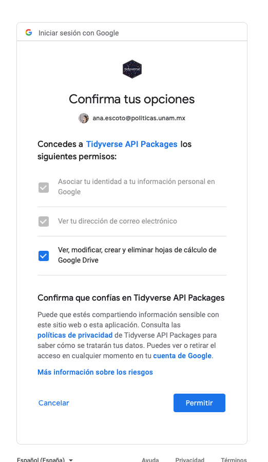

```{r setup, include=FALSE}
knitr::opts_chunk$set(echo = TRUE)
```


## Consejo para escribir "código""
En general, cuando hacemos nuestro código querremos verificar que nuestras librerías estén instaladas. Si actualizamos nuestro R y Rstudio es probable (sobre todo en MAC) que hayamos perdido alguno.

Este es un ejemplo de un código. Y vamos a introducir un paquete muy útil llamado "pacman"

```{r}
if (!require("pacman")) install.packages("pacman") # instala pacman si se requiere
pacman::p_load(tidyverse, 
               readxl,writexl,googlesheets4, # importar hojas de cálculo
               haven, foreign, # importación de dta y sab
               sjlabelled, # etiquetas
               janitor, skimr, #carga los paquetes necesarios para esta práctica
               curl) # problema de proxies 

```

# Importando más datos
Si estas desde tu escritorio
<i>¡Recuerda establecer tu directorio!</i>
```{r 1}
setwd("/Users/anaescoto/Dropbox/2020/2021-1 R para Demográfos/repo/R_Demo")
```

Hay muchos formatos de almacenamiento de bases de datos. Vamos a aprender a importar información desde ellos.

## Desde Excel 
El paquete más compatible con RStudio es readxl. A veces, otros paquetes tienen más problemas de configuración entre R y el Java.

```{r 2}
library(readxl) # Recuerda que hay llamar al paquete
```


```{r 3}
ICI_2018 <- read_excel("./datos/ICI_2018.xlsx", sheet = "para_importar")
#View(ICI_2018)
```

Como el nombre de paquete lo indica, sólo lee. Para escribir en este formato, recomiendo el paquete "writexl". Lo instalamos anteriormente.

Si quisiéramos exportar un objeto a Excel
```{r 5}
write_xlsx(ICI_2018, path = "Mi_Exportación.xlsx")
```

## Desde google

También podemos importar archivos de "google sheets", utilizamos el paquete "googlesheets4". Más sobre este paquete lo podemos revisar acá <https://github.com/tidyverse/googlesheets4>.

Debemos tener el link de "edición" del archivo y debe ser público, o debemos de tener permiso con la cuenta que vamos autenticar:

```{r}
ej_google<-read_sheet("https://docs.google.com/spreadsheets/d/1gGEug2SgA8G1cOCSrmzkt4bmFYTZmpmz8UR4CpquRcI/edit#gid=0")

```



Es decir, necesitas una cuenta de la suite de google para hacer este proceso.


### Actividad 1 en clase
¡Importa tu mismo la base de datos ICE_2018, está en la carpeta de datos!

## Importación con foreing

Recordemos nuestra base importada desde .dbf

```{r}
ecovid0420<-read.dbf("./datos/ecovid0420.dbf")
```

## Desde STATA y SPSS

Si bien también se puede realizar desde el paquete foreign. Pero este no importa algunas características como las etiquetas y tampoco funciona con las versiones más nuevas de STATA. Vamos a instalar otro paquete, compatible con el mundo tidyverse. 

```{r 11}
library(haven) #pacman lo cargó pero lo ponemos acá para hablar de esta función
```
Recuerda que no hay que instalarlo (viene adentro de tidyverse). Se instalasólo la primera vez. Una vez instalado un paquete, lo llamamos con el comando "library"

```{r}
ecovid0420 <- read_dta("./datos/ecovid0420.dta")
```

!Importante, a R no le gustan los objetos con nombres que empiezan en números

El paquete haven sí exporta información.
```{r}
write_dta(ecovid0420, "./datos/mi_exportación.dta", version = 12)
```

Con SSPS es muy parecido. Dentro de "haven" hay una función específica para ello. 

```{r}
encevi_hogar<- read_sav("./datos/encevi_hogar.sav")

```

Para escribir
```{r}
write_sav(ecovid0420 , "mi_exportacion.sav")
```

Checa que en todas las exportaciones en los nombres hay que incluir la extensión del programa. Si quieres guardar en un lugar diferente al directorio del trabajo, hay que escribir toda la ruta dentro de la computadora.

## Revisión de nuestra base
Vamos a revisar la base, brevemente la base

```{r}
class(ecovid0420) # tipo de objeto
names(ecovid0420) # lista las variables
head(ecovid0420) # muestra las primeras 6 líneas
table(ecovid0420$CLASE2) # un tabulado simple
```

## Revisión con dplyr
```{r}
library(dplyr) 
```

Operador de "pipe" o "tubería" %>% (Ctrl+Shift+M)
Antes de continuar, presentemos el operador "pipe" %>%. dplyr importa este operador de otro paquete (magrittr). 
Este operador le permite canalizar la salida de una función a la entrada de otra función. En lugar de funciones de anidamiento (lectura desde adentro hacia afuera), la idea de la tubería es leer las funciones de izquierda a derecha.

```{r}
ecovid0420 %>% 
    select(pb1, pb2) %>% 
    head
```

```{r}
ecovid0420 %>% 
    select(pb1, pb2) %>% 
    glimpse
```

## Revisión con skimr

"skimr" es un paquete nos permite tener una perspectiva de nuestra base de datos. Dependiendo del tipo de variable nos da diferentes elementos. La aplicaremos a nuestra base de la ecovid


```{r}
ecovid0420 %>% 
    skim()
```

### Actividad durante la clase

Aplica el comando skimr a la base que importaste ICE_2018.

## Limpieza de nombres

Primero lo haremos con "janitor" en poco tiempo ha llegado a ser uno de mis paquetes favoritos, por sus funciones de limpieza de datos, también lo usaremos para tablas. 

La función "clean_names" nos permite limpiar los nombre. 
Primero busquemos la ayuda de este comando
```{r}
help(clean_names)
```
O podemos checar los métodos por aquí
<https://www.rdocumentation.org/packages/janitor/versions/1.2.1/topics/clean_names>

Vamos a limpiar nuestra base descargada desde google:

```{r}
base_limpia<-ej_google %>% 
  clean_names() # por default, usa "snake"
```


```{r}
base_limpia <- ej_google %>% 
  clean_names(case="screaming_snake") # all caps
```


```{r}
base_limpia <- ej_google %>% 
  clean_names(case="screaming_snake") # all caps
names(base_limpia)
```

También podemos incluir prefijos

```{r}
base_limpia <- ej_google %>% 
  clean_names(case="screaming_snake", prefix="ICI_") # all caps
names(base_limpia)

```

... y sufijos

```{r}
base_limpia <- ej_google %>% 
  clean_names(case="screaming_snake", postfix="_ICI") # all caps
names(base_limpia)

```


### Actividad en clase
Limpia los nombre de la base ICE_2018, elije un case específico que no sea el del ejemplo

## Etiquetas importadas y cómo usarlas

Podemos ver que los objetos "data.frame"(spoiler, ya hablaremos de ellos), tiene una clase que se llama "haven_labelled"

```{r}

class(ecovid0420$pb1)

```

¿Esto que significa? Que en el programa original hay alguna etiqueta que podemos usar. 

```{r}
library(sjlabelled)
table(ecovid0420$pb1)
table(as_label(ecovid0420$pb1))

```

## Leer desde archivos de texto y desde una url
Desde el portal <https://datos.gob.mx/> tenemos acceso a directo a varias fuentes de información, al ser datos abiertos, los archivos de texto son muy comunes.

Leeremos parte de esa información, específicamente la de CONAPO
<https://datos.gob.mx/busca/dataset/proyecciones-de-la-poblacion-de-mexico-y-de-las-entidades-federativas-2016-2050>

En estas bases hay acentos y otros carecteres especiales del español, por lo que agregaremos una opción de "encoding", de lo contrario da error.

```{r}
#mig_inter_quin_proyecciones <- read.csv("http://www.conapo.gob.mx/work/models/CONAPO/Datos_Abiertos/Proyecciones2018/mig_inter_quin_proyecciones.csv", encoding="latin1")
#View(mig_inter_quin_proyecciones)
#names(mig_inter_quin_proyecciones)
```

Ahorita hay un problema de certificados, por lo que vamos a descargarlo desde el repositorio
```{r}
pob_mit_proyecciones.csv <- read.csv("https://github.com/aniuxa/R_Demo/raw/master/datos/pob_mit_proyecciones.csv", encoding="latin1")
#View(pob_mit_proyecciones.csv)
names(pob_mit_proyecciones.csv)

```

# Revisando ECOVID-ML

Vamos a trabajar con la ECOVID-ML, una nueva fuente desarrollada por INEGI. 
<https://www.inegi.org.mx/investigacion/ecovidml/2020/>

>Obtener información básica complementaria sobre ocupación y empleo y el efecto sobre el mercado laboral de la pandemia originada por el COVID-19.

>Objetivos específicos
Identificar a los ocupados y las características básicas del contexto laboral.
Identificar a los no ocupados, la condición de búsqueda de trabajo, deseo de trabajar y el motivo por el que no buscó trabajo.
Captar información de los ausentes que retornarán a su trabajo al terminar la contingencia, como acercamiento a la caracterización de la pérdida de trabajo.
Recopilar información sobre cómo la población está afrontando la pandemia con énfasis en el trabajo, ocupación y empleo.
Conocer el medio por el que las personas se mantienen informadas de la situación y las medidas de protección que siguen por la contingencia sanitaria.


## Ojeando
```{r}
glimpse(ecovid0420)
glimpse(ecovid0420[,1:10]) # en corchete del lado derecho podemos ojear columnas 

```

Podemos hacer un tipo "labelbook", usando una función que viene de la librería "sjlabelled", "get_labels". Funciona para toda la base o para columnas, o para variables.
```{r}
#print(get_labels(ecovid0420)) #todas
print(get_labels(ecovid0420[, 1:10])) #de las primeras 10 variables
print(get_labels(ecovid0420$clase2)) #
```

## Selección de casos y de variables
Poco a poco vamos comprendiendo más la lógica de R. Hay varias "formas" de programar. Por lo que no te asustes si varios códigos llegan al mismo resultado

Para revisar el contenido de un data frame podemos usar, como lo hicimos anteriormente, el formato basededatos$var o usar corchete, checa como estas cuatro formas tan el mismo resultado.

```{r}
x<-ecovid0420$pb3
x<-ecovid0420[["pb3"]]  # ¡Ojo con las comillas! 
x<-ecovid0420[,10]
x<-ecovid0420[,"pb3"]

```

Ahora, con el formato de dplyr podemos llegar a lo mismo
```{r}
x<-ecovid0420 %>% 
  select(pb3)
```


## Selección "inversa"
O sea no "botar algo", es con el negativo. No funciona con todos los formatos
```{r}
x<-ecovid0420 %>% 
  select(-pb3)
x<-ecovid0420[,-10]

rm(x) #rm sólo bota objetos
```

Pero con los otros formatos podemos "asignar" valores adentro de un data.frame, y uno de eso valores puede ser "la nada""
```{r}
ecovid0420$pb3_2<-ecovid0420$pb3
ecovid0420$pb3_2<-NULL

```

De aquí viene esa cuesta en el aprendizaje; tenemos que comprender en qué forma programó el que hizo la librería e incluso a veces cómo aprendió quién te está enseñando o el foro que estás leyendo.

# Subsetting 
Rara vez utilizamos una base de datos completa, y rara vez queremos hacer operaciones completas con ellas.

Vamos a pedir cosas más específicas y podemos seleccionar observaciones o filas. Como nuestra base de datos es muy grande, guardaremos el filtro o selección en un objeto.

```{r}
subset1<-ecovid0420[ecovid0420$pb3>4,]
```

También podemos seleccionar columnas
```{r}
subset2<- ecovid0420[, c("pb1", "pb2", "pb3")]
```

podemos combinar los dos tipos de selección
```{r}
subset3<- ecovid0420[(ecovid0420$pb3>4 & ecovid0420$pb1==1 ), c("pb1", "pb2", "pb3")]
```


Con dplyr, podemos usar "filter" y "select"

```{r}

subset4<-ecovid0420 %>% 
  filter(pb3>4 & pb1==1) %>%
    select(pb1, pb2, pb3)
```


# Ejercicio de tarea
* Escoja una base con la que usted esté trabajando. Impórtela
* Replique la exploración de la práctica: incluya limpiar nombre, alguna revisión global y, opcionalmente, alguna selección de variables o casos de acuerdo a su interés
* Utilice al menos un comando con dplyr para revisar algo
* Adjunte un archivo con información de la base (para que yo verifique su importación.), así como el código en .R

Envíe el script utilizando la liga:
<https://forms.gle/QqbgjysEAE6Te7t37>

