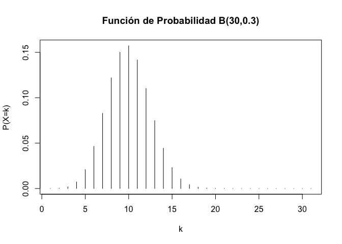
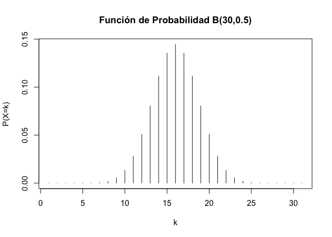
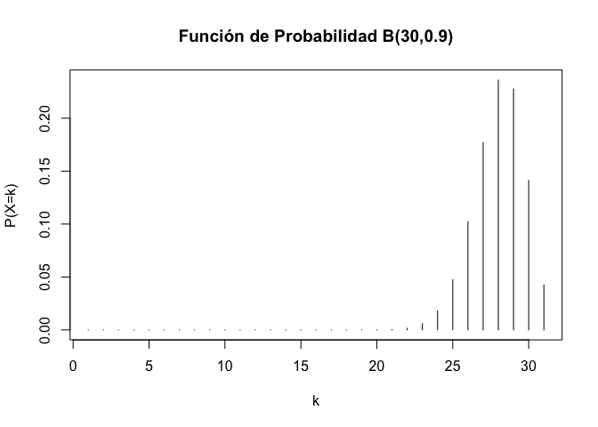
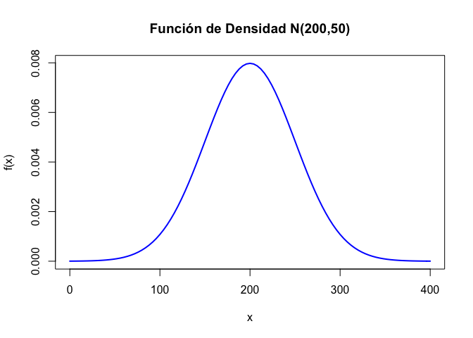

Práctica 2. Probabilidad + Intro Inferencia
================
AE
30/10/2020

\#Juegos de azar

Con R podemos jugar juegos de azar: digamos, tirar un dado o lanzar una
moneda, y mucho más rápido que nosotros. Y con eso vamos establecer
algunos elementos esenciales de la probabilidad

El comando principal es “sample” Tenemos que decir a R de dónde elegimos
y cuántos elegir. R puede muestrear con y sin reemplazo. <b>Con
reemplazo</b> significa que elegimos un elemento de nuestro universo y
lo devolvemos. <b>Sin reemplazo</b> significa qn elemento de nuestro
universo y no lo devolvemos.

\#Un dado Entonces, digamos que queremos que R lance un dado de seis
caras una vez. Vamos a usar un nuevo formato para escribir una secuencia
de números, como ya los habíamos aprendido.

``` r
1:6
```

    ## [1] 1 2 3 4 5 6

``` r
dado<-1:6
```

Si quisiéramos tirar ese dado una vez, es decir con “sample”, tomaríamos
una muestra de tamaño 1 de ese universo:

``` r
sample(1:6, 1)
```

    ## [1] 3

``` r
sample(dado, 1)
```

    ## [1] 4

Si quisiéramos lanzar muchas veces más ese dado:

``` r
sample(1:6, 10, replace = T)
```

    ##  [1] 6 4 5 4 5 2 6 4 1 3

``` r
sample(dado, 10, replace = T)
```

    ##  [1] 3 1 3 1 6 5 4 6 5 4

Retomando lo último que vimos en la práctica pasada, podemos hacer una
función

``` r
tirar_dado <- function(n) {
  sample(1:6, n, rep = T)
}
tirar_dado(10)
```

    ##  [1] 2 4 2 4 2 3 5 2 6 5

# Tirar una moneda

``` r
moneda<-c("Aguila", "Sol")
sample(c("Aguila", "Sol"), 1)
```

    ## [1] "Sol"

``` r
sample(moneda, 1)
```

    ## [1] "Sol"

También podemos hacer una función

``` r
tirar_moneda <- function(n) {
  sample(c("Aguila", "Sol"), n, rep = T)
}
tirar_moneda(10)
```

    ##  [1] "Sol"    "Sol"    "Aguila" "Sol"    "Sol"    "Sol"    "Aguila" "Aguila"
    ##  [9] "Aguila" "Aguila"

Podemos hacer una función más general que use nuestros objetos moneda y
dado

``` r
tirar<-function(data,n) {
    sample(data, n, rep = T)
}
tirar(dado,1)
```

    ## [1] 4

``` r
tirar(moneda,2)
```

    ## [1] "Sol" "Sol"

\#Aleatorio, pero regular Con estas funciones ya podemos ver qué pasa
con nuestras probabilidades cuando repetimos

Veamos con el dado

``` r
dado_millon<-tirar_dado(1000000)
table(dado_millon)
```

    ## dado_millon
    ##      1      2      3      4      5      6 
    ## 166626 167504 166951 166366 166350 166203

Veamos con la moneda

``` r
moneda1000<- tirar_moneda(1000)
table(moneda1000)
```

    ## moneda1000
    ## Aguila    Sol 
    ##    510    490

``` r
prop.table(table(moneda1000))
```

    ## moneda1000
    ## Aguila    Sol 
    ##   0.51   0.49

Que tal si tiramos un millón

``` r
moneda_millon<- tirar_moneda(1000000)
table(moneda_millon)
```

    ## moneda_millon
    ## Aguila    Sol 
    ## 499985 500015

``` r
prop.table(table(moneda_millon))
```

    ## moneda_millon
    ##   Aguila      Sol 
    ## 0.499985 0.500015

Ahora, por ejemplo pensemos que tiramos la moneda un numero de veces y
lo queremos registar:

``` r
moneda_veces<-NULL

for (i in 1:10000) {
    moneda_veces[i] <- tirar_moneda(1)
}
table(moneda_veces)
```

    ## moneda_veces
    ## Aguila    Sol 
    ##   4926   5074

# Distribuciones

## Distribuciones precargadas

Daremos un paseo por las distribuciones más famosas y para qué sirven:

``` r
help(Distributions)
```

Para cada distribución de probabilidad, R dispone de cuatro
sub-funciones, que sirven como prefijos:

<li>

d: función de densidad o de probabilidad.

</li>

<li>

p: función de distribución

</li>

<li>

q: función para el cálculo de cuantiles.

</li>

<li>

r: función para simular datos con dicha distribución.

</li>

\#\#Binomial

<li>

P(X=k) =dbinom(k,n,p)

</li>

<li>

P(X≤k) =pbinom(k,n,p)

</li>

<li>

qa=min{x:P(X≤x)≥a} =qbinom(a,n,p)

</li>

<li>

rbinom(m,n,p) genera m valores aleatorios con esta distribución

</li>

Si X≈B(25,0.6) tenemos:

P(X=10)

``` r
dbinom(10,25,0.6)
```

    ## [1] 0.02122244

P(X≤10)

``` r
pbinom(10,25,0.6)
```

    ## [1] 0.03439152

o también:

``` r
sum(dbinom(0:10,25,0.6))
```

    ## [1] 0.03439152

q0.95=min{x:P(X≤x)≥0.95}

``` r
qbinom(0.95,25,0.6)
```

    ## [1] 19

Simulamos 30 valores de esta distribución:

``` r
rbinom(30,25,0.6)
```

    ##  [1] 17 17 15 16 16 16 20 15 13 18 12 18 18 14 16 18 14 10 13 13 15 14 14 13 13
    ## [26] 15 15 15 14 14

Podemos representar fácilmente la función de probabilidad de la
distribución binomial:

``` r
plot(dbinom(0:30,30,0.6),type="h",xlab="k",ylab="P(X=k)",main="Función de Probabilidad B(30,0.6)")
```

<!-- -->

El efecto de “p” en la distribución

``` r
plot(dbinom(0:30,30,0.3),type="h",xlab="k",ylab="P(X=k)",main="Función de Probabilidad B(30,0.3)")
```

<!-- -->

``` r
plot(dbinom(0:30,30,0.5),type="h",xlab="k",ylab="P(X=k)",main="Función de Probabilidad B(30,0.5)")
```

<!-- -->

``` r
plot(dbinom(0:30,30,0.9),type="h",xlab="k",ylab="P(X=k)",main="Función de Probabilidad B(30,0.9)")
```

<!-- -->

## Distribución Normal

Si X sigue una distribución normal N(μ,σ), entonces:

<li>

f(x) = dnorm(x,mu,sigma)

</li>

<li>

P(X≤k) = pnorm(x,mu,sigma)

</li>

<li>

qa=min{x:P(X≤x)≥a} = qnorm(a,mu,sigma)

</li>

<li>

rnorm(n,mu,sigma) genera n valores aleatorios N(μ,σ)

</li>

Supongamos que X≈N(200,50). Entonces: Calculamos f(150)

``` r
dnorm(150,200,50)
```

    ## [1] 0.004839414

Podemos hacer varios valores posibles

``` r
x<-seq(0,400,by=0.5)
dnorm(x,200,50)
```

    ##   [1] 2.676605e-06 2.785700e-06 2.898951e-06 3.016505e-06 3.138513e-06
    ##   [6] 3.265128e-06 3.396512e-06 3.532829e-06 3.674250e-06 3.820950e-06
    ##  [11] 3.973109e-06 4.130915e-06 4.294560e-06 4.464240e-06 4.640161e-06
    ##  [16] 4.822532e-06 5.011569e-06 5.207495e-06 5.410541e-06 5.620941e-06
    ##  [21] 5.838939e-06 6.064785e-06 6.298736e-06 6.541059e-06 6.792024e-06
    ##  [26] 7.051914e-06 7.321015e-06 7.599626e-06 7.888050e-06 8.186603e-06
    ##  [31] 8.495605e-06 8.815390e-06 9.146296e-06 9.488675e-06 9.842887e-06
    ##  [36] 1.020930e-05 1.058829e-05 1.098026e-05 1.138560e-05 1.180471e-05
    ##  [41] 1.223804e-05 1.268600e-05 1.314904e-05 1.362763e-05 1.412221e-05
    ##  [46] 1.463329e-05 1.516134e-05 1.570688e-05 1.627042e-05 1.685250e-05
    ##  [51] 1.745365e-05 1.807444e-05 1.871544e-05 1.937724e-05 2.006043e-05
    ##  [56] 2.076563e-05 2.149347e-05 2.224459e-05 2.301967e-05 2.381937e-05
    ##  [61] 2.464438e-05 2.549542e-05 2.637322e-05 2.727850e-05 2.821205e-05
    ##  [66] 2.917462e-05 3.016701e-05 3.119005e-05 3.224455e-05 3.333137e-05
    ##  [71] 3.445138e-05 3.560546e-05 3.679452e-05 3.801949e-05 3.928132e-05
    ##  [76] 4.058096e-05 4.191941e-05 4.329768e-05 4.471679e-05 4.617779e-05
    ##  [81] 4.768176e-05 4.922979e-05 5.082300e-05 5.246252e-05 5.414952e-05
    ##  [86] 5.588517e-05 5.767069e-05 5.950730e-05 6.139627e-05 6.333886e-05
    ##  [91] 6.533638e-05 6.739016e-05 6.950155e-05 7.167192e-05 7.390267e-05
    ##  [96] 7.619524e-05 7.855107e-05 8.097164e-05 8.345846e-05 8.601305e-05
    ## [101] 8.863697e-05 9.133180e-05 9.409915e-05 9.694066e-05 9.985798e-05
    ## [106] 1.028528e-04 1.059269e-04 1.090819e-04 1.123197e-04 1.156420e-04
    ## [111] 1.190506e-04 1.225475e-04 1.261345e-04 1.298135e-04 1.335865e-04
    ## [116] 1.374553e-04 1.414221e-04 1.454888e-04 1.496575e-04 1.539302e-04
    ## [121] 1.583090e-04 1.627962e-04 1.673938e-04 1.721040e-04 1.769291e-04
    ## [126] 1.818713e-04 1.869328e-04 1.921159e-04 1.974231e-04 2.028565e-04
    ## [131] 2.084187e-04 2.141120e-04 2.199387e-04 2.259015e-04 2.320027e-04
    ## [136] 2.382449e-04 2.446305e-04 2.511622e-04 2.578425e-04 2.646740e-04
    ## [141] 2.716594e-04 2.788012e-04 2.861022e-04 2.935650e-04 3.011923e-04
    ## [146] 3.089869e-04 3.169516e-04 3.250890e-04 3.334020e-04 3.418934e-04
    ## [151] 3.505660e-04 3.594227e-04 3.684662e-04 3.776995e-04 3.871255e-04
    ## [156] 3.967471e-04 4.065671e-04 4.165885e-04 4.268143e-04 4.372473e-04
    ## [161] 4.478906e-04 4.587471e-04 4.698197e-04 4.811115e-04 4.926254e-04
    ## [166] 5.043644e-04 5.163315e-04 5.285297e-04 5.409620e-04 5.536313e-04
    ## [171] 5.665408e-04 5.796932e-04 5.930917e-04 6.067392e-04 6.206386e-04
    ## [176] 6.347930e-04 6.492053e-04 6.638784e-04 6.788153e-04 6.940188e-04
    ## [181] 7.094919e-04 7.252374e-04 7.412582e-04 7.575572e-04 7.741371e-04
    ## [186] 7.910008e-04 8.081511e-04 8.255906e-04 8.433221e-04 8.613484e-04
    ## [191] 8.796719e-04 8.982954e-04 9.172215e-04 9.364527e-04 9.559915e-04
    ## [196] 9.758404e-04 9.960018e-04 1.016478e-03 1.037272e-03 1.058385e-03
    ## [201] 1.079819e-03 1.101578e-03 1.123663e-03 1.146076e-03 1.168819e-03
    ## [206] 1.191894e-03 1.215303e-03 1.239048e-03 1.263131e-03 1.287553e-03
    ## [211] 1.312316e-03 1.337422e-03 1.362871e-03 1.388666e-03 1.414808e-03
    ## [216] 1.441297e-03 1.468136e-03 1.495325e-03 1.522865e-03 1.550758e-03
    ## [221] 1.579003e-03 1.607602e-03 1.636556e-03 1.665864e-03 1.695527e-03
    ## [226] 1.725546e-03 1.755921e-03 1.786652e-03 1.817740e-03 1.849183e-03
    ## [231] 1.880982e-03 1.913136e-03 1.945645e-03 1.978509e-03 2.011727e-03
    ## [236] 2.045298e-03 2.079222e-03 2.113497e-03 2.148122e-03 2.183095e-03
    ## [241] 2.218417e-03 2.254084e-03 2.290096e-03 2.326451e-03 2.363146e-03
    ## [246] 2.400180e-03 2.437551e-03 2.475256e-03 2.513293e-03 2.551659e-03
    ## [251] 2.590352e-03 2.629369e-03 2.668706e-03 2.708361e-03 2.748331e-03
    ## [256] 2.788611e-03 2.829199e-03 2.870091e-03 2.911283e-03 2.952770e-03
    ## [261] 2.994549e-03 3.036616e-03 3.078966e-03 3.121594e-03 3.164496e-03
    ## [266] 3.207667e-03 3.251101e-03 3.294794e-03 3.338741e-03 3.382935e-03
    ## [271] 3.427372e-03 3.472045e-03 3.516949e-03 3.562077e-03 3.607423e-03
    ## [276] 3.652982e-03 3.698746e-03 3.744708e-03 3.790863e-03 3.837203e-03
    ## [281] 3.883721e-03 3.930410e-03 3.977262e-03 4.024271e-03 4.071428e-03
    ## [286] 4.118725e-03 4.166156e-03 4.213711e-03 4.261383e-03 4.309163e-03
    ## [291] 4.357044e-03 4.405015e-03 4.453070e-03 4.501199e-03 4.549393e-03
    ## [296] 4.597643e-03 4.645940e-03 4.694275e-03 4.742639e-03 4.791022e-03
    ## [301] 4.839414e-03 4.887807e-03 4.936190e-03 4.984553e-03 5.032887e-03
    ## [306] 5.081181e-03 5.129426e-03 5.177611e-03 5.225726e-03 5.273761e-03
    ## [311] 5.321705e-03 5.369548e-03 5.417279e-03 5.464889e-03 5.512365e-03
    ## [316] 5.559698e-03 5.606876e-03 5.653890e-03 5.700727e-03 5.747378e-03
    ## [321] 5.793831e-03 5.840076e-03 5.886101e-03 5.931895e-03 5.977448e-03
    ## [326] 6.022749e-03 6.067786e-03 6.112548e-03 6.157025e-03 6.201206e-03
    ## [331] 6.245079e-03 6.288633e-03 6.331858e-03 6.374743e-03 6.417276e-03
    ## [336] 6.459447e-03 6.501245e-03 6.542660e-03 6.583679e-03 6.624294e-03
    ## [341] 6.664492e-03 6.704264e-03 6.743599e-03 6.782486e-03 6.820916e-03
    ## [346] 6.858877e-03 6.896360e-03 6.933354e-03 6.969850e-03 7.005838e-03
    ## [351] 7.041307e-03 7.076247e-03 7.110651e-03 7.144507e-03 7.177806e-03
    ## [356] 7.210539e-03 7.242698e-03 7.274272e-03 7.305253e-03 7.335633e-03
    ## [361] 7.365403e-03 7.394554e-03 7.423078e-03 7.450966e-03 7.478212e-03
    ## [366] 7.504807e-03 7.530743e-03 7.556014e-03 7.580611e-03 7.604527e-03
    ## [371] 7.627756e-03 7.650291e-03 7.672126e-03 7.693253e-03 7.713667e-03
    ## [376] 7.733362e-03 7.752332e-03 7.770572e-03 7.788075e-03 7.804838e-03
    ## [381] 7.820854e-03 7.836119e-03 7.850630e-03 7.864380e-03 7.877367e-03
    ## [386] 7.889587e-03 7.901035e-03 7.911708e-03 7.921604e-03 7.930719e-03
    ## [391] 7.939051e-03 7.946597e-03 7.953354e-03 7.959321e-03 7.964497e-03
    ## [396] 7.968878e-03 7.972465e-03 7.975256e-03 7.977250e-03 7.978447e-03
    ## [401] 7.978846e-03 7.978447e-03 7.977250e-03 7.975256e-03 7.972465e-03
    ## [406] 7.968878e-03 7.964497e-03 7.959321e-03 7.953354e-03 7.946597e-03
    ## [411] 7.939051e-03 7.930719e-03 7.921604e-03 7.911708e-03 7.901035e-03
    ## [416] 7.889587e-03 7.877367e-03 7.864380e-03 7.850630e-03 7.836119e-03
    ## [421] 7.820854e-03 7.804838e-03 7.788075e-03 7.770572e-03 7.752332e-03
    ## [426] 7.733362e-03 7.713667e-03 7.693253e-03 7.672126e-03 7.650291e-03
    ## [431] 7.627756e-03 7.604527e-03 7.580611e-03 7.556014e-03 7.530743e-03
    ## [436] 7.504807e-03 7.478212e-03 7.450966e-03 7.423078e-03 7.394554e-03
    ## [441] 7.365403e-03 7.335633e-03 7.305253e-03 7.274272e-03 7.242698e-03
    ## [446] 7.210539e-03 7.177806e-03 7.144507e-03 7.110651e-03 7.076247e-03
    ## [451] 7.041307e-03 7.005838e-03 6.969850e-03 6.933354e-03 6.896360e-03
    ## [456] 6.858877e-03 6.820916e-03 6.782486e-03 6.743599e-03 6.704264e-03
    ## [461] 6.664492e-03 6.624294e-03 6.583679e-03 6.542660e-03 6.501245e-03
    ## [466] 6.459447e-03 6.417276e-03 6.374743e-03 6.331858e-03 6.288633e-03
    ## [471] 6.245079e-03 6.201206e-03 6.157025e-03 6.112548e-03 6.067786e-03
    ## [476] 6.022749e-03 5.977448e-03 5.931895e-03 5.886101e-03 5.840076e-03
    ## [481] 5.793831e-03 5.747378e-03 5.700727e-03 5.653890e-03 5.606876e-03
    ## [486] 5.559698e-03 5.512365e-03 5.464889e-03 5.417279e-03 5.369548e-03
    ## [491] 5.321705e-03 5.273761e-03 5.225726e-03 5.177611e-03 5.129426e-03
    ## [496] 5.081181e-03 5.032887e-03 4.984553e-03 4.936190e-03 4.887807e-03
    ## [501] 4.839414e-03 4.791022e-03 4.742639e-03 4.694275e-03 4.645940e-03
    ## [506] 4.597643e-03 4.549393e-03 4.501199e-03 4.453070e-03 4.405015e-03
    ## [511] 4.357044e-03 4.309163e-03 4.261383e-03 4.213711e-03 4.166156e-03
    ## [516] 4.118725e-03 4.071428e-03 4.024271e-03 3.977262e-03 3.930410e-03
    ## [521] 3.883721e-03 3.837203e-03 3.790863e-03 3.744708e-03 3.698746e-03
    ## [526] 3.652982e-03 3.607423e-03 3.562077e-03 3.516949e-03 3.472045e-03
    ## [531] 3.427372e-03 3.382935e-03 3.338741e-03 3.294794e-03 3.251101e-03
    ## [536] 3.207667e-03 3.164496e-03 3.121594e-03 3.078966e-03 3.036616e-03
    ## [541] 2.994549e-03 2.952770e-03 2.911283e-03 2.870091e-03 2.829199e-03
    ## [546] 2.788611e-03 2.748331e-03 2.708361e-03 2.668706e-03 2.629369e-03
    ## [551] 2.590352e-03 2.551659e-03 2.513293e-03 2.475256e-03 2.437551e-03
    ## [556] 2.400180e-03 2.363146e-03 2.326451e-03 2.290096e-03 2.254084e-03
    ## [561] 2.218417e-03 2.183095e-03 2.148122e-03 2.113497e-03 2.079222e-03
    ## [566] 2.045298e-03 2.011727e-03 1.978509e-03 1.945645e-03 1.913136e-03
    ## [571] 1.880982e-03 1.849183e-03 1.817740e-03 1.786652e-03 1.755921e-03
    ## [576] 1.725546e-03 1.695527e-03 1.665864e-03 1.636556e-03 1.607602e-03
    ## [581] 1.579003e-03 1.550758e-03 1.522865e-03 1.495325e-03 1.468136e-03
    ## [586] 1.441297e-03 1.414808e-03 1.388666e-03 1.362871e-03 1.337422e-03
    ## [591] 1.312316e-03 1.287553e-03 1.263131e-03 1.239048e-03 1.215303e-03
    ## [596] 1.191894e-03 1.168819e-03 1.146076e-03 1.123663e-03 1.101578e-03
    ## [601] 1.079819e-03 1.058385e-03 1.037272e-03 1.016478e-03 9.960018e-04
    ## [606] 9.758404e-04 9.559915e-04 9.364527e-04 9.172215e-04 8.982954e-04
    ## [611] 8.796719e-04 8.613484e-04 8.433221e-04 8.255906e-04 8.081511e-04
    ## [616] 7.910008e-04 7.741371e-04 7.575572e-04 7.412582e-04 7.252374e-04
    ## [621] 7.094919e-04 6.940188e-04 6.788153e-04 6.638784e-04 6.492053e-04
    ## [626] 6.347930e-04 6.206386e-04 6.067392e-04 5.930917e-04 5.796932e-04
    ## [631] 5.665408e-04 5.536313e-04 5.409620e-04 5.285297e-04 5.163315e-04
    ## [636] 5.043644e-04 4.926254e-04 4.811115e-04 4.698197e-04 4.587471e-04
    ## [641] 4.478906e-04 4.372473e-04 4.268143e-04 4.165885e-04 4.065671e-04
    ## [646] 3.967471e-04 3.871255e-04 3.776995e-04 3.684662e-04 3.594227e-04
    ## [651] 3.505660e-04 3.418934e-04 3.334020e-04 3.250890e-04 3.169516e-04
    ## [656] 3.089869e-04 3.011923e-04 2.935650e-04 2.861022e-04 2.788012e-04
    ## [661] 2.716594e-04 2.646740e-04 2.578425e-04 2.511622e-04 2.446305e-04
    ## [666] 2.382449e-04 2.320027e-04 2.259015e-04 2.199387e-04 2.141120e-04
    ## [671] 2.084187e-04 2.028565e-04 1.974231e-04 1.921159e-04 1.869328e-04
    ## [676] 1.818713e-04 1.769291e-04 1.721040e-04 1.673938e-04 1.627962e-04
    ## [681] 1.583090e-04 1.539302e-04 1.496575e-04 1.454888e-04 1.414221e-04
    ## [686] 1.374553e-04 1.335865e-04 1.298135e-04 1.261345e-04 1.225475e-04
    ## [691] 1.190506e-04 1.156420e-04 1.123197e-04 1.090819e-04 1.059269e-04
    ## [696] 1.028528e-04 9.985798e-05 9.694066e-05 9.409915e-05 9.133180e-05
    ## [701] 8.863697e-05 8.601305e-05 8.345846e-05 8.097164e-05 7.855107e-05
    ## [706] 7.619524e-05 7.390267e-05 7.167192e-05 6.950155e-05 6.739016e-05
    ## [711] 6.533638e-05 6.333886e-05 6.139627e-05 5.950730e-05 5.767069e-05
    ## [716] 5.588517e-05 5.414952e-05 5.246252e-05 5.082300e-05 4.922979e-05
    ## [721] 4.768176e-05 4.617779e-05 4.471679e-05 4.329768e-05 4.191941e-05
    ## [726] 4.058096e-05 3.928132e-05 3.801949e-05 3.679452e-05 3.560546e-05
    ## [731] 3.445138e-05 3.333137e-05 3.224455e-05 3.119005e-05 3.016701e-05
    ## [736] 2.917462e-05 2.821205e-05 2.727850e-05 2.637322e-05 2.549542e-05
    ## [741] 2.464438e-05 2.381937e-05 2.301967e-05 2.224459e-05 2.149347e-05
    ## [746] 2.076563e-05 2.006043e-05 1.937724e-05 1.871544e-05 1.807444e-05
    ## [751] 1.745365e-05 1.685250e-05 1.627042e-05 1.570688e-05 1.516134e-05
    ## [756] 1.463329e-05 1.412221e-05 1.362763e-05 1.314904e-05 1.268600e-05
    ## [761] 1.223804e-05 1.180471e-05 1.138560e-05 1.098026e-05 1.058829e-05
    ## [766] 1.020930e-05 9.842887e-06 9.488675e-06 9.146296e-06 8.815390e-06
    ## [771] 8.495605e-06 8.186603e-06 7.888050e-06 7.599626e-06 7.321015e-06
    ## [776] 7.051914e-06 6.792024e-06 6.541059e-06 6.298736e-06 6.064785e-06
    ## [781] 5.838939e-06 5.620941e-06 5.410541e-06 5.207495e-06 5.011569e-06
    ## [786] 4.822532e-06 4.640161e-06 4.464240e-06 4.294560e-06 4.130915e-06
    ## [791] 3.973109e-06 3.820950e-06 3.674250e-06 3.532829e-06 3.396512e-06
    ## [796] 3.265128e-06 3.138513e-06 3.016505e-06 2.898951e-06 2.785700e-06
    ## [801] 2.676605e-06

Con esto también podemos graficar

``` r
curve(dnorm(x,200,50),xlim=c(0,400),col="blue",lwd=2,
      xlab="x",ylab="f(x)",main="Función de Densidad N(200,50)")
```

<!-- -->

Calculamos la probabilidad P(X≤180)

``` r
pnorm(180,200,50)
```

    ## [1] 0.3445783

P(X\>168)

``` r
1-pnorm(168,200,50)
```

    ## [1] 0.7389137

``` r
pnorm(168,200,50, lower.tail=FALSE)
```

    ## [1] 0.7389137

P(150≤X≤168)

``` r
pnorm(168,200,50)-pnorm(150,200,50)
```

    ## [1] 0.102431

# Importación de datos

## Desde STATA y SPSS

Si bien también se puede realizar desde el paquete foreign. Pero este no
importa algunas características como las etiquetas y tampoco funciona
con las versiones más nuevas de STATA. Vamos a instalar otro paquete,
compatible con el mundo tidyverse.

``` r
library(haven) #pacman lo cargó pero lo ponemos acá para hablar de esta función
```

Recuerda que no hay que instalarlo (viene adentro de tidyverse). Se
instalasólo la primera vez. Una vez instalado un paquete, lo llamamos
con el comando “library”

``` r
ecovid0420 <- read_dta("./datos/ecovid0420.dta")
```

\!Importante, a R no le gustan los objetos con nombres que empiezan en
números

Un spoiler:

``` r
t.test(ecovid0420$pe10_1)
```

    ## 
    ##  One Sample t-test
    ## 
    ## data:  ecovid0420$pe10_1
    ## t = 82.56, df = 2461, p-value < 2.2e-16
    ## alternative hypothesis: true mean is not equal to 0
    ## 95 percent confidence interval:
    ##  31.87638 33.42744
    ## sample estimates:
    ## mean of x 
    ##  32.65191
