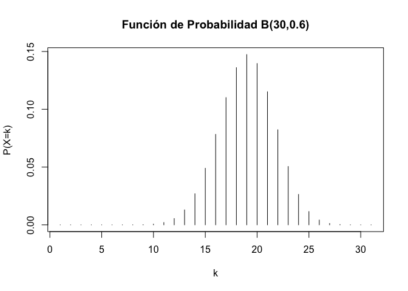
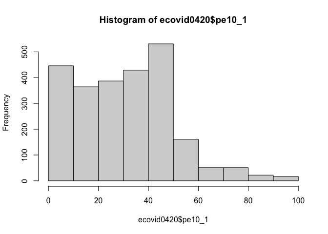

Práctica 2. Probabilidad + Intro Inferencia
================
AE
30/10/2020

# Juegos de azar

Con R podemos jugar juegos de azar: digamos, tirar un dado o lanzar una
moneda, y mucho más rápido que nosotros. Y con eso vamos establecer
algunos elementos esenciales de la probabilidad

El comando principal es “sample” Tenemos que decir a R de dónde elegimos
y cuántos elegir. R puede muestrear con y sin reemplazo. <b>Con
reemplazo</b> significa que elegimos un elemento de nuestro universo y
lo devolvemos. <b>Sin reemplazo</b> significa qn elemento de nuestro
universo y no lo devolvemos.

# Un dado

Entonces, digamos que queremos que R lance un dado de seis caras una
vez. Vamos a usar un nuevo formato para escribir una secuencia de
números, como ya los habíamos aprendido.

``` r
1:6
```

    ## [1] 1 2 3 4 5 6

``` r
dado<-1:6
```

Si quisiéramos tirar ese dado una vez, es decir con “sample”, tomaríamos
una muestra de tamaño 1 de ese universo:

``` r
sample(1:6, 1)
```

    ## [1] 5

``` r
sample(dado, 1)
```

    ## [1] 6

Si quisiéramos lanzar muchas veces más ese dado:

``` r
sample(1:6, 10, replace = T)
```

    ##  [1] 2 2 3 3 6 5 1 2 4 2

``` r
sample(dado, 10, replace = T)
```

    ##  [1] 6 2 5 4 4 5 2 4 6 1

Retomando lo último que vimos en la práctica pasada, podemos hacer una
función

``` r
tirar_dado <- function(n) {
  sample(1:6, n, rep = T)
}
tirar_dado(10)
```

    ##  [1] 3 5 3 3 5 3 4 6 2 4

# Tirar una moneda

``` r
moneda<-c("Aguila", "Sol")
sample(c("Aguila", "Sol"), 1)
```

    ## [1] "Sol"

``` r
sample(moneda, 1)
```

    ## [1] "Sol"

También podemos hacer una función

``` r
tirar_moneda <- function(n) {
  sample(c("Aguila", "Sol"), n, rep = T)
}
tirar_moneda(10)
```

    ##  [1] "Aguila" "Aguila" "Aguila" "Sol"    "Aguila" "Sol"    "Aguila" "Aguila"
    ##  [9] "Aguila" "Sol"

# Aleatorio, pero regular

Con estas funciones ya podemos ver qué pasa con nuestras probabilidades
cuando repetimos

Veamos con el dado

``` r
dado_millon<-tirar_dado(1000000)
table(dado_millon)
```

    ## dado_millon
    ##      1      2      3      4      5      6 
    ## 166905 167067 166464 166551 165821 167192

Veamos con la moneda

``` r
moneda1000<- tirar_moneda(1000)
table(moneda1000)
```

    ## moneda1000
    ## Aguila    Sol 
    ##    510    490

``` r
prop.table(table(moneda1000))
```

    ## moneda1000
    ## Aguila    Sol 
    ##   0.51   0.49

Que tal si tiramos un millón

``` r
moneda_millon<- tirar_moneda(1000000)
table(moneda_millon)
```

    ## moneda_millon
    ## Aguila    Sol 
    ## 499818 500182

``` r
prop.table(table(moneda_millon))
```

    ## moneda_millon
    ##   Aguila      Sol 
    ## 0.499818 0.500182

Ahora, por ejemplo pensemos que tiramos la moneda un numero de veces y
lo queremos registar:

``` r
moneda_veces<-NULL

for (i in 1:10000) {
    moneda_veces[i] <- tirar_moneda(1)
}
table(moneda_veces)
```

    ## moneda_veces
    ## Aguila    Sol 
    ##   5003   4997

# Distribuciones

## Distribuciones precargadas

Daremos un paseo por las distribuciones más famosas y para qué sirven:

``` r
help(Distributions)
```

Para cada distribución de probabilidad, R dispone de cuatro
sub-funciones, que sirven como prefijos:

<li>

d: función de densidad o de probabilidad.

</li>

<li>

p: función de distribución

</li>

<li>

q: función para el cálculo de cuantiles.

</li>

<li>

r: función para simular datos con dicha distribución.

</li>

\#\#Binomial

<li>

P(X=k) =dbinom(k,n,p)

</li>

<li>

P(X≤k) =pbinom(k,n,p)

</li>

<li>

qa=min{x:P(X≤x)≥a} =qbinom(a,n,p)

</li>

<li>

rbinom(m,n,p) genera m valores aleatorios con esta distribución

</li>

Si X≈B(25,0.6) tenemos:

P(X=10)

``` r
dbinom(10,25,0.6)
```

    ## [1] 0.02122244

P(X≤10)

``` r
pbinom(10,25,0.6)
```

    ## [1] 0.03439152

o también:

``` r
sum(dbinom(0:10,25,0.6))
```

    ## [1] 0.03439152

q0.95=min{x:P(X≤x)≥0.95}

``` r
qbinom(0.95,25,0.6)
```

    ## [1] 19

Simulamos 30 valores de esta distribución:

``` r
rbinom(30,25,0.6)
```

    ##  [1] 11 19 18 16 15 11 14 17 14 13 16 16 17 17 17 14 14 18 18 14 17 17 12 11 11
    ## [26] 15 17 18 15 15

Podemos representar fácilmente la función de probabilidad de la
distribución binomial:

``` r
plot(dbinom(0:30,30,0.6),type="h",xlab="k",ylab="P(X=k)",main="Función de Probabilidad B(30,0.6)")
```

<!-- -->

El efecto de “p” en la distribución

``` r
plot(dbinom(0:30,30,0.3),type="h",xlab="k",ylab="P(X=k)",main="Función de Probabilidad B(30,0.3)")
```

<!-- -->

``` r
plot(dbinom(0:30,30,0.5),type="h",xlab="k",ylab="P(X=k)",main="Función de Probabilidad B(30,0.5)")
```

<!-- -->

``` r
plot(dbinom(0:30,30,0.9),type="h",xlab="k",ylab="P(X=k)",main="Función de Probabilidad B(30,0.9)")
```

<!-- -->

## Distribución Normal

Si X sigue una distribución normal N(μ,σ), entonces:

<li>

f(x) = dnorm(x,mu,sigma)

</li>

<li>

P(X≤k) = pnorm(x,mu,sigma)

</li>

<li>

qa=min{x:P(X≤x)≥a} = qnorm(a,mu,sigma)

</li>

<li>

rnorm(n,mu,sigma) genera n valores aleatorios N(μ,σ)

</li>

Supongamos que X≈N(200,50). Entonces:

Calculamos la probabilidad P(X≤180)

``` r
pnorm(180,200,50)
```

    ## [1] 0.3445783

P(X\>168)

``` r
1-pnorm(168,200,50)
```

    ## [1] 0.7389137

``` r
pnorm(168,200,50, lower.tail=FALSE)
```

    ## [1] 0.7389137

P(150≤X≤168)

``` r
pnorm(168,200,50)-pnorm(150,200,50)
```

    ## [1] 0.102431

# Importación de datos

## Desde STATA y SPSS

Si bien también se puede realizar desde el paquete “foreign”. Pero este
no importa algunas características como las etiquetas y tampoco funciona
con las versiones más nuevas de STATA. Vamos a instalar otro paquete,
compatible con el mundo tidyverse.

``` r
#install.packages("haven")
library(haven) 
```

Recuerda que no hay que instalarlo (viene adentro de tidyverse). Se
instalasólo la primera vez. Una vez instalado un paquete, lo llamamos
con el comando “library”

``` r
ecovid0420 <- read_dta("./datos/ecovid0420.dta")
ecovid0420 <- read_dta("https://github.com/aniuxa/Taller_R/raw/master/datos/ecovid0420.dta")
```

\!Importante, a R no le gustan los objetos con nombres que empiezan en
números

Un spoiler:

``` r
summary(ecovid0420$pe10_1)
```

    ##    Min. 1st Qu.  Median    Mean 3rd Qu.    Max.    NA's 
    ##    1.00   16.00   35.00   32.65   48.00   99.00    3131

``` r
hist(ecovid0420$pe10_1)
```

<!-- -->

``` r
t.test(ecovid0420$pe10_1)
```

    ## 
    ##  One Sample t-test
    ## 
    ## data:  ecovid0420$pe10_1
    ## t = 82.56, df = 2461, p-value < 2.2e-16
    ## alternative hypothesis: true mean is not equal to 0
    ## 95 percent confidence interval:
    ##  31.87638 33.42744
    ## sample estimates:
    ## mean of x 
    ##  32.65191

¿Cómo importaríamos desde Excel?

## Desde Excel

El paquete más compatible con RStudio es readxl. A veces, otros paquetes
tienen más problemas de configuración entre R y el Java.

``` r
library(readxl) # Recuerda que hay llamar al paquete
```

``` r
ICE_2018 <- read_excel("./datos/ICE_2018.xlsx", sheet = "para_importar")
```

    ## New names:
    ## * `` -> ...102
    ## * `` -> ...105

``` r
#View(ICE_2018)
```

Como el nombre de paquete lo indica, sólo lee. Para escribir en este
formato, recomiendo el paquete “writexl”. Lo instalamos anteriormente.

Si quisiéramos exportar un objeto a Excel

``` r
#install.packages("writexl")
library(writexl)
write_xlsx(ICE_2018, path = "Mi_Exportación.xlsx")
```

## Desde google

También podemos importar archivos de “google sheets”, utilizamos el
paquete “googlesheets4”. Más sobre este paquete lo podemos revisar acá
<https://github.com/tidyverse/googlesheets4>.

Debemos tener el link de “edición” del archivo y debe ser público, o
debemos de tener permiso con la cuenta que vamos autenticar:

``` r
#install.packages(googlesheets4)
library(googlesheets4)
ej_google<-read_sheet("https://docs.google.com/spreadsheets/d/1gGEug2SgA8G1cOCSrmzkt4bmFYTZmpmz8UR4CpquRcI/edit#gid=0")
```

    ## Using an auto-discovered, cached token.
    ## To suppress this message, modify your code or options to clearly consent to the use of a cached token.
    ## See gargle's "Non-interactive auth" vignette for more details:
    ## https://gargle.r-lib.org/articles/non-interactive-auth.html

    ## The googlesheets4 package is using a cached token for ana.escoto@politicas.unam.mx.

    ## Reading from "ejemplo_google_sheets"

    ## Range "Hoja 1"


Es decir, necesitas una cuenta de la suite de google para hacer este
proceso.
