Práctica 4. Modelos estadísticos: ANOVA y regresión
================
AE
08/01/2021

# Previo

## Paquetería

``` r
#install.packages("sjPlot", dependencies=T) # solito porque da problmas

library(sjPlot)
```

    ## Learn more about sjPlot with 'browseVignettes("sjPlot")'.

``` r
if (!require("pacman")) install.packages("pacman") # instala pacman si se requiere
```

    ## Loading required package: pacman

``` r
pacman::p_load(tidyverse, 
               readxl,writexl,googlesheets4, # importar hojas de cálculo
               haven, foreign, # importación de dta y sav
               sjlabelled, # etiquetas
               janitor, skimr, #limpieza y verificación
               DescTools, # Paquete para estimaciones y pruebas
               infer, # tidy way 
               broom,  # Una escobita para limpiar (pero es para arreglar)
               estimatr, car, stargazer, ggpubr) # Para la regresión
```

## Directorio

En caso que no tengas un proyecto,establecer el directorio puede ayudar

## Bases

Base de ECOVID - ML

``` r
ecovid0420 <- read_dta("https://github.com/aniuxa/R_Demo/raw/master/datos/ecovid0420.dta")
```

# Análisis de varianza

Análisis de varianza. Haremos la versión más simple. Para ver el efecto
de un factor sobre una variable cualitativa (oneway). Revisaremos si la
posición en el trabajo de los trabajadores tiene un efecto en las horas
trabajadas.

## Primero un gráfico

la ANOVA se basa en que nuestra variable es normal. Quitaremos los
outliers

``` r
lienzo_bi <-ecovid0420 %>% 
           filter(clase2==1  & !pe10_1==0) %>% 
           ggplot(aes(x=log(pe10_1), fill=as_factor(pos_ocu), 
           color=as_factor(pos_ocu),
           alpha=I(0.5)))

lienzo_bi + geom_density()
```

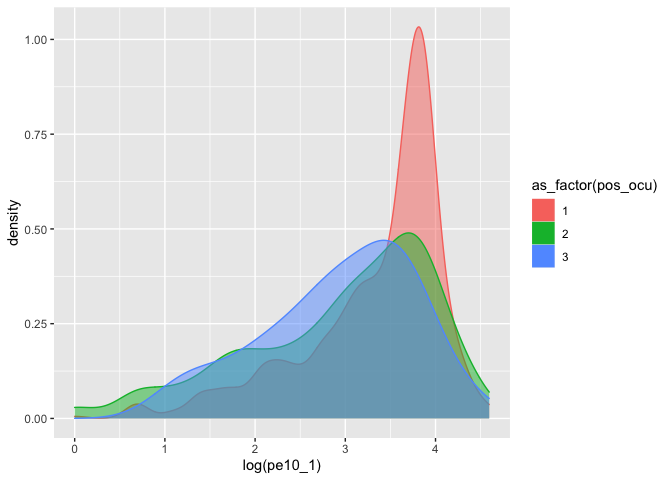<!-- -->

La prueba ANOVA o análisis de varianza, nos dice cuánto de nuestra
variable se ve explicado por un factor. En los modelos es mul útil
guardar nuestros resultados como un objeto

``` r
anova<-ecovid0420 %>% 
    filter(clase2==1) %>% 
      with(aov(pe10_1 ~ as_factor(pos_ocu)))

summary(anova)
```

    ##                      Df Sum Sq Mean Sq F value   Pr(>F)    
    ## as_factor(pos_ocu)    2  25993   12996   34.67 1.41e-15 ***
    ## Residuals          2459 921718     375                     
    ## ---
    ## Signif. codes:  0 '***' 0.001 '**' 0.01 '*' 0.05 '.' 0.1 ' ' 1
    ## 431 observations deleted due to missingness

Con tidy:

``` r
tidy(anova)
```

    ## # A tibble: 2 x 6
    ##   term                  df   sumsq meansq statistic   p.value
    ##   <chr>              <dbl>   <dbl>  <dbl>     <dbl>     <dbl>
    ## 1 as_factor(pos_ocu)     2  25993. 12996.      34.7  1.41e-15
    ## 2 Residuals           2459 921718.   375.      NA   NA

### Comparación entre grupos

¿si es significativo cuáles diferencias entre los grupos lo son?

``` r
TukeyHSD(anova)
```

    ##   Tukey multiple comparisons of means
    ##     95% family-wise confidence level
    ## 
    ## Fit: aov(formula = pe10_1 ~ as_factor(pos_ocu))
    ## 
    ## $`as_factor(pos_ocu)`
    ##          diff        lwr       upr     p adj
    ## 2-1 -6.700874  -8.694986 -4.706761 0.0000000
    ## 3-1 -9.927257 -16.786459 -3.068054 0.0020207
    ## 3-2 -3.226383 -10.193983  3.741217 0.5228956

## Supuestos de ANOVA

  - Las observaciones se obtienen de forma independiente y aleatoria de
    la población definida por los niveles del factor
  - Los datos de cada nivel de factor se distribuyen normalmente.
  - Estas poblaciones normales tienen una varianza común.

<!-- end list -->

``` r
#Prueba Bartlett para ver si las varianzas son iguales

ecovid0420 %>% 
    filter(clase2==1) %>% 
      with(bartlett.test(pe10_1 ~ as_factor(pos_ocu)))
```

    ## 
    ##  Bartlett test of homogeneity of variances
    ## 
    ## data:  pe10_1 by as_factor(pos_ocu)
    ## Bartlett's K-squared = 14.821, df = 2, p-value = 0.0006047

La prueba tiene una Ho “Las varianzas son iguales”

``` r
#Test Normalidad 
ecovid0420 %>% 
    filter(clase2==1) %>% 
      with(shapiro.test(pe10_1))
```

    ## 
    ##  Shapiro-Wilk normality test
    ## 
    ## data:  pe10_1
    ## W = 0.96169, p-value < 2.2e-16

La prueba tiene una Ho “La variable es normal”

**¿Qué hacer?**

## Kruskal-Wallis test

Hay una prueba muy parecida que se basa en el orden de las
observaciones, y se lee muy parecida a la ANOVA

``` r
kruskal<-ecovid0420 %>% 
    filter(clase2==1) %>% 
      with(kruskal.test(pe10_1 ~ as_factor(pos_ocu)))

kruskal
```

    ## 
    ##  Kruskal-Wallis rank sum test
    ## 
    ## data:  pe10_1 by as_factor(pos_ocu)
    ## Kruskal-Wallis chi-squared = 84.7, df = 2, p-value < 2.2e-16

``` r
tidy(kruskal)
```

    ## # A tibble: 1 x 4
    ##   statistic  p.value parameter method                      
    ##       <dbl>    <dbl>     <int> <chr>                       
    ## 1      84.7 4.05e-19         2 Kruskal-Wallis rank sum test

Para ver las comparaciones tenemos que usar el dunn.test(), del paquet
DescTools

``` r
ecovid0420 %>% 
    filter(clase2==1) %>% 
      with(DunnTest(pe10_1 ~ as_factor(pos_ocu)))
```

    ## 
    ##  Dunn's test of multiple comparisons using rank sums : holm  
    ## 
    ##     mean.rank.diff    pval    
    ## 2-1      -272.4425 < 2e-16 ***
    ## 3-1      -391.6628 0.00052 ***
    ## 3-2      -119.2203 0.27353    
    ## ---
    ## Signif. codes:  0 '***' 0.001 '**' 0.01 '*' 0.05 '.' 0.1 ' ' 1

Un gráfiquito accesorio:

``` r
ecovid0420 %>% 
  filter(clase2==1) %>% 
ggpubr::ggviolin(x = "pos_ocu", y = "pe10_1", fill = "pos_ocu",
         add = "boxplot", add.params = list(fill = "white"))+
         stat_compare_means(label.y = 120)  # Add the p-value 
```

    ## Warning: Removed 431 rows containing non-finite values (stat_ydensity).

    ## Warning: Removed 431 rows containing non-finite values (stat_boxplot).

    ## Warning: Removed 431 rows containing non-finite values (stat_compare_means).

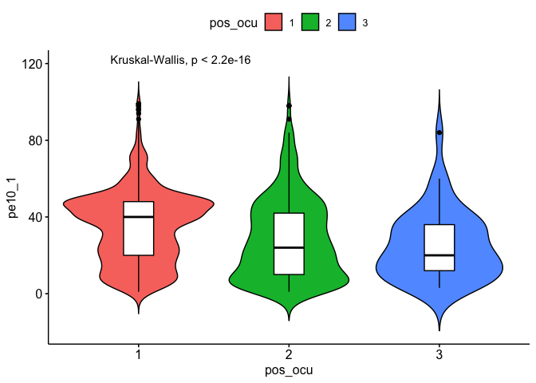<!-- -->

``` r
comparaciones <- list( c("1", "2"), c("2", "3"), c("1", "3") )
```

Un gráfiquito accesorio 2:

``` r
ecovid0420 %>% 
  filter(clase2==1) %>% 
ggpubr::ggviolin(x = "pos_ocu", y = "pe10_1", fill = "pos_ocu",
         palette = c("#00AFBB", "#E7B800", "#FC4E07"),
         add = "boxplot", add.params = list(fill = "white"))+
  stat_compare_means(comparisons = comparaciones, label = "p.signif")+ # Add significance levels
  stat_compare_means(label.y = 120)     # Add global the p-value 
```

    ## Warning: Removed 431 rows containing non-finite values (stat_ydensity).

    ## Warning: Removed 431 rows containing non-finite values (stat_boxplot).

    ## Warning: Removed 431 rows containing non-finite values (stat_signif).

    ## Warning: Removed 431 rows containing non-finite values (stat_compare_means).

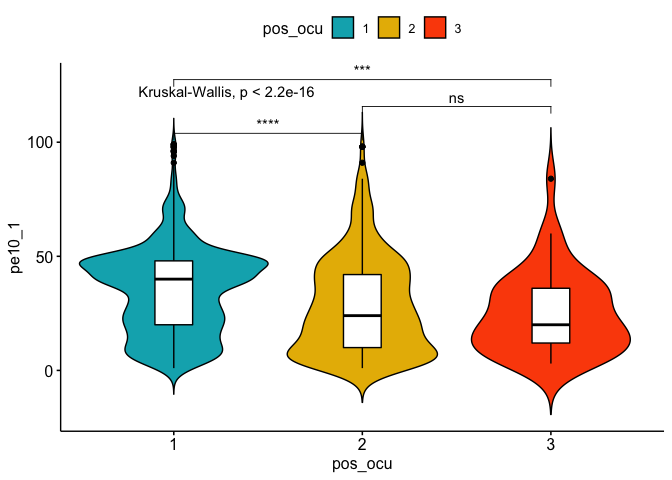<!-- -->

# Previo a los modelos

Vamos a hacer una sub-base de nuestras posibles variables explicativas.
Esto es importante porque sólo podemos comparar modelos con la misma
cantidad de observaciones.

``` r
mydata<- ecovid0420 %>% 
  filter(clase2==1) %>% # me quedo con los ocupados
  select(ent, pa1,starts_with("pb"), pos_ocu, pe10_1, fac_per, pa4_1)
tail(mydata)
```

    ## # A tibble: 6 x 9
    ##               ent   pa1      pb1   pb2          pb3 pos_ocu pe10_1 fac_per pa4_1
    ##         <dbl+lbl> <dbl> <dbl+lb> <dbl>    <dbl+lbl>   <dbl>  <dbl>   <dbl> <dbl>
    ## 1 26 [       Son…     4 2 [Muje…    39 8 [Licencia…       1     25   13874     1
    ## 2 19 [       Nue…     5 1 [Homb…    52 8 [Licencia…       1     60   23390     1
    ## 3 19 [       Nue…     2 2 [Muje…    45 3 [Secundar…       2      4   19967    NA
    ## 4  2 [       Baj…     4 1 [Homb…    20 4 [Preparat…       1     15   12885     1
    ## 5 19 [       Nue…     2 1 [Homb…    50 9 [Posgrado]       2     60   23390     1
    ## 6 24 [       San…     3 2 [Muje…    33 6 [Estudios…       1     NA    5498     1

``` r
gg <- ggplot(mydata, aes(pb2, log(pe10_1)))
gg +  geom_jitter()
```

    ## Warning: Removed 441 rows containing missing values (geom_point).

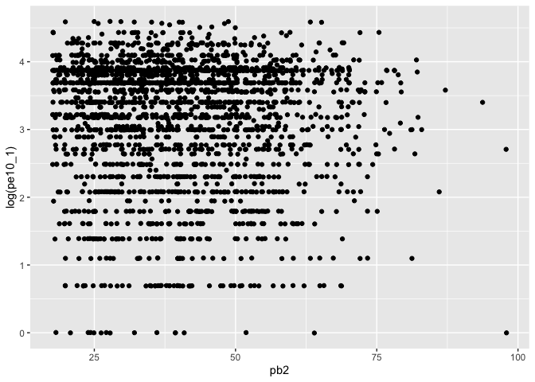<!-- -->

``` r
cor(mydata$pe10_1, mydata$pb2,  use = "pairwise")
```

    ## [1] -0.05585445

## Prueba de hipótesis para la correlación

Una prueba de hipotésis sobe la correlación

``` r
cor.test(mydata$pe10_1, mydata$pb2, use="pairwise.complete.obs")
```

    ## 
    ##  Pearson's product-moment correlation
    ## 
    ## data:  mydata$pe10_1 and mydata$pb2
    ## t = -2.769, df = 2450, p-value = 0.005666
    ## alternative hypothesis: true correlation is not equal to 0
    ## 95 percent confidence interval:
    ##  -0.09522854 -0.01630586
    ## sample estimates:
    ##         cor 
    ## -0.05585445

``` r
cor_test<-mydata %>% 
    with(cor.test(mydata$pe10_1, mydata$pb2, use = "pairwise")) # prueba de hipótesis.

#dos modos de visualizar el resultado
cor_test 
```

    ## 
    ##  Pearson's product-moment correlation
    ## 
    ## data:  mydata$pe10_1 and mydata$pb2
    ## t = -2.769, df = 2450, p-value = 0.005666
    ## alternative hypothesis: true correlation is not equal to 0
    ## 95 percent confidence interval:
    ##  -0.09522854 -0.01630586
    ## sample estimates:
    ##         cor 
    ## -0.05585445

``` r
tidy(cor_test)
```

    ## # A tibble: 1 x 8
    ##   estimate statistic p.value parameter conf.low conf.high method     alternative
    ##      <dbl>     <dbl>   <dbl>     <int>    <dbl>     <dbl> <chr>      <chr>      
    ## 1  -0.0559     -2.77 0.00567      2450  -0.0952   -0.0163 Pearson's… two.sided

# Modelo simple

\[y=\beta_o+\beta_1x +\epsilon\] Donde los parámetros \(\beta_o\) y
\(\beta_1\) describen la pendiente y el intercepto de la población,
respectivamente.

``` r
hist(mydata$pe10_1)
```

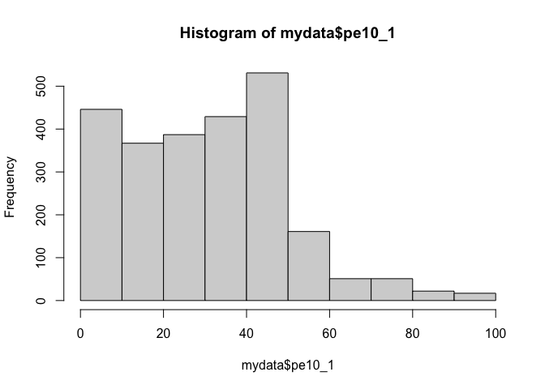<!-- -->

``` r
hist(log(mydata$pe10_1))
```

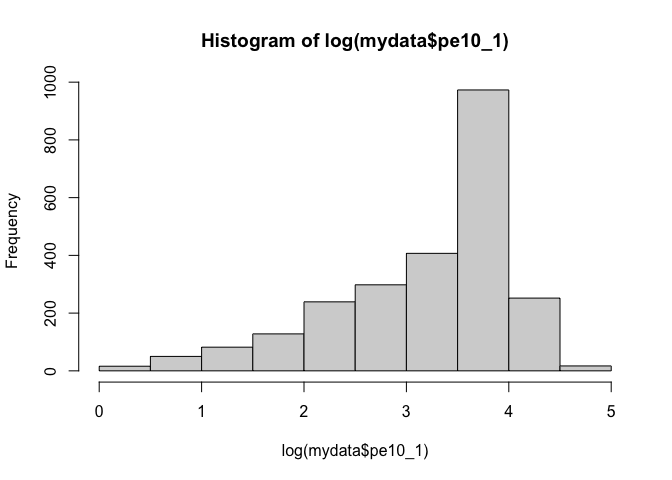<!-- -->

No está muy bien comportada, pero ligeramente es mejor con logaritmo

``` r
mydata$log_hrs<-log(mydata$pe10_1)
```

Una vez transformada nuestra variable, corremos el modelo

``` r
modelo <-lm(log_hrs ~pb2, data=mydata)
summary(modelo) # resultado forma1
```

    ## 
    ## Call:
    ## lm(formula = log_hrs ~ pb2, data = mydata)
    ## 
    ## Residuals:
    ##     Min      1Q  Median      3Q     Max 
    ## -3.2678 -0.4322  0.3079  0.6384  1.4541 
    ## 
    ## Coefficients:
    ##              Estimate Std. Error t value Pr(>|t|)    
    ## (Intercept)  3.320246   0.055613  59.703   <2e-16 ***
    ## pb2         -0.002913   0.001304  -2.234   0.0256 *  
    ## ---
    ## Signif. codes:  0 '***' 0.001 '**' 0.01 '*' 0.05 '.' 0.1 ' ' 1
    ## 
    ## Residual standard error: 0.8864 on 2450 degrees of freedom
    ##   (441 observations deleted due to missingness)
    ## Multiple R-squared:  0.002032,   Adjusted R-squared:  0.001625 
    ## F-statistic: 4.989 on 1 and 2450 DF,  p-value: 0.0256

Con “tidy()”

``` r
tidy(modelo) # Pruebas de hipótesis de los coeficientes
```

    ## # A tibble: 2 x 5
    ##   term        estimate std.error statistic p.value
    ##   <chr>          <dbl>     <dbl>     <dbl>   <dbl>
    ## 1 (Intercept)  3.32      0.0556      59.7   0     
    ## 2 pb2         -0.00291   0.00130     -2.23  0.0256

Para obtener los intervalos de confianza, podemos hacerlo a partir del
siguiente comando:

``` r
confint(modelo)
```

    ##                    2.5 %        97.5 %
    ## (Intercept)  3.211192569  3.4292993244
    ## pb2         -0.005470832 -0.0003556155

Para el ajuste global del modelo, podemos utilzar el comando “glance()”
sobre el objeto de nuestro modelo, ello nos dará la información
correspondiente:

``` r
glance(modelo) # resultado ajuste global
```

    ## # A tibble: 1 x 12
    ##   r.squared adj.r.squared sigma statistic p.value    df logLik   AIC   BIC
    ##       <dbl>         <dbl> <dbl>     <dbl>   <dbl> <dbl>  <dbl> <dbl> <dbl>
    ## 1   0.00203       0.00162 0.886      4.99  0.0256     1 -3183. 6371. 6389.
    ## # … with 3 more variables: deviance <dbl>, df.residual <int>, nobs <int>

Otra manera de ver este ajuste es con el comando “anova()”:

``` r
anova(modelo)
```

    ## Analysis of Variance Table
    ## 
    ## Response: log_hrs
    ##             Df  Sum Sq Mean Sq F value Pr(>F)  
    ## pb2          1    3.92  3.9200  4.9889 0.0256 *
    ## Residuals 2450 1925.07  0.7857                 
    ## ---
    ## Signif. codes:  0 '***' 0.001 '**' 0.01 '*' 0.05 '.' 0.1 ' ' 1

# Diagnósticos

``` r
plot(modelo)
```

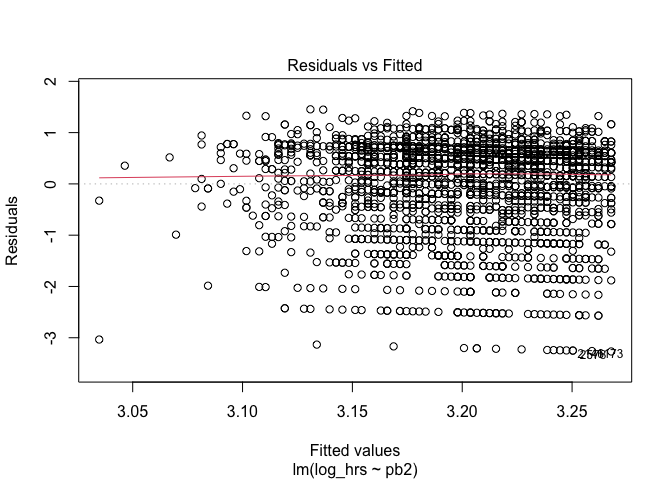<!-- -->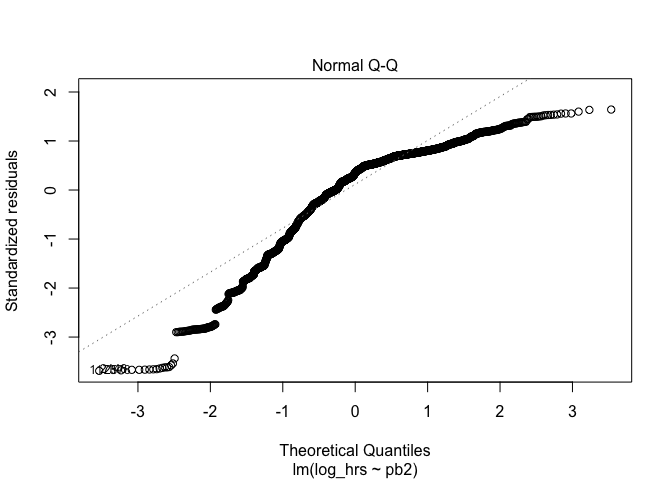<!-- -->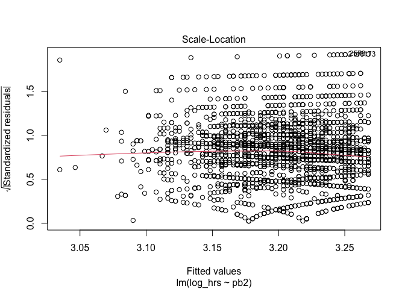<!-- -->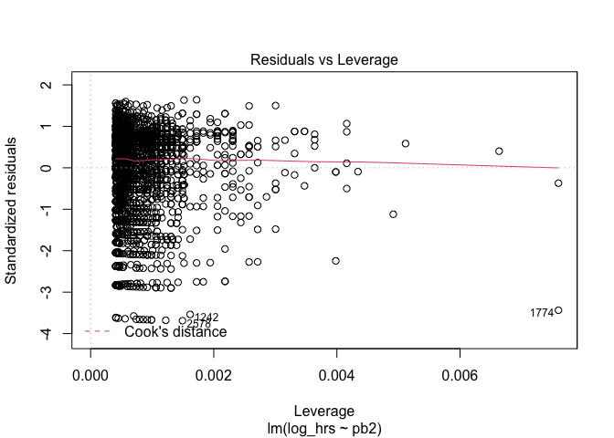<!-- -->

\#\#1. Outliers y Normalidad

``` r
# Assessing Outliers
outlierTest(modelo) # Bonferonni p-value for most extreme obs
```

    ## No Studentized residuals with Bonferroni p < 0.05
    ## Largest |rstudent|:
    ##       rstudent unadjusted p-value Bonferroni p
    ## 2578 -3.698805         0.00022138      0.54283

``` r
out<-outlierTest(modelo) # guardamos en objeto
```

``` r
ggpubr::ggqqplot(mydata$log_hrs)
```

    ## Warning: Removed 431 rows containing non-finite values (stat_qq).

    ## Warning: Removed 431 rows containing non-finite values (stat_qq_line).
    
    ## Warning: Removed 431 rows containing non-finite values (stat_qq_line).

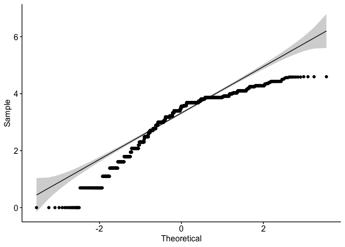<!-- -->

``` r
car::qqPlot(modelo, main="QQ Plot") #qq plot for studentized resid
```

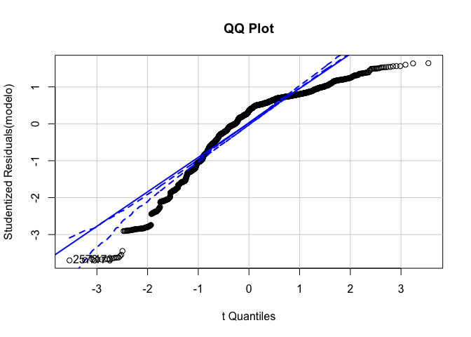<!-- -->

    ## [1] 1173 2578

\#\#2. Homocedasticidad

``` r
# non-constant error variance test
ncvTest(modelo)
```

    ## Non-constant Variance Score Test 
    ## Variance formula: ~ fitted.values 
    ## Chisquare = 0.06085727, Df = 1, p = 0.80515

``` r
# plot studentized residuals vs. fitted values 
spreadLevelPlot(modelo)
```

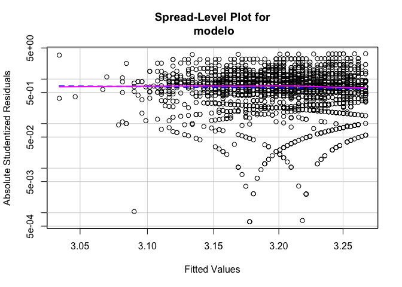<!-- -->

    ## 
    ## Suggested power transformation:  2.991869

# Regresión Lineal múltiple

## Agregando una variable categórica

Cuando nosotros tenemos una variable categórica para la condición de
sexo. \[nota: seguimos haciendo el ejercicio, a pesar de que ya
observamos en nuestro diagnóstico el modelo no cumple con los supuestos,
pero lo haremos para fines ilustrativos\]

``` r
modelo1<-lm(log_hrs ~pb2 + as_label(pb1), data=mydata, na.action=na.exclude)
summary(modelo1)
```

    ## 
    ## Call:
    ## lm(formula = log_hrs ~ pb2 + as_label(pb1), data = mydata, na.action = na.exclude)
    ## 
    ## Residuals:
    ##     Min      1Q  Median      3Q     Max 
    ## -3.4026 -0.4075  0.3126  0.6075  1.6483 
    ## 
    ## Coefficients:
    ##                     Estimate Std. Error t value Pr(>|t|)    
    ## (Intercept)         3.476409   0.057641  60.311  < 2e-16 ***
    ## pb2                -0.003514   0.001287  -2.731  0.00635 ** 
    ## as_label(pb1)Mujer -0.311275   0.035736  -8.710  < 2e-16 ***
    ## ---
    ## Signif. codes:  0 '***' 0.001 '**' 0.01 '*' 0.05 '.' 0.1 ' ' 1
    ## 
    ## Residual standard error: 0.8732 on 2449 degrees of freedom
    ##   (441 observations deleted due to missingness)
    ## Multiple R-squared:  0.03202,    Adjusted R-squared:  0.03123 
    ## F-statistic: 40.51 on 2 and 2449 DF,  p-value: < 2.2e-16

Este modelo tiene coeficientes que deben leerse “condicionados”. Es
decir, en este caso tenemos que el coeficiente asociado a la edad,
mantiene constante el valor de sexo y viceversa.

¿Cómo saber is ha mejorado nuestro modelo? Podemos comparar el ajuste
con la anova, es decir, una prueba F

``` r
pruebaf0<-anova(modelo, modelo1)
pruebaf0
```

    ## Analysis of Variance Table
    ## 
    ## Model 1: log_hrs ~ pb2
    ## Model 2: log_hrs ~ pb2 + as_label(pb1)
    ##   Res.Df    RSS Df Sum of Sq      F    Pr(>F)    
    ## 1   2450 1925.1                                  
    ## 2   2449 1867.2  1    57.846 75.869 < 2.2e-16 ***
    ## ---
    ## Signif. codes:  0 '***' 0.001 '**' 0.01 '*' 0.05 '.' 0.1 ' ' 1

Como puedes ver, el resultado muestra un Df de 1 (lo que indica que el
modelo más complejo tiene un parámetro adicional) y un valor p muy
pequeño (\<.001). Esto significa que agregar el sexo al modelo lleva a
un ajuste significativamente mejor sobre el modelo original.

Podemos seguir añadiendo variables sólo “sumando” en la función

``` r
modelo2<-lm(log_hrs ~ pb2 + as_label(pb1) + pa1, data=mydata, na.action=na.exclude)
summary(modelo2)
```

    ## 
    ## Call:
    ## lm(formula = log_hrs ~ pb2 + as_label(pb1) + pa1, data = mydata, 
    ##     na.action = na.exclude)
    ## 
    ## Residuals:
    ##     Min      1Q  Median      3Q     Max 
    ## -3.4002 -0.4101  0.3072  0.6057  1.6455 
    ## 
    ## Coefficients:
    ##                     Estimate Std. Error t value Pr(>|t|)    
    ## (Intercept)         3.503327   0.073489  47.671   <2e-16 ***
    ## pb2                -0.003639   0.001304  -2.791   0.0053 ** 
    ## as_label(pb1)Mujer -0.311466   0.035743  -8.714   <2e-16 ***
    ## pa1                -0.005274   0.008930  -0.591   0.5548    
    ## ---
    ## Signif. codes:  0 '***' 0.001 '**' 0.01 '*' 0.05 '.' 0.1 ' ' 1
    ## 
    ## Residual standard error: 0.8733 on 2448 degrees of freedom
    ##   (441 observations deleted due to missingness)
    ## Multiple R-squared:  0.03216,    Adjusted R-squared:  0.03097 
    ## F-statistic: 27.11 on 3 and 2448 DF,  p-value: < 2.2e-16

Y podemos ver si introducir esta variable afectó al ajuste global del
modelo

``` r
pruebaf1<-anova(modelo1, modelo2)
pruebaf1
```

    ## Analysis of Variance Table
    ## 
    ## Model 1: log_hrs ~ pb2 + as_label(pb1)
    ## Model 2: log_hrs ~ pb2 + as_label(pb1) + pa1
    ##   Res.Df    RSS Df Sum of Sq      F Pr(>F)
    ## 1   2449 1867.2                           
    ## 2   2448 1867.0  1   0.26602 0.3488 0.5548

Hoy que tenemos más variables podemos hablar de revisar dos supuestos
más.

## Otros supuestos

Además de los supuestos de la regresión simple, podemos revisar estos
otros. De nuevo, usaremos la librería “car”,

1.  Linealidad en los parámetros (será más díficil entre más variables
    tengamos)

2.  La normalidad también, porque debe ser multivariada

3.  Multicolinealidad La prueba más común es la de Factor Influyente de
    la Varianza (VIF) por sus siglas en inglés. La lógica es que la
    multicolinealidad tendrá efectos en nuestro R2, inflándolo. De ahí
    que observamos de qué variable(s) proviene este problema relacionado
    con la multicolinealidad.

Si el valor es mayor a 5, tenemos un problema muy grave.

``` r
vif(modelo2)
```

    ##           pb2 as_label(pb1)           pa1 
    ##      1.029809      1.002967      1.026847

## Tabla de modelos estimados

Para los muy avanzados, con el paquete “stargazer” se pueden pasar a
LaTeX fácilmente.

``` r
#stargazer(modelo0, modelo1,modelo2, type = 'latex', header=FALSE)
```

``` r
stargazer(modelo, modelo1,modelo2, type = 'text', header=FALSE)
```

    ## 
    ## ============================================================================================
    ##                                               Dependent variable:                           
    ##                     ------------------------------------------------------------------------
    ##                                                     log_hrs                                 
    ##                              (1)                     (2)                      (3)           
    ## --------------------------------------------------------------------------------------------
    ## pb2                        -0.003**               -0.004***                -0.004***        
    ##                            (0.001)                 (0.001)                  (0.001)         
    ##                                                                                             
    ## as_label(pb1)Mujer                                -0.311***                -0.311***        
    ##                                                    (0.036)                  (0.036)         
    ##                                                                                             
    ## pa1                                                                          -0.005         
    ##                                                                             (0.009)         
    ##                                                                                             
    ## Constant                   3.320***                3.476***                 3.503***        
    ##                            (0.056)                 (0.058)                  (0.073)         
    ##                                                                                             
    ## --------------------------------------------------------------------------------------------
    ## Observations                2,452                   2,452                    2,452          
    ## R2                          0.002                   0.032                    0.032          
    ## Adjusted R2                 0.002                   0.031                    0.031          
    ## Residual Std. Error   0.886 (df = 2450)       0.873 (df = 2449)        0.873 (df = 2448)    
    ## F Statistic         4.989** (df = 1; 2450) 40.505*** (df = 2; 2449) 27.113*** (df = 3; 2448)
    ## ============================================================================================
    ## Note:                                                            *p<0.1; **p<0.05; ***p<0.01

También la librería “sjPlot” tiene el comando “plot\_model()” (instala
el comando si no lo tienes)

``` r
library(sjPlot)
plot_model(modelo1)
```

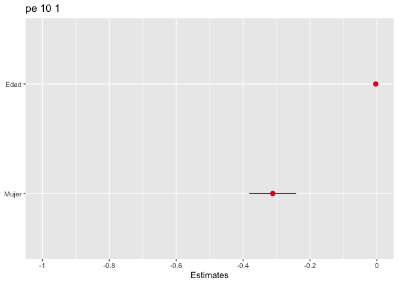<!-- -->

``` r
plot_models(modelo, modelo1, modelo2)
```

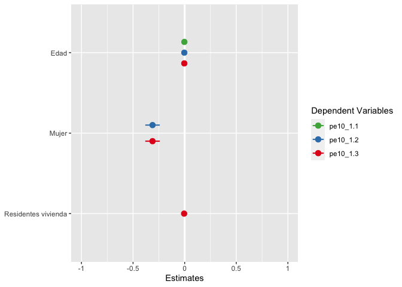<!-- -->
